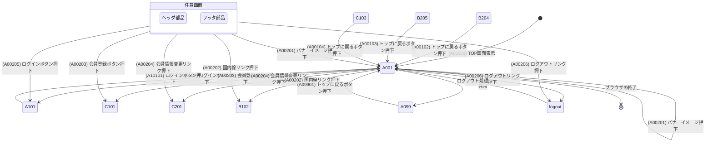
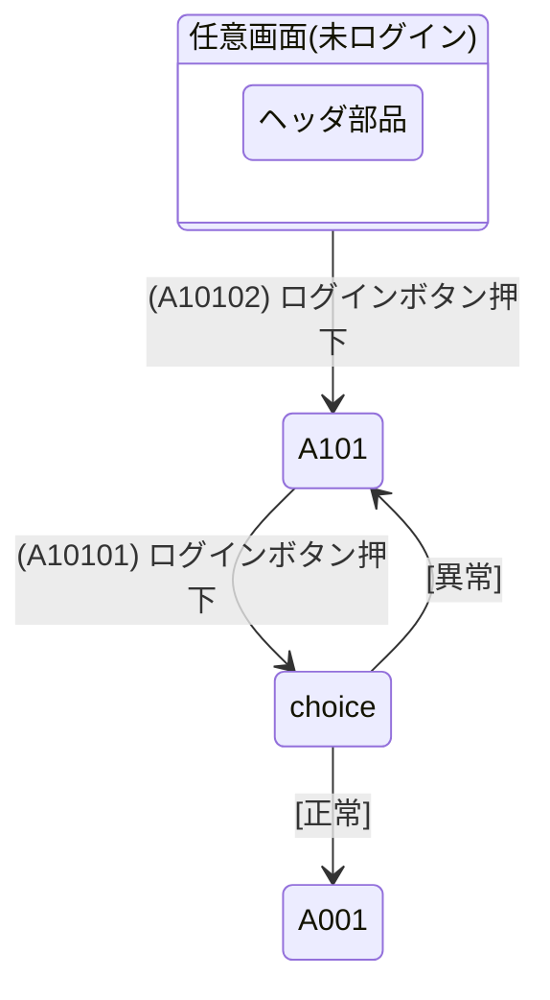
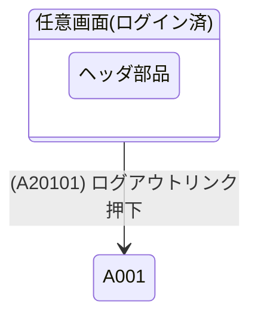
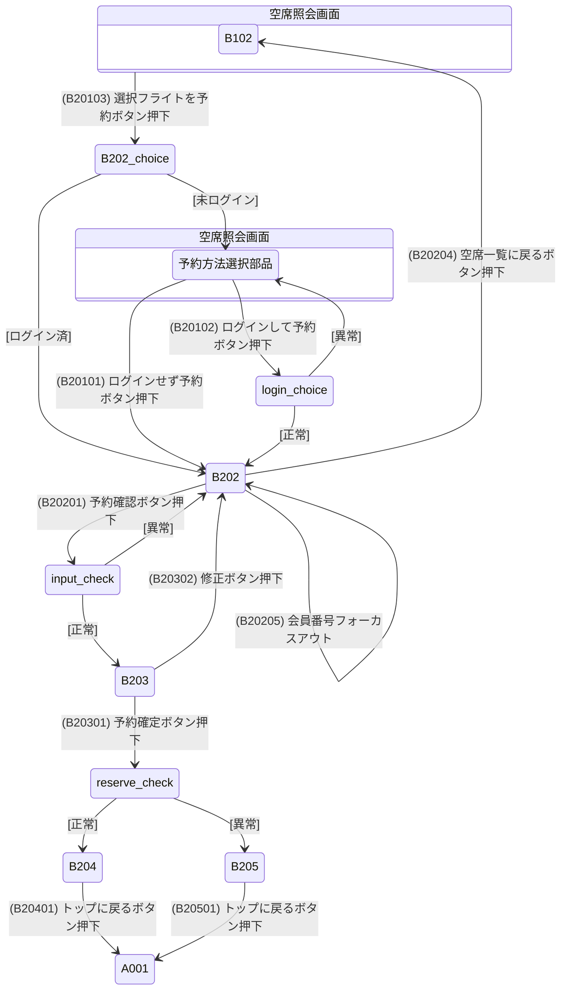
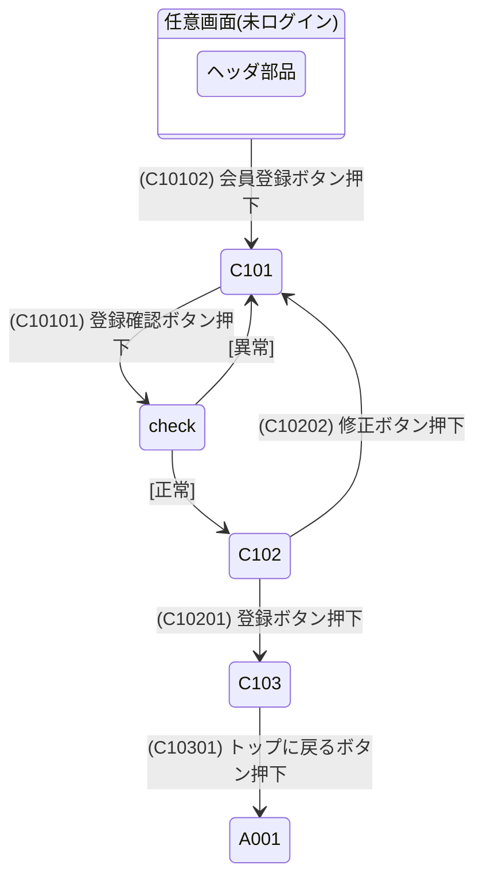
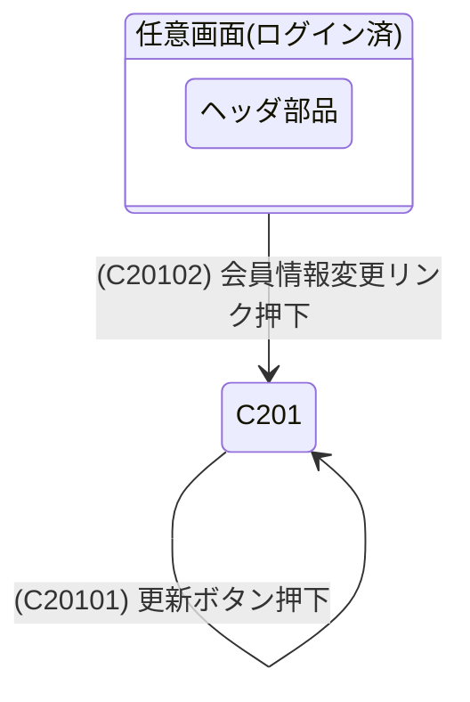
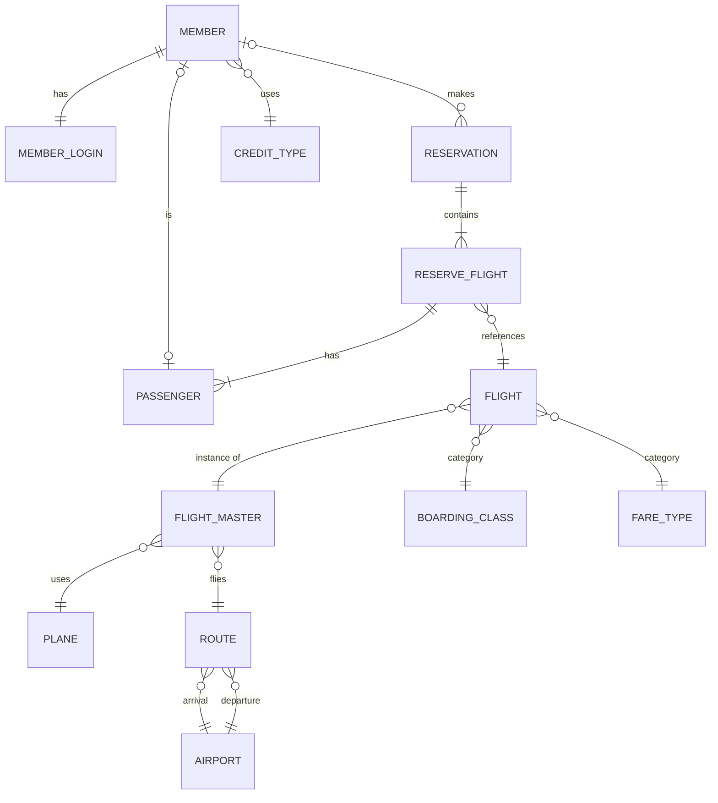

Macchinettaクライアント＋オンライン版(JSP)
サンプルアプリケーション

# 外部設計書

第1.7.0版

作成日：2015年2月27日
更新日：2020年6月29日

日本電信電話株式会社
サービスイノベーション総合研究所
ソフトウェアイノベーションセンタ

Copyright(c) 2015 NTT Corporation.

---

## 【改版履歴】

※本書固有の変更のみ記載する。Macchinettaオンライン版の共通的な変更はリリースノートを参照すること。

| 制改訂年月日 | 版数 | 制改訂理由 |
| :--- | :--- | :--- |
| 2015年2月27日 | 1.0版 | 初版制定 |
| 2017年5月31日 | 1.1版 | ・ マルチブラウザ・レガシーブラウザ対応の記述削除のため<br>・ サーバ資材についてMacchinettaオンライン版 V1.3.0に対応するため |
| 2019年3月25日 | 1.6.1版 | REST APIの記述追加のため |

Copyright(c) 2015 NTT Corporation.

---

## 目次

1 画面一覧 1-1
2 画面遷移図
A0 共通業務 2-A0-1
A1 航空チケット予約システムにログインする 2-A1-1
A2 航空チケット予約システムからログアウトする 2-A2-1
B1 フライトの空席状況を照会する 2-B1-1
B2 チケットを予約する 2-B2-1
C1 ATRSカード会員に入会する 2-C1-1
C2 ATRSカード会員情報を変更する 2-C2-1
3 画面仕様
共通仕様 3-1
A0-1 共通業務_TOP画面 3-A0-1-1
A0-2 共通業務_ヘッダ部品 3-A0-2-1
A0-3 共通業務_フッタ部品 3-A0-3-1
A0-4 共通業務_ATRS共通エラー画面 3-A0-4-1
A1-1 航空チケット予約システムにログインする_ログイン画面 3-A1-1-1
B1-1 フライトの空席状況を照会する_空席照会条件入力部品 3-B1-1-1
B1-2 フライトの空席状況を照会する_空席照会画面 3-B1-2-1
B2-1 チケットを予約する_予約方法選択部品 3-B2-1-1
B2-2 チケットを予約する_お客様情報入力画面 3-B2-2-1
B2-3 チケットを予約する_申し込み内容確認画面 3-B2-3-1
B2-4 チケットを予約する_予約完了画面 3-B2-4-1
B2-5 チケットを予約する_予約失敗画面 3-B2-5-1
C1-1 ATRSカード会員に入会する_会員情報登録画面 3-C1-1-1
C1-2 ATRSカード会員に入会する_会員登録確認画面 3-C1-2-1
C1-3 ATRSカード会員に入会する_会員登録完了画面 3-C1-3-1
C2-1 ATRSカード会員情報を変更する_会員情報変更画面 3-C2-1-1
4 イベント一覧 4-1
5 イベント仕様
A0 共通業務 5-A0-1
A1 航空チケット予約システムにログインする 5-A1-1
A2 航空チケット予約システムからログアウトする 5-A2-1
B1 フライトの空席状況を照会する 5-B1-1
B2 チケットを予約する 5-B2-1
C1 ATRSカード会員に入会する 5-C1-1
C2 ATRSカード会員情報を変更する 5-C2-1
6 メッセージ一覧 6-1
7 テーブル一覧 7-1
8 テーブル定義表 8-1
9 実体関連図 9-1
10 コード一覧 10-1
11 コード値一覧 11-1

Copyright(c) 2015 NTT Corporation.

---

## 1 画面一覧

システム名：航空チケット予約システム

| No. | ユースケースグループ名 | ユースケース名 | 画面ID | 画面名 | 説明 | 備考 |
| :--- | :--- | :--- | :--- | :--- | :--- | :--- |
| 1 | 共通業務 | 共通業務 | A001 | TOP画面 | 航空チケット予約システム利用者が最初にアクセスするTOP画面。 | |
| 2 | | | A002 | ヘッダ部品 | 全画面共通のヘッダ画面。 | 部品として利用する。 |
| 3 | | | A003 | フッタ部品 | 全画面共通のフッタ画面。 | 部品として利用する。 |
| 4 | | | A099 | ATRS共通エラー画面 | 航空チケット予約システム共通のエラー画面。 | |
| 5 | 航空チケット予約システムにログインする | | A101 | ログイン画面 | ATRSカード会員がシステムにログインを依頼する場合に利用する画面。 | |
| 6 | フライトの空席状況を照会する | | B101 | 空席照会条件入力部品 | 航空チケット予約システム利用者が空席状況の照会条件を入力する画面。 | TOP画面、空席照会画面内で部品として利用する。 |
| 7 | | | B102 | 空席照会画面 | 航空チケット予約システム利用者が空席状況の照会をシステムに依頼する場合に利用する画面。 | |
| 8 | チケット予約サービス | チケットを予約する | B201 | 予約方法選択部品 | 航空チケット予約システム利用者が予約方法を選択する画面。 | 空席照会画面内で部品として利用する。 |
| 9 | | | B202 | お客様情報入力画面 | 航空チケット予約システム利用者が予約に必要な情報を入力する画面。 | |
| 10 | | | B203 | 申し込み内容確認画面 | 航空チケット予約システム利用者が入力した情報を確認する画面。 | |
| 11 | | | B204 | 予約完了画面 | 航空チケット予約システム利用者が依頼した予約が成功した旨を表示する画面。 | |
| 12 | | | B205 | 予約失敗画面 | 航空チケット予約システム利用者が依頼した予約が失敗した旨を表示する画面。 | |
| 13 | ATRSカード会員サービス | ATRSカード会員に入会する | C101 | 会員情報登録画面 | 一般ユーザがATRSカード会員に入会する為の会員情報を入力する画面。 | |
| 14 | | | C102 | 会員登録確認画面 | 一般ユーザが入力した会員情報を確認する画面。 | |
| 15 | | | C103 | 会員登録完了画面 | ATRSカード会員への入会が成功した旨を表示する画面。 | |
| 16 | | ATRSカード会員情報を変更する | C201 | 会員情報変更画面 | ATRSカード会員が会員情報を変更する場合に利用する画面。 | |

Copyright(c) 2015 NTT Corporation. 1-1

---

## 2 画面遷移図

システム名：航空チケット予約システム
ユースケースグループ：共通業務
ユースケース：共通業務

### A0 共通業務



Copyright(c) 2015 NTT Corporation. 2-A0-1

---

### A1 航空チケット予約システムにログインする

システム名：航空チケット予約システム
ユースケースグループ：共通業務
ユースケース：航空チケット予約システムにログインする



Copyright(c) 2015 NTT Corporation. 2-A1-1

---

### A2 航空チケット予約システムからログアウトする

システム名：航空チケット予約システム
ユースケースグループ：共通業務
ユースケース：航空チケット予約システムからログアウトする



Copyright(c) 2015 NTT Corporation. 2-A2-1

---

### B1 フライトの空席状況を照会する

システム名：航空チケット予約システム
ユースケースグループ：チケット予約サービス
ユースケース：フライトの空席状況を照会する

```mermaid
stateDiagram-v2
    state "任意画面" as any {
        A002: ヘッダ部品
    }
    any --> B102: (B10210) 国内線リンク押下
    
    state "TOP画面" as top {
        B101: 空席照会条件入力部品
    }
    top --> B102: (B10101) 照会ボタン押下
    
    state "空席照会画面" as search {
        B101: 空席照会条件入力部品
        B102: 空席照会画面
    }
    search --> B102: (B10102) 照会ボタン押下
    search --> B102: (B10202) 前日空席照会ボタン押下(往路)
    search --> B102: (B10203) 翌日空席照会ボタン押下(往路)
    search --> B102: (B10204) ページネーションリンク押下(往路)
    search --> B102: (B10205) 空席状況一覧ヘッダ押下(往路)
    search --> B102: (B10206) 前日空席照会ボタン押下(復路)
    search --> B102: (B10207) 翌日空席照会ボタン押下(復路)
    search --> B102: (B10208) ページネーションリンク押下(復路)
    search --> B102: (B10209) 空席状況一覧ヘッダ押下(復路)
    
    search --> B202_choice: (B10201) 選択フライトを予約ボタン押下
    
    state B202_choice <<choice>>
    B202_choice --> B202: [ログイン済]
    B202_choice --> B201_modal: [未ログイン]
    
    state "空席照会画面" as search_modal {
        B201: 予約方法選択部品
    }
    B201_modal: ※モーダルダイアログ表示
    
    search_modal --> B202: (B20101) ログインせず予約ボタン押下
    search_modal --> B202: (B20102) ログインして予約ボタン押下
    
    search --> search: (B10211) 空席一覧に戻るボタン押下
```

Copyright(c) 2015 NTT Corporation. 2-B1-1

---

### B2 チケットを予約する

システム名：航空チケット予約システム
ユースケースグループ：チケット予約サービス
ユースケース：チケットを予約する



Copyright(c) 2015 NTT Corporation. 2-B2-1

---

### C1 ATRSカード会員に入会する

システム名：航空チケット予約システム
ユースケースグループ：ATRSカード会員サービス
ユースケース：ATRSカード会員に入会する



Copyright(c) 2015 NTT Corporation. 2-C1-1

---

### C2 ATRSカード会員情報を変更する

システム名：航空チケット予約システム
ユースケースグループ：ATRSカード会員サービス
ユースケース：ATRSカード会員情報を変更する



Copyright(c) 2015 NTT Corporation. 2-C2-1

---

## 3 画面仕様

### 共通仕様

システム名：航空チケット予約システム

#### 1. レイアウト共通仕様
システム共通のレイアウト仕様を定義する。

##### (1) レスポンシブウェブデザイン
全画面レスポンシブウェブデザインとする。
Bootstrapを用いて実現し、レイアウト分岐点となる幅は横幅992pxとする。
横幅が992px未満の場合、レイアウトを組み替え、縦長に表示する。（これを「縦レイアウト」と呼ぶ）

Copyright(c) 2015 NTT Corporation. 3-1

---

#### 2. 共通コンポーネント仕様
システムで共通使用するコンポーネントの仕様を定義する。

##### (1) 日付入力カレンダー
日付入力項目は、bootstrap-datepickerを用いたカレンダー入力とする。
設定値は以下の通りとする。

| 設定項目 | 設定値 |
| :--- | :--- |
| 日付形式(format) | yyyy/mm/dd |
| 言語(language) | ja(日本語) |
| 日付選択時の自動クローズ(autoclose) | true(閉じる) |

カレンダーのレイアウト、操作イメージを以下に示す。

① 対象フィールドがフォーカスされるとカレンダーを表示する。
② カレンダーの日付が選択されると、選択日付を"yyyy/MM/dd"形式で対象フィールドに入力し、カレンダーを閉じる。

（画像：カレンダーレイアウト・操作イメージ）

#### 3. Ajaxを用いた通信処理仕様
Web APIイベントは、Ajaxを用いた通信処理で呼び出す。以下に処理仕様を定義する。

##### (1) タイムアウト
非同期通信時はタイムアウトを設定する。設定値は以下とする。

| 設定項目 | 設定値 |
| :--- | :--- |
| タイムアウト値 | 15秒 |

##### (2) システムエラー時の処理仕様
Ajaxから呼び出した処理でシステムエラーが発生した場合は、呼出し元画面にエラーメッセージを表示する。
システムエラー時のメッセージは、サーバ処理でメッセージ設定されないケースを考慮し、クライアントに定義して表示する。

#### 4. 入力値チェック仕様
クライアント側で行う入力値チェックの仕様を定義する。

##### (1) チェックタイミング
クライアント側の入力値チェックは、チェックを要するイベント発出時に加え、入力後にフォーカスが外れたタイミングでも実施する。
また、再フォーカス時は、入力値変更のタイミングでチェックする。

##### (2) 入力値エラーメッセージ表示仕様
クライアント側で行うチェックのエラーメッセージ表示仕様は、以下の通りとする。

| 項目 | 内容 |
| :--- | :--- |
| 位置 | 対象項目の下 |
| 色 | 赤茶色(#a94442) |
| スタイル | 太字 |

表示イメージ：
生年月日 [ (入力欄) ]
　　　　 入力必須項目です。

#### 5. その他共通仕様
その他のシステム共通仕様を定義する。

##### (1) ウィンドウタイトル
以下の書式でウィンドウタイトルを付与する。
《画面名略称》△|△Airline Ticket Reservation System
△・・・半角スペース
画面名略称は以下の通りとする。

| 画面ID | 画面名 | 画面名略称 |
| :--- | :--- | :--- |
| A001 | TOP画面 | なし(「Airline Ticket Reservation System」のみ) |
| A099 | ATRS共通エラー画面 | エラー |
| A101 | ログイン画面 | ログイン |
| B102 | 空席照会画面 | 空席照会 |
| B101 | 空席照会条件入力部品 | 照会 |
| B201 | 予約方法選択部品 | 予約 |
| B202 | お客様情報入力画面 | 予約 |
| B203 | 申し込み内容確認画面 | 予約内容確認 |
| B204 | 予約完了画面 | 予約完了 |
| B205 | 予約失敗画面 | 予約エラー |
| C101 | 会員情報登録画面 | 会員登録 |
| C102 | 会員登録確認画面 | 会員登録確認 |
| C103 | 会員登録完了画面 | 会員登録完了 |
| C201 | 会員情報変更画面 | 会員情報変更 |

Copyright(c) 2015 NTT Corporation. 3-2

---

### A0-1 共通業務_TOP画面

#### 画面名：TOP画面
#### 画面ID：A001

（画像：TOP画面レイアウト）

##### 凡例
- クライアント側で動的に作る項
- 画面項目
- インクルードされる範囲

Copyright(c) 2015 NTT Corporation. 3-A0-1-1

---

#### 項目定義

| No. | 論理項目名 | 論理項目種別 | 入力 | 出力 | 必須 | 入力桁数(最小) | 入力桁数(最大) | 文字種別 | その他入力条件 | 初期値 | 表示条件など | 発行イベントID | チェックタイミング |
| :--- | :--- | :--- | :--- | :--- | :--- | :--- | :--- | :--- | :--- | :--- | :--- | :--- | :--- |
| 1 | 空席照会条件入力フォーム | - | - | - | - | - | - | - | - | - | - | - | - |
| 2 | フライト種別 | ラジオボタン | ○ | - | ○ | - | - | - | 往復か片道のいずれかであること。 | "往復" | 往復、片道。 | B10103(オンチェンジ) | ○ |
| 3 | 区間(出発空港) | リストボックス | ○ | - | ○ | - | - | - | 空港名リストのいずれかであること。補足票参照。 | "東京(羽田)" | 補足票参照。 | - | ○ |
| 4 | 区間(到着空港) | リストボックス | ○ | - | ○ | - | - | - | 出発空港と到着空港が異なること。空港名リストのいずれかであること。補足票参照。 | "東京(羽田)" | 補足票参照。 | - | ○ |
| 5 | 往路搭乗日 | テキストボックス | ○ | - | ○ | 10 | 10 | 半角文字 | 有効な日付であること。 | システム日付 | 日付入力カレンダーにて入力する。カレンダーの入力可能範囲は、空席照会可能時期内とする。 | - | ○ |
| 6 | 復路搭乗日 | テキストボックス | ○ | - | △ | 10 | 10 | 半角文字 | フライト種別が"往復"の場合必須。有効な日付であること。往路搭乗日以降である(往路搭乗日≦復路搭乗日)。 | システム日付 | フライト種別が"片道"の場合は表示しない。日付入力カレンダーにて入力する。カレンダーの入力可能範囲は、空席照会可能時期内とする。 | - | ○ |
| 7 | 搭乗クラス | ラジオボタン | ○ | - | ○ | - | - | - | 一般席、特別席のいずれかであること。 | "一般席" | 一般席、特別席。 | - | ○ |
| 8 | 照会ボタン | ボタン | - | - | - | - | - | - | - | - | - | B10101 (TOP画面)、B10102 (空席照会画面) | - |

Copyright(c) 2015 NTT Corporation. 3-A0-1-4

---

### A0-2 共通業務_ヘッダ部品

#### 画面名：ヘッダ部品
#### 画面ID：A002

（画像：ヘッダ部品レイアウト）

ヘッダ部品
（全画面にインクルードされている）

Copyright(c) 2015 NTT Corporation. 3-A0-2-1

---

#### 項目定義

| No. | 論理項目名 | 論理項目種別 | 入力 | 出力 | 必須 | 入力桁数(最小) | 入力桁数(最大) | 文字種別 | その他入力条件 | 初期値 | 表示条件など | 発行イベントID | チェックタイミング |
| :--- | :--- | :--- | :--- | :--- | :--- | :--- | :--- | :--- | :--- | :--- | :--- | :--- | :--- |
| 1 | バナーイメージ | イメージリンク | - | - | - | - | - | - | - | - | - | A00201 | - |
| 2 | 国内線リンク | リンク | - | - | - | - | - | - | - | - | - | A00202 | - |
| 3 | 会員登録ボタン | ボタン | - | - | - | - | - | - | - | - | ログイン済みの場合は表示しない。 | A00203 | - |
| 4 | ログインボタン | ボタン | - | - | - | - | - | - | - | - | ログイン済みの場合は表示しない。 | A00205 | - |
| 5 | ログインユーザメニュー | - | - | - | - | - | - | - | - | - | 未ログインの場合は表示しない。 | - | - |
| 6 | ログインユーザ名 | ラベル | - | ○ | - | - | - | - | お客様氏名(姓)(名)を表示する。 | - | - | A00207 | - |
| 7 | 会員情報変更リンク | リンク | - | - | - | - | - | - | - | - | ログインユーザ名押下で表示・非表示を切り替える。 | A00204 | - |
| 8 | ログアウトリンク | リンク | - | - | - | - | - | - | - | - | ログインユーザ名押下で表示・非表示を切り替える。 | A00206 | - |

Copyright(c) 2015 NTT Corporation. 3-A0-2-4

---

### A0-3 共通業務_フッタ部品

#### 画面名：フッタ部品
#### 画面ID：A003

（画像：フッタ部品レイアウト）

フッタ部品
（全画面にインクルードされている）

Copyright(c) 2015 NTT Corporation. 3-A0-3-1

---

#### 項目定義

| No. | 論理項目名 | 論理項目種別 | 入力 | 出力 | 必須 | 入力桁数(最小) | 入力桁数(最大) | 文字種別 | その他入力条件 | 初期値 | 表示条件など | 発行イベントID | チェックタイミング |
| :--- | :--- | :--- | :--- | :--- | :--- | :--- | :--- | :--- | :--- | :--- | :--- | :--- | :--- |
| 1 | コピーライト | ラベル | - | ○ | - | - | - | - | "Copyright © 2015 NTT. "を固定表示。 | - | - | - | - |

Copyright(c) 2015 NTT Corporation. 3-A0-3-3

---

### A0-4 共通業務_ATRS共通エラー画面

#### 画面名：ATRS共通エラー画面
#### 画面ID：A099

（画像：ATRS共通エラー画面レイアウト）

Copyright(c) 2015 NTT Corporation. 3-A0-4-1

---

#### 項目定義

| No. | 論理項目名 | 論理項目種別 | 入力 | 出力 | 必須 | 入力桁数(最小) | 入力桁数(最大) | 文字種別 | その他入力条件 | 初期値 | 表示条件など | 発行イベントID | チェックタイミング |
| :--- | :--- | :--- | :--- | :--- | :--- | :--- | :--- | :--- | :--- | :--- | :--- | :--- | :--- |
| 1 | メッセージ | ラベル | - | ○ | - | - | - | - | - | - | - | - | - |
| 2 | トップに戻るボタン | ボタン | - | - | - | - | - | - | - | - | - | A09901 | - |

Copyright(c) 2015 NTT Corporation. 3-A0-4-3

---

### A1-1 航空チケット予約システムにログインする_ログイン画面

#### 画面名：ログイン画面
#### 画面ID：A101

（画像：ログイン画面レイアウト）

Copyright(c) 2015 NTT Corporation. 3-A1-1-1

---

#### 項目定義

| No. | 論理項目名 | 論理項目種別 | 入力 | 出力 | 必須 | 入力桁数(最小) | 入力桁数(最大) | 文字種別 | その他入力条件 | 初期値 | 表示条件など | 発行イベントID | チェックタイミング |
| :--- | :--- | :--- | :--- | :--- | :--- | :--- | :--- | :--- | :--- | :--- | :--- | :--- | :--- |
| 1 | お客様情報入力フォーム | - | - | - | - | - | - | - | - | - | - | - | - |
| 2 | 会員番号 | テキストボックス | ○ | - | ○ | 10 | 10 | 半角数字 | - | - | - | - | ○ |
| 3 | パスワード | パスワードボックス | ○ | - | ○ | 8 | 20 | 全角+半角文字 | - | - | - | - | ○ |
| 4 | ログインボタン | ボタン | - | - | - | - | - | - | - | - | - | A10101 | - |
| 5 | メッセージ | ラベル | - | ○ | - | - | - | - | - | - | - | - | - |

Copyright(c) 2015 NTT Corporation. 3-A1-1-4

---

### B1-1 フライトの空席状況を照会する_空席照会条件入力部品

#### 画面名：空席照会条件入力部品
#### 画面ID：B101

（画像：空席照会条件入力部品レイアウト）

空席照会条件入力部品
（TOP画面と空席照会画面にインクルードされている）

Copyright(c) 2015 NTT Corporation. 3-B1-1-1

---

#### 項目定義

| No. | 論理項目名 | 論理項目種別 | 入力 | 出力 | 必須 | 入力桁数(最小) | 入力桁数(最大) | 文字種別 | その他入力条件 | 初期値 | 表示条件など | 発行イベントID | チェックタイミング |
| :--- | :--- | :--- | :--- | :--- | :--- | :--- | :--- | :--- | :--- | :--- | :--- | :--- | :--- |
| 1 | 空席照会条件入力フォーム | - | - | - | - | - | - | - | - | - | - | - | - |
| 2 | フライト種別 | ラジオボタン | ○ | - | ○ | - | - | - | 往復か片道のいずれかであること。 | "往復" | 往復、片道。 | B10103(オンチェンジ) | ○ |
| 3 | 区間(出発空港) | リストボックス | ○ | - | ○ | - | - | - | 空港テーブルから取得した空港名のリストの前に以下のリストを付け加えたものを表示する。「1 東京(羽田)」「2 東京(成田)」...「10 -----------」。詳細は補足票参照。 | "東京(羽田)" | 補足票参照。 | - | ○ |
| 4 | 区間(到着空港) | リストボックス | ○ | - | ○ | - | - | - | 出発空港と到着空港が異なること。空港テーブルから取得した空港名のリストの前に以下のリストを付け加えたものを表示する。「1 東京(羽田)」「2 東京(成田)」...「10 -----------」。詳細は補足票参照。 | "東京(羽田)" | 補足票参照。 | - | ○ |
| 5 | 往路搭乗日 | テキストボックス | ○ | - | ○ | 10 | 10 | 半角文字 | 有効な日付であること。 | システム日付 | 日付入力カレンダーにて入力する。カレンダーの入力可能範囲は、空席照会可能時期内とする。 | - | ○ |
| 6 | 復路搭乗日 | テキストボックス | ○ | - | △ | 10 | 10 | 半角文字 | フライト種別が"往復"の場合必須。有効な日付であること。往路搭乗日以降である(往路搭乗日≦復路搭乗日)。 | システム日付 | フライト種別が"片道"の場合は表示しない。日付入力カレンダーにて入力する。カレンダーの入力可能範囲は、空席照会可能時期内とする。 | - | ○ |
| 7 | 搭乗クラス | ラジオボタン | ○ | - | ○ | - | - | - | 一般席、特別席のいずれかであること。 | "一般席" | 一般席、特別席。 | - | ○ |
| 8 | 照会ボタン | ボタン | - | - | - | - | - | - | - | - | - | B10101 (TOP画面)、B10102 (空席照会画面) | - |

Copyright(c) 2015 NTT Corporation. 3-B1-1-4

---

### B1-2 フライトの空席状況を照会する_空席照会画面

#### 画面名：空席照会画面
#### 画面ID：B102

（画像：空席照会画面レイアウト）

Copyright(c) 2015 NTT Corporation. 3-B1-2-1

---

#### 項目定義

| No. | 論理項目名 | 論理項目種別 | 入力 | 出力 | 必須 | 入力桁数(最小) | 入力桁数(最大) | 文字種別 | その他入力条件 | 初期値 | 表示条件など | 発行イベントID | チェックタイミング |
| :--- | :--- | :--- | :--- | :--- | :--- | :--- | :--- | :--- | :--- | :--- | :--- | :--- | :--- |
| 1 | お知らせ情報 | - | - | - | - | - | - | - | - | - | 照会前の場合非表示。 | - | - |
| 2 | 空席照会可能時期(始) | ラベル | - | ○ | - | - | - | - | "MM月dd日"で出力。 | - | - | - | - |
| 3 | 空席照会可能時期(終) | ラベル | - | ○ | - | - | - | - | "MM月dd日"で出力。 | - | - | - | - |
| 4 | 予約フライト選択フォーム | - | - | - | - | - | - | - | - | - | - | - | - |
| 5 | 往路便の選択情報 | - | - | - | - | - | - | - | - | - | - | - | - |
| 6 | 前日空席照会ボタン | リンク | - | - | - | - | - | - | 前日が空席照会可能時期外の場合無効化する。 | - | - | B10202 | - |
| 7 | 翌日空席照会ボタン | リンク | - | - | - | - | - | - | 翌日が空席照会可能時期外の場合無効化する。 | - | - | B10203 | - |
| 8 | 搭乗日 | ラベル | - | ○ | - | - | - | - | "ｙｙｙｙ/MM/dd"の形式で出力。 | - | - | - | - |
| 9 | 空席状況一覧 | - | - | - | - | - | - | - | - | - | 往路の空席状況一覧。詳細は「No18.空席状況一覧」参照。 | - | - |
| 10 | 復路便の選択情報 | - | - | - | - | - | - | - | - | - | 照会条件をフライト種別"片道"で照会した場合は表示しない。 | - | - |
| 11 | 前日空席照会ボタン | リンク | - | - | - | - | - | - | 復路選択時、前日が空席照会可能時期外の場合無効化する。 | - | 往路便の選択情報欄参照。 | B10206 | - |
| 12 | 翌日空席照会ボタン | リンク | - | - | - | - | - | - | 復路選択時、翌日が空席照会可能時期外の場合無効化する。 | - | 往路便の選択情報欄参照。 | B10207 | - |
| 13 | 搭乗日 | ラベル | - | ○ | - | - | - | - | "ｙｙｙｙ/MM/dd"の形式で出力。 | - | 往路便の選択情報欄参照。 | - | - |
| 14 | 空席状況一覧 | - | - | - | - | - | - | - | - | - | 復路の空席状況一覧。詳細は「No18.空席状況一覧」参照。 | - | - |
| 15 | 選択フライトを予約ボタン | ボタン | - | - | - | - | - | - | - | - | - | B10201 | - |
| 16 | 予約方法選択ダイアログ | - | - | - | - | - | - | - | - | - | 「予約方法選択部品(B201)」画面仕様参照。 | - | - |
| 17 | メッセージ | ラベル | - | ○ | - | - | - | - | - | - | 表示された状態で空席照会時、エラーがない場合は非表示とする。 | - | - |
| 18 | 空席状況一覧 | - | - | - | - | - | - | - | - | - | 補足票参照。 | - | - |
| 19 | 空席状況一覧ヘッダ | リンク | - | - | - | - | - | - | - | - | 補足票参照。 | 往路：B10205<br>復路：B10209 | - |
| 20 | 運賃種別名 | ラベル | - | ○ | - | - | - | - | - | - | 補足票参照。 | - | - |
| 21 | 便名 | ラベル | - | ○ | - | - | - | - | - | - | 補足票参照。 | - | - |
| 22 | 出発時刻 | ラベル | - | ○ | - | - | - | - | "hh:mm"の形式で出力。 | - | - | - | - |
| 23 | 区間(出発空港) | ラベル | - | ○ | - | - | - | - | - | - | - | - | - |
| 24 | 到着時刻 | ラベル | - | ○ | - | - | - | - | "hh:mm"の形式で出力。 | - | - | - | - |
| 25 | 区間(到着空港) | ラベル | - | ○ | - | - | - | - | - | - | - | - | - |
| 26 | 運賃種別一覧 | ラジオボタン | ○ | - | △ | - | - | - | 往路は必須。復路はフライト種別"往復"の場合必須。 | - | 補足票参照。 | - | ○ |
| 27 | 運賃 | ラベル | - | ○ | - | - | - | - | "\###,###"の形式で出力。 | - | - | - | - |
| 28 | 空席数 | ラベル | - | ○ | - | - | - | - | - | - | 補足票参照。 | - | - |
| 29 | ページネーションリンク | ページネーションリンク | - | - | - | - | - | - | - | - | 補足票参照。 | 往路：B10204<br>復路：B10208 | - |
| 30 | 前の10件リンク | リンク | - | - | - | - | - | - | - | - | 補足票参照。 | - | - |
| 31 | 次の10件リンク | リンク | - | - | - | - | - | - | - | - | 補足票参照。 | - | - |
| 32 | ページネーション情報 | ラベル | - | ○ | - | - | - | - | - | - | 補足票参照。 | - | - |

Copyright(c) 2015 NTT Corporation. 3-B1-2-15

---

### B2-1 チケットを予約する_予約方法選択部品

#### 画面名：予約方法選択部品
#### 画面ID：B201

（画像：予約方法選択部品レイアウト）

予約方法選択部品
（空席照会画面内で部品として利用する）

Copyright(c) 2015 NTT Corporation. 3-B2-1-1

---

#### 項目定義

| No. | 論理項目名 | 論理項目種別 | 入力 | 出力 | 必須 | 入力桁数(最小) | 入力桁数(最大) | 文字種別 | その他入力条件 | 初期値 | 表示条件など | 発行イベントID | チェックタイミング |
| :--- | :--- | :--- | :--- | :--- | :--- | :--- | :--- | :--- | :--- | :--- | :--- | :--- | :--- |
| 1 | 会員向け入力フォーム | - | - | - | - | - | - | - | - | - | - | - | - |
| 2 | 会員番号 | テキストボックス | ○ | - | ○ | 10 | 10 | 全角+半角文字 | - | - | - | - | ○ |
| 3 | パスワード | パスワードボックス | ○ | - | ○ | 8 | 20 | 全角+半角文字 | - | - | - | - | ○ |
| 4 | ログインして予約ボタン | ボタン | - | - | - | - | - | - | - | - | - | B20102 | - |
| 5 | ログインせず予約ボタン | ボタン | - | - | - | - | - | - | - | - | - | B20101 | - |
| 6 | メッセージ | ラベル | - | ○ | - | - | - | - | - | - | - | - | - |

Copyright(c) 2015 NTT Corporation. 3-B2-1-4

---

### B2-2 チケットを予約する_お客様情報入力画面

#### 画面名：お客様情報入力画面
#### 画面ID：B202

（画像：お客様情報入力画面レイアウト）

Copyright(c) 2015 NTT Corporation. 3-B2-2-1

---

#### 項目定義

| No. | 論理項目名 | 論理項目種別 | 入力 | 出力 | 必須 | 入力桁数(最小) | 入力桁数(最大) | 文字種別 | その他入力条件 | 初期値 | 表示条件など | 発行イベントID | チェックタイミング |
| :--- | :--- | :--- | :--- | :--- | :--- | :--- | :--- | :--- | :--- | :--- | :--- | :--- | :--- |
| 1 | 選択フライト情報一覧 | - | - | - | - | - | - | - | - | - | - | - | - |
| 2 | 路線種別 | ラベル | - | ○ | - | - | - | - | - | - | 往復予約の場合は2件、それ以外は1件を表示。 | - | - |
| 3 | 搭乗日 | ラベル | - | ○ | - | - | - | - | - | - | 往路の場合は"往路"、復路の場合は"復路"と表示。 | - | - |
| 4 | 便名 | ラベル | - | ○ | - | - | - | - | - | - | "MM月dd日(E)"の形式で出力。 | - | - |
| 5 | 出発時刻 | ラベル | - | ○ | - | - | - | - | - | - | "hh:mm"の形式で出力。 | - | - |
| 6 | 到着時刻 | ラベル | - | ○ | - | - | - | - | - | - | "hh:mm"の形式で出力。 | - | - |
| 7 | 区間(出発空港) | ラベル | - | ○ | - | - | - | - | - | - | - | - | - |
| 8 | 区間(到着空港) | ラベル | - | ○ | - | - | - | - | - | - | - | - | - |
| 9 | 搭乗クラス | ラベル | - | ○ | - | - | - | - | - | - | - | - | - |
| 10 | 運賃種別 | ラベル | - | ○ | - | - | - | - | - | - | - | - | - |
| 11 | 運賃 | ラベル | - | ○ | - | - | - | - | - | - | "\###,###円"の形式で出力。 | - | - |
| 12 | お客様情報一覧 | - | - | - | - | - | - | - | - | - | 1件以上入力されていること。初期表示時3件表示。最大6件まで表示。 | - | - |
| 13 | 搭乗者No | ラベル | - | ○ | - | - | - | - | - | - | 搭乗者1～6を表示。 | - | - |
| 14 | お名前カタカナ(セイ) | テキストボックス | ○ | △ | △ | 1 | 10 | 全角カタカナ | 「No.14 お名前カタカナ(セイ)」～「No.18 会員番号」のいずれかが入力されている場合必須。 | - | ログイン済の場合、DBのATRSカード会員情報に登録されている内容を1番目のお客様情報に初期値として設定する。 | - | ○ |
| 15 | お名前カタカナ(メイ) | テキストボックス | ○ | △ | △ | 1 | 10 | 全角カタカナ | 同上。 | - | 同上。 | - | ○ |
| 16 | 年齢 | テキストボックス | ○ | △ | △ | 1 | 3 | 半角数字 | 同上。 | - | 同上。 | - | ○ |
| 17 | 性別 | ラジオボタン | ○ | △ | △ | - | - | - | 同上。男性、女性のいずれかであること。 | - | 同上。男性、女性。 | - | ○ |
| 18 | 会員番号 | テキストボックス | ○ | △ | - | 10 | 10 | 半角数字 | - | - | 同上。 | B20205(フォーカスアウト) | ○ |
| 19 | 搭乗者を追加ボタン | ボタン | - | - | - | - | - | - | - | - | お客様情報一覧が6件表示されている場合非表示。 | B20202 | - |
| 20 | 搭乗者1をコピー | ボタン | - | - | - | - | - | - | - | - | ログイン済の場合非表示。お客様情報一覧の搭乗者No1の情報を予約代表者情報にコピーする。 | B20203 | - |
| 21 | 予約代表者情報 | - | - | - | - | - | - | - | - | - | - | - | - |
| 22 | お名前カタカナ(セイ) | テキストボックス | △ | △ | ○ | 1 | 10 | 全角カタカナ | 未ログインの場合に入力可能とする。 | ○ | ログイン済の場合、論理項目種別をラベルとする。 | - | ○ |
| 23 | お名前カタカナ(メイ) | テキストボックス | △ | △ | ○ | 1 | 10 | 全角カタカナ | 同上。 | ○ | 同上。 | - | ○ |
| 24 | 年齢 | テキストボックス | △ | △ | ○ | 1 | 3 | 半角数字 | - | ○ | 同上。 | - | ○ |
| 25 | 性別 | ラジオボタン | △ | △ | ○ | - | - | - | 「No.25 性別」は、男性、女性。 | ○ | 同上。男性、女性。 | - | ○ |
| 26 | 会員番号 | テキストボックス | △ | △ | - | 10 | 10 | 半角数字 | - | ○ | 同上。 | B20205(フォーカスアウト) | ○ |
| 27 | 電話番号1 | テキストボックス | △ | △ | ○ | 2 | 5 | 半角数字 | 「No.27 電話番号1」～「No.29 電話番号3」の合計文字数が10～11文字であること。 | ○ | 同上。 | - | ○ |
| 28 | 電話番号2 | テキストボックス | △ | △ | ○ | 1 | 4 | 半角数字 | 同上。 | ○ | 同上。 | - | ○ |
| 29 | 電話番号3 | テキストボックス | △ | △ | ○ | 4 | 4 | 半角数字 | 同上。 | ○ | 同上。 | - | ○ |
| 30 | Eメール | テキストボックス | △ | △ | ○ | 1 | 256 | 半角文字 | メールアドレス形式であること。 | ○ | 同上。 | - | ○ |
| 31 | 空席一覧に戻るボタン | ボタン | - | - | - | - | - | - | - | - | - | B20204 | - |
| 32 | 予約確定ボタン | ボタン | - | - | - | - | - | - | - | - | - | B20201 | - |
| 33 | メッセージ | ラベル | - | ○ | - | - | - | - | - | - | - | - | - |

Copyright(c) 2015 NTT Corporation. 3-B2-2-8

---

### B2-3 チケットを予約する_申し込み内容確認画面

#### 画面名：申し込み内容確認画面
#### 画面ID：B203

（画像：申し込み内容確認画面レイアウト）

Copyright(c) 2015 NTT Corporation. 3-B2-3-1

---

#### 項目定義

| No. | 論理項目名 | 論理項目種別 | 入力 | 出力 | 必須 | 入力桁数(最小) | 入力桁数(最大) | 文字種別 | その他入力条件 | 初期値 | 表示条件など | 発行イベントID | チェックタイミング |
| :--- | :--- | :--- | :--- | :--- | :--- | :--- | :--- | :--- | :--- | :--- | :--- | :--- | :--- |
| 1 | 合計金額 | ラベル | - | ○ | - | - | - | - | - | - | "###,###円"の形式で出力。 | - | - |
| 2 | 選択フライト情報一覧 | - | - | - | - | - | - | - | - | - | 往復予約の場合は2件、それ以外は1件を表示。 | - | - |
| 3 | 路線種別 | ラベル | - | ○ | - | - | - | - | - | - | 往路の場合は"往路"、復路の場合は"復路"と表示。 | - | - |
| 4 | 搭乗日 | ラベル | - | ○ | - | - | - | - | - | - | "MM月dd日(E)"の形式で出力。 | - | - |
| 5 | 便名 | ラベル | - | ○ | - | - | - | - | - | - | - | - | - |
| 6 | 出発時刻 | ラベル | - | ○ | - | - | - | - | - | - | "hh:mm"の形式で出力。 | - | - |
| 7 | 区間(出発空港) | ラベル | - | ○ | - | - | - | - | - | - | - | - | - |
| 8 | 到着時刻 | ラベル | - | ○ | - | - | - | - | - | - | "hh:mm"の形式で出力。 | - | - |
| 9 | 区間(到着空港) | ラベル | - | ○ | - | - | - | - | - | - | - | - | - |
| 10 | 搭乗クラス | ラベル | - | ○ | - | - | - | - | - | - | - | - | - |
| 11 | 運賃種別 | ラベル | - | ○ | - | - | - | - | - | - | - | - | - |
| 12 | 運賃 | ラベル | - | ○ | - | - | - | - | - | - | "\###,###円"の形式で出力。 | - | - |
| 13 | 搭乗者情報一覧 | - | - | - | - | - | - | - | - | - | 最大6件まで表示。 | - | - |
| 14 | No | ラベル | - | ○ | - | - | - | - | - | - | 1～6を表示。 | - | - |
| 15 | お名前カタカナ(セイ) | ラベル | - | ○ | - | - | - | - | - | - | - | - | - |
| 16 | お名前カタカナ(メイ) | ラベル | - | ○ | - | - | - | - | - | - | - | - | - |
| 17 | 年齢 | ラベル | - | ○ | - | - | - | - | - | - | - | - | - |
| 18 | 性別 | ラベル | - | ○ | - | - | - | - | - | - | - | - | - |
| 19 | 会員番号 | ラベル | - | ○ | - | - | - | - | - | - | お客様情報入力画面(B202)で未入力だった場合空欄表示。 | - | - |
| 20 | 予約代表者情報 | - | - | - | - | - | - | - | - | - | - | - | - |
| 21 | お名前カタカナ(セイ) | ラベル | - | ○ | - | - | - | - | - | - | - | - | - |
| 22 | お名前カタカナ(メイ) | ラベル | - | ○ | - | - | - | - | - | - | - | - | - |
| 23 | 年齢 | ラベル | - | ○ | - | - | - | - | - | - | - | - | - |
| 24 | 性別 | ラベル | - | ○ | - | - | - | - | - | - | - | - | - |
| 25 | 会員番号 | ラベル | - | ○ | - | - | - | - | - | - | お客様情報入力画面(B202)で未入力だった場合空欄表示。 | - | - |
| 26 | 電話番号1 | ラベル | - | ○ | - | - | - | - | - | - | - | - | - |
| 27 | 電話番号2 | ラベル | - | ○ | - | - | - | - | - | - | - | - | - |
| 28 | 電話番号3 | ラベル | - | ○ | - | - | - | - | - | - | - | - | - |
| 29 | Eメール | ラベル | - | ○ | - | - | - | - | - | - | - | - | - |
| 30 | 修正ボタン | ボタン | - | - | - | - | - | - | - | - | - | B20302 | - |
| 31 | 予約確定ボタン | ボタン | - | - | - | - | - | - | - | - | - | B20301 | - |

Copyright(c) 2015 NTT Corporation. 3-B2-3-5

---

### B2-4 チケットを予約する_予約完了画面

#### 画面名：予約完了画面
#### 画面ID：B204

（画像：予約完了画面レイアウト）

Copyright(c) 2015 NTT Corporation. 3-B2-4-1

---

#### 項目定義

| No. | 論理項目名 | 論理項目種別 | 入力 | 出力 | 必須 | 入力桁数(最小) | 入力桁数(最大) | 文字種別 | その他入力条件 | 初期値 | 表示条件など | 発行イベントID | チェックタイミング |
| :--- | :--- | :--- | :--- | :--- | :--- | :--- | :--- | :--- | :--- | :--- | :--- | :--- | :--- |
| 1 | チケット情報 | - | - | - | - | - | - | - | - | - | - | - | - |
| 2 | 予約番号 | ラベル | - | ○ | - | - | - | - | - | - | - | - | - |
| 3 | 合計金額 | ラベル | - | ○ | - | - | - | - | - | - | "###,###円"の形式で出力。 | - | - |
| 4 | お支払期限 | ラベル | - | ○ | - | - | - | - | - | - | "MM月dd日(E)"の形式で出力。 | - | - |
| 5 | トップに戻るボタン | ボタン | - | - | - | - | - | - | - | - | - | B20401 | - |
| 6 | メッセージ | ラベル | - | ○ | - | - | - | - | - | - | - | - | - |

Copyright(c) 2015 NTT Corporation. 3-B2-4-3

---

### B2-5 チケットを予約する_予約失敗画面

#### 画面名：予約失敗画面
#### 画面ID：B205

（画像：予約失敗画面レイアウト）

Copyright(c) 2015 NTT Corporation. 3-B2-5-1

---

#### 項目定義

| No. | 論理項目名 | 論理項目種別 | 入力 | 出力 | 必須 | 入力桁数(最小) | 入力桁数(最大) | 文字種別 | その他入力条件 | 初期値 | 表示条件など | 発行イベントID | チェックタイミング |
| :--- | :--- | :--- | :--- | :--- | :--- | :--- | :--- | :--- | :--- | :--- | :--- | :--- | :--- |
| 1 | 予約失敗フライト一覧 | - | - | - | - | - | - | - | - | - | 往復予約の場合は2件、それ以外は1件を表示。 | - | - |
| 2 | 路線種別 | ラベル | - | ○ | - | - | - | - | - | - | 往路の場合は"往路"、復路の場合は"復路"と表示。 | - | - |
| 3 | 搭乗日 | ラベル | - | ○ | - | - | - | - | - | - | "MM月dd日(E)"の形式で出力 | - | - |
| 4 | 便名 | ラベル | - | ○ | - | - | - | - | - | - | - | - | - |
| 5 | 出発時刻 | ラベル | - | ○ | - | - | - | - | - | - | "hh:mm"の形式で出力 | - | - |
| 6 | 到着時刻 | ラベル | - | ○ | - | - | - | - | - | - | "hh:mm"の形式で出力 | - | - |
| 7 | 区間(出発空港) | ラベル | - | ○ | - | - | - | - | - | - | - | - | - |
| 8 | 区間(到着空港) | ラベル | - | ○ | - | - | - | - | - | - | - | - | - |
| 9 | 搭乗クラス | ラベル | - | ○ | - | - | - | - | - | - | - | - | - |
| 10 | 運賃種別 | ラベル | - | ○ | - | - | - | - | - | - | - | - | - |
| 11 | 運賃 | ラベル | - | ○ | - | - | - | - | - | - | "\###,###"の形式で出力 | - | - |
| 12 | トップに戻るボタン | ボタン | - | - | - | - | - | - | - | - | - | B20501 | - |
| 13 | メッセージ | ラベル | - | ○ | - | - | - | - | - | - | - | - | - |

Copyright(c) 2015 NTT Corporation. 3-B2-5-3

---

### C1-1 ATRSカード会員に入会する_会員情報登録画面

#### 画面名：会員情報登録画面
#### 画面ID：C101

（画像：会員情報登録画面レイアウト）

Copyright(c) 2015 NTT Corporation. 3-C1-1-1

---

#### 項目定義

| No. | 論理項目名 | 論理項目種別 | 入力 | 出力 | 必須 | 入力桁数(最小) | 入力桁数(最大) | 文字種別 | その他入力条件 | 初期値 | 表示条件など | 発行イベントID | チェックタイミング |
| :--- | :--- | :--- | :--- | :--- | :--- | :--- | :--- | :--- | :--- | :--- | :--- | :--- | :--- |
| 1 | ATRSカード会員入力情報 | - | - | - | - | - | - | - | - | - | - | - | - |
| 2 | 氏名(姓) | テキストボックス | ○ | - | ○ | 1 | 10 | 全角文字 | - | - | - | - | ○ |
| 3 | 氏名(名) | テキストボックス | ○ | - | ○ | 1 | 10 | 全角文字 | - | - | - | - | ○ |
| 4 | 氏名カタカナ(セイ) | テキストボックス | ○ | - | ○ | 1 | 10 | 全角カタカナ | - | - | - | - | ○ |
| 5 | 氏名カタカナ(メイ) | テキストボックス | ○ | - | ○ | 1 | 10 | 全角カタカナ | - | - | - | - | ○ |
| 6 | 性別 | ラジオボタン | ○ | - | ○ | - | - | - | 男性、女性のいずれかであること。 | - | 男性、女性。 | - | ○ |
| 7 | 生年月日 | テキストボックス | ○ | - | ○ | 10 | 10 | 半角文字 | 有効な日付であること。1900/01/01～システム日付の範囲内であること。 | - | 日付入力カレンダーにて入力する。詳細は「共通仕様：3.(1) 日付入力カレンダー」参照。 | - | ○ |
| 8 | 電話番号1 | テキストボックス | ○ | - | ○ | 2 | 5 | 半角数字 | 「No.8 電話番号1」～「No.10 電話番号3」の合計文字数が10～11文字であること。 | - | - | - | ○ |
| 9 | 電話番号2 | テキストボックス | ○ | - | ○ | 1 | 4 | 半角数字 | 同上。 | - | - | - | ○ |
| 10 | 電話番号3 | テキストボックス | ○ | - | ○ | 4 | 4 | 半角数字 | 同上。 | - | - | - | ○ |
| 11 | 郵便番号1 | テキストボックス | ○ | - | ○ | 3 | 3 | 半角数字 | - | - | - | - | ○ |
| 12 | 郵便番号2 | テキストボックス | ○ | - | ○ | 4 | 4 | 半角数字 | - | - | - | - | ○ |
| 13 | 住所 | テキストボックス | ○ | - | ○ | 1 | 60 | 全角文字 | - | - | - | - | ○ |
| 14 | Eメール | テキストボックス | ○ | - | ○ | 1 | 256 | 半角文字 | メールアドレス形式であること。 | - | - | - | ○ |
| 15 | Eメール再入力 | テキストボックス | ○ | - | ○ | 1 | 256 | 半角文字 | 「No.14 Eメール」と同じ内容が入力されていること。 | - | - | - | ○ |
| 16 | クレジットカード会社 | ラジオボタン | ○ | - | ○ | - | - | - | VISA、MASTER、JCB、DNS、American Expressのいずれかであること。 | - | VISA、MASTER、JCB、DNS、American Express。 | - | ○ |
| 17 | クレジットカード番号 | テキストボックス | ○ | - | ○ | 16 | 16 | 半角数字 | - | - | - | - | ○ |
| 18 | クレジットカード有効期限(月) | リストボックス | ○ | - | ○ | - | - | - | 01 ～ 12 のいずれかであること。 | - | 01 ～ 12 月。 | - | ○ |
| 19 | クレジットカード有効期限(年) | リストボックス | ○ | - | ○ | - | - | - | 00 ～ 99 のいずれかであること。 | - | 00 ～ 99 年。 | - | ○ |
| 20 | パスワード | パスワードボックス | ○ | - | ○ | 8 | 20 | 半角文字 | - | - | - | - | ○ |
| 21 | パスワード再入力 | パスワードボックス | ○ | - | ○ | 8 | 20 | 半角文字 | 「No.20 パスワード」と同じ内容が入力されていること。 | - | - | - | ○ |
| 22 | 登録確認ボタン | ボタン | - | - | - | - | - | - | - | - | - | C10101 | - |
| 23 | メッセージ | ラベル | - | ○ | - | - | - | - | - | - | - | - | - |

Copyright(c) 2015 NTT Corporation. 3-C1-1-6

---

### C1-2 ATRSカード会員に入会する_会員登録確認画面

#### 画面名：会員登録確認画面
#### 画面ID：C102

（画像：会員登録確認画面レイアウト）

Copyright(c) 2015 NTT Corporation. 3-C1-2-1

---

#### 項目定義

| No. | 論理項目名 | 論理項目種別 | 入力 | 出力 | 必須 | 入力桁数(最小) | 入力桁数(最大) | 文字種別 | その他入力条件 | 初期値 | 表示条件など | 発行イベントID | チェックタイミング |
| :--- | :--- | :--- | :--- | :--- | :--- | :--- | :--- | :--- | :--- | :--- | :--- | :--- | :--- |
| 1 | ATRSカード会員入力情報 | - | - | - | - | - | - | - | - | - | - | - | - |
| 2 | 氏名 | ラベル | - | ○ | - | - | - | - | - | - | - | - | - |
| 3 | 氏名カタカナ | ラベル | - | ○ | - | - | - | - | - | - | - | - | - |
| 4 | 性別 | ラベル | - | ○ | - | - | - | - | - | - | - | - | - |
| 5 | 生年月日 | ラベル | - | ○ | - | - | - | - | - | - | "yyyy年MM月dd日"形式で表示 | - | - |
| 6 | 電話番号 | ラベル | - | ○ | - | - | - | - | - | - | "xxx-xxx-xxxx"形式で表示 | - | - |
| 7 | 郵便番号 | ラベル | - | ○ | - | - | - | - | - | - | "xxx-xxxx"形式で表示 | - | - |
| 8 | 住所 | ラベル | - | ○ | - | - | - | - | - | - | - | - | - |
| 9 | Eメール | ラベル | - | ○ | - | - | - | - | - | - | - | - | - |
| 10 | クレジットカード会社 | ラベル | - | ○ | - | - | - | - | - | - | - | - | - |
| 11 | クレジットカード番号 | ラベル | - | ○ | - | - | - | - | - | - | 5桁目以降を"*"マークで表示 | - | - |
| 12 | クレジットカード有効期限 | ラベル | - | ○ | - | - | - | - | - | - | "MM/yy"形式で表示 | - | - |
| 13 | パスワード | ラベル | - | ○ | - | - | - | - | - | - | 固定長"*"マークで表示 | - | - |
| 14 | 修正ボタン | ボタン | - | - | - | - | - | - | - | - | - | C10202 | - |
| 15 | 登録ボタン | ボタン | - | - | - | - | - | - | - | - | - | C10201 | - |

Copyright(c) 2015 NTT Corporation. 3-C1-2-4

---

### C1-3 ATRSカード会員に入会する_会員登録完了画面

#### 画面名：会員登録完了画面
#### 画面ID：C103

（画像：会員登録完了画面レイアウト）

Copyright(c) 2015 NTT Corporation. 3-C1-3-1

---

#### 項目定義

| No. | 論理項目名 | 論理項目種別 | 入力 | 出力 | 必須 | 入力桁数(最小) | 入力桁数(最大) | 文字種別 | その他入力条件 | 初期値 | 表示条件など | 発行イベントID | チェックタイミング |
| :--- | :--- | :--- | :--- | :--- | :--- | :--- | :--- | :--- | :--- | :--- | :--- | :--- | :--- |
| 1 | ATRSカード会員情報 | - | - | - | - | - | - | - | - | - | - | - | - |
| 2 | 会員番号 | ラベル | - | ○ | - | - | - | - | - | - | - | - | - |
| 3 | トップに戻るボタン | ボタン | - | - | - | - | - | - | - | - | - | C10301 | - |

Copyright(c) 2015 NTT Corporation. 3-C1-3-3

---

### C2-1 ATRSカード会員情報を変更する_会員情報変更画面

#### 画面名：会員情報変更画面
#### 画面ID：C201

（画像：会員情報変更画面レイアウト）

Copyright(c) 2015 NTT Corporation. 3-C2-1-1

---

#### 項目定義

| No. | 論理項目名 | 論理項目種別 | 入力 | 出力 | 必須 | 入力桁数(最小) | 入力桁数(最大) | 文字種別 | その他入力条件 | 初期値 | 表示条件など | 発行イベントID | チェックタイミング |
| :--- | :--- | :--- | :--- | :--- | :--- | :--- | :--- | :--- | :--- | :--- | :--- | :--- | :--- |
| 1 | ATRSカード会員入力情報 | - | - | - | - | - | - | - | - | - | - | - | - |
| 2 | 氏名(姓) | テキストボックス | ○ | ○ | ○ | 1 | 10 | 全角文字 | - | ○ | 現在登録されているユーザ情報を初期値として設定する。 | - | ○ |
| 3 | 氏名(名) | テキストボックス | ○ | ○ | ○ | 1 | 10 | 全角文字 | - | ○ | 同上。 | - | ○ |
| 4 | 氏名カタカナ(セイ) | テキストボックス | ○ | ○ | ○ | 1 | 10 | 全角カタカナ | - | ○ | 同上。 | - | ○ |
| 5 | 氏名カタカナ(メイ) | テキストボックス | ○ | ○ | ○ | 1 | 10 | 全角カタカナ | - | ○ | 同上。 | - | ○ |
| 6 | 性別 | ラジオボタン | ○ | ○ | ○ | - | - | - | 男性、女性のいずれかであること。 | ○ | 同上。男性、女性。 | - | ○ |
| 7 | 生年月日 | テキストボックス | ○ | ○ | ○ | 10 | 10 | 半角文字 | 有効な日付であること。1900/01/01～システム日付の範囲内であること。 | ○ | 日付入力カレンダーにて入力する。「共通仕様：3.(1) 日付入力カレンダー」参照。 | - | ○ |
| 8 | 電話番号1 | テキストボックス | ○ | ○ | ○ | 2 | 5 | 半角数字 | 「No.8 電話番号1」～「No.10 電話番号3」の合計文字数が10～11文字であること。 | ○ | - | - | ○ |
| 9 | 電話番号2 | テキストボックス | ○ | ○ | ○ | 1 | 4 | 半角数字 | 同上。 | ○ | - | - | ○ |
| 10 | 電話番号3 | テキストボックス | ○ | ○ | ○ | 4 | 4 | 半角数字 | 同上。 | ○ | - | - | ○ |
| 11 | 郵便番号1 | テキストボックス | ○ | ○ | ○ | 3 | 3 | 半角数字 | - | ○ | - | - | ○ |
| 12 | 郵便番号2 | テキストボックス | ○ | ○ | ○ | 4 | 4 | 半角数字 | - | ○ | - | - | ○ |
| 13 | 住所 | テキストボックス | ○ | ○ | ○ | 1 | 60 | 全角文字 | - | ○ | - | - | ○ |
| 14 | メールアドレス | テキストボックス | ○ | ○ | ○ | 1 | 256 | 半角文字 | メールアドレス形式であること。 | ○ | - | - | ○ |
| 15 | メールアドレス再入力 | テキストボックス | ○ | - | ○ | 1 | 256 | 半角文字 | 「No.14 メールアドレス」と同じ内容が入力されていること。 | - | - | - | ○ |
| 16 | クレジットカード会社 | ラジオボタン | ○ | ○ | ○ | - | - | - | VISA、MASTER、JCB、DNS、American Expressのいずれかであること。 | ○ | VISA、MASTER、JCB、DNS、American Express。 | - | ○ |
| 17 | クレジットカード番号 | テキストボックス | ○ | ○ | ○ | 16 | 16 | 半角数字 | - | ○ | - | - | ○ |
| 18 | クレジットカード有効期限(月) | リストボックス | ○ | ○ | ○ | - | - | - | 01 ～ 12 のいずれかであること。 | ○ | 01 ～ 12 月。 | - | ○ |
| 19 | クレジットカード有効期限(年) | リストボックス | ○ | ○ | ○ | - | - | - | 00 ～ 99 のいずれかであること。 | ○ | 00 ～ 99 年。 | - | ○ |
| 20 | 現在のパスワード | パスワードボックス | ○ | - | △ | 8 | 20 | 半角文字 | パスワードを変更する場合入力必須。 | - | - | - | ○ |
| 21 | パスワード | パスワードボックス | ○ | - | △ | 8 | 20 | 半角文字 | 変更しない場合は未入力であること。 | - | - | - | ○ |
| 22 | パスワード再入力 | パスワードボックス | ○ | - | △ | 8 | 20 | 半角文字 | 変更するパスワード、再入力パスワードは同じ内容が入力されていること。 | - | - | - | ○ |
| 23 | 更新ボタン | ボタン | - | - | - | - | - | - | - | - | - | C20101 | - |
| 24 | メッセージ | ラベル | - | ○ | - | - | - | - | - | - | - | - | - |

Copyright(c) 2015 NTT Corporation. 3-C2-1-7

---

## 4 イベント一覧

システム名：航空チケット予約システム

| No. | ユースケースグループ名 | ユースケース名 | 画面ID | イベントID | イベント名 | 発出元イベントID | イベント区分 | イベント仕様 | 概要 |
| :--- | :--- | :--- | :--- | :--- | :--- | :--- | :--- | :--- | :--- |
| 1 | 共通業務 | 共通業務 | - | A00001 | ログイン状態取得Web API | - | S | ○ | ログイン状態を取得する。 |
| 2 | | | - | A00002 | 会員番号存在チェックWeb API | - | S | ○ | 存在する会員番号かを判定する。 |
| 3 | | | A001 | A00101 | TOP画面表示 | - | S | ○ | TOP画面を表示する。 |
| 4 | | | | A00102 | トップに戻るボタン押下 | B20401 | S | - | TOP画面を表示する。([A00101]と同一処理) |
| 5 | | | | A00103 | トップに戻るボタン押下 | B20501 | S | - | TOP画面を表示する。([A00101]と同一処理) |
| 6 | | | | A00104 | トップに戻るボタン押下 | C10301 | S | - | TOP画面を表示する。([A00101]と同一処理) |
| 7 | | | A002 | A00201 | バナーイメージ押下 | - | S | - | TOP画面を表示する。([A00101]と同一処理) |
| 8 | | | | A00202 | 国内線リンク押下 | - | S | - | 空席照会画面を表示する。(UC「フライトの空席状況を照会する」イベント[B10210]) |
| 9 | | | | A00203 | 会員登録ボタン押下 | - | S | - | 会員情報登録画面を表示する。(UC「ATRSカード会員に入会する」イベント[C10102]) |
| 10 | | | | A00204 | 会員情報変更リンク押下 | - | S | - | 会員情報変更画面を表示する。(UC「ATRSカード会員情報を変更する」イベント[C20102]) |
| 11 | | | | A00205 | ログインボタン押下(ヘッダ画面) | - | S | - | ログイン画面を表示する。(UC「航空チケット予約システムにログインする」イベント[A10102]) |
| 12 | | | | A00206 | ログアウトリンク押下 | - | S | - | ログアウト処理を行い、TOP画面を表示する。(UC「航空チケット予約システムからログアウトする」イベント[A20101]) |
| 13 | | | | A00207 | ログインユーザ名押下 | - | C | - | ログインユーザメニューのドロップダウンリストを展開する。 |
| 14 | | | A099 | A09901 | トップに戻るボタン押下 | - | S | - | TOP画面を表示する。([A00101]と同一処理) |
| 15 | 航空チケット予約システムにログインする | | - | A10001 | ログインWeb API | - | S | ○ | ログイン処理を行う。 |
| 16 | | | A101 | A10101 | ログインボタン押下(ログイン画面) | - | C/S | ○ | ログイン処理を行い、TOP画面を表示する。 |
| 17 | | | | A10102 | ログインボタン押下(ヘッダ画面) | A00205 | S | - | ログイン画面を表示する。 |
| 18 | 航空チケット予約システムからログアウトする | | - | A20101 | ログアウトリンク押下 | A00206 | S | ○ | ログアウト処理を行い、TOP画面を表示する。 |
| 19 | フライトの空席状況を照会する | | - | B10001 | 空席状況取得Web API | - | S | ○ | フライトの空席状況を取得する。 |
| 20 | | | - | B10002 | 空席状況取得REST API | - | S | ○ | フライトの空席状況を取得する。 |
| 21 | | | B101 | B10101 | 照会ボタン押下(TOP画面) | - | C/S | ○ | 空席照会画面表示後、空席照会処理を行い、空席状況一覧を表示する。 |
| 22 | | | | B10102 | 照会ボタン押下(空席照会画面) | - | C/S | ○ | 空席照会処理を行い、空席状況一覧を表示する。 |
| 23 | | | | B10103 | フライト種別オンチェンジ | - | C | - | 復路搭乗日に対して、フライト種別が"片道"の場合非表示にし、"往復"の場合表示する。 |
| 24 | | | B102 | B10201 | 選択フライトを予約ボタン押下 | - | C/S | - | 未ログインの場合は予約方法選択ダイアログを表示し、ログイン済みの場合はお客様情報入力画面を表示する。(UC「チケットを予約する」イベント[B20103]) |
| 25 | | | | B10202 | 前日空席照会ボタン押下(往路) | - | C/S | ○ | 前日の空席照会処理を行い、空席状況一覧を表示する。 |
| 26 | | | | B10203 | 翌日空席照会ボタン押下(往路) | - | C/S | ○ | 翌日の空席照会処理を行い、空席状況一覧を表示する。 |
| 27 | | | | B10204 | ページネーションリンク押下(往路) | - | C | - | ページ検索処理を行い、空席状況一覧を表示する。 |
| 28 | | | | B10205 | 空席状況一覧ヘッダ押下(往路) | - | C | - | 押下されたヘッダに応じてソートした空席状況一覧を表示する。 |
| 29 | | | | B10206 | 前日空席照会ボタン押下(復路) | - | C/S | - | 前日の空席照会処理を行い、空席状況一覧を表示する。(対象を復路として[B10202]と同一処理) |
| 30 | | | | B10207 | 翌日空席照会ボタン押下(復路) | - | C/S | - | 翌日の空席照会処理を行い、空席状況一覧を表示する。(対象を復路として[B10203]と同一処理) |
| 31 | | | | B10208 | ページネーションリンク押下(復路) | - | C | - | ページ検索処理を行い、空席状況一覧を表示する。(対象を復路として[B10204]と同一処理) |
| 32 | | | | B10209 | 空席状況一覧ヘッダ押下(復路) | - | C | - | 押下されたヘッダに応じてソートした空席状況一覧を表示する。(対象を復路として[B10205]と同一処理) |
| 33 | | | | B10210 | 国内線リンク押下 | A00202 | S | ○ | 空席照会画面を表示する。 |
| 34 | | | | B10211 | 空席一覧に戻るボタン押下 | B20204 | S | - | 空席照会画面を表示する。 |
| 35 | チケットを予約する | | - | B20001 | チケット予約REST API | - | S | ○ | チケットを予約する。 |
| 36 | | | B201 | B20101 | ログインせず予約ボタン押下 | - | S | ○ | ログインせずにお客様情報入力画面を表示する。 |
| 37 | | | | B20102 | ログインして予約ボタン押下 | - | C/S | ○ | ログイン処理を行い、お客様情報入力画面を表示する。 |
| 38 | | | | B20103 | 選択フライトを予約ボタン押下 | B10201 | C/S | ○ | 未ログインの場合は予約方法選択ダイアログを表示し、ログイン済みの場合はお客様情報入力画面を表示する。 |
| 39 | | | B202 | B20201 | 予約確認ボタン押下 | - | S | ○ | 申し込み内容確認画面を表示する。 |
| 40 | | | | B20202 | 搭乗者を追加ボタン押下 | - | C | - | 搭乗者の入力フォームを追加する。 |
| 41 | | | | B20203 | 搭乗者1をコピーボタン押下 | - | C | - | 搭乗者1の入力値を予約代表者にコピーする。 |
| 42 | | | | B20204 | 空席一覧に戻るボタン押下 | - | S | - | 空席照会画面を表示する。 |
| 43 | | | | B20205 | 会員番号テキストボックスフォーカスアウト | - | C/S | ○ | 会員番号が存在する値かチェックする。 |
| 44 | | | B203 | B20301 | 予約確定ボタン押下 | - | S | ○ | 予約処理を行い、予約完了画面を表示する。 |
| 45 | | | | B20302 | 修正ボタン押下 | - | S | - | お客様情報入力画面を表示する。 |
| 46 | | | B204 | B20401 | トップに戻るボタン押下 | - | S | - | TOP画面を表示する。(UC「共通業務」イベント[A00102]) |
| 47 | | | B205 | B20501 | トップに戻るボタン押下 | - | S | - | TOP画面を表示する。(UC「共通業務」イベント[A00103]) |
| 48 | ATRSカード会員に入会する | | C101 | C10101 | 登録確認ボタン押下 | - | C/S | ○ | 会員登録確認画面を表示する。 |
| 49 | | | | C10102 | 会員登録ボタン押下 | A00203 | S | - | 会員情報登録画面を表示する。 |
| 50 | | | C102 | C10201 | 登録ボタン押下 | - | S | ○ | 登録処理を行い、会員登録完了画面を表示する。 |
| 51 | | | | C10202 | 修正ボタン押下 | - | S | - | 会員情報登録画面を表示する。 |
| 52 | | | C103 | C10301 | トップに戻るボタン押下 | - | S | - | TOP画面を表示する。(UC「共通業務」イベント[A00104]) |
| 53 | ATRSカード会員情報を変更する | | C201 | C20101 | 更新ボタン押下 | - | C/S | ○ | 更新処理を行い、会員情報変更画面を表示する。 |
| 54 | | | | C20102 | 会員情報変更リンク押下 | A00204 | S | ○ | 会員情報変更画面を表示する。 |

#### 凡例
- 【イベント区分欄】
    - C：クライアントイベント
    - S：サーバイベント
    - C/S：クライアント、サーバ両方のイベント
- 【イベント仕様欄】
    - ○：イベント仕様あり
    - - ：イベント仕様なし

Copyright(c) 2015 NTT Corporation. 4-3

---

## 5 イベント仕様

システム名：航空チケット予約システム
ユースケースグループ：共通業務
ユースケース：共通業務

### イベントID：A00001

#### イベント名：ログイン状態取得Web API
#### 概要：ログイン状態を取得する。

◆クライアント側処理
※Web APIのため存在しない

◆サーバ側処理

入力値
| No. | 論理項目名 | 導出元 | 備考 |
| :--- | :--- | :--- | :--- |
| 1 | ○ログインユーザ情報 | ログインユーザ情報 | |
| 2 | ・会員番号 | | |

処理
| No. | 処理 | 出力先 |
| :--- | :--- | :--- |
| 1 | ログイン状態を返却する。 | 呼び出し元クライアント |

出力値
| No. | 論理項目名 | 備考 |
| :--- | :--- | :--- |
| 1 | ログイン状態 | ログイン済み、未ログインのいずれか。 |

Copyright(c) 2015 NTT Corporation. 5-A0-3

---

### イベントID：A00002

#### イベント名：会員番号存在チェックWeb API
#### 概要：存在する会員番号かを判定する。

◆クライアント側処理
※Web APIのため存在しない

◆サーバ側処理

入力値
| No. | 論理項目名 | 導出元 | 備考 |
| :--- | :--- | :--- | :--- |
| 1 | 会員番号 | お客様情報入力画面(B202) | |

処理
| No. | 処理 | 出力先 |
| :--- | :--- | :--- |
| 1 | 発出元画面の仕様に従い、画面入力情報の単項目チェックを実行する。 | 【チェックNGの場合】呼び出し元クライアント：会員存在チェック判定結果：非存在 |
| 2 | DBから"会員番号"に該当する"ATRSカード会員情報"を取得し、会員が存在するか判定する。 | 【該当するATRSカード会員情報がない場合】呼び出し元クライアント：会員存在チェック判定結果：非存在 |

出力値
| No. | 論理項目名 | 備考 |
| :--- | :--- | :--- |
| 1 | 会員存在チェック判定結果 | 存在、非存在のいずれか。 |

Copyright(c) 2015 NTT Corporation. 5-A0-6

---

### イベントID：A00101

#### イベント名：TOP画面表示
#### 概要：TOP画面を表示する。

◆クライアント側処理
特になし

◆サーバ側処理

入力値
| No. | 論理項目名 | 導出元 | 備考 |
| :--- | :--- | :--- | :--- |
| 1 | なし | | |

処理
| No. | 処理 | 出力先 |
| :--- | :--- | :--- |
| 1 | DBから全ての"空港情報"を取得する。 | |
| 2 | 次画面の表示情報を作成し遷移する。 | TOP画面(A001) |

出力値
| No. | 論理項目名 | 備考 |
| :--- | :--- | :--- |
| 1 | ○空席照会条件入力フォーム | |
| 2 | ・区間(出発空港) | |
| 3 | ・区間(到着空港) | |

Copyright(c) 2015 NTT Corporation. 5-A0-9

---

### イベントID：A00002

#### イベント名：会員番号存在チェックWeb API
#### 概要：存在する会員番号かを判定する。

◆クライアント側処理
※Web APIのため存在しない

◆サーバ側処理

入力値
| No. | 論理項目名 | 導出元 | 備考 |
| :--- | :--- | :--- | :--- |
| 1 | 会員番号 | お客様情報入力画面(B202) | |

処理
| No. | 処理 | 出力先 |
| :--- | :--- | :--- |
| 1 | 発出元画面の仕様に従い、画面入力情報の単項目チェックを実行する。 | 【チェックNGの場合】呼び出し元クライアント：会員存在チェック判定結果：非存在 |
| 2 | DBから"会員番号"に該当する"ATRSカード会員情報"を取得し、会員が存在するか判定する。 | 【該当するATRSカード会員情報がない場合】呼び出し元クライアント：会員存在チェック判定結果：非存在 |

出力値
| No. | 論理項目名 | 備考 |
| :--- | :--- | :--- |
| 1 | 会員存在チェック判定結果 | 存在、非存在のいずれか。 |

Copyright(c) 2015 NTT Corporation. 5-A0-6

---

### イベントID：A00101

#### イベント名：TOP画面表示
#### 概要：TOP画面を表示する。

◆クライアント側処理
特になし

◆サーバ側処理

入力値
| No. | 論理項目名 | 導出元 | 備考 |
| :--- | :--- | :--- | :--- |
| 1 | なし | | |

処理
| No. | 処理 | 出力先 |
| :--- | :--- | :--- |
| 1 | DBから全ての"空港情報"を取得する。 | |
| 2 | 次画面の表示情報を作成し遷移する。 | TOP画面(A001) |

出力値
| No. | 論理項目名 | 備考 |
| :--- | :--- | :--- |
| 1 | ○空席照会条件入力フォーム | |
| 2 | ・区間(出発空港) | |
| 3 | ・区間(到着空港) | |

Copyright(c) 2015 NTT Corporation. 5-A0-9

---

### 航空チケット予約システムにログインする

### イベントID：A10001

#### イベント名：ログインWeb API
#### 概要：ログイン処理を行う。

◆クライアント側処理
※Web APIのため存在しない

◆サーバ側処理

入力値
| No. | 論理項目名 | 導出元 | 備考 |
| :--- | :--- | :--- | :--- |
| 1 | ○会員向け入力フォーム | 空席照会画面(B102)、※予約方法選択部品(B201) | |
| 2 | ・会員番号 | | |
| 3 | ・パスワード | | |

処理
| No. | 処理 | 出力先 |
| :--- | :--- | :--- |
| 1 | 発出元画面の仕様に従い、画面入力情報の単項目チェックを実行する。 | 【チェックNGの場合】呼び出し元クライアント：エラーメッセージ：未設定 |
| 2 | DBから、入力された"会員番号"に該当する"ATRSカード会員ログイン情報"を取得する。 | 【会員番号に該当するログイン情報がない場合】呼び出し元クライアント：エラーメッセージ：未設定 |
| 3 | 入力された"パスワード"とDBから取得した"パスワード"が同一かチェックする。 | 【パスワードが同一でない場合】呼び出し元クライアント：エラーメッセージ：未設定 |
| 4 | DBの"ATRSカード会員ログイン情報"の"前回ログイン時刻"をシステム日時に、"ログイン状態"をログイン中に更新する。 | |
| 5 | DBから入力された"会員番号"に該当する"ATRSカード会員情報"を取得する。 | |
| 6 | ログイン結果を返却する。 | |

出力値
| No. | 論理項目名 | 備考 |
| :--- | :--- | :--- |
| 1 | ○ログインユーザ情報 | システムで共通的に保持する。 |
| 2 | ・会員番号 | |
| 3 | ・お客様氏名(姓) | |
| 4 | ・お客様氏名(名) | |
| 5 | ログイン結果 | 成功、失敗のいずれか。 |

Copyright(c) 2015 NTT Corporation. 5-A1-3

---

### イベントID：A10101

#### イベント名：ログインボタン押下
#### 概要：ログイン処理を行い、TOP画面を表示する。

◆クライアント側処理

入力値
| No. | 論理項目名 | 導出元 | 備考 |
| :--- | :--- | :--- | :--- |
| 1 | ○お客様情報入力フォーム | ログイン画面(A101) | |
| 2 | ・会員番号 | | |
| 3 | ・パスワード | | |

処理
| No. | 処理 | 出力先 |
| :--- | :--- | :--- |
| 1 | 発出元画面の仕様に従い、画面入力情報のチェックを実行する。実施するチェックは以下。<br>単項目チェック：必須チェック、入力桁数チェック、文字種別チェック ※"パスワード"は必須チェックのみ行う<br>相関項目チェック：なし | 【チェックNGの場合】ログイン画面(A101)：エラーメッセージ：クライアントメッセージを使用する |
| 2 | サーバ側処理を行う。 | |

出力値
| No. | 論理項目名 | 備考 |
| :--- | :--- | :--- |
| 1 | なし | |

◆サーバ側処理

入力値
| No. | 論理項目名 | 導出元 | 備考 |
| :--- | :--- | :--- | :--- |
| 1 | ○お客様情報入力フォーム | ログイン画面(A101) | |
| 2 | ・会員番号 | | |
| 3 | ・パスワード | | |

処理
| No. | 処理 | 出力先 |
| :--- | :--- | :--- |
| 1 | 発出元画面の仕様に従い、画面入力情報の単項目チェックを実行する。 | 【チェックNGの場合】ログイン画面(A101)：エラーメッセージ：e.ar.a1.2001 |
| 2 | DBから、入力された"会員番号"に該当する"ATRSカード会員ログイン情報"を取得する。 | 【会員番号に該当するログイン情報がない場合】ログイン画面(A101)：エラーメッセージ：e.ar.a1.2001 |
| 3 | 入力された"パスワード"とDBから取得した"パスワード"が同一かチェックする。 | 【パスワードが同一でない場合】ログイン画面(A101)：エラーメッセージ：e.ar.a1.2001 |
| 4 | DBの"ATRSカード会員ログイン情報"の"前回ログイン時刻"をシステム日時に、"ログイン状態"をログイン中に更新する。 | |
| 5 | DBから入力された"会員番号"に該当する"ATRSカード会員情報"を取得する。 | |
| 6 | TOP画面を表示する。イベント「A00101」参照。 | |

出力値
| No. | 論理項目名 | 備考 |
| :--- | :--- | :--- |
| 1 | ○ログインユーザ情報 | システムで共通的に保持する。 |
| 2 | ・会員番号 | |
| 3 | ・お客様氏名(姓) | |
| 4 | ・お客様氏名(名) | |
| 5 | ○ログインユーザメニュー | ヘッダ部品(A002)のログインユーザメニュー。 |
| 6 | ・ログインユーザ名 | お客様氏名(姓)、お客様氏名(名)。 |
| 7 | ※その他はA00101同様 | |

Copyright(c) 2015 NTT Corporation. 5-A1-7

---

### 航空チケット予約システムからログアウトする

### イベントID：A20101

#### イベント名：ログアウトリンク押下
#### 概要：ログアウト処理を行い、TOP画面を表示する。

◆クライアント側処理
特になし

◆サーバ側処理

入力値
| No. | 論理項目名 | 導出元 | 備考 |
| :--- | :--- | :--- | :--- |
| 1 | ○ログインユーザ情報 | ログインユーザ情報 | |
| 2 | ・会員番号 | | |

処理
| No. | 処理 | 出力先 |
| :--- | :--- | :--- |
| 1 | ログインユーザ情報の"会員番号"に該当するDBの"ATRSカード会員ログイン情報"の"ログイン状態"を未ログインに更新する。 | |
| 2 | システムで共通的に保持していた"ログインユーザ情報"を削除する。 | |
| 3 | TOP画面を表示する。イベント「A00101」参照。 | |

出力値
| No. | 論理項目名 | 備考 |
| :--- | :--- | :--- |
| 1 | A00101同様 | |

Copyright(c) 2015 NTT Corporation. 5-A2-3

---

### フライトの空席状況を照会する

### イベントID：B10001

#### イベント名：空席状況取得Web API
#### 概要：フライトの空席状況を取得する。

◆クライアント側処理
※Web APIのため存在しない

◆サーバ側処理

入力値
| No. | 論理項目名 | 導出元 | 備考 |
| :--- | :--- | :--- | :--- |
| 1 | ○空席照会条件 | 空席照会画面(B102)、※空席照会条件入力部品(B101) | |
| 2 | ・フライト種別 | | |
| 3 | ・区間(出発空港) | | |
| 4 | ・区間(到着空港) | | |
| 5 | ・搭乗日 | | |
| 6 | ・搭乗クラス | | |

処理
| No. | 処理 | 出力先 |
| :--- | :--- | :--- |
| 1 | 発出元画面の仕様に従い、画面入力情報の単項目/相関チェックを実行する。 | 【区間(出発空港)と区間(到着空港)が同じ場合】呼び出し元クライアント：エラーメッセージ：e.ar.b1.5001<br>【上記以外のチェックNGの場合】呼び出し元クライアント：エラーメッセージ：入力チェック時の基本メッセージを使用する |
| 2 | "空席照会条件"の"搭乗日"が、照会可能な範囲かチェックする。<br>※照会可能な搭乗日は、要件定義書 ビジネスルール：「空席照会可能時期について」を参照。 | 【チェックNGの場合】呼び出し元クライアント：エラーメッセージ：e.ar.b1.2001 |
| 3 | "空席照会条件"の"区間"に該当する"区間"情報がDBに存在するかチェックする。 | 【指定した区間が存在しない場合】呼び出し元クライアント：エラーメッセージ：e.ar.b1.2002 |
| 4 | DBから"空席照会条件"に該当する"フライト情報"(フライト情報一覧)を"出発時刻"の昇順で取得する。"搭乗日"が予約可能日範囲外のフライトは除外する。<br>（"フライト情報"の"運賃種別"に該当する"運賃種別"の"予約可能前日数(始)"、"予約可能前日数(終)"を元にチェックする。） | 【フライト情報が0件の場合】呼び出し元クライアント：エラーメッセージ：e.ar.b1.2003 |
| 5 | DBから、取得したフライト情報数分、該当する"区間"の"基本料金"、"搭乗クラス"の"加算料金"、"運賃種別"の"割引率"、ならびに"搭乗日"の"ピーク時期情報"の"積算比率"を取得し、運賃を算出する。<br>※運賃の算出方法は、要件定義書 ビジネスルール：「空席状況一覧について」、「運賃一覧」を参照。 | |
| 6 | 空席状況一覧情報を返却する。 | 呼び出し元クライアント |

出力値
| No. | 論理項目名 | 備考 |
| :--- | :--- | :--- |
| 1 | ○空席状況一覧情報 | |
| 2 | ・搭乗日 | |
| 3 | ・便名 | |
| 4 | ・出発時刻 | |
| 5 | ・到着時刻 | |
| 6 | ・区間(出発空港) | |
| 7 | ・区間(到着空港) | |
| 8 | ・搭乗クラス | |
| 9 | ・運賃種別 | |
| 10 | ・運賃 | |

Copyright(c) 2015 NTT Corporation. 5-B1-3

---

### イベントID：B10002

#### イベント名：空席状況取得REST API
#### 概要：フライトの空席状況を取得する。

◆クライアント側処理
※REST APIのため存在しない

◆サーバ側処理

入力値
| No. | 論理項目名 | 導出元 | 備考 |
| :--- | :--- | :--- | :--- |
| 1 | ○空席照会条件 | なし | |
| 2 | ・フライト種別 | | |
| 3 | ・区間(出発空港) | | |
| 4 | ・区間(到着空港) | | |
| 5 | ・搭乗日 | | |
| 6 | ・搭乗クラス | | |

処理
| No. | 処理 | 出力先 |
| :--- | :--- | :--- |
| 1 | Web API仕様に従い、入力情報の単項目/相関チェックを実行する。 | 【区間(出発空港)と区間(到着空港)が同じ場合】呼び出し元クライアント：エラーメッセージ：e.ar.b1.5001<br>【上記以外のチェックNGの場合】呼び出し元クライアント：エラーメッセージ：入力チェック時のRESTful API用メッセージを使用する |
| 2 | "空席照会条件"の"搭乗日"が、照会可能な範囲かチェックする。<br>※照会可能な搭乗日は、要件定義書 ビジネスルール：「空席照会可能時期について」を参照。 | 【チェックNGの場合】 呼び出し元クライアント：エラーメッセージ：e.ar.b1.2001 |
| 3 | "空席照会条件"の"区間"に該当する"区間"情報がDBに存在するかチェックする。 | 【指定した区間が存在しない場合】呼び出し元クライアント：エラーメッセージ：e.ar.b1.2002 |
| 4 | DBから"空席照会条件"に該当する"フライト情報"(フライト情報一覧)を"出発時刻"の昇順で取得する。"搭乗日"が予約可能日範囲外のフライトは除外する。<br>（"フライト情報"の"運賃種別"に該当する"運賃種別"の"予約可能前日数(始)"、"予約可能前日数(終)"を元にチェックする。） | 【フライト情報が0件の場合】呼び出し元クライアント：エラーメッセージ：e.ar.b1.2003 |
| 5 | DBから、取得したフライト情報数分、該当する"区間"の"基本料金"、 "搭乗クラス"の"加算料金"、"運賃種別"の"割引率"、ならびに"搭乗日"の"ピーク時期情報"の"積算比率"を取得し、運賃を算出する。<br>※運賃の算出方法は、要件定義書 ビジネスルール：「空席状況一覧について」、「運賃一覧」を参照。 | |
| 6 | 空席状況一覧情報を返却する。 | 呼び出し元クライアント |

出力値
| No. | 論理項目名 | 備考 |
| :--- | :--- | :--- |
| 1 | ○空席状況一覧情報 | |
| 2 | ・搭乗日 | |
| 3 | ・便名 | |
| 4 | ・出発時刻 | |
| 5 | ・到着時刻 | |
| 6 | ・区間(出発空港) | |
| 7 | ・区間(到着空港) | |
| 8 | ・搭乗クラス | |
| 9 | ・運賃種別一覧 | |
| 10 | 　運賃種別名 | |
| 11 | 　運賃 | |
| 12 | 　空席数 | |

Copyright(c) 2017 NTT Corporation. 5-B1-6

---

### イベントID：B10101

#### イベント名：照会ボタン押下
#### 概要：空席照会画面表示後、空席照会処理を行い、空席状況一覧を表示する。

◆クライアント側処理

入力値
| No. | 論理項目名 | 導出元 | 備考 |
| :--- | :--- | :--- | :--- |
| 1 | ○空席照会条件入力フォーム | TOP画面(A001)、※空席照会条件入力部品 (B101) | |
| 2 | ・フライト種別 | | |
| 3 | ・区間(出発空港) | | |
| 4 | ・区間(到着空港) | | |
| 5 | ・往路搭乗日 | | |
| 6 | ・復路搭乗日 | | |
| 7 | ・搭乗クラス | | |

処理
| No. | 処理 | 出力先 |
| :--- | :--- | :--- |
| 1 | 発出元画面の仕様に従い、画面入力情報のチェックを実行する。実施するチェックは以下。<br>単項目チェック：必須チェック、有効日付チェック<br>相関項目チェック：<br>・フライト種別が"往復"の場合、復路搭乗日が往路搭乗日以降であるか(往路搭乗日≦復路搭乗日)。<br>・出発空港と到着空港が異なっているか。 | 【チェックNGの場合】空席照会画面(B102)、エラーメッセージ：[単項目チェックNG] クライアントメッセージを使用する、[往路搭乗日＞復路搭乗日] e.ar.b1.C6001、[出発空港と到着空港が同じ] e.ar.b1.C6002 |
| 2 | サーバ側処理を行う。 | |

出力値
| No. | 論理項目名 | 備考 |
| :--- | :--- | :--- |
| 1 | なし | |

◆サーバ側処理

入力値
| No. | 論理項目名 | 導出元 | 備考 |
| :--- | :--- | :--- | :--- |
| 1 | ○空席照会条件入力フォーム | TOP画面(A001)、※空席照会条件入力部品 (B101) | |
| 2 | ・フライト種別 | | |
| 3 | ・区間(出発空港) | | |
| 4 | ・区間(到着空港) | | |
| 5 | ・往路搭乗日 | | |
| 6 | ・復路搭乗日 | | |
| 7 | ・搭乗クラス | | |

処理
| No. | 処理 | 出力先 |
| :--- | :--- | :--- |
| 1 | 発出元画面の仕様に従い、画面入力情報の単項目/相関チェックを実行する。 | 【区間(出発空港)と区間(到着空港)が同じ場合】空席照会画面(B102)：エラーメッセージ：e.ar.b1.5001<br>【往路搭乗日＞復路搭乗日の場合】空席照会画面(B102)：エラーメッセージ：e.ar.b1.5002<br>【上記以外のチェックNGの場合】空席照会画面(B102)：エラーメッセージ：入力チェック時の基本メッセージを使用する |
| 2 | 空席照会画面を表示する。イベント「B10210」参照。空席照会条件入力フォームの値はTOP画面の入力値とする。 | |
| 3 | 空席照会処理を行い、空席状況一覧を表示する。イベント「B10102」参照。※本処理は、空席照会画面の初期処理として、イベント「B10102」のクライアント処理、サーバ処理を行う。 | |

出力値
| No. | 論理項目名 | 備考 |
| :--- | :--- | :--- |
| 1 | B10102同様 | |

Copyright(c) 2015 NTT Corporation. 5-B1-10

---

### イベントID：B10102

#### イベント名：照会ボタン押下
#### 概要：空席照会処理を行い、空席状況一覧を表示する。

◆クライアント側処理

入力値
| No. | 論理項目名 | 導出元 | 備考 |
| :--- | :--- | :--- | :--- |
| 1 | ○空席照会条件入力フォーム | 空席照会画面(B102)、※空席照会条件入力部品 (B101) | |
| 2 | ・フライト種別 | | |
| 3 | ・区間(出発空港) | | |
| 4 | ・区間(到着空港) | | |
| 5 | ・往路搭乗日 | | |
| 6 | ・復路搭乗日 | | |
| 7 | ・搭乗クラス | | |

処理
| No. | 処理 | 出力先 |
| :--- | :--- | :--- |
| 1 | 発出元画面の仕様に従い、画面入力情報のチェックを実行する。実施するチェックは以下。<br>単項目チェック：必須チェック、有効日付チェック<br>相関項目チェック：<br>・フライト種別が"往復"の場合、復路搭乗日が往路搭乗日以降であるか(往路搭乗日≦復路搭乗日)。<br>・出発空港と到着空港が異なっているか。 | 【チェックNGの場合】空席照会画面(B102)、エラーメッセージ：[単項目チェックNG] クライアントメッセージを使用する、[往路搭乗日＞復路搭乗日] e.ar.b1.C6001、[出発空港と到着空港が同じ] e.ar.b1.C6002 |
| 2 | 以下の条件でイベント「B10001」を呼び出し、往路の空席状況一覧情報を取得する。<br>フライト種別 = フライト種別<br>区間(出発空港) = 区間(出発空港)<br>区間(到着空港) = 区間(到着空港)<br>搭乗日 = 往路搭乗日<br>搭乗クラス = 搭乗クラス | 【呼び出し処理でエラーの場合】空席照会画面(B102)、エラーメッセージ：[チェックNG] 呼び出し処理参照、[タイムアウト] e.ar.fw.C8001、[システムエラー] e.ar.fw.C9999 |
| 3 | 往路便の選択情報を更新(表示)する。 | 空席照会画面(B102) |
| 4 | フライト種別が"往復"の場合、以下の条件でイベント「B10001」を呼び出し、復路の空席状況一覧情報を取得する。<br>フライト種別 = フライト種別<br>区間(出発空港) = 区間(出発空港)<br>区間(到着空港) = 区間(到着空港)<br>搭乗日 = 復路搭乗日<br>搭乗クラス = 搭乗クラス | 【呼び出し処理でエラーの場合】空席照会画面(B102)、エラーメッセージ：[チェックNG] 呼び出し処理参照、[タイムアウト] e.ar.fw.C8001、[システムエラー] e.ar.fw.C9999 |
| 5 | 復路便の選択情報を更新(表示)する。 | 空席照会画面(B102) |

出力値
| No. | 論理項目名 | 備考 |
| :--- | :--- | :--- |
| 1 | ○予約フライト選択フォーム | 空席状況一覧。 |
| 2 | ・往路便の選択情報 | |
| 3 | 　搭乗日 | |
| 4 | 　運賃種別名 | |
| 5 | 　便名 | |
| 6 | 　出発時刻 | |
| 7 | 　区間(出発空港) | |
| 8 | 　到着時刻 | |
| 9 | 　区間(到着空港) | |
| 10 | 　運賃種別一覧 | |
| 11 | 　運賃 | |
| 12 | 　空席数 | |
| 13 | ・復路便の選択情報 | フライト種別が"往復"の場合のみ。 |
| 14 | 　搭乗日 | |
| 15 | 　運賃種別名 | |
| 16 | 　便名 | |
| 17 | 　出発時刻 | |
| 18 | 　区間(出発空港) | |
| 19 | 　到着時刻 | |
| 20 | 　区間(到着空港) | |
| 21 | 　運賃種別一覧 | |
| 22 | 　運賃 | |
| 23 | 　空席数 | |

◆サーバ側処理
B10001参照

Copyright(c) 2015 NTT Corporation. 5-B1-12

---

### イベントID：B10202

#### イベント名：前日空席照会ボタン押下(往路)
#### 概要：前日の空席照会処理を行い、空席状況一覧を表示する。

◆クライアント側処理

入力値
| No. | 論理項目名 | 導出元 | 備考 |
| :--- | :--- | :--- | :--- |
| 1 | ○空席照会条件入力フォーム | 空席照会画面(B102)、※空席照会条件入力部品 (B101) | 空席状況一覧表示時に指定した照会条件。 |
| 2 | ・フライト種別 | | |
| 3 | ・区間(出発空港) | | |
| 4 | ・区間(到着空港) | | |
| 5 | ・搭乗クラス | | |
| 6 | ○予約フライト選択フォーム | 空席照会画面(B102) | |
| 7 | ・往路便の選択情報 | | |
| 8 | 　搭乗日 | | |

処理
| No. | 処理 | 出力先 |
| :--- | :--- | :--- |
| 1 | "搭乗日"を前日に設定する。 | 空席照会画面(B102) |
| 2 | 発出元画面の仕様に従い、画面入力情報のチェックを実行する。実施するチェックは以下。<br>単項目チェック：必須チェック、有効日付チェック<br>相関項目チェック：なし | 【チェックNGの場合】空席照会画面(B102)、エラーメッセージ：クライアントメッセージを使用する |
| 3 | 以下の条件でイベント「B10001」を呼び出し、往路の空席状況一覧情報を取得する。<br>フライト種別 = フライト種別<br>区間(出発空港) = 区間(出発空港)<br>区間(到着空港) = 区間(到着空港)<br>搭乗日 = 搭乗日(往路)<br>搭乗クラス = 搭乗クラス | 【呼び出し処理でエラーの場合】空席照会画面(B102)、エラーメッセージ：呼び出し処理参照 |
| 4 | 往路便の選択情報を更新(表示)する。 | 空席照会画面(B102) |

出力値
| No. | 論理項目名 | 備考 |
| :--- | :--- | :--- |
| 1 | ○予約フライト選択フォーム | 空席状況一覧。 |
| 2 | ・往路便の選択情報 | |
| 3 | 　搭乗日 | |
| 4 | 　運賃種別名 | |
| 5 | 　便名 | |
| 6 | 　出発時刻 | |
| 7 | 　区間(出発空港) | |
| 8 | 　到着時刻 | |
| 9 | 　区間(到着空港) | |
| 10 | 　運賃種別一覧 | |
| 11 | 　運賃 | |
| 12 | 　空席数 | |

◆サーバ側処理
B10001参照

Copyright(c) 2015 NTT Corporation. 5-B1-14

---

### イベントID：B10203

#### イベント名：翌日空席照会ボタン押下(往路)
#### 概要：翌日の空席照会処理を行い、空席状況一覧を表示する。

◆クライアント側処理

入力値
| No. | 論理項目名 | 導出元 | 備考 |
| :--- | :--- | :--- | :--- |
| 1 | ○空席照会条件入力フォーム | 空席照会画面(B102)、※空席照会条件入力部品 (B101) | 空席状況一覧表示時に指定した照会条件。 |
| 2 | ・フライト種別 | | |
| 3 | ・区間(出発空港) | | |
| 4 | ・区間(到着空港) | | |
| 5 | ・搭乗クラス | | |
| 6 | ○予約フライト選択フォーム | 空席照会画面(B102) | |
| 7 | ・往路便の選択情報 | | |
| 8 | 　搭乗日 | | |

処理
| No. | 処理 | 出力先 |
| :--- | :--- | :--- |
| 1 | "搭乗日"を翌日に設定する。 | 空席照会画面(B102) |
| 2 | 発出元画面の仕様に従い、画面入力情報のチェックを実行する。実施するチェックは以下。<br>単項目チェック：必須チェック、有効日付チェック<br>相関項目チェック：なし | 【チェックNGの場合】空席照会画面(B102)、エラーメッセージ：クライアントメッセージを使用する |
| 3 | 以下の条件でイベント「B10001」を呼び出し、往路の空席状況一覧情報を取得する。<br>フライト種別 = フライト種別<br>区間(出発空港) = 区間(出発空港)<br>区間(到着空港) = 区間(到着空港)<br>搭乗日 = 搭乗日(往路)<br>搭乗クラス = 搭乗クラス | 【呼び出し処理でエラーの場合】空席照会画面(B102)、エラーメッセージ：呼び出し処理参照 |
| 4 | 往路便の選択情報を更新(表示)する。 | 空席照会画面(B102) |

出力値
| No. | 論理項目名 | 備考 |
| :--- | :--- | :--- |
| 1 | ○予約フライト選択フォーム | 空席状況一覧。 |
| 2 | ・往路便の選択情報 | |
| 3 | 　搭乗日 | |
| 4 | 　運賃種別名 | |
| 5 | 　便名 | |
| 6 | 　出発時刻 | |
| 7 | 　区間(出発空港) | |
| 8 | 　到着時刻 | |
| 9 | 　区間(到着空港) | |
| 10 | 　運賃種別一覧 | |
| 11 | 　運賃 | |
| 12 | 　空席数 | |

◆サーバ側処理
B10001参照

Copyright(c) 2015 NTT Corporation. 5-B1-16

---

### イベントID：B10210

#### イベント名：国内線リンク押下
#### 概要：空席照会画面を表示する。

◆クライアント側処理
特になし

◆サーバ側処理

入力値
| No. | 論理項目名 | 導出元 | 備考 |
| :--- | :--- | :--- | :--- |
| 1 | なし | | |

処理
| No. | 処理 | 出力先 |
| :--- | :--- | :--- |
| 1 | DBから全ての"空港情報"を取得する。 | |
| 2 | "空席照会可能日付(始)"、"空席照会可能日付(終)"を算出する。<br>※空席照会可能時期は、要件定義書 ビジネスルール：「空席照会可能時期について」参照。 | |
| 3 | 次画面の表示情報を作成し遷移する。 | 空席照会画面(B102) |

出力値
| No. | 論理項目名 | 備考 |
| :--- | :--- | :--- |
| 1 | ○お知らせ情報 | |
| 2 | ・空席照会可能日付(始) | |
| 3 | ・空席照会可能日付(終) | |
| 4 | ○空席照会条件入力フォーム | |
| 5 | ・区間(出発空港) | |
| 6 | ・区間(到着空港) | |

Copyright(c) 2015 NTT Corporation. 5-B1-18

---

### チケットを予約する

### イベントID：B20001

#### イベント名：チケット予約REST API
#### 概要：予約処理を行い、予約結果を返却する

◆クライアント側処理
※REST APIのため存在しない

◆サーバ側処理

入力値
| No. | 論理項目名 | 導出元 | 備考 |
| :--- | :--- | :--- | :--- |
| 1 | ○チケット予約情報 | | 項目の階層は、リソースの構造を表す。 |
| 2 | ・お名前カタカナ(セイ) | | |
| 3 | ・お名前カタカナ(メイ) | | |
| 4 | ・年齢 | | |
| 5 | ・性別 | | |
| 6 | ・会員番号 | | |
| 7 | ・電話番号1 | | |
| 8 | ・電話番号2 | | |
| 9 | ・電話番号3 | | |
| 10 | ・Eメール | | |
| 11 | ・フライト種別 | | |
| 12 | ○選択フライト情報一覧(最大2件) | | |
| 13 | ・搭乗日 | | |
| 14 | ・便名 | | |
| 15 | ・搭乗クラス | | |
| 16 | ・運賃種別 | | |
| 17 | ○搭乗者情報一覧(最大6件) | | |
| 18 | ・お名前カタカナ(セイ) | | |
| 19 | ・お名前カタカナ(メイ) | | |
| 20 | ・年齢 | | |
| 21 | ・性別 | | |
| 22 | ・会員番号 | | |

処理
| No. | 処理 | 出力先 |
| :--- | :--- | :--- |
| 1 | チケット予約API（B20001）の仕様に従い、入力情報の単項目/相関チェックを実行する。 | 【搭乗者情報が0件の場合】呼び出し元クライアント：エラーメッセージ：e.ar.b2.5002<br>【フライト種別が往復かつ選択フライト情報が1件の場合】呼び出し元クライアント：エラーメッセージ：e.ar.b2.5001<br>【上記以外のチェックNGの場合】呼び出し元クライアント：エラーメッセージ：入力チェック時の基本メッセージを使用する |
| 2 | "年齢"が18歳以上かチェックする。 | 【チェックNGの場合】呼び出し元クライアント：エラーメッセージ：e.ar.b2.2004 |
| 3 | "選択フライト情報"の"運賃種別"がレディース割の場合、"搭乗者情報"が全て女性であるかチェックする。 | 【チェックNGの場合】呼び出し元クライアント：エラーメッセージ：e.ar.b2.2007 |
| 4 | "選択フライト情報"の"運賃種別"がグループ割の場合、DBから該当する"運賃種別情報"を取得し、"搭乗者情報"の数が"利用可能最少人数"以上であるかチェックする。 | 【チェックNGの場合】呼び出し元クライアント：エラーメッセージ：e.ar.b2.2010 |
| 5 | "会員番号"が入力されている場合、DBから"会員番号"に該当する"ATRSカード会員情報"を取得する。 | 【該当するATRSカード会員情報がない場合】呼び出し元クライアント：エラーメッセージ：e.ar.b2.2002 |
| 6 | "お名前カタカナ(セイ)"、"お名前カタカナ(メイ)"、"性別"とDBから取得した"ATRSカード会員情報"の氏名、"性別"が同じかチェックする。<br>※１ 氏名は、"お名前カタカナ(セイ)"と"カナ姓"、"お名前カタカナ(メイ)"と"カナ名"を比較する。<br>※２ "会員番号"が入力されていない場合、本チェック処理は実施しない。 | 【予約代表者情報とATRSカード会員情報のいずれかの項目が同じでない場合】呼び出し元クライアント：エラーメッセージ：e.ar.b2.2003 |
| 7 | "搭乗者情報"の"会員番号"が入力されている場合、DBから入力された件数分"会員番号"に該当する"ATRSカード会員情報"を取得する。 | 【該当するATRSカード会員情報がない場合】呼び出し元クライアント：エラーメッセージ：e.ar.b2.2005 |
| 8 | "搭乗者情報"の"お名前カタカナ(セイ)"、"お名前カタカナ(メイ)"、"性別"とDBから取得した"ATRSカード会員情報"の氏名、"性別"が同じか<br>※１ 氏名は、"お名前カタカナ(セイ)"と"カナ姓"、"お名前カタカナ(メイ)"と"カナ名"を比較する。<br>※２ "搭乗者情報"の"会員番号"が1件も入力されていない場合、本チェック処理は実施しない。 | 【搭乗者情報とATRSカード会員情報のいずれかの項目が同じでない場合】呼び出し元クライアント：エラーメッセージ：e.ar.b2.2006 |
| 9 | "合計金額"を算出する。<br>※"合計金額"の算出方法については要件定義書 ビジネスルール：「合計金額の算出方法について」を参照。 | |
| 10 | "選択フライト情報"数分、"搭乗日"が予約可能日範囲内であることをチェックする。<br>（DBから"運賃種別"に該当する"運賃種別"の"予約可能前日数(始)"、"予約可能前日数(終)"を取得し、チェックする。） | 【予約可能日範囲外の場合】呼び出し元クライアント：エラーメッセージ：e.ar.b2.2008 |
| 11 | DBから"選択フライト情報"数分該当する"フライト情報"を取得し、"搭乗者情報一覧"数と比較して"空席数"が不足していないかどうかチェックする。 | 【空席数が不足している場合】呼び出し元クライアント：エラーメッセージ：e.ar.b2.2009 |
| 12 | "空席数"から"搭乗者情報一覧"数を引き、"選択フライト情報"に該当するDB의"フライト情報"を更新する。 | |
| 13 | DBへ"予約情報"、"予約フライト情報"、"搭乗者情報"を登録する。 | |
| 14 | チケットの"支払期限"を決定する。<br>※支払期限については、要件定義書 ビジネスルール：「チケットの支払い期限について」を参照。 | |
| 15 | チケット予約情報を返却する。 | 呼び出し元クライアント |

| No. | 論理項目名 | 備考 |
| :--- | :--- | :--- |
| 1 | ○チケット予約情報 | |
| 2 | ・予約番号 | システムより払い出し。 |
| 3 | ・支払期限 | |
| 4 | ・予約チケットの合計金額 | |
| 5 | ・お名前カタカナ(セイ) | 入力値を設定する。 |
| 6 | ・お名前カタカナ(メイ) | 入力値を設定する。 |
| 7 | ○選択フライト情報一覧 | |
| 8 | ・搭乗日 | |
| 9 | ・便名 | |
| 10 | ・搭乗クラス | |
| 11 | ・運賃種別 | |
| 12 | ○搭乗者情報一覧 | |
| 13 | ・お名前カタカナ(セイ) | |
| 14 | ・お名前カタカナ(メイ) | |
| 15 | ・年齢 | |
| 16 | ・性別 | |
| 17 | ・会員番号 | |

Copyright(c) 2017 NTT Corporation. 5-B2-3

---

### イベントID：B20101

#### イベント名：ログインせず予約ボタン押下
#### 概要：ログインせずにお客様情報入力画面を表示する。

◆クライアント側処理
特になし

◆サーバ側処理

入力値
| No. | 論理項目名 | 導出元 | 備考 |
| :--- | :--- | :--- | :--- |
| 1 | ○予約フライト選択フォーム(最大2件(往路、復路)) | 空席照会画面(B102) | 以下"選択フライト情報"。 |
| 2 | 往路便の選択情報／復路便の選択情報 | | |
| 3 | 搭乗日 | | |
| 4 | 空席状況一覧 | | |
| 5 | 便名 | | |
| 6 | 出発時刻 | | |
| 7 | 区間(出発空港) | | |
| 8 | 到着時刻 | | |
| 9 | 区間(到着空港) | | |
| 10 | 運賃種別 | | |

処理
| No. | 処理 | 出力先 |
| :--- | :--- | :--- |
| 1 | 発出元画面の仕様に従い、画面入力情報の単項目/相関チェックを実行する。 | 【往復予約時にフライトが1件のみ選択されている場合】空席照会画面(B102)：エラーメッセージ：e.ar.b2.5001<br>【上記以外のチェックNGの場合】空席照会画面(B102)：エラーメッセージ：入力チェック時の基本メッセージを使用する |
| 2 | "選択フライト情報"が2件(往路、復路)の場合、"選択フライト情報(復路)"の"出発時刻"が搭乗可能な日時かチェックする。<br>※１ 搭乗可能な日時については、要件定義書 ビジネスルール：「復路の搭乗可能開始時期について」を参照。<br>※２ "選択フライト情報"が1件(往路のみ)の場合、本チェック処理は実施しない。 | 【選択した復路のフライトが搭乗可能な日時でない場合】空席照会画面(B102)：エラーメッセージ：e.ar.b2.2001 |
| 3 | "選択フライト情報(復路)"の"区間(出発空港)"、"区間(到着空港)"が"選択フライト情報(往路)"の逆区間であるかチェックする。<br>※ "選択フライト情報"が1件(往路のみ)の場合、本チェック処理は実施しない。 | 【選択した復路のフライトが往路の逆区間でない場合】ATRS共通エラー画面（A099）：エラーメッセージ：e.ar.fw.0003 |
| 4 | "選択フライト情報(復路)"と"選択フライト情報(往路)"の"運賃種別"が両方とも往復便で選択できる運賃種別であるかチェックする。<br>※１ 往復便で選択できる運賃種別については、要件定義書 ビジネスルール：「往復便で選択できる運賃種別について」を参照。<br>※２ "選択フライト情報"が1件(往路のみ)の場合、本チェック処理は実施しない。 | 【往路と復路のフライトの運賃種別のいずれかが往復便で選択できる運賃種別でない場合】ATRS共通エラー画面（A099）：エラーメッセージ：e.ar.fw.0003 |
| 5 | 次画面の表示情報を作成し遷移する。 | お客様情報入力画面(B202) |

出力値
| No. | 論理項目名 | 備考 |
| :--- | :--- | :--- |
| 1 | ○選択フライト情報一覧(最大2件(往路、復路)) | |
| 2 | ・路線種別 | |
| 3 | ・搭乗日 | |
| 4 | ・便名 | |
| 5 | ・出発時刻 | |
| 6 | ・到着時刻 | |
| 7 | ・区間(出発空港) | |
| 8 | ・区間(到着空港) | |
| 9 | ・搭乗クラス | |
| 10 | ・運賃種別 | |
| 11 | ・運賃 | |

Copyright(c) 2015 NTT Corporation. 5-B2-6

---

### イベントID：B20102

#### イベント名：ログインして予約ボタン押下
#### 概要：ログイン処理を行い、お客様情報入力画面を表示する。

◆クライアント側処理

入力値
| No. | 論理項目名 | 導出元 | 備考 |
| :--- | :--- | :--- | :--- |
| 1 | ○会員向け入力フォーム | 空席照会画面(B102)、※予約方法選択部品(B201) | |
| 2 | ・会員番号 | | |
| 3 | ・パスワード | | |

処理
| No. | 処理 | 出力先 |
| :--- | :--- | :--- |
| 1 | イベント「A10001」を呼び出し、ログイン処理を行う。 | 【呼び出し処理でエラーの場合】空席照会画面(B102)、※予約方法選択部品(B201)エラーメッセージ：[チェックNG] e.ar.b2.C2001 [タイムアウト] e.ar.fw.C8001 [システムエラー] e.ar.fw.C9999 |
| 2 | サーバ側処理を行う。 | |

出力値
| No. | 論理項目名 | 備考 |
| :--- | :--- | :--- |
| 1 | なし | |

◆サーバ側処理

入力値
| No. | 論理項目名 | 導出元 | 備考 |
| :--- | :--- | :--- | :--- |
| 1 | B20101同様 | | |

処理
| No. | 処理 | 出力先 |
| :--- | :--- | :--- |
| 1 | "選択フライト情報"をチェックする。イベント「B20101」のサーバ処理No1、No2、No3、No4参照。 | |
| 2 | DBから"お客様番号"に該当する"ATRSカード会員情報"(搭乗者情報、予約代表者情報)を取得する。 | |
| 3 | 次画面の表示情報を作成し遷移する。 | お客様情報入力画面(B202) |

出力値
| No. | 論理項目名 | 備考 |
| :--- | :--- | :--- |
| 1 | ○ログインユーザメニュー | ヘッダ部品(A002)のユーザ情報メニュー。 |
| 2 | ・ログインユーザ名 | お客様氏名(姓)、お客様氏名(名)。 |
| 3 | ○お客様情報一覧(1件目) | |
| 4 | ・お名前カタカナ(セイ) | |
| 5 | ・お名前カタカナ(メイ) | |
| 6 | ・年齢 | 生年月日から算出する。 |
| 7 | ・性別 | |
| 8 | ・会員番号 | |
| 9 | ○予約代表者情報 | |
| 10 | ・お名前カタカナ(セイ) | |
| 11 | ・お名前カタカナ(メイ) | |
| 12 | ・年齢 | 生年月日から算出する。 |
| 13 | ・性別 | |
| 14 | ・会員番号 | |
| 15 | ・電話番号(電話番号1、2、3) | |
| 16 | ・Eメール | |
| 17 | ※その他はB20101同様 | |

Copyright(c) 2015 NTT Corporation. 5-B2-9

---

### イベントID：B20103

#### イベント名：選択フライトを予約ボタン押下
#### 概要：未ログインの場合は予約方法選択ダイアログを表示し、ログイン済みの場合はお客様情報入力画面を表示する。

◆クライアント側処理

入力値
| No. | 論理項目名 | 導出元 | 備考 |
| :--- | :--- | :--- | :--- |
| 1 | ○予約フライト選択フォーム | 空席照会画面(B102) | |
| 2 | ・往路便の選択情報 | | 以下、"往路フライト"。 |
| 3 | 　空席状況一覧 | | |
| 4 | 　到着時刻 | | |
| 5 | 　運賃種別一覧 | | |
| 6 | ・復路便の選択情報 | | 以下、"復路フライト"。 |
| 7 | 　空席状況一覧 | | |
| 8 | 　出発時刻 | | |
| 9 | 　運賃種別一覧 | | |

処理
| No. | 処理 | 出力先 |
| :--- | :--- | :--- |
| 1 | 発出元画面の仕様に従い、画面入力情報のチェックを実行する。実施するチェックは以下。単項目チェック：必須チェック、相関項目チェック：・フライト種別が"往復"の場合、"復路フライト"が選択されているか。 | 【チェックNGの場合】空席照会画面(B102)：エラーメッセージ：クライアントメッセージを使用する |
| 2 | フライト種別が"往復"の場合、以下のチェックを実行する。<br>・"復路フライト"の"出発時刻"が搭乗可能な日時であるか。<br>※１ 搭乗可能な日時については、要件定義書 ビジネスルール：「復路の搭乗可能開始時期について」を参照。 | 【チェックNGの場合】空席照会画面(B102)：エラーメッセージ：e.ar.b2.C6001 |
| 3 | イベント「A00001」を呼び出し、ログイン済みかを判定する。 | 【ログイン状態が未ログインの場合】予約方法選択部品(B201)をモーダルダイアログ表示する。<br>【呼び出し処理でエラーの場合】空席照会画面(B102)：エラーメッセージ：[タイムアウト] e.ar.fw.C8001 [システムエラー] e.ar.fw.C9999 |
| 4 | サーバ側処理を行う。 | |

出力値
| No. | 論理項目名 | 備考 |
| :--- | :--- | :--- |
| 1 | なし | |

◆サーバ側処理

入力値
| No. | 論理項目名 | 導出元 | 備考 |
| :--- | :--- | :--- | :--- |
| 1 | B20101同様 | | |

処理
| No. | 処理 | 出力先 |
| :--- | :--- | :--- |
| 1 | 会員予約としてお客様情報入力画面を表示する。イベント「B20102」のサーバ処理参照。 | |

出力値
| No. | 論理項目名 | 備考 |
| :--- | :--- | :--- |
| 1 | B20102同様 | |

Copyright(c) 2015 NTT Corporation. 5-B2-12

---

### イベントID：B20201

#### イベント名：予約確認ボタン押下
#### 概要：申し込み内容確認画面を表示する。

◆クライアント側処理

入力値
| No. | 論理項目名 | 導出元 | 備考 |
| :--- | :--- | :--- | :--- |
| 1 | ○お客様情報一覧（最大6件） | お客様情報入力画面(B202) | |
| 2 | ・お名前カタカナ(セイ) | | |
| 3 | ・お名前カタカナ(メイ) | | |
| 4 | ・年齢 | | |
| 5 | ・性別 | | |
| 6 | ・会員番号 | | |
| 7 | ○予約代表者情報 | お客様情報入力画面(B202) | |
| 8 | ・お名前カタカナ(セイ) | | |
| 9 | ・お名前カタカナ(メイ) | | |
| 10 | ・年齢 | | |
| 11 | ・性別 | | |
| 12 | ・会員番号 | | |
| 13 | ・電話番号(電話番号1、2、3) | | |
| 14 | ・Eメール | | |

処理
| No. | 処理 | 出力先 |
| :--- | :--- | :--- |
| 1 | 発出元画面の仕様に従い、画面入力情報のチェックを実行する。実施するチェックは以下。<br>単項目チェック：必須チェック、桁数チェック、文字種別チェック(半角数字項目のみ)、Eメールアドレス形式チェック、相関項目チェック：なし | 【チェックNGの場合】お客様情報入力画面(B202)：エラーメッセージ：クライアントメッセージを使用する |
| 2 | サーバ側処理を行う。 | |

出力値
| No. | 論理項目名 | 備考 |
| :--- | :--- | :--- |
| 1 | なし | |

◆サーバ側処理

入力値
| No. | 論理項目名 | 導出元 | 備考 |
| :--- | :--- | :--- | :--- |
| 1 | ○選択フライト情報一覧(最大2件) | 空席照会画面(B102) | |
| 2 | ・路線種別 | | |
| 3 | ・搭乗日 | | |
| 4 | ・便名 | | |
| 5 | ・出発時刻 | | |
| 6 | ・到着時刻 | | |
| 7 | ・区間(出発空港) | | |
| 8 | ・区間(到着空港) | | |
| 9 | ・搭乗クラス | | |
| 10 | ・運賃種別 | | |
| 11 | ・運賃 | | |
| 12 | ○お客様情報一覧（最大6件） | お客様情報入力画面(B202) | |
| 13 | ・お名前カタカナ(セイ) | | |
| 14 | ・お名前カタカナ(メイ) | | |
| 15 | ・年齢 | | |
| 16 | ・性別 | | |
| 17 | ・会員番号 | | |
| 18 | ○予約代表者情報 | お客様情報入力画面(B202) | |
| 19 | ・お名前カタカナ(セイ) | | |
| 20 | ・お名前カタカナ(メイ) | | |
| 21 | ・年齢 | | |
| 22 | ・性別 | | |
| 23 | ・会員番号 | | |
| 24 | ・電話番号(電話番号1、2、3) | | |
| 25 | ・Eメール | | |

処理
| No. | 処理 | 出力先 |
| :--- | :--- | :--- |
| 1 | 発出元画面の仕様に従い、画面入力情報の単項目/相関チェックを実行する。 | 【電話番号1と電話番号2の合計文字数が6～7文字以外の場合】お客様情報入力画面（B202）：エラーメッセージ：e.ar.b2.5003<br>【お客様情報が1件も入力されていない場合】お客様情報入力画面（B202）：エラーメッセージ：e.ar.b2.5002<br>【上記以外のチェックNGの場合】お客様情報入力画面（B202）：エラーメッセージ：入力チェック時の基本メッセージを使用する |
| 2 | "予約代表者情報"の"年齢"が18歳以上かチェックする。 | 【チェックNGの場合】お客様情報入力画面（B202）：エラーメッセージ：e.ar.b2.2004 |
| 3 | "運賃種別"がレディース割の場合、入力された"お客様情報"が全て女性であるかチェックする。 | 【チェックNGの場合】お客様情報入力画面（B202）：エラーメッセージ：e.ar.b2.2007 |
| 4 | "運賃種別"がグループ割の場合、DBから該当する"運賃種別情報"を取得し、入力された"お客様情報"の数が"利用可能最少人数"以上であるかチェックする。 | 【チェックNGの場合】お客様情報入力画面（B202）：エラーメッセージ：e.ar.b2.2010 |
| 5 | "予約代表者情報"の"会員番号"が入力されている場合、DBから"会員番号"に該当する"ATRSカード会員情報"を取得する。 | 【該当するATRSカード会員情報がない場合】お客様情報入力画面（B202）：エラーメッセージ：e.ar.b2.2002 |
| 6 | 入力された"予約代表者情報"とDBから取得した"ATRSカード会員情報"の氏名、"性別"が同じかチェックする。<br>※１ 氏名は、"お名前（姓）"と"カナ姓"、"お名前（名）"と"カナ名"を比較する。<br>※２ "予約代表者情報"の"会員番号"が入力されていない場合、本チェック処理は実施しない。 | 【予約代表者情報とATRSカード会員情報のいずれかの項目が同じでない場合】お客様情報入力画面（B202）：エラーメッセージ：e.ar.b2.2003 |
| 7 | "お客様情報"の"会員番号"が入力されている場合、DBから入力された件数分"会員番号"に該当する"ATRSカード会員情報"を取得する。 | 【該当するATRSカード会員情報がない場合】お客様情報入力画面（B202）：エラーメッセージ：e.ar.b2.2005 |
| 8 | 入力された"お客様情報"とDBから取得した"ATRSカード会員情報"の氏名、"性別"が同じかチェックする。<br>※１ 氏名は、"お名前（姓）"と"カナ姓"、"お名前（名）"と"カナ名"を比較する。<br>※２ "お客様情報"の"会員番号"が1件も入力されていない場合、本チェック処理は実施しない。 | 【お客様情報とATRSカード会員情報のいずれかの項目が同じでない場合】お客様情報入力画面（B202）：エラーメッセージ：e.ar.b2.2006 |
| 9 | "合計金額"を算出する。<br>※"合計金額"の算出方法については要件定義書 ビジネスルール：「合計金額の算出方法について」を参照。 | |
| 10 | 次画面の表示情報を作成し、遷移する。 | 申し込み内容確認画面（B203） |

出力値
| No. | 論理項目名 | 備考 |
| :--- | :--- | :--- |
| 1 | ○合計金額 | |
| 2 | ○選択フライト情報一覧(最大2件) | |
| 3 | ・路線種別 | |
| 4 | ・搭乗日 | |
| 5 | ・便名 | |
| 6 | ・出発時刻 | |
| 7 | ・到着時刻 | |
| 8 | ・区間(出発空港) | |
| 9 | ・区間(到着空港) | |
| 10 | ・搭乗クラス | |
| 11 | ・運賃種別 | |
| 12 | ・運賃 | |
| 13 | ○搭乗者情報一覧(最大6件) | |
| 14 | ・お名前カタカナ(セイ) | |
| 15 | ・お名前カタカナ(メイ) | |
| 16 | ・年齢 | |
| 17 | ・性別 | |
| 18 | ・会員番号 | |
| 19 | ○予約代表者情報 | |
| 20 | ・お名前カタカナ(セイ) | |
| 21 | ・お名前カタカナ(メイ) | |
| 22 | ・年齢 | |
| 23 | ・性別 | |
| 24 | ・会員番号 | |
| 25 | ・電話番号(電話番号1、2、3) | |
| 26 | ・Eメール | |

Copyright(c) 2015 NTT Corporation. 5-B2-15

---

### イベントID：B20205

#### イベント名：会員番号テキストボックスフォーカスアウト
#### 概要：会員番号が存在する値かチェックする。

◆クライアント側処理

入力値
| No. | 論理項目名 | 導出元 | 備考 |
| :--- | :--- | :--- | :--- |
| 1 | 会員番号 | お客様情報入力画面(B202) | イベントを発出した会員番号。 |

処理
| No. | 処理 | 出力先 |
| :--- | :--- | :--- |
| 1 | 発出元画面の仕様に従い、画面入力情報のチェックを実行する。実施するチェックは以下。単項目チェック：桁数チェック、文字種別チェック(半角数字チェック)、相関項目チェック：なし | 【チェックNGの場合】お客様情報入力画面(B202)：エラーメッセージ：クライアントメッセージを使用する |
| 2 | イベント「A00002」を呼び出し、存在する会員番号かを判定する。 | 【存在しない会員番号の場合】お客様情報入力画面(B202)：エラーメッセージ：e.ar.b2.C2001 |

出力値
| No. | 論理項目名 | 備考 |
| :--- | :--- | :--- |
| 1 | エラーメッセージ | 該当会員番号の近くに表示。 |

◆サーバ側処理
特になし

Copyright(c) 2015 NTT Corporation. 5-B2-18

---

### イベントID：B20301

#### イベント名：予約確定ボタン押下
#### 概要：予約処理を行い、予約完了画面を表示する。

◆クライアント側処理
特になし

◆サーバ側処理

入力値
| No. | 論理項目名 | 導出元 | 備考 |
| :--- | :--- | :--- | :--- |
| 1 | ○合計金額 | 申し込み内容確認画面(B203) | |
| 2 | ○選択フライト情報一覧(最大2件) | 空席照会画面(B102) | |
| 3 | ・路線種別 | | |
| 4 | ・搭乗日 | | |
| 5 | ・便名 | | |
| 6 | ・出発時刻 | | |
| 7 | ・到着時刻 | | |
| 8 | ・区間(出発空港) | | |
| 9 | ・区間(到着空港) | | |
| 10 | ・搭乗クラス | | |
| 11 | ・運賃種別 | | |
| 12 | ・運賃 | | |
| 13 | ○搭乗者情報一覧(最大6件) | お客様情報入力画面(B202) | |
| 14 | ・お名前カタカナ(セイ) | | |
| 15 | ・お名前カタカナ(メイ) | | |
| 16 | ・年齢 | | |
| 17 | ・性別 | | |
| 18 | ・会員番号 | | |
| 19 | ○予約代表者情報 | お客様情報入力画面(B202) | |
| 20 | ・お名前カタカナ(セイ) | | |
| 21 | ・お名前カタカナ(メイ) | | |
| 22 | ・年齢 | | |
| 23 | ・性別 | | |
| 24 | ・会員番号 | | |
| 25 | ・電話番号 | | |
| 26 | ・Eメール | | |

処理
| No. | 処理 | 出力先 |
| :--- | :--- | :--- |
| 1 | お客様情報入力画面（B202）の仕様に従い、入力情報の単項目/相関チェックを実行する。 | 【チェックNGの場合】ATRS共通エラー画面（A099）：エラーメッセージ：e.ar.fw.0003 |
| 2 | "選択フライト情報"数分、"搭乗日"が予約可能日範囲内であることをチェックする。<br>（DBから"運賃種別"に該当する"運賃種別"の"予約可能前日数(始)"、"予約可能前日数(終)"を取得し、チェックする。） | 【予約可能日範囲外の場合】予約失敗画面(B205)：エラーメッセージ：e.ar.b2.2008 |
| 3 | DBから"選択フライト情報"数分該当する"フライト情報"を取得し、"搭乗者情報一覧"数と比較して"空席数"が不足していないかどうかチェックする。 | 【空席数が不足している場合】予約失敗画面(B205)：エラーメッセージ：e.ar.b2.2009 |
| 4 | "空席数"から"搭乗者情報一覧"数を引き、"選択フライト情報"に該当するDBの"フライト情報"を更新する。 | |
| 5 | DBへ"予約情報"、"予約フライト情報"、"搭乗者情報"を登録する。 | |
| 6 | チケットの"お支払い期限"を決定する。<br>※支払期限については、要件定義書 ビジネスルール：「チケットの支払い期限について」を参照。 | |
| 7 | 次画面の表示情報を作成し遷移する。 | 予約完了画面(B204) |

出力値
| No. | 論理項目名 | 備考 |
| :--- | :--- | :--- |
| 1 | ○チケット情報 | |
| 2 | ・予約番号 | システムより払い出し。 |
| 3 | ・合計金額 | |
| 4 | ・お支払い期限 | |

Copyright(c) 2015 NTT Corporation. 5-B2-21

---

### ATRSカード会員に入会する

### イベントID：C10101

#### イベント名：登録確認ボタン押下
#### 概要：会員登録確認画面を表示する。

◆クライアント側処理
| No. | 処理 | 出力先 |
| :--- | :--- | :--- |
| 1 | 発出元画面の仕様に従い、画面入力情報のチェックを実行する。実施するチェックは以下。<br>単項目チェック：必須チェック、桁数チェック、文字種別チェック(全角カタカナ/半角数字/半角英数字/全角項目のみ)、有効日付チェック、Eメールアドレス形式チェック、相関項目チェック：・"Eメール"と"Eメール(再入力)"が一致しているか。・"パスワード"と"パスワード(再入力)"が一致しているか。 | 【チェックNGの場合】会員情報登録画面(C101)：エラーメッセージ：[単項目チェックNG] クライアントメッセージを使用する、[Eメール不一致] e.ar.c1.C6001、[パスワード不一致] e.ar.c1.C6002 |
| 2 | サーバ側処理を行う。 | |

出力値
| No. | 論理項目名 | 備考 |
| :--- | :--- | :--- |
| 1 | なし | |

◆サーバ側処理

入力値
| No. | 論理項目名 | 導出元 | 備考 |
| :--- | :--- | :--- | :--- |
| 1 | ○ATRSカード会員入力情報 | 会員情報登録画面(C101) | |
| 2 | ・漢字姓 | | |
| 3 | ・漢字名 | | |
| 4 | ・カナ姓 | | |
| 5 | ・カナ名 | | |
| 6 | ・生年月日 | | |
| 7 | ・性別 | | |
| 8 | ・電話番号1 | | |
| 9 | ・電話番号2 | | |
| 10 | ・電話番号3 | | |
| 11 | ・郵便番号1 | | |
| 12 | ・郵便番号2 | | |
| 13 | ・住所 | | |
| 14 | ・Eメール | | |
| 15 | ・Eメール(再入力) | | |
| 16 | ・クレジットカード会社 | | |
| 17 | ・クレジットカード番号 | | |
| 18 | ・クレジットカード有効期限(月) | | |
| 19 | ・クレジットカード有効期限(年) | | |
| 20 | ・パスワード | | |
| 21 | ・パスワード(再入力) | | |

処理
| No. | 処理 | 出力先 |
| :--- | :--- | :--- |
| 1 | 発出元画面の仕様に従い、画面入力情報の単項目/相関チェックを実行する。 | 【電話番号1と電話番号2の合計文字数が6～7文字以外の場合】会員情報登録画面(C101)：エラーメッセージ：e.ar.c0.5002<br>【生年月日が現在日-120年～現在日の範囲外の場合】会員情報登録画面(C101)：エラーメッセージ：e.ar.c0.5003<br>【上記以外のチェックNGの場合】会員情報登録画面(C101)：エラーメッセージ：入力チェック時の基本メッセージを使用する |
| 2 | 次画面の表示情報を作成し、遷移する。 | 会員登録確認画面（C102） |

出力値
| No. | 論理項目名 | 備考 |
| :--- | :--- | :--- |
| 1 | ○ATRSカード会員入力情報 | |
| ... | (中略：入力値と同様) | |

Copyright(c) 2015 NTT Corporation. 5-C1-4

---

### イベントID：C10201

#### イベント名：登録確定ボタン押下
#### 概要：登録処理を行い、会員登録完了画面を表示する。

◆クライアント側処理
特になし

◆サーバ側処理

入力値
| No. | 論理項目名 | 導出元 | 備考 |
| :--- | :--- | :--- | :--- |
| 1 | C10101サーバ入力値同様 | | |

処理
| No. | 処理 | 出力先 |
| :--- | :--- | :--- |
| 1 | 会員情報登録画面（C101）の仕様に従い、入力情報の単項目/相関チェックを実行する。 | 【チェックNGの場合】ATRS共通エラー画面（A099）：エラーメッセージ：e.ar.fw.0003 |
| 2 | DBへ"ATRSカード会員情報"、"ATRSカード会員ログイン情報"を登録する。<br>※会員番号は、システムで自動採番(順序SQ_MEMBER_1)する。 | |
| 3 | 次画面の表示情報を作成し遷移する。 | 会員登録完了画面(C103) |

出力値
| No. | 論理項目名 | 備考 |
| :--- | :--- | :--- |
| 1 | ・会員番号 | |

Copyright(c) 2015 NTT Corporation. 5-C1-7

---

### ATRSカード会員情報を変更する

### イベントID：C20101

#### イベント名：更新ボタン押下
#### 概要：更新処理を行い、会員情報変更画面を表示する。

◆クライアント側処理

入力値
| No. | 論理項目名 | 導出元 | 備考 |
| :--- | :--- | :--- | :--- |
| 1 | ○ATRSカード会員入力情報 | 会員情報変更画面(C201) | C10101サーバ入力値と同様。 |
| 2 | ・現在のパスワード | | |
| 3 | ・変更するパスワード | | |
| 4 | ・変更するパスワード(再入力) | | |

処理
| No. | 処理 | 出力先 |
| :--- | :--- | :--- |
| 1 | 発出元画面の仕様に従い、画面入力情報のチェックを実行する。実施するチェックは以下。<br>単項目チェック：必須チェック、桁数チェック、文字種別チェック(全角カタカナ/半角数字/半角英数字/全角項目のみ)、有効日付チェック、Eメールアドレス形式チェック、相関項目チェック：・"Eメール"と"Eメール(再入力)"が一致しているか。・パスワードを変更する場合、"変更するパスワード"と"変更するパスワード(再入力)"が一致しているか。・パスワードを変更する場合、"現在のパスワード"、"変更するパスワード"、"変更するパスワード(再入力)"が全て入力されているか。 | 【チェックNGの場合】会員情報変更画面(C201)：エラーメッセージ：[単項目チェックNG] クライアントメッセージを使用する、[Eメール不一致] e.ar.c2.C6001、[パスワード不一致] e.ar.c2.C6002、[パスワード変更項目未入力] e.ar.c2.5002 |
| 2 | サーバ側処理を行う。 | |

出力値
| No. | 論理項目名 | 備考 |
| :--- | :--- | :--- |
| 1 | なし | |

◆サーバ側処理

入力値
| No. | 論理項目名 | 導出元 | 備考 |
| :--- | :--- | :--- | :--- |
| 1 | ○ログインユーザ情報 | システム共通 | |
| 2 | ・会員番号 | | |
| 3 | ○ATRSカード会員入力情報 | 会員情報変更画面(C201) | |
| ... | (中略) | | |

処理
| No. | 処理 | 出力先 |
| :--- | :--- | :--- |
| 1 | 発出元画面の仕様に従い、画面入力情報の単項目/相関チェックを実行する。 | 【電話番号1と電話番号2の合計文字数が6～7文字以外の場合】会員情報変更画面(C201)：エラーメッセージ：e.ar.c0.5002<br>【生年月日が現在日-120年～現在日の範囲外の場合】会員情報変更画面(C201)：エラーメッセージ：e.ar.c0.5003<br>【上記以外のチェックNGの場合】会員情報変更画面(C201)：エラーメッセージ：入力チェック時の基本メッセージを使用する |
| 2 | "現在のパスワード"が入力されている場合、入力された"現在のパスワード"がDBに登録されているパスワードと等しいかチェックする。 | 【パスワードが等しくない場合】会員情報変更画面(C201)：エラーメッセージ：e.ar.c2.2001 |
| 3 | "ログインユーザ情報"の"会員番号"に該当するDBの"ATRSカード会員情報"、"ATRSカード会員ログイン情報"を更新する。 | |
| 4 | DBから"会員番号"に該当する"ATRSカード会員情報"を取得する。 | |
| 5 | 次画面の表示情報を作成し、遷移する。 | 会員情報変更画面(C201) |

出力値
| No. | 論理項目名 | 備考 |
| :--- | :--- | :--- |
| 1 | メッセージ | i.ar.c2.2001 |
| 2 | ○ATRSカード会員入力情報 | DBの更新後情報。 |

Copyright(c) 2015 NTT Corporation. 5-C2-4

---

### イベントID：C20102

#### イベント名：会員情報変更リンク押下
#### 概要：会員情報変更画面を表示する。

◆クライアント側処理
特になし

◆サーバ側処理

入力値
| No. | 論理項目名 | 導出元 | 備考 |
| :--- | :--- | :--- | :--- |
| 1 | ○ログインユーザ情報 | ログインユーザ情報 | |
| 2 | ・会員番号 | | |

処理
| No. | 処理 | 出力先 |
| :--- | :--- | :--- |
| 1 | DBから"会員番号"に該当する"ATRSカード会員情報"を取得する。 | |
| 2 | 次画面の表示情報を作成し、遷移する。 | 会員情報変更画面（C201） |

出力値
| No. | 論理項目名 | 備考 |
| :--- | :--- | :--- |
| 1 | ○ATRSカード会員入力情報 | |

Copyright(c) 2015 NTT Corporation. 5-C2-5

---

## 6 メッセージ一覧

システム名：航空チケット予約システム

| No. | メッセージID | 出力レベル | メッセージ | 備考 |
| :--- | :--- | :--- | :--- | :--- |
| 1 | AbstractUserDetailsAuthenticationProvider.badCredentials | ERROR | 会員番号またはパスワードが確認できませんでした。入力情報をご確認ください。 | |
| 2 | e.ar.a1.2001 | ERROR | 会員番号またはパスワードが確認できませんでした。入力情報をご確認ください。 | |
| 3 | e.ar.b1.2001 | ERROR | 空席照会対象外の搭乗日が入力されています。対象期間をご確認ください。 | |
| 4 | e.ar.b1.2002 | ERROR | ご指定の区間は運行しておりません。運行区間をご確認ください。 | |
| 5 | e.ar.b1.2003 | ERROR | ご指定の条件に合致するフライトはございません。 | |
| 6 | e.ar.b1.5001 | ERROR | 出発空港と到着空港に同じ空港は指定できません。区間をご確認ください。 | |
| 7 | e.ar.b1.5002 | ERROR | 復路搭乗日は往路搭乗日以降である必要があります。 | |
| 8 | e.ar.b2.2001 | ERROR | 選択された復路のフライトはご利用できません。復路のフライトは往路の搭乗時刻より2時間以上経過している必要があります。 | |
| 9 | e.ar.b2.2002 | ERROR | 入力された代表者情報の会員番号が確認できませんでした。入力情報をご確認ください。 | |
| 10 | e.ar.b2.2003 | ERROR | 入力された代表者情報と会員番号に該当するお客様情報が一致しません。入力情報をご確認ください。 | |
| 11 | e.ar.b2.2004 | ERROR | 予約代表者の方は{0}歳以上である必要があります。 | {0}:予約代表者最少年齢 |
| 12 | e.ar.b2.2005 | ERROR | 入力された[{0}]番目の会員番号が確認できませんでした。入力情報をご確認ください。 | {0}:No. |
| 13 | e.ar.b2.2006 | ERROR | 入力された[{0}]番目のお客様情報と会員番号に該当するお客様情報が一致しません。入力情報をご確認ください。 | {0}:No. |
| 14 | e.ar.b2.2007 | ERROR | 運賃種別に「レディース割」をご利用の場合、搭乗者は全て女性である必要があります。 | |
| 15 | e.ar.b2.2008 | ERROR | 以下のフライトが予約可能時期を満たしておりません。フライトを変更してください。 | |
| 16 | e.ar.b2.2009 | ERROR | \<h2>ご迷惑をおかけして申し訳ありません。\</h2>\<p>以下のフライトの座席が確保できませんでした。\<br>お手数ですが、再度フライトの選択を行ってください。\</p> | |
| 17 | e.ar.b2.2010 | ERROR | 選択された運賃種別の最少人数を満たしておりません。運賃種別「{0}」は{1}名からご利用になれます。 | {0}:運賃種別名<br>{1}:利用可能最少人数 |
| 18 | e.ar.b2.5001 | ERROR | 往路または復路のフライトが選択されていません。 | |
| 19 | e.ar.b2.5002 | ERROR | お客様情報を入力してください。 | |
| 20 | e.ar.b2.5003 | ERROR | {0}と{1} の合計文字数は {2}～{3}文字でなければなりません。 | {0}:項目名1<br>{1}:項目名2<br>{2}:下限文字数<br>{3}:上限文字数 |
| 21 | e.ar.c0.5001 | ERROR | 再入力されたEメールが一致しません。入力内容をご確認ください。 | |
| 22 | e.ar.c0.5002 | ERROR | 市外局番と市内局番の合計桁数が6～7桁の範囲外です。入力内容をご確認ください。 | |
| 23 | e.ar.c0.5003 | ERROR | 生年月日は{0}から{1}までの期間で入力してください。 | {0}:登録可能生年月日(最小)<br>{1}:登録可能生年月日(最大) |
| 24 | e.ar.c1.5001 | ERROR | 再入力されたパスワードが一致しません。入力内容をご確認ください。 | |
| 25 | i.ar.c2.2001 | INFO | 会員情報を更新しました。 | |
| 26 | e.ar.c2.2001 | ERROR | 入力された現在のパスワードが一致しません。正しいパスワードを入力してください。 | |
| 27 | e.ar.c2.5001 | ERROR | 再入力されたパスワードが一致しません。入力内容をご確認ください。 | |
| 28 | e.ar.c2.5002 | ERROR | パスワードを変更する場合は現在のパスワード、変更するパスワード、パスワードの再入力を全て入力してください。 | |
| 29 | e.ar.fw.0001 | ERROR | リクエストが矛盾しています。 | |
| 30 | e.ar.fw.0002 | ERROR | リクエストが許可されていません。 | |
| 31 | e.ar.fw.0003 | ERROR | 400:不正なリクエストです。 | |
| 32 | e.ar.fw.0004 | ERROR | 403:不正なアクセスです。 | |
| 33 | e.ar.fw.0005 | ERROR | 404:Webページが見つかりません。 | |
| 34 | e.ar.fw.8001 | ERROR | 業務エラーが発生しました。 | |
| 35 | e.ar.fw.9999 | ERROR | \<h2>ご迷惑をおかけして申し訳ありません。\</h2>\<p>エラーが発生しました。\<br>お手数ですが、しばらく時間をおいてから再アクセスするか、お問い合わせください。\</p> | |

Copyright(c) 2015 NTT Corporation. 6-3

---

#### ◆入力チェック基本メッセージ一覧

| No. | メッセージID | 出力レベル | メッセージ | 備考 |
| :--- | :--- | :--- | :--- | :--- |
| 1 | NotNull | ERROR | {0}を入力してください。 | {0}:項目名 |
| 2 | NotNull.gender | ERROR | {0}を選択してください。 | {0}:項目名 |
| 3 | NotNull.repGender | ERROR | {0}を選択してください。 | {0}:項目名 |
| 4 | NotNull.boardingClassCd | ERROR | {0}を選択してください。 | {0}:項目名 |
| 5 | NotNull.creditTypeCd | ERROR | {0}を選択してください。 | {0}:項目名 |
| 6 | NotNull.flightType | ERROR | {0}を選択してください。 | {0}:項目名 |
| 7 | NotNull.outwardFlight | ERROR | {0}を選択してください。 | {0}:項目名 |
| 8 | NotNull.homewardFlight | ERROR | {0}を選択してください。 | {0}:項目名 |
| 9 | NotNull.flightSearchQuery.boardingClassCd | ERROR | {0}を入力してください。 | {0}:項目名 |
| 10 | NotNull.flightSearchQuery.flightType | ERROR | {0}を入力してください。 | {0}:項目名 |
| 11 | NotNull.passengerResource.gender | ERROR | {0}を入力してください。 | {0}:項目名 |
| 12 | NotNull.selectFlightResource.boardingClassCd | ERROR | {0}を入力してください。 | {0}:項目名 |
| 13 | NotNull.ticketReserveResource.repGender | ERROR | {0}を入力してください。 | {0}:項目名 |
| 14 | NotNull.ticketReserveResource.flightType | ERROR | {0}を入力してください。 | {0}:項目名 |
| 15 | NotNull.ticketReserveResource.repGender | ERROR | {0}を入力してください。 | {0}:項目名 |
| 16 | Max | ERROR | {0}は{1}以下の値を入力してください。 | {0}:項目名<br>{1}:最大数 |
| 17 | Min | ERROR | {0}は{1}以上の値を入力してください。 | {0}:項目名<br>{1}:最小数 |
| 18 | Size | ERROR | {0} は {2} 文字以上 {1} 文字以下でなければなりません。 | {0}:項目名<br>{1}:下限文字数<br>{2}:上限文字数 |
| 19 | Digits.java.lang.Integer | ERROR | {0}の桁数が{1}～{2}桁の範囲外です。入力内容をご確認ください。 | {0}:項目名<br>{1}:範囲外桁数(下限)<br>{2}:範囲外桁数(上限) |
| 20 | Email | ERROR | {0} は正しいEメールアドレスではありません。 | {0}:項目名 |
| 21 | MinLength | ERROR | {0} は {1} 文字以上でなければなりません。 | {0}:項目名<br>{1}:文字数 |
| 22 | FixedLength | ERROR | {0} は {1} 文字でなければなりません。 | {0}:項目名<br>{1}:文字数 |
| 23 | FullWidth | ERROR | {0} は全角文字でなければなりません。 | {0}:項目名 |
| 24 | FullWidthKatakana | ERROR | {0} は全角カタカナでなければなりません。 | {0}:項目名 |
| 25 | HalfWidthNumber | ERROR | {0} は半角数字でなければなりません。 | {0}:項目名 |
| 26 | HalfWidth | ERROR | {0} は半角文字でなければなりません。 | {0}:項目名 |
| 27 | ExistInCodeList | ERROR | {0}を選択してください。 | {0}:項目名 |
| 28 | typeMismatch.java.lang.Integer | ERROR | {0}は半角数字ではありません。 | {0}:項目名 |
| 29 | typeMismatch.java.util.Date | ERROR | {0}に正しい日付を入力してください。 | {0}:項目名 |
| 30 | typeMismatch.jp.co.ntt.atrs.domain.model.Gender | ERROR | {0}を選択してください。 | {0}:項目名 |
| 31 | typeMismatch.jp.co.ntt.atrs.domain.model.BoardingClassCd | ERROR | {0}を選択してください。 | {0}:項目名 |
| 32 | typeMismatch.jp.co.ntt.atrs.domain.model.FlightType | ERROR | {0}を選択してください。 | {0}:項目名 |

Copyright(c) 2015 NTT Corporation. 6-6

---

#### ◆ログメッセージ一覧

| No. | メッセージID | 出力レベル | メッセージ | 備考 |
| :--- | :--- | :--- | :--- | :--- |
| 1 | e.ar.a0.L9001 | ERROR | 不正リクエスト(パラメータ改竄) {0} | {0}:エラー原因 |
| 2 | e.ar.a0.L9002 | ERROR | データ更新件数({0})と予想件数({1})の不一致 | {0}:データ更新件数<br>{1}:予想件数 |
| 3 | i.ar.a1.L0001 | INFO | 会員番号[{0}] ログイン成功 | {0}:会員番号 |
| 4 | i.ar.a1.L2001 | INFO | 会員番号[{0}] ログイン失敗(会員番号不正) | {0}:会員番号 |
| 5 | i.ar.a1.L2002 | INFO | 会員番号[{0}] ログイン失敗(パスワード不正) | {0}:会員番号 |
| 6 | i.ar.a1.L2003 | INFO | 会員番号[{0}] ログイン失敗(存在しない会員番号、またはパスワード不一致) | {0}:会員番号 |
| 7 | i.ar.a2.L0001 | INFO | 会員番号[{0}] ログアウト成功 | {0}:会員番号 |

Copyright(c) 2015 NTT Corporation. 6-7

---

#### ◆クライアントメッセージ一覧

| No. | メッセージID | 出力レベル | メッセージ | 備考 |
| :--- | :--- | :--- | :--- | :--- |
| 1 | e.ar.a1.C5001 | ERROR | {0}文字で入力してください。 | {0}:文字数 |
| 2 | e.ar.b1.C5001 | ERROR | 出発空港は入力必須項目です。 | |
| 3 | e.ar.b1.C5002 | ERROR | 到着空港は入力必須項目です。 | |
| 4 | e.ar.b1.C6001 | ERROR | 往路搭乗日以降である必要があります。 | |
| 5 | e.ar.b1.C6002 | ERROR | 出発空港と到着空港に同じ空港は指定できません。 | |
| 6 | e.ar.b2.C2001 | ERROR | 会員番号またはパスワードが確認できませんでした。入力情報をご確認ください。 | |
| 7 | e.ar.b2.C2002 | ERROR | 会員番号が確認できませんでした。 | |
| 8 | e.ar.b2.C5001 | ERROR | 往路のフライトを選択してください。 | |
| 9 | e.ar.b2.C5002 | ERROR | 復路のフライトを選択してください。 | |
| 10 | e.ar.b2.C5003 | ERROR | セイは入力必須項目です。 | |
| 11 | e.ar.b2.C5004 | ERROR | メイは入力必須項目です。 | |
| 12 | e.ar.b2.C5005 | ERROR | セイは{0}文字以下で入力してください。 | {0}:上限文字数 |
| 13 | e.ar.b2.C5006 | ERROR | メイは{0}文字以下で入力してください。 | {0}:上限文字数 |
| 14 | e.ar.b2.C5007 | ERROR | {0}文字で入力してください。 | {0}:文字数 |
| 15 | e.ar.b2.C5008 | ERROR | 番号1は入力必須項目です。 | |
| 16 | e.ar.b2.C5009 | ERROR | 番号2は入力必須項目です。 | |
| 17 | e.ar.b2.C5010 | ERROR | 番号3は入力必須項目です。 | |
| 18 | e.ar.b2.C5011 | ERROR | 番号1は数値で入力してください。 | |
| 19 | e.ar.b2.C5012 | ERROR | 番号2は数値で入力してください。 | |
| 20 | e.ar.b2.C5013 | ERROR | 番号3は数値で入力してください。 | |
| 21 | e.ar.b2.C5014 | ERROR | 番号1は{0}文字以上{1}以下で入力してください。 | {0}:下限文字数<br>{1}:上限文字数 |
| 22 | e.ar.b2.C5015 | ERROR | 番号2は{0}文字以上{1}以下で入力してください。 | {0}:下限文字数<br>{1}:上限文字数 |
| 23 | e.ar.b2.C5016 | ERROR | 番号3は{0}文字で入力してください。 | {0}:文字数 |
| 24 | e.ar.b2.C6001 | ERROR | 選択された復路のフライトはご利用できません。復路のフライトは往路の搭乗時刻より2時間以上経過している必要があります。 | |
| 25 | e.ar.c1.C5001 | ERROR | 姓は入力必須項目です。 | |
| 26 | e.ar.c1.C5002 | ERROR | 名は入力必須項目です。 | |
| 27 | e.ar.c1.C5003 | ERROR | 姓は{0}文字以下で入力してください。 | {0}:上限文字数 |
| 28 | e.ar.c1.C5004 | ERROR | 名は{0}文字以下で入力してください。 | {0}:上限文字数 |
| 29 | e.ar.c1.C5005 | ERROR | セイは入力必須項目です。 | |
| 30 | e.ar.c1.C5006 | ERROR | メイは入力必須項目です。 | |
| 31 | e.ar.c1.C5007 | ERROR | セイは{0}文字以下で入力してください。 | {0}:上限文字数 |
| 32 | e.ar.c1.C5008 | ERROR | メイは{0}文字以下で入力してください。 | {0}:上限文字数 |
| 33 | e.ar.c1.C5009 | ERROR | 番号1は入力必須項目です。 | |
| 34 | e.ar.c1.C5010 | ERROR | 番号2は入力必須項目です。 | |
| 35 | e.ar.c1.C5011 | ERROR | 番号3は入力必須項目です。 | |
| 36 | e.ar.c1.C5012 | ERROR | 番号1は数値で入力してください。 | |
| 37 | e.ar.c1.C5013 | ERROR | 番号2は数値で入力してください。 | |
| 38 | e.ar.c1.C5014 | ERROR | 番号3は数値で入力してください。 | |
| 39 | e.ar.c1.C5015 | ERROR | 番号1は{0}文字以上{1}以下で入力してください。 | {0}:下限文字数<br>{1}:上限文字数 |
| 40 | e.ar.c1.C5016 | ERROR | 番号2は{0}文字以上{1}以下で入力してください。 | {0}:下限文字数<br>{1}:上限文字数 |
| 41 | e.ar.c1.C5017 | ERROR | 番号3は{0}文字で入力してください。 | {0}:文字数 |
| 42 | e.ar.c1.C5018 | ERROR | 郵便番号1は入力必須項目です。 | |
| 43 | e.ar.c1.C5019 | ERROR | 郵便番号2は入力必須項目です。 | |
| 44 | e.ar.c1.C5020 | ERROR | 郵便番号1は数値で入力してください。 | |
| 45 | e.ar.c1.C5021 | ERROR | 郵便番号2は数値で入力してください。 | |
| 46 | e.ar.c1.C5022 | ERROR | 郵便番号1は{0}文字で入力してください。 | {0}:文字数 |
| 47 | e.ar.c1.C5023 | ERROR | 郵便番号2は{0}文字で入力してください。 | {0}:文字数 |
| 48 | e.ar.c1.C5024 | ERROR | クレジットカード有効期限(月)は入力必須項目です。 | |
| 49 | e.ar.c1.C5025 | ERROR | クレジットカード有効期限(年)は入力必須項目です。 | |
| 50 | e.ar.c1.C5026 | ERROR | {0}文字で入力してください。 | {0}:文字数 |
| 51 | e.ar.c1.C6001 | ERROR | Eメールアドレスが一致しません。 | |
| 52 | e.ar.c1.C6002 | ERROR | パスワードが一致しません。 | |
| 53 | e.ar.c2.C5001 | ERROR | 姓は入力必須項目です。 | |
| 54 | e.ar.c2.C5002 | ERROR | 名は入力必須項目です。 | |
| 55 | e.ar.c2.C5003 | ERROR | 姓は{0}文字以下で入力してください。 | {0}:上限文字数 |
| 56 | e.ar.c2.C5004 | ERROR | 名は{0}文字以下で入力してください。 | {0}:上限文字数 |
| 57 | e.ar.c2.C5005 | ERROR | セイは入力必須項目です。 | |
| 58 | e.ar.c2.C5006 | ERROR | メイは入力必須項目です。 | |
| 59 | e.ar.c2.C5007 | ERROR | セイは{0}文字以下で入力してください。 | {0}:上限文字数 |
| 60 | e.ar.c2.C5008 | ERROR | メイは{0}文字以下で入力してください。 | {0}:上限文字数 |
| 61 | e.ar.c2.C5009 | ERROR | 番号1は入力必須項目です。 | |
| 62 | e.ar.c2.C5010 | ERROR | 番号2は入力必須項目です。 | |
| 63 | e.ar.c2.C5011 | ERROR | 番号3は入力必須項目です。 | |
| 64 | e.ar.c2.C5012 | ERROR | 番号1は数値で入力してください。 | |
| 65 | e.ar.c2.C5013 | ERROR | 番号2は数値で入力してください。 | |
| 66 | e.ar.c2.C5014 | ERROR | 番号3は数値で入力してください。 | |
| 67 | e.ar.c2.C5015 | ERROR | 番号1は{0}文字以上{1}以下で入力してください。 | {0}:下限文字数<br>{1}:上限文字数 |
| 68 | e.ar.c2.C5016 | ERROR | 番号2は{0}文字以上{1}以下で入力してください。 | {0}:下限文字数<br>{1}:上限文字数 |
| 69 | e.ar.c2.C5017 | ERROR | 番号3は{0}文字で入力してください。 | {0}:文字数 |
| 70 | e.ar.c2.C5018 | ERROR | 郵便番号1は入力必須項目です。 | |
| 71 | e.ar.c2.C5019 | ERROR | 郵便番号2は入力必須項目です。 | |
| 72 | e.ar.c2.C5020 | ERROR | 郵便番号1は数値で入力してください。 | |
| 73 | e.ar.c2.C5021 | ERROR | 郵便番号2は数値で入力してください。 | |
| 74 | e.ar.c2.C5022 | ERROR | 郵便番号1は{0}文字で入力してください。 | {0}:文字数 |
| 75 | e.ar.c2.C5023 | ERROR | 郵便番号2は{0}文字で入力してください。 | {0}:文字数 |
| 76 | e.ar.c2.C5024 | ERROR | クレジットカード有効期限(月)は入力必須項目です。 | |
| 77 | e.ar.c2.C5025 | ERROR | クレジットカード有効期限(年)は入力必須項目です。 | |
| 78 | e.ar.c2.C5026 | ERROR | {0}文字で入力してください。 | {0}:文字数 |
| 79 | e.ar.c2.C6001 | ERROR | Eメールアドレスが一致しません。 | |
| 80 | e.ar.c2.C6002 | ERROR | パスワードが一致しません。 | |
| 81 | e.ar.fw.C0001 | ERROR | リクエストが許可されていません。 | |
| 82 | e.ar.fw.C5001 | ERROR | 入力必須項目です。 | |
| 83 | e.ar.fw.C5002 | ERROR | {0}文字以下で入力してください。 | {0}:上限文字数 |
| 84 | e.ar.fw.C5003 | ERROR | {0}文字以上で入力してください。 | {0}:下限文字数 |
| 85 | e.ar.fw.C5004 | ERROR | {0}文字以上 {1}文字以下で入力してください。 | {0}:下限文字数<br>{1}:上限文字数 |
| 86 | e.ar.fw.C5005 | ERROR | 数値で入力してください。 | |
| 87 | e.ar.fw.C5006 | ERROR | Eメールアドレス形式が正しくありません。 | |
| 88 | e.ar.fw.C5007 | ERROR | 有効な日付ではありません。 | |
| 89 | e.ar.fw.C8001 | ERROR | 接続がタイムアウトになりました。 | |
| 90 | e.ar.fw.C9999 | ERROR | ご迷惑をおかけして申し訳ありません。エラーが発生しました。お手数ですが、しばらく時間をおいてから再アクセスするか、お問い合わせください。 | |

Copyright(c) 2015 NTT Corporation. 6-12

---

## 7 テーブル一覧

システム名：航空チケット予約システム

| 項番 | 論理テーブル名 | 物理テーブル名 | テーブルの説明 | レコード長 (Byte) | レコード数(初期) | レコード数(最大) | 備考 |
| :--- | :--- | :--- | :--- | :--- | :--- | :--- | :--- |
| 1 | ATRSカード会員情報 | MEMBER | ATRSカード会員の登録情報を格納する。 | 715 | - | - | |
| 2 | ATRSカード会員ログイン情報 | MEMBER_LOGIN | ATRSカード会員のログイン情報を格納する。 | 139 | - | - | |
| 3 | 予約情報 | RESERVATION | 予約に関する情報を格納する。 | 382 | - | - | |
| 4 | 予約フライト情報 | RESERVE_FLIGHT | 予約1件の中に含まれる予約されたフライトの情報を格納する。 | 29 | - | - | |
| 5 | 搭乗者情報 | PASSENGER | 飛行機搭乗者の情報を格納する。 | 103 | - | - | |
| 6 | フライト情報 | FLIGHT | フライトに関する情報を格納する。 | 19 | - | - | |
| 7 | フライト基本情報 | FLIGHT_MASTER | フライト基本情報に関する情報を格納する。 | 34 | - | - | |
| 8 | 航空機情報 | PLANE | 航空機に関する情報を格納する。 | 24 | - | - | |
| 9 | 区間情報 | ROUTE | 空港間の区間に関する情報を格納する。 | 18 | 20 | - | |
| 10 | 空港情報 | AIRPORT | 空港に関する情報を格納する。 | 67 | 51 | - | |
| 11 | 搭乗クラス | BOARDING_CLASS | 座席種別に関する情報を格納する。 | 49 | 2 | - | |
| 12 | クレジットカード種別 | CREDIT_TYPE | クレジットカードの種別に関する情報を格納する。 | 87 | 5 | - | |
| 13 | 運賃種別 | FARE_TYPE | 運賃種別に関する情報を格納する。 | 64 | 10 | - | |
| 14 | ピーク時期 | PEAK_TIME | ピーク時期に関する情報を格納する。 | 22 | - | - | |

Copyright(c) 2015 NTT Corporation. 7-1

---

## 8 テーブル定義表

システム名：航空チケット予約システム

### 論理テーブル名：ATRSカード会員情報
### 物理テーブル名：MEMBER

| 項番 | 論理カラム名 | 物理カラム名 | カラムの説明 | データ型 | 桁数 | カラム長 (Byte) | NOT NULL | 初期値 | キー項目 (インデックスカラム構成項目) | 備考 |
| :--- | :--- | :--- | :--- | :--- | :--- | :--- | :--- | :--- | :--- | :--- |
| 1 | 会員番号 | CUSTOMER_NO | ATRSカード会員を一意に識別する番号(お客様番号) | VARCHAR | 10 | 10 | ○ | | PK, 1 | 順序 SQ_MEMBER_1 開始値：0000000001 増分：1 |
| 2 | 漢字姓 | KANJI_FAMILY_NAME | ATRSカード会員の姓 | VARCHAR | 10 | 40 | ○ | | | 全角 |
| 3 | 漢字名 | KANJI_GIVEN_NAME | ATRSカード会員の名 | VARCHAR | 10 | 40 | ○ | | | 全角 |
| 4 | カナ姓 | KANA_FAMILY_NAME | ATRSカード会員の姓 | VARCHAR | 10 | 40 | ○ | | | 全角カナ |
| 5 | カナ名 | KANA_GIVEN_NAME | ATRSカード会員の名 | VARCHAR | 10 | 40 | ○ | | | 全角カナ |
| 6 | 生年月日 | BIRTHDAY | ATRSカード会員の生年月日 | DATE | - | 4 | ○ | | | |
| 7 | 性別 | GENDER | ATRSカード会員の性別コード | VARCHAR | 1 | 1 | ○ | | | |
| 8 | 電話番号 | TEL | ATRSカード会員の連絡先電話番号 | VARCHAR | 13 | 13 | ○ | | | |
| 9 | 郵便番号 | ZIP_CODE | ATRSカード会員の連絡先郵便番号 | VARCHAR | 7 | 7 | ○ | | | |
| 10 | 住所 | ADDRESS | ATRSカード会員の連絡先住所 | VARCHAR | 60 | 240 | ○ | | | 全角 |
| 11 | メールアドレス | MAIL | ATRSカード会員の連絡先メールアドレス | VARCHAR | 256 | 256 | ○ | | | |
| 12 | クレジットカード番号 | CREDIT_NO | チケット購入に使用するクレジットカードの番号 | VARCHAR | 16 | 16 | ○ | | | |
| 13 | クレジットカード種別 | CREDIT_TYPE_CD | チケット購入に使用するクレジットカードの種別コード | VARCHAR | 3 | 3 | ○ | | | |
| 14 | クレジットカード有効期限 | CREDIT_TERM | チケット購入に使用するクレジットカードの有効期限 | VARCHAR | 5 | 5 | ○ | | | |

Copyright(c) 2015 NTT Corporation. 8-1

---

### 論理テーブル名：ATRSカード会員ログイン情報
### 物理テーブル名：MEMBER_LOGIN

| 項番 | 論理カラム名 | 物理カラム名 | カラムの説明 | データ型 | 桁数 | カラム長 (Byte) | NOT NULL | 初期値 | キー項目 (インデックスカラム構成項目) | 備考 |
| :--- | :--- | :--- | :--- | :--- | :--- | :--- | :--- | :--- | :--- | :--- |
| 1 | 会員番号 | CUSTOMER_NO | ATRSカード会員を一意に識別する番号(お客様番号) | VARCHAR | 10 | 10 | ○ | | PK, 1 | |
| 2 | パスワード | PASSWORD | 現在設定されているパスワード | VARCHAR | 60 | 60 | ○ | | | ハッシュ化された値 |
| 3 | 前回パスワード | LAST_PASSWORD | 前回設定したパスワード | VARCHAR | 60 | 60 | - | | | ハッシュ化された値 |
| 4 | 前回ログイン時刻 | LOGIN_DATE_TIME | 前回ログインしたときの日付及び時刻 | TIMESTAMP | - | 8 | - | | | |
| 5 | ログイン状態 | LOGIN_FLG | ログイン状態を示すフラグ | BOOLEAN | - | 1 | ○ | | | TRUE:ログイン中 FALSE:未ログイン |

Copyright(c) 2015 NTT Corporation. 8-2

---

### 論理テーブル名：予約情報
### 物理テーブル名：RESERVATION

| 項番 | 論理カラム名 | 物理カラム名 | カラムの説明 | データ型 | 桁数 | カラム長 (Byte) | NOT NULL | 初期値 | キー項目 (インデックスカラム構成項目) | 備考 |
| :--- | :--- | :--- | :--- | :--- | :--- | :--- | :--- | :--- | :--- | :--- |
| 1 | 予約番号 | RESERVE_NO | 予約を一意に表す番号 | VARCHAR | 10 | 10 | ○ | | PK, 1 | 順序 SQ_RESERVATION_1 開始値：0000000001 増分：1 |
| 2 | 予約日付 | RESERVE_DATE | この予約が行われた日付 | DATE | - | 4 | ○ | | | |
| 3 | 合計金額 | TOTAL_FARE | 予約に含まれるフライト全ての合計金額 | INT | - | 4 | ○ | | | |
| 4 | 予約代表者姓 | REP_FAMILY_NAME | 予約代表者の姓 | VARCHAR | 10 | 40 | ○ | | | 全角カナ |
| 5 | 予約代表者名 | REP_GIVEN_NAME | 予約代表者の名 | VARCHAR | 10 | 40 | ○ | | | 全角カナ |
| 6 | 予約代表者年齢 | REP_AGE | 予約代表者の年齢 | INT | - | 4 | ○ | | | |
| 7 | 予約代表者性別 | REP_GENDER | 予約代表者の性別コード | VARCHAR | 1 | 1 | ○ | | | |
| 8 | 予約代表者電話番号 | REP_TEL | 予約代表者の連絡先電話番号 | VARCHAR | 13 | 13 | ○ | | | |
| 9 | 予約代表者メールアドレス | REP_MAIL | 予約代表者の連絡先メールアドレス | VARCHAR | 256 | 256 | ○ | | | |
| 10 | 予約代表者会員番号 | REP_CUSTOMER_NO | 予約代表者の会員番号(お客様番号) | VARCHAR | 10 | 10 | - | | | |

Copyright(c) 2015 NTT Corporation. 8-3

---

### 論理テーブル名：予約フライト情報
### 物理テーブル名：RESERVE_FLIGHT

| 項番 | 論理カラム名 | 物理カラム名 | カラムの説明 | データ型 | 桁数 | カラム長 (Byte) | NOT NULL | 初期値 | キー項目 (インデックスカラム構成項目) | 備考 |
| :--- | :--- | :--- | :--- | :--- | :--- | :--- | :--- | :--- | :--- | :--- |
| 1 | 予約フライト番号 | RESERVE_FLIGHT_NO | 予約フライトを一意に表す番号 | INT | - | 4 | ○ | | PK, 1 | 順序 SQ_RESERVE_FLIGHT_1 開始値：1 増分：1 |
| 2 | 予約番号 | RESERVE_NO | この予約フライトが含まれている予約を表す番号 | VARCHAR | 10 | 10 | ○ | | | |
| 3 | 搭乗日 | DEPARTURE_DATE | 予約されたフライトの搭乗日 | DATE | - | 4 | ○ | | | |
| 4 | 便名 | FLIGHT_NAME | フライト基本情報を一意に識別する名前 | VARCHAR | 6 | 6 | ○ | | | |
| 5 | 搭乗クラスコード | BOARDING_CLASS_CD | 予約されたフライトの搭乗クラスコード | VARCHAR | 1 | 1 | ○ | | | |
| 6 | 運賃種別コード | FARE_TYPE_CD | 予約されたフライトの運賃種別コード | VARCHAR | 4 | 4 | ○ | | | |

Copyright(c) 2015 NTT Corporation. 8-4

---

### 論理テーブル名：搭乗者情報
### 物理テーブル名：PASSENGER

| 項番 | 論理カラム名 | 物理カラム名 | カラムの説明 | データ型 | 桁数 | カラム長 (Byte) | NOT NULL | 初期値 | キー項目 (インデックスカラム構成項目) | 備考 |
| :--- | :--- | :--- | :--- | :--- | :--- | :--- | :--- | :--- | :--- | :--- |
| 1 | 搭乗者番号 | PASSENGER_NO | 搭乗者を一意に表す番号 | INT | - | 4 | ○ | | PK, 1 | 順序 SQ_PASSENGER_1 開始値：1 増分：1 |
| 2 | 予約フライト番号 | RESERVE_FLIGHT_NO | 1つの予約内に含まれるフライトを識別する番号 | INT | - | 4 | ○ | | | |
| 3 | 姓 | FAMILY_NAME | 搭乗者の姓 | VARCHAR | 10 | 40 | ○ | | | 全角カナ |
| 4 | 名 | GIVEN_NAME | 搭乗者の名 | VARCHAR | 10 | 40 | ○ | | | 全角カナ |
| 5 | 年齢 | AGE | 搭乗者の年齢 | INT | - | 4 | ○ | | | |
| 6 | 性別 | GENDER | 搭乗者の性別コード | VARCHAR | 1 | 1 | ○ | | | |
| 7 | 会員番号 | CUSTOMER_NO | 搭乗者の会員番号(お客様番号) 搭乗者がATRSカード会員でない場合はNULLとなる | VARCHAR | 10 | 10 | - | | | |

Copyright(c) 2015 NTT Corporation. 8-5

---

### 論理テーブル名：フライト情報
### 物理テーブル名：FLIGHT

| 項番 | 論理カラム名 | 物理カラム名 | カラムの説明 | データ型 | 桁数 | カラム長 (Byte) | NOT NULL | 初期値 | キー項目 (インデックスカラム構成項目) | 備考 |
| :--- | :--- | :--- | :--- | :--- | :--- | :--- | :--- | :--- | :--- | :--- |
| 1 | 搭乗日 | DEPARTURE_DATE | このフライトの出発日 | DATE | - | 4 | ○ | | PK, 1 | |
| 2 | 便名 | FLIGHT_NAME | フライト基本情報を一意に識別する名前 | VARCHAR | 6 | 6 | ○ | | PK, 2 | |
| 3 | 搭乗クラスコード | BOARDING_CLASS_CD | 搭乗クラスを一意に識別するコード | VARCHAR | 1 | 1 | ○ | | PK, 3 | |
| 4 | 運賃種別コード | FARE_TYPE_CD | 運賃種別を一意に識別するコード | VARCHAR | 4 | 4 | ○ | | PK, 4 | |
| 5 | 空席数 | VACANT_NUM | 空席数 | INT | - | 4 | ○ | | | |

Copyright(c) 2015 NTT Corporation. 8-6

---

### 論理テーブル名：フライト基本情報
### 物理テーブル名：FLIGHT_MASTER

| 項番 | 論理カラム名 | 物理カラム名 | カラムの説明 | データ型 | 桁数 | カラム長 (Byte) | NOT NULL | 初期値 | キー項目 (インデックスカラム構成項目) | 備考 |
| :--- | :--- | :--- | :--- | :--- | :--- | :--- | :--- | :--- | :--- | :--- |
| 1 | 便名 | FLIGHT_NAME | フライト基本情報を一意に識別する名前 | VARCHAR | 6 | 6 | ○ | | PK, 1 | |
| 2 | 区間番号 | ROUTE_NO | このフライト基本情報に割り当てられた区間情報を一意に示す番号 | INT | - | 4 | ○ | | | |
| 3 | 出発時刻 | DEPARTURE_TIME | 出発時刻 | VARCHAR | 4 | 4 | ○ | | | |
| 4 | 到着時刻 | ARRIVAL_TIME | 到着時刻 | VARCHAR | 4 | 4 | ○ | | | |
| 5 | 機種 | CRAFT_TYPE | 航空機の種類を一意に識別する名前 | VARCHAR | 16 | 16 | ○ | | | |

Copyright(c) 2015 NTT Corporation. 8-7

---

### 論理テーブル名：航空機情報
### 物理テーブル名：PLANE

| 項番 | 論理カラム名 | 物理カラム名 | カラムの説明 | データ型 | 桁数 | カラム長 (Byte) | NOT NULL | 初期値 | キー項目 (インデックスカラム構成項目) | 備考 |
| :--- | :--- | :--- | :--- | :--- | :--- | :--- | :--- | :--- | :--- | :--- |
| 1 | 機種 | CRAFT_TYPE | 航空機の種類を一意に識別する名前 | VARCHAR | 16 | 16 | ○ | | PK, 1 | |
| 2 | 席数（一般席） | N_SEAT_NUM | 一般席の席数 | INT | - | 4 | ○ | | | |
| 3 | 席数（特別席） | S_SEAT_NUM | 特別席の席数 | INT | - | 4 | ○ | | | |

Copyright(c) 2015 NTT Corporation. 8-8

---

### 論理テーブル名：区間情報
### 物理テーブル名：ROUTE

| 項番 | 論理カラム名 | 物理カラム名 | カラムの説明 | データ型 | 桁数 | カラム長 (Byte) | NOT NULL | 初期値 | キー項目 (インデックスカラム構成項目) | 備考 |
| :--- | :--- | :--- | :--- | :--- | :--- | :--- | :--- | :--- | :--- | :--- |
| 1 | 区間番号 | ROUTE_NO | 区間情報を一意に識別する番号 | INT | - | 4 | ○ | | PK, 1 | |
| 2 | 出発空港コード | DEP_AIRPORT_CD | 出発空港の空港コード | VARCHAR | 3 | 3 | ○ | | 1 | ユニーク制約(複合) |
| 3 | 到着空港コード | ARR_AIRPORT_CD | 到着空港の空港コード | VARCHAR | 3 | 3 | ○ | | | ユニーク制約(複合) |
| 4 | フライト時間 | FLIGHT_TIME | この区間のフライトにかかる時間 | VARCHAR | 4 | 4 | ○ | | | |
| 5 | 基本料金 | BASIC_FARE | この区間のフライトに割り当てられた基本料金 | INT | - | 4 | ○ | | | |

Copyright(c) 2015 NTT Corporation. 8-9

---

### 論理テーブル名：空港情報
### 物理テーブル名：AIRPORT

| 項番 | 論理カラム名 | 物理カラム名 | カラムの説明 | データ型 | 桁数 | カラム長 (Byte) | NOT NULL | 初期値 | キー項目 (インデックスカラム構成項目) | 備考 |
| :--- | :--- | :--- | :--- | :--- | :--- | :--- | :--- | :--- | :--- | :--- |
| 1 | 空港コード | AIRPORT_CD | 空港を一意に識別するコード | VARCHAR | 3 | 3 | ○ | | PK, 1 | |
| 2 | 空港名 | AIRPORT_NAME | 空港の名前 | VARCHAR | 15 | 60 | ○ | | | 全角 |
| 3 | 表示順 | DISPLAY_ORDER | 表示順を表す数字 | INT | - | 4 | ○ | | | ユニーク制約 |

Copyright(c) 2015 NTT Corporation. 8-10

---

### 論理テーブル名：搭乗クラス
### 物理テーブル名：BOARDING_CLASS

| 項番 | 論理カラム名 | 物理カラム名 | カラムの説明 | データ型 | 桁数 | カラム長 (Byte) | NOT NULL | 初期値 | キー項目 (インデックスカラム構成項目) | 備考 |
| :--- | :--- | :--- | :--- | :--- | :--- | :--- | :--- | :--- | :--- | :--- |
| 1 | 搭乗クラスコード | BOARDING_CLASS_CD | 搭乗クラスを一意に識別するコード | VARCHAR | 1 | 1 | ○ | | PK, 1 | |
| 2 | 搭乗クラス名 | BOARDING_CLASS_NAME | 搭乗クラスの名前 | VARCHAR | 10 | 40 | ○ | | | 全角 |
| 3 | 加算料金 | EXTRA_CHARGE | 座席種別に割り当てられた加算料金 | INT | - | 4 | ○ | | | |
| 4 | 表示順 | DISPLAY_ORDER | 表示順を表す数字 | INT | - | 4 | ○ | | | ユニーク制約 |

Copyright(c) 2015 NTT Corporation. 8-11

---

### 論理テーブル名：クレジットカード種別
### 物理テーブル名：CREDIT_TYPE

| 項番 | 論理カラム名 | 物理カラム名 | カラムの説明 | データ型 | 桁数 | カラム長 (Byte) | NOT NULL | 初期値 | キー項目 (インデックスカラム構成項目) | 備考 |
| :--- | :--- | :--- | :--- | :--- | :--- | :--- | :--- | :--- | :--- | :--- |
| 1 | クレジットカード種別コード | CREDIT_TYPE_CD | クレジットカードの種別を一意に表すコード | VARCHAR | 3 | 3 | ○ | | PK, 1 | |
| 2 | クレジットカード会社 | CREDIT_FIRM | クレジットカード会社の名前 | VARCHAR | 80 | 80 | ○ | | | |
| 3 | 表示順 | DISPLAY_ORDER | 表示順を表す数字 | INT | - | 4 | ○ | | | ユニーク制約 |

Copyright(c) 2015 NTT Corporation. 8-12

---

### 論理テーブル名：運賃種別
### 物理テーブル名：FARE_TYPE

| 項番 | 論理カラム名 | 物理カラム名 | カラムの説明 | データ型 | 桁数 | カラム長 (Byte) | NOT NULL | 初期値 | キー項目 (インデックスカラム構成項目) | 備考 |
| :--- | :--- | :--- | :--- | :--- | :--- | :--- | :--- | :--- | :--- | :--- |
| 1 | 運賃種別コード | FARE_TYPE_CD | 運賃種別を一意に識別するコード | VARCHAR | 4 | 4 | ○ | | PK, 1 | |
| 2 | 運賃種別名 | FARE_TYPE_NAME | 運賃種別の名前 | VARCHAR | 10 | 40 | ○ | | | 全角 |
| 3 | 割引率 | DISCOUNT_RATE | 割引率 | INT | - | 4 | ○ | | | |
| 4 | 予約可能前日数(始) | RSRV_AVAILABLE_START_DAY_NUM | 予約開始時期が搭乗日の何日前までかを定義する日数 | INT | - | 4 | ○ | | | |
| 5 | 予約可能前日数(終) | RSRV_AVAILABLE_END_DAY_NUM | 予約終了時期が搭乗日の何日前までかを定義する日数 | INT | - | 4 | ○ | | | |
| 6 | 利用可能最少人数 | PASSENGER_MIN_NUM | 利用可能な最少の人数 | INT | - | 4 | ○ | | | |
| 7 | 表示順 | DISPLAY_ORDER | 表示順を表す数字 | INT | - | 4 | ○ | | | ユニーク制約 |

Copyright(c) 2015 NTT Corporation. 8-13

---

### 論理テーブル名：ピーク時期
### 物理テーブル名：PEAK_TIME

| 項番 | 論理カラム名 | 物理カラム名 | カラムの説明 | データ型 | 桁数 | カラム長 (Byte) | NOT NULL | 初期値 | キー項目 (インデックスカラム構成項目) | 備考 |
| :--- | :--- | :--- | :--- | :--- | :--- | :--- | :--- | :--- | :--- | :--- |
| 1 | ピーク時期コード | PEAK_TIME_CD | ピーク時期を一意に識別するコード | VARCHAR | 10 | 10 | ○ | | PK, 1 | |
| 2 | ピーク時期(始) | PEAK_START_DATE | ピーク時期の開始日付 | DATE | - | 4 | ○ | | PK, 2 | |
| 3 | ピーク時期(終) | PEAK_END_DATE | ピーク時期の終了日付 | DATE | - | 4 | ○ | | PK, 3 | |
| 4 | 積算比率 | MULTIPLICATION_RATIO | 積算比率 | INT | - | 4 | ○ | | | |

Copyright(c) 2015 NTT Corporation. 8-14

---

## 9 実体関連図

システム名：航空チケット予約システム



### 構成要素
- MEMBER (ATRSカード会員情報)
- MEMBER_LOGIN (ATRSカード会員ログイン情報)
- RESERVATION (予約情報)
- RESERVE_FLIGHT (予約フライト情報)
- PASSENGER (搭乗者情報)
- FLIGHT (フライト情報)
- FLIGHT_MASTER (フライト基本情報)
- PLANE (航空機情報)
- ROUTE (区間情報)
- AIRPORT (空港情報)
- BOARDING_CLASS (搭乗クラス)
- CREDIT_TYPE (クレジットカード種別)
- FARE_TYPE (運賃種別)
- PEAK_TIME (ピーク時期)

#### 凡例
- 依存リレーション (実線)
- 非依存リレーション (破線)
- 0以上 (●)
- 0または1 (◇)
- エンティティ (矩形)
- 従属エンティティ (角丸矩形)

Copyright(c) 2015 NTT Corporation. 9-1

---

## 10 コード一覧

システム名：航空チケット予約システム

| 項番 | コード名 | データ型 | 桁数 | 桁構成有無 | 制定元 | 説明 |
| :--- | :--- | :--- | :--- | :--- | :--- | :--- |
| 1 | 空港コード | Char | 3 | 無 | - | |
| 2 | 搭乗クラスコード | Char | 1 | 無 | - | |
| 3 | 運賃種別コード | Char | 3 | 無 | - | |
| 4 | クレジットカード有効期限年 | Char | 2 | 無 | - | |
| 5 | クレジットカード有効期限月 | Char | 2 | 無 | - | |
| 6 | 性別コード | Char | 1 | 無 | - | |
| 7 | クレジットカード種別コード | Char | 3 | 無 | - | |
| 8 | フライト種別コード | Char | 2 | 無 | - | |

Copyright(c) 2015 NTT Corporation. 10-1

---

## 11 コード値一覧

システム名：航空チケット予約システム

#### コード名：空港コード

| 項番 | コード値 | 説明 | 備考 |
| :--- | :--- | :--- | :--- |
| 1 | HND | 東京(羽田) | |
| 2 | NRT | 東京(成田) | |
| 3 | ITM | 大阪(伊丹) | |
| 4 | KIX | 大阪(関西) | |
| 5 | UKB | 大阪(神戸) | |
| 6 | SPK | 札幌(千歳) | |
| 7 | NGO | 名古屋(中部) | |
| 8 | FUK | 福岡 | |
| 9 | OKA | 沖縄 | |
| 10 | OKD | 札幌(丘珠) | |
| 11 | RIS | 利尻 | |
| 12 | WKJ | 稚内 | |
| 13 | MBE | オホーツク紋別 | |
| 14 | MMB | 女満別 | |
| 15 | AKJ | 旭川 | |
| 16 | SHB | 根室中標津 | |
| 17 | KUH | 釧路 | |
| 18 | HKD | 函館 | |
| 19 | ONJ | 大館能代 | |
| 20 | AXT | 秋田 | |
| 21 | SYO | 庄内 | |
| 22 | SDJ | 仙台 | |
| 23 | FKS | 福島 | |
| 24 | OIM | 大島 | |
| 25 | MYE | 三宅島 | |
| 26 | HAC | 八丈島 | |
| 27 | KIJ | 新潟 | |
| 28 | TOY | 富山 | |
| 29 | KMQ | 小松 | |
| 30 | NTQ | 能登 | |
| 31 | OKJ | 岡山 | |
| 32 | HIJ | 広島 | |
| 33 | UBJ | 山口宇部 | |
| 34 | TTJ | 鳥取 | |
| 35 | YGJ | 米子 | |
| 36 | IWJ | 萩・石見 | |
| 37 | TAK | 高松 | |
| 38 | TKS | 徳島 | |
| 39 | MYJ | 松山 | |
| 40 | KCZ | 高知 | |
| 41 | KKJ | 北九州 | |
| 42 | HSG | 佐賀 | |
| 43 | OIT | 大分 | |
| 44 | KMJ | 熊本 | |
| 45 | NGS | 長崎 | |
| 46 | TSJ | 対馬 | |
| 47 | FUJ | 五島福江 | |
| 48 | KMI | 宮崎 | |
| 49 | KOJ | 鹿児島 | |
| 50 | MMY | 宮古 | |
| 51 | ISG | 石垣 | |

Copyright(c) 2015 NTT Corporation. 11-2

---

#### コード名：搭乗クラスコード

| 項番 | コード値 | 説明 | 備考 |
| :--- | :--- | :--- | :--- |
| 1 | N | 一般席 | |
| 2 | S | 特別席 | |

Copyright(c) 2015 NTT Corporation. 11-3

---

#### コード名：運賃種別コード

| 項番 | コード値 | 説明 | 備考 |
| :--- | :--- | :--- | :--- |
| 1 | OW | 片道運賃 | |
| 2 | RT | 往復運賃 | |
| 3 | RD1 | 予約割1 | |
| 4 | RD7 | 予約割7 | |
| 5 | ED | 早期割 | |
| 6 | LD | レディース割 | |
| 7 | GD | グループ割 | |
| 8 | SOW | 特別片道運賃 | |
| 9 | SRT | 特別往復運賃 | |
| 10 | SRD | 特別予約割 | |

Copyright(c) 2015 NTT Corporation. 11-4

---

#### コード名：クレジットカード有効期限年

| 項番 | コード値 | 説明 | 備考 |
| :--- | :--- | :--- | :--- |
| 1 | YY | YY | |

Copyright(c) 2015 NTT Corporation. 11-5

---

#### コード名：クレジットカード有効期限月

| 項番 | コード値 | 説明 | 備考 |
| :--- | :--- | :--- | :--- |
| 1 | MM | MM | |

Copyright(c) 2015 NTT Corporation. 11-6

---

#### コード名：性別コード

| 項番 | コード値 | 説明 | 備考 |
| :--- | :--- | :--- | :--- |
| 1 | F | 女性 | |
| 2 | M | 男性 | |

Copyright(c) 2015 NTT Corporation. 11-7

---

#### コード名：クレジットカード種別コード

| 項番 | コード値 | 説明 | 備考 |
| :--- | :--- | :--- | :--- |
| 1 | VIS | VISA | |
| 2 | MTR | MASTER | |
| 3 | JCB | JCB | |
| 4 | DNS | DNS | |
| 5 | AMX | American Express | |

Copyright(c) 2015 NTT Corporation. 11-8

---

#### コード名：フライト種別コード

| 項番 | コード値 | 説明 | 備考 |
| :--- | :--- | :--- | :--- |
| 1 | RT | 往復 | |
| 2 | OW | 片道 | |

Copyright(c) 2015 NTT Corporation. 11-9
