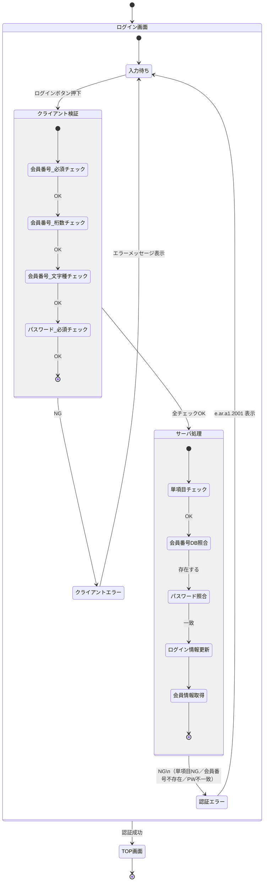

# ログイン画面 状態遷移図

## 対象画面

- 画面名：ログイン画面
- 画面ID：A101
- イベント：A10101（ログインボタン押下）

## 状態遷移図

## 状態一覧

| 状態 | 説明 |
|---|---|
| 入力待ち | 会員番号・パスワードの入力を受け付けている初期状態 |
| クライアント検証 | ログインボタン押下後、ブラウザ側でのチェック処理中 |
| クライアントエラー | クライアント側チェックNGによりエラーメッセージを表示している状態 |
| サーバ処理 | クライアント検証通過後、サーバ側での認証処理中 |
| 認証エラー | サーバ側チェックNGにより `e.ar.a1.2001` を表示している状態 |
| TOP画面 | 認証成功後の遷移先（ヘッダにお客様名を表示） |

## 遷移条件一覧

| 遷移元 | 遷移先 | 条件 |
|---|---|---|
| 入力待ち | クライアント検証 | ログインボタン押下 |
| クライアント検証 | クライアントエラー | 会員番号（必須／桁数／文字種）またはパスワード（必須）がNG |
| クライアントエラー | 入力待ち | エラーメッセージ表示（自動遷移） |
| クライアント検証 | サーバ処理 | 全クライアントチェックOK |
| サーバ処理 | 認証エラー | 単項目NG／会員番号不存在／パスワード不一致 のいずれか |
| 認証エラー | 入力待ち | `e.ar.a1.2001` 表示（自動遷移） |
| サーバ処理 | TOP画面 | 認証成功（全サーバ処理完了） |

## 備考

- クライアント検証のうち、**パスワードは必須チェックのみ**（桁数・文字種はサーバ側で実施）
- 認証エラー（会員番号不存在・パスワード不一致）は**同一エラーコード `e.ar.a1.2001`** を返す
