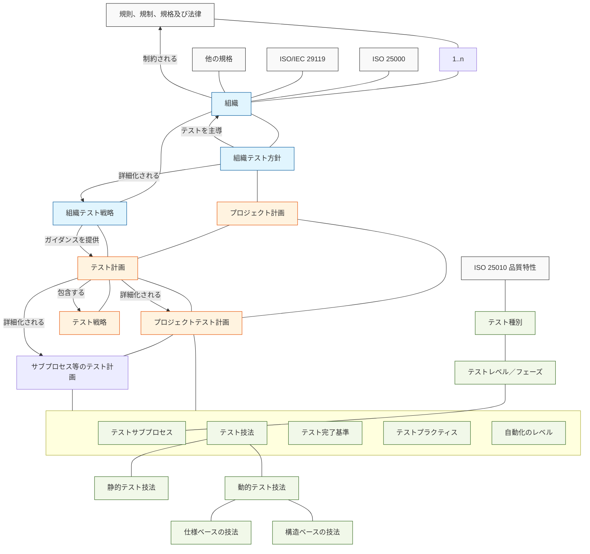
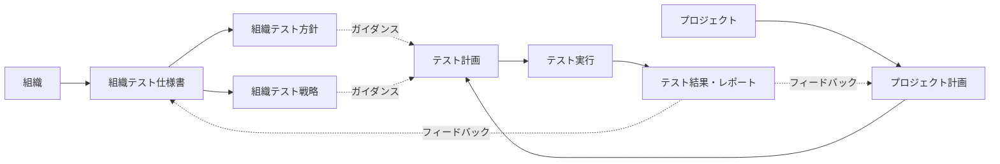
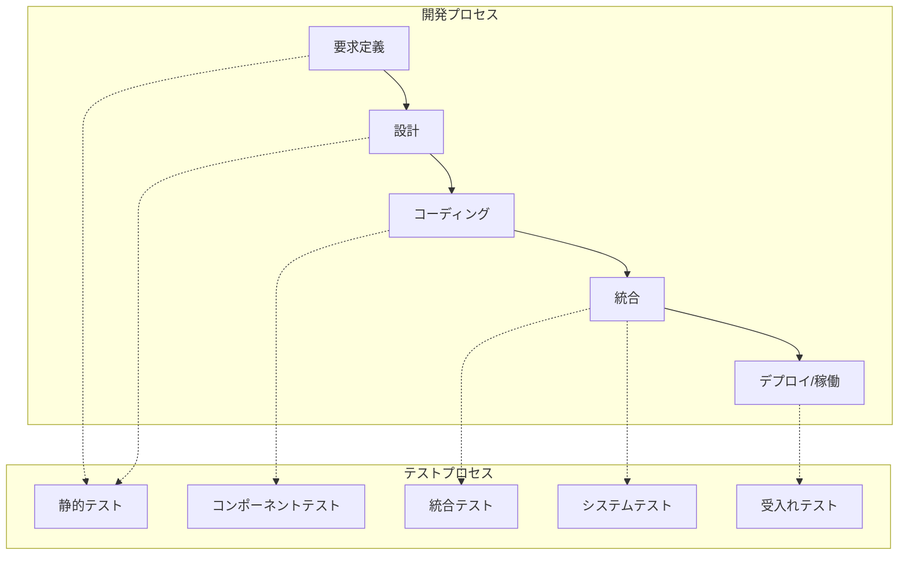
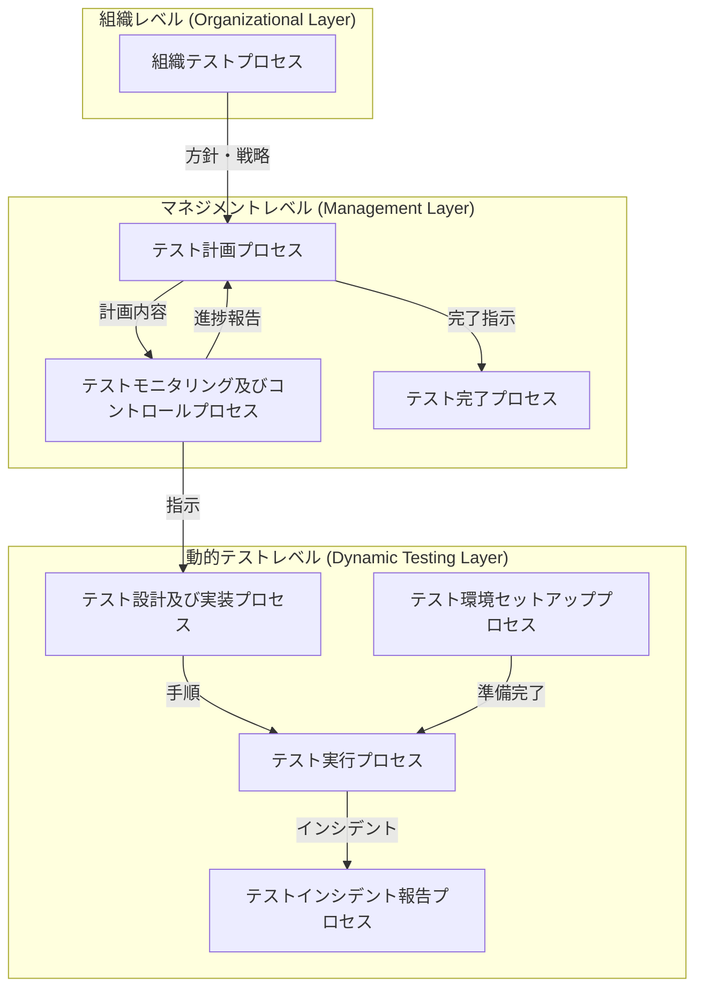
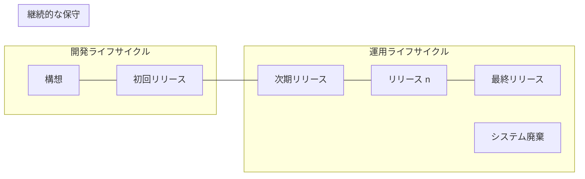
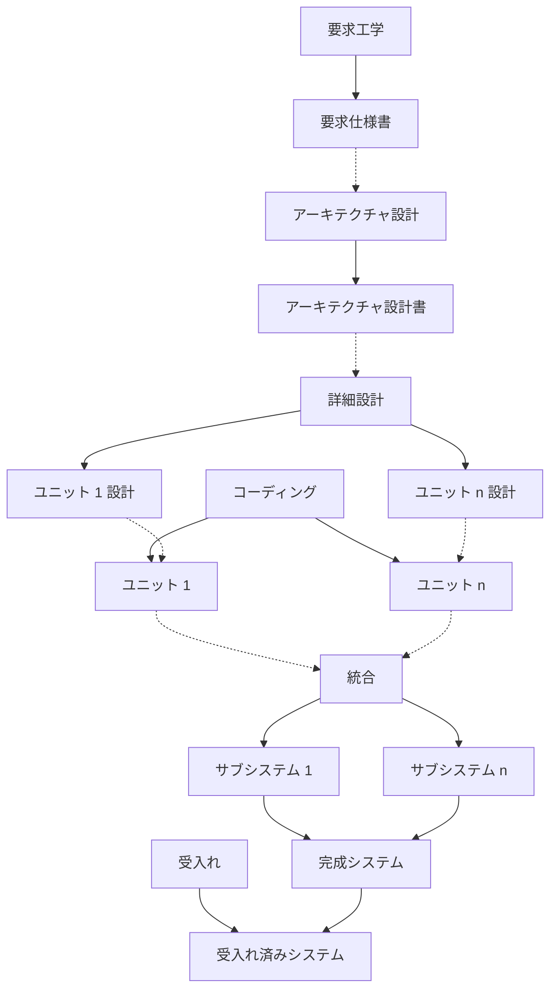
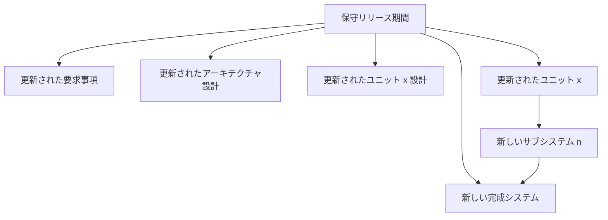
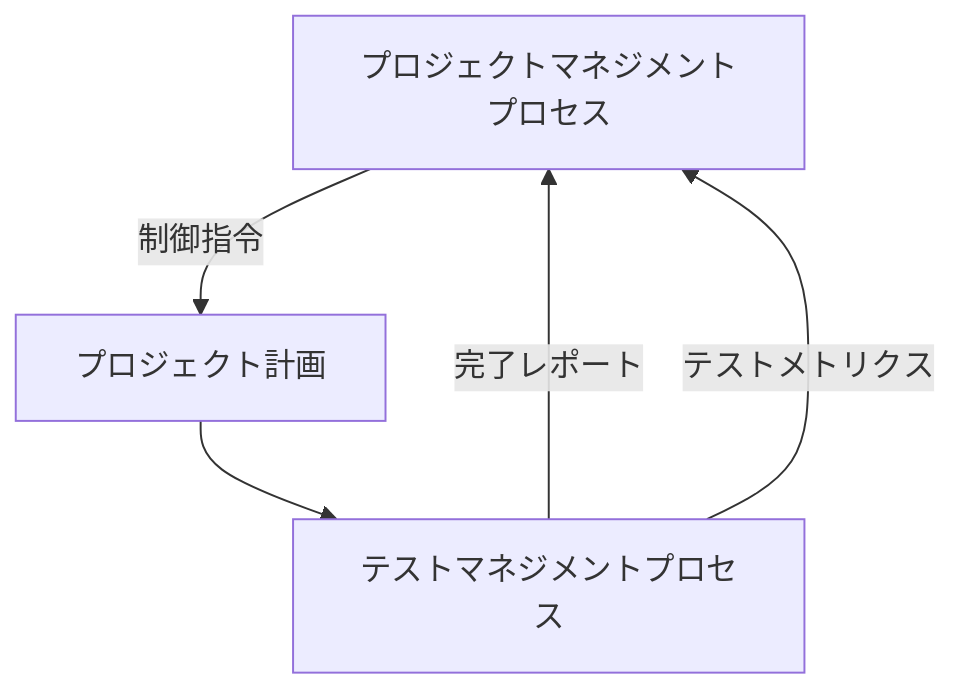
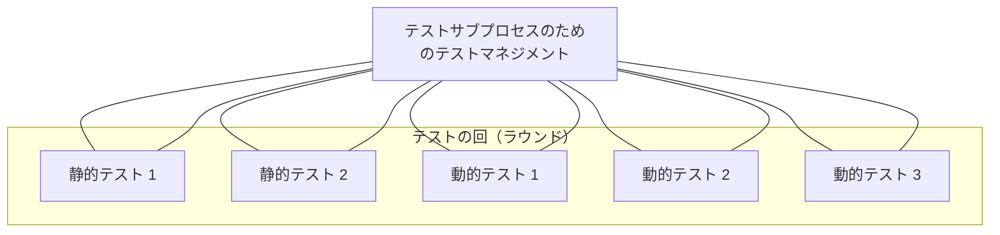
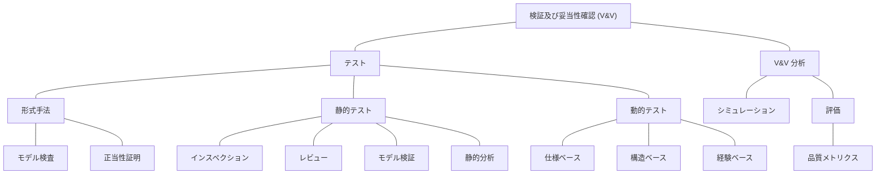

# ISO/IEC/IEEE 29119-1:2013(E) {#Cover}
*(ビジュアル参照: [ISO_IEC_IEEE_29119-1_2013(E)_page-0001.jpg](file:///c:/dev/Antigravity/ATRS%20%E5%A4%96%E9%83%A8%E8%A8%AD%E8%A8%88%E6%9B%B8%20Markdown%E5%8C%96/00_Source_Materials/ISO_IEC_IEEE_29119-1_2013(E)-Character_PDF_document/ISO_IEC_IEEE_29119-1_2013(E)-Character_PDF_document/ISO_IEC_IEEE_29119-1_2013(E)-Character_PDF_document_page-0001.jpg))*

**ソフトウェア及びシステムエンジニアリング — ソフトウェアテスト —**
**第1部：概念及び定義**

*Ingénierie du logiciel et des systèmes — Essais du logiciel —*
*Partie 1: Concepts et définitions*

**初版 2013-09-01**

---

## まえがき (Foreword) {#Foreword}
*(ビジュアル参照: [ISO_IEC_IEEE_29119-1_2013(E)_page-0005.jpg](file:///c:/dev/Antigravity/ATRS%20%E5%A4%96%E9%83%A8%E8%A8%AD%E8%A8%88%E6%9B%B8%20Markdown%E5%8C%96/00_Source_Materials/ISO_IEC_IEEE_29119-1_2013(E)-Character_PDF_document/ISO_IEC_IEEE_29119-1_2013(E)-Character_PDF_document/ISO_IEC_IEEE_29119-1_2013(E)-Character_PDF_document_page-0005.jpg))*

ISO（国際標準化機構）及び IEC（国際電気標準会議）は、世界的な標準化のための専門的なシステムを構成しています。ISO 又は IEC のメンバーである各国機関は、それぞれの組織が特定の技術活動分野を扱うために設立した技術委員会を通じて、国際規格の開発に参加します。ISO 及び IEC の技術委員会は、共通の関心分野で協力します。ISO 及び IEC と連絡を取っている他の国際組織（政府系及び非政府系）も、この作業に参加します。情報技術の分野では、ISO 及び IEC は合同技術委員会である ISO/IEC JTC 1 を設立しました。

IEEE 規格ドキュメントは、IEEE ソサエティ及び IEEE 標準協会（IEEE-SA）標準委員会の規格調整委員会内で開発されます。IEEE は、最終的な製品を実現するために、多様な視点や関心を代表するボランティアを結集する、アメリカ国立標準研究所（ANSI）によって承認された合意形成開発プロセスを通じて規格を開発します。ボランティアは必ずしも学会の会員である必要はなく、無報酬で奉仕します。IEEE はプロセスを管理し、合意形成開発プロセスにおける公平性を促進するための規則を定めますが、IEEE はその規格に含まれる情報の正確性を独自に評価、テスト、又は検証することはありません。

国際規格は、ISO/IEC 指針 第2部の規則に従って作成されます。

ISO/IEC JTC 1 の主な任務は、国際規格を作成することです。合同技術委員会によって採用された国際規格の草案は、投票のために各国機関に回覧されます。国際規格としての発行には、投票を行った各国機関の少なくとも 75 % による承認が必要です。

本規格の実施には、特許権の対象となる事項の使用が必要となる可能性があることに注意が呼びかけられています。本規格の発行により、それに関連する特許権の存在又は有効性についていかなる立場もとるものではありません。ISO/IEEE は、ライセンスが必要となる可能性がある必須特許又は特許請求の特定、特許又は特許請求の法的有効性若しくは範囲に関する調査の実施、又は「保証書（Letter of Assurance）」若しくは「特許声明書及びライセンス宣言書（Patent Statement and Licensing Declaration Form）」の提出に関連して提供されたライセンス条項若しくは条件が、もしあれば、若しくはライセンス契約において、合理的であるか若しくは非差別的であるかの判断について責任を負いません。本規格の利用者は、特許権の有効性の判断及びそのような権利の侵害のリスクは全面的に利用者自身の責任であることを明示的に助言されます。詳細な情報は、ISO 又は IEEE 標準協会から入手できます。

ISO/IEC/IEEE 29119-1 は、ISO と IEEE の間のパートナー規格開発組織協力協定に基づき、IEEE コンピュータ・ソサエティのソフトウェア・システムエンジニアリング規格委員会と協力して、合同技術委員会 ISO/IEC JTC 1（情報技術）、分科委員会 SC 7（ソフトウェア及びシステムエンジニアリング）によって作成されました。

ISO/IEC/IEEE 29119 は、「ソフトウェア及びシステムエンジニアリング — ソフトウェアテスト」という一般タイトルの下、以下の規格で構成されています。

— 第1部：概念及び定義

— 第2部：テストプロセス

— 第3部：テストドキュメント

— 第4部：テスト技法

---

## 導入 (Introduction) {#Introduction}
*(ビジュアル参照: [ISO_IEC_IEEE_29119-1_2013(E)_page-0006.jpg](file:///c:/dev/Antigravity/ATRS%20%E5%A4%96%E9%83%A8%E8%A8%AD%E8%A8%88%E6%9B%B8%20Markdown%E5%8C%96/00_Source_Materials/ISO_IEC_IEEE_29119-1_2013(E)-Character_PDF_document/ISO_IEC_IEEE_29119-1_2013(E)-Character_PDF_document/ISO_IEC_IEEE_29119-1_2013(E)-Character_PDF_document_page-0006.jpg))*

ISO/IEC/IEEE 29119 ソフトウェアテスト規格シリーズの目的は、あらゆる組織がいかなる形式のソフトウェアテストを実施する際にも使用できる、国際的に合意されたソフトウェアテストのための規格セットを定義することにあります。

ソフトウェア、ソフトウェア組織、及びメソドロジ（手法）には多種多様なものがあることが認識されています。ソフトウェアのドメインには、情報技術（IT）、パーソナルコンピュータ（PC）、組込み、モバイル、科学、及びその他多くの分類が含まれます。ソフトウェア組織の規模は小規模から大規模まで、体制は一拠点集中から世界規模まで、目的は営利から公共サービス志向まで多岐にわたります。ソフトウェアメソドロジには、オブジェクト指向、伝統的、データ駆動型、及びアジャイルなどが含まれます。これらやその他の要因がソフトウェアテストに影響を与えます。本国際規格シリーズは、多くの異なる文脈（コンテキスト）におけるテストをサポートできます。

ISO/IEC/IEEE 29119 の本パート（第1部）は、本国際規格シリーズを構築するための語彙を導入し、実践におけるそれらの適用の例を提供することにより、他の ISO/IEC/IEEE 29119 ソフトウェアテスト規格の使用を容易にします。第1部は「参考（informative）」であり、定義、ソフトウェアテストの概念の記述、本パートで定義されたソフトウェアテストプロセスの適用方法、及び他のパートのガイダンスを提供します。

まず、一般的なソフトウェアテストの概念について議論します。組織及びプロジェクトの文脈におけるソフトウェアテストの役割を記述します。一般的なソフトウェアライフサイクルにおけるソフトウェアテストについて説明し、特定のテストアイテム又は特定のテスト目的のためにソフトウェアテストプロセス及びサブプロセスをどのように確立できるかを紹介します。ソフトウェアテストが異なるライフサイクルモデルにどのように適合するかを記述します。テスト計画における異なるプラクティスの使用、及びテストをサポートするために自動化をどのように使用できるかを示します。欠陥管理（デフレクトマネジメント）へのテストの関与についても議論します。[附属書 A](#Annex_A) では、検証（verification）及び妥当性確認（validation）のより広い範囲におけるテストの役割を記述します。[附属書 B](#Annex_B) では、テストのモニタリング及びコントロールに使用されるメトリクス（測定法）の簡潔な紹介を提供します。[附属書 C](#Annex_C) には、異なるライフサイクルモデルにおける本規格の適用方法を示す一連の例が含まれています。[附属書 D](#Annex_D) では、詳細なテストサブプロセスの例を提供します。[附属書 E](#Annex_E) では、テストグループにおいて一般的に遭遇する役割と責任、及びテスターの独立性に関する追加情報を提供します。最後に、参考文献が文書の末尾にあります。

なお、本パートの英文において大文字で始まる用語（Title Case）は、ISO/IEC/IEEE 29119-2 及び ISO/IEC/IEEE 29119-3 で規定されているプロセス及びドキュメント（例：Test Planning Process、Test Plan）を指すために使用されており、一方で小文字は他のドキュメントの一部を形成する要素（例：プロジェクトテスト計画の一要素としての project test strategy）に使用されています。

ISO/IEC/IEEE 29119 ソフトウェアテスト規格シリーズの基礎となるテストプロセスモデルは、ISO/IEC/IEEE 29119-2「テストプロセス」において詳細に定義されています。ISO/IEC/IEEE 29119-2 は、組織レベル、テストマネジメントレベル、及びダイナミック（動的）テストレベルのソフトウェアテストプロセスを扱っています。テストは、ソフトウェア開発におけるリスク対応の主要なアプローチです。本規格は、テストに対する「リスクベースのアプローチ」を定義しています。リスクベーステストは、テストの優先順位付けと集中を可能にする、テストの戦略策定及び管理のための推奨されるアプローチです。

テストプロセス中に作成されるテストドキュメントのテンプレート及び例は、ISO/IEC/IEEE 29119-3「テストドキュメント」において定義されています。テスト中に使用できるソフトウェアテスト技法は、ISO/IEC/IEEE 29119-4「テスト技法」において定義されています。

全体として、本国際規格シリーズは、あらゆる組織においてステークホルダーがソフトウェアテストを管理し実施する能力を向上させることを目的としています。

---

## 1 適用範囲 (Scope) {#Chapter_1}
*(ビジュアル参照: [ISO_IEC_IEEE_29119-1_2013(E)_page-0007.jpg](file:///c:/dev/Antigravity/ATRS%20%E5%A4%96%E9%83%A8%E8%A8%AD%E8%A8%88%E6%9B%B8%20Markdown%E5%8C%96/00_Source_Materials/ISO_IEC_IEEE_29119-1_2013(E)-Character_PDF_document/ISO_IEC_IEEE_29119-1_2013(E)-Character_PDF_document/ISO_IEC_IEEE_29119-1_2013(E)-Character_PDF_document_page-0007.jpg))*

ISO/IEC/IEEE 29119 の本パート（第1部）は、ソフトウェアテストにおける定義及び概念を規定します。これは、テスト用語の定義、及び ISO/IEC/IEEE 29119 ソフトウェアテスト国際規格シリーズを理解するための鍵となる概念の解説を提供します。

## 2 適合性 (Conformance) {#Chapter_2}

ISO/IEC/IEEE 29119-1 は「参考（informative）」であり、これへの適合は要求されません。

ISO/IEC/IEEE 29119 ソフトウェアテスト規格シリーズには、適合を主張できる以下の3つの規格が含まれています。

— テストプロセス

— テストドキュメント

— テスト技法

適合性については、ISO/IEC/IEEE 29119-2、ISO/IEC/IEEE 29119-3、及び ISO/IEC/IEEE 29119-4 で扱われています。

## 3 引用規格 (Normative references) {#Chapter_3}

本書は、いかなる引用規格の使用も要求しません。ISO/IEC/IEEE 29119 の本パートの実施及び解釈に有用な規格は、参考文献（Bibliography）にリストされています。

---

### [図 1](#Figure_1) — 多層的なテストコンテキスト図 {#Figure_1}
*(ビジュアル参照: [ISO_IEC_IEEE_29119-1_2013(E)_page-0009.jpg](file:///c:/dev/Antigravity/ATRS%20%E5%A4%96%E9%83%A8%E8%A8%AD%E8%A8%88%E6%9B%B8%20Markdown%E5%8C%96/00_Source_Materials/ISO_IEC_IEEE_29119-1_2013(E)-Character_PDF_document/ISO_IEC_IEEE_29119-1_2013(E)-Character_PDF_document/ISO_IEC_IEEE_29119-1_2013(E)-Character_PDF_document_page-0009.jpg))*



<!-- AI_ANALYSIS: [図 1](#Figure_1) は、組織のガバナンス、プロジェクトマネジメント、及び動的テスト実行の間の階層的関係を示しています。矢印は制約、ガイダンス、及び詳細化を示します。例えば、「組織テスト方針」は「組織テスト戦略」によって詳細化され、後者はプロジェクト固有の「テスト計画」へのガイダンスを提供します。 -->

## 4 用語及び定義 (Terms and definitions) {#Chapter_4}

本書の目的において、ISO/IEC/IEEE 24765 における用語及び定義、並びに以下を適用します。

注記：以下の用語及び定義は、ISO/IEC/IEEE 29119 ソフトウェアテスト規格シリーズの第1部、第2部、第3部及び第4部の理解と読みやすさを支援するために提供されています。そのため、第1部で定義されているいくつかの用語は第1部では使用されず、シリーズ内の他の規格でのみ使用されます。これらの規格を理解するために不可欠な用語のみが含まれています。本箇条は完全なテスト用語リストを提供することを意図したものではありません。本箇条で定義されていない用語については、システム及びソフトウェアエンジニアリング用語集 ISO/IEC/IEEE 24765 を参照してください。このソースは以下のウェブサイトで入手可能です：http://www.computer.org/sevocab

### 4.1 アクセシビリティテスト (accessibility testing) {#Term_4.1}
最も幅広い特性及び能力を持つユーザーがテストアイテムを操作できる度合いを測定するために使用されるユーザビリティテストの種別。

### 4.2 実結果 (actual results) {#Term_4.2}
テスト実行の結果として観察される、テストアイテムの一連の振る舞い若しくは状態、又は関連するデータ若しくはテスト環境の一連の状態。

例：ハードウェアへの出力、データの変更、レポート、及び送信された通信メッセージ。

### 4.3 バックアップ及びリカバリテスト (backup and recovery testing) {#Term_4.3}
障害が発生した際に、時間、コスト、完全性、及び正確性の規定されたパラメータ内で、システム状態をバックアップから復元できる度合いを測定する信頼性テストの種別。

### 4.4 ブラックボックステスト (black-box testing) {#Term_4.4}
仕様ベースのテスト (4.39) を参照。

### 4.5 キャパシティテスト (capacity testing) {#Term_4.5}
増加する負荷（ユーザー、トランザクション、データストレージなど）が、要求される性能を維持するためのテストアイテムの能力を損なうレベルを評価するために実施される効率性テストの種別。

### 4.6 適合性テスト (compatibility testing) {#Term_4.6}
共有環境においてテストアイテムが他の独立した製品と満足に機能できる度合い（共存性）、及び必要に応じて他のシステムやコンポーネントと情報を交換できる度合い（相互運用性）を測定するテストの種別。

### 4.7 網羅項目 (coverage item) {#Term_4.7}
テスト網羅項目 (4.54) を参照。

### 4.8 判定 (decision) {#Term_4.8}
2つ以上の可能な結果の間の選択により、どのアクションのセットが結果として生じるかを制御する実行文の型。

注1：典型的な判定には、単純な選択（例：if-then-else）、ループを終了するタイミングの決定（例：whileループ）、及び case (switch) 文（例：case-1-2-3-..-N）がある。

### 4.9 動的テスト (dynamic testing) {#Term_4.9}
テストアイテムの実行を必要とするテスト。

### 4.10 耐久テスト (endurance testing) {#Term_4.10}
テストアイテムが、規定された期間、継続的に要求される負荷を維持できるかどうかを評価するために実施される効率性テストの種別。

### 4.11 同値分割 (equivalence partition) {#Term_4.11}
テストアイテム内又はそのインターフェースにおける変数又は変数セットの範囲のサブセットであり、そのパーティション内のすべての値がテストアイテムによって同様に扱われる（すなわち、それらはテストアイテムによって「等価」であるとみなされる）ことが合理的に期待できるもの。

### 4.12 同値分割網羅 (equivalence partition coverage) {#Term_4.12}
テストセットによって網羅される、テストアイテムの特定された同値分割の割合。

注1：多くの場合、同値分割の特定は主観的であり（特に「無効な」パーティションの再分割において）、したがってテストアイテム内の同値分割の数を確定的にカウントすることは不可能な場合がある。

### 4.13 同値分割法 (equivalence partitioning) {#Term_4.13}
各パーティションの1つ以上の代表的なメンバーを使用して、同値分割を実行するようにテストケースを設計するテスト設計技法。

### 4.14 エラー推測法 (error guessing) {#Term_4.14}
テスターの過去の故障に関する知識、又は故障モードに関する一般的な知識に基づいてテストケースを導出するテスト設計技法。

注1：関連する知識は個人の経験から得られる場合もあれば、例えば欠陥データベースや「バグ・タクソノミ（バグ分類学）」にカプセル化されている場合もある。

### 4.15 期待結果 (expected results) {#Term_4.15}
その仕様又は他のソースに基づき、規定された条件下で予測されるテストアイテムの観察可能な振る舞い。

### 4.16 探索的テスト (exploratory testing) {#Term_4.16}
既存の知識、以前のテストアイテムの探索（以前のテストの結果を含む）、及び一般的なソフトウェアの振る舞いや故障の型に関するヒューリスティックな「経験則」に基づき、テスターが自発的にテストを設計し実行する経験ベースのテスト。

注1：探索的テストは、それ自体では無害である可能性が高いにせよ、テスト対象ソフトウェアの他の特性を妨げる可能性があり、したがってソフトウェアが故障するリスクを構成する隠れた特性（隠れた振る舞いを含む）を探し出す。

### 4.17 フィーチャーセット (feature set) {#Term_4.17}
テストされるテストアイテムのテスト条件を含む項目の集まりであり、リスク、要求事項、機能、モデルなどから収集される。

注1：これは、アイテムのすべての機能のセット（フルフィーチャーセット）である場合もあれば、特定の目的のために特定されたサブセット（機能フィーチャーセットなど）である場合もある。

### 4.18 インシデントレポート (Incident Report) {#Term_4.18}
インシデントの発生、性質、及びステータス（状況）の文書化。

### 4.19 インストール性テスト (installability testing) {#Term_4.19}
テストアイテム又はテストアイテムのセットを、すべての規定された環境に要求通りにインストールできるかどうかを評価するために実施される移植性テストの種別。

### 4.20 負荷テスト (load testing) {#Term_4.20}
変化する負荷の予測される条件下（通常は、予測される低使用、典型的使用、及びピーク使用の間）におけるテストアイテムの振る舞いを評価するために実施される効率性テストの種別。

### 4.21 保守性テスト (maintainability testing) {#Term_4.21}
テストアイテムを修正できる効果及び効率の度合いを評価するために実施されるテスト種別。

### 4.22 組織テスト方針 (Organizational Test Policy) {#Term_4.22}
組織内におけるテストの目的、ゴール、及び全体的な範囲を記述し、なぜテストが実施されるのか、何が達成されることが期待されるのかを表現する経営レベルの文書。

注1：特定の文脈において、組織テスト方針をできるだけ短く保つことが一般的に好ましい。

### 4.23 組織テストプロセス (Organizational Test Process) {#Term_4.23}
組織的なテスト仕様書を開発及び管理するためのテストプロセス。

### 4.24 組織テスト仕様書 (organizational test specification) {#Term_4.24}
組織のテストに関する情報（すなわち、プロジェクト固有ではない情報）を提供する文書。

例：組織テスト仕様書の最も一般的な例は、組織テスト方針及び組織テスト戦略である。

### 4.25 組織テスト戦略 (Organizational Test Strategy) {#Term_4.25}
組織内で実行されるすべてのプロジェクトで実施されるテストに関する一般的な要求事項及び制約を表現し、テストがどのように実施されるかについての詳細を提供する文書。

注1：組織テスト戦略は組織テスト方針と整合している。

注2：組織は、著しく異なるプロジェクトの文脈をカバーするために、複数の組織テスト戦略を持つことができる。

### 4.26 合否判定基準 (pass/fail criteria) {#Term_4.26}
テスト後に、テストアイテム又はテストアイテムの機能がパス（合格）したかフェイル（不合格）したかを決定するために使用される判定規則。

### 4.27 性能テスト (performance testing) {#Term_4.27}
与えられた時間及び他のリソースの制約内で、テストアイテムがその指定された機能を達成する度合いを評価するために実施されるテストの種別。

### 4.28 移植性テスト (portability testing) {#Term_4.28}
テストアイテムをあるハードウェア又はソフトウェア環境から別の環境へ転送できる容易性（様々なタイプの環境で実行するために必要な修正レベルを含む）を評価するために実施されるテストの種別。

### 4.29 手順テスト (procedure testing) {#Term_4.29}
テストアイテムとの対話又はその出力の使用に関する手順上の指示が、ユーザーの要求を満たし、その使用目的をサポートしているかどうかを評価するために実施される機能適合性テストの種別。

### 4.30 プロダクトリスク (product risk) {#Term_4.30}
製品がその機能、品質、又は構造の特定の側面において欠陥がある可能性があるリスク。

### 4.31 プロジェクトリスク (project risk) {#Term_4.31}
プロジェクトの管理に関連するリスク。

例：人員不足、厳しい納期、要求事項の変更。

### 4.32 回帰テスト (regression testing) {#Term_4.32}
テストアイテム又はその運用環境への修正に続いて、回帰故障が発生するかどうかを特定するために実施されるテスト。

注1：回帰テストケースのセットの十分性は、テスト対象のアイテム、並びにそのアイテム又はその運用環境への修正に依存する。

### 4.33 信頼性テスト (reliability testing) {#Term_4.33}
規定された条件下で規定された期間使用された際の故障の発生頻度の評価を含め、テストアイテムが要求された機能を実行できる能力を評価するために実施されるテストの種別。

### 4.34 再テスト (retesting) {#Term_4.34}
介在する是正措置の効果を評価するために、以前に「フェイル」結果を返したテストケースを再実行すること。

注1：確認テストとも呼ばれる。

### 4.35 リスクベース型テスト (risk-based testing) {#Term_4.35}
テスト活動及びリソースの管理、選択、優先順位付け、及び使用が、分析されたリスクの対応する種別及びレベルに意識的に基づいているテスト。

### 4.36 シナリオテスト (scenario testing) {#Term_4.36}
個々のシナリオを実行するようにテストを設計するテスト設計技法のクラス。

注1：シナリオには、ユーザーストーリー、ユースケース、運用コンセプト、又はソフトウェアが遭遇する可能性のある一連のイベントなどが含まれ得る。

### 4.37 スクリプト形式のテスト (scripted testing) {#Term_4.37}
テスターのアクションがテストケース内の書面による指示によって規定される動的テスト。

注1：この用語は通常、自動化されたスクリプトの実行ではなく、手動で実行されるテストに適用される。

### 4.38 セキュリティテスト (security testing) {#Term_4.38}
許可されていない人又はシステムがテストアイテム並びに関連するデータ及び情報を利用、閲覧、又は修正できず、かつ許可された人又はシステムがそれらへのアクセスを拒否されないように保護されている度合いを評価するために実施されるテストの種別。

### 4.39 仕様ベースのテスト (specification-based testing) {#Term_4.39}
ソースコードや実行可能なソフトウェアにおける実装ではなく、主にテストアイテムの外部入力及び出力をテストベース（通常は仕様に基づく）とするテスト。

注1：仕様ベースのテストの同義語には、ブラックボックステスト及びクローズドボックステストが含まれる。

### 4.40 文網羅 (statement coverage) {#Term_4.40}
テストセットによって網羅される、テストアイテムのすべての実行可能な文のセットの割合。

### 4.41 文テスト (statement testing) {#Term_4.41}
テストアイテム内の個々の文を実行させるようにテストケースを構築するテスト設計技法。

### 4.42 静的テスト (static testing) {#Term_4.42}
コードを実行せずに、品質又はその他の基準のセットに対してテストアイテムを検査するテスト。

例：レビュー、静的分析。

### 4.43 ストレステスト (stress testing) {#Term_4.43}
予測される若しくは規定された容量要件を超える負荷条件下、又は最小規定要件を下回るリソース可用性条件下におけるテストアイテムの振る舞いを評価するために実施される効率性テストの種別。

### 4.44 構造テスト (structural testing) {#Term_4.44}
構造ベースのテスト (4.45) を参照。

### 4.45 構造ベースのテスト (structure-based testing) {#Term_4.45}
テストアイテムの構造の調査からテストが導出される動的テスト。

注1：構造ベースのテストはコンポーネントレベルでの使用に限定されず、すべてのレベルで使用できる（例：システムテストの一部としてのメニュー項目の網羅など）。

注2：技法には、ブランチ（分岐）テスト、判定テスト、及び文テストが含まれる。

注3：構造ベースのテストの同義語は、構造テスト、グラスボックステスト、及びホワイトボックステストである。

### 4.46 中断基準 (suspension criteria) {#Term_4.46}
テスト活動のすべて又は一部を（一時的に）停止するために使用される基準。

### 4.47 テストベース (test basis) {#Term_4.47}
テスト及びテストケースの設計の基礎として使用される知識体系。

注1：テストベースは、要求仕様書、設計仕様書、又はモジュール仕様書などの文書の形式をとる場合があるが、要求される振る舞いに関する明文化されていない理解である場合もある。

### 4.48 テストケース (test case) {#Term_4.48}
テスト目的（正しい実装、エラーの特定、品質のチェック、及びその他の価値のある情報の取得を含む）を満たすために、テストアイテムの実行を主導するために開発された、テストケースの事前条件、入力（該当する場合はアクションを含む）、及び期待結果のセット。

注1：テストケースは、それが意図されているテストサブプロセスにとってのテスト入力の最低レベルである（すなわち、テストケースはテストケースから構成されるものではない）。

注2：テストケースの事前条件には、テスト環境、既存のデータ（例：データベース）、テスト対象ソフトウェア、ハードウェアなどが含まれる。

注3：入力は、テスト実行を主導するために使用されるデータ情報である。

注4：期待結果には、成功基準、チェックすべき故障などが含まれる。

### 4.49 テストケース仕様書 (Test Case Specification) {#Term_4.49}
1つ以上のテストケースのセットの文書化。

### 4.50 テスト完了プロセス (Test Completion Process) {#Term_4.50}
有用なテスト資産を後で使用できるようにし、テスト環境を満足のいく状態に残し、テスト結果を記録して関連するステークホルダーに伝達することを確実にするためのテストマネジメントプロセス。

### 4.51 テスト完了レポート (Test Completion Report) {#Term_4.51}
実施されたテストの要約を提供するレポート。

注1：テストサマリーレポート（テスト総括レポート）とも呼ばれる。

### 4.52 テスト条件 (test condition) {#Term_4.52}
テストの基礎として特定された、機能、トランザクション、フィーチャー、品質特性、又は構造要素などの、コンポーネント又はシステムのテスト可能な側面。

注1：テスト条件は網羅項目を導出するために使用される場合もあれば、それ自体が網羅項目を構成する場合もある。

### 4.53 テスト網羅率 (test coverage) {#Term_4.53}
規定されたテスト網羅項目が1つ以上のテストケースによって実行された度合い（パーセントで表される）。

### 4.54 テスト網羅項目 (test coverage item) {#Term_4.54}
テスト実行の徹底性の測定を可能にするテスト設計技法を使用して、1つ以上のテスト条件から導出される属性又は属性の組み合わせ。

### 4.55 テストデータ (test data) {#Term_4.55}
1つ以上のテストケースを実行するための入力要件を満たすために作成又は選択されたデータであり、テスト計画、テストケース、又はテスト手順において定義される場合がある。

注1：テストデータはテスト対象製品内（例：配列、フラットファイル、又はデータベース内）に保存される場合もあれば、他のシステム、他のシステムコンポーネント、ハードウェアデバイス、又は人間のオペレーターなどの外部ソースから利用可能であるか、又は提供される場合もある。

### 4.56 テストデータ準備完了レポート (Test Data Readiness Report) {#Term_4.56}
各テストデータ要件のステータスを記述した文書。

### 4.57 テスト設計及び実装プロセス (Test Design and Implementation Process) {#Term_4.57}
テストケース及びテスト手順を導出し規定するためのテストプロセス。

### 4.58 テスト設計仕様書 (Test Design Specification) {#Term_4.58}
テストされるフィーチャー（機能・特徴）及びそれらに対応するテスト条件を規定する文書。

### 4.59 テスト設計技法 (test design technique) {#Term_4.59}
テストアイテムのテスト条件の特定、対応するテスト網羅項目の導出、及びその後のテストケースの導出又は選択に使用されるテストモデルを構築するために使用される活動、概念、プロセス、及びパターン。

### 4.60 テスト環境 (test environment) {#Term_4.60}
ソフトウェアのテストを実施することを意図した、又はそのために使用される設備、ハードウェア、ソフトウェア、ファームウェア、手順、及び文書。

注1：テスト環境には、特定のテストサブプロセス（例：コンポーネントテスト環境、性能テスト環境など）を収容するための複数の環境が含まれる場合がある。

### 4.61 テスト環境準備完了レポート (test environment readiness report) {#Term_4.61}
各テスト環境要件の充足状況を記述した文書。

### 4.62 テスト環境要件 (Test Environment Requirements) {#Term_4.62}
テスト環境의 必要な特性の記述。

注1：テスト環境要件の全部又は一部は、適切な組織テスト戦略、テスト計画、及び／又はテスト仕様書など、情報が見つかる場所を参照することができる。

### 4.63 テスト環境セットアッププロセス (Test Environment Set-up Process) {#Term_4.63}
要求されるテスト環境を確立し維持するための動的テストプロセス。

### 4.64 テスト実行 (test execution) {#Term_4.64}
テストアイテム上でテストを実行し、実結果を生成するプロセス。

### 4.65 テスト実行ログ (Test Execution Log) {#Term_4.65}
1つ以上のテスト手順の実行の詳細を記録する文書。

### 4.66 テスト実行プロセス (Test Execution Process) {#Term_4.66}
テスト設計及び実装プロセスで作成されたテスト手順を準備されたテスト環境で実行し、結果を記録するための動的テストプロセス。

### 4.67 テストインシデント報告プロセス (Test Incident Reporting Process) {#Term_4.67}
テスト実行プロセス中に特定された、さらなるアクションを必要とする問題を関連するステークホルダーに報告するための動的テストプロセス。

### 4.68 テストアイテム (test item) {#Term_4.68}
テストの対象であるワークプロダクト（作業成果物）。

例：システム、ソフトウェアアイテム、要求仕様書、設計仕様書、ユーザーガイド。

### 4.69 テストレベル (test level) {#Term_4.69}
テストサブプロセスの特定のインスタンス化。

例：以下は、テストサブプロセスとしてインスタンス化できる一般的なテストレベルである。コンポーネントテストレベル／サブプロセス、統合テストレベル／サブプロセス、システムテストレベル／サブプロセス、受入れテストレベル／サブプロセス。

注1：テストレベルはテストフェーズと同義である。

### 4.70 テストマネジメント (test management) {#Term_4.70}
テスト活動の計画、スケジューリング、見積り、モニタリング、レポート、コントロール、及び完了。

### 4.71 テストマネジメントプロセス (Test Management Process) {#Term_4.71}
テストプロジェクトの管理に必要とされるサブプロセスを含むテストプロセス。

注1：テスト計画プロセス、テストモニタリング及びコントロールプロセス、テスト完了プロセスを参照。

### 4.72 テストモニタリング及びコントロールプロセス (Test Monitoring and Control Process) {#Term_4.72}
テストがテスト計画及び組織的なテスト仕様書に沿って実施されることを確実にするためのテストマネジメントプロセス。

### 4.73 テスト対象 (test object) {#Term_4.73}
テストアイテム (4.68) を参照。

### 4.74 テストフェーズ (test phase) {#Term_4.74}
テストサブプロセスの特定のインスタンス化。

注1：テストフェーズはテストレベルと同義であり、したがってテストフェーズの例はテストレベルと同じである（例：システムテストフェーズ／サブプロセス）。

### 4.75 テスト計画 (Test Plan) {#Term_4.75}
達成すべきテスト目的、及びそれらを達成するための手段とスケジュールの詳細な記述であり、あるテストアイテム又はテストアイテムのセットのテスト活動を調整するために編成される。

注1：1つのプロジェクトに複数のテスト計画がある場合がある。例えば、プロジェクトにおけるすべてのテスト活動を包括するプロジェクトテスト計画（マスターテスト計画とも呼ばれる）がある場合があり、特定のテスト活動（すなわち、システムテスト計画や性能テスト計画）の詳細が、1つ以上のテストサブプロセス計画において定義される場合がある。

注2：通常、テスト計画は書面による文書であるが、組織内又はプロジェクト内で局所的に定義された、他の計画形式も可能である。

注3：保守テスト計画など、プロジェクト以外の活動に対してもテスト計画が作成される場合がある。

### 4.76 テスト計画プロセス (Test Planning Process) {#Term_4.76}
テスト計画を完了し、テスト計画書を開発するために使用されるテストマネジメントプロセス。

### 4.77 テストプラクティス (test practice) {#Term_4.77}
テストを容易にするために、組織テストプロセス、テストマネジメントプロセス、及び／又は動的テストプロセスに適用できる概念的枠組み。

注1：テストプラクティスは、テストアプローチと呼ばれることもある。

### 4.78 テスト手順 (test procedure) {#Term_4.78}
実行順序に並べられた一連のテストケース、及び初期事前条件のセットアップや実行後の後処理活動に必要とされる関連アクション。

注1：テスト手順には、連続して実行するために選択された1つ以上のテストケースの実行方法に関する詳細な指示が含まれる。これには、共通の事前条件のセットアップ、入力の提供、及び含まれる各テストケースの実結果の評価が含まれる。

### 4.79 テスト手順仕様書 (Test Procedure Specification) {#Term_4.79}
特定の目的のために実行されるテストケースの集まりである、1つ以上のテスト手順を規定する文書。

注1：テストセット内のテストケースは、テスト手順において要求される順序でリストされる。

注2：手動テストスクリプトとも呼ばれる。自動テスト実行のためのテスト手順仕様書は、通常プログラミング用語で「テストスクリプト」と呼ばれる。

### 4.80 テストプロセス (test process) {#Term_4.80}
ソフトウェア製品の品質に関する情報を提供する。多くの場合、多数の活動で構成され、1つ以上のテストサブプロセスにグループ化される。

例：特定のプロジェクトのテストプロセスは、例えば、システムテストサブプロセス、テスト計画サブプロセス（より大きなテストマネジメントプロセスの一部）、又は静的テストサブプロセスなど、複数のサブプロセスで構成される。

### 4.81 テスト要求 (test requirement) {#Term_4.81}
テスト条件 (4.52) を参照。

### 4.82 テスト結果 (test result) {#Term_4.82}
特定のテストケースがパスしたかフェイルしたかの表示。すなわち、テストアイテムの出力として観察された実結果が期待結果に対応するか、又は逸脱が観察されたかどうか。

### 4.83 テストスクリプト (test script) {#Term_4.83}
手動又は自動テストのためのテスト手順仕様。

### 4.84 テストセット (test set) {#Term_4.84}
その実行において共通の制約を持つ、1つ以上のテストケースのセット。

例：特定のテスト環境、専門的なドメイン知識、又は特定の目的。

### 4.85 テスト仕様書 (test specification) {#Term_4.85}
特定のテストアイテムのテスト設計、テストケース、及びテスト手順の完全な文書化。

注1：テスト仕様書は、1つの文書、一連の文書、又は他の方法（例えば文書とデータベースエントリの混合）で詳細化される場合がある。

### 4.86 テスト状況レポート (test status report) {#Term_4.86}
指定された報告期間内に実施されているテストの状況に関する情報を提供するレポート。

### 4.87 テスト戦略 (test strategy) {#Term_4.87}
特定のテストプロジェクト又はテストサブプロセスのアプローチを記述する、テスト計画の一部。

注1：テスト戦略は、組織テスト戦略とは別の実体である。

注2：テスト戦略は通常、使用されるテストプラクティス、実装されるテストサブプロセス、採用される再テスト及び回帰テスト、使用されるテスト設計技法及び対応するテスト完了基準、テストデータ、テスト環境及びテストツールの要件、並びにテスト成果物への期待の一部又は全部を記述する。

### 4.88 テストサブプロセス (test sub-process) {#Term_4.88}
テストプロジェクトの全体的なテストプロセスの文脈の中で、特定のテストレベル（例：システムテスト、受入れテスト）又はテスト種別（例：ユーザビリティテスト、性能テスト）を実行するために使用される、テストマネジメントプロセス、動的（及び静的）テストプロセス。

注1：テストサブプロセスは、1つ以上のテスト種別を含み得る。使用されるライフサイクルモデルに応じて、テストサブプロセスは通常、テストフェーズ、テストレベル、テストステージ、又はテストタスクとも呼ばれる。

### 4.89 テスト技法 (test technique) {#Term_4.89}
テスト設計技法 (4.59) を参照。

### 4.90 テストトレーサビリティマトリクス (test traceability matrix) {#Term_4.90}
要求事項とそれに関連するテストなど、文書化された項目とソフトウェアにおける関連項目を特定するために使用される文書、スプレッドシート、又は他の自動化されたツール。

注1：検証対応表（verification cross reference matrix）、要求テストマトリクス、要求検証表などとも呼ばれる。

注2：異なるテストトレーサビリティマトリクスは、異なる情報、形式、及び詳細レベルを持ち得る。

### 4.91 テスト種別 (test type) {#Term_4.91}
特定の品質特性に焦点を当てたテスト活動のグループ。

注1：テスト種別は単一のテストサブプロセスで実行される場合もあれば、多数のテストサブプロセスにわたって実行される場合もある（例：コンポーネントテストサブプロセスで完了し、システムテストサブプロセスでも完了する性能テスト）。

例：セキュリティテスト、機能テスト、ユーザビリティテスト、及び性能テスト。

### 4.92 テスト (testing) {#Term_4.92}
1つ以上のテストアイテムの特性の発見及び／又は評価を容易にするために実施される活動のセット。

注1：テスト活動には、テストを目的としている限りにおいて、計画、準備、実行、報告、及び管理活動を含めることができる。

### 4.93 テストウェア (testware) {#Term_4.93}
テストの計画、設計、及び実行に必要とされる、テストプロセスの過程で作成される成果物。

注1：テストウェアには、文書、スクリプト、入力、期待結果、ファイル、データベース、環境、及びテストの過程で使用される追加のソフトウェアやユーティリティなどが含まれる。

### 4.94 非スクリプト形式のテスト (unscripted testing) {#Term_4.94}
テスターのアクションがテストケース内の書面による指示によって規定されない動的テスト。

### 4.95 ボリュームテスト (volume testing) {#Term_4.95}
スループット容量、ストレージ容量、又はその両方の観点から、規定されたデータ量（通常は最大規定容量又はその付近）を処理するテストアイテムの能力を評価するために実施される効率性テストの種別。

### 4.96 ホワイトボックステスト (white box testing) {#Term_4.96}
構造ベースのテスト (4.45) を参照。

---

## 5 ソフトウェアテストの概念 (Software testing concepts) {#Chapter_5}
*(ビジュアル参照: [ISO_IEC_IEEE_29119-1_2013(E)_page-0017.jpg](file:///c:/dev/Antigravity/ATRS%20%E5%A4%96%E9%83%A8%E8%A8%AD%E8%A8%88%E6%9B%B8%20Markdown%E5%8C%96/00_Source_Materials/ISO_IEC_IEEE_29119-1_2013(E)-Character_PDF_document/ISO_IEC_IEEE_29119-1_2013(E)-Character_PDF_document/ISO_IEC_IEEE_29119-1_2013(E)-Character_PDF_document_page-0017.jpg))*

### 5.1 情報技術におけるソフトウェアテスト (Software testing in information technology) {#Section_5.1}

多くの専門分野において、テストは、アイテムの特性が規定された要求を満足しているかどうかを判断するために、そのアイテムを実験的に操作することを含みます。物理的なエンジニアリングの分野（例：土木、機械、電気エンジニアリング）では、テストは通常、コンポーネントがその仕様に適合しているかどうか、及び、組み立てられた後のシステムがその意図された用途を満足している（すなわち、期待通りに動作する）かどうかを判断するために実施されます。ソフトウェアエンジニアリングにおいても、目的は同様です。

情報技術（IT）の文脈におけるソフトウェアテストは、ソフトウェア製品がその使用目的のために意図された通りに動作することを期待するステークホルダーに、その製品の品質に関する情報を提供するために実施されます。さらに、ソフトウェアテストは、ソフトウェア開発におけるリスクに対応するための主要なアプローチの一つです。リスクベースのテストアプローチ（[5.3.3](#Section_5.3.3) を参照）を使用することで、テストチームは、テスト結果に基づいて、製品の稼働開始に伴うリスクのレベルについてステークホルダーに報告することができます。このリスクベースのアプローチは、本国際規格シリーズ（ISO/IEC/IEEE 29119）の全体的な基礎となっています。

### 5.2 ライフサイクルにおけるテスト (Testing within the life cycle) {#Section_5.2}

#### 5.2.1 検証及び妥当性確認 (Verification and validation) {#Section_5.2.1}

検証（verification）強妥当性確認（validation）という用語（V&V と呼ばれることが多い）は、多くのソフトウェアエンジニアリングの文脈で使用されています。一言で言えば、検証は、特定された要求をシステムが満たしているかどうかを判断することであり（「製品を正しく作ったか？」）、妥当性確認は、使用目的やユーザーのニーズをシステムが満たしているかどうかを判断することです（「正しい製品を作ったか？」）。

[附属書 A](#Annex_A) では、検証及び妥当性確認についてさらに詳しく記述しています。

#### 5.2.2 検証及び妥当性確認の一部としてのテスト (Testing as a part of verification and validation) {#Section_5.2.2}

ソフトウェアテストは、V&V 活動の主要な要素であり、重要なワークプロダクト及びシステムの評価を提供します。これには、静的テスト（例：要求事項のレビューやソースコードの分析）と動的テスト（例：コンポーネントテスト、統合テスト、システムテスト）が含まれます。

静的テスト活動は通常、プロジェクトの初期段階（要求定義や設計段階など）から開始されますが、動的テストは、テストアイテム（実行可能なコードなど）が利用可能になり、テスト環境が準備された後に実施されます。

#### 5.2.3 組織及びプロジェクトの文脈におけるテスト (Testing in organizational and project contexts) {#Section_5.2.3}

ソフトウェアテストは独立した活動ではなく、組織全体のガバナンス及びプロジェクトマネジメントと密接に関連しています。図 2 は、組織、プロジェクト、及びテスト活動の間の関係を示しています。

### [図 2](#Figure_2) — 組織及びプロジェクトの文脈におけるテスト {#Figure_2}
*(ビジュアル参照: [ISO_IEC_IEEE_29119-1_2013(E)_page-0018.jpg](file:///c:/dev/Antigravity/ATRS%20%E5%A4%96%E9%83%A8%E8%A8%AD%E8%A8%88%E6%9B%B8%20Markdown%E5%8C%96/00_Source_Materials/ISO_IEC_IEEE_29119-1_2013(E)-Character_PDF_document/ISO_IEC_IEEE_29119-1_2013(E)-Character_PDF_document/ISO_IEC_IEEE_29119-1_2013(E)-Character_PDF_document_page-0018.jpg))*



<!-- AI_ANALYSIS: [図 2](#Figure_2) は、テスト活動が組織レベルの資産（方針・戦略）によって導かれ、その成果（結果・レポート）がプロジェクト及び組織の両方にフィードバックされる循環構造を示しています。 -->

組織は、すべてのプロジェクトで共通に使用される「組織テスト方針」及び「組織テスト戦略」を定義します。個々のプロジェクトは、これらの組織的な仕様書を自身の文脈に合わせて調整し、「テスト計画」を策定します。

---

#### 5.2.4 ソフトウェアライフサイクルにおけるテストの役割 (Role of testing in the software life cycle) {#Section_5.2.4}

テストは、開発ライフサイクル全体を通じて実施されるべきです。図 3 は、典型的な開発ライフサイクルにおけるテスト活動のタイミングを示しています。

### [図 3](#Figure_3) — ライフサイクルにおけるテスト活動 {#Figure_3}
*(ビジュアル参照: [ISO_IEC_IEEE_29119-1_2013(E)_page-0019.jpg](file:///c:/dev/Antigravity/ATRS%20%E5%A4%96%E9%83%A8%E8%A8%AD%E8%A8%88%E6%9B%B8%20Markdown%E5%8C%96/00_Source_Materials/ISO_IEC_IEEE_29119-1_2013(E)-Character_PDF_document/ISO_IEC_IEEE_29119-1_2013(E)-Character_PDF_document/ISO_IEC_IEEE_29119-1_2013(E)-Character_PDF_document_page-0019.jpg))*



<!-- AI_ANALYSIS: [図 3](#Figure_3) は、開発プロセスの各段階に対応するテスト活動を示しています。要求定義や設計段階での静的テストから始まり、実装が進むにつれて動的テスト（ユニット、統合、システム、受入れ）が段階的に実施されることを表現しています。 -->

### 5.3 ソフトウェアテストプロセス (Software testing processes) {#Section_5.3}

#### 5.3.1 導入 (Introduction) {#Section_5.3.1}

ISO/IEC/IEEE 29119 ソフトウェアテスト規格シリーズ（特に ISO/IEC/IEEE 29119-2）は、共通の3層プロセスモデルに基づいています。このモデルにより、組織レベルのガバナンスから個別のテスト実行に至るまで、整合性の取れた管理が可能になります。

#### 5.3.2 3層ソフトウェアテストプロセスモデル (3-layer software testing process model) {#Section_5.3.2}

3層モデルは、以下の階層で構成されます：

1.  **組織テストプロセス**：組織レベルでのテスト資産（方針、戦略）の開発と維持。
2.  **テストマネジメントプロセス**：特定のプロジェクト内でのテスト活動の計画、モニタリング、コントロール、及び完了。
3.  **動的テストプロセス**：実際のテスト実行に関連する活動（環境構築、設計、実装、実行、インシデント報告）。

### [図 4](#Figure_4) — ISO/IEC/IEEE 29119 3層テストプロセスモデル {#Figure_4}
*(ビジュアル参照: [ISO_IEC_IEEE_29119-1_2013(E)_page-0021.jpg](file:///c:/dev/Antigravity/ATRS%20%E5%A4%96%E9%83%A8%E8%A8%AD%E8%A8%88%E6%9B%B8%20Markdown%E5%8C%96/00_Source_Materials/ISO_IEC_IEEE_29119-1_2013(E)-Character_PDF_document/ISO_IEC_IEEE_29119-1_2013(E)-Character_PDF_document/ISO_IEC_IEEE_29119-1_2013(E)-Character_PDF_document_page-0021.jpg))*



<!-- AI_ANALYSIS: [図 4](#Figure_4) は、ISO/IEC/IEEE 29119-2 で定義されているプロセスの階層関係を示しています。組織レベルの意思決定がプロジェクトの計画に反映され、それが動的な実行活動を制御する流れを可視化しています。 -->

#### 5.3.3 リスクベース型テスト (Risk-based testing) {#Section_5.3.3}

テストは通常、リソース（時間、予算、人員）の制約を受けます。そのため、すべての項目を等しくテストすることは不可能です。リスクベース型テストは、製品の不具合がユーザーに与える影響（インパクト）とその発生可能性（確率）を分析し、より高いリスクを持つ領域にテスト活動を集中させるアプローチです。

リスクベース型テストを採用することで：
-   テストの優先順位を明確にできます。
-   テストの終了時期を合理的に判断できます。
-   ステークホルダーに対し、残存リスクに基づいた情報提供が可能になります。

---

##### 5.3.4 動的テストプロセス (Dynamic test processes) {#Section_5.3.4}

動的テストプロセスは、テストの設計、環境準備、実行、及びインシデント報告の間の相互作用を定義します。

### [図 5](#Figure_5) — 動的テストプロセス {#Figure_5}
*(ビジュアル参照: [ISO_IEC_IEEE_29119-1_2013(E)_page-0022.jpg](file:///c:/dev/Antigravity/ATRS%20%E5%A4%96%E9%83%A8%E8%A8%AD%E8%A8%88%E6%9B%B8%20Markdown%E5%8C%96/00_Source_Materials/ISO_IEC_IEEE_29119-1_2013(E)-Character_PDF_document/ISO_IEC_IEEE_29119-1_2013(E)-Character_PDF_document/ISO_IEC_IEEE_29119-1_2013(E)-Character_PDF_document_page-0022.jpg))*

```mermaid
graph LR
    Start(( )) --> TDI[テスト設計及び実装]
    TDI -->|"テスト仕様書"| TE[テスト実行]
    TE -->|"テスト結果"| Decision{ }
    
    Decision -->|[問題なし]| End(( ))
    Decision -->|[問題検知 又は<br/>再テスト結果]| IR[テストインシデント報告]
    IR -->|"インシデントレポート"| TE
    
    TDI -.->"テスト環境要件"-.-> TESM[テスト環境セットアップ及び保守]
    TESM -.->"テスト環境準備完了レポート"-.-> TE
```

<!-- AI_ANALYSIS: [図 5](#Figure_5) は、動的テスト活動の流れを示しています。設計から実行へ、そして問題が発生した際の報告から再テストへのループ、並びに環境準備との同期関係を可視化しています。 -->

#### 5.4 ソフトウェアライフサイクルにおける一般的なテストプロセス (Generic testing processes in the software life cycle) {#Section_5.4}

ソフトウェアには、初期の構想から最終的な廃棄に至るまでのライフサイクルがあります。ソフトウェアテストは、ソフトウェアの開発及び保守というより広い文脈の中で実施されます。

### [図 6](#Figure_6) — ソフトウェアライフサイクルの例 {#Figure_6}
*(ビジュアル参照: [ISO_IEC_IEEE_29119-1_2013(E)_page-0024.jpg](file:///c:/dev/Antigravity/ATRS%20%E5%A4%96%E9%83%A8%E8%A8%AD%E8%A8%88%E6%9B%B8%20Markdown%E5%8C%96/00_Source_Materials/ISO_IEC_IEEE_29119-1_2013(E)-Character_PDF_document/ISO_IEC_IEEE_29119-1_2013(E)-Character_PDF_document/ISO_IEC_IEEE_29119-1_2013(E)-Character_PDF_document_page-0024.jpg))*



<!-- AI_ANALYSIS: [図 6](#Figure_6) は、開発から運用、保守を経て廃棄に至るソフトウェアの全生涯を示しています。各リリースが独立した開発プロジェクトとして扱われる可能性も示唆しています。 -->

##### 5.4.1 開発プロジェクトのサブプロセスとその成果 (Development project sub-processes and their results) {#Section_5.4.1}

ソフトウェア開発は通常、いくつかの共通のビルディングブロック（「フェーズ」、「ステージ」、「ステップ」など）で構成されます。図 7 は、これらのサブプロセスと、それらから生成される成果物の例を示しています。

### [図 7](#Figure_7) — 開発サブプロセスの例 {#Figure_7}
*(ビジュアル参照: [ISO_IEC_IEEE_29119-1_2013(E)_page-0025.jpg](file:///c:/dev/Antigravity/ATRS%20%E5%A4%96%E9%83%A8%E8%A8%AD%E8%A8%88%E6%9B%B8%20Markdown%E5%8C%96/00_Source_Materials/ISO_IEC_IEEE_29119-1_2013(E)-Character_PDF_document/ISO_IEC_IEEE_29119-1_2013(E)-Character_PDF_document/ISO_IEC_IEEE_29119-1_2013(E)-Character_PDF_document_page-0025.jpg))*



<!-- AI_ANALYSIS: [図 7](#Figure_7) は、各開発フェーズが後続のフェーズの入力となる成果物を生成する典型的な流れを示しています。これらの成果物はすべて静的テスト又は動的テストの対象（テストアイテム）となり得ます。 -->

##### 5.4.2 継続的な保守とその成果 (On-going maintenance and its results) {#Section_5.4.2}

運用フェーズにおける継続的な保守は、システムを許容可能な信頼性・可用性レベルに維持することを目的とします。

### [図 8](#Figure_8) — 保守リリース期間の例 {#Figure_8}
*(ビジュアル参照: [ISO_IEC_IEEE_29119-1_2013(E)_page-0027.jpg](file:///c:/dev/Antigravity/ATRS%20%E5%A4%96%E9%83%A8%E8%A8%AD%E8%A8%88%E6%9B%B8%20Markdown%E5%8C%96/00_Source_Materials/ISO_IEC_IEEE_29119-1_2013(E)-Character_PDF_document/ISO_IEC_IEEE_29119-1_2013(E)-Character_PDF_document/ISO_IEC_IEEE_29119-1_2013(E)-Character_PDF_document_page-0027.jpg))*



##### 5.4.3 開発ライフサイクルの支援プロセス (Support processes for the software development life cycle) {#Section_5.4.3}

品質保証、構成管理、プロジェクトマネジメントなどの支援プロセスは、テスト活動と密接に連携します。

### [図 9](#Figure_9) — プロジェクト全体とテストプロジェクトの関係 {#Figure_9}
*(ビジュアル参照: [ISO_IEC_IEEE_29119-1_2013(E)_page-0028.jpg](file:///c:/dev/Antigravity/ATRS%20%E5%A4%96%E9%83%A8%E8%A8%AD%E8%A8%88%E6%9B%B8%20Markdown%E5%8C%96/00_Source_Materials/ISO_IEC_IEEE_29119-1_2013(E)-Character_PDF_document/ISO_IEC_IEEE_29119-1_2013(E)-Character_PDF_document/ISO_IEC_IEEE_29119-1_2013(E)-Character_PDF_document_page-0028.jpg))*



<!-- AI_ANALYSIS: [図 9](#Figure_9) は、テストマネジメントがプロジェクト全体の一部であり、計画と進捗・成果報告を通じて相互に影響し合う関係を示しています。 -->

---

#### 5.5 リスクベース型テストの詳細 (Risk-based testing details) {#Section_5.5}

ソフトウェアシステムを網羅的にテストすることは不可能であり、テストは本質的にサンプリング活動です。本規格の主要な前提は、リスクベースのアプローチを使用して、与えられた制約と文脈の中で最適なテストを実施することです。

##### 5.5.1 組織テストプロセスにおけるリスクベース型テストの活用 {#Section_5.5.1}

「組織テスト方針」は組織内のテストの文脈を設定し、テストプロセスに影響を与える可能性のある組織的なリスクを特定します。例えば、医療用ソフトウェアを製造する組織は、厳格な品質基準の遵守が求められ、不適合によるビジネス上の影響を軽減するための要求事項を含める場合があります。

##### 5.5.2 テストマネジメントプロセスにおけるリスクベース型テストの活用 {#Section_5.5.2}

特定されたリスクのプロファイル（リスク項目とそのスコア）は、プロジェクトでどのようなテストを実施するかを決定するために使用されます。リスクスコアは、テストの厳格さ（例：テストサブプロセスの選択、テスト設計技法、テスト完了基準）の決定に使用されます。また、優先順位はテストスケジュールの決定に使用されます。

##### 5.5.3 動的テストプロセスにおけるリスクベース型テストの活用 {#Section_5.5.3}

リスクプロファイルは、すべての動的テストプロセスに対するガイダンスを提供します。テスト設計プロセスでは、製品リスクが、テスターがどのテスト設計技法を適用するのが最も適切かを判断する材料となります。テスト実行はリスク軽減活動であり、テストがパスすればリスクの発生確率は低下し、リスクスコアが減少します。

#### 5.6 テストサブプロセス (Test sub-processes) {#Section_5.6}

テストプロジェクトは通常、プロジェクトテスト戦略に基づいた一連のテストサブプロセスとして構造化されます。テストサブプロセスは、ソフトウェアライフサイクルのフェーズ（例：システムテスト）や、特定の品質特性（例：性能テスト）に関連付けられます。

### [図 10](#Figure_10) — 一般的なテストサブプロセスの例 {#Figure_10}
*(ビジュアル参照: [ISO_IEC_IEEE_29119-1_2013(E)_page-0033.jpg](file:///c:/dev/Antigravity/ATRS%20%E5%A4%96%E9%83%A8%E8%A8%AD%E8%A8%88%E6%9B%B8%20Markdown%E5%8C%96/00_Source_Materials/ISO_IEC_IEEE_29119-1_2013(E)-Character_PDF_document/ISO_IEC_IEEE_29119-1_2013(E)-Character_PDF_document/ISO_IEC_IEEE_29119-1_2013(E)-Character_PDF_document_page-0033.jpg))*



<!-- AI_ANALYSIS: [図 10](#Figure_10) は、一つのテストサブプロセス（例：受入れテスト）が、マネジメントの下で複数の静的・動的テストの「ラウンド」を繰り返す構造を示しています。 -->

#### 5.7 テストプラクティス (Test practices) {#Section_5.7}

テストの計画及び実装には、様々なプラクティスがあります。

-   **要求ベース型テスト**：要求事項が網羅されていることを確認することを主目的とします。
-   **モデルベース型テスト**：期待される振る舞いの形式的なモデルからテストを導出します。
-   **数学ベース型テスト**：数学的な手法を用いてテストデータや条件を選択します。
-   **経験ベース型テスト**：テスターの過去の経験や知識に基づきます。

##### 5.7.1 スクリプト形式と非スクリプト形式のテスト {#Section_5.7.1}

### [表 1](#Table_1) — テスト実行におけるスクリプト形式と非スクリプト形式の対比 {#Table_1}

| プラクティス | 利点 | 欠点 |
| :--- | :--- | :--- |
| **スクリプト形式** | ・再現性が高く、監査に対応しやすい。<br>・要求事項へのトレーサビリティを明確にできる。<br>・成果物を再利用できる。 | ・作成に時間とコストがかかる。<br>・実行中の柔軟な適応が難しい。<br>・テスターの集中力が低下しやすい。 |
| **非スクリプト形式** | ・リアルタイムでアイデアを追求できる。<br>・システムの挙動に合わせて柔軟に適応できる。<br>・短時間で広範囲を探索できる。 | ・再現性が一般に低い。<br>・テスターのスキルに強く依存する。<br>・何が実施されたかの記録が残りにくい。 |

#### 5.8 テストの自動化 (Automation in testing) {#Section_5.8}

テストの多くのタスクは自動化可能です。これには、テストケース管理、モニタリング、データ生成、実行、環境構築などが含まれます。自動化により効率性と正確性が向上しますが、適切なツールの選択と保守が必要です。

#### 5.9 不具合管理 (Defect management) {#Section_5.9}

不具合管理（インシデント管理とも呼ばれる）は、テスト実行中に検知された問題を調査、文書化し、修正後の再テストを管理するプロセスです。これはテストマネジメントの重要な責任の一つです。

---

# 附属書 A（参考）検証及び妥当性確認におけるテストの役割 (Annex A: The Role of Testing in Verification and Validation) {#Annex_A}
*(ビジュアル参照: [ISO_IEC_IEEE_29119-1_2013(E)_page-0041.jpg](file:///c:/dev/Antigravity/ATRS%20%E5%A4%96%E9%83%A8%E8%A8%AD%E8%A8%88%E6%9B%B8%20Markdown%E5%8C%96/00_Source_Materials/ISO_IEC_IEEE_29119-1_2013(E)-Character_PDF_document/ISO_IEC_IEEE_29119-1_2013(E)-Character_PDF_document/ISO_IEC_IEEE_29119-1_2013(E)-Character_PDF_document_page-0041.jpg))*

検証及び妥当性確認（V&V）活動は、システム、ハードウェア、及びソフトウェア製品に対して実施されます。テストは V&V の主要な手段であり、動的テストと静的テストの両方を網羅します。

### [図 11](#Figure_11) — 検証及び妥当性確認活動の階層 {#Figure_11}



# 附属書 B（参考）メトリクス及び測定 (Annex B: Metrics and Measures) {#Annex_B}
*(ビジュアル参照: [ISO_IEC_IEEE_29119-1_2013(E)_page-0042.jpg](file:///c:/dev/Antigravity/ATRS%20%E5%A4%96%E9%83%A8%E8%A8%AD%E8%A8%88%E6%9B%B8%20Markdown%E5%8C%96/00_Source_Materials/ISO_IEC_IEEE_29119-1_2013(E)-Character_PDF_document/ISO_IEC_IEEE_29119-1_2013(E)-Character_PDF_document/ISO_IEC_IEEE_29119-1_2013(E)-Character_PDF_document_page-0042.jpg))*

テストの監視と制御を効果的に行うためには、テストプロセスの測定が不可欠です。

**メトリクスの例：**
-   **残存リスク**：特定されたリスク数に対する軽減済みリスク数の割合。
-   **累積欠陥数**：日ごとのオープン・クローズ欠陥数。
-   **テストケース進捗**：計画数に対する実行済みの割合。
-   **欠陥検出率 (DDP)**：全欠陥数に対するテストで発見された欠陥の割合。

# 附属書 C（参考）異なるライフサイクルモデルにおけるテスト (Annex C: Testing in Different Life Cycle Models) {#Annex_C}
*(ビジュアル参照: [ISO_IEC_IEEE_29119-1_2013(E)_page-0043.jpg](file:///c:/dev/Antigravity/ATRS%20%E5%A4%96%E9%83%A8%E8%A8%AD%E8%A8%88%E6%9B%B8%20Markdown%E5%8C%96/00_Source_Materials/ISO_IEC_IEEE_29119-1_2013(E)-Character_PDF_document/ISO_IEC_IEEE_29119-1_2013(E)-Character_PDF_document/ISO_IEC_IEEE_29119-1_2013(E)-Character_PDF_document_page-0043.jpg))*

-   **アジャイル開発**：インクリメンタルかつイテレーティブな開発。開発チームとビジネス側が密接に連携し、各サイクルで動作するソフトウェアをリリースします。
-   **進化的開発**：プロトタイピングなどを通じて要求を段階的に詳細化します。
-   **逐次開発（ウォーターフォール）**：フェーズが順次進行し、各フェーズの終わりに特定のテスト活動が実施されます。

# 附属書 D（参考）詳細なテストサブプロセスの例 (Annex D: Detailed Test Sub-process Examples) {#Annex_D}
*(ビジュアル参照: [ISO_IEC_IEEE_29119-1_2013(E)_page-0051.jpg](file:///c:/dev/Antigravity/ATRS%20%E5%A4%96%E9%83%A8%E8%A8%AD%E8%A8%88%E6%9B%B8%20Markdown%E5%8C%96/00_Source_Materials/ISO_IEC_IEEE_29119-1_2013(E)-Character_PDF_document/ISO_IEC_IEEE_29119-1_2013(E)-Character_PDF_document/ISO_IEC_IEEE_29119-1_2013(E)-Character_PDF_document_page-0051.jpg))*

本附属書では、以下のサブプロセスの目的、アイテム、ベース、及び推奨技法の例を提供します。
-   受入れテスト
-   詳細設計テスト
-   統合テスト
-   性能テスト
-   回帰テスト / 再テスト
-   システムテスト
-   コンポーネントテスト

# 附属書 E（参考）役割と責任 (Annex E: Roles and Responsibilities) {#Annex_E}
*(ビジュアル参照: [ISO_IEC_IEEE_29119-1_2013(E)_page-0059.jpg](file:///c:/dev/Antigravity/ATRS%20%E5%A4%96%E9%83%A8%E8%A8%AD%E8%A8%88%E6%9B%B8%20Markdown%E5%8C%96/00_Source_Materials/ISO_IEC_IEEE_29119-1_2013(E)-Character_PDF_document/ISO_IEC_IEEE_29119-1_2013(E)-Character_PDF_document/ISO_IEC_IEEE_29119-1_2013(E)-Character_PDF_document_page-0059.jpg))*

テストグループにおける一般的な役割（テストマネージャー、テスター、テスト環境担当など）と、それぞれの責任、及びテスターの独立性の重要性について記述しています。

---

# 参考文献 (Bibliography) {#Bibliography}

1.  ISO/IEC/IEEE 29119-2, *Software and systems engineering — Software testing — Part 2: Test processes*
2.  ISO/IEC/IEEE 29119-3, *Software and systems engineering — Software testing — Part 3: Test documentation*
3.  ISO/IEC/IEEE 29119-4, *Software and systems engineering — Software testing — Part 4: Test techniques*
4.  ISO/IEC 25010:2011, *Systems and software engineering — Systems and software Quality Requirements and Evaluation (SQuaRE) — System and software quality models*
5.  ISTQB Glossary of Terms used in Software Testing
6.  JIS Z 8301:2019, *規格票の様式及び作成方法*

---
 <!-- AI_ANALYSIS: ISO/IEC/IEEE 29119-1:2013 の日本語翻訳デジタルツインが完了しました。全箇条、全用語、全図表（Mermaid.js）が含まれています。 -->
