# ISO/IEC/IEEE 29119-2:2013 (J) ソフトウェア及びシステム工学 — ソフトウェアテスト — 第2部：テストプロセス {#Title}

## まえがき (Foreword) {#Foreword}
*(ビジュアル参照: [ISO_IEC_IEEE_29119-2_2013(E)_page-0005.jpg](file:///c:/dev/Antigravity/ATRS%20%E5%A4%96%E9%83%A8%E8%A8%AD%E8%A8%88%E6%9B%B8%20Markdown%E5%8C%96/00_Source_Materials/ISO_IEC_IEEE_29119-2_2013(E)-Character_PDF_document/ISO_IEC_IEEE_29119-2_2013(E)-Character_PDF_document/ISO_IEC_IEEE_29119-2_2013(E)-Character_PDF_document_page-0005.jpg))*

ISO（国際標準化機構）及び IEC（国際電気標準会議）は、世界的な標準化のための専門システムを形成しています。ISO または IEC のメンバーである各国の団体は、特定の技術活動分野を扱うために各組織によって設置された技術委員会を通じて、国際規格の開発に参加します。ISO 及び IEC の技術委員会は、共通の利益がある分野で協力します。ISO 及び IEC と連携している他の国際組織（政府機関及び非政府機関）も、この活動に参加します。情報技術の分野では、ISO 及び IEC は合同技術委員会である ISO/IEC JTC 1 を設置しています。

IEEE 規格文書は、IEEE ソサイエティ及び IEEE 標準協会（IEEE-SA）標準理事会の規格調整委員会内で開発されます。IEEE は、最終製品を完成させるために、多様な視点や利益を代表するボランティアを結集させ、米国国家規格協会（ANSI）によって承認された合意形成開発プロセスを通じて規格を開発します。ボランティアは必ずしも学会の会員である必要はなく、無報酬で奉仕します。IEEE はプロセスを管理し、合意形成開発プロセスにおける公平性を促進するための規則を確立していますが、規格に含まれる情報の正確性を独立して評価、テスト、または検証することはありません。

国際規格は、ISO/IEC 指針 第2部の規則に従ってドラフトが作成されます。

ISO/IEC JTC 1 の主な任務は、国際規格を準備することです。合同技術委員会によって採用された国際規格案は、投票のために各国団体に回覧されます。国際規格として発行するには、投票した各国団体の少なくとも 75 % による承認が必要です。

本規格の実施にあたっては、特許権の対象となる可能性のある事項の使用が必要になる場合があることに注意してください。本規格の発行により、それに関連する特許権の存在または有効性についての立場を表明することはありません。ISO/IEEE は、ライセンスが必要となる可能性のある必須特許または特許請求の範囲を特定すること、特許または特許請求の範囲の法的有効性や範囲について調査を行うこと、あるいは、保証レターまたは特許声明及びライセンス宣言フォームの提出に関連して提供されたライセンス条項や条件、またはライセンス契約が合理的または非差別的であるかどうかを判断することについて責任を負いません。本規格の利用者は、そのような特許権の有効性の判断、及び権利侵害のリスクが完全に利用者自身の責任であることを明示的に助言されます。詳細な情報は、ISO または IEEE 標準協会から入手できます。

ISO/IEC/IEEE 29119-2 は、ISO と IEEE の間のパートナー規格開発組織協力協定に基づき、IEEE コンピュータ・ソサイエティのソフトウェア・システム工学規格委員会と協力して、合同技術委員会 ISO/IEC JTC 1（情報技術）、分科委員会 SC 7（ソフトウェア及びシステム工学）によって作成されました。

ISO/IEC/IEEE 29119 は、「ソフトウェア及びシステム工学 — ソフトウェアテスト」という一般タイトルのもと、以下の規格で構成されています。

- 第1部：概念及び定義 (Part 1: Concepts and definitions)
- 第2部：テストプロセス (Part 2: Test processes)
- 第3部：テストドキュメント (Part 3: Test documentation)
- 第4部：テスト技法 (Part 4: Test techniques)

---

## 導入 (Introduction) {#Introduction}
*(ビジュアル参照: [ISO_IEC_IEEE_29119-2_2013(E)_page-0006.jpg](file:///c:/dev/Antigravity/ATRS%20%E5%A4%96%E9%83%A8%E8%A8%AD%E8%A8%88%E6%9B%B8%20Markdown%E5%8C%96/00_Source_Materials/ISO_IEC_IEEE_29119-2_2013(E)-Character_PDF_document/ISO_IEC_IEEE_29119-2_2013(E)-Character_PDF_document/ISO_IEC_IEEE_29119-2_2013(E)-Character_PDF_document_page-0006.jpg))*

ISO/IEC/IEEE ソフトウェアテスト標準シリーズの目的は、あらゆる形態のソフトウェアテストを実行する際に、あらゆる組織が使用できるソフトウェアテストの汎用プロセスモデルを定義することです。これは、組織レベル、テストマネジメントレベル、および動的テストレベルにおけるソフトウェアテストプロセスを定義するテストプロセス記述で構成されています。プロセスを記述する補助的な参考図も提供されています。ISO/IEC/IEEE 29119 は、動的テスト、機能テストおよび非機能テスト、手動テストおよび自動テスト、ならびにスクリプトテストおよび非スクリプトテスト（探索的テストなど）をサポートします。本標準シリーズで定義されているプロセスは、あらゆるソフトウェア開発ライフサイクルモデルと組み合わせて使用できます。各プロセスは、ISO/IEC TR 24774:2010（プロセス記述のガイドライン）で提供されている汎用プロセステンプレートを使用して定義されており、各テストプロセスの目的、成果、アクティビティ、タスク、および情報項目を網羅しています。

テストは、ソフトウェア開発におけるリスク軽減のための主要なアプローチです。ISO/IEC/IEEE 29119 の本パートは、リスクベースのアプローチに従います。リスクベース型テストは、テストの優先順位を決定し、最も重要な機能や品質特性に焦点を当てることができるため、テストの戦略立案および管理におけるベストプラクティスのアプローチです。

本標準シリーズをサポートする概念および用語は、ISO/IEC/IEEE 29119-1（概念及び定義）で定義されています。テストプロセス中に作成されるテストドキュメントのテンプレートおよび例は、ISO/IEC/IEEE 29119-3（テストドキュメント）で定義されています。テスト中に使用できるソフトウェアテスト設計技法は、ISO/IEC/IEEE 29119-4（テスト技法）で定義されています。

本標準シリーズは、ソフトウェアテストの責任者に対し、あらゆる組織においてソフトウェアテストを管理および実行するために必要な情報を提供することを目的としています。

---

## 1 適用範囲 (Scope) {#Chapter_1}
*(ビジュアル参照: [ISO_IEC_IEEE_29119-2_2013(E)_page-0007.jpg](file:///c:/dev/Antigravity/ATRS%20%E5%A4%96%E9%83%A8%E8%A8%AD%E8%A8%88%E6%9B%B8%20Markdown%E5%8C%96/00_Source_Materials/ISO_IEC_IEEE_29119-2_2013(E)-Character_PDF_document/ISO_IEC_IEEE_29119-2_2013(E)-Character_PDF_document/ISO_IEC_IEEE_29119-2_2013(E)-Character_PDF_document_page-0007.jpg))*

ISO/IEC/IEEE 29119 の本パートは、あらゆる組織、プロジェクト、または小規模なテスト活動において、ソフトウェアテストを統治（ガバナンス）、管理、および実施するために使用できるテストプロセスを規定します。これは、ソフトウェアテストプロセスを定義する汎用テストプロセス記述で構成されています。プロセスを記述する補助的な参考図も提供されています。

ISO/IEC/IEEE 29119 の本パートは、すべてのソフトウェア開発ライフサイクルモデルにおけるテストに適用可能です。

ISO/IEC/IEEE 29119 の本パートは、テスター、テストマネージャー、開発者、およびプロジェクトマネージャー、特にソフトウェアテストの統治、管理、および実施の責任者を対象としていますが、これらに限定されません。

## 2 適合性 (Conformance) {#Chapter_2}
*(ビジュアル参照: [ISO_IEC_IEEE_29119-2_2013(E)_page-0007.jpg](file:///c:/dev/Antigravity/ATRS%20%E5%A4%96%E9%83%A8%E8%A8%AD%E8%A8%88%E6%9B%B8%20Markdown%E5%8C%96/00_Source_Materials/ISO_IEC_IEEE_29119-2_2013(E)-Character_PDF_document/ISO_IEC_IEEE_29119-2_2013(E)-Character_PDF_document/ISO_IEC_IEEE_29119-2_2013(E)-Character_PDF_document_page-0007.jpg))*

### 2.1 意図した使用方法 {#Chapter_2.1}

ISO/IEC/IEEE 29119 の本パートにおける要求事項は、箇条 6 から 8 に含まれています。本パートは、完全なソフトウェアライフサイクル中に使用するのに適した多数のテストプロセスの要求事項を提供します。特定のプロジェクトまたは組織が、本パートで定義されているすべてのプロセスを使用する必要がない場合があることが認識されています。したがって、本パートの実装には通常、組織またはプロジェクトに適したプロセスセットを選択することが含まれます。組織が本パートの規定への適合を主張するには、2つの方法があります。

組織は、本パートに対して完全な適合（Full conformance）を主張するか、または調整された適合（Tailored conformance）を主張するかを言明しなければなりません。

#### 2.1.1 完全な適合 (Full conformance) {#Chapter_2.1.1}

完全な適合は、本パートで定義されているすべてのプロセスの要求事項（すなわち「shall（〜しなければならない）」ステートメント）が満たされていることを実証することによって達成されます。

#### 2.1.2 調整された適合 (Tailored conformance) {#Chapter_2.1.2}

完全な適合の要件を満たさないプロセスセットを確立するための基礎として本パートが使用される場合、調整された適合が主張されるプロセスのサブセットが記録されます。調整された適合は、記録されたプロセスのサブセットに対するすべての要求事項（すなわち「shall」ステートメント）が満たされていることを実証することによって達成されます。

調整（テーラリング）が行われる場合、本パートの箇条 6、7、および 8 で定義されているプロセスに従わないときは常に、正当な理由を提供しなければなりません（直接、または参照によって）。すべての調整の決定は、該当するリスクの考慮事項を含め、その根拠とともに記録されなければなりません。調整の決定は、関連するステークホルダーによって合意されなければなりません。

例：組織が ISO 15489（情報及びドキュメンテーション — 記録管理）や ISO 9001（品質マネジメントシステム — 要求事項）などの規格に従った情報項目管理プロセスに従っている場合、あるいは同様の組織内部プロセスを使用している場合、本パートで定義されている情報項目管理タスクの代わりに、それらのプロセスを使用することを決定できます。

## 3 引用規格 (Normative references) {#Chapter_3}
*(ビジュアル参照: [ISO_IEC_IEEE_29119-2_2013(E)_page-0008.jpg](file:///c:/dev/Antigravity/ATRS%20%E5%A4%96%E9%83%A8%E8%A8%AD%E8%A8%88%E6%9B%B8%20Markdown%E5%8C%96/00_Source_Materials/ISO_IEC_IEEE_29119-2_2013(E)-Character_PDF_document/ISO_IEC_IEEE_29119-2_2013(E)-Character_PDF_document/ISO_IEC_IEEE_29119-2_2013(E)-Character_PDF_document_page-0008.jpg))*

以下の文書は、その全体または一部が本文書において引用されており、本文書の適用に不可欠です。発行年が明記されている引用規格については、引用された版のみが適用されます。発行年が明記されていない引用規格については、その最新版（追補を含む）が適用されます。

- ISO/IEC/IEEE 29119-1, Software and systems engineering — Software testing — Part 1: Concepts and definitions
- ISO/IEC/IEEE 29119-3, Software and systems engineering — Software testing — Part 3: Test documentation
- ISO/IEC/IEEE 29119-4, Software and systems engineering — Software testing — Part 4: Test techniques
- ISO/IEC 12207:2008, Systems and software engineering — Software life cycle processes

本文書の実装および解釈に有用な他の規格は、参考文献（Bibliography）に記載されています。

## 4 用語及び定義 (Terms and definitions) {#Chapter_4}
*(ビジュアル参照: [ISO_IEC_IEEE_29119-2_2013(E)_page-0008.jpg](file:///c:/dev/Antigravity/ATRS%20%E5%A4%96%E9%83%A8%E8%A8%AD%E8%A8%88%E6%9B%B8%20Markdown%E5%8C%96/00_Source_Materials/ISO_IEC_IEEE_29119-2_2013(E)-Character_PDF_document/ISO_IEC_IEEE_29119-2_2013(E)-Character_PDF_document/ISO_IEC_IEEE_29119-2_2013(E)-Character_PDF_document_page-0008.jpg))*

本文書の目的のために、ISO/IEC/IEEE 24765 で定義されている用語、及び以下の用語を適用します。

注記：本パートにおける用語の使用は参照を容易にすることを目的としており、本パートへの適合において必須ではありません。以下の用語及び定義は、本パートの理解及び読みやすさを助けるために提供されています。本パートの理解に不可欠な用語のみが含まれています。本箇条は、テスト用語の完全なリストを提供することを意図したものではありません。本箇条で定義されていない用語については、システム及びソフトウェア工学用語集 ISO/IEC/IEEE 24765 を参照できます。本箇所で定義されているすべての用語は、ISO/IEC/IEEE 29119-1, -2, -3, -4 で使用されるすべての用語を含む ISO/IEC/IEEE 29119-1 にも意図的に含まれています。

### 4.1 実際の詳細結果 (actual results) {#Term_4.1}
テスト実行の結果として観察される、テストアイテムの振る舞い若しくは状態の集合、または関連するデータ若しくはテスト環境の状態の集合。
例：画面への出力、ハードウェアへの出力、データの変更、送信されたレポート及び通信メッセージ。

### 4.2 完了基準 (completion criteria) {#Term_4.2}
テスト活動が完了したとみなされる条件。

### 4.3 網羅項目 (coverage item) {#Term_4.3}
テスト網羅項目 ([4.33](#Term_4.33)) を参照。

### 4.4 動的テスト (dynamic testing) {#Term_4.4}
プログラムコードの実行を必要とするテスト。

### 4.5 同等パーティション (equivalence partition) {#Term_4.5}
変数の値の範囲、またはテストアイテム内若しくはそのインターフェースにおける変数の集合のサブセットであり、当該パーティション内のすべての値は、テストアイテムによって同様に処理される（すなわち、それらは「同等」であるとみなされる）ことが合理的に期待できるもの。

### 4.6 同等パーティション網羅 (equivalence partition coverage) {#Term_4.6}
テストセットによって網羅された、テストアイテムの特定された同等パーティションの割合。
注記 1：多くの場合、同等パーティションの特定は主観的であるため（特に「無効な」パーティションのサブパーティショニングにおいて）、テストアイテム内の同等パーティションの数を確定的に計上することは不可能な場合があります。

### 4.7 同等分割法 (equivalence partitioning) {#Term_4.7}
各パーティションの1つ以上の代表的な値を使用して、同等パーティションを実行するようにテストケースを設計するテスト設計技法。

### 4.8 期待結果 (expected result) {#Term_4.8}
仕様書またはその他のソースに基づいた、特定の条件下におけるテストアイテムの観察可能な予測される振る舞い。

### 4.9 探索的テスト (exploratory testing) {#Term_4.9}
テスターが、既存の関連知識、テストアイテムの事前の探索（過去のテスト結果を含む）、および一般的なソフトウェアの振る舞いや故障のタイプに関するヒューリスティックな「経験則」に基づいて、自律的にテストを設計および実行する、非スクリプト形式の経験ベース型テスト。
注記 1：探索的テストは、それ自体は無害であっても、テスト対象ソフトウェアの他の特性を妨げる可能性があり、結果としてソフトウェアが故障するリスクを構成する、隠れた特性（隠れた振る舞いを含む）を探し出します。

### 4.10 機能セット (feature set) {#Term_4.10}
その後のテスト設計活動において、他の機能セットとは独立して扱うことができる、テストアイテムの論理的なサブセット。
注記 1：これはアイテムのすべての機能の集合（完全な機能セット）、または特定の目的のために特定されたサブセット（機能的な機能セットなど）であり得ます。

### 4.11 インシデントレポート (Incident Report) {#Term_4.11}
インシデントの発生、性質、および状況の文書化。
注記 1：インシデントレポートは、異常レポート、バグレポート、欠陥レポート、エラーレポート、問題レポート、トラブルレポートなどとも呼ばれます。

### 4.12 効率性テスト (performance testing) {#Term_4.12}
与えられた時間やその他のリソースの制約内で、テストアイテムが指定された機能を達成する度合いを評価するために実施されるテスト。

### 4.13 組織テストプロセス (Organizational Test Process) {#Term_4.13}
組織テスト仕様書を開発および管理するためのテストプロセス。

### 4.14 組織テスト方針 (Organizational Test Policy) {#Term_4.14}
テスト方針 ([4.55](#Term_4.55)) を参照。

### 4.15 組織テスト仕様書 (Organizational Test Specification) {#Term_4.15}
組織のテストに関する情報、すなわちプロジェクト固有ではない情報を提供する文書。
例：組織テスト仕様書の最も一般的な例は、組織テスト方針および組織テスト戦略です。

### 4.16 組織テスト戦略 (Organizational Test Strategy) {#Term_4.16}
組織内で実行されるすべてのプロジェクトで実行されるテストの一般的な要求事項を規定し、テストの実施方法の詳細を提供する文書。
注記 1：組織テスト戦略は、組織テスト方針と整合しています。
注記 2：組織は、著しく異なるプロジェクトの文脈をカバーするために、複数の組織テスト戦略を持つことができます。

### 4.17 製品リスク (product risk) {#Term_4.17}
製品がその機能、品質、または構造の特定の側面において欠陥を持つ可能性があるリスク。

### 4.18 プロジェクトリスク (project risk) {#Term_4.18}
プロジェクトの管理に関連するリスク。
例：人員不足、厳しい納期、要件の変更。

### 4.19 回帰テスト (regression testing) {#Term_4.19}
テストアイテムまたはその運用環境への変更後に、回帰故障が発生するかどうかを特定するためのテスト。
注記 1：回帰テストケースのセットの十分性は、テスト対象のアイテムおよびそのアイテム若しくは運用環境への変更内容に依存します。

### 4.20 再テスト (retesting) {#Term_4.20}
介在する是正処置の有効性を評価するために、以前に「不合格」の結果を返したテストケースを再度実行すること。
注記 1：再テストは、回帰テストとしばしば組み合わされます。
注記 2：再テストは、確認テスト（confirmation testing）とも呼ばれます。

### 4.21 リスクベース型テスト (risk-based testing) {#Term_4.21}
テスト活動およびリソースの管理、選択、優先順位付け、および使用が、分析されたリスクの対応するタイプおよびレベルに意識的に基づいているテスト。

### 4.22 セキュリティテスト (security testing) {#Term_4.22}
権限のない個人やシステムがテストアイテムや関連するデータ・情報を使用、閲覧、変更できず、権限のある個人やシステムがアクセスを拒否されないように、それらが保護されている度合いを評価するために実施されるテスト。

### 4.23 スクリプト形式のテスト (scripted testing) {#Term_4.23}
文書化されたテストスクリプトに基づいて実行されるテスト。
注記 1：この用語は通常、自動化されたスクリプトの実行ではなく、手動で実行されるテストに適用されます。

### 4.24 静的テスト (static testing) {#Term_4.24}
コードを実行することなく、品質基準またはその他の基準に照らしてテストアイテムを検査するテスト。
例：レビューまたは静的分析。

### 4.25 負荷テスト (stress testing) {#Term_4.25}
予想または指定された容量要件を超える負荷条件下、あるいは最小指定要件を下回るリソース可用性条件下でのテストアイテムの挙動を評価するために実施される効率性テストの一種。

### 4.26 テストベース (test basis) {#Term_4.26}
テストおよびテストケースの設計の基礎として使用される知識体系。
注記 1：テストベースは、要件仕様、設計仕様、またはモジュール仕様などの文書の形式をとることができますが、要求される挙動の文書化されていない理解である場合もあります。
注記 2：仕様ベースのテストでは、テストベースはテスト入力と期待結果の両方を導出するために使用されますが、構造ベースのテストでは、テストベースは期待結果の導出のみに使用されます。

### 4.27 テストケース (test case) {#Term_4.27}
テストアイテムを実行して、正しい実装、エラーの特定、品質のチェック、およびその他の価値のある情報の取得などのテスト目的を達成させるために作成される、テストケースの前提条件、入力（該当する場合はアクションを含む）、および期待結果のセット。
注記 1：テストケースはテスト入力の最小レベルです（すなわち、テストケースは他のテストケースからは構成されません）。

### 4.28 テストケース仕様書 (Test Case Specification) {#Term_4.28}
1つ以上のテストケースのセットを文書化したもの。

### 4.29 テスト完了プロセス (Test Completion Process) {#Term_4.29}
有用なテスト資産を後で使用できるようにし、テスト環境を満足のいく状態にし、テスト結果を記録して関連するステークホルダーに伝えるためのテストマネジメントプロセス。

### 4.30 テスト完了報告書 (Test Completion Report) {#Term_4.30}
実施されたテストの要約を提供する報告書。

### 4.31 テスト条件 (test condition) {#Term_4.31}
テストの基礎として特定された、機能、トランザクション、機能、品質属性、または構造要素などの、コンポーネントまたはシステムのテスト可能な側面。
注記 1：テスト条件はテスト網羅項目を導出するために使用されるか、またはテスト条件自体がテスト網羅項目を構成することができます。

### 4.32 テスト網羅率 (test coverage) {#Term_4.32}
指定されたテスト網羅項目がテストケースによって実行された度合いを百分率で表したもの。

### 4.33 テスト網羅項目 (test coverage item) {#Term_4.33}
テスト実行の徹底度合いの測定を可能にするテスト設計技法を使用して、1つ以上のテスト条件から導出される属性または属性の組み合わせ。

### 4.34 テストデータ (test data) {#Term_4.34}
1つ以上のテストケースを実行するための入力要件を満たすために作成または選択されたデータであり、テスト計画書、テストケース、またはテスト手順書において定義されます。
注記 1：テストデータはテスト対象の製品内に保存（例：配列、フラットファイル、データベース内）することも、他のシステム、他のシステムコンポーネント、ハードウェアデバイス、または人間のオペレータなどの外部ソースから利用または供給することもできます。

### 4.35 テストデータ準備完了報告書 (Test Data Readiness Report) {#Term_4.35}
各テストデータ要件の状況を記述した文書。

### 4.36 テスト設計及び実装プロセス (Test Design and Implementation Process) {#Term_4.36}
テストケースおよびテスト手順を導出し規定するためのテストプロセス。

### 4.37 テスト設計仕様書 (Test Design Specification) {#Term_4.37}
テスト対象の機能およびそれに対応するテスト条件を規定した文書。

### 4.38 テスト設計技法 (test design technique) {#Term_4.38}
テストアイテムのテスト条件を特定し、対応するテスト網羅項目を導出し、その後テストケースを導出または選択するために使用されるテストモデルを構築するための活動、概念、プロセス、およびパターン。

### 4.40 テスト環境準備完了報告書 (test environment readiness report) {#Term_4.40}
各環境要件の状況を記述した文書。

### 4.41 テスト環境要件 (Test Environment Requirements) {#Term_4.41}
テスト環境の必要な特性の記述。
注記 1：テスト環境要件のすべてまたは一部は、適切な組織テスト戦略、テスト計画書、および／またはテスト仕様書など、情報が見つかる場所を参照することができます。

### 4.42 テスト環境セットアッププロセス (Test Environment Set-up Process) {#Term_4.42}
要求されるテスト環境を確立および維持するための動的テストプロセス。

### 4.43 テスト実行 (test execution) {#Term_4.43}
テストアイテム上でテストを実行し、実際の詳細結果を生成するプロセス。

### 4.44 テスト実行ログ (Test Execution Log) {#Term_4.44}
1つ以上のテスト手順の実行の詳細を記録する文書。

### 4.45 テスト実行プロセス (Test Execution Process) {#Term_4.45}
テスト設計及び実装プロセスで作成されたテスト手順を、準備されたテスト環境で実行し、その結果を記録する動的テストプロセス。

### 4.46 テストインシデント報告プロセス (Test Incident Reporting Process) {#Term_4.46}
テスト実行プロセス中に特定された、さらなるアクションを必要とする問題を関連するステークホルダーに報告するための動的テストプロセス。

### 4.47 テストアイテム (test item) {#Term_4.47}
テストの対象であるワークプロダクト。
例：システム、ソフトウェアアイテム、要件文書、設計仕様書、ユーザガイド。

### 4.48 テストレベル (test level) {#Term_4.48}
テストサブプロセスの特定の具体化。
例：コンポーネントテスト、統合テスト、システムテスト、受入れテストなどは、テストサブプロセスとして具体化できる一般的なテストレベルです。
注記 1：テストレベルは、テストフェーズ（test phase）とも呼ばれます。

### 4.49 テストマネジメント (test management) {#Term_4.49}
テスト活動の計画、見積り、モニタリング、報告、コントロール、および完了。

### 4.51 テストモニタリング及びコントロールプロセス (Test Monitoring and Control Process) {#Term_4.51}
テストがテスト計画書および組織テスト仕様書に従って実施されることを確実にするためのテストマネジメントプロセス。

### 4.52 テストフェーズ (test phase) {#Term_4.52}
テストサブプロセスの特定の具体化。
注記 1：テストフェーズはテストレベルと同義であり、したがってテストフェーズの例はテストレベルと同じです（例：システムテストフェーズ／サブプロセス）。

### 4.53 テスト計画書 (Test Plan) {#Term_4.53}
達成すべきテスト目的、およびそれらを達成するための手段とスケジュールの詳細な記述であり、あるテストアイテムまたはテストアイテムのセットに対するテスト活動を調整するために体系化されたもの。
注記 1：1つのプロジェクトに複数のテスト計画を持つことができます。例えば、プロジェクトのすべてのテスト活動を網羅するプロジェクトテスト計画（マスターテスト計画とも呼ばれる）があり、特定のテスト活動のさらなる詳細は、1つ以上のテストサブプロセス計画（例：システムテスト計画、性能テスト計画）で定義することができます。
注記 2：テスト計画書は、プロジェクト以外の活動（例：保守テスト計画）のために作成することもできます。

### 4.54 テスト計画プロセス (Test Planning Process) {#Term_4.54}
テスト計画を完了し、テスト計画書を作成するために使用されるテストマネジメントプロセス。

### 4.55 テスト方針 (Test Policy) {#Term_4.55}
組織内におけるテストの目的、目標、原則、および範囲を記述したエグゼクティブレベルの文書。
注記 1：テスト方針は、どのようなテストが実施され、それが何を達成することが期待されるかを定義しますが、テストがどのように実施されるかの詳細は記述しません。
注記 2：テスト方針は、組織のテストを確立、レビュー、および継続的に改善するための枠組みを提供できます。

### 4.56 テスト手順 (test procedure) {#Term_4.56}
実行順に並べられたテストケースのシーケンス、および初期前提条件を設定するために必要となる可能性のある関連アクションと実行後の事後処理活動。
注記 1：テスト手順には、連続して実行するために選択された1つ以上のテストケースのセットの実行方法に関する詳細な指示が含まれます。これには、共通の前提条件のセットアップ、各テストケースの入力の提供、および実際の詳細結果の評価が含まれます。

### 4.57 テスト手順仕様書 (Test Procedure Specification) {#Term_4.57}
特定の目的のために実行されるテストケースのコレクションである、1つ以上のテスト手順を規定した文書。
注記 1：テストセット内のテストケースは、テスト手順において要求される順序でリストされます。
注記 2：手動テストスクリプト（manual test script）とも呼ばれます。自動テスト実行用のテスト手順仕様書は、通常テストスクリプトと呼ばれます。

### 4.58 テストプロセス (test process) {#Term_4.58}
ソフトウェア製品の品質に関する情報を提供するために使用され、通常はいくつかの活動で構成され、1つ以上のテストサブプロセスにグループ化されます。

### 4.60 テスト要求事項 (test requirement) {#Term_4.60}
テスト条件 ([4.31](#Term_4.31)) を参照。

### 4.61 テストスクリプト (test script) {#Term_4.61}
手動または自動テストのためのテスト手順仕様書。

### 4.62 テストセット (test set) {#Term_4.62}
特定のテスト目的でテストすることを目的としたテストケースのコレクション。
注記 1：テストセットは通常、機能セットを反映しますが、複数の機能セットに対するテストケースを含むこともあります。
注記 2：テストセットのテストケースは、特定されたリスク、テストベース、再テスト、および／または回帰テストに基づいて選択できます。

### 4.63 テスト仕様書 (test specification) {#Term_4.63}
特定のテストアイテムに関するテスト設計、テストケース、およびテスト手順の完全な文書化。
注記 1：テスト仕様書は、1つの文書、一連の文書、または文書とデータベースエントリを組み合わせた形式など、他の方法で詳細を記述することができます。

### 4.64 テスト規定技法 (test specification technique) {#Term_4.64}
テスト設計技法 ([4.38](#Term_4.38)) を参照。

### 4.65 テスト状況報告書 (Test Status Report) {#Term_4.65}
指定された報告期間に実施されているテストの状況に関する情報を提供する報告書。

### 4.66 テスト戦略 (test strategy) {#Term_4.66}
特定のテストプロジェクト、テストサブプロセス、または複数のサブプロセスのテストへのアプローチを記述する、テスト計画書の一部。
注記 1：テスト戦略は、組織テスト戦略とは異なる実体です。
注記 2：テスト戦略は通常、以下の項目の一部またはすべてを記述します。実装されるテストサブプロセス、採用される再テスト及び回帰テスト、使用されるテスト設計技法及び対応するテスト完了基準、テストデータ、テスト環境及びテストツールの要求事項、ならびにテスト成果物に対する期待。

### 4.67 テストサブプロセス (test sub-process) {#Term_4.67}
通常、テストプロジェクトのテストプロセス全体の中で、特定のテストレベル（例：システムテスト、受入れテスト）またはテストタイプ（例：ユーザビリティテスト、性能テスト）を実行するために使用される、テストマネジメントプロセスおよび動的（および静的）テストプロセス。
注記 1：テストサブプロセスは、1つ以上のテストタイプを含むことができます。使用されるライフサイクルモデルに応じて、テストサブプロセスは通常、テストフェーズ、テストレベル、テストステージ、またはテストタスクとも呼ばれます。

### 4.68 テスト技法 (test technique) {#Term_4.68}
テスト設計技法 ([4.38](#Term_4.38)) を参照。

### 4.69 テストタイプ (test type) {#Term_4.69}
特定の品質特性に焦点を当てたテスト活動のグループ。
注記 1：テストタイプは、単一のテストサブプロセス内で実行することも、複数のテストサブプロセスにわたって実行することもできます（例：コンポーネントテストサブプロセスで完了した効率性テストを、システムテストサブプロセスでも完了させる）。
例：セキュリティテスト、機能テスト、ユーザビリティテスト、および効率性テスト。

### 4.70 テスト (testing) {#Term_4.70}
1つ以上のテストアイテムの特性の発見および／または評価を促進するために実施される活動のセット。
注記 1：テスト活動には、それがテストに向けられている限り、計画、準備、実行、報告、および管理の活動が含まれます。

---

## 5 多層テストプロセスモデル (Multi-Layer Test Process Model) {#Chapter_5}
*(ビジュアル参照: [ISO_IEC_IEEE_29119-2_2013(E)_page-0016.jpg](file:///c:/dev/Antigravity/ATRS%20%E5%A4%96%E9%83%A8%E8%A8%AD%E8%A8%88%E6%9B%B8%20Markdown%E5%8C%96/00_Source_Materials/ISO_IEC_IEEE_29119-2_2013(E)-Character_PDF_document/ISO_IEC_IEEE_29119-2_2013(E)-Character_PDF_document/ISO_IEC_IEEE_29119-2_2013(E)-Character_PDF_document_page-0016.jpg))*

本標準は、ソフトウェアシステムのライフサイクル中に実行される可能性のあるテスト活動を、図 1 に示すように3つのプロセスグループに分類します。これらのグループ内の各プロセスは、その目的と期待される成果の観点から記述されており、実行する必要がある活動とタスクがリストされています。

### [図 1](#Figure_1) — 多層テストプロセス {#Figure_1}
*(ビジュアル参照: [ISO_IEC_IEEE_29119-2_2013(E)_page-0016.jpg](file:///c:/dev/Antigravity/ATRS%20%E5%A4%96%E9%83%A8%E8%A8%AD%E8%A8%88%E6%9B%B8%20Markdown%E5%8C%96/00_Source_Materials/ISO_IEC_IEEE_29119-2_2013(E)-Character_PDF_document/ISO_IEC_IEEE_29119-2_2013(E)-Character_PDF_document/ISO_IEC_IEEE_29119-2_2013(E)-Character_PDF_document_page-0016.jpg))*

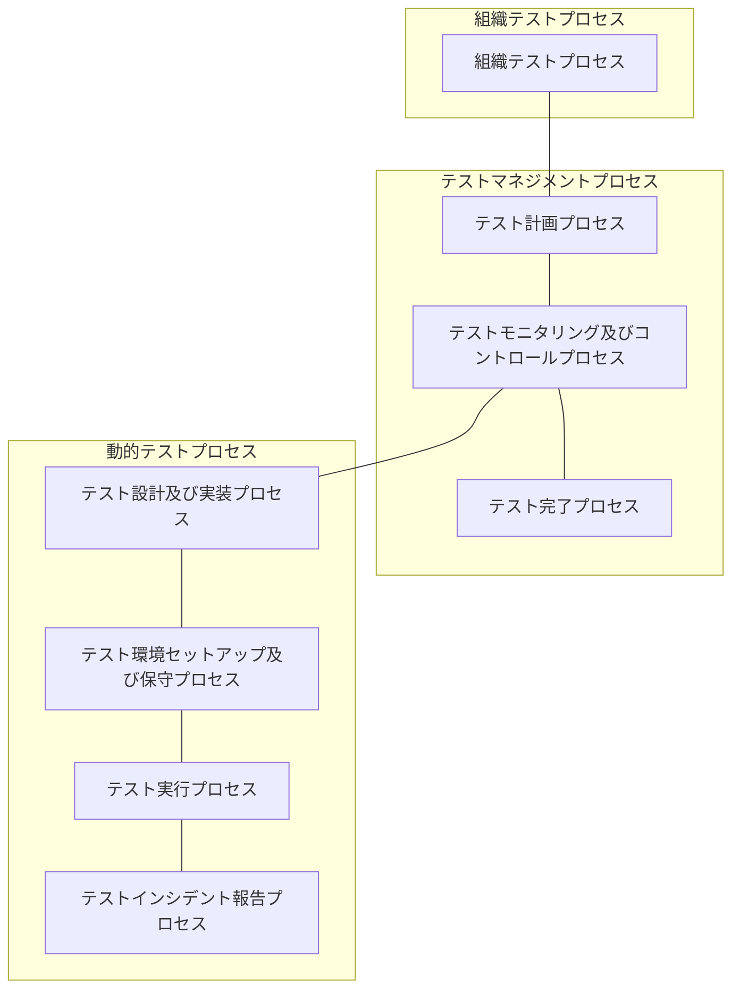

各層の目的は以下の通りです。

a) **組織テストプロセス ([箇条 6](#Chapter_6))**
1) 組織テスト方針、戦略、プロセス、手順、およびその他の資産などの、組織テスト仕様書の作成および維持のためのプロセスを定義します。

b) **テストマネジメントプロセス ([箇条 7](#Chapter_7))**
1) テストプロジェクト全体、またはテストプロジェクト内の任意のテストフェーズ（例：システムテスト）若しくはテストタイプ（例：性能テスト）のテストマネジメントを網羅するプロセスを定義します（例：プロジェクトテストマネジメント、システムテストマネジメント、性能テストマネジメント）。
2) テストマネジメントプロセスは以下の通りです。
   i) テスト計画プロセス ([箇条 7.2](#Chapter_7.2))
   ii) テストモニタリング及びコントロールプロセス ([箇条 7.3](#Chapter_7.3))
   iii) テスト完了プロセス ([箇条 7.4](#Chapter_7.4))

c) **動的テストプロセス ([箇条 8](#Chapter_8))**
1) 動的テストを実行するための汎用プロセスを定義します。動的テストは、テストプロジェクト内の特定のテストフェーズ（例：ユニット、統合、システム、受入れ）または特定のテストタイプ（例：性能テスト、セキュリティテスト、機能テスト）で実行される場合があります。
2) 動的テストプロセスは以下の通りです。
   i) テスト設計及び実装プロセス ([箇条 8.2](#Chapter_8.2))
   ii) テスト環境セットアップ及び保守プロセス ([箇条 8.3](#Chapter_8.3))
   iii) テスト実行プロセス ([箇条 8.4](#Chapter_8.4))
   iv) テストインシデント報告プロセス ([箇条 8.5](#Chapter_8.5))

注記：IEEE 1012 では、動的テストプロセスは「テストプロセス」として言及されています。

### [図 2](#Figure_2) — すべてのテストプロセスを示す多層モデル {#Figure_2}
*(ビジュアル参照: [ISO_IEC_IEEE_29119-2_2013(E)_page-0017.jpg](file:///c:/dev/Antigravity/ATRS%20%E5%A4%96%E9%83%A8%E8%A8%AD%E8%A8%88%E6%9B%B8%20Markdown%E5%8C%96/00_Source_Materials/ISO_IEC_IEEE_29119-2_2013(E)-Character_PDF_document/ISO_IEC_IEEE_29119-2_2013(E)-Character_PDF_document/ISO_IEC_IEEE_29119-2_2013(E)-Character_PDF_document_page-0017.jpg))*

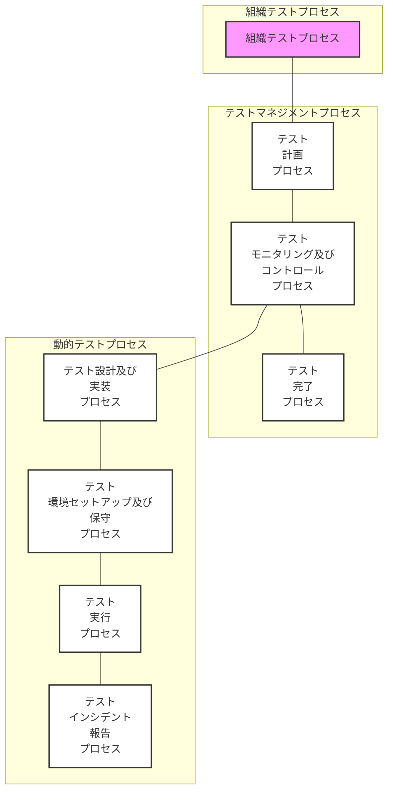

## 6 組織テストプロセス (Organizational Test Process) {#Chapter_6}
*(ビジュアル参照: [ISO_IEC_IEEE_29119-2_2013(E)_page-0017.jpg](file:///c:/dev/Antigravity/ATRS%20%E5%A4%96%E9%83%A8%E8%A8%AD%E8%A8%88%E6%9B%B8%20Markdown%E5%8C%96/00_Source_Materials/ISO_IEC_IEEE_29119-2_2013(E)-Character_PDF_document/ISO_IEC_IEEE_29119-2_2013(E)-Character_PDF_document/ISO_IEC_IEEE_29119-2_2013(E)-Character_PDF_document_page-0017.jpg))*

### 6.1 導入 {#Chapter_6.1}

組織テストプロセスは、組織テスト仕様書を開発および管理するために使用されます。これらの仕様書は通常、組織全体におけるテストに適用されます（すなわち、プロジェクトベースではありません）。組織テスト方針および組織テスト戦略は、組織テスト仕様書の例です。組織テストプロセスは汎用的であり、複数の関連プロジェクトに適用されるプログラムテスト戦略など、他の非プロジェクト固有のテスト文書の開発および管理に使用できます。

組織テスト方針は、組織内におけるテストの目的、目標、および全体的な範囲を記述したエグゼクティブレベルの文書です。また、組織のテストプラクティスを確立し、組織のテスト方針、テスト戦略、およびプロジェクトのテストマネジメントへのアプローチを確立、レビュー、および継続的に改善するための枠組みを提供します。

組織テスト戦略は、組織内でテストがどのように実施されるかを定義する詳細な技術文書です。これは、組織内の多数のプロジェクトにガイドラインを提供する汎用的な文書であり、プロジェクト固有ではありません。

図 3 は、組織のテスト方針およびテスト戦略の両方を作成および維持するために組織テストプロセスが適用された典型的な状況を示しています。図 3 が示すように、2つの組織レベルのプロセスのインスタンスは相互に通信します。組織テスト戦略は組織テスト方針と整合している必要があり、この活動からのフィードバックは、将来のプロセス改善のためにテスト方針に提供されます。同様に、組織内の各プロジェクトで使用されているテストマネジメントプロセスは、組織テスト戦略（および方針）と整合している必要があり、これらのプロジェクトの管理からのフィードバックは、組織テスト仕様書を策定および維持する組織テストプロセスを改善するために使用されます。

### [図 3](#Figure_3) — 組織テストプロセスの実装例 {#Figure_3}
*(ビジュアル参照: [ISO_IEC_IEEE_29119-2_2013(E)_page-0018.jpg](file:///c:/dev/Antigravity/ATRS%20%E5%A4%96%E9%83%A8%E8%A8%AD%E8%A8%88%E6%9B%B8%20Markdown%E5%8C%96/00_Source_Materials/ISO_IEC_IEEE_29119-2_2013(E)-Character_PDF_document/ISO_IEC_IEEE_29119-2_2013(E)-Character_PDF_document/ISO_IEC_IEEE_29119-2_2013(E)-Character_PDF_document_page-0018.jpg))*

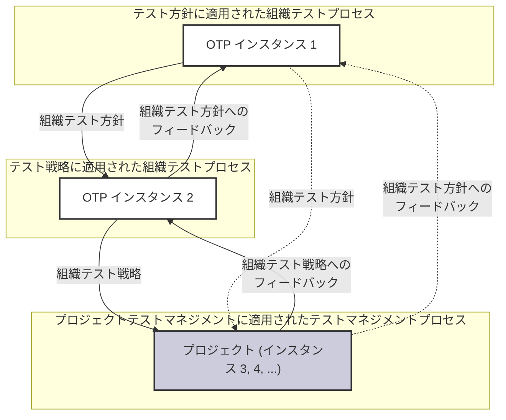

### 6.2 組織テストプロセス {#Chapter_6.2}

#### 6.2.1 概要 {#Chapter_6.2.1}

組織テストプロセスは、組織テスト仕様書の作成、レビュー、および維持のための活動で構成されます。また、それらに対する組織の適合性のモニタリングも網羅します（図 4 参照）。

### [図 4](#Figure_4) — 組織テストプロセス {#Figure_4}
*(ビジュアル参照: [ISO_IEC_IEEE_29119-2_2013(E)_page-0020.jpg](file:///c:/dev/Antigravity/ATRS%20%E5%A4%96%E9%83%A8%E8%A8%AD%E8%A8%88%E6%9B%B8%20Markdown%E5%8C%96/00_Source_Materials/ISO_IEC_IEEE_29119-2_2013(E)-Character_PDF_document/ISO_IEC_IEEE_29119-2_2013(E)-Character_PDF_document/ISO_IEC_IEEE_29119-2_2013(E)-Character_PDF_document_page-0020.jpg))*

#### 6.2.2 目的 {#Chapter_6.2.2}

組織テストプロセスの目的は、組織テスト方針や組織テスト戦略などの組織テスト仕様書を開発し、適合性をモニタリングし、維持することです。

#### 6.2.3 成果 {#Chapter_6.2.3}

組織テストプロセスの実装が成功した結果、以下のことが達成されます。

a) 組織テスト仕様書に対する要求事項が特定される。
b) 組織テスト仕様書が開発される。
c) 組織テスト仕様書がステークホルダーによって合意される。
d) 組織テスト仕様書がアクセス可能にされる。
e) 組織テスト仕様書への適合性がモニタリングされる。
f) 組織テスト仕様書への更新がステークホルダーによって合意される。
g) 組織テスト仕様書への更新が行われる。

#### 6.2.4 アクティビティ及びタスク {#Chapter_6.2.4}

組織テスト仕様書の責任者は、組織テストプロセスに関して、適用される組織の方針および手順に従って、以下のアクティビティおよびタスクを実施しなければならない。

##### 6.2.4.1 組織テスト仕様書の開発 (OT1) {#Chapter_6.2.4.1}

このアクティビティは、以下のタスクで構成される。

a) 組織テスト仕様書に対する要求事項は、組織内の現在のテストプラクティス、ステークホルダーから特定される、および／または他の手段によって開発されなければならない。
注記：これは、関連するソース文書の分析、ワークショップ、インタビュー、またはその他の適切な手段を通じて達成できます。
b) 組織テスト仕様書の要求事項は、組織テスト仕様書を作成するために使用されなければならない。
c) 組織テスト仕様書の内容に関する承認は、ステークホルダーから得られなければならない。
d) 組織テスト仕様書の利用可能性は、組織内のステークホルダーに伝えられなければならない。

##### 6.2.4.2 組織テスト仕様書の使用のモニタリング及びコントロール (OT2) {#Chapter_6.2.4.2}

このアクティビティは、以下のタスクで構成される。

a) 組織テスト仕様書の使用状況は、それが組織内で効果的に使用されているかどうかを判断するためにモニタリングされなければならない。
b) ステークホルダーを組織テスト仕様書に同調させるよう促すために、適切な措置が講じられなければならない。

##### 6.2.4.3 組織テスト仕様書の更新 (OT3) {#Chapter_6.2.4.3}

このアクティビティは、以下のタスクで構成される。

a) 組織テスト仕様書の使用に関するフィードバックは、レビューされるべきである。
b) 組織テスト仕様書の使用および管理の有効性は考慮されるべきであり、その有効性を向上させるためのフィードバックおよび変更は決定および承認されるべきである。
注記：これは、フィードバックのレビュー、ワークショップ、インタビュー、およびその他の適切な手段を通じて達成できます。
c) 組織テスト仕様書への変更が特定および承認された場合、これらの変更は実施されなければならない。
d) 組織テスト仕様書へのすべての変更は、すべてのステークホルダーを含む組織全体に伝えられなければならない。

#a) 組織テスト仕様書
例：組織テスト方針、組織テスト戦略。

---

## 7 テストマネジメントプロセス (Test Management Processes) {#Chapter_7}
*(ビジュアル参照: [ISO_IEC_IEEE_29119-2_2013(E)_page-0021.jpg](file:///c:/dev/Antigravity/ATRS%20%E5%A4%96%E9%83%A8%E8%A8%AD%E8%A8%88%E6%9B%B8%20Markdown%E5%8C%96/00_Source_Materials/ISO_IEC_IEEE_29119-2_2013(E)-Character_PDF_document/ISO_IEC_IEEE_29119-2_2013(E)-Character_PDF_document/ISO_IEC_IEEE_29119-2_2013(E)-Character_PDF_document_page-0021.jpg))*

### 7.1 導入 {#Chapter_7.1}

テストマネジメントプロセスは、プロジェクト全体、またはプロジェクト内の特定のテストサブプロセス（例：テストレベルまたはテストタイプ）のテストプロジェクトマネジメントのために使用されます。

テストマネジメントプロセスは以下の通りです。
- テスト計画プロセス ([箇条 7.2](#Chapter_7.2))
- テストモニタリング及びコントロールプロセス ([箇条 7.3](#Chapter_7.3))
- テスト完了プロセス ([箇条 7.4](#Chapter_7.4))

図 5 は、これら3つのプロセスの関係を示しています。テスト計画プロセスは、テスト計画書（または更新されたテスト計画書）を作成するために最初に使用され、これがテストモニタリング及びコントロールプロセスを動かします。モニタリングの結果として、調整的なアクションが必要な場合、これは計画の更新および／またはさらなるテストコントロール活動につながる可能性があります。すべてのテスト活動が完了すると、テスト完了プロセスが使用され、関連するすべての情報をアーカイブし、関連するステークホルダーに報告します。

### [図 5](#Figure_5) — テストマネジメントプロセスの関係 {#Figure_5}
*(ビジュアル参照: [ISO_IEC_IEEE_29119-2_2013(E)_page-0021.jpg](file:///c:/dev/Antigravity/ATRS%20%E5%A4%96%E9%83%A8%E8%A8%AD%E8%A8%88%E6%9B%B8%20Markdown%E5%8C%96/00_Source_Materials/ISO_IEC_IEEE_29119-2_2013(E)-Character_PDF_document/ISO_IEC_IEEE_29119-2_2013(E)-Character_PDF_document/ISO_IEC_IEEE_29119-2_2013(E)-Character_PDF_document_page-0021.jpg))*

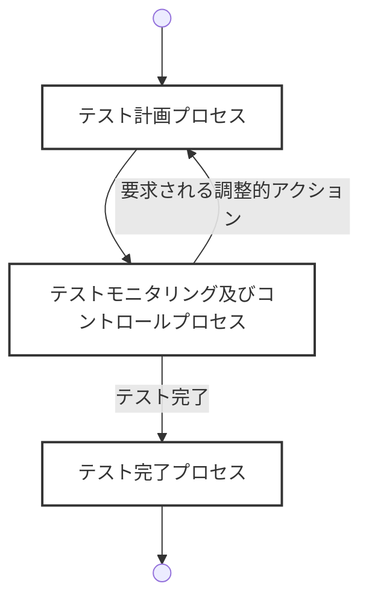

### 7.2 テスト計画プロセス (Test Planning Process) {#Chapter_7.2}

#### 7.2.1 概要 {#Chapter_7.2.1}

テスト計画プロセスは、組織テスト方針、組織テスト戦略、およびプロジェクトのテストベース（例：要件、アーキテクチャ、設計）などの入力を考慮して、テストのアプローチを計画し、テスト計画書の形で記録するために使用されます。このプロセスは、テストのための資源（リソース）が必要なときに利用可能であり、かつテストが効率的、効果的、かつ合意されたパラメータ（例：予算、スケジュール、品質）内で実施されることを確実にするために実施されます。テスト計画プロセスは、図 6 に示す活動で構成されます。

### [図 6](#Figure_6) — テスト計画プロセス {#Figure_6}
*(ビジュアル参照: [ISO_IEC_IEEE_29119-2_2013(E)_page-0022.jpg](file:///c:/dev/Antigravity/ATRS%20%E5%A4%96%E9%83%A8%E8%A8%AD%E8%A8%88%E6%9B%B8%20Markdown%E5%8C%96/00_Source_Materials/ISO_IEC_IEEE_29119-2_2013(E)-Character_PDF_document/ISO_IEC_IEEE_29119-2_2013(E)-Character_PDF_document/ISO_IEC_IEEE_29119-2_2013(E)-Character_PDF_document_page-0022.jpg))*

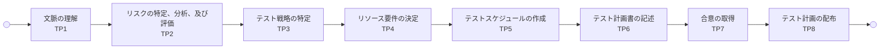

#### 7.2.2 目的 {#Chapter_7.2.2}

テスト計画プロセスの目的は、テスト計画書の作成を通じてテスト活動の実施を計画することです。

#### 7.2.3 成果 {#Chapter_7.2.3}

テスト計画プロセスの実装が成功した結果、以下のことが達成されます。

a) テストの文脈が理解される。
b) テスト対象の製品およびプロジェクトに対するリスクが特定、分析、および評価される。
c) リスクに対応するためのテスト戦略が特定される。
d) 必要なリソース（人員、ツール、環境）が決定される。
e) テストスケジュールが作成される。
f) テスト計画書が合意される。
g) テスト計画書が利用可能にされる。

#### 7.2.4 アクティビティ及びタスク {#Chapter_7.2.4}

テストマネージャー（または合意された担当者）は、テスト計画プロセスに関して、以下の活動およびタスクを実施しなければならない。

##### 7.2.4.1 文脈の理解 (TP1) {#Chapter_7.2.4.1}

この活動は、以下のタスクで構成される。

a) テスト対象のプロジェクト、アプリケーション、システム、およびコンポーネントが、関連するステークホルダーとのコミュニケーションを通じて理解されなければならない。
b) 適用可能なすべての組織テスト仕様書が特定されなければならない。

##### 7.2.4.2 リスクの特定、分析、及び評価 (TP2) {#Chapter_7.2.4.2}

この活動は、以下のタスクで構成される。

a) テスト対象の製品に関するリスク（製品リスク）が特定、分析、および評価されなければならない。
b) テストに関連するプロジェクトのリスク（プロジェクトリスク）が特定、分析、および評価されなければならない。
注記：リスクの特定、分析、および評価は、関連するステークホルダーが関与するワークショップやインタビューなどの手段を通じて、組織レベルの適切なリスク管理方針に従って行われることが一般的です。

##### 7.2.4.3 テスト戦略の特定 (TP3) {#Chapter_7.2.4.3}

この活動は、以下のタスクで構成される。

a) 特定されたリスクを軽減するためのテスト戦略が決定されなければならない。
b) 各特定されたリスクに対して、リスク軽減または受容の対応が割り当てられなければならない。
c) 採用されるテスト設計技法、およびテスト完了基準が決定されなければならない。
d) テストレベル（フェーズ）、テストタイプ、およびそれらの関係が決定されなければならない。
e) 再テストおよび回帰テストへのアプローチが決定されなければならない。
f) テストデータおよびテスト環境の要求事項が特定されなければならない。
g) テストツールの使用が決定されなければならない。
h) 本パートへの適合が主張される範囲が特定され、調整（テーラリング）の決定が記録されなければならない。

##### 7.2.4.4 リソース要件の決定 (TP4) {#Chapter_7.2.4.4}

この活動は、以下のタスクで構成される。

a) テストの実施に必要な人員（スキルセットを含む）、物理的リソース（環境、機器）、および資金が、合意された戦略に基づいて見積もられなければならない。
b) 必要とされるリソースの入手可能性が検討されなければならない。

##### 7.2.4.5 テストスケジュールの作成 (TP5) {#Chapter_7.2.4.5}

この活動は、以下のタスクで構成される。

a) 各テスト活動の期間、依存関係、および重要なマイルストーンを網羅するテストスケジュールが作成されなければならない。

##### 7.2.4.6 テスト計画書の記述 (TP6) {#Chapter_7.2.4.6}

この活動は、以下のタスクで構成される。

a) 決定されたすべてのアプローチ、リソース、およびスケジュールを網羅するテスト計画書が記述されなければならない。
注記：テスト計画書の構造および内容については ISO/IEC/IEEE 29119-3 を参照してください。

##### 7.2.4.7 合意の取得 (TP7) {#Chapter_7.2.4.7}

この活動は、以下のタスクで構成される。

a) テスト計画書は、承認を得るために指定されたステークホルダーに配布されなければならない。
b) フィードバックに基づいた必要な修正が行われ、最終的な承認が得られなければならない。

##### 7.2.4.8 テスト計画の配布 (TP8) {#Chapter_7.2.4.8}

この活動は、以下のタスクで構成される。

a) 承認されたテスト計画書は、すべての関連するステークホルダーに配布されるか、アクセス可能にされなければならない。

#### 7.2.5 情報項目 {#Chapter_7.2.5}

a) テスト計画書

---

### 7.3 テストモニタリング及びコントロールプロセス (Test Monitoring and Control Process) {#Chapter_7.3}

#### 7.3.1 概要 {#Chapter_7.3.1}

テストモニタリング及びコントロールプロセスは、テストがテスト計画書、および組織の適切なテスト仕様書に従って実施されているかどうかを判断するために使用されます。このプロセスは継続的に実施され、必要な調整的アクション（計画の更新等）およびステークホルダーへの報告が含まれます（図 7 参照）。

### [図 7](#Figure_7) — テストモニタリング及びコントロールプロセス {#Figure_7}
*(ビジュアル参照: [ISO_IEC_IEEE_29119-2_2013(E)_page-0027.jpg](file:///c:/dev/Antigravity/ATRS%20%E5%A4%96%E9%83%A8%E8%A8%AD%E8%A8%88%E6%9B%B8%20Markdown%E5%8C%96/00_Source_Materials/ISO_IEC_IEEE_29119-2_2013(E)-Character_PDF_document/ISO_IEC_IEEE_29119-2_2013(E)-Character_PDF_document/ISO_IEC_IEEE_29119-2_2013(E)-Character_PDF_document_page-0027.jpg))*

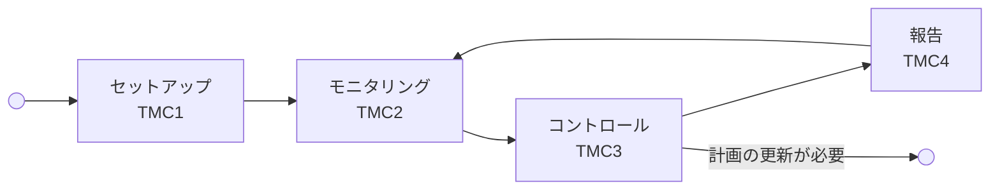

#### 7.3.2 目的 {#Chapter_7.3.2}

テストモニタリング及びコントロールプロセスの目的は、テストの進捗および状況を把握し、テスト計画からの乖離を特定して適切な対応を講じることです。

#### 7.3.3 成果 {#Chapter_7.3.3}

a) 進捗を測定するための手段が確立される。
b) テストの進捗がモニタリングされる。
c) 計画からの乖離が特定される。
d) 必要な調整的アクションが決定され、実施される。
e) テストの状況がステークホルダーに報告される。

#### 7.3.4 アクティビティ及びタスク {#Chapter_7.3.4}

##### 7.3.4.1 セットアップ (TMC1) {#Chapter_7.3.4.1}

a) 進捗および品質を測定するためのメトリクス（指標）が定義されなければならない。
b) 状況報告の頻度および方法が合意されなければならない。

##### 7.3.4.2 モニタリング (TMC2) {#Chapter_7.3.4.2}

a) 実際の進捗、リソースの使用、およびテスト結果が、計画と比較してモニタリングされなければならない。
b) 新たなリスク、またはリスクレベルの変化が特定されなければならない。

##### 7.3.4.3 コントロール (TMC3) {#Chapter_7.3.4.3}

a) モニタリングの結果、計画からの重大な乖離（遅延、品質問題等）が特定された場合、適切な調整的アクションが決定および実施されなければならない。
b) 戦略の大幅な変更が必要な場合、テスト計画プロセス ([7.2](#Chapter_7.2)) にフィードバックされなければならない。

##### 7.3.4.4 報告 (TMC4) {#Chapter_7.3.4.4}

a) テストの現在の状況（進捗、残存リスク、問題点等）を記述したテスト状況報告書が定期的に作成され、ステークホルダーに配布されなければならない。

#### 7.3.5 情報項目 {#Chapter_7.3.5}

a) テスト状況報告書

---

### 7.4 テスト完了プロセス (Test Completion Process) {#Chapter_7.4}

#### 7.4.1 概要 {#Chapter_7.4.1}

テスト完了プロセスは、テストフェーズまたはプロジェクトの終了時に、テスト資産をアーカイブし、テスト環境を解除し、最終報告を行うために使用されます（図 8 参照）。

### [図 8](#Figure_8) — テスト完了プロセス {#Figure_8}
*(ビジュアル参照: [ISO_IEC_IEEE_29119-2_2013(E)_page-0030.jpg](file:///c:/dev/Antigravity/ATRS%20%E5%A4%96%E9%83%A8%E8%A8%AD%E8%A8%88%E6%9B%B8%20Markdown%E5%8C%96/00_Source_Materials/ISO_IEC_IEEE_29119-2_2013(E)-Character_PDF_document/ISO_IEC_IEEE_29119-2_2013(E)-Character_PDF_document/ISO_IEC_IEEE_29119-2_2013(E)-Character_PDF_document_page-0030.jpg))*

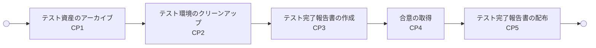

#### 7.4.2 目的 {#Chapter_7.4.2}

テスト完了プロセスの目的は、将来の再利用や監査のためにテスト資産を整理し、テストの最終結果をステークホルダーに伝えることです。

#### 7.4.3 成果 {#Chapter_7.4.3}

a) 再利用可能なテスト資産（テストケース、スクリプト等）が保存される。
b) テスト環境が合意された状態に戻される。
c) テスト完了報告書が作成され、合意される。

#### 7.4.4 アクティビティ及びタスク {#Chapter_7.4.4}

##### 7.4.4.1 テスト資産のアーカイブ (CP1) {#Chapter_7.4.4.1}

a) テスト計画、テストケース、テスト実行ログ、インシデントレポートなどの重要なワークプロダクトが、将来の参照のためにアーカイブされなければならない。

##### 7.4.4.2 テスト環境のクリーンアップ (CP2) {#Chapter_7.4.4.2}

a) テスト環境が元の状態、または次の利活用に適した状態に戻されなければならない。

##### 7.4.4.3 テスト完了報告書の作成 (CP3) {#Chapter_7.4.4.3}

a) 実施されたすべてのテスト活動、達成された網羅率、残存欠陥の状況、および学んだ教訓（Lessons Learned）を網羅するテスト完了報告書が作成されなければならない。

##### 7.4.4.4 合意の取得及び配布 (CP4, CP5) {#Chapter_7.4.4.4}

a) テスト完了報告書は、ステークホルダーによってレビューおよび承認されなければならない。
b) 承認された報告書は配布されなければならない。

#### 7.4.5 情報項目 {#Chapter_7.4.5}

a) テスト完了報告書

---

## 8 動的テストプロセス (Dynamic Test Processes) {#Chapter_8}
*(ビジュアル参照: [ISO_IEC_IEEE_29119-2_2013(E)_page-0033.jpg](file:///c:/dev/Antigravity/ATRS%20%E5%A4%96%E9%83%A8%E8%A8%AD%E8%A8%88%E6%9B%B8%20Markdown%E5%8C%96/00_Source_Materials/ISO_IEC_IEEE_29119-2_2013(E)-Character_PDF_document/ISO_IEC_IEEE_29119-2_2013(E)-Character_PDF_document/ISO_IEC_IEEE_29119-2_2013(E)-Character_PDF_document_page-0033.jpg))*

### 8.1 導入 {#Chapter_8.1}

動的テストプロセスは、テストプロジェクト内の特定のテストサブプロセス（例：テストレベルまたはテストタイプ）において、動的テスト活動を実施するために使用されます。

動的テストプロセスは以下の通りです。
- テスト設計及び実装プロセス ([箇条 8.2](#Chapter_8.2))
- テスト環境セットアップ及び保守プロセス ([箇条 8.3](#Chapter_8.3))
- テスト実行プロセス ([箇条 8.4](#Chapter_8.4))
- テストインシデント報告プロセス ([箇条 8.5](#Chapter_8.5))

図 9 は、これら4つのプロセスの関係を示しています。テスト設計及び実装プロセスは、テスト環境の要件を特定し、実行に向けたテスト手順を作成します。これを受けてテスト環境セットアップ及び保守プロセスが実施されます。環境が準備され、手順が完成すると、テスト実行プロセスが開始されます。実行中に予期しない結果（インシデント）が発生した場合、テストインシデント報告プロセスが使用されます。

### [図 9](#Figure_9) — 動的テストプロセスの関係 {#Figure_9}
*(ビジュアル参照: [ISO_IEC_IEEE_29119-2_2013(E)_page-0033.jpg](file:///c:/dev/Antigravity/ATRS%20%E5%A4%96%E9%83%A8%E8%A8%AD%E8%A8%88%E6%9B%B8%20Markdown%E5%8C%96/00_Source_Materials/ISO_IEC_IEEE_29119-2_2013(E)-Character_PDF_document/ISO_IEC_IEEE_29119-2_2013(E)-Character_PDF_document/ISO_IEC_IEEE_29119-2_2013(E)-Character_PDF_document_page-0033.jpg))*

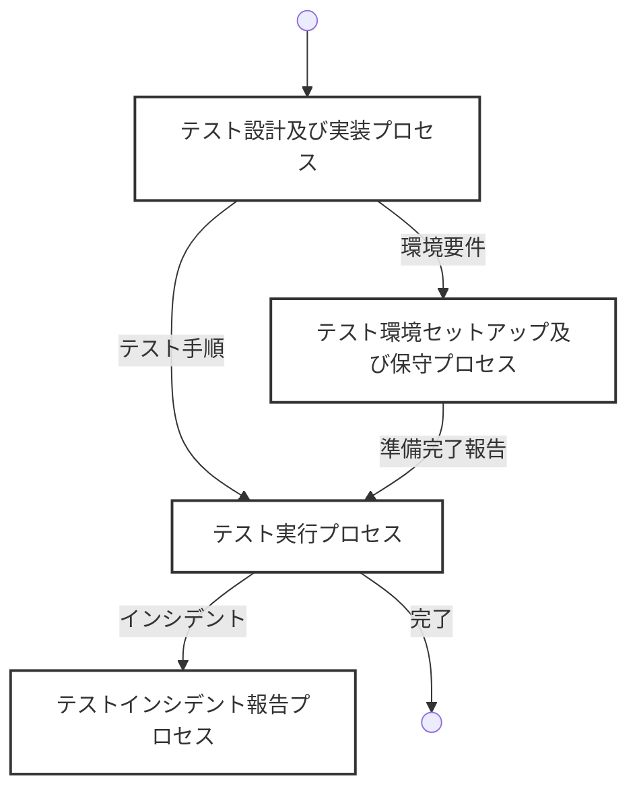

### 8.2 テスト設計及び実装プロセス (Test Design and Implementation Process) {#Chapter_8.2}

#### 8.2.1 概要 {#Chapter_8.2.1}

テスト設計及び実装プロセスは、テストベースとなる情報（要件等）からテストケースおよびテスト手順を導出するために使用されます。このプロセスには、テスト網羅項目の特定、テスト設計、テストケースの作成、およびそれらを論理的な順序に並べたテスト手順の作成が含まれます（図 10 参照）。

### [図 10](#Figure_10) — テスト設計及び実装プロセス {#Figure_10}
*(ビジュアル参照: [ISO_IEC_IEEE_29119-2_2013(E)_page-0034.jpg](file:///c:/dev/Antigravity/ATRS%20%E5%A4%96%E9%83%A8%E8%A8%AD%E8%A8%88%E6%9B%B8%20Markdown%E5%8C%96/00_Source_Materials/ISO_IEC_IEEE_29119-2_2013(E)-Character_PDF_document/ISO_IEC_IEEE_29119-2_2013(E)-Character_PDF_document/ISO_IEC_IEEE_29119-2_2013(E)-Character_PDF_document_page-0034.jpg))*

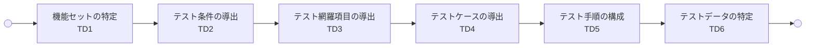

#### 8.2.2 目的 {#Chapter_8.2.2}

テスト設計及び実装プロセスの目的は、テスト対象を適切に実行し、所定の網羅率を達成するためのテスト手順セットを作成することです。

#### 8.2.3 成果 {#Chapter_8.2.3}

a) テストされる機能（機能セット）が特定される。
b) テスト条件および網羅項目が導出される。
c) テストケースが導出される。
d) テスト手順が記述される。
e) 必要なテストデータが特定される。

#### 8.2.4 アクティビティ及びタスク {#Chapter_8.2.4}

本パートへの適合が主張される各テストサブプロセスにおいて、テスター（または合意された担当者）は以下のアクティビティおよびタスクを実施しなければならない。

##### 8.2.4.1 機能セットの特定 (TD1) {#Chapter_8.2.4.1}

a) テストベースに基づいて、テストされるべき論理的なグループ分け（機能セット）が特定されなければならない。

##### 8.2.4.2 テスト条件の導出 (TD2) {#Chapter_8.2.4.2}

a) 各機能セットに対して、何をテストすべきか（テスト条件）が導出されなければならない。

##### 8.2.4.3 テスト網羅項目の導出 (TD3) {#Chapter_8.2.4.3}

a) テスト戦略で指定されたテスト設計技法を使用して、具体的な網羅項目が導出されなければならない。

##### 8.2.4.4 テストケースの導出 (TD4) {#Chapter_8.2.4.4}

a) 特定された網羅項目を実行するためのテストケース（入力、期待結果、前提条件）が導出されなければならない。

##### 8.2.4.5 テスト手順の構成 (TD5) {#Chapter_8.2.4.5}

a) テストケースは、効率的な実行順序（依存関係、効率、リスク等を考慮）に並べられ、テスト手順として文書化されなければならない。

##### 8.2.4.6 テストデータの特定 (TD6) {#Chapter_8.2.4.6}

a) テストケースの実行に必要なデータ、およびそれらの準備方法が特定されなければならない。

#### 8.2.5 情報項目 {#Chapter_8.2.5}

a) テスト設計仕様書
b) テストケース仕様書
c) テスト手順仕様書
d) テストデータ要件

---

### 8.3 テスト環境セットアップ及び保守プロセス (Test Environment Set-up and Maintenance Process) {#Chapter_8.3}

#### 8.3.1 概要 {#Chapter_8.3.1}

このプロセスは、必要なテスト環境およびテストデータを準備し、テスト実行中にそれらを維持するために使用されます（図 11 参照）。

### [図 11](#Figure_11) — テスト環境セットアップ及び保守プロセス {#Figure_11}
*(ビジュアル参照: [ISO_IEC_IEEE_29119-2_2013(E)_page-0038.jpg](file:///c:/dev/Antigravity/ATRS%20%E5%A4%96%E9%83%A8%E8%A8%AD%E8%A8%88%E6%9B%B8%20Markdown%E5%8C%96/00_Source_Materials/ISO_IEC_IEEE_29119-2_2013(E)-Character_PDF_document/ISO_IEC_IEEE_29119-2_2013(E)-Character_PDF_document/ISO_IEC_IEEE_29119-2_2013(E)-Character_PDF_document_page-0038.jpg))*

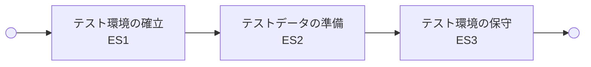

#### 8.3.2 目的 {#Chapter_8.3.2}

テスト環境セットアップ及び保守プロセスの目的は、テスト実行が可能な状態に環境とデータを整えることです。

#### 8.3.3 成果 {#Chapter_8.3.3}

a) テスト環境が確立される。
b) テストデータが準備される。
c) 環境およびデータの準備完了状況が報告される。

#### 8.3.4 アクティビティ及びタスク {#Chapter_8.3.4}

##### 8.3.4.1 テスト環境の確立 (ES1) {#Chapter_8.3.4.1}

a) 指定された要件に従って、ハードウェア、ソフトウェア、ネットワーク、およびツールがセットアップされなければならない。

##### 8.3.4.2 テストデータの準備 (ES2) {#Chapter_8.3.4.2}

a) テスト実行に必要なすべてのデータが準備され、環境内にロードされなければならない。

##### 8.3.4.3 テスト環境の保守 (ES3) {#Chapter_8.3.4.3}

a) テスト実行中、環境に不具合や不整合が発生した場合には速やかに是正されなければならない。

#### 8.3.5 情報項目 {#Chapter_8.3.5}

a) テスト環境準備完了報告書
b) テストデータ準備完了報告書

---

### 8.4 テスト実行プロセス (Test Execution Process) {#Chapter_8.4}

#### 8.4.1 概要 {#Chapter_8.4.1}

テスト実行プロセスは、準備された環境上でテスト手順を実行し、その結果を記録するために使用されます（図 12 参照）。

### [図 12](#Figure_12) — テスト実行プロセス {#Figure_12}
*(ビジュアル参照: [ISO_IEC_IEEE_29119-2_2013(E)_page-0041.jpg](file:///c:/dev/Antigravity/ATRS%20%E5%A4%96%E9%83%A8%E8%A8%AD%E8%A8%88%E6%9B%B8%20Markdown%E5%8C%96/00_Source_Materials/ISO_IEC_IEEE_29119-2_2013(E)-Character_PDF_document/ISO_IEC_IEEE_29119-2_2013(E)-Character_PDF_document/ISO_IEC_IEEE_29119-2_2013(E)-Character_PDF_document_page-0041.jpg))*

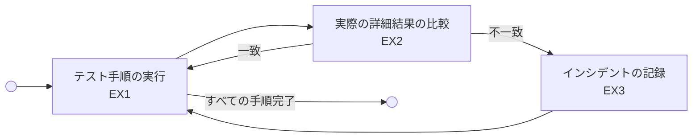

#### 8.4.2 目的 {#Chapter_8.4.2}

テスト実行プロセスの目的は、テストアイテムが意図した通りに動作するかどうかを確認し、不具合を検出することです。

#### 8.4.3 成果 {#Chapter_8.4.3}

a) テスト手順が実行される。
b) 実際の詳細結果が記録される。
c) 実際の詳細結果と期待結果が比較される。
d) 実行の詳細（証跡）が記録される。

#### 8.4.4 アクティビティ及びタスク {#Chapter_8.4.4}

##### 8.4.4.1 テスト手順の実行 (EX1) {#Chapter_8.4.4.1}

a) 定義されたテスト手順に従って、テストが実行されなければならない。

##### 8.4.4.2 実際の詳細結果の比較 (EX2) {#Chapter_8.4.4.2}

a) テストアイテムの実際の振る舞い（実際の詳細結果）が、テストケースで定義された期待結果と比較されなければならない。

##### 8.4.4.3 インシデントの記録 (EX3) {#Chapter_8.4.4.3}

a) 期待結果と実際の詳細結果に不一致がある場合、または実行中に異常が発生した場合は、記録されなければならない。

#### 8.4.5 情報項目 {#Chapter_8.4.5}

a) テスト実行ログ

---

### 8.5 テストインシデント報告プロセス (Test Incident Reporting Process) {#Chapter_8.5}

#### 8.5.1 概要 {#Chapter_8.5.1}

期待結果と異なる結果が発生した場合、それを適切に記述し、ライフサイクル全体で管理するために使用されます（図 13 参照）。

### [図 13](#Figure_13) — テストインシデント報告プロセス {#Figure_13}
*(ビジュアル参照: [ISO_IEC_IEEE_29119-2_2013(E)_page-0044.jpg](file:///c:/dev/Antigravity/ATRS%20%E5%A4%96%E9%83%A8%E8%A8%AD%E8%A8%88%E6%9B%B8%20Markdown%E5%8C%96/00_Source_Materials/ISO_IEC_IEEE_29119-2_2013(E)-Character_PDF_document/ISO_IEC_IEEE_29119-2_2013(E)-Character_PDF_document/ISO_IEC_IEEE_29119-2_2013(E)-Character_PDF_document_page-0044.jpg))*

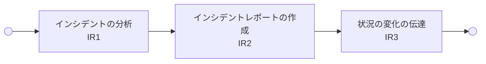

#### 8.5.2 目的 {#Chapter_8.5.2}

テストインシデント報告プロセスの目的は、検出された問題を調査および修正できるようにするために必要な情報をすべて提供することです。

#### 8.5.3 成果 {#Chapter_8.3.3}

a) インシデントの性質が記述される。
b) インシデントが関連するステークホルダーに報告される。

#### 8.5.4 アクティビティ及びタスク {#Chapter_8.5.4}

##### 8.5.4.1 インシデントの分析 (IR1) {#Chapter_8.5.4.1}

a) 不一致がテストエラー（設定ミス等）によるものか、テストアイテムの欠陥によるものかが分析されなければならない。

##### 8.5.4.2 インシデントレポートの作成 (IR2) {#Chapter_8.5.4.2}

a) 再現手順、システムログ、スクリーンショットなどの詳細を含むインシデントレポートが作成されなければならない。

##### 8.5.4.3 状況の変化の伝達 (IR3) {#Chapter_8.5.4.3}

a) インシデントが修正された場合、または新たな情報が得られた場合、レポートは更新され、ステークホルダーに伝えられなければならない。

#### 8.5.5 情報項目 {#Chapter_8.5.5}

a) インシデントレポート

---

# 附属書 A（参考）テスト設計プロセスの実施例 {#Chapter_Annex_A}
*(ビジュアル参照: [ISO_IEC_IEEE_29119-2_2013(E)_page-0046.jpg](file:///c:/dev/Antigravity/ATRS%20%E5%A4%96%E9%83%A8%E8%A8%AD%E8%A8%88%E6%9B%B8%20Markdown%E5%8C%96/00_Source_Materials/ISO_IEC_IEEE_29119-2_2013(E)-Character_PDF_document/ISO_IEC_IEEE_29119-2_2013(E)-Character_PDF_document/ISO_IEC_IEEE_29119-2_2013(E)-Character_PDF_document_page-0046.jpg))*

以下は、*テスト設計及び実装プロセス*のアクティビティ TD2 から TD5 の適用例です。

### テストベースの断片
「システムは、申込日の時点で年齢が18歳以上80歳未満の保険申込者（入力された満年齢に基づく）を受け入れなければならない。それ以外はすべて拒否するものとする。
70歳以上の承認された申込者には、請求の際に1,000ドルの免責金額を支払う必要があるという警告を表示しなければならない。」

### テスト完了基準
「テスト完了基準は、100 % の同等パーティション網羅が達成され、実行時にすべてのテストケースが『合格（pass）』ステータスとなることである。」

### テスト条件 (TD2)
テスト完了基準に基づき、テスト条件は記述されたシステム動作の同等パーティションです。

入力を考慮すると、以下の有効なパーティションが導出されます。
- **TCOND-1**: 18 ≤ 年齢 ≤ 80

同様に、入力から以下の2つの無効なパーティションが導出されます。
- **TCOND-2**: 年齢 < 18
- **TCOND-3**: 年齢 > 80

それほど明白ではない無効な入力パーティションには、整数以外の入力や数値以外の入力など、他の入力タイプが含まれる可能性があります。したがって、以下の無効な入力同等パーティションも生成できます。
- **TCOND-4**: 年齢 = アルファベット
- **TCOND-5**: 年齢 = 特殊文字

注意：必要な厳密さに応じて、数値以外の整数（例：33.67歳）など、さらなる無効な（非整数の）パーティションを導出することもできます。潜在的な無効な出力のセットは、無限に大きなセットです。

有効な（規定された）出力を考慮すると、以下の同等パーティションが特定されます。
- **TCOND-6**: 承認（18 ≤ 年齢 ≤ 80 によって引き起こされる）
- **TCOND-7**: 拒否（(年齢 < 18) または (年齢 > 80) によって引き起こされる）
- **TCOND-8**: 免責警告（70 ≤ 年齢 ≤ 80 によって引き起こされる）

無効な出力とは、規定されたもの以外のテストアイテムからの出力です。規定されていない出力を特定することは困難な場合がありますが、それが発生する可能性があれば、テストアイテム、そのテストベース、またはその両方に欠陥があることを特定したことになるため、考慮する必要があります。この例では、1つの規定されていない出力のみが特定され、以下に示されています。他のテスターは、かなり異なる無効な出力を導出する可能性があることに注意してください。
- **TCOND-9**: 割引メッセージ（40 ≤ 年齢 ≤ 55 によって引き起こされる）

### テスト網羅項目 (TD3)
同等分割法（各パーティションが実行されることのみを要求する手法）を使用すると、以下の7つのテスト網羅項目が導出されます。
- **TCI-1**: 18 ≤ 年齢 ≤ 80 (TCOND-1/TCOND-6 を網羅)
- **TCI-2**: 年齢 < 18 (TCOND-2/TCOND-7 を網羅)
- **TCI-3**: 年齢 > 80 (TCOND-3/TCOND-7 を網羅)
- **TCI-4**: 年齢 = w (TCOND-4 を網羅)
- **TCI-5**: 年齢 = & (TCOND-5 を網羅)
- **TCI-6**: 70 ≤ 年齢 ≤ 80 (TCOND-8 を網羅)
- **TCI-7**: 40 ≤ 年齢 ≤ 55 (TCOND-9 を網羅)

### テストケース (TD4)
7つのテスト網羅項目のそれぞれを実行するテストケースを生成すれば、100 % の同等パーティション網羅を達成できます。

テストケースを生成する際、1つのテストケースで複数のテスト網羅項目を同時に実行できる場合があります。テストケースの数を最小限に抑えることは、テスト実行時間を短縮できるという明らかなメリットがありますが、このメリットは、最小セットを決定するために必要な余分な時間や、テストケースが複数のテスト網羅項目をターゲットにしている場合のデバッグの複雑さによって相殺されることがあります。

この例では、以下に示すように、2つのテストケースが複数のテスト網羅項目を実行します。
- **CASE#1**: 入力: '年齢 = 53' — 期待結果: '承認' (TCI-1 & TCI-7 を実行)
- **CASE#2**: 入力: '年齢 = 15' — 期待結果: '拒否' (TCI-2 を実行)
- **CASE#3**: 入力: '年齢 = 89' — 期待結果: '拒否' (TCI-3 を実行)
- **CASE#4**: 入力: '年齢 = w' — 期待結果: '拒否' (TCI-4 を実行)
- **CASE#5**: 入力: '年齢 = &' — 期待結果: '拒否' (TCI-5 を実行)
- **CASE#6**: 入力: '年齢 = 77' — 期待結果: '承認 + 警告' (TCI-6 & TCI-1 を実行)

これらの6つのテストケースにより、すべてのテスト網羅項目が実行されたことが実証され、テスト完了基準が達成されます。

### テストセット (TD5)
テスト自動化で整数の入力を処理できるが、整数以外の入力は手動で処理する必要があると想定する場合、手動テスト用と自動テスト用の2つのテストセットを生成できます。
- **TS1**: CASES #4, 5 — 手動テスト
- **TS2**: CASES #1, 2, 3, 6 — 自動テスト

---

# 附属書 B（規定）ISO/IEC/IEEE 29119-2 と ISO/IEC 12207:2008 のプロセス整合 {#Chapter_Annex_B}

## B.1 概要 {#Chapter_Annex_B.1}
ISO/IEC 12207 は、ライフサイクルプロセスの共通の枠組みを提供しており、その多くにはソフトウェアテストに関連する活動とタスクが含まれています。本規定附属書は、ISO/IEC/IEEE 29119-2 が ISO/IEC 12207 のテスト関連プロセスとどのように対応するかをハイレベルで説明します。

## B.2 ISO/IEC 12207:2008 から ISO/IEC/IEEE 29119-2 へのマッピング {#Chapter_Annex_B.2}
表 B.1 は、ISO/IEC 12207:2008 の箇条、細箇条、およびタスクと、ISO/IEC/IEEE 29119-2 の対応するプロセスとのマッピングを提供します。

*(※詳細は元PDFの「Table B.1」を参照。本デジタルツインでは、主要なマッピング概念のみを保持します。)*

---

# 附属書 C（規定）ISO/IEC/IEEE 29119-2 と ISO/IEC 15288:2008 のプロセス整合 {#Chapter_Annex_C}

## C.1 概要 {#Chapter_Annex_C.1}
ISO/IEC 15288 は、人間によって作成されたシステムのライフサイクルを記述するための共通の枠組みを提供します。本規定附属書は、ISO/IEC/IEEE 29119-2 が ISO/IEC 15288 のテスト関連プロセスとどのように対応するかをハイレベルで説明します。

---

# 附属書 D〜G（参考）他規格との整合性 {#Chapter_Annex_DG}
ISO/IEC/IEEE 29119-2 は、以下の規格とのプロセス整合性についても参考情報を提供しています。
- **附属書 D**: ISO/IEC 17025:2005 (試験所及び校正機関の能力に関する一般要求事項)
- **附属書 E**: ISO/IEC 25051:2006 (ソフトウェア製品の品質要求及び評価(SQuaRE))
- **附属書 F**: BS 7925-2:1998 (Software Component Testing)
- **附属書 G**: IEEE Std 1008-2008 (Unit Testing)

---

# 参考文献 (Bibliography) {#Bibliography}
*(ビジュアル参照: [ISO_IEC_IEEE_29119-2_2013(E)_page-0065.jpg](file:///c:/dev/Antigravity/ATRS%20%E5%A4%96%E9%83%A8%E8%A8%AD%E8%A8%88%E6%9B%B8%20Markdown%E5%8C%96/00_Source_Materials/ISO_IEC_IEEE_29119-2_2013(E)-Character_PDF_document/ISO_IEC_IEEE_29119-2_2013(E)-Character_PDF_document/ISO_IEC_IEEE_29119-2_2013(E)-Character_PDF_document_page-0065.jpg))*

1. ISO/IEC 9001:2008, Quality management systems — Requirements
2. ISO/IEC 15489-1:2001, Information and documentation — Records management — Part 1: General
3. ISO/IEC 15504-2:2003, Information technology — Process assessment — Part 2: Performing an assessment
4. ISO/IEC/IEEE 24748-1:2011, Systems and software engineering — Life cycle management — Part 1: Guide for life cycle management
5. ISO/IEC TR 24774:2010, Systems and software engineering — Life cycle management — Guidelines for process description
6. ISO/IEC/IEEE 24765:2010, Systems and software engineering — Vocabulary
7. ISO/IEC 25010:2011, Systems and software engineering — Systems and software Quality Requirements and Evaluation (SQuaRE) — System and software quality models
8. IEEE Std 1012-2012, IEEE Standard for System and Software Verification and Validation
