# ISO/IEC/IEEE 29119-2:2021 (J) ソフトウェア及びシステム工学 — ソフトウェアテスト — 第2部：テストプロセス {#Title}

## まえがき (Foreword) {#Foreword}
*(ビジュアル参照: [ISO_IEC_IEEE_29119-2_2021(en)_page-0005.jpg](file:///c:/dev/Antigravity/ATRS%20%E5%A4%96%E9%83%A8%E8%A8%AD%E8%A8%88%E6%9B%B8%20Markdown%E5%8C%96/00_Source_Materials/ISO_IEC_IEEE_29119-2_2021(en)/ISO_IEC_IEEE_29119-2_2021(en)/ISO_IEC_IEEE_29119-2_2021(en)_page-0005.jpg))*

ISO（国際標準化機構）及び IEC（国際電気標準会議）は、世界的な標準化のための専門システムを形成しています。ISO または IEC のメンバーである各国の団体は、特定の技術活動分野を扱うために各組織によって設置された技術委員会を通じて、国際規格の開発に参加します。ISO 及び IEC の技術委員会は、共通の利益がある分野で協力します。ISO 及び IEC と連携している他の国際組織（政府機関及び非政府機関）も、この活動に参加します。

本文書を開発するために使用された手順、および将来の保守を目的とした手順は、ISO/IEC 指針 第1部に記載されています。特に、ISO/IEC 文書の異なるタイプに必要とされる異なる承認基準に注意を払う必要があります。本文書は、ISO/IEC 指針 第2部の規則に従ってドラフトが作成されました（[www.iso.org/directives](http://www.iso.org/directives) または [www.iec.ch/members_experts/refdocs](http://www.iec.ch/members_experts/refdocs) を参照）。

IEEE 規格文書は、IEEE ソサイエティ及び IEEE 標準協会（IEEE-SA）標準理事会の規格調整委員会内で開発されます。IEEE は、最終製品を完成させるために、多様な視点や利益を代表するボランティアを結集させ、米国国家規格協会（ANSI）によって承認された合意形成開発プロセスを通じて規格を開発します。ボランティアは必ずしも学会の会員である必要はなく、無報酬で奉仕します。IEEE はプロセスを管理し、合意形成開発プロセスにおける公平性を促進するための規則を確立していますが、規格に含まれる情報の正確性を独立して評価、テスト、または検証することはありません。

本文書の要素の一部が特許権の対象となる可能性があることに注意を喚起します。ISO 及び IEC は、そのような特許権の全部または一部を特定する責任を負いません。文書の開発中に特定された特許権の詳細については、導入（Introduction）および／または ISO の特許声明リスト（[www.iso.org/patents](http://www.iso.org/patents) を参照）または IEC の特許声明リスト（[https://patents.iec.ch](https://patents.iec.ch) を参照）を参照してください。

本文書で使用されるいかなる取引名も、利用者の利便性のために提供される情報であり、推奨を構成するものではありません。

規格の自発的な性質の説明、適合性評価に関連する ISO 固有の用語や表現の意味、および技術的貿易障壁（TBT）における世界貿易機関（WTO）の原則に対する ISO の遵守に関する情報については、[www.iso.org/iso/foreword.html](http://www.iso.org/iso/foreword.html) を参照してください。IEC については、[www.iec.ch/understanding-standards](http://www.iec.ch/understanding-standards) を参照してください。

ISO/IEC/IEEE 29119-2 は、ISO と IEEE の間のパートナー規格開発組織協力協定に基づき、IEEE コンピュータ・ソサイエティのシステム及びソフトウェア工学規格委員会と協力して、合同技術委員会 ISO/IEC JTC 1（情報技術）、分科委員会 SC 7（ソフトウェア及びシステム工学）によって作成されました。

この第2版は、技術的に改訂された第1版（ISO/IEC/IEEE 29119-2:2013）を廃止し、置き換えるものです。

**第1版と比較した主な変更点は以下の通りです。**
— テスト設計及び実装プロセス（[8.2](#Section_8.2)）の定義が更新されました。第1版では、このプロセスは「テスト条件（test conditions）」の使用に基づいていました。規格の使用に関するフィードバックにより、ユーザーの「テスト条件」の理解と、テストケースを導出するためのそれらの使用に関する問題が浮き彫りになりました。この第2版では、「テスト条件」の使用を**「テストモデル（test models）」**に置き換えています。[附属書 E](#Annex_E) に、この変更に関する詳細が記載されています。

ISO/IEC/IEEE 29119 シリーズのすべての部のリストについては、ISO および IEC のウェブサイトを参照してください。

本文書に関するフィードバックや質問は、利用者の各国の規格団体に送付してください。これらの団体の完全なリストは、[www.iso.org/members.html](http://www.iso.org/members.html) および [www.iec.ch/national-committees](http://www.iec.ch/national-committees) で確認できます。

---

## 導入 (Introduction) {#Introduction}
*(ビジュアル参照: [ISO_IEC_IEEE_29119-2_2021(en)_page-0006.jpg](file:///c:/dev/Antigravity/ATRS%20%E5%A4%96%E9%83%A8%E8%A8%AD%E8%A8%88%E6%9B%B8%20Markdown%E5%8C%96/00_Source_Materials/ISO_IEC_IEEE_29119-2_2021(en)/ISO_IEC_IEEE_29119-2_2021(en)/ISO_IEC_IEEE_29119-2_2021(en)_page-0006.jpg))*

本文書の目的は、あらゆる形態のソフトウェアテストを実行する際に、あらゆる組織が使用できるソフトウェアテストの汎用プロセスモデルを定義することです。これは、組織レベル、テストマネジメントレベル、および動的テストレベルにおけるソフトウェアテストプロセスを定義するテストプロセス記述で構成されています。プロセスを記述する補助的な参考図も提供されています。ISO/IEC/IEEE 29119（すべての部）は、動的テスト、機能テストおよび非機能テスト、手動テストおよび自動テスト、ならびにスクリプトテストおよび非スクリプトテストをサポートします。本文書で定義されているプロセスは、あらゆるソフトウェア開発ライフサイクルモデルと組み合わせて使用できます。各プロセスは、ISO/IEC TR 24774 で提供されている汎用プロセステンプレートを使用して定義されており、各テストプロセスの目的、成果、アクティビティ、タスク、および情報項目を網羅しています。

テストは、ソフトウェア開発におけるリスク対応（リスク治療）のための主要なアプローチです。本文書は、テストに対するリスクベースのアプローチに従います。リスクベース型テストは、テストの優先順位を決定し、最も重要な機能や品質特性に焦点を当てることができるため、テストの戦略策定および管理におけるベストプラクティスのアプローチです。

本文書では、組織およびプロジェクトという従来の概念を使用していますが、一部の組織、特にアジャイルアプローチを使用している組織では、開発をプロジェクトとして構成せず、より長期的なプロダクトチームに基づいてプロダクト開発を行っています。本文書の利用者は、適宜「プロジェクト」を「プロダクト」に置き換えることができます。

ISO/IEC/IEEE 29119（すべての部）をサポートする概念は、ISO/IEC/IEEE 29119-1 で定義されています。テストプロセス中に作成されるテストドキュメントのテンプレートおよび例は、ISO/IEC/IEEE 29119-3 で定義されています。テスト中に使用できるソフトウェアテスト設計技法は、ISO/IEC/IEEE 29119-4 で定義されています。

ISO/IEC/IEEE 29119（すべての部）は、ソフトウェアテストの責任者に対し、あらゆる組織においてソフトウェアテストを管理および実行するために必要な情報を提供することを目的としています。

ISO/IEC/IEEE 12207 の利用者は、ソフトウェアテストに関連するいくつかのアクティビティおよびタスクを実行します。[附属書 B](#Annex_B) では、それらの利用者のために、ISO/IEC/IEEE 12207 の箇条および細箇条と本文書の箇条および細箇条とのマッピングを提供しています。

ISO/IEC 17025 の利用者は、ソフトウェアテストに関連するいくつかのアクティビティおよびタスクを実行します。[附属書 C](#Annex_C) では、それらの利用者のために、ISO/IEC 17025 の箇条および細箇条と本文書の箇条および細箇条とのマッピングを提供しています。

BS 7925-2 の利用者は、ソフトウェアコンポーネントテストに関連するいくつかのアクティビティおよびタスクを実行します。[附属書 D](#Annex_D) では、それらの利用者のために、BS 7925-2 の箇条および細箇条と本文書の箇条および細箇条とのマッピングを提供しています。

[JIS Z 8301] 本書は、JIS Z 8301:2019 に基づく技術文書、および JSTQB テスト用語集（Version 2023.J01）の定義に準拠して構成されています。

---

## 1 適用範囲 (Scope) {#Chapter_1}
*(ビジュアル参照: [ISO_IEC_IEEE_29119-2_2021(en)_page-0007.jpg](file:///c:/dev/Antigravity/ATRS%20%E5%A4%96%E9%83%A8%E8%A8%AD%E8%A8%88%E6%9B%B8%20Markdown%E5%8C%96/00_Source_Materials/ISO_IEC_IEEE_29119-2_2021(en)/ISO_IEC_IEEE_29119-2_2021(en)/ISO_IEC_IEEE_29119-2_2021(en)_page-0007.jpg))*

本文書は、あらゆる組織、プロジェクト、またはテスト活動において、ソフトウェアテストを統治（ガバナンス）、管理、および実施するために使用できるテストプロセスを規定します。これは、ソフトウェアテストプロセスを定義する汎用テストプロセス記述で構成されています。プロセスを記述する補助的な参考図も提供されています。

本文書は、すべてのソフトウェア開発ライフサイクルモデルにおけるテストに適用可能です。

本文書は、テスター、テストマネージャー、開発者、およびプロジェクトマネージャー、特にソフトウェアテストの統治、管理、および実施の責任者を対象としていますが、これらに限定されません。

## 2 引用規格 (Normative references) {#Chapter_2}
*(ビジュアル参照: [ISO_IEC_IEEE_29119-2_2021(en)_page-0007.jpg](file:///c:/dev/Antigravity/ATRS%20%E5%A4%96%E9%83%A8%E8%A8%AD%E8%A8%88%E6%9B%B8%20Markdown%E5%8C%96/00_Source_Materials/ISO_IEC_IEEE_29119-2_2021(en)/ISO_IEC_IEEE_29119-2_2021(en)/ISO_IEC_IEEE_29119-2_2021(en)_page-0007.jpg))*

以下の文書は、その全体または一部の内容が本文書において引用されており、本文書の要求事項を構成します。発行年が明記されている引用規格については、引用された版のみが適用されます。発行年が明記されていない引用規格については、その最新版（追補を含む）が適用されます。

- **ISO/IEC/IEEE 12207**, *Systems and software engineering — Software life cycle processes*

## 3 用語及び定義 (Terms and definitions) {#Chapter_3}
*(ビジュアル参照: [ISO_IEC_IEEE_29119-2_2021(en)_page-0007.jpg](file:///c:/dev/Antigravity/ATRS%20%E5%A4%96%E9%83%A8%E8%A8%AD%E8%A8%88%E6%9B%B8%20Markdown%E5%8C%96/00_Source_Materials/ISO_IEC_IEEE_29119-2_2021(en)/ISO_IEC_IEEE_29119-2_2021(en)/ISO_IEC_IEEE_29119-2_2021(en)_page-0007.jpg))*

本文書の目的のために、以下の用語及び定義を適用します。

ISO、IEC 及び IEEE は、標準化で使用するための用語データベースを以下ののアドレスで維持しています。
- ISO オンライン閲覧プラットフォーム：[https://www.iso.org/obp](https://www.iso.org/obp)
- IEC Electropedia：[https://www.electropedia.org/](https://www.electropedia.org/)
- IEEE Standards Dictionary Online：[https://ieeexplore.ieee.org/xpls/dictionary.jsp](https://ieeexplore.ieee.org/xpls/dictionary.jsp)

> [!NOTE]
> システム及びソフトウェア工学分野の追加の用語及び定義については、**ISO/IEC/IEEE 24765** を参照してください。これは SEVOCAB (Systems and software Engineering Vocabulary) データベースの「スナップショット」として定期的に公開されており、[https://www.computer.org/sevocab](https://www.computer.org/sevocab) から公開アクセス可能です。

### 3.1 実績結果 (actual results) {#Term_3.1}
テスト実行（[3.38](#Term_3.38)）の結果として観察される、テストアイテム（[3.42](#Term_3.42)）の振る舞い若しくは状態の集合、または関連データ若しくはテスト環境（[3.34](#Term_3.34)）の状態の集合。
例：画面への出力、ハードウェアへの出力、データの変更、レポート、及び送信された通信メッセージ。

### 3.2 終了基準 (completion criteria) {#Term_3.2}
テスト（[3.61](#Term_3.61)）活動が完了したとみなされるための条件。

### 3.3 動的テスト (dynamic testing) {#Term_3.3}
テストアイテム（[3.42](#Term_3.42)）を実行することによって評価するテスト（[3.61](#Term_3.61)）。

### 3.4 期待結果 (expected results) {#Term_3.4}
仕様書またはその他のソースに基づいた、規定された条件下でのテストアイテム（[3.42](#Term_3.42)）の観察可能な予測される振る舞い。

### 3.5 探索的テスト (exploratory testing) {#Term_3.5}
テスターが、既存の関連知識、テストアイテム（[3.42](#Term_3.42)）の事前の探索（過去のテスト結果を含む）、および一般的なソフトウェアの振る舞いや故障のタイプに関するヒューリスティックな「経験則」に基づいて、自発的にテストを設計および実行する、非スクリプト形式の経験ベース型テスト（[3.61](#Term_3.61)）のタイプ。

### 3.6 インシデント (incident) {#Term_3.6}
プロジェクト、プロダクト、サービス、またはシステムのライフサイクル中の任意の時点における、異常な若しくは予期しないイベント、イベントの集合、状態、または状況。

### 3.7 インシデントレポート (incident report) {#Term_3.7}
インシデント（[3.6](#Term_3.6)）の発生、性質、および状況の文書化。
注記 1：インシデントレポートは、不具合レポート、バグレポート、欠陥レポート、エラーレポート、課題（イシュー）、問題レポート、トラブルレポートなどとも呼ばれます。

### 3.8 組織的テストプラクティス (organizational test practices) {#Term_3.8}
組織内で実施されるテスト（[3.61](#Term_3.61)）について推奨されるアプローチまたは方法を表現し、テストがどのように実施されるべきかの詳細を提供する文書。
注記 1：組織的テストプラクティスは、組織的テスト方針（[3.52](#Term_3.52)）と整合しています。
注記 2：組織は、モバイルアプリ用と安全不可欠なシステム用など、著しく異なるコンテキストをカバーするために、複数の組織的テストプラクティス文書を持つことができます。
注記 3：独立したテスト方針が利用できない場合、組織的テストプラクティスにテスト方針のコンテキストを組み込むことができます。

### 3.9 組織的テストプロセス (organizational test process) {#Term_3.9}
組織的テスト仕様（[3.10](#Term_3.10)）を開発および管理するためのテストプロセス（[3.55](#Term_3.55)）。

### 3.10 組織的テスト仕様 (organizational test specification) {#Term_3.10}
組織のテスト（[3.61](#Term_3.61)）に関する情報を提供する文書、すなわちプロジェクト固有ではない情報。
例：組織的テスト仕様の最も一般的な例は、組織的テスト方針（[3.52](#Term_3.52)）および組織的テストプラクティス（[3.8](#Term_3.8)）です。

### 3.11 効率性テスト (performance testing) {#Term_3.11}
与えられた時間やその他のリソースの制約内で、テストアイテム（[3.42](#Term_3.42)）が指定された機能を達成する度合いを評価するために実施されるテスト（[3.61](#Term_3.61)）のタイプ。

### 3.12 プロダクトリスク (product risk) {#Term_3.12}
プロダクトがその機能、品質、または構造の特定の側面において欠陥を持つ可能性があるリスク。

### 3.13 プロジェクトリスク (project risk) {#Term_3.13}
プロジェクトの管理に関連するリスク。
例：人員不足、厳しい納期、要件の変更。

### 3.14 回帰テスト (regression testing) {#Term_3.14}
テストアイテム（[3.42](#Term_3.42)）またはその運用環境への変更後に、テストアイテムの変更されていない部分で故障が発生するかどうかを特定するために行われるテスト（[3.61](#Term_3.61)）。
注記 1：回帰テストは、修正が正しく機能することをテストするのではなく、システムの他の部分が変更によって意図せず悪影響を受けていないことをテストするという点で、再テスト（[3.15](#Term_3.15)）とは異なります。
注記 2：回帰テストケース（[3.23](#Term_3.23)）のセットの妥当性は、テスト対象のアイテムおよびそのアイテム若しくは運用環境への変更に依存します。

### 3.15 再テスト / 確認テスト (retesting / confirmation testing) {#Term_3.15}
故障を修正するために行われた変更が、その故障を正常に除去したことを確認するために行われるテスト（[3.61](#Term_3.61)）。
注記 1：再テストが実施される際、テストアイテム（[3.42](#Term_3.42)）の他の変更されていない部分が変更によって意図せず悪影響を受けていないことを確実にするために、回帰テスト（[3.14](#Term_3.14)）によって補強されることがよくあります。

### 3.16 リスクベースドテスト (risk-based testing) {#Term_3.16}
テスト活動およびリソースの管理、選択、優先順位付け、および使用が、分析されたリスクの対応するタイプおよびレベルに意識的に基づいているテスト（[3.61](#Term_3.61)）。

### 3.17 リスク対応 (risk treatment) {#Term_3.17}
リスクを除去するか、または許容可能なレベルまで低減するためのプロセス。
注記 1：リスク対応策には、リスクの回避、最適化、緩和、移転、または保有を含めることができます。
[出典：ISO/IEC/IEEE 15026-1:2019、3.3.11、修正 — 注記 1 が追加されました。]

### 3.18 スクリプトテスト (scripted testing) {#Term_3.18}
文書化されたテストスクリプト（[3.54](#Term_3.54)）に基づいて実施されるテスト（[3.61](#Term_3.61)）。
注記 1：この用語は通常、自動化されたスクリプトの実行ではなく、手動で実行されるテストに適用されます。

### 3.19 セキュリティテスト (security testing) {#Term_3.19}
テストアイテム（[3.42](#Term_3.42)）および関連するデータ・情報が、権限のない人やシステムがそれらを使用、閲覧、または変更できず、権限のある人やシステムがそれらへのアクセスを拒否されないように保護されている度合いを評価するために実施されるテスト種別（[3.60](#Term_3.60)）。

### 3.20 静的テスト (static testing) {#Term_3.20}
テストアイテムを実行させることなく、品質基準またはその他の基準に対してテストアイテム（[3.42](#Term_3.42)）を審査するテスト（[3.61](#Term_3.61)）。
例：レビュー、静的分析。

### 3.21 テスト (test) {#Term_3.21}
システムまたはコンポーネントが規定された条件下で実行され、結果が観察または記録され、システムまたはコンポーネントの何らかの側面について評価が行われる活動。

### 3.22 テストベース (test basis) {#Term_3.22}
テストケース（[3.23](#Term_3.23)）の設計および実装の基礎として使用される情報。
注記 1：テストベースは、要件仕様書、設計仕様書、またはモジュール仕様書などの文書の形式をとることができますが、要求される挙動の文書化されていない理解である場合もあります。

### 3.23 テストケース (test case) {#Term_3.23}
テスト目的（[3.49](#Term_3.49)）を達成させるためにテストアイテム（[3.42](#Term_3.42)）の実行を推進するために作成される、事前条件、入力、および期待結果（[3.4](#Term_3.4)）のセット。
注記 1：テストケースは、それが意図されているテストレベル（[3.43](#Term_3.43)）またはテスト種別（[3.60](#Term_3.60)）におけるテスト実装ドキュメントの最低レベルです（すなわち、テストケースはテストケースからは構成されません）。
注記 2：テストケースの事前条件には、テスト環境（[3.34](#Term_3.34)）の必要な状態、テストアイテム（[3.42](#Term_3.42)）によって使用されるデータ（例：データベース）、およびテストアイテム自体の状態が含まれます。
注記 3：入力は、テスト実行（[3.38](#Term_3.38)）を推進するために使用される、データ、情報、およびアクション（該当する場合）です。

### 3.24 テストケース仕様 (test case specification) {#Term_3.24}
1つ以上のテストケース（[3.23](#Term_3.23)）のセットの文書化。

### 3.25 テスト終了プロセス (test completion process) {#Term_3.25}
有用なテスト資産を後で使用できるようにし、テスト環境（[3.34](#Term_3.34)）を満足のいく状態にし、テスト（[3.61](#Term_3.61)）の結果を記録して関連するステークホルダーに伝えることを確実にするためのテストマネジメントプロセス（[3.45](#Term_3.45)）。

### 3.26 テスト終了報告書 / テストサマリーレポート (test completion report / test summary report) {#Term_3.26}
実施されたテスト（[3.61](#Term_3.61)）の要約を提供するレポート。

### 3.27 テスト条件 (test condition) {#Term_3.27}
テスト（[3.61](#Term_3.61)）の基礎として特定された、機能、トランザクション、機能、品質属性、または構造要素などの、コンポーネントまたはシステムのテスト可能な側面。
**注記 1：ISO/IEC/IEEE 29119（すべての部）では、テスト条件という概念は使用せず、代わりにテスト設計のためにテストモデル（[3.46](#Term_3.46)）という概念を使用します。解説については附属書 E を参照してください。**

### 3.28 テスト網羅率 (test coverage) {#Term_3.28}
指定されたテスト網羅項目（[3.29](#Term_3.29)）がテストケース（[3.23](#Term_3.23)）によって実行された度合いを百分率で表したもの。

### 3.29 テスト網羅項目 / 網羅項目 (test coverage item / coverage item) {#Term_3.29}
テスト（[3.61](#Term_3.61)）の焦点となる、テストアイテム（[3.42](#Term_3.42)）の測定可能な属性。
例：同値パーティション、状態間の遷移、実行可能文。

### 3.30 テストデータ (test data) {#Term_3.30}
1つ以上のテストケース（[3.23](#Term_3.23)）を実行するための入力要件を満たすために作成または選択されたデータ。
注記 1：テストデータはテストアイテム（[3.42](#Term_3.42)）内に保存（例：配列やフラットファイル）することも、他のシステム、ハードウェアデバイス、または人間のオペレータなどの外部ソースから利用または供給することもできます。

### 3.31 テストデータ準備完了報告書 (test data readiness report) {#Term_3.31}
各テストデータ（[3.30](#Term_3.30)）要件の状況を記述した文書。

### 3.32 テスト設計及び実装プロセス (test design and implementation process) {#Term_3.32}
テストケース（[3.23](#Term_3.23)）及びテスト手順（[3.53](#Term_3.53)）を導出し規定するためのテストプロセス（[3.55](#Term_3.55)）。

### 3.33 テスト設計技法 / テスト技法 (test design technique / test technique) {#Term_3.33}
テストモデル（[3.46](#Term_3.46)）を作成または選択し、テスト網羅項目（[3.29](#Term_3.29)）を特定し、対応するテストケース（[3.23](#Term_3.23)）を導出するために使用される手順。
例：同値分割法、境界値分析、デシジョンテーブルテスト（[3.61](#Term_3.61)）、分岐テスト。
注記 1：テスト設計技法は、通常、要求されるレベルのテスト網羅率（[3.28](#Term_3.28)）を達成するために使用されます。
注記 2：探索的テスト（[3.5](#Term_3.5)）やモデルベースドテストなどの一部のテストプラクティスは、「テスト技法」と呼ばれることがあります。ISO/IEC/IEEE 29119（すべての部）の定義に従うと、それら自体がテストケースを作成する方法を提供しているのではなく、テスト設計技法を使用してそれを達成しているため、テスト設計技法ではありません。

### 3.34 テスト環境 (test environment) {#Term_3.34}
テスト（[3.21](#Term_3.21)）を実施するために必要な、設備、ハードウェア、ソフトウェア、ファームウェア、手順を含む環境。
注記 1：テスト環境は、特定のテストレベル（[3.43](#Term_3.43)）またはタイプ（例：ユニットテスト環境、効率性テスト環境）に対応するために、複数の環境を含むことができます。
注記 2：テスト環境は、相互に接続された複数のシステムや仮想環境で構成されることがあります。

### 3.35 テスト環境準備完了報告書 (test environment readiness report) {#Term_3.35}
テスト環境（[3.34](#Term_3.34)）の状況を記述した文書。
注記 1：これには、各テスト環境要件（[3.36](#Term_3.36)）の状況をリストすることができます。

### 3.36 テスト環境要件 (test environment requirements) {#Term_3.36}
テスト環境（[3.34](#Term_3.34)）の必要な特性の記述。
注記 1：テスト環境要件の全部または一部は、情報の場所（例：組織的テストプラクティス（[3.8](#Term_3.8)）文書、テスト計画書（[3.50](#Term_3.50)）、およびテスト仕様（[3.57](#Term_3.57)））への参照を含むことができます。

### 3.37 テスト環境及びデータ管理プロセス (test environment and data management process) {#Term_3.37}
要求されるテスト環境（[3.34](#Term_3.34)）及び対応するテストデータ（[3.30](#Term_3.30)）を確立し維持するためのテストプロセス（[3.55](#Term_3.55)）。

### 3.38 テスト実行 (test execution) {#Term_3.38}
テストアイテム（[3.42](#Term_3.42)）上でテスト（[3.21](#Term_3.21)）を実行し、実績結果（[3.1](#Term_3.1)）を生成するプロセス。

### 3.39 テスト実行ログ (test execution log) {#Term_3.39}
1つ以上のテスト手順（[3.53](#Term_3.53)）の実行の記録。

### 3.40 テスト実行プロセス (test execution process) {#Term_3.40}
準備されたテスト環境（[3.34](#Term_3.34)）で、テスト設計及び実装プロセス（[3.32](#Term_3.32)）で作成されたテスト手順（[3.53](#Term_3.53)）を実行し、その結果を記録する動的テストプロセス（[3.55](#Term_3.55)）。

### 3.41 テストインシデント報告プロセス (test incident reporting process) {#Term_3.41}
テスト実行プロセス（[3.40](#Term_3.40)）中に特定された、さらなるアクションを必要とするインシデント（[3.6](#Term_3.6)）を関連するステークホルダーに報告するための動的テストプロセス（[3.55](#Term_3.55)）。

### 3.42 テストアイテム / テスト対象 (test item / test object) {#Term_3.42}
テストされる対象のワークプロダクト。
例：ソフトウェアコンポーネント、システム、要件文書、設計仕様書、ユーザガイド。

### 3.43 テストレベル (test level) {#Term_3.43}
通常、特定の目的の達成に関連付けられ、特定のリスクを扱うために使用される、一連のテストステージの1つ。
例：ユニット／コンポーネントテスト、統合テスト、システムテスト、システム統合テスト、受入れテスト。
注記 1：テストアイテム（[3.42](#Term_3.42)）がすべてのテストレベルでテストされるとは限りませんが、テストレベルの順序は通常同じままで維持されます。
注記 2：典型的な目的には、ユニット／コンポーネントテストでは基本的な機能の検討、統合テストでは統合されたコンポーネント間の相互作用、受入れテストではエンドユーザーにとっての受入れ可能性などが含まれます。

### 3.44 テストマネジメント (test management) {#Term_3.44}
テスト活動の計画、スケジューリング、見積り、モニタリング、報告、コントロール、および完了。

### 3.45 テストマネジメントプロセス (test management process) {#Term_3.45}
テスト（[3.61](#Term_3.61)）を調整、モニタリング、およびコントロールするために使用されるプロセス。
例：テスト戦略および計画プロセス（[3.51](#Term_3.51)）、テストモニタリングおよびコントロールプロセス（[3.48](#Term_3.48)）、テスト終了プロセス（[3.25](#Term_3.25)）。

### 3.46 テストモデル (test model) {#Term_3.46}
特定の特性または品質にテストを集中させることができる、テストアイテム（[3.42](#Term_3.42)）の表現。
例：要件定義文、同値パーティション、状態遷移図、ユースケース記述、デシジョンテーブル、入力構文記述、ソースコード、制御フローグラフ、パラメータおよび値、分類ツリー、自然言語。
注記 1：テストモデルおよび要求されるテスト網羅率（[3.28](#Term_3.28)）は、テスト網羅項目（[3.29](#Term_3.29)）を特定するために使用されます。
注記 2：テスト終了基準（[3.2](#Term_3.2)）に含まれる要求されるテスト網羅率の異なるタイプごとに、個別にテストモデルが必要になる場合があります。
注記 3：テストモデルは、1つ以上のテスト条件（[3.27](#Term_3.27)）を含むことができます。
注記 4：テストモデルは通常、テスト設計をサポートするために使用されます（例：ISO/IEC/IEEE 29119-4 でテスト設計をサポートするために使用され、モデルベースドテストでも使用されます）。他の側面のテストをサポートするために、テスト環境（[3.34](#Term_3.34)）モデル、テスト成熟度モデル、テストアーキテクチャモデルなど、他のタイプのモデルも存在します。

### 3.47 テストモデル仕様 (test model specification) {#Term_3.47}
テストモデル（[3.46](#Term_3.46)）を規定する文書。

### 3.48 テストモニタリング及びコントロールプロセス (test monitoring and control process) {#Term_3.48}
テスト（[3.61](#Term_3.61)）がテスト計画（[3.50](#Term_3.50)）および組織的テスト仕様（[3.10](#Term_3.10)）に沿って実施されることを確実にするためのテストマネジメントプロセス（[3.45](#Term_3.45)）。

### 3.49 テスト目的 (test objective) {#Term_3.49}
テスト（[3.61](#Term_3.61)）を実施する理由。
例：正しい実装の確認、欠陥の特定、品質の測定。

### 3.50 テスト計画（テスト計画書） (test plan) {#Term_3.50}
達成すべきテスト目的（[3.49](#Term_3.49)）、およびそれを達成するための手段とスケジュールの詳細な記述。特定のテストアイテム（[3.42](#Term_3.42)）またはテストアイテムのセットに対するテスト活動（[3.61](#Term_3.61)）を調整するために体系化されたもの。
注記 1：プロジェクトは複数のテスト計画を持つことができます。例えば、プロジェクトのすべてのテスト活動を網羅するプロジェクトテスト計画（マスターテスト計画としても知られる）があり、特定のテスト（[3.21](#Term_3.21)）活動の詳細は別のテスト計画（例：システムテスト計画、性能テスト計画）で定義されることがあります。
注記 2：テスト計画書は通常、書面による文書ですが、組織内またはプロジェクト内でローカルに定義された他の形式も可能です。
注記 3：テスト計画書は、保守テスト計画などの非プロジェクト活動に対しても作成できます。

### 3.51 テスト戦略及び計画プロセス (test strategy and planning process) {#Term_3.51}
テスト戦略（[3.59](#Term_3.59)）を設計し、テスト計画を完了させ、テスト計画（[3.50](#Term_3.50)）を作成および維持するために使用されるテストマネジメントプロセス（[3.45](#Term_3.45)）。

### 3.52 テスト方針 / 組織的テスト方針 (test policy / organizational test policy) {#Term_3.52}
組織内におけるテスト（[3.61](#Term_3.61)）の目的、目標、原則、および範囲を記述したエグゼクティブレベルの文書。
注記 1：テスト方針は、どのようなテストを実施し、何が達成されることが期待されるかを定義しますが、テストがどのように実施されるかの詳細は記述しません。
注記 2：テスト方針は、組織のテストを確立、レビュー、および継続的に改善するための枠組みを提供できます。

### 3.53 テスト手順 (test procedure) {#Term_3.53}
実行順に並べられたテストケース（[3.23](#Term_3.23)）のシーケンス、および、事前条件の設定や実行後の事後処理活動に必要な関連アクション。

### 3.54 テスト手順仕様 / テストスクリプト (test procedure specification / test script) {#Term_3.54}
1つ以上のテスト手順（[3.53](#Term_3.53)）を規定する文書。

### 3.55 テストプロセス (test process) {#Term_3.55}
テスト目的（[3.49](#Term_3.49)）を達成するために実施されるテスト活動（[3.61](#Term_3.61)）のセット。
注記 1：特定のプロジェクトのテストプロセスは、複数のテストレベル（[3.43](#Term_3.43)）およびテスト種別（[3.60](#Term_3.60)）で構成される場合があります。

### 3.56 テスト結果 (test result) {#Term_3.56}
特定のテストケース（[3.23](#Term_3.23)）がパスしたか故障したかの指標、すなわち実績結果（[3.1](#Term_3.1)）が期待結果（[3.4](#Term_3.4)）と一致したか、または乖離が観察されたか。

### 3.57 テスト仕様（テスト仕様書） (test specification) {#Term_3.57}
特定のテストアイテム（[3.42](#Term_3.42)）に対する、テスト設計、テストケース（[3.23](#Term_3.23)）、およびテスト手順（[3.53](#Term_3.53)）の完全な文書化。
注記 1：テスト仕様は、1つの文書、一連の文書、または文書とデータベースエントリの混合など、他の方法で詳細を記述することができます。

### 3.58 テスト状況報告書 (test status report) {#Term_3.58}
指定された報告期間に実施されているテスト（[3.61](#Term_3.61)）のステータスに関する情報を提供する報告書。

### 3.59 テスト戦略 (test strategy) {#Term_3.59}
特定のプロジェクト、テストレベル（[3.43](#Term_3.43)）、またはテスト種別（[3.60](#Term_3.60)）におけるテスト（[3.61](#Term_3.61)）へのアプローチを記述した、テスト計画（[3.50](#Term_3.50)）の一部。
注記 1：テスト戦略は通常、以下の項目の一部またはすべてを記述します。実装されるテストレベルおよびテスト種別、採用される再テスト（[3.15](#Term_3.15)）および回帰テスト（[3.14](#Term_3.14)）、使用されるテスト設計技法（[3.33](#Term_3.33)）および対応するテスト終了基準（[3.2](#Term_3.2)）、テストデータ（[3.30](#Term_3.30)）、テスト環境（[3.34](#Term_3.34)）およびテストツールの要件、ならびにテスト成果物に対する期待。

### 3.60 テスト種別 (test type) {#Term_3.60}
特定の品質特性に焦点を当てたテスト（[3.61](#Term_3.61)）。
例：セキュリティテスト（[3.19](#Term_3.19)）、機能テスト、ユーザビリティテスト、および効率性テスト（[3.11](#Term_3.11)）。
注記 1：テスト種別は、単一のテストレベル（[3.43](#Term_3.43)）で実施することも、複数のテストレベルにわたって実施することもできます（例：ユニットテストレベルおよびシステムテストレベルの両方で実施される性能テスト）。

### 3.61 テスト活動（テスティング） (testing) {#Term_3.61}
1つ以上のテストアイテム（[3.42](#Term_3.42)）の特性の発見および／または評価を容易にするために実施される活動のセット。
注記 1：テスト活動には、それがテストに向けられている限り、計画、準備、実行、報告、および管理活動が含まれます。

---

## 4 適合性 (Conformance) {#Chapter_4}
*(ビジュアル参照: [ISO_IEC_IEEE_29119-2_2021(en)_page-0012.jpg](file:///c:/dev/Antigravity/ATRS%20%E5%A4%96%E9%83%A8%E8%A8%AD%E8%A8%88%E6%9B%B8%20Markdown%E5%8C%96/00_Source_Materials/ISO_IEC_IEEE_29119-2_2021(en)/ISO_IEC_IEEE_29119-2_2021(en)/ISO_IEC_IEEE_29119-2_2021(en)_page-0012.jpg))*

### 4.1 意図された使用法 {#Section_4.1}

#### 4.1.1 一般 {#Section_4.1.1}
本文書の要求事項は、箇条 4、6、7、および 8 に含まれています。本文書は、ソフトウェアシステムまたはプロダクトのライフサイクル中に使用するのに適した、多くのテストプロセスの要求事項を提供します。特定のプロジェクトまたは組織が、本文書で提供されるすべてのプロセスを使用する必要がない場合があることが認識されています。したがって、本文書の実施には通常、組織またはプロジェクトに適したプロセスのセットを選択および宣言することが含まれます。本文書の規定に適合していると主張する実施には、全面的適合とテーラリング適合の2つの方法があります。

組織は、本文書に対して全面的適合またはテーラリング適合のどちらを主張するかを言明しなければなりません。

全面的適合を主張するための基準には2つあります。どちらかの基準を達成すれば適合として十分ですが、選択した基準（または両方の基準）を主張の中で明記しなければなりません。「タスクへの全面的適合」を主張することは、宣言されたプロセスのセットのアクティビティおよびタスクのすべての要求事項が達成されていることを主張するものです。あるいは、「成果への全面的適合」を主張することは、宣言されたプロセスのセットのすべての要求される成果が達成されていることを主張するものです。成果への全面的適合は、適合プロセスの実施においてより大きな自由度を許容し、革新的なライフサイクルモデルの文脈で使用されるプロセスの実施に役立つ場合があります。

> [!NOTE]
> 1. 適合性のオプションは、本文書の適用における必要な柔軟性のために提供されています。各プロセスには、一連の目的（「成果」として表現）と、その目的を達成するための一つの方法を表す一連のアクティビティおよびタスクがあります。
> 2. 宣言されたプロセスのセットのアクティビティおよびタスクを実施する利用者は、選択したプロセスの「タスクへの全面的適合」を主張できます。しかし、一部の利用者は、すべてのアクティビティおよびタスクを実施することなく、宣言されたプロセスのセットの目的（すなわち成果）を達成する革新的なプロセスバリアントを持っている場合があります。これらの利用者は、宣言されたプロセスのセットの「成果への全面的適合」を主張できます。タスクへの適合と成果への適合の2つの基準は、必ずしも同等ではありません。なぜなら、アクティビティおよびタスクの特定の実行は、場合によっては、単に成果の達成よりも高いレベルの能力を要求することがあるためです。
> 3. 本文書が取得者と供給者の間の合意形成を支援するために使用される場合、本文書の箇条を、変更の有無にかかわらず合意に組み込むために選択できます。この場合、取得者と供給者は、本文書への適合よりも、合意への遵守（コンプライアンス）を主張する方が適切です。
> 4. 取引の条件として本文書を課す組織（例えば、国、業界団体、会社）は、供給者が取引条件を遵守するために構成される要求プロセス、成果、アクティビティ、およびタスクの最小セットを規定し、公表することができます。
> 5. 本文書の要求事項は、助動詞「shall」（〜しなければならない）の使用によって示されます。推奨事項は「should」（〜すべきである）の使用によって示されます。許可事項は「may」（〜してもよい）の使用によって示されます。しかし、使用される助動詞にかかわらず、適合の要求事項は前述のように選択されます。

スクリプト型テストと探索的テストの両方を実行する組織やプロジェクトは、探索的テストを実行する際に、一部のプロセス（例：テスト設計および実装）のすべての要求事項を満たすことが困難であると感じらる場合があります。そのような場合、スクリプト型テストがプロセスのすべての要求事項を満たしていれば、組織またはプロジェクトはスクリプト型テストに対して全面的適合を主張できます（すなわち、テスターは、本文書で定義されている要求事項の完全なセットを満たさない追加の非公式なテストを実行することが許可されます）。そうでない場合、組織のテストが特定の箇条の要求事項を満たさない場合は、[4.1.3](#Section_4.1.3) に従ってテーラリング適合を主張できます。

#### 4.1.2 全面的適合 {#Section_4.1.2}

##### 4.1.2.1 成果への全面的適合 {#Section_4.1.2.1}
全面的適合の主張は、適合が主張されるプロセスのセットを宣言します。成果への全面的適合は、宣言されたプロセスのセットのすべての成果が達成されていることを実証することによって達成されます。この状況では、宣言されたプロセスのセットのアクティビティおよびタスクの規定は、規定で使用されている助動詞の形式にかかわらず、要求事項ではなくガイドラインとなります。本文書の意図された用途の一つは、プロセスの評価および改善を促進することです。この目的のために、各プロセスの目的は ISO/IEC 33002 の規定と互換性のある「成果」の形式で記述されています。ISO/IEC 33002 は本文書のプロセスの評価を提供し、改善の基礎を提供します。プロセスの評価および改善を意図する利用者は、本文書に記述されているプロセスの成果を、ISO/IEC 33002 で要求される「プロセス参照モデル」として使用できます。

##### 4.1.2.2 タスクへの全面的適合 {#Section_4.1.2.2}
全面的適合の主張は、適合が主張されるプロセスのセットを宣言します。タスクへの全面的適合は、宣言されたプロセスのセットのアクティビティおよびタスクのすべての要求事項が達成されていることを実証することによって達成されます。この状況では、宣言されたプロセスのセットの成果の規定は、規定で使用されている助動詞の形式にかかわらず、要求事項ではなくガイドラインとなります。

> [!NOTE]
> タスクへの全面的適合の主張は、取得者または規制当局が供給者のプロセスに関する詳細な理解を必要とする契約状況において適切な場合があります。

#### 4.1.3 テーラリング適合 {#Section_4.1.3}
本文書が、全面的適合の資格を得ないプロセスのセットを確立するための基礎として使用される場合、テーラリング適合が主張されるプロセスのサブセットを記録します。テーラリング適合は、記録されたプロセスのサブセットに対するすべての要求事項（すなわち「〜しなければならない(shall)」という記述）が満たされていることを実証することによって達成されます。

テーラリングが行われる場合、箇条 6 から 8 で定義されたプロセスに従わないときは常に、正当な理由を提供（直接または参照によって）しなければなりません。すべてのテーラリングの決定は、適用可能なリスクの考慮事項を含む根拠とともに記録されなければなりません。テーラリングの決定は、関連するステークホルダーによって合意されなければなりません。

例：組織が ISO 15489-1 や ISO 9001 などの規格の情報項目管理プロセスに従っている場合、または同様の内部組織プロセスを使用している場合、本文書で定義されている情報項目管理タスクの代わりにそれらのプロセスを使用することを選択できます。

---

## 5 多層テストプロセスモデル (Multi-layer test process model) {#Chapter_5}
*(ビジュアル参照: [ISO_IEC_IEEE_29119-2_2021(en)_page-0016.jpg](file:///c:/dev/Antigravity/ATRS%20%E5%A4%96%E9%83%A8%E8%A8%AD%E8%A8%88%E6%9B%B8%20Markdown%E5%8C%96/00_Source_Materials/ISO_IEC_IEEE_29119-2_2021(en)/ISO_IEC_IEEE_29119-2_2021(en)/ISO_IEC_IEEE_29119-2_2021(en)_page-0016.jpg) / [page-0018.jpg](file:///c:/dev/Antigravity/ATRS%20%E5%A4%96%E9%83%A8%E8%A8%AD%E8%A8%88%E6%9B%B8%20Markdown%E5%8C%96/00_Source_Materials/ISO_IEC_IEEE_29119-2_2021(en)/ISO_IEC_IEEE_29119-2_2021(en)/ISO_IEC_IEEE_29119-2_2021(en)_page-0018.jpg))*

本文書は、ソフトウェアシステムのライフサイクル中に実行される可能性のあるテスト活動を、[図 1](#Fig_1) に示すように3つのプロセスグループに分類します。これらのグループ内の各プロセスは、その目的と望まれる成果、および実行する必要があるアクティビティとタスクのリストの観点から記述されています。

#### 図 1 — 多層テストプロセス {#Fig_1}
*(ビジュアル参照: [ISO_IEC_IEEE_29119-2_2021(en)_page-0016.jpg](file:///c:/dev/Antigravity/ATRS%20%E5%A4%96%E9%83%A8%E8%A8%AD%E8%A8%88%E6%9B%B8%20Markdown%E5%8C%96/00_Source_Materials/ISO_IEC_IEEE_29119-2_2021(en)/ISO_IEC_IEEE_29119-2_2021(en)/ISO_IEC_IEEE_29119-2_2021(en)_page-0016.jpg))*

各層の目標は以下の通りです。

a) **組織的テストプロセス ([箇条 6](#Chapter_6))**
1) 組織的テスト方針、プラクティス、プロセス、手順、およびその他の資産などの、組織的テスト仕様の作成および維持のためのプロセスを定義すること。

b) **テストマネジメントプロセス ([箇条 7](#Chapter_7))**
1) プロジェクト全体、またはプロジェクト内の任意のテストレベル（例：システムテスト）若しくはテスト種別（例：効率性テスト）のテストのマネジメント（例：プロジェクトテストマネジメント、システムテストマネジメント、効率性テストマネジメント）を網羅するプロセスを定義すること。
2) テストマネジメントプロセスは以下の通りです。
   i) テスト戦略および計画プロセス ([7.2](#Section_7.2))
   ii) テストモニタリングおよびコントロールプロセス ([7.3](#Section_7.3))
   iii) テスト終了プロセス ([7.4](#Section_7.4))

c) **動的テストプロセス ([箇条 8](#Chapter_8))**
1) 動的テストを実行するための汎用プロセスを定義すること。動的テストは、プロジェクト内の特定のテストレベル（例：ユニット、統合、システム、および受入れ）または特定のテスト種別（例：効率性テスト、セキュリティテスト、および機能テスト）で実行される場合があります。
2) 動的テストプロセスは以下の通りです。
   i) テスト設計および実装プロセス ([8.2](#Section_8.2))
   ii) テスト環境およびデータ管理プロセス ([8.3](#Section_8.3))
   iii) テスト実行プロセス ([8.4](#Section_8.4))
   iv) テストインシデント報告プロセス ([8.5](#Section_8.5))

> [!NOTE]
> IEEE 1012 では、動的テストプロセスは「テストプロセス（the Test Process）」と呼ばれます。

テストプロセスモデルの各層は、図 2 に示すように、さまざまな数のテストプロセスで構成されています。

#### 図 2 — すべてのテストプロセスを示す多層モデル {#Fig_2}
*(ビジュアル参照: [ISO_IEC_IEEE_29119-2_2021(en)_page-0018.jpg](file:///c:/dev/Antigravity/ATRS%20%E5%A4%96%E9%83%A8%E8%A8%AD%E8%A8%88%E6%9B%B8%20Markdown%E5%8C%96/00_Source_Materials/ISO_IEC_IEEE_29119-2_2021(en)/ISO_IEC_IEEE_29119-2_2021(en)/ISO_IEC_IEEE_29119-2_2021(en)_page-0018.jpg))*

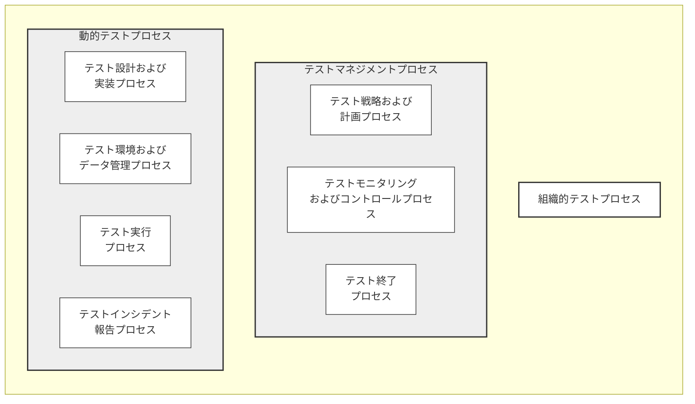

---

## 6 組織的テストプロセス (Organizational test process) {#Chapter_6}
*(ビジュアル参照: [ISO_IEC_IEEE_29119-2_2021(en)_page-0018.jpg](file:///c:/dev/Antigravity/ATRS%20%E5%A4%96%E9%83%A8%E8%A8%AD%E8%A8%88%E6%9B%B8%20Markdown%E5%8C%96/00_Source_Materials/ISO_IEC_IEEE_29119-2_2021(en)/ISO_IEC_IEEE_29119-2_2021(en)/ISO_IEC_IEEE_29119-2_2021(en)_page-0018.jpg))*

### 6.1 一般 {#Section_6.1}
組織的テストプロセスは、組織的テスト仕様の開発および管理に使用されます。これらの仕様は通常、組織全体のテストに適用されます（すなわち、プロジェクトベースではありません）。組織的テスト方針および組織的テストプラクティス文書は、組織的テスト仕様の例です。組織的テストプロセスは汎用的であり、複数の関連プロジェクトに適用されるプログラムテスト戦略など、他の非プロジェクト固有のテスト文書の開発および管理に使用できます。

組織的テスト方針は、組織内におけるテストの目的、目標、および全体的な範囲を記述したエグゼクティブレベルの文書です。また、組織的なテストプラクティスを確立し、組織のテスト方針、テストプラクティス、およびプロジェクトテストマネジメントへのアプローチを確立、レビュー、および継続的に改善するための枠組みを提供します。

組織的テストプラクティス文書は、組織内でテストがどのように実施されるかを定義する詳細な技術文書です。これは、組織内の多くのプロジェクトに対するガイドラインを提供する汎用的な文書であり、特定のプロジェクトに固有のものではありません。

図 3 は、組織のテスト方針とテスト戦略の両方を作成および維持するために組織的テストプロセスが適用された典型的な状況を示しています。図 3 が示すように、組織レベルのプロセスの2つのインスタンスは互いに通信します。組織的テストプラクティス文書は組織的テスト方針と整合している必要があり、この活動からのフィードバックはプロセスの改善の可能性のためにテスト方針に提供されます。同様に、組織内の各プロジェクトで使用されているテストマネジメントプロセスは、組織的テストプラクティス文書（およびテスト方針）と整合している必要があり、これらのプロジェクトのマネジメントからのフィードバックは、組織的テスト仕様を策定および維持する組織的テストプロセスを改善するために使用されます。

#### 図 3 — 組織的テストプロセスの実施例 {#Fig_3}
*(ビジュアル参照: [ISO_IEC_IEEE_29119-2_2021(en)_page-0019.jpg](file:///c:/dev/Antigravity/ATRS%20%E5%A4%96%E9%83%A8%E8%A8%AD%E8%A8%88%E6%9B%B8%20Markdown%E5%8C%96/00_Source_Materials/ISO_IEC_IEEE_29119-2_2021(en)/ISO_IEC_IEEE_29119-2_2021(en)/ISO_IEC_IEEE_29119-2_2021(en)_page-0019.jpg))*

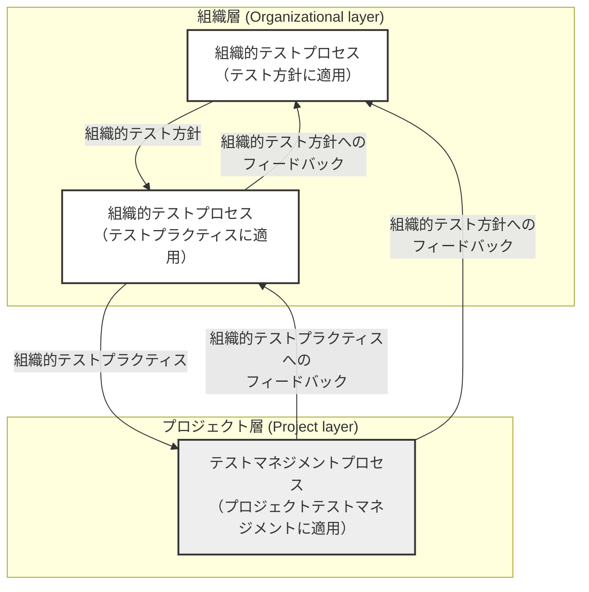

### 6.2 組織的テストプロセス {#Section_6.2}

#### 6.2.1 概要 {#Section_6.2.1}
組織的テストプロセスは、組織的テスト仕様の作成、レビュー、および維持のためのアクティビティで構成されます。また、それらに対する組織の遵守状況のモニタリングも網羅します（図 4 参照）。

このプロセスへの典型的な入力には以下のものが含まれます。
— 主要なステークホルダーの見解
— 組織内の現在のテストプラクティスの知識
— 組織のミッションステートメント
— IT 方針
— IT プロジェクトマネジメント方針
— 品質方針
— 組織的テスト方針
— 組織的テストプラクティス
— テスト方針へのフィードバック
— テストプラクティスへのフィードバック
— 組織の典型的なテスト計画
— 業界および／または政府の標準

#### 図 4 — 組織的テストプロセス {#Fig_4}
*(ビジュアル参照: [ISO_IEC_IEEE_29119-2_2021(en)_page-0020.jpg](file:///c:/dev/Antigravity/ATRS%20%E5%A4%96%E9%83%A8%E8%A8%AD%E8%A8%88%E6%9B%B8%20Markdown%E5%8C%96/00_Source_Materials/ISO_IEC_IEEE_29119-2_2021(en)/ISO_IEC_IEEE_29119-2_2021(en)/ISO_IEC_IEEE_29119-2_2021(en)_page-0020.jpg))*

```mermaid
graph LR
    Start(( )) --> OT1
    
    OT1["組織的テスト<br/>仕様の開発<br/>(OT1)"]
    
    OT2["組織的テスト<br/>仕様の使用の<br/>モニタリング<br/>およびコントロール<br/>(OT2)"]
    
    OT3["組織的テスト<br/>仕様の更新<br/>(OT3)"]
    
    OT1 -- "組織的テスト仕様" --> OT2
    OT2 -- "コントロールされた<br/>組織的テスト仕様" --> OT3
    OT3 -- "更新された<br/>組織的テスト仕様" --> OT2
    
    style Start fill:#000,stroke:#000
    style OT1 fill:#fff,stroke:#333,stroke-width:1px
    style OT2 fill:#fff,stroke:#333,stroke-width:1px
    style OT3 fill:#fff,stroke:#333,stroke-width:1px
```

#### 6.2.2 目的 {#Section_6.2.2}
組織的テストプロセスの目的は、組織的テスト方針や組織的テストプラクティス文書などの組織的テスト仕様を開発し、適合性をモニタリングし、維持することです。

#### 6.2.3 成果 {#Section_6.2.3}
組織的テストプロセスの実施に成功した結果、次のような成果が得られます。
a) 組織的テスト仕様の要求事項が特定される。
b) 組織的テスト仕様が開発される。
c) 組織的テスト仕様がステークホルダーによって合意される。
d) 組織的テスト仕様がアクセス可能になる。
e) 組織的テスト仕様への適合性がモニタリングされる。
f) 組織的テスト仕様の更新がステークホルダーによって合意される。
g) 組織提的テスト仕様の更新が行われる。

#### 6.2.4 アクティビティおよびタスク {#Section_6.2.4}

##### 6.2.4.1 一般 {#Section_6.2.4.1}
組織的テスト仕様の責任者は、組織的テストプロセスに関する適用可能な組織の方針および手順に従って、[6.2.4.2](#Section_6.2.4.2) から [6.2.4.4](#Section_6.2.4.4) に規定されたアクティビティおよびタスクを実施しなければなりません。

##### 6.2.4.2 組織的テスト仕様の開発 (OT1) {#Section_6.2.4.2}
このアクティビティは、以下のタスクで構成されます。
a) 組織的テスト仕様の要求事項は、組織内の現在のテストプラクティス、ステークホルダー、および／またはその他の手段によって開発されなければなりません。
> [!NOTE]
> これは、関連するソース文書の分析、ワークショップ、インタビュー、またはその他の適切な手段を通じて達成できます。
b) 組織的テスト仕様の要求事項を使用して、組織的テスト仕様を作成しなければなりません。
c) 組織的テスト仕様の内容について、ステークホルダーから承認を得なければなりません。
d) 組織的テスト仕様の利用可能性を、組織内のステークホルダーに伝えなければなりません。

##### 6.2.4.3 組織的テスト仕様の使用のモニタリングおよびコントロール (OT2) {#Section_6.2.4.3}
このアクティビティは、以下のタスクで構成されます。
a) 組織的テスト仕様の使用状況をモニタリングし、組織内で効果的に使用されているかどうかを判断しなければなりません。
b) ステークホルダーが組織的テスト仕様に整合するように促すための適切な措置を講じなければなりません。

##### 6.2.4.4 組織的テスト仕様の更新 (OT3) {#Section_6.2.4.4}
このアクティビティは、以下のタスクで構成されます。
a) 組織的テスト仕様の使用に関するフィードバックをレビューすべきである（should）。
b) 組織的テスト仕様の使用および管理の有効性を検討し、その有効性を向上させるためのフィードバックおよび変更を決定し、承認すべきである（should）。
> [!NOTE]
> これは、フィードバックのレビュー、ワークショップ、インタビュー、およびその他の適切な手段を通じて達成できます。
c) 組織的テスト仕様への変更が特定され、承認された場合、これらの変更を実施しなければなりません。
d) 組織的テスト仕様へのすべての変更は、すべてのステークホルダーを含む組織全体に伝えられなければなりません。

#### 6.2.5 情報項目 {#Section_6.2.5}
このプロセスの実施結果として、組織的テスト仕様という情報項目が生成されなければなりません。
例：組織的テスト方針、組織的テストプラクティス文書

---

## 7 テストマネジメントプロセス (Test management processes) {#Chapter_7}
*(ビジュアル参照: [ISO_IEC_IEEE_29119-2_2021(en)_page-0022.jpg](file:///c:/dev/Antigravity/ATRS%20%E5%A4%96%E9%83%A8%E8%A8%AD%E8%A8%88%E6%9B%B8%20Markdown%E5%8C%96/00_Source_Materials/ISO_IEC_IEEE_29119-2_2021(en)/ISO_IEC_IEEE_29119-2_2021(en)/ISO_IEC_IEEE_29119-2_2021(en)_page-0022.jpg))*

### 7.1 一般 {#Section_7.1}
テストマネジメントプロセスは、以下の3つのプロセスで構成されます。

a) テスト戦略および計画
b) テストモニタリングおよびコントロール
c) テスト終了

#### 図 5 — テストマネジメントプロセスの関係例 {#Fig_5}
*(ビジュアル参照: [ISO_IEC_IEEE_29119-2_2021(en)_page-0022.jpg](file:///c:/dev/Antigravity/ATRS%20%E5%A4%96%E9%83%A8%E8%A8%AD%E8%A8%88%E6%9B%B8%20Markdown%E5%8C%96/00_Source_Materials/ISO_IEC_IEEE_29119-2_2021(en)/ISO_IEC_IEEE_29119-2_2021(en)/ISO_IEC_IEEE_29119-2_2021(en)_page-0022.jpg))*

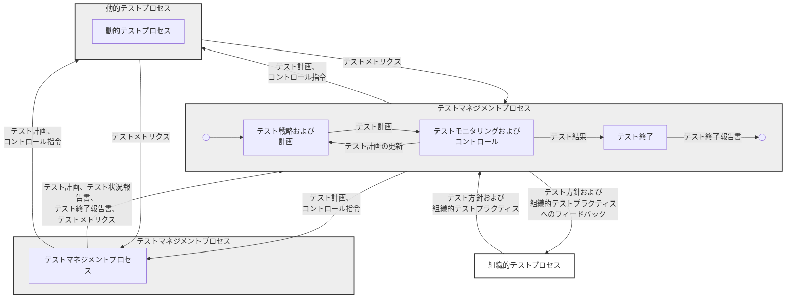

プロジェクトまたはテストレベルにおけるテストは、3つのテストマネジメントプロセスによって管理されます。テスト戦略および計画プロセスは、テスト計画を作成するために使用されます。テスト計画が作成された（そしてプロジェクトの進行に合わせて維持されている）後は、テストモニタリングおよびコントロールプロセスを使用して、テスト計画に対するテストをモニタリングし、テストがコントロールされていることを確実にします。テストモニタリングおよびコントロールプロセスは、実行されているテストの動的テストプロセスも管理します（テスト計画で定義されている通り）。プロジェクトまたはテストレベルのテストが完了したと見なされると、テスト終了プロセスが使用されます。

テストマネジメントプロセスは、プロジェクト全体、または単一のテストレベル若しくはテスト種別を管理するために使用される場合があります。

### 7.2 テスト戦略および計画プロセス {#Section_7.2}

#### 7.2.1 概要 {#Section_7.2.1}
テスト戦略および計画プロセスは、プロジェクトテストマネジメント、およびプロジェクト内の各テストレベル若しくはテスト種別（例：システムテスト、効率性テスト）のテストのマネジメントに使用されます。これは、テスト計画を作成および維持し、ステークホルダーの合意を得るためのアクティビティを記述しています。

プロジェクトのテストがマスターテスト計画といくつかの下位レベルのテスト計画を使用して管理される場合、テスト戦略および計画プロセスは、まずマスターテスト計画を作成するために一度使用され、その後、各下位レベルのテスト計画のために再び使用されます。

テスト戦略および計画プロセスは 図 6 に記述されています。

#### 図 6 — テスト戦略および計画プロセス {#Fig_6}
*(ビジュアル参照: [ISO_IEC_IEEE_29119-2_2021(en)_page-0024.jpg](file:///c:/dev/Antigravity/ATRS%20%E5%A4%96%E9%83%A8%E8%A8%AD%E8%A8%88%E6%9B%B8%20Markdown%E5%8C%96/00_Source_Materials/ISO_IEC_IEEE_29119-2_2021(en)/ISO_IEC_IEEE_29119-2_2021(en)/ISO_IEC_IEEE_29119-2_2021(en)_page-0024.jpg))*

```mermaid
graph TD
    Start(( )) --> TP1
    
    TP1["コンテキストの理解<br/>(TP1)"]
    TP2["テスト計画開発の編制<br/>(TP2)"]
    TP3["リスクの特定および分析<br/>(TP3)"]
    TP4["リスク対応アプローチの特定<br/>(TP4)"]
    TP5["テスト戦略の設計<br/>(TP5)"]
    TP6["人員配置およびスケジュールの決定<br/>(TP6)"]
    TP7["テスト計画の記録<br/>(TP7)"]
    TP8["テスト計画の合意形成<br/>(TP8)"]
    TP9["テスト計画の伝達および公開<br/>(TP9)"]
    
    TP1 -- "適用範囲" --> TP2
    TP2 -- "テスト計画開発スケジュール" --> TP3
    TP3 -- "分析されたリスク" --> TP4
    TP4 -- "対応アプローチ" --> TP5
    TP5 -- "テスト戦略" --> TP6
    TP6 -- "スケジュール、人員プロファイル" --> TP7
    TP7 -- "テスト計画案" --> TP8
    TP8 -- "承認されたテスト計画" --> TP9
    TP9 -- "テスト計画" --> End(( ))
    
    TP5 -- "テスト戦略" --> TP3
    
    style Start fill:#000
    style End fill:#000,stroke-width:2px,stroke:#333
```

#### 7.2.2 目的 {#Section_7.2.2}
テスト戦略および計画プロセスの目的は、テストのコンテキストとリスクを理解し、テスト対象となるアイテムと機能を特定し、テスト戦略を定義し、テストのためのテスト計画を策定することです。

#### 7.2.3 成果 {#Section_7.2.3}
テスト戦略および計画プロセスの実施に成功した結果、次のような成果が得られます。
a) テストのコンテキストが理解される。
b) テストによって対応すべきリスクが特定され、優先順位付けされ、分析される。
c) テストがその一部となるリスク対応策が特定される。
d) テスト戦略が特定される。
e) 人員配置およびスケジュールが決定される。
f) テスト計画がステークホルダーによって合意される。
g) テスト計画がアクセス可能となる。

#### 7.2.4 アクティビティおよびタスク {#Section_7.2.4}

##### 7.2.4.1 一般 {#Section_7.2.4.1}
テストマネージャーは、テスト戦略および計画プロセスに関する適用可能な組織の方針および手順に従って、[7.2.4.2](#Section_7.2.4.2) から [7.2.4.7](#Section_7.2.4.7) に規定されたアクティビティおよびタスクを実施しなければなりません。

##### 7.2.4.2 コンテキストを理解する (TP1) {#Section_7.2.4.2}
このアクティビティは、以下のタスクで構成されます。
a) テストの適用範囲を特定しなければなりません。
b) テストに関心を持つ人々（ステークホルダー）を特定しなければなりません。
c) テストすべきアイテムに関する情報を特定しなければなりません。
d) 環境の制約および要件を特定しなければなりません。
e) 特殊なテストリソース（ツールおよび人員を含む）の利用可能性を特定すべきである（should）。
f) 適用可能な組織的テスト仕様（例：組織的テスト方針および組織的テストプラクティス）を特定しなければなりません。

##### 7.2.4.3 リスクを特定し分析する (TP2) {#Section_7.2.4.3}
このアクティビティは、以下のタスクで構成されます。
a) このタスクは反復的です。プロダクトリスクおよびプロジェクトリスクを特定しなければなりません。
b) プロダクトリスクおよびプロジェクトリスクを分析し、そのリスクレベルを決定しなければなりません。
c) 特定されたリスクを優先順位付けし、記録しなければなりません。
> [!NOTE]
> これは、ワークショップ、インタビュー、チェックリストの使用、および適切なリスクアセスメント手法を通じて達成できます。

##### 7.2.4.4 リスク対応策を特定する (TP3) {#Section_7.2.4.4}
このアクティビティは、以下のタスクで構成されます。
a) 記録されたリスクに対するリスク対応策を特定しなければなりません。
b) 特定されたリスク対応策を記録しなければなりません。
> [!NOTE]
> テストによるリスク対応策には、以下のものが含まれます。
> — 特定のテストの実行（例：システムが遅すぎる可能性があるリスクに対応するための効率性テストの実行）
> — テストの範囲の変更（例：リスクの高いアイテムに対するテストの増強）
> — より早期のテストの実行（例：重要な欠陥を早期に発見および修正するため）

##### 7.2.4.5 テスト戦略を特定する (TP4) {#Section_7.2.4.5}
このアクティビティは、以下のタスクで構成されます。
a) このタスクは反復的です。特定されたリスク対応策を達成するために実行されるテストを決定しなければなりません。
b) テストレベル（例：ユニット、統合、システム、および受入れ）およびテスト種別（例：効率性テスト、セキュリティテスト、および機能テスト）を特定しなければなりません。
c) 各テストレベルおよびテスト種別について、以下の事項を定義すべきである（should）。
   i) テストアイテム
   ii) テスト機能
   iii) テスト終了基準
   iv) 使用するテスト設計技法
   v) テスト環境要件
   vi) テストデータ要件
   vii) 再テストおよび回帰テストの要件
   viii) テスト成果物
 d) 結果として得られるテスト戦略を記録しなければなりません。

##### 7.2.4.6 人員配置およびスケジュールを決定する (TP5) {#Section_7.2.4.6}
このアクティビティは、以下のタスクで構成されます。
a) テストのための人員配置、およびテストに関心を持つ人々（ステークホルダー）を決定すべきである（should）。
b) テストのスケジュールを決定すべきである（should）。
c) テストのスケジュールを記録しなければなりません。

##### 7.2.4.7 テスト計画を記録する (TP6) {#Section_7.2.4.7}
このアクティビティは、以下のタスクで構成されます。
a) このタスクは反復的です。すべてのテスト戦略および計画プロセスの結果（TP1-TP5）を使用して、テスト計画を作成しなければなりません。
b) 必要に応じて、ステークホルダーからテスト計画の承認を得なければなりません。
c) テスト計画をステークホルダーがアクセスできるようにしなければなりません。

#### 7.2.5 情報項目 {#Section_7.2.5}
このプロセスの実施結果として、テスト計画という情報項目が生成されなければなりません。
> [!NOTE]
> 適切な場合、テスト計画にはテスト戦略を含めることができます。

### 7.3 テストモニタリングおよびコントロールプロセス {#Section_7.3}

#### 7.3.1 概要 {#Section_7.3.1}
テストモニタリングおよびコントロールプロセスは、プロジェクトテストマネジメント、およびプロジェクト内の各テストレベル若しくはテスト種別（例：システムテスト、効率性テスト）のマネジメントに使用されます。これは、テスト計画および組織的テスト仕様に対するテストをモニタリングするためのアクティビティを記述しています。また、必要に応じて適切なコントロール・アクションを決定し、実行するためのアクティビティも含まれています。

テストモニタリングおよびコントロールプロセスは 図 7 に記述されています。

#### 図 7 — テストモニタリングおよびコントロールプロセス {#Fig_7}
*(ビジュアル参照: [ISO_IEC_IEEE_29119-2_2021(en)_page-0030.jpg](file:///c:/dev/Antigravity/ATRS%20%E5%A4%96%E9%83%A8%E8%A8%AD%E8%A8%88%E6%9B%B8%20Markdown%E5%8C%96/00_Source_Materials/ISO_IEC_IEEE_29119-2_2021(en)/ISO_IEC_IEEE_29119-2_2021(en)/ISO_IEC_IEEE_29119-2_2021(en)_page-0030.jpg))*

```mermaid
graph TD
    Start(( )) -- "テスト計画" --> TMC1
    
    TMC1["セットアップ<br/>(TMC1)"]
    TMC2["モニタリング<br/>(TMC2)"]
    TMC4["報告<br/>(TMC4)"]
    TMC3["コントロール<br/>(TMC3)"]
    
    TMC1 -- "テストメトリクス" --> TMC2
    TMC2 -- "テスト進捗情報" --> TMC4
    TMC4 -- "テスト状況報告書" --> Out(( ))
    TMC4 -- "テストコントロール情報" --> TMC3
    TMC3 -- "コントロール指令" --> End(( ))
    TMC3 -- "テスト進捗情報" --> TMC2
    
    subgraph "プロセスの相互作用"
        DTP["動的テストプロセス"]
        TMP["テストマネジメントプロセス"]
        TP["...テストプロセス..."]
    end
    
    DTP -- "<<具現化>>" --> TP
    TMP -- "<<具現化>>" --> TP
    
    TP -- "テストメトリクス" --> TMC2
    TMC2 -- "テスト進捗情報" --> TP
    TP -- "テストコントロール情報" --> TMC3
    TMC3 -- "コントロール指令" --> TP
    
    style Start fill:#000
    style End fill:#000,stroke-width:2px,stroke:#333
```

#### 7.3.2 目的 {#Section_7.3.2}
テストモニタリングおよびコントロールプロセスの目的は、テスト計画および組織的テスト仕様に従ってテストが実施されることを確実にすることです。

#### 7.3.3 成果 {#Section_7.3.3}
テストモニタリングおよびコントロールプロセスの実施に成功した結果、次のような成果が得られます。
a) テストモニタリングをサポートするためのメトリクスを収集および記録する手段が設定される。
b) テスト計画に対する進捗がモニタリングされる。
c) 新規および変更されたリスクが特定および分析され、適切なリスク対応策が決定される。
d) テスト計画からの逸脱を修正したり、特定されたリスクに対応したりするために必要なコントロール・アクションが決定され、実施される。
e) ステークホルダーにテストの状況が報告される。

#### 7.3.4 アクティビティおよびタスク {#Section_7.3.4}

##### 7.3.4.1 一般 {#Section_7.3.4.1}
テストマネージャーは、テストモニタリングおよびコントロールプロセスに関する適用可能な組織の方針および手順に従って、[7.3.4.2](#Section_7.3.4.2) から [7.3.4.5](#Section_7.3.4.5) に規定されたアクティビティおよびタスクを実施しなければなりません。

##### 7.3.4.2 セットアップ (TMC1) {#Section_7.3.4.2}
このアクティビティは、以下のタスクで構成されます。
a) 必要なメトリクスを収集および記録する手段を設定しなければなりません。
b) テストの進捗および状況を報告する手段を設定しなければなりません。
c) 進捗をモニタリングし、テスト計画からの逸脱を特定するために使用できる測定項目を決定しなければなりません。
d) これらの測定項目を、テスト計画で定義されたテスト終了基準に照らしてモニタリングしなければなりません。
e) テストモニタリングおよびコントロールプロセスの結果に対するステークホルダーを特定しなければなりません。

##### 7.3.4.3 モニタリング (TMC2) {#Section_7.3.4.3}
このアクティビティは、以下のタスクで構成されます。
a) テスト計画に対する進捗をモニタリングしなければなりません。
b) テスト計画からの逸脱を特定し、記録しなければなりません。
c) 新規および変更されたリスクを特定し、分析しなければなりません。

##### 7.3.4.4 コントロール (TMC3) {#Section_7.3.4.4}
このアクティビティは、以下のタスクで構成されます。
a) テスト計画に対する進捗が期待通りでない場合、または新規若しくは変更されたリスクが特定された場合には、適切なコントロール・アクションを決定しなければなりません。
b) 決定されたコントロール・アクションを実施しなければなりません。
c) b）で特定されたコントロール・アクションによってテスト計画に変更が生じる場合は、テスト戦略および計画プロセスを使用してテスト計画を更新しなければなりません。
> [!NOTE]
> コントロール・アクションの例には、以下のものが含まれます。
> — テストスケジュールの変更
> — テストリソースの増減
> — テスト戦略の修正（例：よりリスクの高いアイテムに対するテストの増強）

##### 7.3.4.5 報告 (TMC4) {#Section_7.3.4.5}
このアクティビティは、以下のタスクで構成されます。
a) テスト計画に対するテストの状況をステークホルダーに報告しなければなりません。
b) 新規および変更されたリスク、およびそれらに対応するためのアクションをステークホルダーに報告しなければなりません。
c) コントロール・アクションの状況および結果をステークホルダーに報告しなければなりません。

#### 7.3.5 情報項目 {#Section_7.3.5}
このプロセスの実施結果として、テスト状況報告書という情報項目が生成されなければなりません。

### 7.4 テスト終了プロセス {#Section_7.4}

#### 7.4.1 概要 {#Section_7.4.1}
テスト終了プロセスは、テストプロジェクト、テストレベル、またはテスト種別を終了するためのアクティビティを記述しています。これは、プロジェクト、テストレベル、またはテスト種別に対して計画されたすべてのテストが終了したときに実施されます。

テスト終了プロセスは 図 8 に記述されています。

#### 図 8 — テスト終了プロセス {#Fig_8}
*(ビジュアル参照: [ISO_IEC_IEEE_29119-2_2021(en)_page-0033.jpg](file:///c:/dev/Antigravity/ATRS%20%E5%A4%96%E9%83%A8%E8%A8%AD%E8%A8%88%E6%9B%B8%20Markdown%E5%8C%96/00_Source_Materials/ISO_IEC_IEEE_29119-2_2021(en)/ISO_IEC_IEEE_29119-2_2021(en)/ISO_IEC_IEEE_29119-2_2021(en)_page-0033.jpg))*

```mermaid
graph LR
    Start(( )) --> TC1
    
    TC1["テスト資産の<br/>アーカイブ<br/>(TC1)"]
    TC2["テスト環境の<br/>クリーンアップ<br/>(TC2)"]
    TC3["教訓の<br/>特定<br/>(TC3)"]
    TC4["テスト終了の<br/>報告<br/>(TC4)"]
    
    TC1 -- "アーカイブされたテスト資産" --> TC2
    TC2 -- "利用可能なテスト環境" --> TC3
    TC3 -- "教訓" --> TC4
    TC4 -- "テスト終了報告書" --> End(( ))
    
    style Start fill:#000
    style End fill:#000,stroke-width:2px,stroke:#333
```

#### 7.4.2 目的 {#Section_7.4.2}
テスト終了プロセスの目的は、有用なテスト資産が後で使用するためにアーカイブされ、テスト環境が満足のいく状態に保たれ、テスト結果が記録されステークホルダーに伝えられることを確実にすることです。

#### 7.4.3 成果 {#Section_7.4.3}
テスト終了プロセスの実施に成功した結果、次のような成果が得られます。
a) 有用なテスト資産が後で使用するためにアーカイブされる。
b) テスト環境が満足のいく状態に保たれる。
c) 教訓（Lessons learned）が決定され、テストプロセスの改善点が特定される。
d) テスト結果が記録され、伝達される。
e) ステークホルダーがテスト終了に同意する。

#### 7.4.4 アクティビティおよびタスク {#Section_7.4.4}

##### 7.4.4.1 一般 {#Section_7.4.4.1}
テストマネージャーは、テスト終了プロセスに関する適用可能な組織の方針および手順に従って、[7.4.4.2](#Section_7.4.4.2) から [7.4.4.5](#Section_7.4.4.5) に規定されたアクティビティおよびタスクを実施しなければなりません。

##### 7.4.4.2 テスト資産をアーカイブする (TC1) {#Section_7.4.4.2}
このアクティビティは、以下のタスクで構成されます。
a) 有用なテスト資産を特定し、後で使用するためにアーカイブしなければなりません。
> [!NOTE]
> アーカイブできるテスト資産の例には、以下のものが含まれます。
> — テスト計画
> — テストケース
> — テスト手順
> — テストスクリプト
> — テスト結果
> — インシデントレポート

##### 7.4.4.3 テスト環境をクリーンアップする (TC2) {#Section_7.4.4.3}
このアクティビティは、以下のタスクで構成されます。
a) テスト環境を、組織の手順によってローカルに定義された満足のいく状態に保たなければなりません。
> [!NOTE]
> これには以下のものが含まれます。
> — テストデータのクリーンアップ
> — 特殊なテスト機器の返却
> — 仮想テスト環境のリセット

##### 7.4.4.4 教訓を特定する (TC3) {#Section_7.4.4.4}
このアクティビティは、以下のタスクで構成されます。
a) テストからの教訓を決定し、記録すべきである（should）。
b) 教訓に基づいてテストプロセスの改善点を特定し、テストプロセスの責任者にフィードバックを提供すべきである（should）。
> [!NOTE]
> これは、ワークショップ、インタビュー、チェックリストの使用、および適切なアセスメント手法を通じて達成できます。

##### 7.4.4.5 テスト終了を記録する (TC4) {#Section_7.4.4.5}
このアクティビティは、以下のタスクで構成されます。
a) すべてのテスト結果をテスト終了報告書に記録すべきである（should）。
b) ステークホルダーからテスト終了報告書の承認を得なければなりません。
c) テスト終了報告書をステークホルダーがアクセスできるようにしなければなりません。

#### 7.4.5 情報項目 {#Section_7.4.5}
このプロセスの実施結果として、テスト終了報告書（テストサマリーレポートとも呼ばれる）という情報項目が生成されなければなりません。

---

## 8 動的テストプロセス (Dynamic test processes) {#Chapter_8}

### 8.1 一般 {#Section_8.1}
*(ビジュアル参照: [ISO_IEC_IEEE_29119-2_2021(en)_page-0035.jpg](file:///c:/dev/Antigravity/ATRS%20%E5%A4%96%E9%83%A8%E8%A8%AD%E8%A8%88%E6%9B%B8%20Markdown%E5%8C%96/00_Source_Materials/ISO_IEC_IEEE_29119-2_2021(en)/ISO_IEC_IEEE_29119-2_2021(en)/ISO_IEC_IEEE_29119-2_2021(en)_page-0035.jpg))*

動的テストプロセスは、特定のテストレベル（例：ユニット、統合、システム、および受入れ）またはテスト種別（例：効率性テスト、セキュリティテスト、ユーザビリティテスト）の範囲内で動的テストを実行するために使用されます。この動的テストのマネジメントのためのプロセスは、[箇条 7](#Chapter_7) で記述されています。

動的テストプロセスには、以下の4つのプロセスがあります（図 9 に示す通り）。

a) テスト設計および実装
b) テスト環境およびデータ管理
c) テスト実行
d) テストインシデント報告

これらの4つの動的テストプロセスを図 9 に示します。

#### 図 9 — 動的テストプロセス {#Fig_9}
*(ビジュアル参照: [ISO_IEC_IEEE_29119-2_2021(en)_page-0036.jpg](file:///c:/dev/Antigravity/ATRS%20%E5%A4%96%E9%83%A8%E8%A8%AD%E8%A8%88%E6%9B%B8%20Markdown%E5%8C%96/00_Source_Materials/ISO_IEC_IEEE_29119-2_2021(en)/ISO_IEC_IEEE_29119-2_2021(en)/ISO_IEC_IEEE_29119-2_2021(en)_page-0036.jpg))*

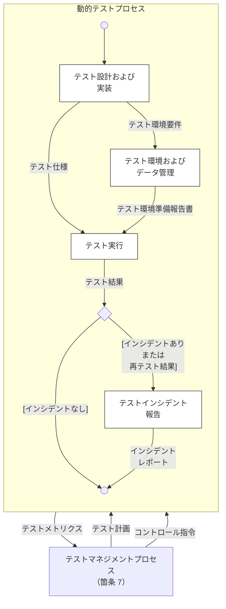

### 8.2 テスト設計および実装プロセス {#Section_8.2}

#### 8.2.1 概要 {#Section_8.2.1}
テスト設計および実装プロセスは、テストケースおよびテスト手順を導出し、作成するために使用されます。

本文書の 2021 年版では、テスト設計における「テスト条件（Test Conditions）」から**「テストモデル（Test Models）」**へのパラダイムシフトが導入されています。テストモデルとは、特定の特性や品質に焦点を当てたテストを可能にするためのテストアイテムの表現です。

テスト設計および実装プロセスは 図 10 に記述されています。

#### 図 10 — テスト設計および実装プロセス {#Fig_10}
*(ビジュアル参照: [ISO_IEC_IEEE_29119-2_2021(en)_page-0038.jpg](file:///c:/dev/Antigravity/ATRS%20%E5%A4%96%E9%83%A8%E8%A8%AD%E8%A8%88%E6%9B%B8%20Markdown%E5%8C%96/00_Source_Materials/ISO_IEC_IEEE_29119-2_2021(en)/ISO_IEC_IEEE_29119-2_2021(en)/ISO_IEC_IEEE_29119-2_2021(en)_page-0038.jpg))*

```mermaid
graph TD
    Start(( )) --> TD1
    
    TD1["テストモデルの<br/>作成<br/>(TD1)"]
    TD2["テスト網羅項目の<br/>特定<br/>(TD2)"]
    TD3["テストケースの<br/>導出<br/>(TD3)"]
    TD4["テスト手順の<br/>作成<br/>(TD4)"]
    
    TD1 -- "テストモデル" --> TD2
    TD2 -- "テスト網羅項目" --> TD3
    TD3 -- "テストケース" --> TD4
    TD4 -- "テスト手順" --> End(( ))
    
    style Start fill:#000
    style End fill:#000,stroke-width:2px,stroke:#333
```

#### 8.2.2 目的 {#Section_8.2.2}
テスト設計および実装プロセスの目的は、テストモデル、テスト網羅項目、テストケース、およびテスト手順を特定することです。

#### 8.2.3 成果 {#Section_8.2.3}
テスト設計および実装プロセスの実施に成功した結果、次のような成果が得られます。
a) テストモデルが特定され、文書化される。
b) テスト網羅項目が特定され、文書化される。
c) テストケースが導出され、文書化される。
d) テスト手順が構成され、文書化される。

#### 8.2.4 アクティビティおよびタスク {#Section_8.2.4}
*(ビジュアル参照: [ISO_IEC_IEEE_29119-2_2021(en)_page-0038.jpg](file:///c:/dev/Antigravity/ATRS%20%E5%A4%96%E9%83%A8%E8%A8%AD%E8%A8%88%E6%9B%B8%20Markdown%E5%8C%96/00_Source_Materials/ISO_IEC_IEEE_29119-2_2021(en)/ISO_IEC_IEEE_29119-2_2021(en)/ISO_IEC_IEEE_29119-2_2021(en)_page-0038.jpg))*

##### 8.2.4.1 一般 {#Section_8.2.4.1}
テストの責任者（例：テスター）は、テスト設計および実装プロセスに関する適用可能な組織の方針および手順に従って、[8.2.4.2](#Section_8.2.4.2) から [8.2.4.5](#Section_8.2.4.5) に規定されたアクティビティおよびタスクを実施しなければなりません。

##### 8.2.4.2 テストモデルを特定する (TD1) {#Section_8.2.4.2}
このアクティビティは、以下のタスクで構成されます。
a) テストベースを分析しなければなりません。
b) テストアイテムとその要件を表すための1つ以上のテストモデルを特定すべきである（should）。
c) 特定されたテストモデルをテストモデル仕様に文書化しなければなりません。

##### 8.2.4.3 テスト網羅項目を特定する (TD2) {#Section_8.2.4.3}
このアクティビティは、以下のタスクで構成されます。
a) テストモデルおよびテスト終了基準からテスト網羅項目を特定しなければなりません。
b) 特定されたテスト網羅項目を文書化しなければなりません。

##### 8.2.4.4 テストケースを導出する (TD3) {#Section_8.2.4.4}
このアクティビティは、以下のタスクで構成されます。
a) 特定されたテスト網羅項目を網羅するためのテストケースを導出しなければなりません。
b) テストケースをテストケース仕様に文書化しなければなりません。

##### 8.2.4.5 テスト手順を構成する (TD4) {#Section_8.2.4.5}
このアクティビティは、以下のタスクで構成されます。
a) 導出されたテストケースを1つ以上のテスト手順に構成しなければなりません。
b) テスト手順をテスト手順仕様に文書化しなければなりません。

#### 8.2.5 情報項目 {#Section_8.2.5}
このプロセスの実施結果として、以下の情報項目が生成されなければなりません。
— テストモデル仕様
— テストケース仕様
— テスト手順仕様

### 8.3 テスト環境およびデータ管理プロセス {#Section_8.3}

#### 8.3.1 概要 {#Section_8.3.1}
テスト環境およびデータ管理プロセスは、テストの実行に必要なテスト環境およびテストデータを確立し、維持するために使用されます。

テスト環境およびデータ管理プロセスは 図 11 に記述されています。

#### 図 11 — テスト環境およびデータ管理プロセス {#Fig_11}
*(ビジュアル参照: [ISO_IEC_IEEE_29119-2_2021(en)_page-0041.jpg](file:///c:/dev/Antigravity/ATRS%20%E5%A4%96%E9%83%A8%E8%A8%AD%E8%A8%88%E6%9B%B8%20Markdown%E5%8C%96/00_Source_Materials/ISO_IEC_IEEE_29119-2_2021(en)/ISO_IEC_IEEE_29119-2_2021(en)/ISO_IEC_IEEE_29119-2_2021(en)_page-0041.jpg))*

```mermaid
graph TD
    Start(( )) -- "テスト計画、<br/>テスト手順" --> ED1
    
    ED1["テスト環境の<br/>確立<br/>(ED1)"]
    ED2["テストデータの<br/>確立<br/>(ED2)"]
    ED3["テスト環境および<br/>データの維持<br/>(ED3)"]
    
    ED1 -- "テスト環境" --> ED2
    ED2 -- "テストデータ" --> ED3
    ED3 -- "準備されたテスト環境およびデータ" --> End(( ))
    
    style Start fill:#000
    style End fill:#000,stroke-width:2px,stroke:#333
```

#### 8.3.2 目的 {#Section_8.3.2}
テスト環境およびデータ管理プロセスの目的は、テスト実行をサポートするために必要なテスト環境およびテストデータを確立し、維持することです。

#### 8.3.3 成果 {#Section_8.3.3}
テスト環境およびデータ管理プロセスの実施に成功した結果、次のような成果が得られます。
a) 必要なテスト環境およびテストデータが特定される。
b) テスト環境が確立される。
c) テストデータが確立される。
d) テスト環境およびデータが、要求される通りに維持される。

#### 8.3.4 アクティビティおよびタスク {#Section_8.3.4}

##### 8.3.4.1 一般 {#Section_8.3.4.1}
テスト環境およびデータ管理の責任者は、適用可能な組織の方針および手順に従って、[8.3.4.2](#Section_8.3.4.2) から [8.3.4.4](#Section_8.3.4.4) に規定されたアクティビティおよびタスクを実施しなければなりません。

##### 8.3.4.2 テスト環境を確立する (ED1) {#Section_8.3.4.2}
このアクティビティは、以下のタスクで構成されます。
a) テスト計画およびテスト手順から、必要なテスト環境の特性を特定しなければなりません。
b) 特定された特性を持つテスト環境を確立しなければなりません。
c) テスト環境が利用可能であることをステークホルダーに伝えなければなりません。

##### 8.3.4.3 テストデータを確立する (ED2) {#Section_8.3.4.3}
このアクティビティは、以下のタスクで構成されます。
a) テスト計画およびテスト手順から、必要なテストデータの特性を特定しなければなりません。
b) 特定された特性を持つテストデータを確立しなければなりません。
c) テストデータが利用可能であることをステークホルダーに伝えなければなりません。

##### 8.3.4.4 テスト環境およびデータを維持する (ED3) {#Section_8.3.4.4}
このアクティビティは、以下のタスクで構成されます。
a) テスト実行中に、テスト環境およびテストデータを要求される通りに維持しなければなりません。
b) テスト環境およびテストデータへの変更は、ステークホルダーに伝えられなければなりません。

#### 8.3.5 情報項目 {#Section_8.3.5}
このプロセスの実施結果として、テスト環境準備報告書という情報項目が生成されなければなりません。

### 8.4 テスト実行プロセス {#Section_8.4}

#### 8.4.1 概要 {#Section_8.4.1}
テスト実行プロセスは、動的テストを実行するために使用されます。

テスト実行プロセスは 図 12 に記述されています。

#### 図 12 — テスト実行プロセス {#Fig_12}
*(ビジュアル参照: [ISO_IEC_IEEE_29119-2_2021(en)_page-0044.jpg](file:///c:/dev/Antigravity/ATRS%20%E5%A4%96%E9%83%A8%E8%A8%AD%E8%A8%88%E6%9B%B8%20Markdown%E5%8C%96/00_Source_Materials/ISO_IEC_IEEE_29119-2_2021(en)/ISO_IEC_IEEE_29119-2_2021(en)/ISO_IEC_IEEE_29119-2_2021(en)_page-0044.jpg))*

```mermaid
graph TD
    Start(( )) -- "テスト手順" --> EX1
    
    EX1["テスト手順の<br/>実行<br/>(EX1)"]
    EX2["実績結果と<br/>期待結果の比較<br/>(EX2)"]
    EX3["テスト実行の<br/>記録<br/>(EX3)"]
    
    EX1 -- "実績結果" --> EX2
    EX2 -- "比較結果" --> EX3
    EX3 -- "テストログ" --> End(( ))
    
    style Start fill:#000
    style End fill:#000,stroke-width:2px,stroke:#333
```

#### 8.4.2 目的 {#Section_8.4.2}
テスト実行プロセスの目的は、確立されたテスト環境およびデータを使用してテスト手順を実行し、実績結果を期待結果と比較し、結果を記録することです。

#### 8.4.3 成果 {#Section_8.4.3}
テスト実行プロセスの実施に成功した結果、次のような成果が得られます。
a) 1つ以上のテスト手順が実行される。
b) 実績結果が期待結果と比較される。
c) テストの実行および結果が文書化される。

#### 8.4.4 アクティビティおよびタスク {#Section_8.4.4}

##### 8.4.4.1 一般 {#Section_8.4.4.1}
テスターは、テスト実行プロセスに関する適用可能な組織の方針および手順に従って、[8.4.4.2](#Section_8.4.4.2) から [8.4.4.4](#Section_8.4.4.4) に規定されたアクティビティおよびタスクを実施しなければなりません。

##### 8.4.4.2 テスト手順を実行する (EX1) {#Section_8.4.4.2}
このアクティビティは、以下のタスクで構成されます。
a) 定義されたテスト環境およびテストデータを使用して、テスト手順を実行しなければなりません。

##### 8.4.4.3 実績結果と期待結果を比較する (EX2) {#Section_8.4.4.3}
このアクティビティは、以下のタスクで構成されます。
a) 実績結果を期待結果と比較し、不一致があるかどうかを判断しなければなりません。

##### 8.4.4.4 テスト実行を記録する (EX3) {#Section_8.4.4.4}
このアクティビティは、以下のタスクで構成されます。
a) テストの実行に関連する詳細をテストログに記録しなければなりません。
b) 実績結果と期待結果の比較、および不一致の有無を記録しなければなりません。
c) 各テストケースについて、テスト結果をパスまたは故障として記録しなければなりません。
d) 各テスト手順について、実行が成功したかどうかを記録しなければなりません。

#### 8.4.5 情報項目 {#Section_8.4.5}
このプロセスの実施結果として、テストログという情報項目が生成されなければなりません。

### 8.5 テストインシデント報告プロセス {#Section_8.5}

#### 8.5.1 概要 {#Section_8.5.1}
テストインシデント報告プロセスは、さらなる調査が必要な状況（例：故障の発生）を認識し、記録し、ステークホルダーに伝えるために使用されます。

テストインシデント報告プロセスは 図 13 に記述されています。

#### 図 13 — テストインシデント報告プロセス {#Fig_13}
*(ビジュアル参照: [ISO_IEC_IEEE_29119-2_2021(en)_page-0048.jpg](file:///c:/dev/Antigravity/ATRS%20%E5%A4%96%E9%83%A8%E8%A8%AD%E8%A8%88%E6%9B%B8%20Markdown%E5%8C%96/00_Source_Materials/ISO_IEC_IEEE_29119-2_2021(en)/ISO_IEC_IEEE_29119-2_2021(en)/ISO_IEC_IEEE_29119-2_2021(en)_page-0048.jpg))*

```mermaid
graph TD
    Start(( )) -- "テストログ" --> IR1
    
    IR1["インシデントの<br/>特定および詳細の記録<br/>(IR1)"]
    IR2["インシデントの<br/>報告<br/>(IR2)"]
    
    IR1 -- "インシデントの詳細" --> IR2
    IR2 -- "インシデントレポート" --> End(( ))
    
    style Start fill:#000
    style End fill:#000,stroke-width:2px,stroke:#333
```

#### 8.5.2 目的 {#Section_8.5.2}
テストインシデント報告プロセスの目的は、テスト中に発生したインシデントを調査が必要な事項として特定、記録、および報告することです。

#### 8.5.3 成果 {#Section_8.5.3}
テストインシデント報告プロセスの実施に成功した結果、次のような成果が得られます。
a) インシデントが特定される。
b) インシデントの詳細が記録される。
c) インシデントが特定のステークホルダーに報告される。

#### 8.5.4 アクティビティおよびタスク {#Section_8.5.4}

##### 8.5.4.1 一般 {#Section_8.5.4.1}
テスターは、テストインシデント報告プロセスに関する適用可能な組織の方針および手順に従って、[8.5.4.2](#Section_8.5.4.2) から [8.5.4.3](#Section_8.5.4.3) に規定されたアクティビティおよびタスクを実施しなければなりません。

##### 8.5.4.2 インシデントを特定し、詳細を記録する (IR1) {#Section_8.5.4.2}
このアクティビティは、以下のタスクで構成されます。
a) 調査を必要とする不一致（例：故障）を特定しなければなりません。
b) インシデントの再現を試みる。
c) インシデントの詳細を、インシデントレポートに含めるために記録しなければなりません。これには、期待結果、実績結果、インシデント発生時の状況、および影響を受ける可能性のあるステークホルダーが含まれます。

##### 8.5.4.3 インシデントを報告する (IR2) {#Section_8.5.4.3}
このアクティビティは、以下のタスクで構成されます。
a) インシデントが発生したことを適切なステークホルダーに伝えなければなりません。
b) 承認されたインシデントレポートを、アクションまたはさらなる調査のために適切な組織およびプロセスに引き渡さなければなりません。

#### 8.5.5 情報項目 {#Section_8.5.5}
このプロセスの実施結果として、インシデントレポートという情報項目が生成されなければなりません。

---

# 附属書 A（参考）テスト設計および実装プロセスの適用例 {#Annex_A}
*(ビジュアル参照: [ISO_IEC_IEEE_29119-2_2021(en)_page-0049.jpg](file:///c:/dev/Antigravity/ATRS%20%E5%A4%96%E9%83%A8%E8%A8%AD%E8%A8%88%E6%9B%B8%20Markdown%E5%8C%96/00_Source_Materials/ISO_IEC_IEEE_29119-2_2021(en)/ISO_IEC_IEEE_29119-2_2021(en)/ISO_IEC_IEEE_29119-2_2021(en)_page-0049.jpg))*

## A.1 一般 {#Section_A.1}
この附属書は、テスト設計および実装プロセスのアクティビティ TD1 から TD4 の適用例を提供します。

## A.2 テストベースの断片 {#Section_A.2}
「保険見積システムは、受領メッセージ、拒絶メッセージ、または免責警告付き受領メッセージを生成しなければならない。
システムは、申請日の年齢が18歳から80歳までの保険申請者を受け入れる（年齢は満年齢で入力）。その他の入力はすべて拒絶される。
70歳以上の受け入れられた申請者は受け入れられるが、請求が発生した場合には免責金額を支払う必要があるという警告が表示される。」

## A.3 テスト終了基準 {#Section_A.3}
「テスト終了基準は、同値分割網羅が 100 % 達成され、すべてのテストケースの実行結果が『パス』状態になることである。」

## A.4 テストモデル (TD1) {#Section_A.4}
テスト終了基準に基づき、記述されたシステムの振る舞いに対する同値分割（黒い枠線で示される）を示す [図 A.1](#Fig_A_1) のテストモデルを作成できます。

#### 図 A.1 — 「保険見積システム」の同値分割 {#Fig_A_1}
*(ビジュアル参照: [ISO_IEC_IEEE_29119-2_2021(en)_page-0049.jpg](file:///c:/dev/Antigravity/ATRS%20%E5%A4%96%E9%83%A8%E8%A8%AD%E8%A8%88%E6%9B%B8%20Markdown%E5%8C%96/00_Source_Materials/ISO_IEC_IEEE_29119-2_2021(en)/ISO_IEC_IEEE_29119-2_2021(en)/ISO_IEC_IEEE_29119-2_2021(en)_page-0049.jpg))*

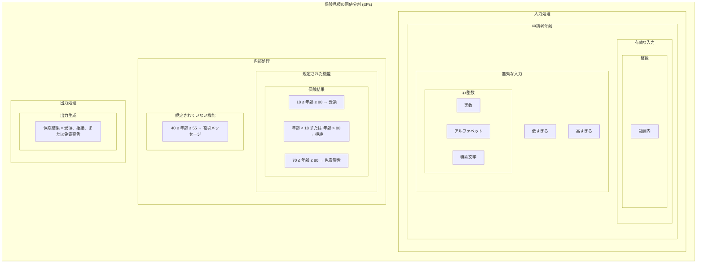

[図 A.1](#Fig_A_1) のテストモデルは、同値分割を示すオイラー図です。あるいは、テストモデルを純粋にテキストとして提示することもできます。
*   範囲内の有効な入力: 18 ≤ 年齢 ≤ 80 (PART-1)
*   低すぎる無効な入力: 年齢 < 18 (PART-2)
*   高すぎる無効な入力: 年齢 > 80 (PART-3)
*   実数の無効な入力: 年齢 = 実数 (PART-4)
*   アルファベットの無効な入力: 年齢 = アルファベット (PART-5)
*   特殊文字の無効な入力: 年齢 = 特殊文字 (PART-6)
*   「受領」メッセージの導出: 18 ≤ 年齢 ≤ 80 (PART-7)
*   「拒絶」メッセージの導出: (年齢 < 18) OR (年齢 > 80) (PART-8)
*   「免責警告」メッセージの導出: 70 ≤ 年齢 ≤ 80 (PART-9)
*   「割引」メッセージの導出: 40 ≤ 年齢 ≤ 55 (PART-10)
*   生成された有効な出力: 任意の入力 (PART-11)

規定されていない機能は、テストベースで規定されていない任意の機能である可能性があります。規定されていない機能を特定することは困難な場合がありますが、それらが実行される可能性があるため、考慮しなければなりません。実行された場合、テストアイテム、そのテストベース、またはその両方に欠陥が特定されたことになります。この例では、1つの規定されていない機能が特定されました（40歳から55歳までの申請者に割引メッセージを提供するという不要な要件）。他のテスターは、全く異なる無効な機能を導出する可能性があることに注意してください。

## A.5 テスト網羅項目 (TD2) {#Section_A.5}
同値分割法を使用すると、特定されたすべての同値分割を網羅する以下の 8 つのテスト網羅項目が導出されます。
*   **TCI-1**: 18 ≤ 年齢 ≤ 80 (PART-1 / PART-7 / PART-11 を網羅)
*   **TCI-2**: 年齢 < 18 (PART-2 / PART-8 / PART-11 を網羅)
*   **TCI-3**: 年齢 > 80 (PART-3 / PART-8 / PART-11 を網羅)
*   **TCI-4**: 年齢 = 実数 (PART-4 / PART-11 を網羅)
*   **TCI-5**: 年齢 = アルファベット (PART-5 / PART-11 を網羅)
*   **TCI-6**: 年齢 = 特殊文字 (PART-6 / PART-11 を網羅)
*   **TCI-7**: 70 ≤ 年齢 ≤ 80 (PART-9 / PART-1 / PART-7 / PART-11 を網羅)
*   **TCI-8**: 40 ≤ 年齢 ≤ 55 (PART-10 / PART-1 / PART-7 / PART-11 を網羅)

## A.6 テストケース (TD3) {#Section_A.6}
8つのテスト網羅項目のそれぞれを実行するテストケースが生成される限り、100 % の同値分割網羅が達成されます。

テストケースを生成する際、単一のテストケースが複数のテスト網羅項目を実行できる場合があります。テストケースの数を最小限に抑えることには、テスト実行時間を短縮できるという明らかな利点がありますが、最小セットを決定するために必要な余分な時間や、テストケースが複数のテスト網羅項目をターゲットにしている場合のデバッグが潜在的に複雑になることによって、この利点が打ち消される場合があります。

この例では、以下に示すように、2つのテストケースが複数のテスト網羅項目を実行します。
*   **CASE#1**: 入力: 「年齢 = 53」、期待結果: 「受領」 (TCI-1 および TCI-8 を実行)
*   **CASE#2**: 入力: 「年齢 = 15」、期待結果: 「拒絶」 (TCI-2 を実行)
*   **CASE#3**: 入力: 「年齢 = 89」、期待結果: 「拒絶」 (TCI-3 を実行)
*   **CASE#4**: 入力: 「年齢 = 36.7」、期待結果: 「拒絶」 (TCI-4 を実行)
*   **CASE#5**: 入力: 「年齢 = w」、期待結果: 「拒絶」 (TCI-5 を実行)
*   **CASE#6**: 入力: 「年齢 = &」、期待結果: 「拒絶」 (TCI-6 を実行)
*   **CASE#7**: 入力: 「年齢 = 77」、期待結果: 「免責警告」 (TCI-7 および TCI-1 を実行)

これら 7 つのテストケースは、すべてのテスト網羅項目が実行されたことを実証し、テスト終了基準の網羅部分を達成します。

## A.7 テスト手順 (TD4) {#Section_A.7}
テスト手順については、テストケースを論理的な順序で並べるだけで十分です。依存関係はないため、テストケースは任意の順序で実行できます。

また、TCI-1 は最も頻繁に実行されるためリスクが高いと判断されたと仮定します。また、開発者の経験から、特殊文字の取り扱いが常に完璧とは限らないため、TCI-6 もリスクが高いと判断されました。したがって、TCI-1 と TCI-6 を網羅するテストケースをより多く実行することが望ましいです。

リスクに関する懸念にも対応しつつ、すべての同値分割を網羅する単純な 14 ステップのテスト手順を以下のように生成できます。
*   **STEP-1**: テスト環境の設定
*   **STEP-2**: CASE#1a (「年齢 = 53」) を実行
*   **STEP-3**: CASE#1b (「年齢 = 27」) を実行
*   **STEP-4**: CASE#1c (「年齢 = 66」) を実行
*   **STEP-5**: CASE#1d (「年齢 = 38」) を実行
*   **STEP-6**: CASE#2 を実行
*   **STEP-7**: CASE#3 を実行
*   **STEP-8**: CASE#4 を実行
*   **STEP-9**: CASE#5 を実行
*   **STEP-10**: CASE#6a (「年齢 = &」) を実行
*   **STEP-11**: CASE#6b (「年齢 = #」) を実行
*   **STEP-12**: CASE#6c (「年齢 = !」) を実行
*   **STEP-13**: CASE#7 を実行
*   **STEP-14**: テスト環境の片付け

---

# 附属書 B（参考）ISO/IEC/IEEE 29119-2 と ISO/IEC/IEEE 12207:2017 のプロセスの整合性 {#Annex_B}
*(ビジュアル参照: [ISO_IEC_IEEE_29119-2_2021(en)_page-0053.jpg](file:///c:/dev/Antigravity/ATRS%20%E5%A4%96%E9%83%A8%E8%A8%AD%E8%A8%88%E6%9B%B8%20Markdown%E5%8C%96/00_Source_Materials/ISO_IEC_IEEE_29119-2_2021(en)/ISO_IEC_IEEE_29119-2_2021(en)/ISO_IEC_IEEE_29119-2_2021(en)_page-0053.jpg))*

## B.1 概要 {#Section_B.1}
ISO/IEC/IEEE 12207 は、ライフサイクルプロセスの共通の枠組みを提供しており、その多くにソフトウェアテストに関連するアクティビティおよびタスクが含まれています。この附属書では、ISO/IEC/IEEE 29119-2 が ISO/IEC/IEEE 12207 のテスト関連プロセスにどのように対応するかをハイレベルで説明します。

## B.2 ISO/IEC/IEEE 12207:2017 から ISO/IEC/IEEE 29119-2 へのマッピング {#Section_B.2}
[表 B.1](#Table_B.1) は、ISO/IEC/IEEE 12207:2017 のプロセスから、対応する ISO/IEC/IEEE 29119-2 のプロセスへのマッピングを提供します。

#### 表 B.1 — ISO/IEC/IEEE 12207:2017 と ISO/IEC/IEEE 29119-2 のハイレベルなマッピング {#Table_B.1}

| ISO/IEC/IEEE 12207:2017 箇条 | ISO/IEC/IEEE 29119-2 箇条 | マッピングの説明 |
| :--- | :--- | :--- |
| **6.1.1 取得プロセス** | 7.2 テスト戦略および計画プロセス 7.3 テストモニタリングおよびコントロールプロセス 8.2 テスト設計および実装プロセス 8.3 テスト環境およびデータ管理プロセス 8.4 テスト実行プロセス | テストマネジメントは、受入れテストの要求事項を特定し、受入れテストを計画、モニタリング、およびコントロールすることを可能にします。動的テストは、受入れテストの設計および実行を可能にします。 |
| **6.2.1 ライフサイクルモデル管理プロセス** | 6 組織的テストプロセス | 組織的テストプロセスは、テストプロセスを含む組織的テスト方針およびプラクティスの開発、レビュー、および改善をサポートします。 |
| **6.2.2 インフラストラクチャ管理プロセス** | 6 組織的テストプロセス | 組織的テストプロセスは、組織的テストインフラおよびサービスの開発、レビュー、および改善をサポートします。 |
| **6.2.4 人的資源管理プロセス** | 7.2 テスト戦略および計画プロセス | テスト戦略および計画プロセスには、必要なスキルの特定、必要なスキルを持つテスターの特定、および採用やトレーニングを通じたそれらのスキルの取得が含まれます。 |
| **6.2.5 品質管理プロセス** | 7 テストマネジメントプロセス 8 動的テストプロセス | これらのプロセスは、プロダクトの品質に関する情報を提供することで、品質管理をサポートします。 |
| **6.3.1 プロジェクト計画プロセス** | 7.2 テスト戦略および計画プロセス | テスト戦略および計画プロセスは、プロジェクトのテストを計画します。 |
| **6.3.2 プロジェクトのアセスメントおよびコントロールプロセス** | 7.3 テストモニタリングおよびコントロールプロセス | テストモニタリングおよびコントロールプロセスは、プロジェクトのテストのアセスメントおよびコントロールを提供します。 |
| **6.3.3 意思決定管理プロセス** | 7.3 テストモニタリングおよびコントロールプロセス | テストモニタリングおよびコントロールプロセスは、プロジェクトのテストに関する意思決定管理を提供します。 |
| **6.3.4 リスク管理プロセス** | 6 組織的テストプロセス 7 テストマネジメントプロセス 8 動的テストプロセス | すべてのプロセスがリスクベースのテストをサポートします。 |
| **6.3.5 構成管理プロセス** | 7.4 テスト終了プロセス 8.2 テスト設計および実装プロセス 8.3 テスト環境およびデータ管理プロセス | テスト終了プロセスでは、アーカイブされたテスト資産の構成管理が必要です。テスト手順、テストケース、およびテストベース間のトレーサビリティを管理しなければなりません。 |
| **6.3.6 情報管理プロセス** | 7 テストマネジメントプロセス | テストマネジメントプロセスでは、テストのためのコミュニケーション計画を作成し、実施する必要があります。 |
| **6.3.7 測定プロセス** | 6 組織的テストプロセス 7 テストマネジメントプロセス 8 動的テストプロセス | すべてのプロセスが、効果的なマネジメントをサポートするための客観的なデータの収集をサポートします。 |
| **6.3.8 品質保証プロセス** | 7 テストマネジメントプロセス 8 動動的テストプロセス | これらは両方とも、典型的なプロジェクトの品質保証戦略の一部として実施されます。 |
| **6.4.3 要件定義プロセス** | 7.2 テスト戦略および計画プロセス 8.2 テスト設計および実装プロセス | テスト戦略は、要件の定義をサポートできます。テストと要件の間のトレーサビリティを管理しなければなりません。 |
| **6.4.5 設計定義プロセス** | 7.2 テスト戦略および計画プロセス 8.2 テスト設計および実装プロセス | テスト戦略は、設計の収集をサポートできます。テストと設計定義の間のトレーサビリティを管理しなければなりません。 |
| **6.4.6 システム分析プロセス** | 6 組織的テストプロセス 7 テストマネジメントプロセス 8 動的テストプロセス | すべてのプロセスが、ライフサイクルの任意の段階における技術的アセスメントをサポートします。 |
| **6.4.7 実装プロセス** | 7 テストマネジメントプロセス 8 動的テストプロセス | これらのプロセスは、ユニットテストのマネジメント、設計、実装、および実行をサポートします。 |
| **6.4.8 統合プロセス** | 7 テストマネジメントプロセス 8 動的テストプロセス | これらのプロセスは、統合テストのマネジメント、設計、実装、および実行をサポートします。 |
| **6.4.9 検証プロセス** | 7 テストマネジメントプロセス 8 動的テストプロセス | 多くのプロジェクトにおいて、テストは検証の主要な形態です。 |
| **6.4.10 移行プロセス** | 7 テストマネジメントプロセス 8 動的テストプロセス | システムのバックアップと復元、インストールテストなど、移行に関連するテスト。 |
| **6.4.11 妥当性確認プロセス** | 7 テストマネジメントプロセス 8 動的テストプロセス | 多くのプロジェクトにおいて、テストは妥当性確認の主要な形態です。 |
| **6.4.12 運用プロセス** | 7 テストマネジメントプロセス 8 動的テストプロセス | システムが運用目的で実行されるためにリリースされた後に実行されるテスト。 |
| **6.4.13 保守プロセス** | 7 テストマネジメントプロセス 8 動的テストプロセス | 修正されたコンポーネントが元のパフォーマンス要件を満たしていることを確認するテスト。 |
| **6.4.14 廃棄プロセス** | 7.4 テスト終了プロセス | テスト資産が適切に処分（例：アーカイブ）されることを確実にします。 |

---

# 附属書 C（参考）ISO/IEC/IEEE 29119-2 と ISO/IEC 17025:2017 のプロセスの整合性 {#Annex_C}
*(ビジュアル参照: [ISO_IEC_IEEE_29119-2_2021(en)_page-0057.jpg](file:///c:/dev/Antigravity/ATRS%20%E5%A4%96%E9%83%A8%E8%A8%AD%E8%A8%88%E6%9B%B8%20Markdown%E5%8C%96/00_Source_Materials/ISO_IEC_IEEE_29119-2_2021(en)/ISO_IEC_IEEE_29119-2_2021(en)/ISO_IEC_IEEE_29119-2_2021(en)_page-0057.jpg))*

この附属書は、ISO/IEC/IEEE 29119-2 と ISO/IEC 17025:2017 のプロセスの整合性を説明します。

#### 表 C.1 — ISO/IEC 17025:2017 と ISO/IEC/IEEE 29119-2 のハイレベルなマッピング {#Table_C.1}

| ISO/IEC 17025:2017 | | ISO/IEC/IEEE 29119-2 |
| :--- | :--- | :--- |
| 要員の責任、権限および相互関係 | 5.5 b) | 7.2 テスト戦略および計画 |
| 要員、施設、設備、システムおよび支援サービス | 6.1 | 8.3 テスト環境およびデータ管理 |
| 方法の選択、検証および妥当性確認 | 7.2 | 7.2 テスト戦略および計画 |
| サンプリング計画および方法 | 7.3.1 | 7.2 テスト戦略および計画 |
| 結果の妥当性のモニタリング | 7.7.1 | 7.3 テストモニタリングおよびコントロール |
| 結果が正確、明快、かつ客観的に提供されること | 7.8.1.2 | 7.3 テストモニタリングおよびコントロール |
| 不適合な試験業務 | 7.10.1 | 7.3 テストモニタリングおよびコントロール |

---

# 附属書 D（参考）ISO/IEC/IEEE 29119-2 と BS 7925-2:1998 のプロセスの整合性 {#Annex_D}
*(ビジュアル参照: [ISO_IEC_IEEE_29119-2_2021(en)_page-0058.jpg](file:///c:/dev/Antigravity/ATRS%20%E5%A4%96%E9%83%A8%E8%A8%AD%E8%A8%88%E6%9B%B8%20Markdown%E5%8C%96/00_Source_Materials/ISO_IEC_IEEE_29119-2_2021(en)/ISO_IEC_IEEE_29119-2_2021(en)/ISO_IEC_IEEE_29119-2_2021(en)_page-0058.jpg))*

この附属書は、ISO/IEC/IEEE 29119-2 と BS 7925-2:1998 のプロセスの整合性を説明します。

#### 表 D.1 — BS 7925-2:1998 と ISO/IEC/IEEE 29119-2 のハイレベルなマッピング {#Table_D.1}

| BS 7925-2:1998 | | ISO/IEC/IEEE 29119-2 |
| :--- | :--- | :--- |
| 一般 | 4.1 | 7.2.4.6 テスト戦略の設計 (TP5) 7.3.4.2 セットアップ (TMC1) |
| プロジェクトコンポーネントテスト戦略: 仕様 | 4.2.1 | 7.2.4.6 テスト戦略の設計 (TP5) |
| プロジェクトコンポーネントテスト計画 | 4.3 | 7.2.4.6 テスト戦略の設計 (TP5) 7.3.4.2 セットアップ (TMC1) |
| コンポーネントテスト計画 | 4.4 | 7.2.4.6 テスト戦略の設計 (TP5) 7.3.4.2 セットアップ (TMC1) |
| コンポーネントテストケース設計 | 4.5.1 | 8.2.4.4 テストケースの導出 (TD3) |
| コンポーネントテストケース要件仕様 | 4.5.2 | 8.2.4.4 テストケースの導出 (TD3) |
| コンポーネントテストケース実行の再現性 | 4.5.3 | 該当なし (Nil) |
| コンポーネントテスト実行 | 4.6 | 該当なし (Nil) |
| コンポーネントの識別 | 4.7.1 | 8.4.4.2 テスト手順の実行 (EX1) 8.4.4.4 テスト実行の記録 (EX3) |
| 実行結果 | 4.7.2 | 8.4.4.3 テスト結果の比較 (EX2) 8.5.4.2 テスト結果の分析 (IR1) |
| 影響を受ける活動の繰り返し | 4.7.3 | 該当なし (Nil) |
| 記録 | 4.7.4 | 該当なし (Nil) |
| コンポーネントテスト完了の検証 | 4.8 | 8.4.4.2 テスト手順の実行 (EX1) |

---

# 附属書 E（参考）テストモデル {#Annex_E}
*(ビジュアル参照: [ISO_IEC_IEEE_29119-2_2021(en)_page-0059.jpg](file:///c:/dev/Antigravity/ATRS%20%E5%A4%96%E9%83%A8%E8%A8%AD%E8%A8%88%E6%9B%B8%20Markdown%E5%8C%96/00_Source_Materials/ISO_IEC_IEEE_29119-2_2021(en)/ISO_IEC_IEEE_29119-2_2021(en)/ISO_IEC_IEEE_29119-2_2021(en)_page-0059.jpg))*

本文書の旧版では、テスト設計および実装プロセス (8.2) にテスト条件の使用が含まれていました。標準の使用に関するフィードバックでは、ユーザーがテスト条件を理解し、テストケースを導出するために使用することに問題があることが強調されました。多くのユーザーがテスト条件を「混乱を招く」と表現しました。そのため、代わりにテストモデルに基づいた代替アプローチが選択されました。

テストモデルは、ISO/IEC/IEEE 29119-4 の各テストケース設計技法を定義するために成功裏に使用されており、テストモデルを使用して各技法に対する新しい、より単純な例が生成されています。テスト設計および実装にテストモデルを使用する例は、附属書 A に記載されています。

テストモデルを使用することで、テスト網羅項目をより簡単に特定できる、簡素化されたテスト設計プロセスを導入することができました。この簡素化されたテスト設計プロセスは、以前の 6 つではなく 4 つのアクティビティで構成されています。本文書の旧版では、一部のテストケース設計技法において、テスト条件の導出とテスト網羅項目の導出という 2 つのアクティビティが同じ出力を生成しており、一方が冗長であることを示唆していました。テストモデル（テスト条件の代わり）を使用することにより、テストモデルとテスト網羅項目の間に一対一のマッピングがなくなるため、各アクティビティが有効な変換を実行することになります。

テスト条件とテストモデルの違いを把握するのは難しい場合があります。テスト条件は、テストの基礎として使用される可能性のあるあらゆるものを記述するために使用される、より抽象的な概念です。対照的に、テストモデルは、要求されるテスト網羅の観点から、テストされているテストアイテムのその部分の振る舞いを記述することに、より焦点を絞っています。1つのまとまりのあるテストモデルは通常、多くのテストを作成するために使用できますが、それらの同じテストを作成するには、通常、まとまりの少ない多くのテスト条件を特定する必要があります。

---

# 参考文献 {#Bibliography}
*(ビジュアル参照: [ISO_IEC_IEEE_29119-2_2021(en)_page-0060.jpg](file:///c:/dev/Antigravity/ATRS%20%E5%A4%96%E9%83%A8%E8%A8%AD%E8%A8%88%E6%9B%B8%20Markdown%E5%8C%96/00_Source_Materials/ISO_IEC_IEEE_29119-2_2021(en)/ISO_IEC_IEEE_29119-2_2021(en)/ISO_IEC_IEEE_29119-2_2021(en)_page-0060.jpg))*

[1] BS 7925-2:1998, *Software testing — Software component testing*

[2] BS 7925-1:1998, *Software testing — Vocabulary*

[3] IEEE 1012, *IEEE Standard for System and Software Verification and Validation*

[4] ISO/IEC/IEEE 12207:2017, *Systems and software engineering — Software life cycle processes*

[5] ISO 15489-1, *Information and documentation — Records management — Part 1: Concepts and principles*

[6] ISO/IEC/IEEE 15288, *Systems and software engineering — System life cycle processes*

[7] ISO/IEC/TR 24774, *Systems and software engineering — Life cycle management — Guidelines for process description*

[8] ISO 9001, *Quality management systems — Requirements*

[9] ISO/IEC 17025:2017, *General requirements for the competence of testing and calibration laboratories*

[10] ISO/IEC 25010, *Systems and software engineering — Systems and software Quality Requirements and Evaluation (SQuaRE) — System and software quality models*

[11] ISO/IEC/IEEE 24765, *Systems and software engineering — Vocabulary*

[12] INTERNATIONAL SOFTWARE TESTING QUALIFICATIONS BOARD (ISTQB). *Standard Glossary of Terms Used in Software Testing*, Version 3.5, 2020. Available from: https://www.istqb.org/

[13] ISO/IEC/IEEE 29119-1, *Software and systems engineering — Software testing — Part 1: Concepts and definitions*

[14] ISO/IEC/IEEE 29119-3, *Software and systems engineering — Software testing — Part 3: Test documentation*

[15] ISO/IEC/IEEE 29119-4, *Software and systems engineering — Software testing — Part 4: Test techniques*

[16] ISO/IEC 33002, *Information technology — Process assessment — Requirements for performing process assessment*

[17] ISO/IEC 16085, *Systems and software engineering — Life cycle processes — Risk management*

[18] ISO 31000, *Risk management — Guidelines*

[19] ISO/IEC/IEEE 15026-1:2019, *Systems and software engineering — Systems and software assurance — Part 1: Concepts and vocabulary*
