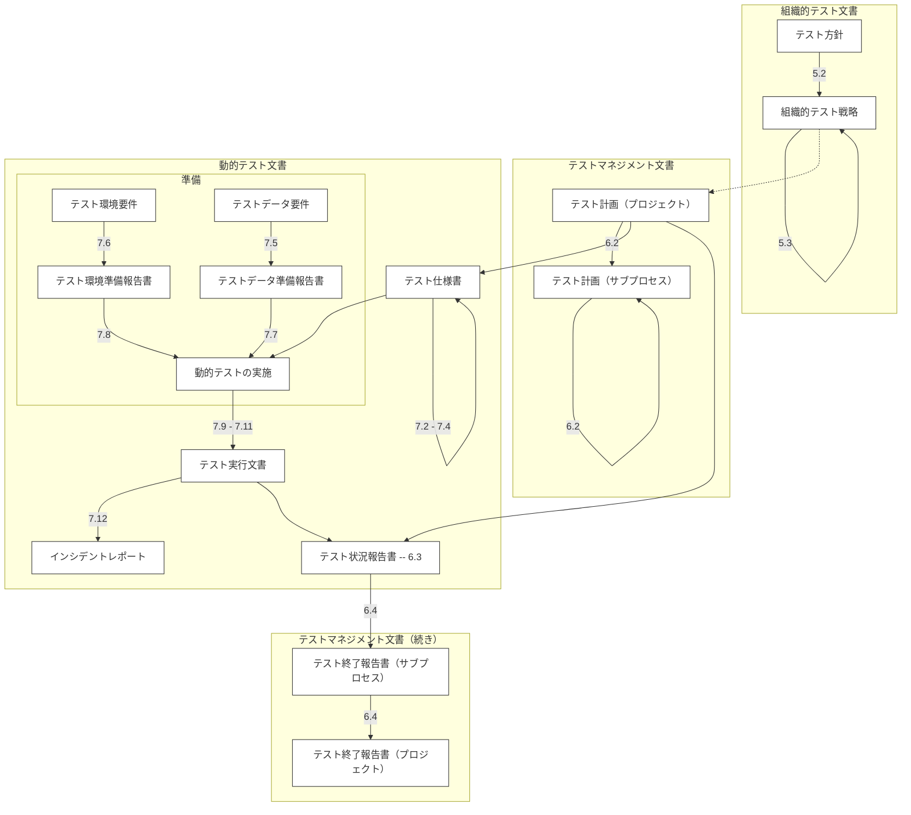
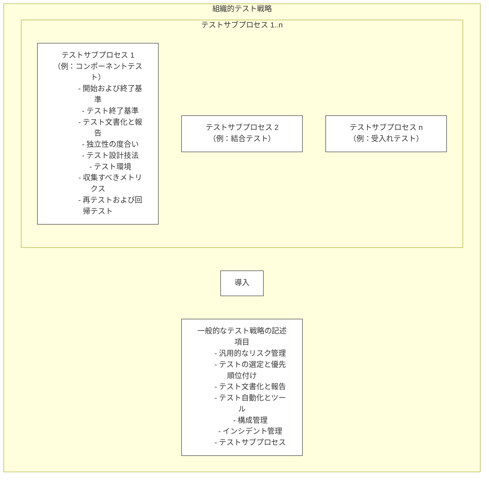
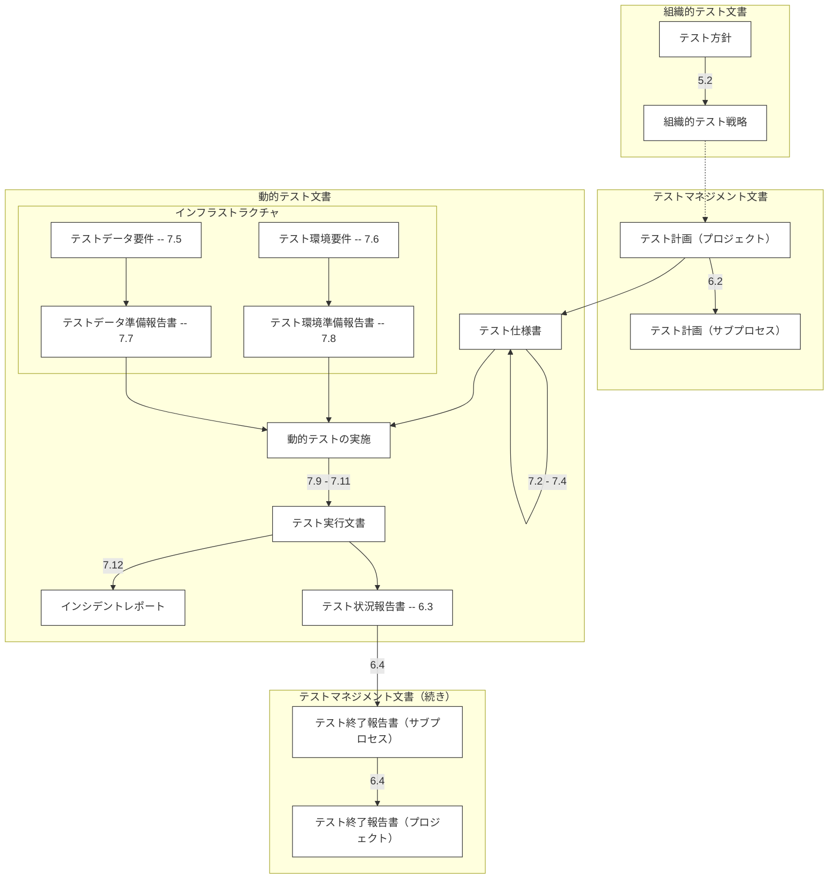
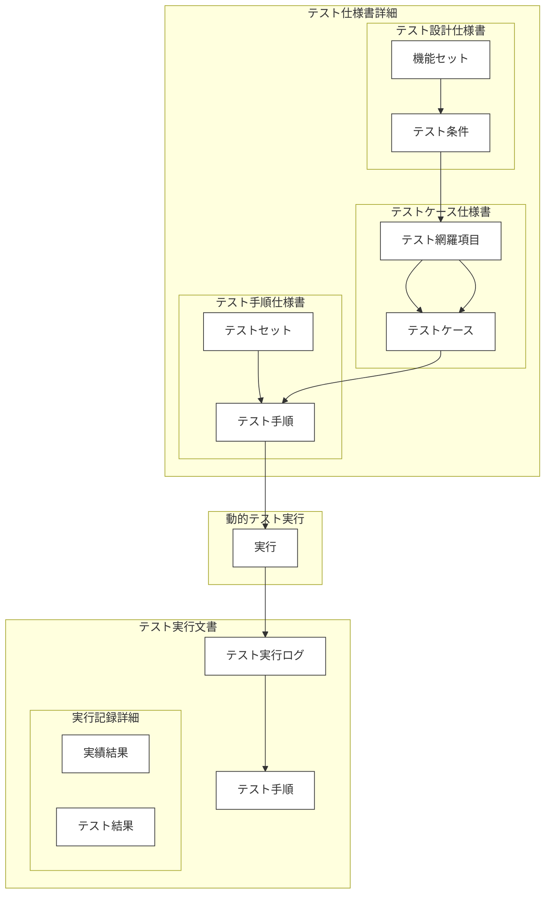

# ISO/IEC/IEEE 29119-3:2013 (J) ソフトウェア及びシステム工学 — ソフトウェアテスト — 第3部：テスト文書 {#Title}

## まえがき (Foreword) {#Foreword}
*(ビジュアル参照: [ISO_IEC_IEEE_29119-3_2013(en)_page-0005.jpg](file:///c:/dev/Antigravity/ATRS%20%E5%A4%96%E9%83%A8%E8%A8%AD%E8%A8%88%E6%9B%B8%20Markdown%E5%8C%96/00_Source_Materials/ISO_IEC_IEEE_29119-3_2013(en)/ISO_IEC_IEEE_29119-3_2013(en)_page-0005.jpg))*

ISO（国際標準化機構）及び IEC（国際電気標準会議）は、世界的な標準化のための専門システムを形成しています。ISO または IEC のメンバーである各国の団体は、特定の技術活動分野を扱うために各組織によって設置された技術委員会を通じて、国際規格の開発に参加します。ISO 及び IEC の技術委員会は、共通の利益がある分野で協力します。ISO 及び IEC と連携している他の国際組織（政府機関及び非政府機関）も、この活動に参加します。情報技術の分野では、ISO 及び IEC は合同技術委員会 ISO/IEC JTC 1 を設置しています。

国際規格は、ISO/IEC 指針 第2部の規則に従ってドラフトが作成されます。

合同技術委員会の主なタスクは、国際規格を作成することです。合同技術委員会によって承認された国際規格のドラフトは、投票のために各国の団体に配布されます。国際規格として発行するには、投票した各国の団体の少なくとも 75 % の承認が必要です。

本文書の要素の一部が特許権の対象となる可能性があることに注意を喚起します。ISO 及び IEC は、そのような特許権の全部または一部を特定する責任を負いません。

ISO/IEC/IEEE 29119-3 は、IEEE コンピュータ・ソサイエティのシステム及びソフトウェア工学規格委員会と協力して、合同技術委員会 ISO/IEC JTC 1（情報技術）、分科委員会 SC 7（ソフトウェア及びシステム工学）によって作成されました。

ISO/IEC/IEEE 29119 シリーズのすべての部のリストについては、ISO のウェブサイトを参照してください。

## 導入 (Introduction) {#Introduction}
*(ビジュアル参照: [ISO_IEC_IEEE_29119-3_2013(en)_page-0006.jpg](file:///c:/dev/Antigravity/ATRS%20%E5%A4%96%E9%83%A8%E8%A8%AD%E8%A8%88%E6%9B%B8%20Markdown%E5%8C%96/00_Source_Materials/ISO_IEC_IEEE_29119-3_2013(en)/ISO_IEC_IEEE_29119-3_2013(en)_page-0006.jpg))*

ISO/IEC/IEEE 29119 シリーズのソフトウェアテスト規格の目的は、ソフトウェアテストを行うあらゆる組織が使用できる、国際的に合意されたソフトウェアテスト規格のセットを定義することです。

ISO/IEC/IEEE 29119-3 は、ソフトウェアテストプロセス全体で使用できるソフトウェアテスト文書のテンプレートを定義しています。これらのテンプレートは、ISO/IEC/IEEE 29119-2 テストプロセスの成果に対応するように設計されています。

ISO/IEC/IEEE 29119-3 は、あらゆる形態のソフトウェアテストをサポートしており、あらゆるソフトウェア開発ライフサイクルモデルと組み合わせて使用できます。

[JIS Z 8301] 本書は、JIS Z 8301:2019 に基づく技術文書、および JSTQB テスト用語集（Version 2023.J01）の定義に準拠して構成されています。

---

## 1 適用範囲 (Scope) {#Chapter_1}
*(ビジュアル参照: [ISO_IEC_IEEE_29119-3_2013(en)_page-0007.jpg](file:///c:/dev/Antigravity/ATRS%20%E5%A4%96%E9%83%A8%E8%A8%AD%E8%A8%88%E6%9B%B8%20Markdown%E5%8C%96/00_Source_Materials/ISO_IEC_IEEE_29119-3_2013(en)/ISO_IEC_IEEE_29119-3_2013(en)_page-0007.jpg))*

本文書は、ソフトウェアテストにおいて作成されるテスト文書のテンプレートを規定します。これは、以下のカテゴリに分類されます。
- 組織的テストプロセス文書
- テストマネジメントプロセス文書
- 動的テストプロセス文書

本文書は、すべてのソフトウェア開発ライフサイクルモデルにおけるテストに適用可能です。

---

## 2 適合性 (Conformance) {#Chapter_2}
*(ビジュアル参照: [ISO_IEC_IEEE_29119-3_2013(en)_page-0007.jpg](file:///c:/dev/Antigravity/ATRS%20%E5%A4%96%E9%83%A8%E8%A8%AD%E8%A8%88%E6%9B%B8%20Markdown%E5%8C%96/00_Source_Materials/ISO_IEC_IEEE_29119-3_2013(en)/ISO_IEC_IEEE_29119-3_2013(en)_page-0007.jpg))*

### 2.1 意図された使用法 {#Section_2.1}
本文書の要求事項は、箇条 5、6、および 7 に含まれています。

### 2.2 適合基準 {#Section_2.2}

#### 2.2.1 全面的適合 {#Section_2.2.1}
全面的適合を主張するには、箇条 5、6、および 7 で定義された文書のすべての要求事項（「〜しなければならない(shall)」という記述）を満たさなければなりません。

#### 2.2.2 テーラリング適合 {#Section_2.2.2}
テーラリングが行われる場合、特定の文書が作成されない理由、または文書の内容が変更された理由を記録しなければなりません。

---

## 3 引用規格 (Normative references) {#Chapter_3}
*(ビジュアル参照: [ISO_IEC_IEEE_29119-3_2013(en)_page-0007.jpg](file:///c:/dev/Antigravity/ATRS%20%E5%A4%96%E9%83%A8%E8%A8%AD%E8%A8%88%E6%9B%B8%20Markdown%E5%8C%96/00_Source_Materials/ISO_IEC_IEEE_29119-3_2013(en)/ISO_IEC_IEEE_29119-3_2013(en)_page-0007.jpg))*

以下の文書は、その全体または一部の内容が本文書において引用されており、本文書の要求事項を構成します。
- **ISO/IEC/IEEE 29119-1**, *Software and systems engineering — Software testing — Part 1: Concepts and definitions*
- **ISO/IEC/IEEE 29119-2**, *Software and systems engineering — Software testing — Part 2: Test processes*

---

## 4 用語及び定義 (Terms and definitions) {#Chapter_4}
*(ビジュアル参照: [ISO_IEC_IEEE_29119-3_2013(en)_page-0007.jpg](file:///c:/dev/Antigravity/ATRS%20%E5%A4%96%E9%83%A8%E8%A8%AD%E8%A8%88%E6%9B%B8%20Markdown%E5%8C%96/00_Source_Materials/ISO_IEC_IEEE_29119-3_2013(en)/ISO_IEC_IEEE_29119-3_2013(en)_page-0007.jpg))*

本文書の目的のために、ISO/IEC/IEEE 29119-1 で定義された用語、および以下の定義を適用します。

### 4.1 実績結果 (actual results) {#Term_4.1}
テスト実行の結果として観察される、テストアイテムの振る舞い若しくは状態の集合、または関連データ若しくはテスト環境の状態の集合。

### 4.2 終了基準 (completion criteria) {#Term_4.2}
テスト活動が完了したとみなされるための条件。
例：特定の網羅率の達成、または残存欠陥が許容範囲内であること。

### 4.3 期待結果 (expected results) {#Term_4.3}
仕様書またはその他のソースに基づいた、規定された条件下でのテストアイテムの観察可能な予測される振る舞い。

### 4.4 機能セット (feature set) {#Term_4.4}
後のテスト設計活動において、他の機能セットとは独立して扱うことができるテストアイテムの論理的なサブセット。

### 4.5 インシデントレポート (incident report) {#Term_4.5}
プロジェクト、プロダクト、サービス、またはシステムのライフサイクル中に発生した、異常な若しくは予期しないイベント、状況、または結果の文書化。

### 4.6 組織的テスト方針 (Organizational Test Policy) {#Term_4.6}
組織内におけるテストの目的、目標、原則、および範囲を記述したエグゼクティブレベルの文書。

### 4.7 組織的テスト戦略 (Organizational Test Strategy) {#Term_4.7}
組織内で実施されるテストについて推奨されるアプローチまたは方法を表現し、テストがどのように実施されるべきかの詳細を提供する文書。

### 4.8 優先順位 (priority) {#Term_4.8}
タスク、課題、またはリスクに割り当てられた、その重要性または緊急性を示す相対的なランク付け。

### 4.9 プロダクトリスク (product risk) {#Term_4.9}
プロダクトがその機能、品質、または構造の特定の側面において欠陥を持つ可能性があるリスク。

### 4.10 プロジェクトリスク (project risk) {#Term_4.10}
プロジェクトの管理に関連するリスク。
例：人員不足、厳しい納期、要件の変更。

### 4.11 再テスト / 確認テスト (retesting / confirmation testing) {#Term_4.11}
故障を修正するために行われた変更が、その故障を正常に除去したことを確認するために行われるテスト。

### 4.12 テストケース (test case) {#Term_4.12}
テスト目的を達成させるためにテストアイテムの実行を推進するために作成される、事前条件、入力、および期待結果のセット。

### 4.13 テスト条件 (test condition) {#Term_4.13}
テストの基礎として特定された、機能、トランザクション、品質属性、または構造要素などの、コンポーネントまたはシステムのテスト可能な側面。

### 4.14 テスト環境 (test environment) {#Term_4.14}
テストを実施するために必要な、設備、ハードウェア、ソフトウェア、ファームウェア、手順を含む環境。

### 4.15 テスト網羅項目 (test coverage item) {#Term_4.15}
テスト設計技法を使用して特定される、特定の網羅基準に対するテストアイテムの測定可能な属性。

### 4.16 テストデータ (test data) {#Term_4.16}
1つ以上のテストケースを実行するための入力要件を満たすために作成または選択されたデータ。

### 4.17 テスト計画 (Test Plan) {#Term_4.17}
特定のテストアイテムまたはステージに対するテスト活動の目的、アプローチ、リソース、およびスケジュールを詳細に記述した文書。

### 4.18 テスト手順 (test procedure) {#Term_4.18}
実行順に並べられたテストケースのシーケンス、および、事前条件の設定や実行後の事後処理活動に必要な関連アクション。

### 4.19 テストスクリプト (test script) {#Term_4.19}
通常、自動化されたテスト実行に使用される、テスト手順の具体的な実装。

---

## 5 組織的テストプロセス文書 (Organizational Test Process Documentation) {#Chapter_5}
*(ビジュアル参照: [ISO_IEC_IEEE_29119-3_2013(en)_page-0017.jpg](file:///c:/dev/Antigravity/ATRS%20%E5%A4%96%E9%83%A8%E8%A8%AD%E8%A8%88%E6%9B%B8%20Markdown%E5%8C%96/00_Source_Materials/ISO_IEC_IEEE_29119-3_2013(en)/ISO_IEC_IEEE_29119-3_2013(en)/ISO_IEC_IEEE_29119-3_2013(en)_page-0017.jpg))*

### 5.1 概要 {#Section_5.1}

組織的テスト仕様書は、組織レベルのテストに関する情報を記述するものであり、プロジェクトに依存しません。組織的テストプロセスで開発される組織的テスト仕様書の典型的な例には、以下のものがあります。
- **テスト方針 (Test Policy)**
- **組織的テスト戦略 (Organizational Test Strategy)**

ISO/IEC/IEEE 29119-3:2013 における文書の階層構造を以下の図 1 に示します。

#### 図 1 — 文書階層構造 {#Figure_1}
*(ビジュアル参照: [ISO_IEC_IEEE_29119-3_2013(en)_page-0010.jpg](file:///c:/dev/Antigravity/ATRS%20%E5%A4%96%E9%83%A8%E8%A8%AD%E8%A8%88%E6%9B%B8%20Markdown%E5%8C%96/00_Source_Materials/ISO_IEC_IEEE_29119-3_2013(en)/ISO_IEC_IEEE_29119-3_2013(en)/ISO_IEC_IEEE_29119-3_2013(en)_page-0010.jpg))*

### 5.2 テスト方針 (Test Policy) {#Section_5.2}

#### 5.2.1 概要 {#Section_5.2.1}
テスト方針は、組織内で適用されるソフトウェアテストの目的と原則を定義します。テストによって何を達成すべきかを定義しますが、テストがどのように実施されるかの詳細は記述しません。

#### 5.2.4 テスト方針の記述項目 {#Section_5.2.4}
- **5.2.4.1 テストの目的**: 組織内におけるテストの目的、目標、および全体的な範囲を記述します。
- **5.2.4.2 テストプロセス**: 組織が従うテストプロセス（例：ISO/IEC/IEEE 29119-2）を特定します。
- **5.2.4.3 テスト組織構造**: 役割と階層構造を特定します。
- **5.2.4.4 テスターのトレーニング**: 必要なトレーニングと資格を規定します。
- **5.2.4.5 テスターの倫理**: 組織の倫理規定を特定します。
- **5.2.4.6 規格**: 適用される規格を規定します。
- **5.2.4.7 その他の関連方針**: テスト組織に影響を与える方針を特定します。
- **5.2.4.8 テストの価値の測定**: 組織がいかにして ROI（投資利益率）を決定するかを規定します。
- **5.2.4.9 テスト資産のアーカイブと再利用**: アーカイブに関する方針を規定します。
- **5.2.4.10 テストプロセスの改善**: 継続的な改善のための手法を規定します。

### 5.3 組織的テスト戦略 (Organizational Test Strategy) {#Section_5.3}

#### 5.3.1 概要 {#Section_5.3.1}
テストがどのように実施されるべきか（テスト方針の目的をどのように達成するか）に関するガイドラインを提供する技術文書です。プロジェクト固有のものではありません。

#### 図 2 — 組織的テスト戦略の構造 {#Figure_2}
*(ビジュアル参照: [ISO_IEC_IEEE_29119-3_2013(en)_page-0020.jpg](file:///c:/dev/Antigravity/ATRS%20%E5%A4%96%E9%83%A8%E8%A8%AD%E8%A8%88%E6%9B%B8%20Markdown%E5%8C%96/00_Source_Materials/ISO_IEC_IEEE_29119-3_2013(en)/ISO_IEC_IEEE_29119-3_2013(en)/ISO_IEC_IEEE_29119-3_2013(en)_page-0020.jpg))*

#### 5.3.4 プロジェクト全体の組織的テスト戦略の記述項目 {#Section_5.3.4}
- **5.3.4.1 汎用的なリスク管理**: リスク管理へのアプローチ。
- **5.3.4.2 テストの選定と優先順位付け**: 優先順位付けされた機能セット → 優先順位付けされたテスト条件 → 網羅項目 → テストケース。
- **5.3.4.3 テスト文書化と報告**: 必要な文書の特定。
- **5.3.4.4 テスト自動化とツール**: ツールへのアプローチ。
- **5.3.4.5 構成管理**: テストワークプロダクトの取り扱い。
- **5.3.4.6 インシデント管理**: インシデント管理のプロセス。
- **5.3.4.7 テストサブプロセス**: レベル／種別の特定（例：ユニット、システム）。

#### 5.3.5 テストサブプロセス固有の戦略記述項目 {#Section_5.3.5}
開始／終了基準、終了基準、文書化、独立性、設計技法、環境、メトリクス、および再テスト／回帰テストを網羅します。

---

## 6 テストマネジメントプロセス文書 (Test Management Processes Documentation) {#Chapter_6}
*(ビジュアル参照: [ISO_IEC_IEEE_29119-3_2013(en)_page-0027.jpg](file:///c:/dev/Antigravity/ATRS%20%E5%A4%96%E9%83%A8%E8%A8%AD%E8%A8%88%E6%9B%B8%20Markdown%E5%8C%96/00_Source_Materials/ISO_IEC_IEEE_29119-3_2013(en)/ISO_IEC_IEEE_29119-3_2013(en)/ISO_IEC_IEEE_29119-3_2013(en)_page-0027.jpg))*

### 6.1 概要 {#Section_6.1}
- **テスト計画 (Test Plan)**
- **テスト状況報告書 (Test Status Report)**
- **テスト終了報告書 (Test Completion Report)**

### 6.2 テスト計画 (Test Plan) {#Section_6.2}
#### 6.2.1 概要 {#Section_6.2.1}
計画および管理のための技術文書を提供します。進化する文書です。

#### 6.2.4 テストのコンテキスト {#Section_6.2.4}
テストアイテム、範囲、前提条件、およびステークホルダー。

#### 6.2.7 テスト戦略 {#Section_6.2.7}
成果物、技法、基準、データ、および環境を含む、プロジェクト固有のアプローチ。

### 6.3 テスト状況報告書 (Test Status Report) {#Section_6.3}
#### 6.3.1 概要 {#Section_6.3.1}
特定の期間の状況情報。アジャイルでは、口頭またはバーンダウンチャートで提供される場合があります。

#### 6.3.4 テスト状況 {#Section_6.3.4}
報告期間、計画に対する進捗、阻害要因、対策、および新しいリスク。

### 6.4 テスト終了報告書 (Test Completion Report) {#Section_6.4}
#### 6.4.1 概要 {#Section_6.4.1}
実施されたテストの要約。

#### 6.4.4 実施されたテスト {#Section_6.4.4}
結果の要約、逸脱事項、基準の評価、残存リスク、および教訓。

---

## 7 動的テストプロセス文書 (Dynamic Test Processes Documentation) {#Chapter_7}
*(ビジュアル参照: [ISO_IEC_IEEE_29119-3_2013(en)_page-0034.jpg](file:///c:/dev/Antigravity/ATRS%20%E5%A4%96%E9%83%A8%E8%A8%AD%E8%A8%88%E6%9B%B8%20Markdown%E5%8C%96/00_Source_Materials/ISO_IEC_IEEE_29119-3_2013(en)/ISO_IEC_IEEE_29119-3_2013(en)/ISO_IEC_IEEE_29119-3_2013(en)_page-0034.jpg))*

### 7.1 概要 {#Section_7.1}
動的テストプロセスに関連する文書には、テスト仕様書（設計、ケース、手順）、要件（データ、環境）、準備報告書、実行記録（結果、ログ）、およびインシデントレポートが含まれます。

### 7.2 テスト設計仕様書 (Test Design Specification) {#Section_7.2}
#### 7.2.1 概要 {#Section_7.2.1}
テストの基礎（テストベース）から導出される、テスト対象の機能および**テスト条件**を特定します。

#### 7.2.5 テスト条件 {#Section_7.2.5}
検証可能な、テストの基礎として特定された個々の項目またはイベント。

### 7.3 テストケース仕様書 (Test Case Specification) {#Section_7.3}
#### 7.3.1 概要 {#Section_7.3.1}
**テスト網羅項目**および対応する**テストケース**を特定します。

#### 7.3.4 テスト網羅項目 {#Section_7.3.4}
テスト技法をテスト条件に適用することによって導出される項目（例：有効なパーティション／無効なパーティション）。

### 7.4 テスト手順仕様書 (Test Procedure Specification) {#Section_7.4}
#### 7.4.5 テスト手順 {#Section_7.4.5}
実行の順序、セットアップ、使用するテストケース、および終了処理。

### 7.5 & 7.6 要件 (Requirements) {#Section_7.5_7.6}
- **7.5 テストデータ要件**: 必要なデータの属性。
- **7.6 テスト環境要件**: 必要な環境の属性。

### 7.7 & 7.8 準備報告書 (Readiness Reports) {#Section_7.7_7.8}
- **7.7 テストデータ準備報告書**: 各テストデータ要件の充足状況を記述します。
- **7.8 テスト環境準備報告書**: 各テスト環境要件の充足状況を記述します。

### 7.9 & 7.10 実行結果 (Results) {#Section_7.9_7.10}
- **7.9 実績結果**: 実行中に観察された振る舞い。
- **7.10 テスト結果**: 合格 (Pass)／不合格 (Fail)／ブロック (Blocked) の判定。

### 7.11 テスト実行ログ (Test Execution Log) {#Section_7.11}
実行イベントの時系列記録（時刻、詳細、影響）。

### 7.12 インシデントレポート (Incident Reporting) {#Section_7.12}
発見された課題を文書化します（発生時刻、報告者、コンテキスト、詳細、重要度、優先順位、ステータス）。

---

## 附属書 A（参考）文書の概要とアウトライン (Annex A (Informative) Overview and Outlines of Documents) {#Annex_A}
*(ビジュアル参照: [ISO_IEC_IEEE_29119-3_2013(en)_page-0057.jpg](file:///c:/dev/Antigravity/ATRS%20%E5%A4%96%E9%83%A8%E8%A8%AD%E8%A8%88%E6%9B%B8%20Markdown%E5%8C%96/00_Source_Materials/ISO_IEC_IEEE_29119-3_2013(en)/ISO_IEC_IEEE_29119-3_2013(en)/ISO_IEC_IEEE_29119-3_2013(en)_page-0057.jpg))*

### A.1 概要 {#Section_A.1}

図 A.1 は、テスト文書のコンテキストが組織的テスト方針によって設定されることを示しています。動的テスト文書は、特定のプロジェクトに対するテストマネジメント文書のコンテキスト内で作成されます。

#### 図 A.1 — テスト文書の階層構造 {#Figure_A.1}
*(ビジュアル参照: [ISO_IEC_IEEE_29119-3_2013(en)_page-0057.jpg](file:///c:/dev/Antigravity/ATRS%20%E5%A4%96%E9%83%A8%E8%A8%AD%E8%A8%88%E6%9B%B8%20Markdown%E5%8C%96/00_Source_Materials/ISO_IEC_IEEE_29119-3_2013(en)/ISO_IEC_IEEE_29119-3_2013(en)/ISO_IEC_IEEE_29119-3_2013(en)_page-0057.jpg))*

#### 図 A.2 — テスト設計および実装文書の階層構造 {#Figure_A.2}
*(ビジュアル参照: [ISO_IEC_IEEE_29119-3_2013(en)_page-0058.jpg](file:///c:/dev/Antigravity/ATRS%20%E5%A4%96%E9%83%A8%E8%A8%AD%E8%A8%88%E6%9B%B8%20Markdown%E5%8C%96/00_Source_Materials/ISO_IEC_IEEE_29119-3_2013(en)/ISO_IEC_IEEE_29119-3_2013(en)/ISO_IEC_IEEE_29119-3_2013(en)_page-0058.jpg))*

### A.2 文書のアウトライン {#Section_A.2}

箇条 5、6、および 7 で定義されたすべての文書には、標準的なメタデータが含まれます：**文書固有の情報**（識別、発行組織、承認、履歴）および**導入**（適用範囲、引用規格、用語定義）。

#### A.2.2 組織的テスト方針 {#Template_A.2.2}
- **テスト方針の記述項目**: 目的、プロセス、構造、トレーニング、倫理、規格、価値の測定、アーカイブ／再利用、改善。

#### A.2.3 組織的テスト戦略 {#Template_A.2.3}
- **プロジェクト全体の記述項目**: リスク管理、選定／優先順位付け、文書化／報告、自動化／ツール、構成管理、インシデント、サブプロセス。
- **サブプロセス固有の記述項目**: 開始／終了基準、終了基準、報告、独立性、技法、環境、メトリクス、再テスト／回帰テスト。

#### A.2.4 テスト計画 {#Template_A.2.4}
- **コンテキスト**: プロジェクト、アイテム、範囲、前提条件、ステークホルダー。
- **コミュニケーション**
- **リスクレジスタ**: プロダクトリスク、プロジェクトリスク。
- **テスト戦略**: サブプロセス、成果物、技法、終了基準、メトリクス、データ／環境、再テスト、中断／再開、逸脱。
- **活動と見積り**、**人員配置**（役割、採用、トレーニング）、**スケジュール**。

#### A.2.7 テスト設計仕様書 {#Template_A.2.7}
- **機能セット**: ID、目的、優先順位、戦略、トレーサビリティ。
- **テスト条件**: ID、詳細、優先順位、トレーサビリティ。

#### A.2.8 テストケース仕様書 {#Template_A.2.8}
- **テスト網羅項目**: ID、詳細、優先順位、トレーサビリティ。
- **テストケース**: ID、目的、優先順位、トレーサビリティ、事前条件、入力、期待結果、実績結果／テスト結果。

#### A.2.9 テスト手順仕様書 {#Template_A.2.9}
- **テストセット**: ID、目的、優先順位、内容。
- **テスト手順**: ID、目的、優先順位、開始、テストケース、関連性、停止／終了処理。

---

## 附属書 B（規定）第2部の要求事項へのマッピング (Annex B (Normative) Mapping to Part 2 Requirements) {#Annex_B}
*(ビジュアル参照: [ISO_IEC_IEEE_29119-3_2013(en)_page-0066.jpg](file:///c:/dev/Antigravity/ATRS%20%E5%A4%96%E9%83%A8%E8%A8%AD%E8%A8%88%E6%9B%B8%20Markdown%E5%8C%96/00_Source_Materials/ISO_IEC_IEEE_29119-3_2013(en)/ISO_IEC_IEEE_29119-3_2013(en)/ISO_IEC_IEEE_29119-3_2013(en)_page-0066.jpg))*

附属書 B は、ISO/IEC/IEEE 29119-2 のプロセス要求事項と第3部の情報項目との規定のマッピングを提供します。

| ISO/IEC/IEEE 29119-3 情報項目 | 規定上の要求事項 |
| :--- | :--- |
| **B.1.1 組織的テスト方針** | |
| - テストの目的 | **〜しなければならない (Shall)** |
| - テストプロセス / 構造 / トレーニング / 倫理 など | **〜してもよい (May)** |
| **B.1.2 組織的テスト戦略** | |
| - 汎用的なリスク管理 / 選定および優先順位付け | **〜しなければならない (Shall)** |
| - 文書化 / ツール / 構成 / インシデント / サブプロセス | **〜してもよい (May)** |
| **B.1.3 テスト計画** | **〜しなければならない (Shall)** |
| - コンテキスト / リスクレジスタ / テスト戦略 / 見積り / スケジュール | **〜しなければならない (Shall)** |
| - 前提条件 / ステークホルダー / コミュニケーション / 人員配置 | **〜すべきである (Should)** |
| - 組織的戦略からの逸脱 | **〜すべきである (Should)** |
| **B.1.4 テスト状況報告書** | **〜しなければならない (Shall)** |
| **B.1.5 テスト終了報告書** | **〜しなければならない (Shall)** |
| - 再利用可能なテスト資産 | **〜すべきである (Should)** |
| **B.1.6 テスト設計仕様書** | **〜しなければならない (Shall)** |
| **B.1.7 テストケース仕様書** | **〜しなければならない (Shall)** |
| - 目的 | **〜すべきである (Should)** |
| **B.1.8 テスト手順仕様書** | **〜しなければならない (Shall)** |
| **B.1.9 テストデータ要件** | **〜しなければならない (Shall)** |
| **B.1.10 テスト環境要件** | **〜しなければならない (Shall)** |
| **B.1.11 テストデータ準備報告書** | **〜しなければならない (Shall)** |
| **B.1.12 テスト環境準備報告書** | **〜しなければならない (Shall)** |
| **B.1.13 テスト実行ログ** | **〜しなければならない (Shall)** |
| **B.1.14 インシデントレポート** | **〜しなければならない (Shall)** |

---

## 附属書 C（参考）適用例の概要 (Annex C (Informative) Overview of Examples) {#Annex_C}
*(ビジュアル参照: [ISO_IEC_IEEE_29119-3_2013(en)_page-0071.jpg](file:///c:/dev/Antigravity/ATRS%20%E5%A4%96%E9%83%A8%E8%A8%AD%E8%A8%88%E6%9B%B8%20Markdown%E5%8C%96/00_Source_Materials/ISO_IEC_IEEE_29119-3_2013(en)/ISO_IEC_IEEE_29119-3_2013(en)/ISO_IEC_IEEE_29119-3_2013(en)_page-0071.jpg))*

### C.1 概要
附属書 D から S には、アジャイルおよび伝統的な（ウォーターフォール等）プロジェクトの両方におけるテンプレートの適用例が含まれています。

適用例は、以下の2つの仮想プロジェクトに基づいています。
- **Agile Corporation**: 雑誌や書籍を出版する大規模組織。アジャイルチームによる開発を行っています。
- **Traditional Ltd**: 農業業界向けの高度な分析機器を製造する小規模企業。厳格な品質保証とドキュメント作成が求められます。

---

## 附属書 D〜S 適用例の要約 (Summary of Examples in Annex D-S) {#Annex_D_S}
*(ビジュアル参照: 箇条 5〜7 の各項目に対応する具体例。詳細はソース JPEG を参照)*

- **附属書 D**: テスト方針の例。Agile Corp（企業ビュー）および Traditional Ltd（顧客の信頼確保）。
- **附属書 E**: 組織的テスト戦略の例。アジャイルの適応方法、および汎用リスクレジスタに基づく戦略。
- **附属書 F**: テスト計画の例。イテレーションごとの計画、および分析機器のサブプロジェクト計画。
- **附属書 G**: テスト状況報告書の例。ポータルでの要約、および週次の欠陥サマリー。
- **附属書 H**: テスト終了報告書の例。終了時の残存リスク評価、および教訓の記録。
- **附属書 I〜K**: テスト仕様（設計、ケース、手順）の例。ユーザーストーリーへのリンク、および分析機器の計測範囲テスト。
- **附属書 L〜M**: リソース要件（データ、環境）の例。DB 移行計画、および OS 要件。
- **附属書 N〜O**: 準備報告書の例。データの遅延状況、および環境の準備完了報告。
- **附属書 P〜R**: 実行結果とログの例。手順ログへの直接記録、および時系列のイベント記録。
- **附属書 S**: インシデントレポートの例。パラメータ境界超過、およびバックログへの登録。

---

## 附属書 T（参考）既存規格へのマッピング (Annex T (Informative) Mappings to Existing Standards) {#Annex_T}
*(ビジュアル参照: [ISO_IEC_IEEE_29119-3_2013(en)_page-0120.jpg](file:///c:/dev/Antigravity/ATRS%20%E5%A4%96%E9%83%A8%E8%A8%AD%E8%A8%88%E6%9B%B8%20Markdown%E5%8C%96/00_Source_Materials/ISO_IEC_IEEE_29119-3_2013(en)/ISO_IEC_IEEE_29119-3_2013(en)/ISO_IEC_IEEE_29119-3_2013(en)_page-0120.jpg))*

### T.1 IEEE 829:2008 とのマッピング
IEEE 829 の各文書（Master Test Plan, Level Test Design 等）と ISO/IEC/IEEE 29119-3 の構成要素との対応関係を記述しています。

### T.2 ISO/IEC 15289:2011 とのマッピング
15289 の「Acceptance review and testing report」が第3部の「テスト終了報告書」に対応することなどを示しています。

---

## 参考文献 (Bibliography) {#Bibliography}
*(ビジュアル参照: [ISO_IEC_IEEE_29119-3_2013(en)_page-0123.jpg](file:///c:/dev/Antigravity/ATRS%20%E5%A4%96%E9%83%A8%E8%A8%AD%E8%A8%88%E6%9B%B8%20Markdown%E5%8C%96/00_Source_Materials/ISO_IEC_IEEE_29119-3_2013(en)/ISO_IEC_IEEE_29119-3_2013(en)/ISO_IEC_IEEE_29119-3_2013(en)_page-0123.jpg))*

[1] BS 7925-1:1998, Software testing — vocabulary
[5] IEEE Std 829-2008, IEEE Standard for Software Test Documentation
[11] ISO/IEC/IEEE 24765:2010, Systems and Software Engineering Vocabulary
[16] ISTQB, Standard glossary of terms used in Software Testing (2010)

---
