# ISO/IEC/IEEE 29119-4:2013 (J) ソフトウェア及びシステム工学 — ソフトウェアテスト — 第4部：テスト設計技法 {#Cover}

*(ビジュアル参照: [ISO_IEC_IEEE_29119-4-FDIS_page-0001.jpg](file:///c:/dev/Antigravity/ATRS%20%E5%A4%96%E9%83%A8%E8%A8%AD%E8%A8%88%E6%9B%B8%20Markdown%E5%8C%96/00_Source_Materials/ISO-IEC-IEEE-29119-4-FDIS/ISO-IEC-IEEE-29119-4-FDIS/ISO-IEC-IEEE-29119-4-FDIS_page-0001.jpg))*

**ソフトウェア及びシステム工学 — ソフトウェアテスト — 第4部：テスト設計技法**

---

## まえがき (Foreword) {#Foreword}

*(ビジュアル参照: [ISO_IEC_IEEE_29119-4-FDIS_page-0007.jpg](file:///c:/dev/Antigravity/ATRS%20%E5%A4%96%E9%83%A8%E8%A8%AD%E8%A8%88%E6%9B%B8%20Markdown%E5%8C%96/00_Source_Materials/ISO-IEC-IEEE-29119-4-FDIS/ISO-IEC-IEEE-29119-4-FDIS/ISO-IEC-IEEE-29119-4-FDIS_page-0007.jpg))*

ISO（国際標準化機構）は、各国の標準化団体（ISO メンバーボディ）で構成される世界的な連盟です。国際規格の作成作業は、通常、ISO 技術委員会を通じて行われます。技術委員会が設置された主題に関心のある各メンバーボディは、その委員会に代表を送る権利を有します。ISO と連携している国際組織（政府機関および非政府機関）も、この作業に参加します。ISO は、電気標準化のあらゆる事項について国際電気標準会議 (IEC) と密接に協力しています。

国際規格は、ISO/IEC 指針 第2部に規定された規則に従って起草されます。

技術委員会の主な任務は、国際規格を作成することです。技術委員会によって採択された国際規格案は、投票のためにメンバーボディに回付されます。国際規格としての発行には、投票を行ったメンバーボディの 75% 以上の承認が必要です。

本文書のいくつかの要素が特許権の対象となる可能性があることに注意してください。ISO は、そのような特許権の一部またはすべてを特定することについて責任を負いません。

ISO/IEC/IEEE 29119-4 は、技術委員会 ISO/IEC JTC 1 (情報技術)、分科委員会 SC 7 (ソフトウェア及びシステム工学) によって作成されました。

ISO/IEC/IEEE 29119 は、ソフトウェア及びシステム工学 — ソフトウェアテスト という一般的なタイトルの下、以下の規格で構成されています。

— 第1部：概念及び用語定義 (Part 1: Concepts and Definitions)
— 第2部：テストプロセス (Part 2: Test Processes)
— 第3部：テスト文書 (Part 3: Test Documentation)
— 第4部：テスト設計技法 (Part 4: Test Techniques)

---

## 導入 (Introduction) {#Introduction}

*(ビジュアル参照: [ISO_IEC_IEEE_29119-4-FDIS_page-0008.jpg](file:///c:/dev/Antigravity/ATRS%20%E5%A4%96%E9%83%A8%E8%A8%AD%E8%A8%88%E6%9B%B8%20Markdown%E5%8C%96/00_Source_Materials/ISO-IEC-IEEE-29119-4-FDIS/ISO-IEC-IEEE-29119-4-FDIS/ISO-IEC-IEEE-29119-4-FDIS_page-0008.jpg))*

ISO/IEC/IEEE 29119-4 テスト設計技法の目的は、ISO/IEC/IEEE 29119-2 テストプロセスで定義されたテスト設計・実装プロセス内で使用できる、ソフトウェアテスト設計技法（テストケース設計技法またはテストメソッドとも呼ばれる）を定義する国際規格を提供することです。ISO/IEC/IEEE 29119-4 はテスト設計・実装のプロセスを規定するものではなく、代わりに ISO/IEC/IEEE 29119-2 内で使用できる一連の技法を記述します。その意図は、ソフトウェアテスト業界で広く受け入れられている一連ের 技法を記述することにあります。

ISO/IEC/IEEE 29119-4 で提示されるテスト設計技法は、テストを実行した際に、テストアイテムの要件が満たされている証拠、および／またはテストアイテムに欠陥が存在する（つまり要件が満たされていない）証拠を生成するテストケースを導出するために使用できます。リスクベーステストを使用して、特定の状況において適用可能な技法のセットを決定できます（リスクベーステストについては、ISO/IEC/IEEE 29119-1 および ISO/IEC/IEEE 29119-2 で扱われています）。

注記： 「テストアイテム (test item)」とは、テストの対象となるワークプロダクトです（ISO/IEC/IEEE 29119-1 を参照）。

例 1： 「テストアイテム」には、システム、ソフトウェアアイテム、オブジェクト、クラス、要件文書、設計仕様書、ユーザガイドなどが含まれます。

各技法は、ISO/IEC/IEEE 29119-2 で定義され、以下の図 1 に示されるテスト設計・実装プロセスに従います。

#### 図 1 — ISO/IEC/IEEE 29119-2 テスト設計・実装プロセス {#Figure_1}

*(ビジュアル参照: [ISO_IEC_IEEE_29119-4-FDIS_page-0009.jpg](file:///c:/dev/Antigravity/ATRS%20%E5%A4%96%E9%83%A8%E8%A8%AD%E8%A8%88%E6%9B%B8%20Markdown%E5%8C%96/00_Source_Materials/ISO-IEC-IEEE-29119-4-FDIS/ISO-IEC-IEEE-29119-4-FDIS/ISO-IEC-IEEE-29119-4-FDIS_page-0009.jpg))*

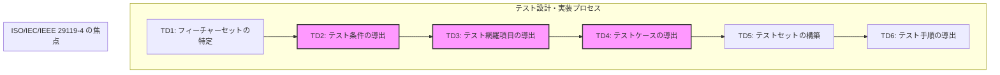

このプロセスにおける活動のうち、ISO/IEC/IEEE 29119-4 は、記述される各技法について以下の活動を詳細に実装する方法に関するガイダンスを提供します。

— テスト条件の導出 (TD2)
— テスト網羅項目の導出 (TD3)
— テストケースの導出 (TD4)

**テスト条件 (test condition)** とは、テストの基礎として特定された、機能、トランザクション、フィーチャー、品質特性、構造要素など、テスト可能なテストアイテムの側面です。この決定は、どの属性をテストするかについてステークホルダーと合意すること、または 1 つ以上のテスト設計技法を適用することによって達成されます。

例 2： 状態遷移テストのテスト終了基準としてすべての状態の網羅が特定された場合、テスト条件はテストアイテムが取り得る各状態となります。テスト条件の他の例としては、同値クラスやそれらの間の境界があげられます。

**テスト網羅項目 (test coverage items)** とは、テスト中に網羅できる各テスト条件の属性です。1 つのテスト条件が、1 つ以上のテスト網羅項目の基礎となる場合があります。

例 3： 特定の境界がテスト条件として特定された場合、対応するテスト網羅項目は、境界そのもの、および境界の直前・直後の値となります。

**テストケース (test case)** とは、テストアイテムの網羅された部分が正しく実装されているかどうかを判断するために開発された、事前条件、入力（該当する場合はアクションを含む）、および期待結果のセットです。

ISO/IEC/IEEE 29119-2 のテスト設計・実装プロセスにおける他の活動（活動 TD1（フィーチャーセットの特定）、TD5（テストセットの構築）、TD6（テスト手順の導出）を含む）を実装する方法に関する特定の（規定の）ガイダンスは、プロセスがすべての技法で共通であるため、本規格の箇条 5 または 6 には含まれていません。

ISO/IEC TR 19759 (SWEBOK) は、機能要件と品質要件の 2 種類の要件を定義しています。ISO/IEC 25010 は、特定のテストアイテムのテストに適用可能なテストの種類を特定するために使用できる 8 つの品質特性（機能性を含む）を定義しています。附属書 A は、ISO/IEC 25010 で定義された品質特性のテストに適用されるテスト設計技法のマッピング例を提供します。

探索的テストなどの経験ベースのテストプラクティスや、モデルベーステストなどの他のテストプラクティスは、本規格がテストケースを設計するための技法のみを記述しているため、ISO/IEC/IEEE 29119-4 では定義されていません。探索的テストなどのテストプラクティスは、ISO/IEC/IEEE 29119-1 で記述されています。

テストプロセス中に作成されるテスト文書のテンプレートと例は、ISO/IEC/IEEE 29119-3 テスト文書で定義されています。ISO/IEC/IEEE 29119-4 のテスト技法は、テストケースをどのように文書化すべきかについては記述していません（例：一意識別子の割り当て、テストケースの説明、優先順位、トレーサビリティ、または事前条件に関する情報やガイダンスは含まれていません）。テストケースの文書化方法に関する情報は、ISO/IEC/IEEE 29119-3 で見つけることができます。

本規格は、あらゆる組織においてソフトウェアテストのためのテストケースを設計する能力をステークホルダーに提供することを目指しています。

---

## 1 適用範囲 (Scope) {#Chapter_1}

*(ビジュアル参照: [ISO_IEC_IEEE_29119-4-FDIS_page-0012.jpg](file:///c:/dev/Antigravity/ATRS%20%E5%A4%96%E9%83%A8%E8%A8%AD%E8%A8%88%E6%9B%B8%20Markdown%E5%8C%96/00_Source_Materials/ISO-IEC-IEEE-29119-4-FDIS/ISO-IEC-IEEE-29119-4-FDIS/ISO-IEC-IEEE-29119-4-FDIS_page-0012.jpg))*

ISO/IEC/IEEE 29119-4 は、ISO/IEC/IEEE 29119-2 で定義されたテスト設計・実装プロセス中に使用できるテスト設計技法を定義します。

本文書は、テスター、テストマネージャー、開発者、特にソフトウェアテストの管理および実施に責任を持つ人々を対象としていますが、これらに限定されません。

---

## 2 適合性 (Conformance) {#Chapter_2}

*(ビジュアル参照: [ISO_IEC_IEEE_29119-4-FDIS_page-0012.jpg](file:///c:/dev/Antigravity/ATRS%20%E5%A4%96%E9%83%A8%E8%A8%AD%E8%A8%88%E6%9B%B8%20Markdown%E5%8C%96/00_Source_Materials/ISO-IEC-IEEE-29119-4-FDIS/ISO-IEC-IEEE-29119-4-FDIS/ISO-IEC-IEEE-29119-4-FDIS_page-0012.jpg))*

### 2.1 意図された使用法 {#Section_2.1}

ISO/IEC/IEEE 29119-4 における規定の要求事項は、箇条 5 および 6 に含まれています。特定のプロジェクトや組織が、本規格で定義されたすべての技法を使用する必要はない場合があることが認識されています。したがって、本規格の実装には通常、プロジェクトまたは組織に適した技法のセットを選択することが含まれます。組織または個人が本規格の規定に適合していることを主張する方法は 2 つあります。全面的適合 (full conformance) またはテーラリング適合 (tailored conformance) です。組織または個人は、本規格に対して全面的適合またはテーラリング適合のどちらを主張するかを言明しなければなりません。

### 2.2 全面的適合 {#Section_2.2}

全面的適合は、箇条 5 において選択された（空ではない）技法のセット、および／または箇条 6 における対応するテスト網羅率測定アプローチのすべての要求事項（つまり「〜しなければならない(shall)」という記述）が満たされていることを実証することによって達成されます。

例： 組織は、境界値分析など 1 つの技法のみに適合することを選択できます。このシナリオでは、組織は ISO/IEC/IEEE 29119-4 への適合を主張するために、その 1 つの技法の要求事項を満たした証拠を提供するだけで済みます。

### 2.3 テーラリング適合 {#Section_2.3}

テーラリング適合は、選択された（空ではない）技法のセット、および／または対応するテスト網羅率測定アプローチから選択された要求事項のサブセットが満たされていることを実証することによって達成されます。テーラリング（調整）が行われる場合、箇条 5 で定義された技法または箇条 6 で定義された尺度の規定の要求事項に完全に従わない場合は常に、根拠を提供（直接記述、または参照によって記述）しなければなりません。すべてのテーラリングの決定は、適用されるリスクの考慮事項を含むその根拠とともに記録されなければなりません。テーラリングは、関連するステークホルダーによって合意されなければなりません。

---

## 3 引用規格 (Normative References) {#Chapter_3}

*(ビジュアル参照: [ISO_IEC_IEEE_29119-4-FDIS_page-0012.jpg](file:///c:/dev/Antigravity/ATRS%20%E5%A4%96%E9%83%A8%E8%A8%AD%E8%A8%88%E6%9B%B8%20Markdown%E5%8C%96/00_Source_Materials/ISO-IEC-IEEE-29119-4-FDIS/ISO-IEC-IEEE-29119-4-FDIS/ISO-IEC-IEEE-29119-4-FDIS_page-0012.jpg))*

以下の文書は、その全部または一部が本文書において引用されており、本文書の適用に不可欠です。発行年が明記されている引用規格は、記載の年版のみを適用します。発行年が明記されていない引用規格は、その最新版（追補を含む）を適用します。

- **ISO/IEC/IEEE 29119-1**, ソフトウェア及びシステム工学 — ソフトウェアテスト — 第1部：概念及び用語定義 (Part 1: Concepts and Definitions)
- **ISO/IEC/IEEE 29119-2**, ソフトウェア及びシステム工学 — ソフトウェアテスト — 第2部：テストプロセス (Part 2: Test Processes)
- **ISO/IEC/IEEE 29119-3**, ソフトウェア及びシステム工学 — ソフトウェアテスト — 第3部：テスト文書 (Part 3: Test Documentation)

---

## 4 用語及び定義 (Terms and Definitions) {#Chapter_4}

*(ビジュアル参照: [ISO_IEC_IEEE_29119-4-FDIS_page-0013.jpg](file:///c:/dev/Antigravity/ATRS%20%E5%A4%96%E9%83%A8%E8%A8%AD%E8%A8%88%E6%9B%B8%20Markdown%E5%8C%96/00_Source_Materials/ISO-IEC-IEEE-29119-4-FDIS/ISO-IEC-IEEE-29119-4-FDIS/ISO-IEC-IEEE-29119-4-FDIS_page-0013.jpg))*

本文書の目的のために、ISO/IEC/IEEE 24765 ソフトウェア及びシステム工学 — 用語（Vocabulary）で提供される用語、および以下を適用します。

注記： ISO/IEC/IEEE 29119-4 における用語の使用は参照を容易にするためのものであり、規格への適合のために必須ではありません。以下の用語及び定義は、ISO/IEC/IEEE 29119-4 の理解と読みやすさを支援するために提供されています。ISO/IEC/IEEE 29119-4 の理解に不可欠な用語のみが含まれています。本箇条は、テスト用語の完全なリストを提供することを目的としたものではありません。本箇条で定義されていない用語については、システム及びソフトウェア工学用語集 ISO/IEC/IEEE 24765 を参照できます。

### 4.1 バッカス・ナウア記法 (Backus-Naur Form) {#Section_4.1}
言語の構文をテキスト形式で定義するために使用される形式的なメタ言語。

### 4.2 基本選択 (base choice) {#Section_4.2}
基本値（4.3）を参照。

### 4.3 基本値 (base value) {#Section_4.3}
「基本選択テスト」で使用される入力パラメータ値であり、通常、そのパラメータの代表的または典型的な値であることに基づいて選択される。基本選択とも呼ばれる。

### 4.4 C-use (c-use) {#Section_4.4}
計算データ使用（4.5）を参照。

### 4.5 計算データ使用 (computation data use) {#Section_4.5}
任意の形式のステートメントにおける変数値の使用。

### 4.6 条件 (condition) {#Section_4.6}
論理演算子を含まないブール式。
例： 「A < B」は条件であるが、「A and B」は条件ではない。

### 4.7 制御フロー (control flow) {#Section_4.7}
テストアイテムの実行中に操作が実行される順序。

### 4.8 制御フローサブパス (control flow sub-path) {#Section_4.8}
テストアイテム内の一連の実行可能ステートメント。

### 4.9 データ定義 (data definition) {#Section_4.9}
変数に値が割り当てられるステートメント。変数定義とも呼ばれる。

### 4.10 データ定義 C-use ペア (data definition c-use pair) {#Section_4.10}
データ定義と、その後の計算データ使用のペアであり、データ使用がデータ定義で定義された値を使用するもの。

### 4.11 データ定義 P-use ペア (data definition p-use pair) {#Section_4.11}
データ定義と、その後の述語データ使用のペアであり、データ使用がデータ定義で定義された値を使用するもの。

### 4.12 データ定義使用ペア (data definition-use pair) {#Section_4.12}
データ定義と、その後のデータ使用のペアであり、データ使用がデータ定義で定義された値を使用するもの。

### 4.13 データ使用 (data use) {#Section_4.13}
変数の値がアクセスされる実行可能ステートメント。

### 4.14 決定の結果 (decision outcome) {#Section_4.14}
判定の結果（したがって、取られる制御フローの代替経路を決定するもの）。

### 4.15 決定ルール (decision rule) {#Section_4.15}
決定表テストおよび要因効果グラフにおいて特定の結末をもたらす、条件（「原因」とも呼ばれる）とアクション（「結果」とも呼ばれる）の組み合わせ。

### 4.16 定義使用ペア (definition-use pair) {#Section_4.16}
データ定義と、その後の述語データ使用または計算データ使用のペアであり、データ使用がデータ定義で定義された値を使用するもの。

### 4.17 定義使用パス (definition-use path) {#Section_4.17}
変数定義から、その変数の述語使用（p-use）または計算使用（c-use）までの制御フローサブパス。

### 4.18 入口点 (entry point) {#Section_4.18}
テストアイテムの実行を開始できるテストアイテム内の点。
注記 1： 入口点はテストアイテム内の実行可能ステートメントであり、テストアイテムを通過する 1 つ以上のパスの開始点として外部プロセスによって選択される場合がある。最も一般的には、テストアイテム内の最初の実行可能ステートメントである。

### 4.19 実行可能ステートメント (executable statement) {#Section_4.19}
コンパイルされた際にオブジェクトコードに翻訳されるステートメントであり、テストアイテムの実行時に手続き的に実行され、プログラムデータに対してアクションを実行する場合がある。

### 4.20 出口点 (exit point) {#Section_4.20}
テストアイテム内の最後の実行可能ステートメント。
注記 1： 出口点はテストアイテムを通過するパスの終点であり、テストアイテムを終了させるか、または外部プロセスに制御を戻すテストアイテム内の実行可能ステートメントである。最も一般的には、テストアイテム内の最後の実行可能ステートメントである。

### 4.21 P-use (p-use) {#Section_4.21}
述語データ使用（4.25）を参照。

### 4.22 P-V ペア (P-V pair) {#Section_4.22}
テストアイテムのパラメータとそのパラメータに割り当てられた値の組み合わせであり、組合せテスト設計技法においてテスト条件および網羅項目として使用される。

### 4.23 パス (path) {#Section_4.23}
テストアイテムの一連の実行可能ステートメント。

### 4.24 述語 (predicate) {#Section_4.24}
真 (TRUE) または 偽 (FALSE) と評価される論理式であり、通常、コード内の実行パスを方向付けるために使用される。

### 4.25 述語データ使用 (predicate data use) {#Section_4.25}
決定ステートメントの述語部分の決定の結果に関連付けられたデータ使用。

### 4.26 サブパス (sub-path) {#Section_4.26}
より大きなパスの一部であるパス。

### 4.27 テストモデル (test model) {#Section_4.27}
テストケース設計プロセス中に使用されるテストアイテムの表現。

### 4.28 変数定義 (variable definition) {#Section_4.28}
データ定義（4.9）を参照。

---

## 5 テスト設計技法 (Test Design Techniques) {#Chapter_5}

*(ビジュアル参照: [ISO_IEC_IEEE_29119-4-FDIS_page-0015.jpg](file:///c:/dev/Antigravity/ATRS%20%E5%A4%96%E9%83%A8%E8%A8%AD%E8%A8%88%E6%9B%B8%20Markdown%E5%8C%96/00_Source_Materials/ISO-IEC-IEEE-29119-4-FDIS/ISO-IEC-IEEE-29119-4-FDIS/ISO-IEC-IEEE-29119-4-FDIS_page-0015.jpg))*

### 5.1 概要 {#Section_5.1}

ISO/IEC/IEEE 29119-4 は、仕様ベースのテスト設計技法（箇条 5.2）、構造ベースのテスト設計技法（箇条 5.3）、および経験ベースのテスト設計技法（箇条 5.4）を定義します。仕様ベースのテストでは、テストの基礎（例：要件、仕様書、モデル、またはユーザのニーズ）が、テストケースを設計するための情報の主なソースとして使用されます。構造ベースのテストでは、テストアイテムの構造（例：ソースコードやモデルの構造）が、テストケースを設計するための情報の主要なソースとして使用されます。経験ベースのテストでは、テスターの知識と経験が、テストケース設計時の情報の主要なソースとして使用されます。仕様ベース、構造ベース、および経験ベースのすべてのテストにおいて、テストの基礎は期待結果を生成するために使用されます。これらのテスト設計技法の分類は互いに補完的であり、それらを組み合わせて適用することで、通常、より効果的なテストが可能になります。

ISO/IEC/IEEE 29119-4 で提示される技法は、構造ベース、仕様ベース、または経験ベースとして分類されていますが、実際にはそれらの一部を入れ替えて使用することができます（例：インターネットベースのシステムのグラフィカルユーザインターフェースを通過する論理的なパスをテストするために、分岐テストを使用してテストケースを設計できます）。これは附属書 E で示されています。さらに、各技法は他のすべての技法から独立して定義されていますが、実際には、他の技法と組み合わせて使用できます。

例： 同値分割法を適用して導出されたテスト網羅項目を使用して、シナリオテストを使用して導出されたテストケースの入力パラメータを埋めることができます。

ISO/IEC/IEEE 29119-4 では、仕様ベースのテスト (specification-based testing) および構造ベースのテスト (structure-based testing) という用語を使用しています。これらの技法のカテゴリは、それぞれ「ブラックボックステスト」および「ホワイトボックステスト」（または「クリアボックステスト」）としても知られています。「ブラックボックス」および「ホワイトボックス」という用語は、テストアイテムの内部構造の可視性を指します。ブラックボックステストでは、テストアイテムの内部構造は見えません（したがってブラックボックス）。一方、ホワイトボックステストでは、テストアイテムの内部構造が見えます。テストアイテムの仕様と構造の両方の知識を組み合わせて利用しながら技法を適用する場合、これは「グレーボックステスト」と呼ばれることがよくあります。

ISO/IEC/IEEE 29119-4 は、ISO/IEC/IEEE 29119-2 の汎用的なテスト設計・実装プロセスのステップである TD2（テスト条件の導出）、TD3（テスト網羅項目の導出）、および TD4（テストケースの導出）を各技法がどのように使用しなければならないかを定義します（導入を参照）。各技法があらゆる状況でどのように使用されるべきかを記述した、状況固有の定義は提供しません。ISO/IEC/IEEE 29119-4 のユーザは、技法を適用する方法を示す詳細な例について、附属書 B、附属書 C、附属書 D、および附属書 E を参照できます。

ISO/IEC/IEEE 29119-4 で定義されている技法を、以下の図 2 に示します。これらの技法のセットは網羅的なものではありません。ISO/IEC/IEEE 29119-4 には含まれていない、テストの実務家や研究者によって使用されている技法も存在します。

#### 図 2 — ISO/IEC/IEEE 29119-4 で提示されるテスト設計技法のセット {#Figure_2}

*(ビジュアル参照: [ISO_IEC_IEEE_29119-4-FDIS_page-0017.jpg](file:///c:/dev/Antigravity/ATRS%20%E5%A4%96%E9%83%A8%E8%A8%AD%E8%A8%88%E6%9B%B8%20Markdown%E5%8C%96/00_Source_Materials/ISO-IEC-IEEE-29119-4-FDIS/ISO-IEC-IEEE-29119-4-FDIS/ISO-IEC-IEEE-29119-4-FDIS_page-0017.jpg))*

```mermaid
graph TD
    Root["ISO/IEC/IEEE 29119-4 で提示される<br/>テスト設計技法のセット"] --> Spec["仕様ベース技法<br/>(箇条 5.2)"]
    Root --> Struct["構造ベース技法<br/>(箇条 5.3)"]
    Root --> Exp["経験ベース技法<br/>(箇条 5.4)"]

    subgraph Specification_Based [仕様ベース]
        Spec --> EP["同値分割法<br/>(箇条 5.2.1)"]
        Spec --> CTM["分類ツリー法<br/>(箇条 5.2.2)"]
        Spec --> BVA["境界値分析法<br/>(箇条 5.2.3)"]
        Spec --> Syn["構文テスト<br/>(箇条 5.2.4)"]
        Spec --> Comb["組合せテスト設計技法<br/>(箇条 5.2.5)"]
        
        Comb --> AllComb["全組合せテスト<br/>(箇条 5.2.5.3)"]
        Comb --> PW["ペアワイズテスト<br/>(箇条 5.2.5.4)"]
        Comb --> EC["各個選択テスト<br/>(箇条 5.2.5.5)"]
        Comb --> BC["基本選択テスト<br/>(箇条 5.2.5.6)"]

        Spec --> DT["決定表テスト<br/>(箇条 5.2.6)"]
        Spec --> CEG["要因効果グラフ<br/>(箇条 5.2.7)"]
        Spec --> STT["状態遷移テスト<br/>(箇条 5.2.8)"]
        Spec --> Sce["シナリオテスト<br/>(箇条 5.2.9)"]
        Spec --> Ran["ランダムテスト<br/>(箇条 5.2.10)"]
    end

    subgraph Structure_Based [構造ベース]
        Struct --> Stat["文テスト<br/>(箇条 5.3.1)"]
        Struct --> Br["分岐テスト<br/>(箇条 5.3.2)"]
        Struct --> Dec["決定テスト<br/>(箇条 5.3.3)"]
        Struct --> BrC["分岐条件テスト<br/>(箇条 5.3.4)"]
        Struct --> BrCC["分岐条件組合せテスト<br/>(箇条 5.3.5)"]
        Struct --> MCDC["改良条件判定網羅 (MC/DC) テスト<br/>(箇条 5.3.6)"]
        Struct --> DF["データフローテスト<br/>(箇条 5.3.7)"]

        DF --> AllDef["全定義テスト<br/>(箇条 5.3.7.2)"]
        DF --> AllC["全 C-use テスト<br/>(箇条 5.3.7.3)"]
        DF --> AllP["全 P-use テスト<br/>(箇条 5.3.7.4)"]
        DF --> AllU["全使用テスト<br/>(箇条 5.3.7.5)"]
        DF --> AllDU["全 DU パステスト<br/>(箇条 5.3.7.6)"]
    end

    subgraph Experience_Based [経験ベース]
        Exp --> EG["エラー推測法<br/>(箇条 5.4.1)"]
    end

    style Root fill:#f9f,stroke:#333,stroke-width:2px
    style Spec fill:#bbf,stroke:#333,stroke-width:2px
    style Struct fill:#bbf,stroke:#333,stroke-width:2px
    style Exp fill:#bbf,stroke:#333,stroke-width:2px
```

テスト設計・実装プロセスの 6 つの活動のうち（図 1 を参照）、テスト設計技法は、テスト条件の導出 (TD2)、テスト網羅項目の導出 (TD3)、およびテストケースの導出 (TD4) について、固有かつ具体的なガイダンスを提供します。したがって、各技法はこれら 3 つの活動の観点から定義されます。

ステップ TD2（テスト条件の導出）、TD3（テスト網羅項目の導出）、および TD4（テストケースの導出）の中には、さまざまな粒度のレベルがあります。各技法の定義内において、「モデル (model)」という用語は、ステップ TD2 においてテスト条件を導出することを目的として、テストアイテムの論理的表現を準備するという概念を記述するために使用されます（例：すべての構造ベース技法についてテスト条件を導出するためには、制御フローモデルが必要です）。状況によってはモデル全体がテスト条件となる場合もあれば、他の状況ではモデルの一部がテスト条件となる場合もあります。

例 1： 状態遷移テストにおいて、すべての状態を網羅するという要求事項がある場合、状態モデル全体がテスト条件になります。あるいは、状態間の特定の遷移を網羅するという要求事項がある場合には、各遷移がテスト条件になります。

さらに、一部の技法は基礎となる概念を共有しているため、それらの定義には同様のテキストが含まれています。

例 2： 同値分割法と境界値分析法の両方は、同値クラスに基づいています。

各技法のテストケース設計ステップ (TD4) において作成されるテストケースは、「有効（valid）」である場合（つまり、テストアイテムが正しいものとして受け入れるべき入力値を含む場合）と、「無効（invalid）」である場合（つまり、テストアイテムが不適切なものとして拒否すべき入力値を少なくとも 1 つ含み、理想的には適切なエラーメッセージを伴う場合）があります。同値分割法や境界値分析法などの一部の技法では、無効なテストケースは通常「1対1 (one-to-one)」アプローチを使用して導出されます。これは、各テストケースに無効な入力値を 1 つだけ含めるようにすることで故障のマスク（遮蔽）を回避するためです。一方、有効なテストケースは通常「最小化 (minimized)」アプローチを使用して導出されます。これにより、有効なテスト網羅項目を網羅するために必要なテストケースの数が削減されます（5.2.1.3 および 5.2.3.3 を参照）。

注記： 無効なケースは「ネガティブテストケース (negative test cases)」としても知られています。

ISO/IEC/IEEE 29119-4 で定義されている技法は、それぞれ別個の箇条で記述されていますが（あたかも互いに排他的であるかのように）、実際にはそれらを混合した形式で適用できます。

例 3： 境界値分析法を使用してテスト入力値を選択し、その後、ペアワイズテストを使用してそのテスト入力値からテストケースを設計できます。同値分割法を使用して分類ツリー法の分類とクラスを選択し、次に各個選択テストを使用してそれらのクラスからテストケースを構築できます。

ISO/IEC/IEEE 29119-4 で提示される技法は、附属書 A で提示されるテスト種別（テストタイプ）と併せて使用することもできます。例えば、同値分割法を使用して、ユーザビリティテスト中にテストされるテストケースから、ユーザグループ（テスト条件）およびそのグループの代表的なユーザ（テスト網羅項目）を特定できます。

技法の規定の定義は、箇条 5 で提供されます。各技法に対応する規定の網羅尺度（測定法）は、箇条 6 で提示されます。これは、附属書 B、C、D、および E の各技法の情報提供用の例によって補完されます。各技法の例は技法の手動での適用を示していますが、実際には、テストの一部の設計および実行をサポートするために自動化を使用できます（例：構造ベーステストをサポートするために、文網羅率アナライザを使用できます）。附属書 A は、本規格で定義されたテスト設計技法を、ISO/IEC 25010 で定義された品質特性のテストにどのように適用できるかの例を提供します。

### 5.2.1 同値分割法 (Equivalence Partitioning) {#Section_5.2.1}

*(ビジュアル参照: [ISO_IEC_IEEE_29119-4-FDIS_page-0019.jpg](file:///c:/dev/Antigravity/ATRS%20%E5%A4%96%E9%83%A8%E8%A8%AD%E8%A8%88%E6%9B%B8%20Markdown%E5%8C%96/00_Source_Materials/ISO-IEC-IEEE-29119-4-FDIS/ISO-IEC-IEEE-29119-4-FDIS/ISO-IEC-IEEE-29119-4-FDIS_page-0019.jpg))*

#### 5.2.1.1 テスト条件の導出 (TD2) {#Section_5.2.1.1}

同値分割法 (BS 7925-2:1998; Myers 1979) は、テストアイテムの入力と出力を同値パーティション（「パーティション」または「同値クラス」とも呼ばれる）に分割するテストアイテムのモデルを使用します。各同値パーティションはテスト条件として定義されなければなりません。これらの同値パーティションはテストの基礎から導出されなければなりません。ここで、各パーティションは、その同値パーティション内のすべての値が、テストアイテムによって同様に扱われる（つまり「同等」であると見なせる）と合理的に期待できるように選択されます。同値パーティションは、有効な入力・出力と無効な入力・出力の両方について導出できます。

例： 小文字のアルファベットを入力として期待する（有効な）テストアイテムの場合、導出可能な無効な入力同値パーティションには、テストにおいて要求される厳密さのレベルに応じて、整数、実数、大文字のアルファベット、記号、および制御文字を含む同値パーティションが含まれます。

注記 1： 出力同値パーティションの場合、テストアイテムの仕様に記述された処理に基づいて、対応する入力パーティションが導出されます。その後、入力パーティションからテスト入力が選択されます。

注記 2： 無効な出力同値パーティションは、通常、明示的に規定されていない任意の出力に対応します。これらは規定されていないため、それらの特定は個々のテスターの主観に基づく同値パーティションになることがよくあります。この主観的な形式のテスト設計は、エラー推測法のような経験ベースの技法を適用する際にも発生する場合があります。

注記 3： ドメイン分析 (Beizer 1995) は、同値分割法と境界値分析法の組み合わせとして分類されることがよくあります。

#### 5.2.1.2 テスト網羅項目の導出 (TD3) {#Section_5.2.1.2}

各同値パーティションは、テスト網羅項目として特定されなければなりません（つまり、同値分割法の場合、テスト条件とテスト網羅項目は同じ同値パーティションになります）。

#### 5.2.1.3 テストケースの導出 (TD4) {#Section_5.2.1.3}

テスト網羅項目（つまり同値パーティション）を実行するために、テストケースが導出されなければなりません。テストケースの導出時には、以下のステップを使用しなければなりません。

1.  テストケースによって実行されるテスト網羅項目の組み合わせを選択するためのアプローチを決定します。一般的な 2 つのアプローチは以下の通りです (BS 7925-2:1998; Myers 1979)。
    a. **1対1 (one-to-one)**： 各テストケースが、特定の同値パーティションを網羅するように導出されます。
    b. **最小化 (minimized)**： テストケースによって同値パーティションが網羅され、導出される最小限のテストケース数ですべての同値パーティションを少なくとも 1 回網羅するようにします。

注記： テストケースによって実行されるテスト網羅項目の組み合わせを選択するための他のアプローチについては、箇条 5.2.5（組合せテスト設計技法）で記述されています。

2.  ステップ 1 で選択したアプローチに基づいて、現在のテストケースに含めるテスト網羅項目を選択します。
3.  テストケースによって網羅されるテスト網羅項目を実行するための入力値、およびテストケースに必要とされる他の入力変数に対する任意の有効な値を特定します。
4.  入力をテストの基礎に適用することによって、テストケースの期待結果を決定します。
5.  必要なテスト網羅レベルが達成されるまで、ステップ 2 から 4 を繰り返します。

### 5.2.2 分類ツリー法 (Classification Tree Method) {#Section_5.2.2}

*(ビジュアル参照: [ISO_IEC_IEEE_29119-4-FDIS_page-0020.jpg](file:///c:/dev/Antigravity/ATRS%20%E5%A4%96%E9%83%A8%E8%A8%AD%E8%A8%88%E6%9B%B8%20Markdown%E5%8C%96/00_Source_Materials/ISO-IEC-IEEE-29119-4-FDIS/ISO-IEC-IEEE-29119-4-FDIS/ISO-IEC-IEEE-29119-4-FDIS_page-0020.jpg))*

#### 5.2.2.1 テスト条件の導出 (TD2) {#Section_5.2.2.1}

分類ツリー法 (Grochtmann and Grimm 1993) は、テストアイテムの入力を分割し、それを分類ツリーと呼ばれるツリー形式でグラフィカルに表現するテストアイテムのモデルを使用します。テストアイテムの入力は「分類 (classifications)」に分割されます。各分類は、互いに排他的な（重なりのない）「クラス (classes)」のセットと、多くの場合サブクラスで構成され、分類のセットは完全です（モデル化されるテストアイテムのドメインに関連するすべての入力のすべての分類が特定され、含まれています）。各分類はテスト条件でなければなりません。分類を分解した結果得られる「クラス」は、テストにおいて要求される厳密さのレベルに応じて、さらに「サブクラス」に分割される場合があります。要求されるテスト網羅率のレベルに応じて、有効な入力データと無効な入力データの両方について分類とクラスを導出できます。分類、クラス、およびサブクラスの間の階層関係はツリーとしてモデル化されます。このツリーでは、テストアイテムの入力ドメインがルートノードとして、分類がブランチノードとして、クラスまたはサブクラスがリーフノードとして配置されます。

注記： 分類ツリー法における分割のプロセスは、同値分割法と似ています。主な違いは、分類ツリー法では分割（分類およびクラス）が完全に排他的でなければならないのに対し、同値分割法では技法の適用方法によってそれらが重なる可能性がある点です。さらに、分類ツリー法には分類ツリーの設計も含まれており、これによりテスト条件が視覚的に表現されます。

#### 5.2.2.2 テスト網羅項目の導出 (TD3) {#Section_5.2.2.2}

選択された組み合わせアプローチを使用してクラスを組み合わせることにより、テスト網羅項目が導出されなければなりません。

例： クラスをテスト網羅項目に組み合わせるための 2 つの例示的なアプローチは以下の通りです。
— **最小化 (minimized)**： 最小限のテスト網羅項目数ですべてのクラスを少なくとも 1 回網羅するように、テスト網羅項目にクラスを含めます。
— **最大化 (maximized)**： クラスの可能な各組み合わせが少なくとも 1 つのテスト網羅項目によって網羅されるように、テスト網羅項目にクラスを含めます。

注記 1： テスト網羅項目の組み合わせを選択するための他のアプローチは、箇条 5.2.5（組合せテスト設計技法）で記述されています。
注記 2： テスト網羅項目は、組み合せ表（箇条 B.2.2.5 の図 8 を参照）で示されることが多いです。
注記 3： 分類ツリー法の最初の出版物 (Grochtmann and Grimm 1993) では、“minimized” および “maximized” の代わりに “minimal” および “maximal” という用語が使用されていました。

#### 5.2.2.3 テストケースの導出 (TD4) {#Section_5.2.2.3}

テスト網羅項目を実行するために、テストケースが導出されなければなりません。テストケースの導出時には、以下のステップに従わなければなりません。

1.  ステップ TD3 で作成されたクラスの組み合わせに基づいて、まだテストケースによって網羅されていない組み合わせを 1 つ選択し、現在のテストケースに含めます。
2.  まだ値が割り当てられていないクラスについて、入力値を特定します。
3.  入力をテストの基礎に適用することによって、テストケースの期待結果を決定します。
4.  必要なテスト網羅レベルが達成されるまで、ステップ 1 から 3 を繰り返します。

### 5.2.3 境界値分析法 (Boundary Value Analysis) {#Section_5.2.3}

*(ビジュアル参照: [ISO_IEC_IEEE_29119-4-FDIS_page-0021.jpg](file:///c:/dev/Antigravity/ATRS%20%E5%A4%96%E9%83%A8%E8%A8%AD%E8%A8%88%E6%9B%B8%20Markdown%E5%8C%96/00_Source_Materials/ISO-IEC-IEEE-29119-4-FDIS/ISO-IEC-IEEE-29119-4-FDIS/ISO-IEC-IEEE-29119-4-FDIS_page-0021.jpg))*

#### 5.2.3.1 テスト条件の導出 (TD2) {#Section_5.2.3.1}

境界値分析法 (BS 7925-2:1998; Myers 1979) は、テストアイテムの入力と出力を、識別可能な境界を持つ多数の順序付けられたセットおよびサブセット（パーティションおよびサブパーティション）に分割するテストアイテムのモデルを使用します。各境界はテスト条件です。境界はテストの基礎から導出されなければなりません。

例： 1 から 10（両端を含む）の整数として定義されたパーティションの場合、2 つの境界があります。下限境界が 1、上限境界が 10 であり、これらがテスト条件となります。

注記： 出力境界の場合、テストアイテムの仕様に記述された処理に基づいて、対応する入力パーティションが導出されます。その後、入力パーティションからテスト入力が選択されます。

#### 5.2.3.2 テスト網羅項目の導出 (TD3) {#Section_5.2.3.2}

テスト網羅項目の導出のために、以下の 2 つのオプションのいずれかが適用されなければなりません。
— 2値境界テスト (two-value boundary testing)
— 3値境界テスト (three-value boundary testing)

2値境界テストの場合、各境界（テスト条件）に対して、境界上の値と、同値パーティションの外側への増分距離にある値に対応する 2 つのテスト網羅項目が導出されなければなりません。この増分距離は、検討対象のデータ型における最小有効値として定義されなければなりません。

3値境界テストの場合、各境界（テスト条件）に対して、境界上の値と、同値パーティションの境界の両側への増分距離にある値に対応する 3 つのテスト網羅項目が導出されなければなりません。この増分距離は、検討対象のデータ型における最小有効値として定義されなければなりません。

注記 1： パーティションによっては、テストの基礎において単一の境界しか特定されない場合があります。例えば、数値パーティション「年齢 70 歳以上」には下限境界はありますが、明らかな上限境界はありません。場合によっては、入力フィールドによって受け入れられる最大値など、実際のソースコードの実装によって課せられる境界値を境界値として使用できます（そのような決定は文書化されるべきです。例えば、テスト仕様書など）。

注記 2： 2値境界テストはほとんどの状況で十分ですが、状況によっては 3値境界テストが必要になる場合があります（例えば、テスターと開発者の両方がテストアイテムにおける変数の境界を決定する際にミスを犯していないか確認するための厳密なテストなど）。

注記 3： 2値および 3値境界テストの両方において、隣接するパーティション（境界を共有するパーティション）は重複したテスト網羅項目を生じさせますが、その場合、それらの重複した値を 1 回だけ実行するのが典型的な慣行です。重複する境界の例については、箇条 B.2.3.4.3 を参照してください。

#### 5.2.3.3 テストケースの導出 (TD4) {#Section_5.2.3.3}

テスト網羅項目を実行するために、テストケースが導出されなければなりません。テストケースの導出時には、以下のステップを使用しなければなりません。

1.  テストケースによって実行されるテスト網羅項目の組み合わせを選択するためのアプローチを決定します。一般的な 2 つのアプローチは以下の通りです (BS 7925-2:1998; Myers 1979)。
    a. **1対1 (one-to-one)**： 各テストケースが、特定の境界値を実行するように導出されます。
    b. **最小化 (minimized)**： 各テストケースに境界値が含まれ、導出される最小限のテストケース数ですべての境界値を少なくとも 1 回網羅するようにします。

注記 1： 最小化された境界値分析では、各テストケースで複数のテスト網羅項目を網羅できます。
注記 2： テストケースによって実行されるテスト網羅項目の組み合わせを選択するための他のアプローチについては、箇条 5.2.5（組合せテスト設計技法）で記述されています。

2.  ステップ 1 で選択したアプローチに基づいて、現在のテストケースに含めるテスト網羅項目を選択します。
3.  ステップ 2 でまだ選択されていない、テストケースに必要とされる他の入力変数に対して、任意の有効な値を特定します。
4.  入力をテストの基礎に適用することによって、テストケースの期待結果を決定します。
5.  必要なテスト網羅レベルが達成されるまで、ステップ 2 から 4 を繰り返します。

### 5.2.4 構文テスト (Syntax Testing) {#Section_5.2.4}

*(ビジュアル参照: [ISO_IEC_IEEE_29119-4-FDIS_page-0022.jpg](file:///c:/dev/Antigravity/ATRS%20%E5%A4%96%E9%83%A8%E8%A8%AD%E8%A8%88%E6%9B%B8%20Markdown%E5%8C%96/00_Source_Materials/ISO-IEC-IEEE-29119-4-FDIS/ISO-IEC-IEEE-29119-4-FDIS/ISO-IEC-IEEE-29119-4-FDIS_page-0022.jpg))*

#### 5.2.4.1 テスト条件の導出 (TD2) {#Section_5.2.4.1}

構文テスト (Beizer 1995; Burnstein 2003) は、テスト設計の基礎としてテストアイテムへの入力の形式的なモデルを使用します。この構文モデルは多数の規則として表現されます。各規則は、入力パラメータの形式を、構文内の要素の「一連の順序 (sequences of)」、「繰り返し (iterations of)」、または「〜の間の選択 (selections between)」として定義します。構文は、テキストまたは図の形式で作成可能です。構文テストにおけるテスト条件は、テストアイテムへの入力の全体的または部分的なモデルでなければなりません。

例 1： バッカス・ナウア記法は、テストアイテムの構文をテキスト形式で定義するために使用できる形式的なメタ言語です。
例 2： 抽象構文ツリーを使用して、形式的な構文を図で表現できます。

#### 5.2.4.2 テスト網羅項目の導出 (TD3) {#Section_5.2.4.2}

構文テストにおいて、テスト網羅項目は以下の 2 つの目的（ゴール）に基づいて導出されます。1つは有効な構文を様々な方法で網羅するようにテスト網羅項目を導出するポジティブテスト、もう1つは構文の規則を意図的に違反させるようにテスト網羅項目を導出するネガティブテストです。ポジティブテストのためのテスト網羅項目は、定義された構文の「オプション (options)」でなければなりません。一方、ネガティブテストのためのテスト網羅項目は、定義された構文の「ミューテーション (mutations)」でなければなりません。

「オプション」を導出するために、以下のガイドラインを使用できます（ただし、適切な場合には代替のガイドラインを使用しても構いません）。
— 構文によって「選択」が義務付けられている場合は常に、その選択に対して提供されている各代替案について「オプション」が導出されます。
例 1： 入力パラメータ「色 = 青 | 赤 | 緑」（ここで | は論理演算子 OR を表す）の場合、「青」、「赤」、「緑」の 3 つのオプションがテスト網羅項目として導出されます。
— 構文によって「繰り返し」が義務付けられている場合は常に、その繰り返しに対して少なくとも 2 つの「オプション」が導出されます。1 つは最小反復回数であり、もう 1 つは最小反復回数より多い回数です。
例 2： 入力パラメータ「文字 = [A – Z | a – z]+」（ここで + は「1回以上」を表す）の場合、「文字1つ」と「複数の文字」の 2 つのオプションがテスト網羅項目として導出されます。
— 最大反復回数を伴う繰り返しが構文によって義務付けられている場合は常に、その繰り返しに対して少なくとも 2 つの「オプション」が導出されます。1 つは最大反復回数であり、もう 1 つは最大反復回数より多い回数です。
例 3： 入力パラメータ「文字 = [A – Z | a – z]100」（ここで 100 は、文字を最大 100 回まで選択できることを表す）の場合、「100文字」と「100文字より多い」の 2 つのオプションがテスト網羅項目として導出されます。

「ミューテーション」を導出するために、以下のガイドラインを使用できます（ただし、適切な場合には代替のガイドラインを使用しても構いません）。
— 任意の入力に対して、定義された構文を「ミューテーション（変化）」させて無効な入力（「ミューテーション」）を導出できます。
例 4： 入力パラメータ「色 = 青 | 赤 | 緑」の場合、1 つの「ミューテーション」として、入力パラメータリストに現れない「黄色」という値を選択することを、テスト網羅項目として導入できます。他のミューテーションの例については、附属書 B の箇条 B.2.4.5 で提供されています。

#### 5.2.4.3 テストケースの導出 (TD4) {#Section_5.2.4.3}

構文テストのテストケースは、選択されたオプションとミューテーションを網羅するように導出されなければなりません。テストケースの導出時には、以下のステップを使用しなければなりません。

1.  テストケースによって実行されるテスト網羅項目の組み合わせを選択するためのアプローチを決定します。一般的な 2 つのアプローチは以下の通りです。
    a. **1対1 (one-to-one)**： 各テストケースが、特定のオプション、繰り返し、および／またはミューテーションを実行するように導出されます。
    b. **最小化 (minimized)**： オプション、繰り返し、および／またはミューテーションをテストケースに含め、導出される最小限のテストケース数ですべてを少なくとも 1 回網羅するようにします。

注記： テストケースによって実行されるテスト網羅項目の組み合わせを選択するための他のアプローチについては、箇条 5.2.5（組合せテスト設計技法）で記述されています。

2.  現在のテストケースに含めるテスト網羅項目を選択します。
3.  テストケースによって網羅されるテスト網羅項目を実行するための入力値、およびテストケースに必要とされる他の入力変数に対する任意の有効な値を特定します。
4.  入力をテストの基礎に適用することによって、テストケースの期待結果を決定します。
5.  導出されたすべてのオプション、繰り返し、および／またはミューテーションが実行されるまで、ステップ 2 から 4 を繰り返します。

### 5.2.5 組合せテスト設計技法 (Combinatorial Test Design Techniques) {#Section_5.2.5}

*(ビジュアル参照: [ISO_IEC_IEEE_29119-4-FDIS_page-0023.jpg](file:///c:/dev/Antigravity/ATRS%20%E5%A4%96%E9%83%A8%E8%A8%AD%E8%A8%88%E6%9B%B8%20Markdown%E5%8C%96/00_Source_Materials/ISO-IEC-IEEE-29119-4-FDIS/ISO-IEC-IEEE-29119-4-FDIS/ISO-IEC-IEEE-29119-4-FDIS_page-0023.jpg))*

#### 5.2.5.1 概要 {#Section_5.2.5.1}

組合せテスト設計技法は、テスト中に導出し得るテスト条件およびテスト網羅項目を網羅する、意味のある管理可能なテストケースのサブセットを体系的に導出するために使用されます。対象となる組み合わせは、テストアイテムのパラメータと、それらのパラメータが取り得る値の観点から定義されます。多数のパラメータ（それぞれ多数の不連続な値を持つ）が相互作用しなければならない場合、この技法を使用することで、機能網羅を損なうことなく、必要とされるテストケースの数を大幅に削減できます。

#### 5.2.5.2 テスト条件の導出 (TD2) {#Section_5.2.5.2}

テストアイテムのパラメータは、テストに関連するテストアイテムの特定の側面を表します。多くの場合、テストアイテムへの入力パラメータに対応しますが、他の側面を使用することもできます。
例 1： コンフィギュレーション（構成）テストでは、パラメータとして、オペレーティングシステムやブラウザなどの様々な環境要因を使用できます。

各テストアイテムのパラメータは、様々な値（バリュー）を取ることができます。この技法で使用するために、値のセットは有限で管理可能なものである必要があります。一部のテストアイテムパラメータは、本質的に少数の可能な値に制限されている場合がありますが、他のテストアイテムパラメータは制限がはるかに少ない場合があります。
例 2： 本質的に少数の値に制限されているテストアイテムパラメータは、7 つの特定の値「[月曜日 | 火曜日 | 水曜日 | 木曜日 | 金曜日 | 土曜日 | 日曜日]」のみを取ることができる「曜日」パラメータです。
例 3： 制限がはるかに少ないテストアイテムパラメータは、潜在的に無限の数直線上に存在する任意の実数で構成されるパラメータです。

制約のないテストアイテムパラメータについては、パラメータの膨大な値のセットを管理可能なサブセットに削減するために、まず同値分割法や境界値分析法などの他のテスト設計技法を適用する必要がある場合があります。

組合せテストのテスト条件は、すべての組合せテスト設計技法で共通です。各テスト条件は、特定の値 (V) を取る選択されたテストアイテムパラメータ (P) であり、結果として **P-V ペア** となります。

#### 5.2.5.3 全組合せテスト (All Combinations Testing) {#Section_5.2.5.3}

##### 5.2.5.3.1 テスト網羅項目の導出 (TD3) {#Section_5.2.5.3.1}

「全組合せ」テスト (Grindal, Offutt and Andler 2005) において、テスト網羅項目は、すべてのパラメータが少なくとも 1 回はセットに含まれるような、P-V ペアのすべてのユニークな（一意な）組み合わせのセットのメンバーでなければなりません。

##### 5.2.5.3.2 テストケースの導出 (TD4) {#Section_5.2.5.3.2}

各テストケースが P-V ペアのユニークな組み合わせを 1 つ実行するテストケースが導出されなければなりません。テストケースの導出時には、以下のステップを使用しなければなりません。

1.  現在のテストケースに含めるテスト網羅項目のうち、まだテストケースによって網羅されていないものを選択します。
2.  入力をテストの基礎に適用することによって、テストケースの期待結果を決定します。
3.  必要なテスト網羅レベルが達成されるまで、ステップ 1 と 2 を繰り返します。

注記： 100% の全組合せテスト網羅を達成するために必要な最小限のテストケース数は、各テストアイテムパラメータ의 P-V ペアの数の積に対応します。

#### 5.2.5.4 ペアワイズテスト (Pair-wise Testing) {#Section_5.2.5.4}

##### 5.2.5.4.1 テスト網羅項目の導出 (TD3) {#Section_5.2.5.4.1}

ペアワイズテスト (Grindal, Offutt and Andler 2005) において、テスト網羅項目は P-V ペアのユニークなペア（一対）でなければなりません。ここで、ペア内の各 P-V ペアは異なるテストアイテムパラメータに対するものです。（全組合せテストで必要とされた）パラメータのすべての可能な組み合わせの代わりに、この技法ではセット全体の内の選択された値のすべての可能なペア（二要素の組み合わせ）を網羅します。これにより、より少ないテストケースでテストアイテムを効率的に実行できます。ペアワイズテストは「全ペア (all pairs)」テストとしても知られています。

##### 5.2.5.4.2 テストケースの導出 (TD4) {#Section_5.2.5.4.2}

まず P-V ペアを特定した上で、P-V ペアのペア（二つ組）を実行するためのテストケースを導出しなければなりません。ここで、各テストケースは 1 つ以上のユニークなペアを実行します。テストケースの導出時には、以下のステップを使用しなければなりません。

1.  現在のテストケースに含めるテスト網羅項目を選択します。ここで、P-V ペアの各ペアは、まだテストケースに含まれていないパラメータ値の異なるペアを網羅するものでなければなりません。
2.  テストケースに存在する他のパラメータに対して、任意の有効な値を特定します。
3.  入力をテストの基礎に適用することによって、テストケースの期待結果を決定します。
4.  P-V ペアのすべてのユニークなペアが実行されるまで、ステップ 1 から 3 を繰り返します。

100% のペアワイズテストを達成するために必要な最小限のテストケース数を計算することは容易ではありません。最適に近いセットを許容できるものと見なし、以下の 3 つのオプションのいずれかを使用して計算できます。
— アルゴリズムを使用して、最適に近いセットを手動で決定する。
— 自動化ツール（アルゴリズムを実装したもの）を使用して、最適に近いセットを決定する。
— 直交表 (Mandl 1985) を使用して、最適に近いセットを決定する。

#### 5.2.5.5 各個選択テスト (Each Choice Testing) {#Section_5.2.5.5}

##### 5.2.5.5.1 テスト網羅項目の導出 (TD3) {#Section_5.2.5.5.1}

各個選択（または 1-wise）テスト (Grindal, Offutt and Andler 2005) において、テスト網羅項目は、各パラメータ値がセットに少なくとも 1 回含まれるような P-V ペアのセットのメンバーでなければなりません。

##### 5.2.5.5.2 テストケースの導出 (TD4) {#Section_5.2.5.5.2}

P-V ペアを実行するためのテストケースが導出されなければなりません。ここで各テストケースは、以前のテストケースに含まれていなかった 1 つ以上の P-V ペアを実行します。テストケースの導出時には、以下のステップを使用しなければなりません。

1.  現在のテストケースに含めるテスト網羅項目を選択します。ここでは、少なくとも 1 つの選択されたテスト網羅項目が、以前のテストケースに含まれていないものでなければなりません。
2.  テストケースに存在する他のパラメータに対して、任意の有効な値を特定します。
3.  入力をテストの基礎に適用することによって、テストケースの期待結果を決定します。
4.  必要なテスト網羅レベルが達成されるまで、ステップ 1 から 3 を繰り返します。

注記： 100% の各個選択テストを達成するために必要な最小限のテストケース数は、テストアイテムパラメータのいずれかが取り得る値の最大数に対応します。

#### 5.2.5.6 基本選択テスト (Base Choice Testing) {#Section_5.2.5.6}

##### 5.2.5.6.1 テスト網羅項目の導出 (TD3) {#Section_5.2.5.6.1}

基本選択テスト (Grindal, Offutt and Andler 2005) において、テスト網羅項目は、各入力パラメータに対する P-V ペアのセットでなければなりません。ここで、1 つ以外のすべてのパラメータが「基本 (base)」値に設定され、残りの 1 つのパラメータには基本値以外の有効な値のいずれかが設定されます。

注記： 各パラメータの基本値を選択するためのアプローチはいくつかあります。例えば、運用プロファイル（実運用を想定したモデル）、シナリオテストにおける典型的なパス、同値分割法で導出されたテスト網羅項目、またはパラメータのデフォルト（最も頻繁に使用される）値から選択できます。

##### 5.2.5.6.2 テストケースの導出 (TD4) {#Section_5.2.5.6.2}

まず P-V ペアを特定した上で、各パラメータの基本選択を選択しなければなりません。1 つを除くすべてのパラメータを基本選択に設定し、残りの 1 つのパラメータを有効な値に設定することを、必要なテスト網羅レベルが達成されるまで繰り返すことで、テストケースが導出されなければなりません。テストケースの導出時には、以下のステップを使用しなければなりません。

1.  各パラメータをその「基本」値に設定して、基本選択テストケースを導出します。
2.  残りのパラメータセットを基本選択の値に維持したまま、1 つのパラメータを有効な（基本選択以外の）値に設定して、新しいテストケースを作成します。
3.  入力をテストの基礎に適用することによって、新しいテストケースの期待結果を決定します。
4.  必要なテスト網羅レベルが達成されるまで、ステップ 2 と 3 を繰り返します。

---

### 5.2.6 決定表テスト (Decision Table Testing) {#Section_5.2.6}

*(ビジュアル参照: [ISO_IEC_IEEE_29119-4-FDIS_page-0025.jpg](file:///c:/dev/Antigravity/ATRS%20%E5%A4%96%E9%83%A8%E8%A8%AD%E8%A8%88%E6%9B%B8%20Markdown%E5%8C%96/00_Source_Materials/ISO-IEC-IEEE-29119-4-FDIS/ISO-IEC-IEEE-29119-4-FDIS/ISO-IEC-IEEE-29119-4-FDIS_page-0025.jpg))*

#### 5.2.6.1 テスト条件の導出 (TD2) {#Section_5.2.6.1}

決定表テスト (BS 7925-2:1998; Myers 1979) は、テストアイテムの定義された条件 (causes: 要因) と動作 (effects: 結果) の間の論理的関係（決定規則）を表す、決定表の形式によるモデルを使用します。ここで：
— 各ブール値（真偽値）の条件は、テストアイテムに対する一対の入力同値パーティションを定義します。一方は「真 (true)」のケースに対応し、もう一方は「偽 (false)」のケースに対応します。
— 各動作は、テストアイテムの期待結果または複数の結果の組み合わせであり、ブール値として表現されます。
— 決定規則のセットは、条件と動作の間に必要とされる関係を定義します。

テスト条件は、条件および動作でなければなりません。

注記： 条件が単純なブール値ではなく複数の値で構成される場合、これは「拡張エントリ」決定表となり、そのテストは同値分割法によって処理できます。

#### 5.2.6.2 テスト網羅項目の導出 (TD3) {#Section_5.2.6.2}

決定表テストにおいて、テストアイテムの条件と動作のユニークな組み合わせを定義する各決定規則が、テスト網羅項目となります。

#### 5.2.6.3 テストケースの導出 (TD4) {#Section_5.2.6.3}

決定規則（テスト網羅項目）を実行するために、テストケースが導出されなければなりません。ここで、各テストケースは入力と出力の間の関係を定義し、各決定規則はブール値条件のユニークな組み合わせに対応します。テストケースの導出時には、以下のステップを使用しなければなりません。

1.  テストケースとして実装するために、決定表からテスト網羅項目を選択します。
2.  網羅対象の決定規則の入力条件を満たす入力値、およびテストケースの実行に必要とされる他の入力変数に対する任意の有効な値を特定します。
3.  入力を決定表に適用することによって、テストケースの期待結果を決定します。
4.  必要なテスト網羅レベルが達成されるまで、ステップ 1 から 3 を繰り返します。

注記： 決定表に従属する入力条件が含まれている場合、実行不可能な組み合わせ（例：「18歳未満」と「65歳より上」の両方が真に設定される）が生じる可能性があります。このような状況では、その実行不可能な決定規則を特定して文書化し、テストケースの導出には使用しません。

### 5.2.7 要因効果グラフ (Cause-Effect Graphing) {#Section_5.2.7}

*(ビジュアル参照: [ISO_IEC_IEEE_29119-4-FDIS_page-0026.jpg](file:///c:/dev/Antigravity/ATRS%20%E5%A4%96%E9%83%A8%E8%A8%AD%E8%A8%88%E6%9B%B8%20Markdown%E5%8C%96/00_Source_Materials/ISO-IEC-IEEE-29119-4-FDIS/ISO-IEC-IEEE-29119-4-FDIS/ISO-IEC-IEEE-29119-4-FDIS_page-0026.jpg))*

#### 5.2.7.1 テスト条件の導出 (TD2) {#Section_5.2.7.1}

要因効果グラフ (BS 7925-2:1998; Myers 1979; Nursimulu and Probert 1995) は、テストアイテムの要因（例：入力）と結果（例：出力）の間の論理的関係（決定規則）を表す、要因効果グラフの形式によるモデルを使用します。ここで：
— 各ブール値の要因は、テストアイテムに対する一対の入力同値パーティションを定義します。一方は「真」のケースに対応し、もう一方は「偽」のケースに対応します。
— 各結果は、テストアイテムの期待出力条件または出力条件の組み合わせであり、ブール値として表現されます。

テスト条件は、要因および結果でなければなりません。

要因効果グラフは、要因と結果の間の論理的関係を、ブール演算子によって重み付けされたブール論理ネットワークとしてモデル化します。また、オプションとして、要因間の関係や結果間の関係に対する構文的・意味的な制約をモデル化できます（附属書 B.2.7.4 の図 14 および図 15 を参照）。

#### 5.2.7.2 テスト網羅項目の導出 (TD3) {#Section_5.2.7.2}

要因効果グラフにおいて、テストアイテムの要因と結果のユニークな組み合わせを定義する各決定規則が、テスト網羅項目となります。

#### 5.2.7.3 テストケースの導出 (TD4) {#Section_5.2.7.3}

テスト網羅項目を実行するために、テストケースが導出されなければなりません。要因効果グラフから対応する決定表を作成し、それをテストケースの導出に使用できます。テストケースの導出時には、以下のステップを使用しなければなりません。

1.  現在のテストケースで実装するテスト網羅項目を選択します。
2.  テストケースによって網羅されるテスト網羅項目を実行するための入力値、およびテストケースの実行に必要とされる他の入力変数に対する任意の有効な値を特定します。
3.  入力を要因効果グラフおよび／または決定表に適用することによって、テストケースの期待結果を決定します。
4.  必要なテスト網羅レベルが達成されるまで、ステップ 1 から 3 を繰り返します。

### 5.2.8 状態遷移テスト (State Transition Testing) {#Section_5.2.8}

*(ビジュアル参照: [ISO_IEC_IEEE_29119-4-FDIS_page-0027.jpg](file:///c:/dev/Antigravity/ATRS%20%E5%A4%96%E9%83%A8%E8%A8%AD%E8%A8%88%E6%9B%B8%20Markdown%E5%8C%96/00_Source_Materials/ISO-IEC-IEEE-29119-4-FDIS/ISO-IEC-IEEE-29119-4-FDIS/ISO-IEC-IEEE-29119-4-FDIS_page-0027.jpg))*

#### 5.2.8.1 テスト条件の導出 (TD2) {#Section_5.2.8.1}

状態遷移テスト (BS 7925-2:1998; Copeland 2004) は、テストアイテムが取り得る状態、状態間の遷移、遷移を引き起こすイベント、および遷移の結果として生じる可能性のある動作のモデルを使用します。モデルの状態は、不連続で、識別可能で、かつ有限数でなければなりません。個々の遷移は、イベントガード（イベント発生時に遷移が起こるために真でなければならない条件セットを定義するもの）によって制約を受ける場合があります。状態遷移テストにおいて、テスト条件は、テストにおける網羅要求事項に応じて、状態モデルのすべての状態、すべての遷移、または状態モデル全体となります。モデルは、状態遷移図または状態表として表現できます（ただし、他の表現方法も使用可能です）。

#### 5.2.8.2 テスト網羅項目の導出 (TD3) {#Section_5.2.8.2}

状態遷移テストにおいて、テスト網羅項目は、選択されたテスト完了基準およびテスト設計アプローチに応じて変化します。可能なテスト完了基準には、以下が含まれますが、これらに限定されません。
— **状態 (states)**： 状態モデル内のすべての状態を「訪問」できるように、テスト網羅項目が導出されなければなりません。
— **単一遷移 (single transitions: 0-switch網羅)**： 状態モデル内の有効な単一の遷移を網羅するように、テスト網羅項目が導出されなければなりません。
— **全遷移 (all transitions)**： 状態モデル内の有効な遷移と、「無効な」遷移（状態モデル内で有効な遷移が指定されていないイベントによって開始される、状態からの遷移）の両方を網羅するように、テスト網羅項目が導出されなければなりません。
— **複数遷移 (multiple transitions: N-switch網羅)**： 状態モデル内の N+1 個の遷移の有効なシーケンスを網羅するように、テスト網羅項目が導出されなければなりません。

注記： 「1-switch」網羅は、遷移のペアを実行することを要求する、「N-switch」網羅の一般的なバリエーションです。

#### 5.2.8.3 テストケースの導出 (TD4) {#Section_5.2.8.3}

状態遷移テストのテストケースは、テスト網羅項目を実行するように導出されなければなりません。テストケースの導出時には、以下のステップを使用しなければなりません。

1.  現在のテストケースに含めるテスト網羅項目を選択します。
2.  テストケースによって網羅されるテスト網羅項目を実行するための入力値を特定します。
3.  入力をテストの基礎に適用することによって、テストケースの期待結果を決定します（期待結果は、出力、および状態モデルに記述された訪問状態の観点から定義できます）。
4.  必要なテスト網羅レベルが達成されるまで、ステップ 1 から 3 を繰り返します。

### 5.2.9 シナリオテスト (Scenario Testing) {#Section_5.2.9}

*(ビジュアル参照: [ISO_IEC_IEEE_29119-4-FDIS_page-0028.jpg](file:///c:/dev/Antigravity/ATRS%20%E5%A4%96%E9%83%A8%E8%A8%AD%E8%A8%88%E6%9B%B8%20Markdown%E5%8C%96/00_Source_Materials/ISO-IEC-IEEE-29119-4-FDIS/ISO-IEC-IEEE-29119-4-FDIS/ISO-IEC-IEEE-29119-4-FDIS_page-0028.jpg))*

#### 5.2.9.1 テスト条件の導出 (TD2) {#Section_5.2.9.1}

シナリオテスト (Desikan and Ramesh 2007) は、テストアイテムを含む利用フローをテストすることを目的として、テストアイテムと他のシステム（この文脈ではユーザも他のシステムと見なされることが多い）との間の相互作用のシーケンスのモデルを使用します。テスト条件は、相互作用の 1 つのシーケンス（すなわち 1 つのシナリオ）、または相互作用のすべてのシーケンス（すなわちすべてのシナリオ）のいずれかでなければなりません。

シナリオテストにおいて、このステップでは以下の特定を含めなければなりません。
— **「メイン」シナリオ**： テストアイテムに期待される典型的な一連の動作、または典型的な一連の動作が不明な場合は任意の選択。
— **「代替」シナリオ**： テストアイテムを通過する可能性のある、代替の（メインではない）シナリオ。

注記 1： 代替シナリオには、異常な使用、極端な条件または負荷条件、および例外が含まれます。
注記 2： シナリオテストは、通常、システムテストや受け入れテストなどの機能テスト中に「エンドツーエンドのテスト」を実施するために使用されます。

シナリオテストの一般的な形式の 1 つに、**ユースケーステスト (use case testing)** (Bath 2008; Hass 2008) があります。これは、テストアイテムを含む相互作用のシーケンス（すなわちシナリオ）をテストすることを目的として、テストアイテムが 1 つ以上のアクターとどのように相互作用するかを記述した、テストアイテムのユースケースモデルを利用します。

注記 3： ユースケーステストにおいて、ユースケースモデルは、アクターからの様々なトリガーの結果としてのテストアイテムによって様々な動作がどのように実行されるかを記述するタイプのものでなければなりません。アクターは、ユーザまたは他のシステムのいずれかです。
注記 4： トランザクションフローテスト (Beizer 1995) は、シナリオテストの一種として分類されることが多いです。

#### 5.2.9.2 テスト網羅項目の導出 (TD3) {#Section_5.2.9.2}

テスト網羅項目は、メインおよび代替のシナリオでなければなりません（つまり、テスト網羅項目はテスト条件と同じです）。したがって、この技法ではこのステップにおいて追加のアクションは不要です。

#### 5.2.9.3 テストケースの導出 (TD4) {#Section_5.2.9.3}

シナリオテストのテストケースは、各シナリオ（テスト網羅項目）を少なくとも 1 つのテストケースで網羅することによって導出されなければなりません。テストケースの導出時には、以下のステップを使用しなければなりません。

1.  現在のテストケースで実行するテスト網羅項目を選択します。
2.  テストケースによって網羅されるテスト網羅項目を実行するための入力値を特定します。
3.  入力をテストの基礎に適用することによって、テストケースの期待結果を決定します。
4.  必要なテスト網羅レベルが達成されるまで、ステップ 1 から 3 を繰り返します。

### 5.2.10 ランダムテスト (Random Testing) {#Section_5.2.10}

*(ビジュアル参照: [ISO_IEC_IEEE_29119-4-FDIS_page-0029.jpg](file:///c:/dev/Antigravity/ATRS%20%E5%A4%96%E9%83%A8%E8%A8%AD%E8%A8%88%E6%9B%B8%20Markdown%E5%8C%96/00_Source_Materials/ISO-IEC-IEEE-29119-4-FDIS/ISO-IEC-IEEE-29119-4-FDIS/ISO-IEC-IEEE-29119-4-FDIS_page-0029.jpg))*

#### 5.2.10.1 テスト条件の導出 (TD2) {#Section_5.2.10.1}

ランダムテスト (BS 7925-2:1998; Craig and Jaskiel 2002; Kaner 1988) は、すべての可能な入力値のセットを定義する、テストアイテムの入力ドメインのモデルを使用します。ランダムな入力値を生成するための入力分布を選択しなければなりません。ランダムテストにおいて、入力ドメイン全体がテスト条件となります。

例： 入力分布のタイプには、正規分布、一様分布、および運用プロファイルが含まります。

#### 5.2.10.2 テスト網羅項目の導出 (TD3) {#Section_5.2.10.2}

ランダムテストにおいて、公認されているテスト網羅項目はありません。

#### 5.2.10.3 テストケースの導出 (TD4) {#Section_5.2.10.3}

ランダムテストにおけるテストケースは、選択された入力分布に従って、テストアイテムの入力ドメインから入力値をランダムに（ツールを使用する場合は疑似ランダムに）選択することによって選ばれなければなりません。テストケースの導出時には、以下のステップを使用しなければなりません。

1.  テスト入力の選択のための入力分布を選択します。
2.  ステップ 1 で選択した入力分布に基づいて、テスト入力のためのランダムな値を生成します。
3.  入力をテストの基礎に適用することによって、テストケースの期待結果を決定します。
4.  ステップ 2 と 3 を、必要なテストが完了するまで繰り返します。

注記 1： 必要なテストは、実行されたテストの数、テストに費やされた時間、または他の完了基準の観点から定義できます。
注記 2： ステップ 2 は通常自動化されます。

---

## 5.3 構造ベースのテスト設計技法 (Structure-Based Test Design Techniques) {#Section_5.3}

*(ビジュアル参照: [ISO_IEC_IEEE_29119-4-FDIS_page-0030.jpg](file:///c:/dev/Antigravity/ATRS%20%E5%A4%96%E9%83%A8%E8%A8%AD%E8%A8%88%E6%9B%B8%20Markdown%E5%8C%96/00_Source_Materials/ISO-IEC-IEEE-29119-4-FDIS/ISO-IEC-IEEE-29119-4-FDIS/ISO-IEC-IEEE-29119-4-FDIS_page-0030.jpg))*

### 5.3.1 文テスト (Statement Testing) {#Section_5.3.1}

#### 5.3.1.1 テスト条件の導出 (TD2) {#Section_5.3.1.1}

テストアイテム内の実行可能な文を特定する制御フローモデルが、導出されなければなりません (BS 7925-2:1998; Myers 1979)。制御フローモデル内の各実行可能な文が、テスト条件となります。

#### 5.3.1.2 テスト網羅項目の導出 (TD3) {#Section_5.3.1.2}

制御フローモデル内の各実行可能な文が、テスト網羅項目となります（つまり、テスト網羅項目はテスト条件と同じです）。したがって、この技法ではこのステップにおいて追加のアクションは不要です。

#### 5.3.1.3 テストケースの導出 (TD4) {#Section_5.3.1.3}

テストケースの導出時には、以下のステップに従わなければなりません。

1.  テスト中にまだ実行されていない 1 つ以上の実行可能な文に到達する、制御フローのサブパスを特定します。
2.  特定された制御フローのサブパスを実行させるテスト入力を決定します。
3.  テスト入力をテストの基礎に適用することによって、制御フローのサブパスの実行による期待結果を決定します。
4.  必要なテスト網羅レベルが達成されるまで、ステップ 1 から 3 を繰り返します。

注記： テストアイテム内に実行可能な文がない場合でも、単一のテスト条件、テスト網羅項目、およびテストケースが依然として必要です。

### 5.3.2 分岐テスト (Branch Testing) {#Section_5.3.2}

*(ビジュアル参照: [ISO_IEC_IEEE_29119-4-FDIS_page-0030.jpg](file:///c:/dev/Antigravity/ATRS%20%E5%A4%96%E9%83%A8%E8%A8%AD%E8%A8%88%E6%9B%B8%20Markdown%E5%8C%96/00_Source_Materials/ISO-IEC-IEEE-29119-4-FDIS/ISO-IEC-IEEE-29119-4-FDIS/ISO-IEC-IEEE-29119-4-FDIS_page-0030.jpg))*

#### 5.3.2.1 テスト条件の導出 (TD2) {#Section_5.3.2.1}

テストアイテムの制御フローにおける分岐を特定する制御フローモデルが、導出されなければなりません (BS 7925-2:1998; 4.7.1)。制御フローモデル内の各分岐が、テスト条件となります。

分岐とは、以下のいずれかです。
— 制御フローモデル内の任意のノードから他の任意のノードへの、制御の条件付き転送。
— 制御フローモデル内の任意のノードから他の任意のノードへの、明示的な無条件の制御転送。
— テストアイテムに複数の入口点がある場合、テストアイテムの入口点への制御の転送。

注記 1： すべての分岐の 100% を網羅する完全な分岐テストでは、制御フローグラフ内のすべての弧（リンクまたはエッジ）をテストする必要があります。これには、入口点と出口点の間にあり、判定を含まない連続した文も含まれます。
注記 2： 分岐テストでは、必要とされるテスト網羅レベルに応じて、テストアイテムへの入口点や出口点を含む、条件付き分岐と無条件分岐の両方のテストが必要になる場合があります。
注記 3： 分岐テストにおいて、関数やメソッドの呼び出しは、個別のテスト条件としては特定されません。

#### 5.3.2.2 テスト網羅項目の導出 (TD3) {#Section_5.3.2.2}

制御フローモデル内の各分岐が、テスト網羅項目となります（つまり、テスト網羅項目はテスト条件と同じです）。したがって、この技法ではこのステップにおいて追加のアクションは不要です。

#### 5.3.2.3 テストケースの導出 (TD4) {#Section_5.3.2.3}

テストケースの導出時には、以下のステップに従わなければなりません。

1.  テスト中にまだ実行されていない 1 つ以上のテスト網羅項目に到達する、制御フローのサブパスを特定します。
2.  特定された制御フローのサブパスを実行させるテスト入力を決定します。
3.  テスト入力をテストの基礎に適用することによって、制御フローのサブパスの実行による期待結果を決定します。
4.  必要なテスト網羅レベルが達成されるまで、ステップ 1 から 3 を繰り返します。

注記 1： テストアイテム内に分岐がない場合でも、単一のテスト条件、テスト網羅項目、およびテストケースが依然として必要です。
注記 2： テストアイテムに複数の入口点がある場合、各入口点を網羅するために十分なテストケースが必要になります。

### 5.3.3 決定テスト (Decision Testing) {#Section_5.3.3}

*(ビジュアル参照: [ISO_IEC_IEEE_29119-4-FDIS_page-0031.jpg](file:///c:/dev/Antigravity/ATRS%20%E5%A4%96%E9%83%A8%E8%A8%AD%E8%A8%88%E6%9B%B8%20Markdown%E5%8C%96/00_Source_Materials/ISO-IEC-IEEE-29119-4-FDIS/ISO-IEC-IEEE-29119-4-FDIS/ISO-IEC-IEEE-29119-4-FDIS_page-0031.jpg))*

#### 5.3.3.1 テスト条件の導出 (TD2) {#Section_5.3.3.1}

判定（決定）を特定するテストアイテムの制御フローモデルが、導出されなければなりません。判定とは、制御フローによって 2 つ以上の可能な結果（したがってサブパス）が取られる可能性のある、テストアイテム内のポイントです (BS 7925-2:1998; Myers 1979)。典型的な判定は、単純な選択（例：ソースコード内の if-then-else）、ループをいつ抜けるかの決定（例：ソースコード内の while ループ）、および case（switch）文（例：ソースコード内の case-1-2-3-...-N）に使用されます。決定テストにおいて、制御フローモデル内の各判定が、テスト条件となります。

#### 5.3.3.2 テスト網羅項目の導出 (TD3) {#Section_5.3.3.2}

各判定からの判定結果が、テスト網羅項目として特定されなければなりません。

#### 5.3.3.3 テストケースの導出 (TD4) {#Section_5.3.3.3}

テストケースの導出時には、以下のステップに従わなければなりません。

1.  テスト中にまだ実行されていない 1 つ以上のテスト網羅項目に到達する、制御フローのサブパスを特定します。
2.  特定された制御フローのサブパスを実行させるテスト入力を決定します。
3.  テスト入力をテストの基礎に適用することによって、制御フローのサブパスの実行による期待結果を決定します。
4.  必要なテスト網羅レベルが達成されるまで、ステップ 1 から 3 を繰り返します。

注記： テストアイテム内に判定がない場合でも、単一のテスト条件、テスト網羅項目、およびテストケースが依然として必要です。

### 5.3.4 分岐条件テスト (Branch Condition Testing) {#Section_5.3.4}

*(ビジュアル参照: [ISO_IEC_IEEE_29119-4-FDIS_page-0032.jpg](file:///c:/dev/Antigravity/ATRS%20%E5%A4%96%E9%83%A8%E8%A8%AD%E8%A8%88%E6%9B%B8%20Markdown%E5%8C%96/00_Source_Materials/ISO-IEC-IEEE-29119-4-FDIS/ISO-IEC-IEEE-29119-4-FDIS/ISO-IEC-IEEE-29119-4-FDIS_page-0032.jpg))*

#### 5.3.4.1 テスト条件の導出 (TD2) {#Section_5.3.4.1}

判定、および判定内の条件を特定するテストアイテムの制御フローモデルが、導出されなければなりません。判定とは、制御フローによって 2 つ以上の可能な結果（したがってサブパス）が取られる可能性のある、テストアイテム内のポイントです (BS 7925-2:1998; Myers 1979)。典型的な判定は、単純な選択（例：ソースコード内の if-then-else）、ループをいつ抜けるかの決定（例：ソースコード内の while ループ）、および case 文（例：ソースコード内の case-1-2-3-...-N。switch 文とも呼ばれる）に使用されます。分岐条件テスト (BS 7925-2:1998) において、各判定がテスト条件でなければなりません。

例： プログラムのソースコードにおいて、判定文「if A OR B AND C then」は、論理演算子によって関連付けられた 3 つの条件を含むテスト条件です。

#### 5.3.4.2 テスト網羅項目の導出 (TD3) {#Section_5.3.4.2}

分岐条件テストにおいて、判定内の条件のすべてのブール値（真／偽）が、テスト網羅項目として特定されなければなりません。各判定からの判定結果も、テスト網羅項目として特定されなければなりません。

#### 5.3.4.3 テストケースの導出 (TD4) {#Section_5.3.4.3}

テストケースの導出時には、以下のステップに従わなければなりません。

1.  テスト中にまだ実行されていない 1 つ以上のテスト網羅項目を網羅する、制御フローのサブパスを特定します。
2.  特定された制御フローのサブパスを実行させるテスト入力を決定します。
3.  判定内の条件のブール値、および判定結果を網羅するために、ステップ 2 からテスト入力のサブセットを特定します。
4.  テスト入力をテストの基礎に適用することによって、制御フローのサブパスの実行による期待結果を決定します。
5.  必要なテスト網羅レベルが達成されるまで、ステップ 1 から 4 を繰り返します。

注記： テストアイテム内に判定がない場合でも、単一のテスト条件、テスト網羅項目、およびテストケースが依然として必要です。

### 5.3.5 分岐条件組合せテスト (Branch Condition Combination Testing) {#Section_5.3.5}

*(ビジュアル参照: [ISO_IEC_IEEE_29119-4-FDIS_page-0033.jpg](file:///c:/dev/Antigravity/ATRS%20%E5%A4%96%E9%83%A8%E8%A8%AD%E8%A8%88%E6%9B%B8%20Markdown%E5%8C%96/00_Source_Materials/ISO-IEC-IEEE-29119-4-FDIS/ISO-IEC-IEEE-29119-4-FDIS/ISO-IEC-IEEE-29119-4-FDIS_page-0033.jpg))*

#### 5.3.5.1 テスト条件の導出 (TD2) {#Section_5.3.5.1}

判定および条件を特定するテストアイテムの制御フローモデルが、導出されなければなりません。分岐条件組合せテスト (BS 7925-2:1998) において、各判定がテスト条件でなければなりません。

例： プログラムのソースコードにおいて、判定文「if A OR B AND C then」は、論理演算子によって関連付けられた 3 つの条件を含むテスト条件です。

#### 5.3.5.2 テスト網羅項目の導出 (TD3) {#Section_5.3.5.2}

各判定内における条件のブール値の、実行可能な各ユニークな組み合わせが、テスト網羅項目として特定されなければなりません (BS 7925-2:1998; Myers 1979)。これには、組み合わせが判定内の単一条件の 2 つの個別のブール結果で構成されるような、単純な判定も含まれます。

#### 5.3.5.3 テストケースの導出 (TD4) {#Section_5.3.5.3}

テストケースの導出時には、以下のステップに従わなければなりません。

1.  テスト中にまだ実行されていない 1 つ以上のテスト網羅項目に到達する、制御フローのサブパスを特定します。
2.  特定された制御フローのサブパスを実行させるテスト入力のセットを決定します。
3.  判定内における条件のブール値の、選択された組み合わせを網羅するために、ステップ 2 からテスト入力のサブセットを特定します。
4.  選択されたテスト入力をテストの基礎に適用することによって、期待結果を決定します。
5.  必要なテスト網羅レベルが達成されるまで、ステップ 1 から 4 を繰り返します。

注記： テストアイテム内に判定がない場合でも、単一のテスト条件、テスト網羅項目、およびテストケースが依然として必要です。

### 5.3.6 改良条件判定網羅 (MCDC) テスト (Modified Condition Decision Coverage (MCDC) Testing) {#Section_5.3.6}

*(ビジュアル参照: [ISO_IEC_IEEE_29119-4-FDIS_page-0033.jpg](file:///c:/dev/Antigravity/ATRS%20%E5%A4%96%E9%83%A8%E8%A8%AD%E8%A8%88%E6%9B%B8%20Markdown%E5%8C%96/00_Source_Materials/ISO-IEC-IEEE-29119-4-FDIS/ISO-IEC-IEEE-29119-4-FDIS/ISO-IEC-IEEE-29119-4-FDIS_page-0033.jpg))*

#### 5.3.6.1 テスト条件の導出 (TD2) {#Section_5.3.6.1}

判定および条件を特定するテストアイテムの制御フローモデルが、導出されなければなりません。改良条件判定網羅 (MCDC) テスト (BS 7925-2:1998) において、各判定がテスト条件でなければなりません。

例： プログラムのソースコードにおいて、判定文「if A OR B AND C then」は、論理演算子によって関連付けられた 3 つの条件を含むテスト条件です。

#### 5.3.6.2 テスト網羅項目の導出 (TD3) {#Section_5.3.6.2}

判定内における各条件の個別のブール値の各ユニークな組み合わせのうち、単一のブール条件が単独で判定の結果に影響を与えることが可能なものが、テスト網羅項目として特定されなければなりません。ある条件が単独で判定の結果に影響を与えるかどうかは、他のすべての可能な条件を固定された状態に保持したまま、その条件のみを変化させることによって示されます。

注記： これには、組み合わせが判定内の単一条件の 2 つの個別のブール結果で構成されるような、単純な判定も含まれます。

#### 5.3.6.3 テストケースの導出 (TD4) {#Section_5.3.6.3}

テストケースの導出時には、以下のステップに従わなければなりません。

1.  テスト中にまだ実行されていない 1 つ以上のテスト網羅項目に到達する、制御フローのサブパスを特定します。
2.  特定された制御フローのサブパスを実行させるテスト入力のセットを決定します。
3.  単一のブール条件が単独で結果に影響を与えることが可能な、判定内の各条件の個別のブール値の選択された組み合わせを網羅するために、ステップ 2 からテスト入力のサブセットを特定します。
4.  選択されたテスト入力をテストの基礎に適用することによって、期待結果を決定します。
5.  必要なテスト網羅レベルが達成されるまで、ステップ 1 から 4 を繰り返します。

注記： テストアイテム内に判定がない場合でも、単一のテスト条件、テスト網羅項目、およびテストケースが依然として必要です。

### 5.3.7 データフローテスト (Data Flow Testing) {#Section_5.3.7}

*(ビジュアル参照: [ISO_IEC_IEEE_29119-4-FDIS_page-0034.jpg](file:///c:/dev/Antigravity/ATRS%20%E5%A4%96%E9%83%A8%E8%A8%AD%E8%A8%88%E6%9B%B8%20Markdown%E5%8C%96/00_Source_Materials/ISO-IEC-IEEE-29119-4-FDIS/ISO-IEC-IEEE-29119-4-FDIS/ISO-IEC-IEEE-29119-4-FDIS_page-0034.jpg))*

#### 5.3.7.1 テスト条件の導出 (TD2) {#Section_5.3.7.1}

データフローテスト (Burnstein 2003) においては、テストアイテム内の制御フローのサブパスを特定するテストアイテム의 モデルが導出されなければなりません。そのサブパス内において、特定の変数の各定義 (definition) はその変数のその後の使用 (use) にリンクされており、かつその間に変数の値の再定義が行われていないものでなければなりません。

「定義 (definition)」とは、変数におそらく新しい値が与えられる場所を指します（時には定義によって、変数が以前と同じ値を保持することもあります）。「使用 (use)」とは、変数に新しい値が与えられない、変数の出現箇所です。「使用」はさらに「p-use」（predicate-use：述語使用）または「c-use」（computation-use：計算使用）のいずれかとして区別できます。p-use は、while ループや if-then-else などの判定内の条件（述語）の結果を決定する際における変数の使用を指します。c-use は、任意の変数の定義の計算または出力の計算に入力として変数が使用される場合に発生します。

データフローテストにおいて、テストアイテム内におけるある変数に対する各定義・使用ペア (definition-use pair) が、テスト条件となります。

データフローテストには多くの形式がありますが、それらはすべて同じテスト条件に基づいています。ISO/IEC/IEEE 29119-4 で定義されている 5 つの形式は、全定義テスト、全 C-use テスト、全 P-use テスト、全使用テスト、および全 DU パステストです。

#### 5.3.7.2 全定義テスト (All-Definitions Testing) {#Section_5.3.7.2}

##### 5.3.7.2.1 テスト網羅項目の導出 (TD3) {#Section_5.3.7.2.1}

各変数の定義からその定義の何らかの使用（p-use または c-use のいずれか）に至る制御フローのサブパスが、テスト網羅項目として特定されなければなりません。各サブパスは「定義・使用パス（definition-use path）」として知られています。「全定義」テストでは、すべての変数の定義について、定義からその c-use または p-use のいずれかに至る、少なくとも 1 つの定義のないサブパス（特定の変数に関連するもの）が網羅されていることが要求されます。

##### 5.3.7.2.2 テストケースの導出 (TD4) {#Section_5.3.7.2.2}

テストケースの導出時には、以下のステップに従わなければなりません。

1.  テスト中にまだ実行されていない定義を特定します。
2.  特定された定義から発生する、制御フローのサブパスを実行させるテスト入力を決定します。
3.  テスト入力をテストの基礎に適用することによって、制御フローのサブパスの実行による期待結果を決定します。
4.  必要なテスト網羅レベルが達成されるまで、ステップ 1 から 3 を繰り返します。

注記： 実際には、これらのステップには自動化が必要になる可能性があります。

#### 5.3.7.3 全 C-use テスト (All-C-Uses Testing) {#Section_5.3.7.3}

##### 5.3.7.3.1 テスト網羅項目の導出 (TD3) {#Section_5.3.7.3.1}

各変数の定義からその定義の各 c-use に至る制御フローのサブパスが、テスト網羅項目として特定されなければなりません。「全 C-use」テストでは、すべての関連する変数の定義について、定義からその各 c-use に至る、少なくとも 1 つの定義のないサブパス（特定の変数に関連するもの）が網羅されていることが要求されます。

##### 5.3.7.3.2 テストケースの導出 (TD4) {#Section_5.3.7.3.2}

テストケースの導出時には、以下のステップに従わなければなりません。

1.  変数の定義からその定義のその後の c-use に至る、テスト中にまだ実行されていない、制御フローのサブパス（間に定義がないもの）を特定します。
2.  その制御フローのサブパスを実行させるテスト入力を決定します。
3.  テスト入力をテストの基礎に適用することによって、制御フローのサブパスの実行による期待結果を決定します。
4.  必要なテスト網羅レベルが達成されるまで、ステップ 1 から 3 を繰り返します。

#### 5.3.7.4 全 P-use テスト (All-P-Uses Testing) {#Section_5.3.7.4}

##### 5.3.7.4.1 テスト網羅項目の導出 (TD3) {#Section_5.3.7.4.1}

各変数の定義からその定義の各 p-use に至る制御フローのサブパスが、テスト網羅項目として特定されなければなりません。「全 P-use」テストでは、すべての関連する変数の定義について、定義からその各 p-use に至る、少なくとも 1 つの定義のないサブパス（特定の変数に関連するもの）が網羅されていることが要求されます。

##### 5.3.7.4.2 テストケースの導出 (TD4) {#Section_5.3.7.4.2}

テストケースの導出時には、以下のステップに従わなければなりません。

1.  変数の定義からその定義のその後の p-use に至る、テスト中にまだ実行されていない、制御フローのサブパス（間に定義がないもの）を特定します。
2.  その制御フローのサブパスを実行させるテスト入力を決定します。
3.  テスト入力をテストの基礎に適用することによって、制御フローのサブパスের 実行による期待結果を決定します。
4.  必要なテスト網羅レベルが達成されるまで、ステップ 1 から 3 を繰り返します。

#### 5.3.7.5 全使用テスト (All-Uses Testing) {#Section_5.3.7.5}

##### 5.3.7.5.1 テスト網羅項目の導出 (TD3) {#Section_5.3.7.5.1}

各変数の定義からその定義のあらゆる使用（p-use および c-use の両方）に至る制御フローのサブパスが、テスト網羅項目として特定されなければなりません。「全使用」テストでは、各変数の定義から、（変数の途中の定義なしに）到達可能な、その各使用に至る少なくとも 1 つのサブパスが網羅されていることが要求されます。

##### 5.3.7.5.2 テストケースの導出 (TD4) {#Section_5.3.7.5.2}

テストケースの導出時には、以下のステップに従わなければなりません。

1.  変数の定義からその定義のその後の p-use または c-use に至る、テスト中にまだ実行されていない、制御フローのサブパスを特定します。
2.  その制御フローのサブパスを実行させるテスト入力を決定します。
3.  テスト入力をテストの基礎に適用することによって、制御フローのサブパスの実行による期待結果を決定します。
4.  必要なテスト網羅レベルが達成されるまで、ステップ 1 から 3 を繰り返します。

#### 5.3.7.6 全 DU パステスト (All-DU-Paths Testing) {#Section_5.3.7.6}

##### 5.3.7.6.1 テスト網羅項目の導出 (TD3) {#Section_5.3.7.6.1}

各変数の定義からその定義のあらゆる使用（p-use および c-use の両方）に至る制御フローのサブパスが、テスト網羅項目として特定されなければなりません。「全 DU パス」テストでは、各変数の定義から、（変数の途中の定義なしに）到達可能な、その各使用に至るすべてのサブパスが網羅されていることが要求されます。

注記： 全 DU パステストでは、100% のテストアイテム網羅の達成を試みるために、変数の定義からその使用に至るすべてのループのないサブパスをテストすることが要求されます。これは、100% のテストアイテム網羅の達成を試みるために、各変数の定義からその使用に至る 1 つのパスのみをテストすればよい「全使用」テストとは異なります。

##### 5.3.7.6.2 テストケースの導出 (TD4) {#Section_5.3.7.6.2}

テストケースの導出時には、以下のステップに従わなければなりません。

1.  変数の定義からその定義のその後のすべての p-use および c-use に至る、テスト中にまだ実行されていない、制御フローのサブパスを特定します。
2.  その制御フローのサブパスを実行させるテスト入力を決定します。
3.  テスト入力をテストの基礎に適用することによって、制御フローのサブパスの実行による期待結果を決定します。
4.  必要なテスト網羅レベルが達成されるまで、ステップ 1 から 3 を繰り返します。

## 5.4 経験ベースのテスト設計技法 (Experience-Based Test Design Techniques) {#Section_5.4}

*(ビジュアル参照: [ISO_IEC_IEEE_29119-4-FDIS_page-0036.jpg](file:///c:/dev/Antigravity/ATRS%20%E5%A4%96%E9%83%A8%E8%A8%AD%E8%A8%88%E6%9B%B8%20Markdown%E5%8C%96/00_Source_Materials/ISO-IEC-IEEE-29119-4-FDIS/ISO-IEC-IEEE-29119-4-FDIS/ISO-IEC-IEEE-29119-4-FDIS_page-0036.jpg))*

### 5.4.1 エラー推測法 (Error Guessing) {#Section_5.4.1}

#### 5.4.1.1 テスト条件の導出 (TD2) {#Section_5.4.1.1}

エラー推測法 (BS 7925-2:1998; Myers 1979) は、テストアイテムに存在する可能性のある欠陥タイプのチェックリストを設計し、それらの欠陥がテストアイテムに存在する場合に故障を引き起こす可能性のある、テストアイテムへの入力をテスターが特定できるようにするものです。各欠陥タイプが、テスト条件となります。

注記： 欠陥タイプのチェックリストは、既知のエラーのタクソノミ、インシデント管理システムに含まれる情報、テスターの知識、経験、および／またはテストアイテム（および／または同様のテストアイテム）の理解、あるいは他のステークホルダー（例：システム利用者やプログラマー）の知識など、様々な手段によって導出できます。

#### 5.4.1.2 テスト網羅項目の導出 (TD3) {#Section_5.4.1.2}

エラー推測法において、公認されているテスト網羅項目はありません。

#### 5.4.1.3 テストケースの導出 (TD4) {#Section_5.4.1.3}

エラー推測法のテストケースは、通常、網羅対象の欠陥タイプのチェックリストから欠陥タイプを選択し、その欠陥タイプがテストアイテムに存在した場合にそれを検出できるテストケースを導出することによって導出されます。テストケースの導出時には、以下のステップを使用しなければなりません。

4.  必要なテストが完了するまで、ステップ 1 から 3 を繰り返します。

---

## 6 テスト網羅率の測定 (Test Coverage Measurement) {#Chapter_6}

*(ビジュアル参照: [ISO_IEC_IEEE_29119-4-FDIS_page-0040.jpg](file:///c:/dev/Antigravity/ATRS%20%E5%A4%96%E9%83%A8%E8%A8%AD%E8%A8%88%E6%9B%B8%20Markdown%E5%8C%96/00_Source_Materials/ISO-IEC-IEEE-29119-4-FDIS/ISO-IEC-IEEE-29119-4-FDIS/ISO-IEC-IEEE-29119-4-FDIS_page-0040.jpg))*

*(ビジュアル参照: [ISO_IEC_IEEE_29119-4-FDIS_page-0037.jpg](file:///c:/dev/Antigravity/ATRS%20%E5%A4%96%E9%83%A8%E8%A8%AD%E8%A8%88%E6%9B%B8%20Markdown%E5%8C%96/00_Source_Materials/ISO-IEC-IEEE-29119-4-FDIS/ISO-IEC-IEEE-29119-4-FDIS/ISO-IEC-IEEE-29119-4-FDIS_page-0037.jpg))*

### 6.1 概要 (Overview) {#Section_6.1}

ISO/IEC/IEEE 29119-4 で定義される網羅率は、テスト設計技法によって達成可能な異なる網羅の度合いに基づいています。網羅レベルは 0% から 100% の範囲となります。各網羅率の計算において、一部のテスト網羅項目は実行不可能（infeasible）である場合があります。テスト網羅項目が、実行不可能であること、またはテストケースによって網羅することが不可能であることを示せる場合、その項目は実行不可能であると定義されます。網羅率の計算は、実行不可能な項目をカウントに含めるか、除外するかのいずれかとして定義されます。この選択は、通常、テスト計画書（ISO/IEC/IEEE 29119-3 で定義）に記録されます。テスト網羅項目が除外される場合、その実行不可能性に対する正当な理由が通常テストレポートに記録されます。各網羅率の計算において、テストアイテム内に特定のタイプのテスト網羅項目が存在しない場合、そのタイプの網羅率 100% はそのテストアイテムには適用不可能なものとして定義されます。

任意の技法の網羅率を計算する際には、以下の式を使用しなければなりません。

$網羅率 = \left( \frac{N}{T} \times 100 \right) \%$

ここで：
— **網羅率 (Coverage)**： 特定のテスト設計技法によって達成された網羅率。
— **N**： 実行されたテストケースによって網羅されたテスト網羅項目の数。
— **T**： テスト設計技法によって特定されたテスト網羅項目の総数。

各技法に対する網羅率、N、および T の具体的な値は、以下の各箇条で定義されます。以下の各箇条で示される網羅率のセットは、本規格で提示されるテスト設計技法と共に使用するように設計されています。これらは網羅的なリストであることを意図したものではなく、本箇条で言及されていない他の網羅率が組織によって使用される場合もあります。

例： テストの完了状態を評価するために必要とされる可能性のある他の指標には、テスト中に網羅された要求事項全体の割合の測定などが含まれます。

### 6.2 仕様ベースのテスト設計技法のテスト測定 (Test Measurement for Specification-Based Test Design Techniques) {#Section_6.2}

*(ビジュアル参照: [ISO_IEC_IEEE_29119-4-FDIS_page-0037.jpg](file:///c:/dev/Antigravity/ATRS%20%E5%A4%96%E9%83%A8%E8%A8%AD%E8%A8%88%E6%9B%B8%20Markdown%E5%8C%96/00_Source_Materials/ISO-IEC-IEEE-29119-4-FDIS/ISO-IEC-IEEE-29119-4-FDIS/ISO-IEC-IEEE-29119-4-FDIS_page-0037.jpg))*

#### 6.2.1 同値分割網羅 (Equivalence Partition Coverage) {#Section_6.2.1}

同値分割法の網羅率は、以下の定義を用いて計算されなければなりません。
— **網羅率**： 同値分割網羅率。
— **N**： 実行されたテストケースによって網羅されたパーティションの数。
— **T**： 特定されたパーティションの総数。

#### 6.2.2 分類ツリー法網羅 (Classification Tree Method Coverage) {#Section_6.2.2}

*(ビジュアル参照: [ISO_IEC_IEEE_29119-4-FDIS_page-0038.jpg](file:///c:/dev/Antigravity/ATRS%20%E5%A4%96%E9%83%A8%E8%A8%AD%E8%A8%88%E6%9B%B8%20Markdown%E5%8C%96/00_Source_Materials/ISO-IEC-IEEE-29119-4-FDIS/ISO-IEC-IEEE-29119-4-FDIS/ISO-IEC-IEEE-29119-4-FDIS_page-0038.jpg))*

分類ツリー法の網羅率は、以下の定義を用いて計算されなければなりません。最小組合せ網羅（minimized combination coverage）については、以下の定義を使用しなければなりません。
— **網羅率**： 分類ツリー法における最小組合せ網羅率。
— **N**： 実行されたテストケースによって網羅されたクラスの数。
— **T**： クラスの総数。

最大組合せ網羅（maximized combination coverage）については、以下の定義を使用しなければなりません。
— **網羅率**： 分類ツリー法における最大組合せ網羅率。
— **N**： 実行されたテストケースによって網羅されたクラスの組み合わせの数。
— **T**： クラスの組み合わせの総数。

#### 6.2.3 境界値分析網羅 (Boundary Value Analysis Coverage) {#Section_6.2.3}

境界値分析の網羅率は、以下の定義を用いて計算されなければなりません。
— **網羅率**： 境界値網羅率。
— **N**： 実行されたテストケースによって網羅された個別の境界値の数。
— **T**： 境界値の総数。

2 値境界テストまたは 3 値境界テストのどちらを適用したかの決定が、記録されるべきです。

#### 6.2.4 構文テスト網羅 (Syntax Testing Coverage) {#Section_6.2.4}

現在、構文テストの網羅率を計算するための業界で合意されたアプローチはありません。

注記： 構文テストでは、オプションの数が極めて多く、可能な変異（ミューテーション）が無限に存在するため、網羅率をパーセンテージとして計算することは不可能です。

#### 6.2.5 組合せテスト設計技法網羅 (Combinatorial Test Design Technique Coverage) {#Section_6.2.5}

##### 6.2.5.1 全組合せテスト網羅 (All Combinations Testing Coverage) {#Section_6.2.5.1}

全組合せテストの網羅率は、以下の定義を用いて計算されなければなりません。
— **網羅率**： 全組合せ網羅率。
— **N**： 実行されたテストケースによって網羅された P-V ペアのユニークな組み合わせの数。
— **T**： ユニークな P-V ペアの組み合わせの総数（各テストアイテムパラメータの P-V ペアの数の積）。

注記： P-V ペアの定義については、箇条 4.2.3 を参照してください。

##### 6.2.5.2 ペアワイズテスト網羅 (Pair-wise Testing Coverage) {#Section_6.2.5.2}

ペアワイズテストの網羅率は、以下の定義を用いて計算されなければなりません。
— **網羅率**： ペアワイズ網羅率。
— **N**： 実行されたテストケースによって網羅された P-V ペアのユニークなペアの数。
— **T**： ユニークな P-V ペアのペアの総数。

##### 6.2.5.3 各個選択テスト網羅 (Each Choice Testing Coverage) {#Section_6.2.5.3}

各個選択テストの網羅率は、以下の定義を用いて計算されなければなりません。
— **網羅率**： 各個選択網羅率。
— **N**： 実行されたテストケースによって網羅された P-V ペアの数。
— **T**： ユニークな P-V ペアの総数。

##### 6.2.5.4 基本選択テスト網羅 (Base Choice Testing Coverage) {#Section_6.2.5.4}

基本選択テストの網羅率は、以下の定義を用いて計算されなければなりません。
— **網羅率**： 基本選択網羅率。
— **N**： 実行されたテストケースによって網羅された基本選択の組み合わせ（1 つを除くすべてのテストアイテムパラメータが基本値に設定され、残りの 1 つのテストアイテムパラメータが有効な値に設定されたもの）の数に、すべてのテストアイテムパラメータが基本値に設定されたものが実行された場合は 1 を加えたもの。
— **T**： 基本選択の組み合わせ（1 つを除くすべてのテストアイテムパラメータが基本値に設定され、残りの 1 つのテストアイテムパラメータが有効な値に設定されたもの）の総数に 1（すべてのテストアイテムパラメータが基本値に設定されたものに対応）を加えたもの。

#### 6.2.6 決定表テスト網羅 (Decision Table Testing Coverage) {#Section_6.2.6}

決定表テストの網羅率は、以下の定義を用いて計算されなければなりません。
— **網羅率**： 決定表網羅率。
— **N**： 実行されたテストケースによって網羅された実行可能な決定規則の数。
— **T**： 実行可能な決定規則の総数。

#### 6.2.7 要因効果グラフ網羅 (Cause-Effect Graphing Coverage) {#Section_6.2.7}

要因効果グラフの網羅率は、以下の定義を用いて計算されなければなりません。
— **網羅率**： 要因／効果網羅率。
— **N**： 実行されたテストケースによって網羅された決定規則の数。
— **T**： 実行可能な決定規則の総数。

#### 6.2.8 状態遷移テスト網羅 (State Transition Testing Coverage) {#Section_6.2.8}

全状態テストの網羅率は、以下の定義を用いて計算されなければなりません。
— **網羅率**： 全状態網羅率。
— **N**： 実行されたテストケースによって網羅された状態の数。
— **T**： 状態の総数。

単一遷移（0-switch網羅）の網羅率は、以下の定義を用いて計算されなければなりません。
— **網羅率**： 0-switch網羅率。
— **N**： テストケースによって実行された単一の有効な遷移の数。
— **T**： 単一の有効な遷移の総数。

全遷移の網羅率は、以下の定義を用いて計算されなければなりません。
— **網羅率**： 全遷移網羅率。
— **N**： 実行されたテストケースによって網羅が試みられた有効な遷移および無効な遷移の数。
— **T**： 有効なイベントによって開始される、特定された状態間の有効な遷移および無効な遷移の総数。

N+1 個の遷移（N-switchテスト）の網羅率は、以下の定義を用いて計算されなければなりません。
— **網羅率**： N-switch網羅率。
— **N**： 実行されたテストケースによって網羅された N+1 個の有効な遷移の数。
— **T**： N+1 個の有効な遷移のシーケンスの総数。

#### 6.2.9 シナリオテスト網羅 (Scenario Testing Coverage) {#Section_6.2.9}

シナリオテスト（ユースケーステストを含む）の網羅率は、以下の定義を用いて計算されなければなりません。
— **網羅率**： シナリオ網羅率。
— **N**： 実行されたテストケースによって網羅されたシナリオの数。
— **T**： シナリオの総数。

#### 6.2.10 ランダムテスト網羅 (Random Testing Coverage) {#Section_6.2.10}

現在、ランダムテストの網羅率を計算するための業界で合意されたアプローチはありません。

### 6.3 構造ベースのテスト設計技法のテスト測定 (Test Measurement for Structure-Based Test Design Techniques) {#Section_6.3}

*(ビジュアル参照: [ISO_IEC_IEEE_29119-4-FDIS_page-0040.jpg](file:///c:/dev/Antigravity/ATRS%20%E5%A4%96%E9%83%A8%E8%A8%AD%E8%A8%88%E6%9B%B8%20Markdown%E5%8C%96/00_Source_Materials/ISO-IEC-IEEE-29119-4-FDIS/ISO-IEC-IEEE-29119-4-FDIS/ISO-IEC-IEEE-29119-4-FDIS_page-0040.jpg))*

#### 6.3.2 分岐テスト網羅 (Branch Testing Coverage) {#Section_6.3.2}

*(ビジュアル参照: [ISO_IEC_IEEE_29119-4-FDIS_page-0041.jpg](file:///c:/dev/Antigravity/ATRS%20%E5%A4%96%E9%83%A8%E8%A8%AD%E8%A8%88%E6%9B%B8%20Markdown%E5%8C%96/00_Source_Materials/ISO-IEC-IEEE-29119-4-FDIS/ISO-IEC-IEEE-29119-4-FDIS/ISO-IEC-IEEE-29119-4-FDIS_page-0041.jpg))*

分岐テストの網羅率は、以下の定義を用いて計算されなければなりません。
— **網羅率**： 分岐網羅率。
— **N**： 実行されたテストケースによって網羅された分岐の数。
— **T**： 分岐の総数。

注記： テストアイテム内に分岐がない場合、100% の分岐網羅率を達成するには単一のテストが必要です。

#### 6.3.3 決定テスト網羅 (Decision Testing Coverage) {#Section_6.3.3}

*(ビジュアル参照: [ISO_IEC_IEEE_29119-4-FDIS_page-0041.jpg](file:///c:/dev/Antigravity/ATRS%20%E5%A4%96%E9%83%A8%E8%A8%AD%E8%A8%88%E6%9B%B8%20Markdown%E5%8C%96/00_Source_Materials/ISO-IEC-IEEE-29119-4-FDIS/ISO-IEC-IEEE-29119-4-FDIS/ISO-IEC-IEEE-29119-4-FDIS_page-0041.jpg))*

決定テストの網羅率は、以下の定義を用いて計算されなければなりません。
— **網羅率**： 判定網羅率。
— **N**： 実行されたテストケースによって網羅された判定結果の数。
— **T**： 判定結果の総数。

注記： テストアイテム内に判定がない場合、100% の判定網羅率を達成するには単一のテストが必要です。

#### 6.3.4 分岐条件テスト網羅 (Branch Condition Testing Coverage) {#Section_6.3.4}

*(ビジュアル参照: [ISO_IEC_IEEE_29119-4-FDIS_page-0041.jpg](file:///c:/dev/Antigravity/ATRS%20%E5%A4%96%E9%83%A8%E8%A8%AD%E8%A8%88%E6%9B%B8%20Markdown%E5%8C%96/00_Source_Materials/ISO-IEC-IEEE-29119-4-FDIS/ISO-IEC-IEEE-29119-4-FDIS/ISO-IEC-IEEE-29119-4-FDIS_page-0041.jpg))*

分岐条件テストの網羅率は、以下の定義を用いて計算されなければなりません。
— **網羅率**： 分岐条件網羅率。
— **N**： 実行されたテストケースによって網羅された判定内の条件のブール値の数に、網羅された判定結果の数を加えたもの。
— **T**： 判定内の条件のブール値の総数に、判定結果の総数を加えたもの。

注記： テストアイテム内に判定がない場合、100% の分岐条件網羅率を達成するには単一のテストが必要です。

#### 6.3.5 分岐条件組合せテスト網羅 (Branch Condition Combination Testing Coverage) {#Section_6.3.5}

*(ビジュアル参照: [ISO_IEC_IEEE_29119-4-FDIS_page-0041.jpg](file:///c:/dev/Antigravity/ATRS%20%E5%A4%96%E9%83%A8%E8%A8%AD%E8%A8%88%E6%9B%B8%20Markdown%E5%8C%96/00_Source_Materials/ISO-IEC-IEEE-29119-4-FDIS/ISO-IEC-IEEE-29119-4-FDIS/ISO-IEC-IEEE-29119-4-FDIS_page-0041.jpg))*

分岐条件組合せテストの網羅率は、以下の定義を用いて計算されなければなりません。
— **網羅率**： 分岐条件組合せ網羅率。
— **N**： 実行されたテストケースによって網羅された各判定内の条件のブール値の組み合わせの数。
— **T**： 判定内の条件のブール値のユニークな組み合わせの総数。

注記： テストアイテム内に判定がない場合、100% の分岐条件組合せ網羅率を達成するには単一のテストが必要です。

#### 6.3.6 改良条件判定網羅 (MCDC) テスト網羅 (Modified Condition Decision Coverage (MCDC) Testing Coverage) {#Section_6.3.6}

*(ビジュアル参照: [ISO_IEC_IEEE_29119-4-FDIS_page-0042.jpg](file:///c:/dev/Antigravity/ATRS%20%E5%A4%96%E9%83%A8%E8%A8%AD%E8%A8%88%E6%9B%B8%20Markdown%E5%8C%96/00_Source_Materials/ISO-IEC-IEEE-29119-4-FDIS/ISO-IEC-IEEE-29119-4-FDIS/ISO-IEC-IEEE-29119-4-FDIS_page-0042.jpg))*

改良条件判定網羅テストの網羅率は、以下の定義を用いて計算されなければなりません。
— **網羅率**： 改良条件判定網羅率。
— **N**： 実行されたテストケースによって網羅された、単一のブール条件が単独で判定の結果に影響を与えることが可能な、判定内の各条件の個別のブール値の実行可能なユニークな組み合わせの数。
— **T**： 単一のブール条件が単独で結果に影響を与えることが可能な、判定内の各条件の個別のブール値のユニークな組み合わせの総数。

注記： テストアイテム内に判定がない場合、100% の改良条件判定網羅率を達成するには単一のテストが必要です。

#### 6.3.7 データフローテスト網羅 (Data Flow Testing Coverage) {#Section_6.3.7}

*(ビジュアル参照: [ISO_IEC_IEEE_29119-4-FDIS_page-0042.jpg](file:///c:/dev/Antigravity/ATRS%20%E5%A4%96%E9%83%A8%E8%A8%AD%E8%A8%88%E6%9B%B8%20Markdown%E5%8C%96/00_Source_Materials/ISO-IEC-IEEE-29119-4-FDIS/ISO-IEC-IEEE-29119-4-FDIS/ISO-IEC-IEEE-29119-4-FDIS_page-0042.jpg))*

##### 6.3.7.1 全定義テスト網羅 (All-Definitions Testing Coverage) {#Section_6.3.7.1}

*(ビジュアル参照: [ISO_IEC_IEEE_29119-4-FDIS_page-0042.jpg](file:///c:/dev/Antigravity/ATRS%20%E5%A4%96%E9%83%A8%E8%A8%AD%E8%A8%88%E6%9B%B8%20Markdown%E5%8C%96/00_Source_Materials/ISO-IEC-IEEE-29119-4-FDIS/ISO-IEC-IEEE-29119-4-FDIS/ISO-IEC-IEEE-29119-4-FDIS_page-0042.jpg))*

全定義テストの網羅率は、以下の定義を用いて計算されなければなりません。
— **網羅率**： 全定義網羅率。
— **N**： 実行されたテストケースによって網羅されたデータ定義・使用ペアに関連付けられた定義の数。
— **T**： 個別の変数の定義からの定義・使用ペアの総数。

##### 6.3.7.2 全 C-use テスト網羅 (All-C-Uses Testing Coverage) {#Section_6.3.7.2}

*(ビジュアル参照: [ISO_IEC_IEEE_29119-4-FDIS_page-0042.jpg](file:///c:/dev/Antigravity/ATRS%20%E5%A4%96%E9%83%A8%E8%A8%AD%E8%A8%88%E6%9B%B8%20Markdown%E5%8C%96/00_Source_Materials/ISO-IEC-IEEE-29119-4-FDIS/ISO-IEC-IEEE-29119-4-FDIS/ISO-IEC-IEEE-29119-4-FDIS_page-0042.jpg))*

全 C-use テストの網羅率は、以下の定義を用いて計算されなければなりません。
— **網羅率**： 全 C-use 網羅率。
— **N**： 実行されたテストケースによって網羅された定義・C-use ペアの数。
— **T**： 定義・C-use ペアの総数。

##### 6.3.7.3 全 P-use テスト網羅 (All-P-Uses Testing Coverage) {#Section_6.3.7.3}

*(ビジュアル参照: [ISO_IEC_IEEE_29119-4-FDIS_page-0042.jpg](file:///c:/dev/Antigravity/ATRS%20%E5%A4%96%E9%83%A8%E8%A8%AD%E8%A8%88%E6%9B%B8%20Markdown%E5%8C%96/00_Source_Materials/ISO-IEC-IEEE-29119-4-FDIS/ISO-IEC-IEEE-29119-4-FDIS/ISO-IEC-IEEE-29119-4-FDIS_page-0042.jpg))*

全 P-use テストの網羅率は、以下の定義を用いて計算されなければなりません。
— **網羅率**： 全 P-use 網羅率。
— **N**： 実行されたテストケースによって網羅された定義・P-use ペアの数。
— **T**： 定義・P-use ペアの総数。

##### 6.3.7.4 全使用テスト網羅 (All-Uses Testing Coverage) {#Section_6.3.7.4}

*(ビジュアル参照: [ISO_IEC_IEEE_29119-4-FDIS_page-0042.jpg](file:///c:/dev/Antigravity/ATRS%20%E5%A4%96%E9%83%A8%E8%A8%AD%E8%A8%88%E6%9B%B8%20Markdown%E5%8C%96/00_Source_Materials/ISO-IEC-IEEE-29119-4-FDIS/ISO-IEC-IEEE-29119-4-FDIS/ISO-IEC-IEEE-29119-4-FDIS_page-0042.jpg))*

全使用テストの網羅率は、以下の定義を用いて計算されなければなりません。
— **網羅率**： 全使用網羅率。
— **N**： 実行されたテストケースによって網羅されたユニークな定義・使用ペアの数。
— **T**： 各定義からその定義の p-use および c-use の両方に至る定義・使用ペアの総数。

##### 6.3.7.5 全 DU パステスト網羅 (All-DU-Paths Testing Coverage) {#Section_6.3.7.5}

*(ビジュアル参照: [ISO_IEC_IEEE_29119-4-FDIS_page-0043.jpg](file:///c:/dev/Antigravity/ATRS%20%E5%A4%96%E9%83%A8%E8%A8%AD%E8%A8%88%E6%9B%B8%20Markdown%E5%8C%96/00_Source_Materials/ISO-IEC-IEEE-29119-4-FDIS/ISO-IEC-IEEE-29119-4-FDIS/ISO-IEC-IEEE-29119-4-FDIS_page-0043.jpg))*

全 DU パステストの網羅率は、以下の定義を用いて計算されなければなりません。
— **網羅率**： 全 DU パス網羅率。
— **N**： 実行されたテストケースによって網羅された、各変数の定義から（その変数の途中の定義なしに）到達可能な各使用に至るサブパスの数。
— **T**： 各定義からその定義の p-use および c-use の両方に至る単純なサブパスの総数。

## 6.4 経験ベースのテスト設計技法のテスト測定 (Test Measurement for Experience-Based Testing Design Techniques) {#Section_6.4}

*(ビジュアル参照: [ISO_IEC_IEEE_29119-4-FDIS_page-0043.jpg](file:///c:/dev/Antigravity/ATRS%20%E5%A4%96%E9%83%A8%E8%A8%AD%E8%A8%88%E6%9B%B8%20Markdown%E5%8C%96/00_Source_Materials/ISO-IEC-IEEE-29119-4-FDIS/ISO-IEC-IEEE-29119-4-FDIS/ISO-IEC-IEEE-29119-4-FDIS_page-0043.jpg))*

### 6.4.1 エラー推測網羅 (Error Guessing Coverage) {#Section_6.4.1}

現在、エラー推測法の網羅率を計算するための業界で合意されたアプローチはありません。

---

## 附属書 A（規定） テスト品質特性 (Annex A (informative) Testing Quality Characteristics) {#Annex_A}

*(ビジュアル参照: [ISO_IEC_IEEE_29119-4-FDIS_page-0044.jpg](file:///c:/dev/Antigravity/ATRS%20%E5%A4%96%E9%83%A8%E8%A8%AD%E8%A8%88%E6%9B%B8%20Markdown%E5%8C%96/00_Source_Materials/ISO-IEC-IEEE-29119-4-FDIS/ISO-IEC-IEEE-29119-4-FDIS/ISO-IEC-IEEE-29119-4-FDIS_page-0044.jpg))*

### A.1 品質特性 (Quality Characteristics) {#Section_A.1}

*(ビジュアル参照: [ISO_IEC_IEEE_29119-4-FDIS_page-0044.jpg](file:///c:/dev/Antigravity/ATRS%20%E5%A4%96%E9%83%A8%E8%A8%AD%E8%A8%88%E6%9B%B8%20Markdown%E5%8C%96/00_Source_Materials/ISO-IEC-IEEE-29119-4-FDIS/ISO-IEC-IEEE-29119-4-FDIS/ISO-IEC-IEEE-29119-4-FDIS_page-0044.jpg))*

#### A.1.1 概要 (Overview) {#Section_A.1.1}

ソフトウェアテストは、テストアイテムが要求された品質基準を満たしているかどうかに関するエビデンスを収集するために実施されます。この参考となる附属書には、ISO/IEC 25010 (ISO/IEC 25010:2011) で定義されている品質特性が、ISO/IEC/IEEE 29119-4 で定義されているテスト設計技法にどのようにマッピングされるかの例が含まれています。本規格で定義されているテスト設計技法は、これらの様々な特性をテストするために使用できます。考慮される可能性のある他の品質特性（例：プライバシー）が存在する場合もあります。

ISO/IEC 25010 は、以下の図 3 に示す製品品質モデルを定義しており、システム／ソフトウェア製品の品質プロパティを 8 つの特性（機能適合性、性能効率性、互換性、利用時の品質、信頼性、セキュリティ、保守性、および移植性）に分類しています。各特性は、関連する一連の副特性で構成されます。状況によっては、システムが特定の品質特性を満たすことを義務付ける規制要件（例：政府の政策や法律）が存在する場合があります。各特性をテストするために、様々なテスト設計技法やテストタイプを使用できます（箇条 A.3 および A.4 を参照）。

箇条 A.2 では、図 3 に示される品質特性をテストするために使用できるテストタイプの説明を提供します。各品質特性と適用可能なテストタイプのマッピングは、箇条 A.3 に示されています。品質特性と、ISO/IEC/IEEE 29119-4 で扱われる仕様ベースおよび構造ベースのテスト設計技法との関係については、箇条 A.4 で説明されています。

注記： ISO/IEC 25030 (ISO/IEC 25030:2007) は、テストアイテムに適用可能なソフトウェア品質要件を特定し文書化するために使用できます。これらは、ISO/IEC 25010 (ISO/IEC 25010:2011) における品質特性、および各品質要件のテストに適用される対応するテストタイプを特定するために使用できます。

**図 3 — ISO/IEC 25010 製品品質モデル** {#Figure_3}

*(ビジュアル参照: [ISO_IEC_IEEE_29119-4-FDIS_page-0044.jpg](file:///c:/dev/Antigravity/ATRS%20%E5%A4%96%E9%83%A8%E8%A8%AD%E8%A8%88%E6%9B%B8%20Markdown%E5%8C%96/00_Source_Materials/ISO-IEC-IEEE-29119-4-FDIS/ISO-IEC-IEEE-29119-4-FDIS/ISO-IEC-IEEE-29119-4-FDIS_page-0044.jpg))*

    style MA fill:#e1f5fe,stroke:#01579b
    style PO fill:#e1f5fe,stroke:#01579b
```

#### A.2.1 アクセシビリティテスト (Accessibility Testing) {#Section_A.2.1}

アクセシビリティテストの目的は、特定のアクセシビリティ要件（例：年齢、視覚障害、または聴覚障害によるもの）を含め、最も幅広い特性と能力を持つユーザーによってテストアイテムを操作できるかどうかを判断することです (ISO/IEC 25010:2011)。アクセシビリティテストでは、テストアイテムが準拠しなければならないアクセシビリティ設計標準を含む、アクセシビリティ要件を指定するテストアイテムのモデルを使用します。アクセシビリティ要件は、特定のアクセシビリティニーズを持つユーザーがアクセシビリティの目的を達成できる能力に関連しています。例えば、これにはテストアイテムが視覚障害や聴覚障害のあるユーザーをサポートするという要件が含まれる可能性があります。

注記： World Wide Web Consortium (W3C) は、ウェブアプリケーションやデバイスのアクセシビリティを含め、アクセシビリティに関する標準を定義しています。詳細は <http://www.w3.org/standards/> を参照してください。

#### A.2.2 バックアップ／リカバリテスト (Backup/Recovery Testing) {#Section_A.2.2}

バックアップ／リカバリテストの目的は、故障が発生した場合に、テストアイテムをバックアップから故障前の状態に復元できるかどうかを判断することです。バックアップ／リカバリテストでは、バックアップおよびリカバリ要件を指定するテストアイテムのモデルを使用します。これらの要件は、ある時点におけるテストアイテムの運用状態（データ、設定、および／または環境を含む）をバックアップし、そのバックアップからテストアイテムの状態を復元する必要性を規定します。バックアップ／リカバリテストは、テストアイテムのバックアップの正しさ、および復元されたテストアイテムの状態が故障前の状態に対して正しいかどうかのテストに焦点を当てます。バックアップ／リカバリテストは、テストアイテムのバックアップおよびリカバリ手順が、指定されたリカバリ目的を達成しているかどうかを検証するためにも使用できます。このタイプのテストは、災害復旧テスト（箇条 A.2.5 を参照）の一部として実施される場合があります。

#### A.2.3 互換性テスト (Compatibility Testing) {#Section_A.2.3}

互換性テストの目的は、共有環境において、他の独立した、または依存関係にある（ただし、必ずしも通信している必要はない）製品と並行して、テストアイテムが機能できるかどうかを判断することです（すなわち、共存性）。互換性テストは、同じテストアイテムの複数のコピー、または共通の環境を共有する複数のテストアイテムに対しても適用される場合があります。

テストアイテムに対する互換性要件には、通常、以下の副要件の 1 つ以上が含まれます。

— **インストールの順序**。明示的なインストールの順序（指定がない場合は、すべての可能なインストールの順序が有効であると想定される）によって、各テストアイテムがその後に要求された機能を正しく実行できる構成がもたらされること。

— **インスタンス化の順序**。明示的なインスタンス化の順序（指定がない場合は、すべての可能なインスタンス化の順序が有効であると想定される）によって、各テストアイテムがその後に要求された機能を正しく実行できる実行時構成がもたらされること。

— **同時使用**。2 つ以上のテストアイテムが、同じ環境で実行（ただし、必ずしも通信している必要はない）されている間に、それらの要求された機能を実行できる能力。

— **環境制約**。メモリ、プロセッサ、アーキテクチャ、プラットフォーム、または設定など、テストアイテムが要求された機能を正しく実行する能力に影響を与える可能性のある環境の機能。

#### A.2.4 コンバージョン（変換）テスト (Conversion Testing) {#Section_A.2.4}

コンバージョンテストの目的は、データやソフトウェアの形式に変更が加えられた後（例：あるプログラミング言語から別の言語へのプログラム変換、またはフラットデータファイルやデータベースのある形式から別の形式への変換）も、それらが引き続き要求された機能を提供できるかどうかを判断することです。コンバージョンテストの一般的なサブタイプとして、データ移行テストがあります。コンバージョンテストでは、コンバージョンプロセスを通じて不変でなければならないもの、コンバージョンによって修正されるもの、およびコンバージョンによって導入されるものを含む、コンバージョン要件を指定するテストアイテムのモデルを使用します。コンバージョンテストは、結果として得られるテストアイテムの状態が指定された要件に対して正しいかどうかのテストに焦点を当てます。

#### A.2.5 災害復旧（ディザスタリカバリ）テスト (Disaster Recovery Testing) {#Section_A.2.5}

*(ビジュアル参照: [ISO_IEC_IEEE_29119-4-FDIS_page-0046.jpg](file:///c:/dev/Antigravity/ATRS%20%E5%A4%96%E9%83%A8%E8%A8%AD%E8%A8%88%E6%9B%B8%20Markdown%E5%8C%96/00_Source_Materials/ISO-IEC-IEEE-29119-4-FDIS/ISO-IEC-IEEE-29119-4-FDIS/ISO-IEC-IEEE-29119-4-FDIS_page-0046.jpg))*

災害復旧テストの目的は、故障が発生した場合に、テストアイテムの運用を別の運用サイトに転送できるかどうか、および故障が解決した後に再び戻すことができるかどうかを判断することです。災害復旧テストでは、テストアイテムのモデル（通常は災害復旧計画）を使用し、テストアイテムが準拠しなければならない災害復旧設計標準を含む、災害復旧要件を指定します。災害復旧テストにおけるテストアイテムは、関連する施設、人員、および手順を含む運用システム全体である場合があります。災害復旧テストは、運用スタッフによって実施される手順、データ、ソフトウェア、人員、オフィス、またはその他の施設の移転、あるいはリモートロケーションに以前にバックアップされたデータの復旧などの要因を網羅する場合があります。

#### A.2.6 機能テスト (Functional Testing) {#Section_A.2.6}

*(ビジュアル参照: [ISO_IEC_IEEE_29119-4-FDIS_page-0046.jpg](file:///c:/dev/Antigravity/ATRS%20%E5%A4%96%E9%83%A8%E8%A8%AD%E8%A8%88%E6%9B%B8%20Markdown%E5%8C%96/00_Source_Materials/ISO-IEC-IEEE-29119-4-FDIS/ISO-IEC-IEEE-29119-4-FDIS/ISO-IEC-IEEE-29119-4-FDIS_page-0046.jpg))*

機能テストの目的は、テストアイテムの機能要件が満たされているかどうかを判断することです。例えば、これには機能が指定された要件に従って実装されているかどうかの特定が含まれる可能性があります。これは、箇条 5 で指定されている仕様ベースおよび構造ベースのテスト設計技法を使用して実施できます。

#### A.2.7 設置性（インストーラビリティ）テスト (Installability Testing) {#Section_A.2.7}

*(ビジュアル参照: [ISO_IEC_IEEE_29119-4-FDIS_page-0046.jpg](file:///c:/dev/Antigravity/ATRS%20%E5%A4%96%E9%83%A8%E8%A8%AD%E8%A8%88%E6%9B%B8%20Markdown%E5%8C%96/00_Source_Materials/ISO-IEC-IEEE-29119-4-FDIS/ISO-IEC-IEEE-29119-4-FDIS/ISO-IEC-IEEE-29119-4-FDIS_page-0046.jpg))*

設置性テストの目的は、指定されたすべての環境において、必要に応じてテストアイテムをインストール、アンインストール／削除、および／またはアップグレードできるかどうかを判断することです。設置性テストでは、テストアイテムの設置性要件のモデルを使用します。これらの要件は、通常、インストール、アンインストール、またはアップグレードのプロセス（インストールマニュアルやガイドラインに記載）、それらを実施する人々、対象となるプラットフォーム、およびインストール、アンインストール、またはアップグレードされるテストアイテムの観点から指定されます。

#### A.2.8 相互運用性テスト (Interoperability Testing) {#Section_A.2.8}

*(ビジュアル参照: [ISO_IEC_IEEE_29119-4-FDIS_page-0046.jpg](file:///c:/dev/Antigravity/ATRS%20%E5%A4%96%E9%83%A8%E8%A8%AD%E8%A8%88%E6%9B%B8%20Markdown%E5%8C%96/00_Source_Materials/ISO-IEC-IEEE-29119-4-FDIS/ISO-IEC-IEEE-29119-4-FDIS/ISO-IEC-IEEE-29119-4-FDIS_page-0046.jpg))*

相互運用性テストの目的は、テストアイテムが同じ環境または異なる環境のいずれかにおいて、他のテストアイテムやシステムと正しく相互作用できるかどうか（他のシステムから受信した情報を効果的に利用できるかどうかを含む）を判断することです。相互運用性テストでは、テストアイテムが準拠しなければならない相互運用性設計標準を含む、相互運用性要件を指定するテストアイテムのモデルを使用します。これには、ある環境で実行されているテストアイテムが、別の独立した環境にある別のテストアイテムやシステムと正確に相互作用できるかどうかの評価が含まれる可能性があります。

#### A.2.9 現地化（ローカライゼーション）テスト (Localization Testing) {#Section_A.2.9}

*(ビジュアル参照: [ISO_IEC_IEEE_29119-4-FDIS_page-0046.jpg](file:///c:/dev/Antigravity/ATRS%20%E5%A4%96%E9%83%A8%E8%A8%AD%E8%A8%88%E6%9B%B8%20Markdown%E5%8C%96/00_Source_Materials/ISO-IEC-IEEE-29119-4-FDIS/ISO-IEC-IEEE-29119-4-FDIS/ISO-IEC-IEEE-29119-4-FDIS_page-0046.jpg))*

現地化テストの目的は、テストアイテムが使用を要求される地理的地域内で理解されるかどうかを判断することです。現地化テストには、テストアイテムのユーザーインタフェースやサポートドキュメントが、各使用国または地域のユーザーによって理解されるかどうかの分析が含まれます（ただしこれに限定されません）。

#### A.2.10 保守性テスト (Maintainability Testing) {#Section_A.2.10}

*(ビジュアル参照: [ISO_IEC_IEEE_29119-4-FDIS_page-0046.jpg](file:///c:/dev/Antigravity/ATRS%20%E5%A4%96%E9%83%A8%E8%A8%AD%E8%A8%88%E6%9B%B8%20Markdown%E5%8C%96/00_Source_Materials/ISO-IEC-IEEE-29119-4-FDIS/ISO-IEC-IEEE-29119-4-FDIS/ISO-IEC-IEEE-29119-4-FDIS_page-0046.jpg))*

保守性テストの目的は、許容可能な工数を使用してテストアイテムを保守できるかどうかを判断することです。保守性テストでは、テストアイテムの保守性要件のモデルを使用します。これらの要件は、通常、以下のカテゴリの下で変更を行うために必要な工数の観点から指定されます。

— **是正保守**（例：問題の修正）

— **完全化保守**（例：機能強化）

— **適応保守**（例：環境の変化への適応）

*(ビジュアル参照: [ISO_IEC_IEEE_29119-4-FDIS_page-0047.jpg](file:///c:/dev/Antigravity/ATRS%20%E5%A4%96%E9%83%A8%E8%A8%AD%E8%A8%88%E6%9B%B8%20Markdown%E5%8C%96/00_Source_Materials/ISO-IEC-IEEE-29119-4-FDIS/ISO-IEC-IEEE-29119-4-FDIS/ISO-IEC-IEEE-29119-4-FDIS_page-0047.jpg))*

— **予防保守**（例：将来の保守コストを削減するためのアクション）

保守性は、静的分析を適用することによって間接的に測定できます。

#### A.2.11 性能関連テスト (Performance-Related Testing) {#Section_A.2.11}
*(ビジュアル参照: [ISO_IEC_IEEE_29119-4-FDIS_page-0047.jpg](file:///c:/dev/Antigravity/ATRS%20%E5%A4%96%E9%83%A8%E8%A8%AD%E8%A8%88%E6%9B%B8%20Markdown%E5%8C%96/00_Source_Materials/ISO-IEC-IEEE-29119-4-FDIS/ISO-IEC-IEEE-29119-4-FDIS/ISO-IEC-IEEE-29119-4-FDIS_page-0047.jpg))*

性能関連技法ファミリーの目的は、様々なタイプおよびサイズの「負荷」の下に置かれたときに、テストアイテムが要求通りに動作するかどうかを判断することです。これには、性能テスト、負荷テスト、ストレステスト、耐久テスト、ボリュームテスト、キャパシティテスト、およびメモリ管理テストが含まれます。これらはそれぞれ、テストアイテムが準拠しなければならない性能設計標準を含む性能要件を指定する、テストアイテムのモデルを使用します。例えば、これには秒間トランザクション数、スループット応答時間、ラウンドトリップタイム、およびリソース利用レベルの観点からのテストアイテムの性能評価が含まれる可能性があります。「通常の」条件下でのテストアイテムの「典型的な」負荷は、テストアイテムの運用プロファイルで定義される場合があります。

テストアイテムの性能を評価するための多数の技法が存在します。

— **性能テスト**は、テストアイテムが「典型的な」負荷の下に置かれたときの性能を評価することを目的としています。

— **負荷テスト**は、予測される低・通常・ピーク時の使用状況の間で変化する負荷の条件下にテストアイテムが置かれたときの動作（例：性能および信頼性）を評価することを目的としています。

— **ストレステスト**は、テストアイテムが予測されるピーク負荷を超えて押し込まれたとき、または利用可能なリソース（例：メモリ、プロセッサ、ディスク）が指定された最小要件を下回ったときに、極端な条件下でどのように動作するかを評価することを目的としています。

— **耐久テスト**（ロングランテストとも呼ばれる）は、テストアイテムが長期間継続して要求された負荷を維持できるかどうかを評価することを目的としています。

— **ボリュームテスト**は、テストアイテムが指定されたレベルのデータを処理する際の性能を評価することを目的としています。例えば、データベースが最大容量に近づいているときのテストアイテムの性能評価が含まれる可能性があります。

— **キャパシティテスト**（スケーラビリティテストとも呼ばれる）は、将来サポートが必要になる可能性のある条件下で、テストアイテムがどのように動作するかを評価することを目的としています。例えば、予測される将来の負荷をサポートするためにどのようなレベルの追加リソース（例：メモリ、ディスク容量、ネットワーク帯域幅）が必要になるかの評価が含まれる可能性があります。

— **メモリ管理テスト**は、使用されるメモリ量（通常は最大）（例：ハードディスク、RAM、ROM）、メモリのタイプ（例：動的または割り当て済み／静的）、および／またはテスト中に経験された定義済みレベルのメモリリークの観点から、テストアイテムがどのように動作するかを評価することを目的としています。メモリ要件は、通常、特定の運用条件（例：定義されたトランザクション負荷の下での特定の運用期間にわたるピークメモリ要件）の観点から指定されます。

#### A.2.12 移植性テスト (Portability Testing) {#Section_A.2.12}

*(ビジュアル参照: [ISO_IEC_IEEE_29119-4-FDIS_page-0047.jpg](file:///c:/dev/Antigravity/ATRS%20%E5%A4%96%E9%83%A8%E8%A8%AD%E8%A8%88%E6%9B%B8%20Markdown%E5%8C%96/00_Source_Materials/ISO-IEC-IEEE-29119-4-FDIS/ISO-IEC-IEEE-29119-4-FDIS/ISO-IEC-IEEE-29119-4-FDIS_page-0047.jpg))*

移植性テストの目的は、テストアイテムをあるハードウェア、ソフトウェア、またはその他の運用環境や使用環境から別の環境へ、効果的かつ効率的に転送できる容易さ（または困難さ）の度合いを判断することです。移植性テストでは、テストアイテムが準拠しなければならない移植性設計標準を含む、移植性要件を指定するテストアイテムのモデルを使用します。移植性要件は、テストアイテムをある環境から別の環境へ転送する能力、または既存の環境の構成を他の要求された構成に変更する能力に関連しています。例えば、これにはテストアイテムを様々な異なるブラウザから操作できるかどうかの評価が含まれる可能性があります。

#### A.2.13 手順テスト (Procedure Testing) {#Section_A.2.13}

*(ビジュアル参照: [ISO_IEC_IEEE_29119-4-FDIS_page-0048.jpg](file:///c:/dev/Antigravity/ATRS%20%E5%A4%96%E9%83%A8%E8%A8%AD%E8%A8%88%E6%9B%B8%20Markdown%E5%8C%96/00_Source_Materials/ISO-IEC-IEEE-29119-4-FDIS/ISO-IEC-IEEE-29119-4-FDIS/ISO-IEC-IEEE-29119-4-FDIS_page-0048.jpg))*

手順テストの目的は、手順の指示がユーザー要件を満たし、その使用目的をサポートしているかどうかを判断することです。手順テストでは、完全な納品ユニットとしてのテストアイテムの手順要件のモデルを使用します。手順要件は、あらゆる手順ドキュメントに期待される内容を定義し、手順の指示という形式で記述されます。これらの手順の指示は、通常、以下のドキュメントのいずれかの形式で提供されます。

— ユーザーガイド
— 取扱説明書
— ユーザーリマニュアル

通常、この情報はユーザーがどのように以下のことを行うかを定義します。

— 通常の使用のためにテストアイテムをセットアップする
— 通常の条件下でテストアイテムを操作する
— システムの熟練したユーザーになる（チュートリアルファイル）
— 故障が発生した際にテストアイテムのトラブルシュートを行う
— テストアイテムを再構成する

#### A.2.14 信頼性テスト (Reliability Testing) {#Section_A.2.14}

*(ビジュアル参照: [ISO_IEC_IEEE_29119-4-FDIS_page-0048.jpg](file:///c:/dev/Antigravity/ATRS%20%E5%A4%96%E9%83%A8%E8%A8%AD%E8%A8%88%E6%9B%B8%20Markdown%E5%8C%96/00_Source_Materials/ISO-IEC-IEEE-29119-4-FDIS/ISO-IEC-IEEE-29119-4-FDIS/ISO-IEC-IEEE-29119-4-FDIS_page-0048.jpg))*

信頼性テストの目的は、指定された期間、定められた条件下で使用される際に、故障が発生する頻度の評価を含め、テストアイテムが要求された機能を実行できる能力を評価することです。信頼性テストでは、要求された信頼性レベル（例：平均故障時間(MTTF)、平均故障間隔(MTBF)）を指定するテストアイテムのモデルを使用します。モデルには、故障の定義、およびテストアイテムの運用プロファイルまたは運用プロファイルを導出するためのアプローチが含まれるべきです。

#### A.2.15 セキュリティテスト (Security Testing) {#Section_A.2.15}

*(ビジュアル参照: [ISO_IEC_IEEE_29119-4-FDIS_page-0048.jpg](file:///c:/dev/Antigravity/ATRS%20%E5%A4%96%E9%83%A8%E8%A8%AD%E8%A8%88%E6%9B%B8%20Markdown%E5%8C%96/00_Source_Materials/ISO-IEC-IEEE-29119-4-FDIS/ISO-IEC-IEEE-29119-4-FDIS/ISO-IEC-IEEE-29119-4-FDIS_page-0048.jpg))*

セキュリティテストの目的は、権限のない人物やシステムが使用、閲覧、または修正できず、権限のある人物やシステムに要求されたアクセス権が与えられるように、テストアイテムとその関連データが保護されている度合いを評価することです。セキュリティテストでは、テストアイテムが準拠しなければならないセキュリティ設計標準を含む、セキュリティ要件を指定するテストアイテムのモデルを使用します。セキュリティ要件は、権限のないユーザーや悪意のある使用からテストアイテムのデータおよび機能を保護する能力に関連しています。例えば、これにはテストアイテムが権限のないユーザーによるデータへのアクセスを防止できるか、あるいは特定のユーザータイプのみがアクセス可能である必要があるテストアイテムの特定の機能が、他のユーザータイプから保護されているかどうかの評価が含まれる可能性があります。

テストアイテムのセキュリティを評価するための多数の技法が存在します。

— **ペネトレーションテスト**（侵入テスト）は、権限のないユーザーのアクションを模倣したテスターによる、テストアイテム（その機能および／またはプライベートデータを含む）へのアクセス試行を伴います。

— **プライバシーテスト**は、プライベートデータへのアクセス試行、およびユーザーがプライベートデータにアクセスしたときに残される監査証跡（すなわちトレース）の検証を伴います。

— **セキュリティ監査**は、セキュリティの脆弱性が存在するかどうかを判断するために、テスターがテストアイテムの要件およびコードを検査、レビュー、またはウォークスルーする静的テストのタイプです。

*(ビジュアル参照: [ISO_IEC_IEEE_29119-4-FDIS_page-0049.jpg](file:///c:/dev/Antigravity/ATRS%20%E5%A4%96%E9%83%A8%E8%A8%AD%E8%A8%88%E6%9B%B8%20Markdown%E5%8C%96/00_Source_Materials/ISO-IEC-IEEE-29119-4-FDIS/ISO-IEC-IEEE-29119-4-FDIS/ISO-IEC-IEEE-29119-4-FDIS_page-0049.jpg))*

— **脆弱性スキャン**は、既知の特定の脆弱性の兆候がないかテストアイテムをスキャンするために、自動化されたテストツールを使用することを伴います。

#### A.2.16 利用時の品質テスト (Usability Testing) {#Section_A.2.16}

*(ビジュアル参照: [ISO_IEC_IEEE_29119-4-FDIS_page-0049.jpg](file:///c:/dev/Antigravity/ATRS%20%E5%A4%96%E9%83%A8%E8%A8%AD%E8%A8%88%E6%9B%B8%20Markdown%E5%8C%96/00_Source_Materials/ISO-IEC-IEEE-29119-4-FDIS/ISO-IEC-IEEE-29119-4-FDIS/ISO-IEC-IEEE-29119-4-FDIS_page-0049.jpg))*

利用時の品質テストの目的は、指定されたユーザーが、指定された使用コンテキストにおいて、有効、効率的、かつ満足感を持って割り当てられた目標を達成するためにテストアイテムを使用できるかどうかを評価することです。したがって、利用時の品質テストでは、テストアイテムが準拠しなければならない利用時の品質設計標準を含む、利用時の品質要件を指定するテストアイテムのモデルを使用します。利用時の品質要件は、テストアイテムの利用時の品質目標を指定します。利用時の品質目標は、テストアイテムの目標（テストアイテムを導入した理由、組織や個人にもたらす変化、利用に関する目的と支援するタスク）、およびテストアイテムの使用コンテキスト（誰がテストアイテムを使用するのか、および使用環境、ユーザーの特性、ユーザーのタスク）に基づかなければなりません。利用時の品質目標は、指定されたユーザーが、1 つ以上の指定された使用コンテキストにおいて指定された目標を達成するための、有効性、効率性、および満足度について定義されます。

注記： ISO/IEC 9241 は、人間とシステムの相互作用に関する要件を定義するための標準を規定しています。

### A.3 品質特性とテストタイプのマッピング (Mapping Quality Characteristics to Types of Testing) {#Section_A.3}

*(ビジュアル参照: [ISO_IEC_IEEE_29119-4-FDIS_page-0049.jpg](file:///c:/dev/Antigravity/ATRS%20%E5%A4%96%E9%83%A8%E8%A8%AD%E8%A8%88%E6%9B%B8%20Markdown%E5%8C%96/00_Source_Materials/ISO-IEC-IEEE-29119-4-FDIS/ISO-IEC-IEEE-29119-4-FDIS/ISO-IEC-IEEE-29119-4-FDIS_page-0049.jpg))*

#### A.3.1 マッピング (Mapping) {#Section_A.3.1}

以下の表において、箇条 A.2 で提示されたテストタイプを、箇条 A.1.1 の図 3 で提示された品質特性にマッピングします。

**表 1 — ISO/IEC 25010 製品品質特性とテストタイプのマッピング** {#Table_1}

| テストタイプ | 品質特性 | 副特性 |
| :--- | :--- | :--- |
| アクセシビリティテスト | 利用時の品質 | アクセシビリティ |
| バックアップ／リカバリテスト | 信頼性 | 成熟性、障害許容性、回復性 |
| 互換性テスト | 互換性 | 共存性 |
| コンバージョンテスト | 機能適合性 | 機能完全性、機能正確性、機能妥当性 |
| 災害復旧テスト | 信頼性 | 成熟性、障害許容性、回復性 |
| 機能テスト | 機能適合性 | 機能完全性、機能正確性、機能妥当性 |
| 設置性テスト | 移植性 | 設置性 |
| 相互運用性テスト | 互換性 | 相互運用性 |
| 現地化テスト | 機能適合性 | 機能完全性、機能正確性、機能妥当性 |
| | 利用時の品質 | 適切性認識性、習得性、操作性、ユーザエラー防御性、ユーザインタフェース快感性、アクセシビリティ |
| | 移植性 | 適応性 |
| | 保守性 | 修正性、試験性 |
| 性能関連テスト | 性能効率性 | 時間効率性、資源利用性、容量満足性 |
| 移植性テスト | 移植性 | 適応性、設置性、置換性 |
| 手順テスト | なし | なし |
| 信頼性テスト | 信頼性 | 成熟性、可用性、障害許容性、回復性 |
| セキュリティテスト | セキュリティ | 機密性、完全性、否認防止性、責任追跡性、真正性 |
| 利用時の品質テスト | 利用時の品質 | 適切性認識性、習得性、操作性、ユーザエラー防御性、ユーザインタフェース快感性、アクセシビリティ |
| 保守性テスト | 保守性 | モジュール性、再利用性、解析性 |

### A.4 品質特性とテスト設計技法のマッピング (Mapping Quality Characteristics to Test Design Techniques) {#Section_A.4}

*(ビジュアル参照: [ISO_IEC_IEEE_29119-4-FDIS_page-0050.jpg](file:///c:/dev/Antigravity/ATRS%20%E5%A4%96%E9%83%A8%E8%A8%AD%E8%A8%88%E6%9B%B8%20Markdown%E5%8C%96/00_Source_Materials/ISO-IEC-IEEE-29119-4-FDIS/ISO-IEC-IEEE-29119-4-FDIS/ISO-IEC-IEEE-29119-4-FDIS_page-0050.jpg))*

#### A.4.1 マッピング (Mapping) {#Section_A.4.1}

ISO/IEC/IEEE 29119-4 で記述されているテスト設計技法は、図 3 に示される様々な品質特性をテストするために使用できます。次の表は、それらの間のマッピング例を提供します。

**表 2 — テスト設計技法と ISO/IEC 25010 製品特性の製品品質測定値のマッピング** {#Table_2}

| テスト設計技法 | ISO/IEC 25010 品質特性 | ISO/IEC 25010 副特性 |
| :--- | :--- | :--- |
| **仕様ベースのテスト設計技法** | | |
| 境界値分析 | 機能適合性 | 機能完全性、機能正確性、機能妥当性 |
| | 性能効率性 | 時間効率性、容量満足性 |
| | 利用時の品質 | ユーザエラー防御性 |
| | 信頼性 | 障害許容性 |
| | セキュリティ | 機密性、完全性 |
| 要因効果グラフ | 機能適合性 | 機能完全性、機能正確性、機能妥当性 |
| | 利用時の品質 | ユーザエラー防御性 |
| | 互換性 | 共存性 |
| 分類ツリー法 | 機能適合性 | 機能完全性、機能正確性、機能妥当性 |

---

## 附属書 B（参考） 仕様ベースのテスト設計技法の適用のためのガイドラインおよび事例 (Annex B (informative) Guidelines and Examples for the Application of Specification-Based Test Design Techniques) {#Annex_B}

この附属書は、本規格の箇条 5.2 で定義されている仕様ベースのテスト設計技法をどのように適用できるかの事例を提供します。

#### B.2.1 同値分割法 (Equivalence Partitioning) {#Section_B.2.1}

##### B.2.1.1 はじめに {#Section_B.2.1.1}

*(ビジュアル参照: [ISO_IEC_IEEE_29119-4-FDIS_page-0051.jpg](file:///c:/dev/Antigravity/ATRS%20%E5%A4%96%E9%83%A8%E8%A8%AD%E8%A8%88%E6%9B%B8%20Markdown%E5%8C%96/00_Source_Materials/ISO-IEC-IEEE-29119-4-FDIS/ISO-IEC-IEEE-29119-4-FDIS/ISO-IEC-IEEE-29119-4-FDIS_page-0051.jpg))*

同値分割法の目的は、指定されたレベルの同値分割網羅率で、テストアイテムの入力パティションおよび出力パティションを網羅するテストケースのセットを導出することです。同値分割法は、テストアイテムの入力と出力が、テストアイテムによって同様に扱われる（テスト対象のテストベースに従って）クラスに分割できるという前提に基づいています。

##### B.2.1.2 仕様 {#Section_B.2.1.2}

*(ビジュアル参照: [ISO_IEC_IEEE_29119-4-FDIS_page-0051.jpg](file:///c:/dev/Antigravity/ATRS%20%E5%A4%96%E9%83%A8%E8%A8%AD%E8%A8%88%E6%9B%B8%20Markdown%E5%8C%96/00_Source_Materials/ISO-IEC-IEEE-29119-4-FDIS/ISO-IEC-IEEE-29119-4-FDIS/ISO-IEC-IEEE-29119-4-FDIS_page-0051.jpg))*

以下のテストベースを持つテストアイテム *generate_grading* について考えます。

*「このコンポーネントは、入力として試験の得点（75点満点）とコースワーク（c/w）の得点（25点満点）を受け取り、それらからコースのグレードを 'A' から 'D' の範囲で出力する。グレードは、試験得点と c/w 得点の合計である総合得点を計算することによって、次のように生成される。」*

- *70以上* -> *'A'*
- *50以上 70未満* -> *'B'*
- *30以上 50未満* -> *'C'*
- *30未満* -> *'D'*

*「不正な入力が検出された場合（例：得点が期待される範囲外である場合）は、エラーメッセージ（'FM'）が生成される。すべての入力は整数として渡される。」*

##### B.2.1.3 ステップ 1: フィーチャセットの特定 (TD1) {#Section_B.2.1.3}

テストベースで定義されているテストアイテムは 1 つだけなので、フィーチャセット（FS）は 1 つだけ定義する必要があります。

- FS1: generate_grading 関数

##### B.2.1.4 ステップ 2: テスト条件の導出 (TD2) {#Section_B.2.1.4}

*(ビジュアル参照: [ISO_IEC_IEEE_29119-4-FDIS_page-0054.jpg](file:///c:/dev/Antigravity/ATRS%20%E5%A4%96%E9%83%A8%E8%A8%AD%E8%A8%88%E6%9B%B8%20Markdown%E5%8C%96/00_Source_Materials/ISO-IEC-IEEE-29119-4-FDIS/ISO-IEC-IEEE-29119-4-FDIS/ISO-IEC-IEEE-29119-4-FDIS_page-0054.jpg))*

同値分割法では、同値パティションがテスト条件（TCOND）となります。同値パティションは、テストアイテムの入力と出力の両方から特定されます。有効な入力／出力と無効な入力／出力の両方が考慮されます。

まず、2 つの入力に対するパティションが特定されます。**有効な**パティションは次のように記述できます。

- TCOND1: 0 <= 試験得点 <= 75 (FS1 用)
- TCOND2: 0 <= コースワーク得点 <= 25 (FS1 用)

入力に基づく最も明らかな**無効な**パティションは次のように記述できます。

- TCOND3: 試験得点 < 0 (FS1 用)
- TCOND4: 試験得点 > 75 (FS1 用)
- TCOND5: コースワーク得点 < 0 (FS1 用)
- TCOND6: コースワーク得点 > 25 (FS1 用)

分割された値の範囲は図示することができます。したがって、入力「試験得点」については次のようになります。

**図 4 — 入力 "試験得点"** {#Figure_4}

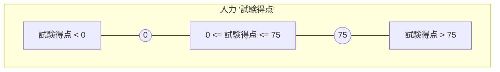

また、入力「コースワーク得点」については次のようになります。

**図 5 — 入力 "コースワーク得点"** {#Figure_5}

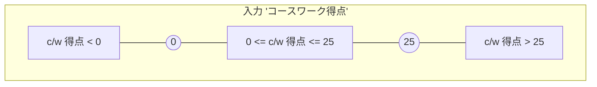

あまり明らかではない無効な入力パティションには、非整数入力や非数値入力など、他のあらゆる入力タイプが含まれる可能性があります。したがって、次のような無効な入力同値パティションを生成することができます。

- TCOND7: 試験得点 = 小数部を持つ実数 (FS1 用)
- TCOND8: 試験得点 = 英字 (FS1 用)
- TCOND9: 試験得点 = 特殊文字 (FS1 用)
- TCOND10: コースワーク得点 = 小数部を持つ実数 (FS1 用)
- TCOND11: コースワーク得点 = 英字 (FS1 用)
- TCOND12: コースワーク得点 = 特殊文字 (FS1 用)

次に、有効な出力に対するパティションが特定されます。

- TCOND13: 70 <= 総合得点 <= 100 により 'A' が導かれる (FS1 用)
- TCOND14: 50 <= 総合得点 < 70 により 'B' が導かれる (FS1 用)
- TCOND15: 30 <= 総合得点 < 50 により 'C' が導かれる (FS1 用)
- TCOND16: 0 <= 総合得点 < 30 により 'D' が導かれる (FS1 用)
- TCOND17: 総合得点 > 100 により 'エラーメッセージ' (FM) が導かれる (FS1 用)
- TCOND18: 総合得点 < 0 により 'エラーメッセージ' (FM) が導かれる (FS1 用)
- TCOND19: 非整数入力により 'エラーメッセージ' (FM) が導かれる (FS1 用)

*(ビジュアル参照: [ISO_IEC_IEEE_29119-4-FDIS_page-0055.jpg](file:///c:/dev/Antigravity/ATRS%20%E5%A4%96%E9%83%A8%E8%A8%AD%E8%A8%88%E6%9B%B8%20Markdown%E5%8C%96/00_Source_Materials/ISO-IEC-IEEE-29119-4-FDIS/ISO-IEC-IEEE-29119-4-FDIS/ISO-IEC-IEEE-29119-4-FDIS_page-0055.jpg))*

ここで、総合得点 = 試験得点 + コースワーク得点 です。'エラーメッセージ' は、*指定された*出力であるため、有効な出力として考慮されることに注意してください。

総合得点の同値パティションと境界を以下に図示します。

**図 6 — 総合得点の同値パティションと境界** {#Figure_6}

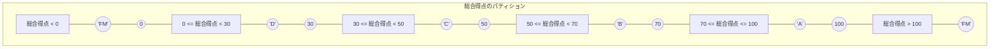

無効な出力とは、指定された 5 つ以外のテストアイテムの出力のことです。指定されていない出力を特定することは困難な場合があります。しかし、もしそれが発生させられれば、テストアイテム、そのテストベース、またはその両方の欠陥を特定したことになるため、それらを考慮する必要があります。この事例では、3 つの指定されていない出力が特定され、以下に示されています。同値分割法のこの側面は非常に主観的であり、テスターが異なれば、発生する可能性があると感じるパティションも異なる可能性があります（これは 箇条 5.2.1.1 の注記 2 に記載されています）。

- TCOND20: 出力 = 'E'。0 から 15 までの総合得点に対して、この（無効な）追加グレードが誤って実装されている場合 (FS1 用)
- TCOND21: 出力 = 'A+'。90 から 100 までの総合得点に対して、この（無効な）追加グレードが誤って実装されている場合 (FS1 用)
- TCOND22: 出力 = 'null'。'null' 出力が生成される場合 (FS1 用)

##### B.2.1.5 ステップ 3: テスト網羅項目の導出 (TD3) {#Section_B.2.1.5}

同値分割法では、テスト網羅項目は前のステップで導出されたパティションです（すなわち、この技法ではテスト条件とテスト網羅項目は同じです）。したがって、以下のテスト網羅項目を定義できます。

- TCOVER1: 0 <= 試験得点 <= 75 (TCOND1 用)
- TCOVER2: 0 <= コースワーク得点 <= 25 (TCOND2 用)
- TCOVER3: 試験得点 < 0 (TCOND3 用)
- TCOVER4: 試験得点 > 75 (TCOND4 用)
- TCOVER5: コースワーク得点 < 0 (TCOND5 用)
- TCOVER6: コースワーク得点 > 25 (TCOND6 用)
- TCOVER7: 試験得点 = 小数部を持つ実数 (TCOND7 用)
- TCOVER8: 試験得点 = 英字 (TCOND8 用)
- TCOVER9: 試験得点 = 特殊文字 (TCOND9 用)
- TCOVER10: コースワーク得点 = 小数部を持つ実数 (TCOND10 用)
- TCOVER11: コースワーク得点 = 英字 (TCOND11 用)
- TCOVER12: コースワーク得点 = 特殊文字 (TCOND12 用)
- TCOVER13: 70 <= 総合得点 <= 100 により 'A' が導かれる (TCOND13 用)
- TCOVER14: 50 <= 総合得点 < 70 により 'B' が導かれる (TCOND14 用)
- TCOVER15: 30 <= 総合得点 < 50 により 'C' が導かれる (TCOND15 用)
- TCOVER16: 0 <= 総合得点 < 30 により 'D' が導かれる (TCOND16 用)
- TCOVER17: 総合得点 > 100 により 'エラーメッセージ' (FM) が導かれる (TCOND17 用)
- TCOVER18: 総合得点 < 0 により 'エラーメッセージ' (FM) が導かれる (TCOND18 用)
- TCOVER19: 非整数入力により 'エラーメッセージ' (FM) が導かれる (TCOND19 用)
- TCOVER20: 出力 = 'E' (TCOND20 用)
- TCOVER21: 出力 = 'A+' (TCOND21 用)
- TCOVER22: 出力 = 'null' (TCOND22 用)

##### B.2.1.6 ステップ 4: テストケースの導出 (TD4) {#Section_B.2.1.6}

*(ビジュアル参照: [ISO_IEC_IEEE_29119-4-FDIS_page-0056.jpg](file:///c:/dev/Antigravity/ATRS%20%E5%A4%96%E9%83%A8%E8%A8%AD%E8%A8%88%E6%9B%B8%20Markdown%E5%8C%96/00_Source_Materials/ISO-IEC-IEEE-29119-4-FDIS/ISO-IEC-IEEE-29119-4-FDIS/ISO-IEC-IEEE-29119-4-FDIS_page-0056.jpg))*

###### B.2.1.6.1 オプション {#Section_B.2.1.6.1}

テストすべきパティションとテスト網羅項目が特定されたので、各テスト網羅項目に「当てる」ことを試みるテストケースを導出します。テストケース設計のための 2 つの一般的なアプローチは、「1 対 1」と同値分割法の「最小化」です（テストケースによって実行されるテスト網羅項目の組み合わせを選択する他のアプローチについては、箇条 5.2.5 に記載されています）。前者では、特定された各パティションに対して 1 対 1 でテストケースが生成されます（下のオプション 4a を参照）。一方、後者では、特定されたすべてのパティションを網羅するように、最小化されたテストケースのセットが生成されます（下のオプション 4b を参照）。*generate_grading* 関数のすべてのテストケースの前提条件は同じであり、アプリケーションが試験得点とコースワーク得点の入力を受け取れる状態にあることです。

###### B.2.1.6.2 オプション 4a: 1 対 1 同値分割法によるテストケースの導出 (TD4) {#Section_B.2.1.6.2}

パティションとテストケースの間のリンクが見やすいため、まず 1 対 1 アプローチを示します。これらのテストケースのそれぞれについて、ターゲットとなっている単一のテスト網羅項目のみが明示的に記載されています。22 個のテスト網羅項目が特定されたため、22 個のテストケースが導出されました。

入力「試験得点」から導出されたパティションに対応するテストケースを以下に示します。以下のテストケース表の入力「コースワーク得点」は、任意の有効な値である 15 に設定されていることに注意してください。テストケースにおける（テスト中のものを除く）すべての入力への任意の有効な値の割り当ては、この箇条のすべてのテストケースに対して行われています。

**表 3 — 入力「試験得点」のテストケース** {#Table_3}

| テストケース | 1 | 2 | 3 |
| :--- | :--- | :--- | :--- |
| 入力 (試験得点) | 60 | -10 | 93 |
| 入力 (c/w 得点) | 15 | 15 | 15 |
| 総合得点 (計算値) | 75 | 5 | 108 |
| テスト網羅項目 | TCOVER1 | TCOVER3 | TCOVER4 |
| テストされたパティション (試験得点) | 0 <= e <= 75 | e < 0 | e > 75 |
| 期待出力 | 'A' | 'FM' | 'FM' |

入力「コースワーク得点」から導出されたパティションに対応するテストケースは次のとおりです。

**表 4 — 入力「コースワーク得点」のテストケース** {#Table_4}

| テストケース | 4 | 5 | 6 |
| :--- | :--- | :--- | :--- |
| 入力 (試験得点) | 40 | 40 | 40 |
| 入力 (c/w 得点) | 20 | -15 | 47 |
| 総合得点 (計算値) | 60 | 25 | 87 |
| テスト網羅項目 | TCOVER2 | TCOVER5 | TCOVER6 |
| テストされたパティション (c/w 得点) | 0 <= c <= 25 | c < 0 | c > 25 |
| 期待出力 | 'B' | 'FM' | 'FM' |

可能性のある無効な入力から導出されたパティションに対応するテストケースは次のとおりです。

*(ビジュアル参照: [ISO_IEC_IEEE_29119-4-FDIS_page-0057.jpg](file:///c:/dev/Antigravity/ATRS%20%E5%A4%96%E9%83%A8%E8%A8%AD%E8%A8%88%E6%9B%B8%20Markdown%E5%8C%96/00_Source_Materials/ISO-IEC-IEEE-29119-4-FDIS/ISO-IEC-IEEE-29119-4-FDIS/ISO-IEC-IEEE-29119-4-FDIS_page-0057.jpg))*

**表 5 — 入力「試験得点」の無効な入力のテストケース** {#Table_5}

| テストケース | 7 | 8 | 9 |
| :--- | :--- | :--- | :--- |
| 入力 (試験得点) | 60.5 | Q | $ |
| 入力 (c/w 得点) | 15 | 15 | 15 |
| 総合得点 (計算値) | 75.5 | 該当なし | 該当なし |
| テスト網羅項目 | TCOVER7 | TCOVER8 | TCOVER9 |
| テストされたパティション | 試験得点 = 小数部を持つ実数 | 試験得点 = 英字 | 試験得点 = 特殊文字 |
| 期待出力 | 'FM' | 'FM' | 'FM' |

**表 6 — 入力「コースワーク得点」の無効な入力のテストケース** {#Table_6}

| テストケース | 10 | 11 | 12 |
| :--- | :--- | :--- | :--- |
| 入力 (試験得点) | 40 | 40 | 40 |
| 入力 (c/w 得点) | 20.23 | G | @ |
| 総合得点 (計算値) | 60.23 | 該当なし | 該当なし |
| テスト網羅項目 | TCOVER10 | TCOVER11 | TCOVER12 |
| テストされたパティション | c/w 得点 = 小数部を持つ実数 | c/w 得点 = 英字 | c/w 得点 = 特殊文字 |
| 期待出力 | 'FM' | 'FM' | 'FM' |

有効な出力から導出されたパティションに対応するテストケースは次のとおりです。

**表 7 — 有効な出力「総合得点」のテストケース** {#Table_7}

| テストケース | 13 | 14 | 15 |
| :--- | :--- | :--- | :--- |
| 入力 (試験得点) | 60 | 44 | 32 |
| 入力 (c/w 得点) | 20 | 22 | 13 |
| 総合得点 (計算値) | 80 | 66 | 45 |
| テスト網羅項目 | TCOVER13 | TCOVER14 | TCOVER15 |
| テストされたパティション (総合得点) | 70 <= t <= 100 | 50 <= t < 70 | 30 <= t < 50 |
| 期待出力 | 'A' | 'B' | 'C' |

**表 8 — 有効な出力「総合得点」のテストケース（続き）** {#Table_8}

| テストケース | 16 | 17 | 18 |
| :--- | :--- | :--- | :--- |
| 入力 (試験得点) | 12 | 80 | -10 |
| 入力 (c/w 得点) | 5 | 60 | -10 |
| 総合得点 (計算値) | 17 | 140 | -20 |
| テスト網羅項目 | TCOVER16 | TCOVER17 | TCOVER18 |
| テストされたパティション (総合得点) | 0 <= t < 30 | t > 100 | t < 0 |
| 期待出力 | 'D' | 'FM' | 'FM' |

試験得点とコースワーク得点の入力値は、それらの和である総合得点から導出されました。

無効な出力から導出されたパティションに対応するテストケースは次のとおりです。

*(ビジュアル参照: [ISO_IEC_IEEE_29119-4-FDIS_page-0058.jpg](file:///c:/dev/Antigravity/ATRS%20%E5%A4%96%E9%83%A8%E8%A8%AD%E8%A8%88%E6%9B%B8%20Markdown%E5%8C%96/00_Source_Materials/ISO-IEC-IEEE-29119-4-FDIS/ISO-IEC-IEEE-29119-4-FDIS/ISO-IEC-IEEE-29119-4-FDIS_page-0058.jpg))*

**表 9 — 無効な出力「総合得点」のテストケース** {#Table_9}

| テストケース | 19 | 20 | 21 | 22 |
| :--- | :--- | :--- | :--- | :--- |
| 入力 (試験得点) | 47.3 | 5 | 72 | Null |
| 入力 (c/w 得点) | @@@ | 5 | 23 | Null |
| 総合得点 (計算値) | - | 10 | 95 | - |
| テスト網羅項目 | TCOVER19 | TCOVER20 | TCOVER21 | TCOVER22 |
| テストされたパティション (出力) | 'FM' | 'E' | 'A+' | 'Null' |
| パティション (総合得点) | - | 0 <= t <= 15 | 90 <= t <= 100 | - |
| 期待出力 | 'FM' | 'D' | 'A' | 'FM' |

実装によっては、無効な入力値を含むテストケースを実行することが不可能な場合があります（例：上記の事例におけるテストケース 2、3、5-12、17-22）。例えば、Ada プログラミング言語では、入力変数が正の整数として宣言されている場合、それに負の値を割り当てることはできません。それにもかかわらず、完全性のためにすべてのテストケースを考慮することは依然として価値があります。

###### B.2.1.6.3 オプション 4b: 最小化された同値分割法によるテストケースの導出 (TD4) {#Section_B.2.1.6.3}

上記のテストケースのいくつか、例えばテストケース 1 と 13 は似ていることがわかります。それらの主な違いは、ターゲットとして選択されたパティションから選ばれた具体的なテスト網羅項目です。テストアイテムには 2 つの入力と 1 つの出力があるため、各テストケースは実際には 3 つのパティション（2 つの入力パティションと 1 つの出力パティション）に「当たります」。したがって、一度に複数のパティションを実行するように設計されたテストケースを導出することにより、特定されたすべてのパティションに依然として「当たる」、より小さな「最小化された」テストセットを生成することが可能です。

以下の 12 個のテストケースからなるテストスイートは、各テストケースが単に 1 つの新しいパティションに当てるのではなく、できるだけ多くの新しいパティションに当てるように設計された、最小化された同値分割法のアプローチに対応しています。

**表 10 — 最小化されたテストケース** {#Table_10}

| テストケース | 1 | 2 | 3 | 4 |
| :--- | :--- | :--- | :--- | :--- |
| 入力 (試験得点) | 60 | 50 | 35 | 19 |
| 入力 (c/w 得点) | 20 | 16 | 10 | 8 |
| 総合得点 (計算値) | 80 | 66 | 45 | 27 |
| テスト網羅項目 | TCOVER1, TCOVER2, TCOVER13 | TCOVER1, TCOVER2, TCOVER14 | TCOVER1, TCOVER2, TCOVER15 | TCOVER1, TCOVER2, TCOVER16 |
| パティション (試験得点) | 0 <= e <= 75 | 0 <= e <= 75 | 0 <= e <= 75 | 0 <= e <= 75 |
| パティション (c/w 得点) | 0 <= c <= 25 | 0 <= c <= 25 | 0 <= c <= 25 | 0 <= c <= 25 |
| パティション (総合得点) | 70 <= t <= 100 | 50 <= t < 70 | 30 <= t < 50 | 0 <= t < 30 |
| 期待出力 | 'A' | 'B' | 'C' | 'D' |

*(ビジュアル参照: [ISO_IEC_IEEE_29119-4-FDIS_page-0059.jpg](file:///c:/dev/Antigravity/ATRS%20%E5%A4%96%E9%83%A8%E8%A8%AD%E8%A8%88%E6%9B%B8%20Markdown%E5%8C%96/00_Source_Materials/ISO-IEC-IEEE-29119-4-FDIS/ISO-IEC-IEEE-29119-4-FDIS/ISO-IEC-IEEE-29119-4-FDIS_page-0059.jpg))*

**表 11 — 最小化されたテストケース（続き）** {#Table_11}

| テストケース | 5 | 6 | 7 | 8 |
| :--- | :--- | :--- | :--- | :--- |
| 入力 (試験得点) | -10 | 93 | 60.5 | Q |
| 入力 (c/w 得点) | -15 | 47 | 20.23 | G |
| 総合得点 (計算値) | -25 | 140 | 80.73 | - |
| テスト網羅項目 | TCOVER3, TCOVER5, TCOVER18 | TCOVER4, TCOVER6, TCOVER17 | TCOVER7, TCOVER10, TCOVER13, TCOVER19 | TCOVER8, TCOVER11, TCOVER19 |
| パティション (試験得点) | e < 0 | e > 75 | e = 少数部を持つ実数 | e = 英字 |
| パティション (c/w 得点) | c < 0 | c > 25 | c = 少数部を持つ実数 | c = 英字 |
| パティション (総合得点) | t < 0 | t > 100 | 70 <= t <= 100 | - |
| 期待出力 | 'FM' | 'FM' | 'FM' | 'FM' |

**表 12 — 最小化されたテストケース（続き）** {#Table_12}

| テストケース | 9 | 10 | 11 | 12 |
| :--- | :--- | :--- | :--- | :--- |
| 入力 (試験得点) | $ | 5 | 72 | 'Null' |
| 入力 (c/w 得点) | @ | 5 | 23 | 'Null' |
| 総合得点 (計算値) | - | 10 | 95 | - |
| テスト網羅項目 | TCOVER9, TCOVER12, TCOVER19 | TCOVER1, TCOVER2, TCOVER16, TCOVER20 | TCOVER1, TCOVER2, TCOVER13, TCOVER21 | TCOVER19, TCOVER22 |
| パティション (試験得点) | e = 特殊文字 | 0 <= e <= 75 | 0 <= e <= 75 | - |
| パティション (c/w 得点) | c = 特殊文字 | 0 <= c <= 25 | 0 <= c <= 25 | - |
| パティション (総合得点) | - | 0 <= t <= 15 | 90 <= t <= 100 | - |
| パティション (出力) | - | 'E' | 'A+' | 'Null' |
| 期待出力 | 'FM' | 'D' | 'A' | 'FM' |

1 対 1 アプローチと最小化アプローチは、同値分割法によるテストケース導出に使用できる 2 つの異なるアプローチを表しています。1 対 1 テストケースは、特定のエラーメッセージを出力させようとする場合など、エラー条件のテストに特に有用です。例えば、1 つのエラー条件が処理を停止させたり、他のエラー条件を隠したりブロックしたりする可能性を減らすためです。一方で、最小主義のアプローチを使用することもできます。最小主義のアプローチの欠点は、テストが失敗した場合に、複数の新しいパティションが同時に実行されているために原因を特定するのが困難になる可能性があることです。したがって、一般的なアプローチは、有効なテストケースの設計には最小化された同値分割法を適用し、無効なテストケースの設計には 1 対 1 同値分割法を適用することによって、2 つのアプローチを組み合わせることです。

##### B.2.1.7 ステップ 5: テストセットの構築 (TD5) {#Section_B.2.1.7}

*(ビジュアル参照: [ISO_IEC_IEEE_29119-4-FDIS_page-0060.jpg](file:///c:/dev/Antigravity/ATRS%20%E5%A4%96%E9%83%A8%E8%A8%AD%E8%A8%88%E6%9B%B8%20Markdown%E5%8C%96/00_Source_Materials/ISO-IEC-IEEE-29119-4-FDIS/ISO-IEC-IEEE-29119-4-FDIS/ISO-IEC-IEEE-29119-4-FDIS_page-0060.jpg))*

###### B.2.1.7.1 オプション {#Section_B.2.1.7.1}

各テストケースに対する承認／却下応答の自動チェックは可能だが、自動化ではエラーメッセージ（FM）を処理できないと仮定すると、手動テスト用と自動テスト用の 2 つのテストセット（TS）を生成できます。

###### B.2.1.7.2 オプション 5a: 1 対 1 同値分割法のテストセットの構築 (TD5) {#Section_B.2.1.7.2}

TS1: 手動テスト – テストケース 2, 3, 5, 6, 7, 8, 9, 10, 11, 12, 17, 18, 19, 22
TS2: 自動テスト – テストケース 1, 4, 13, 14, 15, 16, 20, 21

###### B.2.1.7.3 オプション 5b: 最小化された同値分割法のテストセットの構築 (TD5) {#Section_B.2.1.7.3}

TS3: 手動テスト – テストケース 5, 6, 7, 8, 9, 12
TS4: 自動テスト – テストケース 1, 2, 3, 4, 10, 11

##### B.2.1.8 ステップ 6: テスト手順の導出 (TD6) {#Section_B.2.1.8}

###### B.2.1.8.1 オプション {#Section_B.2.1.8.1}

1 対 1 同値分割法と最小化された同値分割法のテスト手順を導出できます。

###### B.2.1.8.2 オプション 6a: 1 対 1 同値分割法のテスト手順の導出 (TD6) {#Section_B.2.1.8.2}

1 対 1 同値分割法のテストセット TS1 の手動テストケースについて、1 つのテスト手順（TP）を次のように定義できます。

TP1: 手動テスト。TS1 内のすべてのテストケースを、テストセットで指定された順序で網羅する。

1 対 1 のテストセット TS2 の自動テストケースについては、テストセット内のすべてのテストケースを実行するために、次のような 1 つのテストスクリプトを記述できます。

TP2: 自動テスト。TS2 内のすべてのテストケースを、テストセットで指定された順序で網羅する。

自動テスト手順 TP2 については、手順を実装する自動化コードをテスト自動化スクリプトに記述する必要があります。

###### B.2.1.8.3 オプション 6b: 最小化された同値分割法のテスト手順の導出 (TD6) {#Section_B.2.1.8.3}

最小化されたテストセット TS3 の手動テストケースについて、1 つのテスト手順（TP）を次のように定義できます。

TP3: 手動テスト。TS3 内のすべてのテストケースを、テストセットで指定された順序で網羅する。

最小化されたテストセット TS4 の自動テストケースについては、テストセット内のすべてのテストケースを実行するために、次のような 1 つのテストスクリプトを記述できます。

TP4: 自動テスト。TS4 内のすべてのテストケースを、テストセットで指定された順序で網羅する。

##### B.2.1.9 同値分割法の網羅率 {#Section_B.2.1.9}

同値パティションのフルセットが特定され、少なくとも 1 つのテストケースによって実行されると、各アプローチで 100% の網羅率が達成されます。

#### B.2.2 分類ツリー法 (Classification Tree Method) {#Section_B.2.2}

##### B.2.2.1 はじめに {#Section_B.2.2.1}

*(ビジュアル参照: [ISO_IEC_IEEE_29119-4-FDIS_page-0061.jpg](file:///c:/dev/Antigravity/ATRS%20%E5%A4%96%E9%83%A8%E8%A8%AD%E8%A8%88%E6%9B%B8%20Markdown%E5%8C%96/00_Source_Materials/ISO-IEC-IEEE-29119-4-FDIS/ISO-IEC-IEEE-29119-4-FDIS/ISO-IEC-IEEE-29119-4-FDIS_page-0061.jpg))*

分類ツリー法の目的は、選択された同値パティション網羅レベルに従って、テストアイテムの入力パティションを網羅するテストケースを導出することです。分類ツリー法は、パティションを図示し、テスターのテスト設計を支援する「分類ツリー」を構築することで、この概念を拡張します。

##### B.2.2.2 仕様 {#Section_B.2.2.2}

オーストラリアの組織のスタッフが業務目的で主要な各州都に旅行する際の旅行の好みを記録する、テストアイテム *travel_preference* のテストベースについて考えます。旅行の好みの各セットは、一連のラジオボタンを通じて選択され、以下の入力値の選択肢で構成されます。

- **目的地 (Destination)** = *アデレード、ブリスベン、キャンベラ、ダーウィン、ホバート、メルボルン、パース、シドニー*
- **座席クラス (Class)** = *ファーストクラス、ビジネスクラス、エコノミー*
- **座席位置 (Seat)** = *通路側、窓側*
- **食事の好み (Meal Preference)** = *糖尿病食、グルテンフリー、ラクトオボ・ベジタリアン、低脂肪／低コレステロール、低乳糖、ヴィーガン、標準*

各分類から 1 つのクラスを選択した組み合わせの結果、メッセージ「予約が受け付けられました」が表示され、それ以外の入力の結果、「無効な入力」というエラーメッセージが表示されます。スタッフには食事なしを選択するオプションがないため、この例ではそのオプションはサポートされていません。

##### B.2.2.3 ステップ 1: フィーチャセットの特定 (TD1) {#Section_B.2.2.3}

テストベースで定義されているテストアイテムは 1 つだけなので、フィーチャセットを 1 つだけ定義する必要があります。

- FS1: travel_preference 関数

##### B.2.2.4 ステップ 2: テスト条件の導出 (TD2) {#Section_B.2.2.4}

分類ツリーテストでは、各入力パラメータに対して「分類 (classification)」と「クラス (class)」を導出することによってテスト条件を特定します。

- TCOND1: 目的地 (FS1 用)
- TCOND2: 座席クラス (FS1 用)
- TCOND3: 座席位置 (FS1 用)
- TCOND4: 食事の好み (FS1 用)

注記 1 無効なテスト条件も導出できますが、この事例では示されていません。

この事例の各テスト条件は「分類」（すなわちパティション）です。「クラス」（すなわちサブパティション）およびサブクラスは、食事の好みクラスについて次のように導出できます。

- 食事の好み (分類) = ベジタリアン、非ベジタリアン
- ベジタリアン (クラス) = ラクトオボ、ヴィーガン
- 非ベジタリアン (クラス) = 糖尿病食、グルテンフリー、低脂肪／低コレステロール、低乳糖、標準

注記 2 分類とクラスの設計はしばしば主観的な活動であるため、この技法を使用する他のテスターは、この事例で導出されたものとは異なる分類とクラスを設計する可能性があります。

これらのテスト条件に対して分類ツリーを開発できます。

##### B.2.2.5 ステップ 3: テスト網羅項目の導出 (TD3) {#Section_B.2.2.5}

*(ビジュアル参照: [ISO_IEC_IEEE_29119-4-FDIS_page-0062.jpg](file:///c:/dev/Antigravity/ATRS%20%E5%A4%96%E9%83%A8%E8%A8%AD%E8%A8%88%E6%9B%B8%20Markdown%E5%8C%96/00_Source_Materials/ISO-IEC-IEEE-29119-4-FDIS/ISO-IEC-IEEE-29119-4-FDIS/ISO-IEC-IEEE-29119-4-FDIS_page-0062.jpg))*

**図 7 — 分類ツリーの例** {#Figure_7}

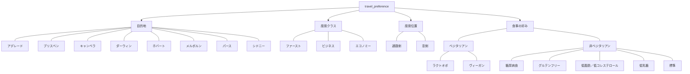

テスト網羅項目は、組み合わせアプローチを選択し、そのアプローチに従ってクラスの組み合わせを作成することによって導出されます。分類ツリーの下に「組み合わせテーブル」を構築して、各テスト網羅項目を形成するためにどのクラスが組み合わされているかを示すことができます（例：下の図 8 を参照）。各テスト網羅項目によって網羅されるクラスは、分類ツリーの下に水平に並ぶ一連のトークン（黒丸）によってマークされます。

選択された組み合わせアプローチが「最小化」であると仮定すると、各テスト網羅項目は、すべてのクラスが少なくとも 1 つのテストケースに含まれるまで、できるだけ多くのクラスを網羅します。その場合、図 8 に示されるような以下のテスト網羅項目を定義できます。

**図 8 — 分類ツリーと対応する組み合わせテーブルの例** {#Figure_8}

| テスト網羅項目 | アデレード | ブリスベン | キャンベラ | ダーウィン | ホバート | メルボルン | パース | シドニー | ファースト | ビジネス | エコノミー | 通路側 | 窓側 | ラクトオボ | ヴィーガン | 糖尿病食 | グルテンフリー | 低脂肪／低コレステロール | 低乳糖 | 標準 |
| :---: | :---: | :---: | :---: | :---: | :---: | :---: | :---: | :---: | :---: | :---: | :---: | :---: | :---: | :---: | :---: | :---: | :---: | :---: | :---: | :---: |
| 1 | ● | | | | | | | | ● | | | ● | | ● | | | | | | |
| 2 | | ● | | | | | | | | ● | | | ● | | ● | | | | | |
| 3 | | | ● | | | | | | | | ● | ● | | | | ● | | | | |
| 4 | | | | ● | | | | | ● | | | | ● | | | | ● | | | |
| 5 | | | | | ● | | | | | ● | | ● | | | | | | ● | | |
| 6 | | | | | | ● | | | | | ● | | ● | | | | | | ● | |
| 7 | | | | | | | ● | | ● | | | ● | | | | | | | | ● |
| 8 | | | | | | | | ● | | ● | | | ● | ● | | | | | | |

##### B.2.2.6 ステップ 4: テストケースの導出 (TD4) {#Section_B.2.2.6}

各テストケースが正確に 1 つのテスト網羅項目を網羅するように、テストケースのセットを導出できるようになりました。テストケースは、まだテストケースによって網羅されていないテスト網羅項目を 1 つずつ選択し、その組み合わせのクラスを網羅するテスト入力値を入力することによって導出されます。これは、要求された網羅レベルが達成されるまで繰り返されます。期待される結果は、入力をテストベースに適用することによって導出されます。この特定の事例では、有効な入力の組み合わせはいずれもステータス「予約が受け付けられました」をもたらします。

**表 13 — 分類ツリーテストに対するテストケース** {#Table_13}

| テストケース | 目的地 | 座席クラス | 座席位置 | 食事の好み | 期待結果 | テスト網羅項目 |
| :---: | :--- | :--- | :--- | :--- | :--- | :--- |
| 1 | アデレード | ファースト | 通路側 | ラクトオボ | 予約承りました | TCOVER1 |
| 2 | ブリスベン | ビジネス | 窓側 | ヴィーガン | 予約承りました | TCOVER2 |
| 3 | キャンベラ | エコノミー | 通路側 | 糖尿病食 | 予約承りました | TCOVER3 |
| 4 | ダーウィン | ファースト | 窓側 | グルテンフリー | 予約承りました | TCOVER4 |
| 5 | ホバート | ビジネス | 通路側 | 低脂肪／低コレステロール | 予約承りました | TCOVER5 |
| 6 | メルボルン | エコノミー | 窓側 | 低乳糖 | 予約承りました | TCOVER6 |
| 7 | パース | ファースト | 通路側 | 標準 | 予約承りました | TCOVER7 |
| 8 | シドニー | ビジネス | 窓側 | ラクトオボ | 予約承りました | TCOVER8 |

##### B.2.2.7 ステップ 5: テストセットの構築 (TD5) {#Section_B.2.2.7}

この事例では導出されたテストケースの数が少ないため、それらを 1 つのテストセットに組み合わせることができます。

- TS1: テストケース 1, 2, 3, 4, 5, 6, 7, 8

##### B.2.2.8 ステップ 6: テスト手順の導出 (TD6) {#Section_B.2.2.8}

すべてのテストケースが 1 つのテストセットにあるため、1 つのテスト手順を導出できます。

- TP1: TS1 内のすべてのテストケースを、テストセットで指定された順序で網羅する。

##### B.2.2.9 分類ツリー法の網羅率 {#Section_B.2.2.9}

箇条 6.2.2 で提供されている式と、上記で導出されたテスト網羅項目を使用すると、次のようになります。

したがって、分類ツリー法に対するテスト網羅項目の 100% 網羅が達成されました。

#### B.2.3 境界値分析 (Boundary Value Analysis) {#Section_B.2.3}

##### B.2.3.1 はじめに {#Section_B.2.3.1}

*(ビジュアル参照: [ISO_IEC_IEEE_29119-4-FDIS_page-0063.jpg](file:///c:/dev/Antigravity/ATRS%20%E5%A4%96%E9%83%A8%E8%A8%AD%E8%A8%88%E6%9B%B8%20Markdown%E5%8C%96/00_Source_Materials/ISO-IEC-IEEE-29119-4-FDIS/ISO-IEC-IEEE-29119-4-FDIS/ISO-IEC-IEEE-29119-4-FDIS_page-0063.jpg))*

境界値分析の目的は、指定されたレベルの境界値網羅率で、各入力パティションおよび出力パティションの境界を網羅するテストケースのセットを導出することです。これは以下の前提に基づいています。第一に、テストアイテムの入力と出力は、テストアイテムのテストベースに従って、テストアイテムによって同様に扱われるクラスに分割できること。第二に、いくつかのパティションのメンバーは、不連続性なく最小から最大まで順序付けることができること。第三に、順序付けられた連続するパティションの境界は、歴史的にソフトウェア開発におけるエラーが発生しやすい要素であること。テストケースは、これらの境界を実行するために生成されます。

以下は、*1 対 1 テストケース*による*3 値境界値テスト*の例です（それぞれ 箇条 5.2.3.2 および 5.2.3.3 を参照）。テストアイテムの境界を導出するためには、まずテストアイテムの同値パティションを特定し、続いて各同値クラスから境界値を導出する必要があります。

##### B.2.3.2 仕様 {#Section_B.2.3.2}

*(ビジュアル参照: [ISO_IEC_IEEE_29119-4-FDIS_page-0064.jpg](file:///c:/dev/Antigravity/ATRS%20%E5%A4%96%E9%83%A8%E8%A8%AD%E8%A8%88%E6%9B%B8%20Markdown%E5%8C%96/00_Source_Materials/ISO-IEC-IEEE-29119-4-FDIS/ISO-IEC-IEEE-29119-4-FDIS/ISO-IEC-IEEE-29119-4-FDIS_page-0064.jpg))*

以下のテストベースを持つテストアイテム *generate_grading* について考えます。

*「このコンポーネントは、入力として試験の得点（75点満点）とコースワーク（c/w）の得点（25点満点）を受け取り、それらからコースのグレードを 'A' から 'D' の範囲で出力する。グレードは、試験得点と c/w 得点の合計である総合得点を計算することによって、次のように生成される。」*

- *70以上* -> *'A'*
- *50以上 70未満* -> *'B'*
- *30以上 50未満* -> *'C'*
- *30未満* -> *'D'*

*「不正な入力が検出された場合（例：得点が期待される範囲外である場合）は、エラーメッセージ（'FM'）が生成される。すべての入力は整数として渡される。」*

##### B.2.3.3 ステップ 1: フィーチャセットの特定 (TD1) {#Section_B.2.3.3}

テストベースで定義されているテストアイテムは 1 つだけなので、フィーチャセット（FS）を 1 つだけ定義する必要があります。

- FS1: generate_grading 関数

##### B.2.3.4 ステップ 2: テスト条件の導出 (TD2) {#Section_B.2.3.4}

###### B.2.3.4.1 サブステップ {#Section_B.2.3.4.1}

境界値分析では、テスト条件は、テスト中に網羅することを選択した（パティション間の）境界です。境界を特定するには、まず同値パティションを特定し（下のステップ 2a 参照）、そこからテスト条件（境界）を導出する必要があります（下のステップ 2b 参照）。

###### B.2.3.4.2 ステップ 2a: 同値パティションの特定 {#Section_B.2.3.4.2}

*(ビジュアル参照: [ISO_IEC_IEEE_29119-4-FDIS_page-0065.jpg](file:///c:/dev/Antigravity/ATRS%20%E5%A4%96%E9%83%A8%E8%A8%AD%E8%A8%88%E6%9B%B8%20Markdown%E5%8C%96/00_Source_Materials/ISO-IEC-IEEE-29119-4-FDIS/ISO-IEC-IEEE-29119-4-FDIS/ISO-IEC-IEEE-29119-4-FDIS_page-0065.jpg))*

同値パティションは、フィーチャセット FS1 の有効な入力／出力および無効な入力／出力から特定されます。

入力に対して、以下の**有効な**同値パティション（EP）を特定できます。

- EP1: 0 <= 試験得点 <= 75 (FS1 用)
- EP2: 0 <= コースワーク得点 <= 25 (FS1 用)

入力に対する最も明らかな**無効な**同値パティションは、次のように特定できます。

- EP3: 試験得点 > 75 (FS1 用)
- EP4: 試験得点 < 0 (FS1 用)
- EP5: コースワーク得点 > 25 (FS1 用)
- EP6: コースワーク得点 < 0 (FS1 用)

パティション EP3 から EP6 は片側だけが境界付けられているように見えますが、これらのパティションは実際には実装依存の最小値および最大値によって境界付けられています。16 ビットで保持される整数の場合、これらはそれぞれ 32767 と -32768 になります。したがって、EP3 から EP6 は次のように、より完全に定義できます。

- EP3: 75 < 試験得点 <= 32767 (FS1 用)
- EP4: -32768 <= 試験得点 < 0 (FS1 用)
- EP5: 25 < コースワーク得点 <= 32767 (FS1 用)
- EP6: -32768 <= コースワーク得点 < 0 (FS1 用)

分割された値の範囲は、次のように図示できます。

**図 9 — 試験得点の同値パティションと境界** {#Figure_9}

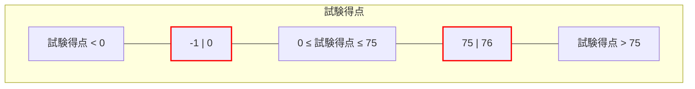

また、入力「コースワーク得点」については次のようになります。

**図 10 — コースワーク得点の同値パティションと境界** {#Figure_10}

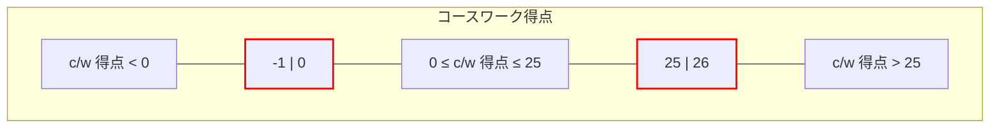

あまり明らかではない無効な入力パティションには、有効なパティションに含まれない他のあらゆる入力タイプ（例：非整数入力、あるいはおそらく非数値入力）が含まれる可能性があります。同値分割法のこの側面は主観的であり、テスターごとに、関連があると感じる異なるパティションを特定する可能性があります。同値パティションと見なされるためには、パティション内のすべての値がテストアイテムによって同等に扱われることが期待されなければなりません。したがって、2 つの入力フィールドに対して以下の無効な同値パティションを生成できます。

- EP7: 試験得点 = 小数部を持つ実数 (FS1 用)
- EP8: 試験得点 = 英字 (FS1 用)
- EP9: 試験得点 = 特殊文字 (FS1 用)
- EP10: コースワーク得点 = 小数部を持つ実数 (FS1 用)
- EP11: コースワーク得点 = 英字 (FS1 用)
- EP12: コースワーク得点 = 特殊文字 (FS1 用)

同値クラス EP7 から EP12 は可能ですが、特定可能な境界がないため、この技法ではそれらに対するテスト網羅項目やテストケースを導出する必要はありません。

次に、出力に対するパティションが特定されます。**有効な**パティションは、テストアイテムの有効な各出力を考慮することによって、次のように生成されます。

- EP13: 70 <= 総合得点 <= 100 により 'A' が導かれる (FS1 用)
- EP14: 50 <= 総合得点 < 70 により 'B' が導かれる (FS1 用)
- EP15: 30 <= 総合得点 < 50 により 'C' が導かれる (FS1 用)
- EP16: 0 <= 総合得点 < 30 により 'D' が導かれる (FS1 用)
- EP17: 総合得点 > 100 により 'エラーメッセージ' (FM) が導かれる (FS1 用)
- EP18: 総合得点 < 0 により 'エラーメッセージ' (FM) が導かれる (FS1 用)

ここで、総合得点 = 試験得点 + コースワーク得点 です。

入力と同様に、出力も 16 ビット整数（-32768 〜 32767）で保持されると仮定すると、EP17 と EP18 は次のように再定義できます。

- EP17: 100 < 総合得点 <= 32767 (FS1 用)
- EP18: -32768 <= 総合得点 < 0 (FS1 用)

*(ビジュアル参照: [ISO_IEC_IEEE_29119-4-FDIS_page-0066.jpg](file:///c:/dev/Antigravity/ATRS%20%E5%A4%96%E9%83%A8%E8%A8%AD%E8%A8%88%E6%9B%B8%20Markdown%E5%8C%96/00_Source_Materials/ISO-IEC-IEEE-29119-4-FDIS/ISO-IEC-IEEE-29119-4-FDIS/ISO-IEC-IEEE-29119-4-FDIS_page-0066.jpg))*

'エラーメッセージ' は指定された出力であるため、ここでは有効な出力として考慮されます。総合得点の同値パティションと境界を以下に示します。

**図 11 — 総合得点の同値パティションと境界** {#Figure_11}

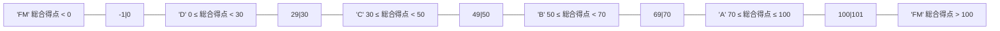

**無効な**出力とは、指定された 5 つ以外のテストアイテムからの出力のことです。指定されていない出力を特定することは困難な場合がありますが、もし発生させられれば、テストアイテム、そのテストベース、またはその両方の欠陥を特定したことになるため、当然それらを考慮する必要があります。この事例では、3 つの指定されていない出力（'E'、'A+'、'null'）が特定されましたが、これらを境界を特定できるような順序付けられたパティションにグループ化することは不可能であるため、テストケースは導出されません。

###### B.2.3.4.3 ステップ 2b: テスト条件の導出 {#Section_B.2.3.4.3}

各入力フィールドおよび出力フィールドの同値パティションが特定されたら、各同値パティションの境界であるテスト条件を特定できます。

入力フィールド「試験得点」と「コースワーク得点」の**有効な**パティションについて、以下のテスト条件を特定できます。重複する境界（例：EP1 と EP4 の端にある境界 "0"）は、1 つのテスト条件によってのみ網羅されることに注意してください。

- TCOND1: 試験得点 = 0 (EP1 および EP4 用)
- TCOND2: 試験得点 = 75 (EP1 および EP3 用)
- TCOND3: コースワーク得点 = 0 (EP2 および EP6 用)
- TCOND4: コースワーク得点 = 25 (EP2 および EP5 用)

総合得点の**有効な**同値パティションについて、以下の境界を特定できます。

- TCOND5: 総合得点 = 0 (EP16 および EP18 用)
- TCOND6: 総合得点 = 29 (EP15 および EP16 用)
- TCOND7: 総合得点 = 30 (EP15 および EP16 用)
- TCOND8: 総合得点 = 49 (EP14 および EP15 用)
- TCOND9: 総合得点 = 50 (EP14 および EP15 用)
- TCOND10: 総合得点 = 69 (EP13 および EP14 用)
- TCOND11: 総合得点 = 70 (EP13 および EP14 用)
- TCOND12: 総合得点 = 100 (EP13 および EP17 用)

入力フィールドの**無効な**パティションについて、以下の境界を特定できます。

- TCOND13: 試験得点 = 32767 (EP3 用)
- TCOND14: 試験得点 = -32768 (EP4 用)
- TCOND15: コースワーク得点 = 32767 (EP5 用)
- TCOND16: コースワーク得点 = -32768 (EP6 用)

最後に、総合得点の**無効な**パティションについて、以下の境界を特定できます。

- TCOND17: 総合得点 = 101 (EP17 および EP13 用)
- TCOND18: 総合得点 = -1 (EP18 および EP16 用)
- TCOND19: 総合得点 = 32767 (EP17 用)
- TCOND20: 総合得点 = -32768 (EP18 用)

> [!NOTE]
> **AI分析: 境界特定のニュアンス**
> TCOND6 と TCOND7 は、'D' と 'C' の間の境界を網羅しています。3 値境界値分析では、境界点とその両側の 1 点を網羅します。ここでは、境界は点そのものとして特定されています。

##### B.2.3.5 ステップ 3: テスト網羅項目の導出 (TD3) {#Section_B.2.3.5}

*(ビジュアル参照: [ISO_IEC_IEEE_29119-4-FDIS_page-0067.jpg](file:///c:/dev/Antigravity/ATRS%20%E5%A4%96%E9%83%A8%E8%A8%AD%E8%A8%88%E6%9B%B8%20Markdown%E5%8C%96/00_Source_Materials/ISO-IEC-IEEE-29119-4-FDIS/ISO-IEC-IEEE-29119-4-FDIS/ISO-IEC-IEEE-29119-4-FDIS_page-0067.jpg))*

3 値境界値分析が適用される場合、テスト網羅項目は、同値パティションの境界上にある値、および最小の実効距離を使用した境界の両側の値です。

**図 12 — 3 値境界値分析に対するテスト網羅項目** {#Figure_12}

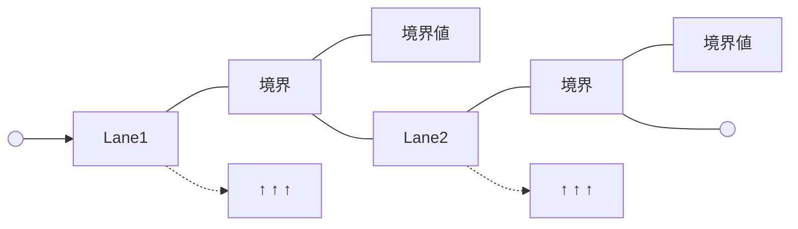

注記 1 代わりに 2 値境界値分析を実施することもでき、その場合はテスト網羅項目の導出数が少なくなり、対応するテストケースの導出数も少なくなります。

前のステップでテスト条件として特定された境界について、以下のテスト網羅項目（TCOVER）を特定できます。この事例では整数を使用しているため、テスト網羅項目は各境界の両側の 1 です。

注記 2 事例に小数を含む数値データ型（例：実数）が含まれる場合、境界値分析のテスト網羅項目は、考慮対象のデータ型の最小有効値となります。

- TCOVER1: 試験得点 = -1 (TCOND1 から)
- TCOVER2: 試験得点 = 0 (TCOND1 から)
- TCOVER3: 試験得点 = 1 (TCOND1 から)
- TCOVER4: 試験得点 = 74 (TCOND2 から)
- TCOVER5: 試験得点 = 75 (TCOND2 から)
- TCOVER6: 試験得点 = 76 (TCOND2 から)
- TCOVER7: コースワーク得点 = -1 (TCOND3 から)
- TCOVER8: コースワーク得点 = 0 (TCOND3 から)
- TCOVER9: コースワーク得点 = 1 (TCOND3 から)
- TCOVER10: コースワーク得点 = 24 (TCOND4 から)
- TCOVER11: コースワーク得点 = 25 (TCOND4 から)
- TCOVER12: コースワーク得点 = 26 (TCOND4 から)

出力フィールドについては、以下のテスト網羅項目を特定できます。

- TCOVER13: 総合得点 = -1 (TCOND5 および TCOND19 から)
- TCOVER14: 総合得点 = 0 (TCOND5 および TCOND19 から)
- TCOVER15: 総合得点 = 1 (TCOND5 から)
- TCOVER16: 総合得点 = 28 (TCOND6 から)
- TCOVER17: 総合得点 = 29 (TCOND6 および TCOND7 から)
- TCOVER18: 総合得点 = 30 (TCOND6 および TCOND7 から)
- TCOVER19: 総合得点 = 31 (TCOND7 から)
- TCOVER20: 総合得点 = 48 (TCOND8 から)
- TCOVER21: 総合得点 = 49 (TCOND8 および TCOND9 から)
- TCOVER22: 総合得点 = 50 (TCOND8 および TCOND9 から)

*(ビジュアル参照: [ISO_IEC_IEEE_29119-4-FDIS_page-0068.jpg](file:///c:/dev/Antigravity/ATRS%20%E5%A4%96%E9%83%A8%E8%A8%AD%E8%A8%88%E6%9B%B8%20Markdown%E5%8C%96/00_Source_Materials/ISO-IEC-IEEE-29119-4-FDIS/ISO-IEC-IEEE-29119-4-FDIS/ISO-IEC-IEEE-29119-4-FDIS_page-0068.jpg))*

- TCOVER23: 総合得点 = 51 (TCOND9 から)
- TCOVER24: 総合得点 = 68 (TCOND10 から)
- TCOVER25: 総合得点 = 69 (TCOND10 および TCOND11 から)
- TCOVER26: 総合得点 = 70 (TCOND10 および TCOND11 から)
- TCOVER27: 総合得点 = 71 (TCOND11 から)
- TCOVER28: 総合得点 = 99 (TCOND12 から)
- TCOVER29: 総合得点 = 100 (TCOND12 および TCOND17 から)
- TCOVER30: 総合得点 = 101 (TCOND12 および TCOND17 から)

同値クラス EP7 から EP12 は、境界を特定できないため、テスト網羅項目によって網羅されていないことに注意してください（前のステップで述べたとおりです）。

特定された残りの無効なパティション（すなわち、まだ網羅されていないテスト条件 TCOND13 から TCOND20 の境界）については、以下の無効なテスト網羅項目を特定できます。

- TCOVER31: 試験得点 = 32766 (TCOND13 から)
- TCOVER32: 試験得点 = 32767 (TCOND13 から)
- TCOVER33: 試験得点 = 32768 (TCOND13 から) -- FDIS のエラー？
- TCOVER34: 試験得点 = -32769 (TCOND14 から)
- TCOVER35: 試験得点 = -32768 (TCOND14 から)
- TCOVER36: 試験得点 = -32767 (TCOND14 から)
- TCOVER37: コースワーク得点 = 32766 (TCOND15 から)
- TCOVER38: コースワーク得点 = 32767 (TCOND15 から)
- TCOVER39: コースワーク得点 = 32768 (TCOND15 から)
- TCOVER40: コースワーク得点 = -32769 (TCOND16 から)
- TCOVER41: コースワーク得点 = -32768 (TCOND16 から)
- TCOVER42: コースワーク得点 = -32767 (TCOND16 から)
- TCOVER43: 総合得点 = 102 (TCOND17 から)
- TCOVER44: 総合得点 = 32766 (TCOND18 から)
- TCOVER45: 総合得点 = 32767 (TCOND18 から)
- TCOVER46: 総合得点 = 32768 (TCOND18 から)
- TCOVER47: 総合得点 = -2 (TCOND19 から)
- TCOVER48: 総合得点 = -32769 (TCOND20 から)
- TCOVER49: 総合得点 = -32768 (TCOND20 から)
- TCOVER50: 総合得点 = -32767 (TCOND20 から)

> [!NOTE]
> **AI分析: FDIS 2014 の内容における潜在的なエラー**
> 57ページ (page-0068) において、TCOVER33 は "試験得点 = 32768" としてリストされています。しかし、16ビット符号付き整数の制限が -32768 から 32767 である場合、32768 はテストデータ表現そのものにおいてオーバーフローを引き起こします。FDIS の記述に忠実に書き起こしますが、この注記を付記します。

> [!NOTE]
> **AI分析: B.2.3 の続きについて**
> ソースドキュメントでは、境界値分析のステップ 4（テストケースの導出）以降が省略されていますが、同値分割法（B.2.1）と同様のプロセスで導出されます。

#### B.2.4 構文テスト (Syntax Testing) {#Section_B.2.4}

##### B.2.4.1 はじめに {#Section_B.2.4.1}

*(ビジュアル参照: [ISO_IEC_IEEE_29119-4-FDIS_page-0069.jpg](file:///c:/dev/Antigravity/ATRS%20%E5%A4%96%E9%83%A8%E8%A8%AD%E8%A8%88%E6%9B%B8%20Markdown%E5%8C%96/00_Source_Materials/ISO-IEC-IEEE-29119-4-FDIS/ISO-IEC-IEEE-29119-4-FDIS/ISO-IEC-IEEE-29119-4-FDIS_page-0069.jpg))*

構文テストの目的は、テストアイテムへの入力が記述、定義されている構文を、指定されたレベルの構文網羅率で網羅するテストケースのセットを導出することです。構文テストは、入力の形式や言語の定義（通常はバッカス・ナウル記法（BNF）などの形式的な文法）に基づいて、有効な入力と無効な入力の両方を生成します。

##### B.2.4.2 仕様 {#Section_B.2.4.2}

以下の BNF で記述された指数表記の浮動小数点数（*float_in*）を入力として受け取るテストアイテムを考えます。

```bnf
float  = int "e" int
int    = [sign] nat
sign   = "+" | "-"
nat    = digit {digit}
digit  = "0" | "1" | "2" | "3" | "4" | "5" | "6" | "7" | "8" | "9"
```

##### B.2.4.3 ステップ 1: フィーチャセットの特定 (TD1) {#Section_B.2.4.3}

*(ビジュアル参照: [ISO_IEC_IEEE_29119-4-FDIS_page-0071.jpg](file:///c:/dev/Antigravity/ATRS%20%E5%A4%96%E9%83%A8%E8%A8%AD%E8%A8%88%E6%9B%B8%20Markdown%E5%8C%96/00_Source_Materials/ISO-IEC-IEEE-29119-4-FDIS/ISO-IEC-IEEE-29119-4-FDIS/ISO-IEC-IEEE-29119-4-FDIS_page-0071.jpg))*

*(ビジュアル参照: [ISO_IEC_IEEE_29119-4-FDIS_page-0072.jpg](file:///c:/dev/Antigravity/ATRS%20%E5%A4%96%E9%83%A8%E8%A8%AD%E8%A8%88%E6%9B%B8%20Markdown%E5%8C%96/00_Source_Materials/ISO-IEC-IEEE-29119-4-FDIS/ISO-IEC-IEEE-29119-4-FDIS/ISO-IEC-IEEE-29119-4-FDIS_page-0072.jpg))*

テストベースで定義されているテストアイテムは 1 つだけなので、フィーチャを 1 つだけ定義する必要があります。

- FS1: float_in

##### B.2.4.4 ステップ 2: テスト条件の導出 (TD2) {#Section_B.2.4.4}

最初のステップは、構文からテスト条件を導出することです。テスト条件は、次のように構文の入力パラメータとして定義できます。

- TCOND1: float = int "e" int
- TCOND2: int = ["+"|"-"] nat
- TCOND3: nat = {digit}
- TCOND4: digit = "0"|"1"|"2"|"3"|"4"|"5"|"6"|"7"|"8"|"9"

##### B.2.4.5 ステップ 3: テスト網羅項目の導出 (TD3) {#Section_B.2.4.5}

構文テストのテスト網羅項目は、定義された構文の「選択肢（options）」（有効なテスト網羅項目）と「変異（mutations）」（無効なテスト網羅項目）です（「選択肢」と「変異」の定義については、箇条 5.2.4.2 を参照してください）。

有効なテスト網羅項目は、BNF 定義の右辺にある要素から導出できます。TCOND2 の "+" および "-" 記号に対して、3 つのテスト網羅項目を導出できます。

- TCOVER1: "+" または "-" 記号がない (TCOND2 および TCOND1 用)
- TCOVER2: "+" 記号がある (TCOND2 および TCOND1 用)
- TCOVER3: "-" 記号がある (TCOND2 および TCOND1 用)

注記 1 必要に応じて、1 番目と 2 番目の "+" および "-" のインスタンスに対して別々のテスト網羅項目を導出できます。

`nat` には 2 つのテスト網羅項目があります。

- TCOVER4: nat が 1 桁の数値である (TCOND3 および TCOND2 用)
- TCOVER5: nat が複数桁の数値である (TCOND3 および TCOND2 用)

注記 2 必要に応じて、1 番目と 2 番目の `nat` のインスタンスに対して別々のテスト網羅項目を導出できます。

`digit` には 10 個の選択肢があります。

- TCOVER6: 整数が "0" である (TCOND4 および TCOND3 用)
- TCOVER7: 整数が "1" である (TCOND4 および TCOND3 用)
- TCOVER8: 整数が "2" である (TCOND4 および TCOND3 用)
- TCOVER9: 整数が "3" である (TCOND4 および TCOND3 用)
- TCOVER10: 整数が "4" である (TCOND4 および TCOND3 用)
- TCOVER11: 整数が "5" である (TCOND4 および TCOND3 用)
- TCOVER12: 整数が "6" である (TCOND4 および TCOND3 用)
- TCOVER13: 整数が "7" である (TCOND4 および TCOND3 用)
- TCOVER14: 整数が "8" である (TCOND4 および TCOND3 用)
- TCOVER15: 整数が "9" である (TCOND4 および TCOND3 用)

したがって、15 個の有効なテスト網羅項目を定義できます。

無効なテスト網羅項目を導出する最初のステップは、テスト条件に適用できる一般的な変異のチェックリストを作成することです。可能なチェックリストは次のとおりです。

- m1: 要素に無効な値を導入する
- m2: ある要素を別の定義済みの要素で置き換える
- m3: 定義済みの要素を欠落させる
- m4: 余分な要素を追加する

注記 3 テストが対象としようとしている欠陥のタイプに応じて、他のタイプの構文変異を使用できます。

*(ビジュアル参照: [ISO_IEC_IEEE_29119-4-FDIS_page-0073.jpg](file:///c:/dev/Antigravity/ATRS%20%E5%A4%96%E9%83%A8%E8%A8%AD%E8%A8%88%E6%9B%B8%20Markdown%E5%8C%96/00_Source_Materials/ISO-IEC-IEEE-29119-4-FDIS/ISO-IEC-IEEE-29119-4-FDIS/ISO-IEC-IEEE-29119-4-FDIS_page-0073.jpg))*

これらの一般的な変異を構文の個々の要素に適用して、具体的な変異を生成します。

- TCOVER16: 1 番目の "int" に m1 を適用する (TCOND1 用)
- TCOVER17: "e" に m1 を適用する (TCOND1 用)
- TCOVER18: 2 番目の "int" に m1 を適用する (TCOND1 用)
- TCOVER19: ["+"|"-"] に m1 を適用する (TCOND2 用)
- TCOVER20: "nat" に m1 を適用する (TCOND2 用)
- TCOVER21: 1 番目の "int" を "e" で置き換えるために m2 を適用する (TCOND1 用)
- TCOVER22: 1 番目の "int" を ["+"|"-"] で置き換えるために m2 を入力する (TCOND1 および TCOND2 用)
- TCOVER23: "e" を 1 番目の "int" で置き換えるために m2 を適用する (TCOND1 用)
- TCOVER24: "e" を ["+"|"-"] で置き換えるために m2 を適用する (TCOND1 および TCOND2 用)
- TCOVER25: 2 番目の "int" を "e" で置き換えるために m2 を適用する (TCOND1 用)
- TCOVER26: 2 番目の "int" を ["+"|"-"] で置き換えるために m2 を適用する (TCOND1 用)
- TCOVER27: ["+"|"-"] を "e" で置き換えるために m2 を適用する (TCOND1 および TCOND2 用)
- TCOVER28: "nat" を "e" で置き換えるために m2 を適用する (TCOND1 および TCOND2 用)
- TCOVER29: "nat" を ["+"|"-"] で置き換えるために m2 を適用する (TCOND1 および TCOND2 用)
- TCOVER30: 1 番目の "int" に m3 を適用する (TCOND1 用)
- TCOVER31: "e" に m3 を適用する (TCOND1 用)
- TCOVER32: 2 番目の "int" に m3 を適用する (TCOND1 用)
- TCOVER33: 1 番目の "int" の前に要素を追加するために m4 を適用する (TCOND1 用)
- TCOVER34: "e" の前に要素を追加するために m4 を適用する (TCOND1 用)
- TCOVER35: 2 番目の "int" の前に要素を追加するために m4 を適用する (TCOND1 用)
- TCOVER36: 2 番目の "int" の後に要素を追加するために m4 を適用する (TCOND1 用)
- TCOVER37: 1 番目の "int" と ["+"|"-"] の前に要素を追加するために m4 を適用する (TCOND1 および TCOND2 用)
- TCOVER38: ["+"|"-"] と 1 番目の "int" の間に要素を追加するために m4 を適用する (TCOND1 および TCOND2 用)
- TCOVER39: 1 番目の "int" と "e" の間に要素を追加するために m4 を適用する (TCOND1 用)

["+"|"-"] は、個別のオプション項目を別々に変異させても、（これらの一般的な変異を使用する限り）無効な構文を持つテストケースが作成されないため、単一の要素として扱われています。

##### B.2.4.6 ステップ 4: テストケースの導出 (TD4) {#Section_B.2.4.6}

有効なテストケースは、現在のテストケースに含めるために 1 つ以上の「選択肢」を選択し、その選択肢を実行するための入力を特定し、期待される結果（この事例では 'valid'）を決定することによって導出されます。導出された有効なテストケースは次のとおりです。

**表 22 — 構文テストの有効なテストケース** {#Table_22}

| テストケース | 入力 'float_in' | テスト網羅項目 | 期待結果 'check_res' |
| :--- | :--- | :--- | :--- |
| TC 1 | 3e2 | TCOVER1 | 'valid' |
| TC 2 | +2e+5 | TCOVER2 | 'valid' |
| TC 3 | -6e-7 | TCOVER3 | 'valid' |
| TC 4 | 6e-2 | TCOVER4 | 'valid' |
| TC 5 | 1234567890e3 | TCOVER5 | 'valid' |
| TC 6 | 0e0 | TCOVER6 | 'valid' |
| TC 7 | 1e1 | TCOVER7 | 'valid' |
| TC 8 | 2e2 | TCOVER8 | 'valid' |
| TC 9 | 3e3 | TCOVER9 | 'valid' |
| TC 10 | 4e4 | TCOVER10 | 'valid' |
| TC 11 | 5e5 | TCOVER11 | 'valid' |
| TC 12 | 6e6 | TCOVER12 | 'valid' |
| TC 13 | 7e7 | TCOVER13 | 'valid' |
| TC 14 | 8e8 | TCOVER14 | 'valid' |
| TC 15 | 9e9 | TCOVER15 | 'valid' |

これは、15 個の選択肢を実行するための決して最小限のテストセットではありません（例えば、上記の TC 2, 3, 5 のように 3 つのテストケースに削減できます）。また、一部のテストケースは、「テスト網羅項目」列にリストされている単一の項目よりも多くの選択肢を実行します。ここでは、導出の理解を助けるために、各選択肢を個別に扱っています。このアプローチは、故障の原因の特定を容易にすることにも貢献する可能性があります。

無効なテストケースは、現在のテストケースに含めるために 1 つ以上の「変異」を選択し、その変異を実行するための入力を特定し、期待される結果（この事例では 'invalid'）を決定することによって導出されます。導出された無効なテストケースは次のとおりです。

*(ビジュアル参照: [ISO_IEC_IEEE_29119-4-FDIS_page-0074.jpg](file:///c:/dev/Antigravity/ATRS%20%E5%A4%96%E9%83%A8%E8%A8%AD%E8%A8%88%E6%9B%B8%20Markdown%E5%8C%96/00_Source_Materials/ISO-IEC-IEEE-29119-4-FDIS/ISO-IEC-IEEE-29119-4-FDIS/ISO-IEC-IEEE-29119-4-FDIS_page-0074.jpg))*

**表 23 — 構文テストの無効なテストケース** {#Table_23}

| テストケース | 入力 'float_in' | 変異 | テスト網羅項目 | 期待結果 'check_res' |
| :--- | :--- | :--- | :--- | :--- |
| TC 16 | xe0 | m1 | TCOVER16 | 'invalid' |
| TC 17 | 0x0 | m1 | TCOVER17 | 'invalid' |
| TC 18 | 0ex | m1 | TCOVER18 | 'invalid' |
| TC 19 | x0e0 | m1 | TCOVER19 | 'invalid' |
| TC 20 | +xe0 | m1 | TCOVER20 | 'invalid' |
| TC 21 | ee0 | m2 | TCOVER21 | 'invalid' |
| TC 22 | +e0 | m2 | TCOVER22 | 'invalid' |
| TC 23 | 000 | m2 | TCOVER23 | 'invalid' |
| TC 24 | 0+0 | m2 | TCOVER24 | 'invalid' |
| TC 25 | 0ee | m2 | TCOVER25 | 'invalid' |
| TC 26 | 0e+ | m2 | TCOVER26 | 'invalid' |
| TC 27 | e0e0 | m2 | TCOVER27 | 'invalid' |
| TC 28 | +ee0 | m2 | TCOVER28 | 'invalid' |
| TC 29 | ++e0 | m2 | TCOVER29 | 'invalid' |
| TC 30 | e0 | m3 | TCOVER30 | 'invalid' |
| TC 31 | 00 | m3 | TCOVER31 | 'invalid' |
| TC 32 | 0e | m3 | TCOVER32 | 'invalid' |
| TC 33 | y0e0 | m4 | TCOVER33 | 'invalid' |

*(ビジュアル参照: [ISO_IEC_IEEE_29119-4-FDIS_page-0075.jpg](file:///c:/dev/Antigravity/ATRS%20%E5%A4%96%E9%83%A8%E8%A8%AD%E8%A8%88%E6%9B%B8%20Markdown%E5%8C%96/00_Source_Materials/ISO-IEC-IEEE-29119-4-FDIS/ISO-IEC-IEEE-29119-4-FDIS/ISO-IEC-IEEE-29119-4-FDIS_page-0075.jpg))*

| テストケース | 入力 'float_in' | 変異 | テスト網羅項目 | 期待結果 'check_res' |
| :--- | :--- | :--- | :--- | :--- |
| TC 34 | 0ye0 | m4 | TCOVER34 | 'invalid' |
| TC 35 | 0ey0 | m4 | TCOVER35 | 'invalid' |
| TC 36 | 0e0y | m4 | TCOVER36 | 'invalid' |
| TC 37 | y+0e0 | m4 | TCOVER37 | 'invalid' |
| TC 38 | +y0e0 | m4 | TCOVER38 | 'invalid' |
| TC 39 | +0ye0 | m4 | TCOVER39 | 'invalid' |

変異の中には、正しく形成された展開と区別できないものがあり、これらは破棄されました。例えば、一般的な変異 m2（TCOND2 を TCOND4 で置き換える）は、m2 が「ある要素を別の定義済みの要素で置き換える」であり、TCOND2 と TCOND4 が同じ（int）であるため、正しい構文を生成します。

残りの変異のいくつかは互いに区別がつかず、これらは単一のテストケースによって網羅されます。例えば、整数であるべき TCOND4 を "+" で置き換えることによって、一般的な変異 m1（「要素に無効な値を導入する」）を適用すると、形式 "0e+" が作成されます。これは、上記のテストケース 26 で生成されたものと同じ入力です。

単一の変異を使用する際に異なる選択をしたり、変異を組み合わせたりすることによって、さらに多くのテストケースを作成できます。

##### B.2.4.7 ステップ 5: テストセットの構築 (TD5) {#Section_B.2.4.7}

有効なテストケース用と無効なテストケース用に、それぞれ 1 つのテストセットを構築することが決定される場合があります。

- TS1: テストケース 1, 2, 3, 4, 5, 6, 7, 8, 9, 10, 11, 12, 13, 14, 15
- TS2: テストケース 16, 17, 18, 19, 20, 21, 22, 23, 24, 25, 26, 27, 28, 29, 30, 31, 32, 33, 34, 35, 36, 37, 38, 39

##### B.2.4.8 ステップ 6: テスト手順の導出 (TD6) {#Section_B.2.4.8}

すべてのテストケースを 1 つのテスト手順にまとめることができます。最初に有効なテストケースを配置し、最後に無効なテストケースを配置します。

- TP1: TS1 内のすべてのテストケースを網羅し、続いて TS2 内のすべてのテストケースを、テストセットで指定された順序で網羅する。

##### B.2.4.9 構文テストの網羅率 {#Section_B.2.4.9}

箇条 6.2.4 に記載されているように、構文テストのテスト網羅項目網羅率を計算するための手法はありません。

#### B.2.5 同値組合せテスト設計技法 (Combinatorial Test Design Techniques) {#Section_B.2.5}

##### B.2.5.1 はじめに {#Section_B.2.5.1}

*(ビジュアル参照: [ISO_IEC_IEEE_29119-4-FDIS_page-0075.jpg](file:///c:/dev/Antigravity/ATRS%20%E5%A4%96%E9%83%A8%E8%A8%AD%E8%A8%88%E6%9B%B8%20Markdown%E5%8C%96/00_Source_Materials/ISO-IEC-IEEE-29119-4-FDIS/ISO-IEC-IEEE-29119-4-FDIS/ISO-IEC-IEEE-29119-4-FDIS_page-0075.jpg))*

同値組合せテストの目的は、テストアイテムの選択されたパラメータセットと入力値を網羅する、少数の（おそらく最小限の）テストケースを導出することによって、テストのコストを削減することです。同値組合せテスト設計技法は、同値分割法などを通じて以前に選択された入力値からテストケースを導出する機能を提供します。各技法は 1 つの事例の適用を通じて実演されます。各技法はフィーチャセットの特定とテスト条件の導出において共通のステップを共有しているため、これらのステップはすべての技法に対して以下に一度だけ実演され、その後、各同値組合せ技法に固有のテスト網羅項目とテストケースの導出ステップが続きます。

##### B.2.5.2 仕様 {#Section_B.2.5.2}

*(ビジュアル参照: [ISO_IEC_IEEE_29119-4-FDIS_page-0076.jpg](file:///c:/dev/Antigravity/ATRS%20%E5%A4%96%E9%83%A8%E8%A8%AD%E8%A8%88%E6%9B%B8%20Markdown%E5%8C%96/00_Source_Materials/ISO-IEC-IEEE-29119-4-FDIS/ISO-IEC-IEEE-29119-4-FDIS/ISO-IEC-IEEE-29119-4-FDIS_page-0076.jpg))*

業務目的で主要な首都に旅行する組織のスタッフの旅行の好みを記録する、テストアイテム *travel_preference* のテストベースについて考えます。旅行の好みの各セットは、以下の入力値の選択肢で構成される 3 つのラジオボタンのセットを通じて選択されます。

- **目的地 (Destination)** = *パリ、ロンドン、シドニー*
- **座席クラス (Class)** = *ファースト、ビジネス、エコノミー*
- **座席位置 (Seat)** = *通路側、窓側*

プログラムに有効な入力の組み合わせが提供された場合、"Accept" を出力し、それ以外の場合は "Reject" を出力します。

##### B.2.5.3 ステップ 1: フィーチャセットの特定 (TD1) {#Section_B.2.5.3}

テストベースで定義されているテストアイテムは 1 つだけなので、フィーチャセットを 1 つだけ定義する必要があります。

- FS1: travel_preference 関数

##### B.2.5.4 ステップ 2: テスト条件の導出 (TD2) {#Section_B.2.5.4}

すべての同値組合せ技法において、テスト条件を導出するための共通のアプローチが共有されています。すなわち、テスト条件は、テストアイテムの各パラメータ（P）が 1 つの特定の値（V）を取ることに対応し、結果として 1 つの P-V ペアになります。これは、すべてのパラメータが対応する値とペアになるまで繰り返されます。上記の事例では、以下の P-V ペアが得られます。

- TCOND4: 座席クラス – ファースト (FS1 用)
- TCOND5: 座席クラス – ビジネス (FS1 用)
- TCOND6: 座席クラス – エコノミー (FS1 用)
- TCOND7: 座席位置 – 通路側 (FS1 用)
- TCOND8: 座席位置 – 窓側 (FS1 用)

##### B.2.5.5 全組合せ (All Combinations) {#Section_B.2.5.5}

###### B.2.5.5.1 ステップ 3: テスト網羅項目の導出 (TD3) {#Section_B.2.5.5.1}

全組合せテストでは、テスト網羅項目は P-V ペアのユニークな組み合わせであり、テストアイテムの各パラメータに対して 1 つの P-V ペアで構成されます。これらの P-V ペアは、以前にテスト条件として特定されたものです。

- TCOVER1: 目的地 – パリ、座席クラス – ファースト、座席位置 – 通路側 (TCOND 1, 4, 7 用)
- TCOVER2: 目的地 – パリ、座席クラス – ファースト、座席位置 – 窓側 (TCOND 1, 4, 8 用)
- TCOVER3: 目的地 – パリ、座席クラス – ビジネス、座席位置 – 通路側 (TCOND 1, 5, 7 用)
- TCOVER4: 目的地 – パリ、座席クラス – ビジネス、座席位置 – 窓側 (TCOND 1, 5, 8 用)
- TCOVER5: 目的地 – パリ、座席クラス – エコノミー、座席位置 – 通路側 (TCOND 1, 6, 7 用)
- TCOVER6: 目的地 – パリ、座席クラス – エコノミー、座席位置 – 窓側 (TCOND 1, 6, 8 用)
- TCOVER7: 目的地 – ロンドン、座席クラス – ファースト、座席位置 – 通路側 (TCOND 2, 4, 7 用)
- TCOVER8: 目的地 – ロンドン、座席クラス – ファースト、座席位置 – 窓側 (TCOND 2, 4, 8 用)
- TCOVER9: 目的地 – ロンドン、座席クラス – ビジネス、座席位置 – 通路側 (TCOND 2, 5, 7 用)
- TCOVER10: 目的地 – ロンドン、座席クラス – ビジネス、座席位置 – 窓側 (TCOND 2, 5, 8 用)
- TCOVER11: 目的地 – ロンドン、座席クラス – エコノミー、座席位置 – 通路側 (TCOND 2, 6, 7 用)
- TCOVER12: 目的地 – ロンドン、座席クラス – エコノミー、座席位置 – 窓側 (TCOND 2, 6, 8 用)
- TCOVER13: 目的地 – シドニー、座席クラス – ファースト、座席位置 – 通路側 (TCOND 3, 4, 7 用)
- TCOVER14: 目的地 – シドニー、座席クラス – ファースト、座席位置 – 窓側 (TCOND 3, 4, 8 用)
- TCOVER15: 目的地 – シドニー、座席クラス – ビジネス、座席位置 – 通路側 (TCOND 3, 5, 7 用)
- TCOVER16: 目的地 – シドニー、座席クラス – ビジネス、座席位置 – 窓側 (TCOND 3, 5, 8 用)
- TCOVER17: 目的地 – シドニー、座席クラス – エコノミー、座席位置 – 通路側 (TCOND 3, 6, 7 用)

*(ビジュアル参照: [ISO_IEC_IEEE_29119-4-FDIS_page-0077.jpg](file:///c:/dev/Antigravity/ATRS%20%E5%A4%96%E9%83%A8%E8%A8%AD%E8%A8%88%E6%9B%B8%20Markdown%E5%8C%96/00_Source_Materials/ISO-IEC-IEEE-29119-4-FDIS/ISO-IEC-IEEE-29119-4-FDIS/ISO-IEC-IEEE-29119-4-FDIS_page-0077.jpg))*

- TCOVER18: 目的地 – シドニー、座席クラス – エコノミー、座席位置 – 窓側 (TCOND 3, 6, 8 用)

###### B.2.5.5.2 ステップ 4: テストケースの導出 (TD4) {#Section_B.2.5.5.2}

テストケースは、1 つの P-V ペアを選択し、それを他のすべてのパラメータからの他のすべての P-V ペアと組み合わせ（各組み合わせが正確に 1 つのテストケースを作成します）、テストケースに必要な他の入力変数を実行するための任意の有効な値を特定し、期待される結果を決定し、必要な網羅率が達成されるまで繰り返すことによって導出されます。この事例では、以下のテストケースが得られます。

**表 24 — 全組合せテストのテストケース** {#Table_24}

| テストケース # | 目的地 | 座席クラス | 座席位置 | 期待結果 | テスト網羅項目 |
| :---: | :--- | :--- | :--- | :--- | :--- |
| 1 | パリ | ファースト | 通路側 | Accept | TCOVER1 |
| 2 | パリ | ファースト | 窓側 | Accept | TCOVER2 |
| 3 | パリ | ビジネス | 通路側 | Accept | TCOVER3 |
| 4 | パリ | ビジネス | 窓側 | Accept | TCOVER4 |
| 5 | パリ | エコノミー | 通路側 | Accept | TCOVER5 |
| 6 | パリ | エコノミー | 窓側 | Accept | TCOVER6 |
| 7 | ロンドン | ファースト | 通路側 | Accept | TCOVER7 |
| 8 | ロンドン | ファースト | 窓側 | Accept | TCOVER8 |
| 9 | ロンドン | ビジネス | 通路側 | Accept | TCOVER9 |
| 10 | ロンドン | ビジネス | 窓側 | Accept | TCOVER10 |
| 11 | ロンドン | エコノミー | 通路側 | Accept | TCOVER11 |
| 12 | ロンドン | エコノミー | 窓側 | Accept | TCOVER12 |
| 13 | シドニー | ファースト | 通路側 | Accept | TCOVER13 |
| 14 | シドニー | ファースト | 窓側 | Accept | TCOVER14 |
| 15 | シドニー | ビジネス | 通路側 | Accept | TCOVER15 |
| 16 | シドニー | ビジネス | 窓側 | Accept | TCOVER16 |
| 17 | シドニー | エコノミー | 通路側 | Accept | TCOVER17 |
| 18 | シドニー | エコノミー | 窓側 | Accept | TCOVER18 |

###### B.2.5.5.3 ステップ 5: テストセットの構築 (TD5) {#Section_B.2.5.5.3}

すべてのテストケースを、通路側の座席を網羅するものと窓側の座席を網羅するものに分けることが決定される場合があります。これにより、以下のテストセットが得られます。

- TS1: テストケース 1, 3, 5, 7, 9, 11, 13, 15, 17
- TS2: テストケース 2, 4, 6, 8, 10, 12, 14, 16, 18

###### B.2.5.5.4 ステップ 6: テスト手順の導出 (TD6) {#Section_B.2.5.5.4}

各テストセットは異なるテスターによって実行されるため、2 つのテスト手順に分けることができます。

- TP1: TS1 内のすべてのテストケースを、テストセットで指定された順序で網羅する。
- TP2: TS2 内のすべてのテストケースを、テストセットで指定された順序で網羅する。

###### B.2.5.5.5 全組合せテストの網羅率 {#Section_B.2.5.5.5}

箇条 6.2.5.1 で提供されている式と、上記で導出されたテスト網羅項目を使用すると、次のようになります。

$網羅率_{(全組合せ)} = \frac{18}{18} \times 100\% = 100\%$

##### B.2.5.6 ペアワイズテスト (Pair-wise Testing) {#Section_B.2.5.6}

###### B.2.5.6.1 ステップ 3: テスト網羅項目の導出 (TD3) {#Section_B.2.5.6.1}

*(ビジュアル参照: [ISO_IEC_IEEE_29119-4-FDIS_page-0078.jpg](file:///c:/dev/Antigravity/ATRS%20%E5%A4%96%E9%83%A8%E8%A8%AD%E8%A8%88%E6%9B%B8%20Markdown%E5%8C%96/00_Source_Materials/ISO-IEC-IEEE-29119-4-FDIS/ISO-IEC-IEEE-29119-4-FDIS/ISO-IEC-IEEE-29119-4-FDIS_page-0078.jpg))*

ペアワイズテストでは、テスト網羅項目は、異なるパラメータに対する P-V ペアのユニークなペアとして特定されます。*travel_preference* の例では、以下のテスト網羅項目を定義できます。

- TCOVER1: パリ、ファースト (TCOND1, TCOND4 用)
- TCOVER2: パリ、ビジネス (TCOND1, TCOND5 用)
- TCOVER3: パリ、エコノミー (TCOND1, TCOND6 用)
- TCOVER4: ロンドン、ファースト (TCOND2, TCOND4 用)
- TCOVER5: ロンドン、ビジネス (TCOND2, TCOND5 用)
- TCOVER6: ロンドン、エコノミー (TCOND2, TCOND6 用)
- TCOVER7: シドニー、ファースト (TCOND3, TCOND4 用)
- TCOVER8: シドニー、ビジネス (TCOND3, TCOND5 用)
- TCOVER9: シドニー、エコノミー (TCOND3, TCOND6 用)
- TCOVER10: パリ、通路側 (TCOND1, TCOND7 用)
- TCOVER11: パリ、窓側 (TCOND1, TCOND8 用)
- TCOVER12: ロンドン、通路側 (TCOND2, TCOND7 用)
- TCOVER13: ロンドン、窓側 (TCOND2, TCOND8 用)
- TCOVER14: シドニー、通路側 (TCOND3, TCOND7 用)
- TCOVER15: シドニー、窓側 (TCOND3, TCOND8 用)
- TCOVER16: ファースト、通路側 (TCOND4, TCOND7 用)
- TCOVER17: ファースト、窓側 (TCOND4, TCOND8 用)
- TCOVER18: ビジネス、通路側 (TCOND5, TCOND7 用)
- TCOVER19: ビジネス、窓側 (TCOND5, TCOND8 用)
- TCOVER20: エコノミー、通路側 (TCOND6, TCOND7 用)
- TCOVER21: エコノミー、窓側 (TCOND6, TCOND8 用)

###### B.2.5.6.2 ステップ 4: テストケースの導出 (TD4) {#Section_B.2.5.6.2}

テストケースは、現在のテストケースに含めるために 1 つ以上の P-V ペアのユニークなペア（テスト網羅項目）を選択し、テストケースに必要な他の入力変数の任意の有効な値を選択し、テストの期待される結果を決定し、異なるパラメータを持つすべての P-V ペアが少なくとも 1 つেরテストケースに含まれるまで繰り返すことによって導出されます。この例では、9 つのテストケースですべての P-V ペアを網羅できます。

**表 25 — ペアワイズテストのテストケース** {#Table_25}

| テストケース # | 目的地 | 座席クラス | 座席位置 | 期待結果 | テスト網羅項目 |
| :---: | :--- | :--- | :--- | :--- | :--- |
| 1 | パリ | ファースト | 通路側 | Accept | TCOVER1, TCOVER10, TCOVER16 |
| 2 | パリ | ビジネス | 窓側 | Accept | TCOVER2, TCOVER11, TCOVER19 |
| 3 | パリ | エコノミー | 通路側 | Accept | TCOVER3, TCOVER10, TCOVER20 |
| 4 | ロンドン | ファースト | 通路側 | Accept | TCOVER4, TCOVER12, TCOVER16 |
| 5 | ロンドン | ビジネス | 窓側 | Accept | TCOVER5, TCOVER13, TCOVER19 |
| 6 | ロンドン | エコノミー | 通路側 | Accept | TCOVER6, TCOVER12, TCOVER20 |
| 7 | シドニー | ファースト | 窓側 | Accept | TCOVER7, TCOVER15, TCOVER17 |
| 8 | シドニー | ビジネス | 通路側 | Accept | TCOVER8, TCOVER14, TCOVER18 |
| 9 | シドニー | エコノミー | 窓側 | Accept | TCOVER9, TCOVER15, TCOVER21 |

###### B.2.5.6.3 ステップ 5: テストセットの構築 (TD5) {#Section_B.2.5.6.3}

*(ビジュアル参照: [ISO_IEC_IEEE_29119-4-FDIS_page-0079.jpg](file:///c:/dev/Antigravity/ATRS%20%E5%A4%96%E9%83%A8%E8%A8%AD%E8%A8%88%E6%9B%B8%20Markdown%E5%8C%96/00_Source_Materials/ISO-IEC-IEEE-29119-4-FDIS/ISO-IEC-IEEE-29119-4-FDIS/ISO-IEC-IEEE-29119-4-FDIS_page-0079.jpg))*

テストケースの数が比較的少ないため、次のように 1 つのテストセットに組み合わせることが決定される場合があります。

- TS1: テストケース 1, 2, 3, 4, 5, 6, 7, 8, 9

###### B.2.5.6.4 ステップ 6: テスト手順の導出 (TD6) {#Section_B.2.5.6.4}

テストセットが 1 つしかないため、1 つのテスト手順にまとめることができます。

- TP1: TS1 内のすべてのテストケースを、テストセットで指定された順序で網羅する。

###### B.2.5.6.5 ペアワイズテストの網羅率 {#Section_B.2.5.6.5}

箇条 6.2.5.2 で提供されている式と、上記で導出されたテスト網羅項目を使用すると、次のようになります。

$網羅率_{(ペアワイズ)} = \frac{21}{21} \times 100\% = 100\%$

これにより、ペアワイズテストに対するテスト網羅項目の 100% 網羅が達成されました。

##### B.2.5.7 各値網羅テスト (Each Choice Testing) {#Section_B.2.5.7}

###### B.2.5.7.1 ステップ 3: テスト網羅項目の導出 (TD3) {#Section_B.2.5.7.1}

各値網羅（または 1-wise）テストでは、テスト網羅項目は P-V ペアのセットです。したがって、*travel_preference* の例では、以下のテスト網羅項目を定義できます。

- TCOVER1: 目的地 – パリ (TCOND1 用)
- TCOVER2: 目的地 – ロンドン (TCOND2 用)
- TCOVER3: 目的地 – シドニー (TCOND3 用)
- TCOVER4: 座席クラス – ファースト (TCOND4 用)
- TCOVER5: 座席クラス – ビジネス (TCOND5 用)
- TCOVER6: 座席クラス – エコノミー (TCOND6 用)
- TCOVER7: 座席位置 – 通路側 (TCOND7 用)
- TCOVER8: 座席位置 – 窓側 (TCOND8 用)

###### B.2.5.7.2 ステップ 4: テストケースの導出 (TD4) {#Section_B.2.5.7.2}

各値網羅テストケースは、現在のテストケースに含めるために 1 つ以上の P-V ペアを選択し、テストケースに必要な他の入力変数の任意の有効な値を選択し、期待される結果を決定し、すべての P-V ペアが少なくとも 1 つのテストケースに含まれるまで繰り返すことによって導出されます。この例では、3 つのテストケースのみが必要です。

**表 26 — 各値網羅テストのテストケース** {#Table_26}

| テストケース # | 目的地 | 座席クラス | 座席位置 | 期待結果 | テスト網羅項目 |
| :---: | :--- | :--- | :--- | :--- | :--- |
| 1 | パリ | ファースト | 通路側 | Accept | TCOVER1, TCOVER4, TCOVER7 |
| 2 | ロンドン | ビジネス | 窓側 | Accept | TCOVER2, TCOVER5, TCOVER8 |
| 3 | シドニー | エコノミー | 通路側 | Accept | TCOVER3, TCOVER6, TCOVER7 |

必要な網羅レベルを達成する他のテストケースを導出することも可能です。

###### B.2.5.7.3 ステップ 5: テストセットの構築 (TD5) {#Section_B.2.5.7.3}

*(ビジュアル参照: [ISO_IEC_IEEE_29119-4-FDIS_page-0080.jpg](file:///c:/dev/Antigravity/ATRS%20%E5%A4%96%E9%83%A8%E8%A8%AD%E8%A8%88%E6%9B%B8%20Markdown%E5%8C%96/00_Source_Materials/ISO-IEC-IEEE-29119-4-FDIS/ISO-IEC-IEEE-29119-4-FDIS/ISO-IEC-IEEE-29119-4-FDIS_page-0080.jpg))*

この例で導出されたテストケースの数は非常に少ないため、それらを 1 つのテストセットに組み合わせることに決定される場合があります。

- TS1: テストケース 1, 2, 3

###### B.2.5.7.4 ステップ 6: テスト手順の導出 (TD6) {#Section_B.2.5.7.4}

すべてのテストケースが 1 つのテストセットにあるため、1 つのテスト手順を導出できます。

- TP1: TS1 内のすべてのテストケースを、テストセットで指定された順序で網羅する。

###### B.2.5.7.5 各値網羅テストの網羅率 {#Section_B.2.5.7.5}

箇条 6.2.5.3 で提供されている式と、上記で導出されたテスト網羅項目を使用すると、次のようになります。

$網羅率_{(each\_choice)} = \frac{8}{8} \times 100\% = 100\%$

これにより、各値網羅テストに対するテスト網羅項目の 100% 網羅が達成されました。

##### B.2.5.8 ベースチョイステスト (Base Choice Testing) {#Section_B.2.5.8}

###### B.2.5.8.1 ステップ 3: テスト網羅項目の導出 (TD3) {#Section_B.2.5.8.1}

ベースチョイステストのテスト網羅項目は、各パラメータに対して「ベースチョイス（基本の選択）」の値を選択することによって選ばれます。例えば、ベースチョイスは、運用プロファイル、ユースケーステストのメインパス、または同値分割中に導出されたテスト網羅項目から選択できます。この例では、運用プロファイルに基づいて以下の入力値がベースチョイスとして選択される可能性があります。

- TCOVER1: 目的地 – ロンドン、座席クラス – エコノミー、座席位置 – 窓側 (TCOND2, TCOND6 および TCOND8 を網羅)

残りのテスト網羅項目は、残りのすべての P-V ペアを特定することによって導出されます。

- TCOVER2: 目的地 – パリ、座席クラス – エコノミー、座席位置 – 窓側 (TCOND1, TCOND6 および TCOND8 を網羅)
- TCOVER3: 目的地 – シドニー、座席クラス – エコノミー、座席位置 – 窓側 (TCOND3, TCOND6 および TCOND8 を網羅)
- TCOVER4: 目的地 – ロンドン、座席クラス – ファースト、座席位置 – 窓側 (TCOND2, TCOND4 および TCOND8 を網羅)
- TCOVER5: 目的地 – ロンドン、座席クラス – ビジネス、座席位置 – 窓側 (TCOND2, TCOND5 および TCOND8 を網羅)
- TCOVER6: 目的地 – ロンドン、座席クラス – エコノミー、座席位置 – 通路側 (TCOND2, TCOND6 および TCOND7 を網羅)

###### B.2.5.8.2 ステップ 4: テストケースの導出 (TD4) {#Section_B.2.5.8.2}

これで、テスト網羅項目を組み合わせることによって、ベースチョイスのテストケースを導出できます。

ベースチョイス: ロンドン、エコノミー、窓側

これは、以下の表の最初のテストケースとして示されています。残りのテストケースは、ベースチョイスのテストケースに 1 つの P-V ペアをテストごとに置き換え、すべての P-V ペアが網羅されるまで繰り返すことによって導出できます。

*(ビジュアル参照: [ISO_IEC_IEEE_29119-4-FDIS_page-0081.jpg](file:///c:/dev/Antigravity/ATRS%20%E5%A4%96%E9%83%A8%E8%A8%AD%E8%A8%88%E6%9B%B8%20Markdown%E5%8C%96/00_Source_Materials/ISO-IEC-IEEE-29119-4-FDIS/ISO-IEC-IEEE-29119-4-FDIS/ISO-IEC-IEEE-29119-4-FDIS_page-0081.jpg))*

**表 27 — ベースチョイステストのテストケース** {#Table_27}

| テストケース # | 目的地 | 座席クラス | 座席位置 | 期待結果 | テスト網羅項目 |
| :---: | :--- | :--- | :--- | :--- | :--- |
| 1 | ロンドン | エコノミー | 窓側 | Accept | TCOVER1 |
| 2 | パリ | エコノミー | 窓側 | Accept | TCOVER2 |
| 3 | シドニー | エコノミー | 窓側 | Accept | TCOVER3 |
| 4 | ロンドン | ファースト | 窓側 | Accept | TCOVER4 |
| 5 | ロンドン | ビジネス | 窓側 | Accept | TCOVER5 |
| 6 | ロンドン | エコノミー | 通路側 | Accept | TCOVER6 |

###### B.2.5.8.3 ステップ 5: テストセットの構築 (TD5) {#Section_B.2.5.8.3}

この例で導出されたテストケースの数は少ないため、それらを 1 つのテストセットに組み合わせることに決定される場合があります。

- TS1: テストケース 1, 2, 3, 4, 5, 6

###### B.2.5.8.4 ステップ 6: テスト手順の導出 (TD6) {#Section_B.2.5.8.4}

すべてのテストケースが 1 つのテストセットにあるため、 1 つのテスト手順を導出できます。

- TP1: TS1 内のすべてのテストケースを、テストセットで指定された順序で網羅する。

###### B.2.5.8.5 ベースチョイステストの網羅率 {#Section_B.2.5.8.5}

箇条 6.2.5.4 で提供されている式と、上記で導出されたテスト網羅項目を使用すると、次のようになります。

$網羅率_{(base\_choice)} = \frac{6}{6} \times 100\% = 100\%$

これにより、ベースチョイステストに対するテスト網羅項目の 100% 網羅が達成されました。

#### B.2.6 意思決定表テスト (Decision Table Testing) {#Section_B.2.6}

##### B.2.6.1 はじめに {#Section_B.2.6.1}

*(ビジュアル参照: [ISO_IEC_IEEE_29119-4-FDIS_page-0081.jpg](file:///c:/dev/Antigravity/ATRS%20%E5%A4%96%E9%83%A8%E8%A8%AD%E8%A8%88%E6%9B%B8%20Markdown%E5%8C%96/00_Source_Materials/ISO-IEC-IEEE-29119-4-FDIS/ISO-IEC-IEEE-29119-4-FDIS/ISO-IEC-IEEE-29119-4-FDIS_page-0081.jpg))*

意思決定表テストの目的は、選択された条件およびアクションの網羅レベルに従って、（一連の条件とアクションとして表される）入力と出力の間の論理的な関連付けを意思決定規則によって網羅するテストケースのセットを導出することです。

##### B.2.6.2 仕様 {#Section_B.2.6.2}

入力が「小切手引き落とし額 (debit amount)」、「口座タイプ (account type)」、「現在の残高 (current balance)」であり、出力が「新しい残高 (new balance)」と「アクションコード (action code)」である、小切手引き落とし関数について考えます。口座タイプは、郵送用の郵便（'p'）または窓口（'c'）です。アクションコードは、それぞれ「引き落とし処理を行い手紙を送付する」、「引き落とし処理のみを行う」、「口座を停止し手紙を送付する」、「手紙の送付のみを行う」に対応する 'D&L'、'D'、'S&L'、または 'L' になります。この関数には以下のテストベースがあります。

*「口座に十分な資金があるか、または新しい残高が許可された当座貸越限度額の範囲内であれば、引き落としが処理される。新しい残高が許可された当座貸越限度額を超える場合、引き落としは処理されず、郵便口座であれば停止される。手紙は、郵便口座のすべての取引に対して送付され、郵便以外の口座については、十分な資金がない（すなわち、口座がもはや黒字ではない）場合に送付される。」*

##### B.2.6.3 ステップ 1: フィーチャセットの特定 (TD1) {#Section_B.2.6.3}

*(ビジュアル参照: [ISO_IEC_IEEE_29119-4-FDIS_page-0082.jpg](file:///c:/dev/Antigravity/ATRS%20%E5%A4%96%E9%83%A8%E8%A8%AD%E8%A8%88%E6%9B%B8%20Markdown%E5%8C%96/00_Source_Materials/ISO-IEC-IEEE-29119-4-FDIS/ISO-IEC-IEEE-29119-4-FDIS/ISO-IEC-IEEE-29119-4-FDIS_page-0082.jpg))*

テストベースで定義されているテストアイテムは 1 つだけなので、フィーチャセットを 1 つだけ定義する必要があります。

- FS1: 小切手引き落とし関数

##### B.2.6.4 ステップ 2: テスト条件の導出 (TD2) {#Section_B.2.6.4}

テスト条件は、テストベースから導出できる条件とアクションです。

条件 (C) は次のとおりです。

- TCOND1 (C1): 新しい残高が黒字である (FS1 用)
- TCOND2 (C2): 新しい残高が当座貸越だが、許可された限度額内である (FS1 用)
- TCOND3 (C3): 口座が郵便用である (FS1 用)

アクション (A) は次のとおりです。

- TCOND4 (A1): 引き落としを処理する (FS1 用)
- TCOND5 (A2): 口座を停止する (FS1 用)
- TCOND6 (A3): 手紙を送付する (FS1 用)

##### B.2.6.5 ステップ 3: テスト網羅項目の導出 (TD3) {#Section_B.2.6.5}

意思決定表を使用すると、意思決定表内の意思決定規則としてテスト網羅項目を特定できます。意思決定表の各列が 1 つの意思決定規則です。意思決定表は、列ではなく行に意思決定規則を並べて表されることもあります。表は 2 つの部分で構成されます。最初の部分は、各意思決定規則を条件に対して表にしたものです。「T」はその意思決定規則が適用されるために条件が TRUE でなければならないことを示し、「F」はその意思決定規則が適用されるために条件が FALSE でなければならないことを示します。2 番目の部分は、各意思決定規則をアクションに対して表にしたものです。「T」はアクションが実行されることを示し、「F」はアクションが実行されないことを示します。アスタリスク（*）は、条件の組み合わせが実現不可能であり、その意思決定規則に対してアクションが定義されていないことを示します。結果に影響を与えないブール条件が含まれている場合、2 つ以上の列を組み合わせることができます。

この事例には以下の意思決定表があり、8 つの意思決定規則が特定されています。そのうち 6 つが実現可能であり、したがって 6 つのテスト網羅項目が定義されます。

**表 28 — 小切手引き落とし関数の意思決定表** {#Table_28}

| 意思決定規則 | 1 | 2 | 3 | 4 | 5 | 6 | 7 | 8 |
| :--- | :---: | :---: | :---: | :---: | :---: | :---: | :---: | :---: |
| C1: 新しい残高が黒字である | F | F | F | F | T | T | T | T |
| C2: 新しい残高が当座貸越だが、許可された限度額内である | F | F | T | T | F | F | T | T |
| C3: 口座が郵便用である | F | T | F | T | F | T | F | T |
| A1: 引き落としを処理する | F | F | T | T | T | T | * | * |
| A2: 口座を停止する | F | T | F | F | F | F | * | * |
| A3: 手紙を送付する | T | T | T | T | F | T | * | * |

注記 1 上記の意思決定表では「真」と「偽」を表すために「T」と「F」が使用されていますが、他の表記（例：代わりに「true」と「false」という単語を使用するなど）も使用できます。

注記 2 上記の表では、条件とアクションの両方がバイナリ（T または F）の条件であり、その結果「有限エントリー（limited-entry）」意思決定表になっています。「拡張エントリー（extended entry）」意思決定表では、条件やアクションが複数の値を取ることができます。

##### B.2.6.6 ステップ 4: テストケースの導出 (TD4) {#Section_B.2.6.6}

*(ビジュアル参照: [ISO_IEC_IEEE_29119-4-FDIS_page-0083.jpg](file:///c:/dev/Antigravity/ATRS%20%E5%A4%96%E9%83%A8%E8%A8%AD%E8%A8%88%E6%9B%B8%20Markdown%E5%8C%96/00_Source_Materials/ISO-IEC-IEEE-29119-4-FDIS/ISO-IEC-IEEE-29119-4-FDIS/ISO-IEC-IEEE-29119-4-FDIS_page-0083.jpg))*

テストケースは、意思決定表からまだテストケースによって網羅されていない実現可能な意思決定規則を一度に 1 つ以上選択し、意思決定規則の条件とアクションを実行するための入力を特定し、テストケースに必要な他の入力変数の任意の有効な値を決定し、必要なレベルのテスト網羅率が達成されるまでこれらのステップを繰り返すことによって導出されます。100% の意思決定表網羅率を達成するには、以下のテストケースが必要であり、これらは上記の意思決定表の意思決定規則に対応しています（意思決定規則 7 と 8 は実現不可能であるため、テストケースは導出されません）。

**表 29 — 小切手引き落とし関数のテストケース表** {#Table_29}

| テストケース | 口座タイプ | 当座貸越限度額 | 現在の残高 | 引き落とし額 | 新しい残高 | アクションコード | テスト網羅項目 |
| :---: | :---: | :---: | :---: | :---: | :---: | :---: | :---: |
| 1 | 'c' | £100 | -£70 | £50 | -£70 | 'L' | 1 |
| 2 | 'p' | £1500 | £420 | £2000 | £420 | 'S&L' | 2 |
| 3 | 'c' | £250 | £650 | £800 | -£150 | 'D&L' | 3 |
| 4 | 'p' | £750 | -£500 | £200 | -£700 | 'D&L' | 4 |
| 5 | 'c' | £1000 | £2100 | £1200 | £900 | 'D' | 5 |
| 6 | 'p' | £500 | £250 | £150 | £100 | 'D&L' | 6 |

##### B.2.6.7 ステップ 5: テストセットの構築 (TD5) {#Section_B.2.6.7}

すべての意思決定規則を網羅するために必要なテストケースは 6 つだけなので、すべてのテストケースを手動とし、それらすべてを 1 つのテストセットに配置することが決定される場合があります。

- TS1: テストケース 1, 2, 3, 4, 5, 6

##### B.2.6.8 ステップ 6: テスト手順の導出 (TD6) {#Section_B.2.6.8}

すべてのテストケースが 1 つのテストセットにあるため、1 つのテスト手順を導出できます。

- TP1: TS1 内のすべてのテストケースを、テストセットで指定された順序で網羅する。

##### B.2.6.9 意思決定表テストの網羅率 {#Section_B.2.6.9}

箇条 6.2.6 で提供されている式と、上記で導出されたテスト網羅項目を使用すると、次のようになります。

$網羅率_{(意思決定表テスト)} = \frac{6}{6} \times 100\% = 100\%$

これにより、意思決定表テストに対するテスト網羅項目の 100% 網羅が達成されました。

#### B.2.7 原因結果グラフ法 (Cause-Effect Graphing) {#Section_B.2.7}

##### B.2.7.1 はじめに {#Section_B.2.7.1}

*(ビジュアル参照: [ISO_IEC_IEEE_29119-4-FDIS_page-0083.jpg](file:///c:/dev/Antigravity/ATRS%20%E5%A4%96%E9%83%A8%E8%A8%AD%E8%A8%88%E6%9B%B8%20Markdown%E5%8C%96/00_Source_Materials/ISO-IEC-IEEE-29119-4-FDIS/ISO-IEC-IEEE-29119-4-FDIS/ISO-IEC-IEEE-29119-4-FDIS_page-0083.jpg))*

原因結果グラフ法の目的は、選択された網羅レベルに従って、テストアイテムの原因（例：入力）と結果（例：出力）の間の論理的な関係を網羅するテストケースを導出することです。この技法は、原因と結果の間の関係や、原因と結果に課される明示的な制約を図示する原因結果グラフの設計を可能にする表記法を利用します。これは、制約が明示的に述べられていない意思決定表テストとは異なります。当然ながら、この技法はモデルがテストアイテムのテストベースを捉えている範囲内でのみ効果的です。

##### B.2.7.2 仕様 {#Section_B.2.7.2}

*(ビジュアル参照: [ISO_IEC_IEEE_29119-4-FDIS_page-0084.jpg](file:///c:/dev/Antigravity/ATRS%20%E5%A4%96%E9%83%A8%E8%A8%AD%E8%A8%88%E6%9B%B8%20Markdown%E5%8C%96/00_Source_Materials/ISO-IEC-IEEE-29119-4-FDIS/ISO-IEC-IEEE-29119-4-FDIS/ISO-IEC-IEEE-29119-4-FDIS_page-0084.jpg))*

入力が「小切手引き落とし額 (debit amount)」、「口座タイプ (account type)」、「現在の残高 (current balance)」であり、出力が「新しい残高 (new balance)」と「アクションコード (action code)」である、小切手引き落とし関数について考えます。口座タイプは、郵送用の郵便（'p'）または窓口（'c'）です。アクションコードは、それぞれ「引き落とし処理を行い手紙を送付する」、「引き落とし処理のみを行う」、「口座を停止し手紙を送付する」、「手紙の送付のみを行う」に対応する 'D&L'、'D'、'S&L'、または 'L' になります。この関数には以下のテストベースがあります。

*「口座に十分な資金があるか、または新しい残高が許可された当座貸越限度額の範囲内であれば、引き落としが処理される。新しい残高が許可された当座貸越限度額を超える場合、引き落としは処理されず、郵便口座であれば停止される。手紙は、郵便口座のすべての取引に対して送付され、郵便以外の口座については、十分な資金がない（すなわち、口座がもはや黒字ではない）場合に送付される。」*

##### B.2.7.3 ステップ 1: フィーチャセットの特定 (TD1) {#Section_B.2.7.3}

テストベースで定義されているテストアイテムは 1 つだけなので、フィーチャセットを 1 つだけ定義する必要があります。

- FS1: 小切手引き落とし関数

##### B.2.7.4 ステップ 2: テスト条件の導出 (TD2) {#Section_B.2.7.4}

テスト条件は、テストベースから導出できる原因と結果です。

原因は次のとおりです。

- TCOND1 (C1): 新しい残高が黒字である (FS1 用)
- TCOND2 (C2): 新しい残高が当座貸越だが、許可された限度額内である (FS1 用)
- TCOND3 (C3): 口座が郵便用である (FS1 用)

結果は次のとおりです。

- TCOND4 (A1): 引き落としを処理する (FS1 用)
- TCOND5 (A2): 口座を停止する (FS1 用)
- TCOND6 (A3): 手紙を送付する (FS1 用)

原因結果グラフは、ハードウェアの論理回路設計者が使用するものと同様の表記法で、原因と結果の間の関係を示します。テストベースは、以下に示すグラフによってモデル化されます。

**図 13 — 小切手引き落とし関数の原因結果グラフ（表記については以下を参照）** {#Figure_13}

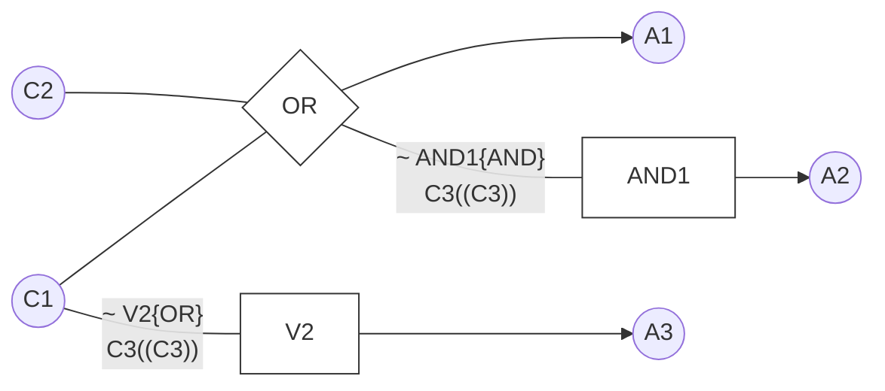

*(ビジュアル参照: [ISO_IEC_IEEE_29119-4-FDIS_page-0085.jpg](file:///c:/dev/Antigravity/ATRS%20%E5%A4%96%E9%83%A8%E8%A8%AD%E8%A8%88%E6%9B%B8%20Markdown%E5%8C%96/00_Source_Materials/ISO-IEC-IEEE-29119-4-FDIS/ISO-IEC-IEEE-29119-4-FDIS/ISO-IEC-IEEE-29119-4-FDIS_page-0085.jpg))*

**図 14 — 原因結果グラフ法における原因と結果の間の関係を示すための表記法** {#Figure_14}

| 表記 | 図 | 説明 |
| :--- | :---: | :--- |
| **等価 (Identity)** | C1 --- A1 | X が真の場合のみ、ノード Y が真となる。<br>X = T ならば Y = T、さもなくば Y = F |
| **否定 (Not)** | C1 --~-- A1 | X が偽の場合のみ、ノード Y が真となる。<br>X = F ならば Y = T、さもなくば Y = F |
| **論理積 (And)** | C1, C2 --^-- A1 | X と Y の両方が真の場合のみ、ノード Z が真となる。<br>X = T かつ Y = T ならば Z = T、さもなくば Z = F |
| **論理和 (Or)** | C1, C2 --v-- A1 | X または Y のいずれかが真の場合に、ノード Z が真となる。<br>X = T または Y = T ならば Z = T、さもなくば Z = F |
| **否定論理積 (Nand)** | C1, C2 --~^-- A1 | X または Y、あるいはその両方が偽の場合に、ノード Z が真となる。<br>X = F または Y = F ならば Z = T、さもなくば Z = F |
| **否定論理和 (Nor)** | C1, C2 --~v-- A1 | X も Y も真でない場合にのみ、ノード Z が真となる。<br>X = T または Y = T ならば Z = F、さもなくば Z = T |

*(ビジュアル参照: [ISO_IEC_IEEE_29119-4-FDIS_page-0086.jpg](file:///c:/dev/Antigravity/ATRS%20%E5%A4%96%E9%83%A8%E8%A8%AD%E8%A8%88%E6%9B%B8%20Markdown%E5%8C%96/00_Source_Materials/ISO-IEC-IEEE-29119-4-FDIS/ISO-IEC-IEEE-29119-4-FDIS/ISO-IEC-IEEE-29119-4-FDIS_page-0086.jpg))*

**図 15 — 原因結果グラフ法における原因および結果の制約を表すための表記法** {#Figure_15}

| 制約 | 説明 |
| :--- | :--- |
| **排他 (E: Exclusive)** | 原因 X と原因 Y は同時に真になることはできない。<br>X = 1 ならば Y = 0、Y = 1 ならば X = 0。両方同時に偽になることは可能。 |
| **包含 (I: Inclusive)** | 原因 X と原因 Y は同時に偽になることはできない。<br>X = 0 ならば Y = 1、Y = 0 ならば X = 1。両方同時に真になることは可能。 |
| **唯一 (O: One and only one)** | 原因 X と原因 Y のうち、唯一 1 つだけが真でなければならない。<br>X = 1 ならば Y = 0、Y = 1 ならば X = 0。両方同時に真または偽になることはできない。 |
| **必要 (R: Requires)** | 原因 X が真であるときは常に、原因 Y も真でなければならない。<br>X = 1 ならば Y = 1、X = 0 ならば Y = 1 または Y = 0。 |
| **マスク (M: Masks)** | 結果 X が真であるときは常に、結果 Y は強制的に偽となる。<br>X = 1 ならば Y = 0。 |

注記 この箇条で実演されている例には以下の「制約」表記は必要ありませんが、原因間の関係および結果間の関係において、必須、許可、禁止の関係を特定する上で利点があるため、ここに含めています。このような制約関係は意思決定表には明示的に記載されず、仕様上暗黙的であることが多いです。これらの表記は、原因結果グラフ、意思決定表、およびそれらから導出されるテストケースの整合性を検証するための手段を提供します。

##### B.2.7.5 ステップ 3: テスト網羅項目の導出 (TD3) {#Section_B.2.7.5}

その後、原因結果グラフは意思決定表の形式に書き直され（例については (Myers 1979) および (Nursimulu and Probert 1995) を参照）、これによりテスト網羅項目（すなわち、意思決定表内の実現可能な意思決定規則）を特定できます。意思決定表の各列が 1 つの意思決定規則です。表は 2 つの部分で構成されます。最初の部分は、各意思決定規則を原因に対して表にしたものです。「T」は原因がその意思決定規則に適用されるために TRUE でなければならないことを示し、「F」は原因がその意思決定規則に適用されるために FALSE でなければならないことを示します。2 番目の部分は、各意思決定規則を結果に対して表にしたものです。「T」は結果が発生することを示し、「F」は結果が発生しないことを示します。アスタリスク（*）は、原因の組み合わせが実現不可能であり、その意思決定規則に対して結果が定義されていないことを示します。

この事例には以下の意思決定表があり、6 つのテスト網羅項目が特定されています（意思決定規則 7 と 8 は実現不可能であるため、テスト網羅項目ではありません）。

*(ビジュアル参照: [ISO_IEC_IEEE_29119-4-FDIS_page-0087.jpg](file:///c:/dev/Antigravity/ATRS%20%E5%A4%96%E9%83%A8%E8%A8%AD%E8%A8%88%E6%9B%B8%20Markdown%E5%8C%96/00_Source_Materials/ISO-IEC-IEEE-29119-4-FDIS/ISO-IEC-IEEE-29119-4-FDIS/ISO-IEC-IEEE-29119-4-FDIS_page-0087.jpg))*

**表 30 — 小切手引き落とし関数の意思決定表** {#Table_30}

| 意思決定規則 | 1 | 2 | 3 | 4 | 5 | 6 | 7 | 8 |
| :--- | :---: | :---: | :---: | :---: | :---: | :---: | :---: | :---: |
| C1: 新しい残高が黒字である | F | F | F | F | T | T | T | T |
| C2: 新しい残高が当座貸越だが、許可された限度額内である | F | F | T | T | F | F | T | T |
| C3: 口座が郵便用である | F | T | F | T | F | T | F | T |
| A1: 引き落としを処理する | F | F | T | T | T | T | * | * |
| A2: 口座を停止する | F | T | F | F | F | F | * | * |
| A3: 手紙を送付する | T | T | T | T | F | T | * | * |

##### B.2.7.6 ステップ 4: テストケースの導出 (TD4) {#Section_B.2.7.6}

テストケースは、意思決定表からまだテストケースに含まれていない実現可能な意思決定規則を一度に 1 つ以上選択し、意思決定規則の原因と結果を実行するための入力を特定し、テストケースごとに必要な他の入力変数の任意の有効な値を決定し、期待される結果を決定し、すべての実現可能な意思決定規則が網羅されるまでこれらのステップを繰り返すことによって導出されます。以下のテストケースは 100% の原因結果網羅率を達成し、上記の意思決定表の意思決定規則に対応しています（意思決定規則 7 と 8 は実現不可能であるため、テストケースは生成されません）。

**表 31 — 小切手引き落とし関数のテストケース表** {#Table_31}

| テストケース | 口座タイプ | 当座貸越限度額 | 現在の残高 | 引き落とし額 | 新しい残高 | アクションコード | テスト網羅項目 |
| :---: | :---: | :---: | :---: | :---: | :---: | :---: | :---: |
| 1 | 'c' | £100 | -£70 | £50 | -£70 | 'L' | 1 |
| 2 | 'p' | £1500 | £420 | £2000 | £420 | 'S&L' | 2 |
| 3 | 'c' | £250 | £650 | £800 | -£150 | 'D&L' | 3 |
| 4 | 'p' | £750 | -£500 | £200 | -£700 | 'D&L' | 4 |
| 5 | 'c' | £1000 | £2100 | £1200 | £900 | 'D' | 5 |
| 6 | 'p' | £500 | £250 | £150 | £100 | 'D&L' | 6 |

##### B.2.7.7 ステップ 5: テストセットの構築 (TD5) {#Section_B.2.7.7}

すべての意思決定規則を網羅するために必要なテストケースは 6 つだけなので、すべてのテストケースを手動とし、それらすべてを 1 つのテストセットに配置することが決定される場合があります。

- TS1: テストケース 1, 2, 3, 4, 5, 6

##### B.2.7.8 ステップ 6: テスト手順の導出 (TD6) {#Section_B.2.7.8}

すべてのテストケースが 1 つのテストセットにあるため、1 つのテスト手順を導出できます。

- TP1: TS1 内のすべてのテストケースを、テストセットで指定された順序で網羅する。

##### B.2.7.9 原因結果グラフ法の網羅率 {#Section_B.2.7.9}

箇条 6.2.7 で提供されている式と、上記で導出されたテスト網羅項目を使用すると、次のようになります。

$網羅率_{(原因結果グラフ法)} = \frac{6}{6} \times 100\% = 100\%$

これにより、原因結果グラフ法に対するテスト網羅項目の 100% 網羅が達成されました。

#### B.2.8 状態遷移テスト (State Transition Testing) {#Section_B.2.8}

##### B.2.8.1 はじめに {#Section_B.2.8.1}

*(ビジュアル参照: [ISO_IEC_IEEE_29119-4-FDIS_page-0088.jpg](file:///c:/dev/Antigravity/ATRS%20%E5%A4%96%E9%83%A8%E8%A8%AD%E8%A8%88%E6%9B%B8%20Markdown%E5%8C%96/00_Source_Materials/ISO-IEC-IEEE-29119-4-FDIS/ISO-IEC-IEEE-29119-4-FDIS/ISO-IEC-IEEE-29119-4-FDIS_page-0088.jpg))*

状態遷移テストの目的は、選択された網羅レベルに従って、テストアイテムの遷移および／または状態を網羅するテストケースのセットを導出することです。この技法は、テストアイテムの振る舞いを状態遷移によってモデル化するために、テストアイテムのテストベースを分析することに基づいています。

##### B.2.8.2 仕様 {#Section_B.2.8.2}

以下のテストベースを持つテストアイテム *manage_display_changes* について考えます。

*「このテストアイテムは、時刻表示デバイスの外部保持表示モードを変更するための入力要求に応答する。外部表示モードは、4 つの値のうちの 1 つに設定できる。2 つは時刻または日付のいずれかを表示することに対応し、他の 2 つは時刻または日付のいずれかを変更する際に使用されるモードに対応する。」*

*「入力要求には、'Change Mode'、'Reset'、'Time Set'、'Date Set' の 4 つがある。'Change Mode' 入力要求は、表示モードを '時刻表示' と '日付表示' の値の間で移動させる。表示モードが '時刻表示' または '日付表示' に設定されている場合、'Reset' 入力要求は、表示モードを対応する '時刻変更' または '日付変更' モードに設定させる。'Time Set' 入力要求は、表示モードを '時刻変更' から '時刻表示' に戻させ、同様に 'Date Set' 入力要求は、表示モードを '日付変更' から '日付表示' に戻させる。」*

##### B.2.8.3 ステップ 1: フィーチャセットの特定 (TD1) {#Section_B.2.8.3}

テストベースで定義されているテストアイテムは 1 つだけなので、フィーチャを 1 つだけ定義する必要があります。

- FS1: manage_display_changes

##### B.2.8.4 ステップ 2: テスト条件の導出 (TD2) {#Section_B.2.8.4}

テスト条件として状態モデルが作成されます。状態遷移図 (STD) は状態モデルとして一般的によく使用され、その表記法を以下に示します。STD は、状態、遷移、イベント、およびアクションで構成されます（図 16 参照）。イベントは常に入力によって引き起こされます。遷移は出力を伴う可能性があります。アクションからの出力は、テストアイテムの現在の状態を特定するために不可欠な場合があります。遷移は、現在の状態とイベントによって決定され、通常は単に「イベント／アクション」というラベルが付けられます。箇条 5.2.8.1 で説明されているように、状態遷移テストでは、テストの網羅要件に応じて、状態モデルのすべての状態、状態モデルのすべての遷移、または状態モデル全体がテスト条件となる場合があります。

**図 16 — 一般的な状態モデル** {#Figure_16}

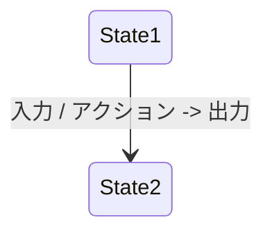

テストアイテム *manage_display_changes* の STD は次のとおりです（この例ではテスト条件 TCOND1 となります）。

*(ビジュアル参照: [ISO_IEC_IEEE_29119-4-FDIS_page-0089.jpg](file:///c:/dev/Antigravity/ATRS%20%E5%A4%96%E9%83%A8%E8%A8%AD%E8%A8%88%E6%9B%B8%20Markdown%E5%8C%96/00_Source_Materials/ISO-IEC-IEEE-29119-4-FDIS/ISO-IEC-IEEE-29119-4-FDIS/ISO-IEC-IEEE-29119-4-FDIS_page-0089.jpg))*

**図 17 — manage_display_changes の状態遷移図** {#Figure_17}

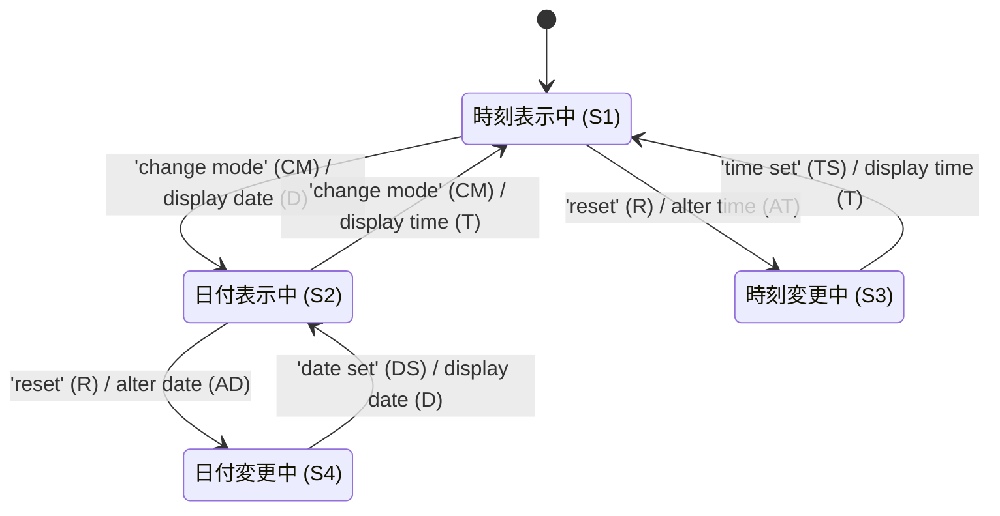

##### B.2.8.5 ステップ 3: テスト網羅項目の導出 - 0-スイッチおよび「全遷移」テスト (TD3) {#Section_B.2.8.5}

選択された網羅レベルが「全遷移」であると仮定すると、すべての有効な遷移および無効な遷移（必要なテスト網羅項目）を表すために状態テーブルを作成できます。完全な 0-スイッチ網羅を達成するには、有効な遷移のみを実行する必要があります。

0-スイッチ網羅の限界は、テストがテストアイテム内の有効な遷移のみを実行するように導出されることです。テストアイテムのより徹底的なテストでは、無効な遷移の発生（「全遷移」）も試みます。STD は有効な遷移のみを明示的に示しています（示されていないすべての遷移は無効と見なされます）。有効な遷移と無効な遷移の両方を明示的に示す状態モデルの 1 つの例は状態テーブルであり、別の表現方法は、すべての無効な遷移が終了する「例外（anomalous）」状態を含む状態遷移図です。状態テーブルに使用される表記法の 1 つを以下に簡単に説明します。

**表 32 — 状態テーブルの表記法** {#Table_32}

| | 入力 1 | 入力 2 | など |
| :--- | :--- | :--- | :--- |
| **開始状態 1** | エントリ A | エントリ B | など |
| **開始状態 2** | エントリ C | エントリ D | など |
| など | など | など | など |

ここで、エントリ X = 与えられた開始状態と入力に対する 終了状態 / 出力 または アクション です。

*manage_display_changes* の状態テーブルを以下に示します。

*(ビジュアル参照: [ISO_IEC_IEEE_29119-4-FDIS_page-0090.jpg](file:///c:/dev/Antigravity/ATRS%20%E5%A4%96%E9%83%A8%E8%A8%AD%E8%A8%88%E6%9B%B8%20Markdown%E5%8C%96/00_Source_Materials/ISO-IEC-IEEE-29119-4-FDIS/ISO-IEC-IEEE-29119-4-FDIS/ISO-IEC-IEEE-29119-4-FDIS_page-0090.jpg))*

**表 33 — manage_display_changes の状態テーブル** {#Table_33}

| | CM | R | TS | DS |
| :--- | :---: | :---: | :---: | :---: |
| **S1** | S2/D | S3/AT | S1/– | S1/– |
| **S2** | S1/T | S4/AD | S2/– | S2/– |
| **S3** | S3/– | S3/– | S1/T | S3/– |
| **S4** | S4/– | S4/– | S4/– | S2/D |

Any entry where the state remains the same *and* the action is shown as null (–) represents a null transition, where any *actual* transition that can be induced will represent a failure. It is the testing of these null transitions that is ignored by test sets designed just to achieve coverage of valid test coverage items (0-switch). Thus a more complete test set ("all transitions") will test both possible transitions and null transitions, which means testing the response of the test item to all inputs specified in the test basis in all possible states. The state table provides an ideal means of directly deriving test coverage items to cover null transitions (for "all transition" coverage).

上記の表で、状態が変化せず、かつアクションがヌル（–）として示されているエントリはすべてヌル遷移を表しており、誘発される可能性のある「実際の」遷移はすべて失敗を表します。有効なテスト網羅項目（0-スイッチ）の網羅を達成するためだけに設計されたテストセットでは、これらのヌル遷移のテストは無視されます。したがって、より完全なテストセット（「全遷移」）では、可能な遷移とヌル遷移の両方をテストします。これは、すべての可能な状態において、テストベースで指定されたすべての入力に対するテストアイテムの応答をテストすることを意味します。状態テーブルは、ヌル遷移（「全遷移」網羅用）を網羅するためのテスト網羅項目を直接導出するための理想的な手段を提供します。

上記のテーブルには、4 つの「可能な」入力が 4 つの「可能な」状態で発生するそれぞれのケースを表す 16 個のエントリがあり、これらは「全遷移」網羅のための 16 個のテスト網羅項目となります。これらは以下に示すように状態テーブルから読み取ることができます。

**表 34 — manage_display_changes の状態テーブルからテストケーステーブルへのマッピング** {#Table_34}

| | CM | R | TS | DS |
| :--- | :---: | :---: | :---: | :---: |
| **S1** | S2/D<br>(TCOVER1) | S3/AT<br>(TCOVER2) | S1/–<br>(TCOVER3) | S1/–<br>(TCOVER4) |
| **S2** | S1/T<br>(TCOVER5) | S4/AD<br>(TCOVER6) | S2/–<br>(TCOVER7) | S2/–<br>(TCOVER8) |
| **S3** | S3/–<br>(TCOVER9) | S3/–<br>(TCOVER10) | S1/T<br>(TCOVER11) | S3/–<br>(TCOVER12) |
| **S4** | S4/–<br>(TCOVER13) | S4/–<br>(TCOVER14) | S4/–<br>(TCOVER15) | S2/D<br>(TCOVER16) |

したがって、上記の状態テーブルから、「全遷移」網羅のために以下の（有効および無効な）テスト網羅項目が特定されました。

- TCOVER1: S1 から S2 へ、入力 CM（FS1 用、有効な遷移）
- TCOVER2: S1 から S3 へ、入力 R（FS1 用、有効な遷移）
- TCOVER3: S1 から S1 へ、入力 TS（FS1 用、無効な遷移）
- TCOVER4: S1 から S1 へ、入力 DS（FS1 用、無効な遷移）
- TCOVER5: S2 から S1 へ、入力 CM（FS1 用、有効な遷移）
- TCOVER6: S2 から S4 へ、入力 R（FS1 用、有効な遷移）
- TCOVER7: S2 から S2 へ、入力 TS（FS1 用、無効な遷移）
- TCOVER8: S2 から S2 へ、入力 DS（FS1 用、無効な遷移）
- TCOVER9: S3 から S3 へ、入力 CM（FS1 用、無効な遷移）
- TCOVER10: S3 から S3 へ、入力 R（FS1 用、無効な遷移）
- TCOVER11: S3 から S1 へ、入力 TS（FS1 用、有効な遷移）
- TCOVER12: S3 から S3 へ、入力 DS（FS1 用、無効な遷移）
- TCOVER13: S4 から S4 へ、入力 CM（FS1 用、無効な遷移）
- TCOVER14: S4 から S4 へ、入力 R（FS1 用、無効な遷移）
- TCOVER15: S4 から S4 へ、入力 TS（FS1 用、無効な遷移）
- TCOVER16: S4 から S2 へ、入力 DS（FS1 用、有効な遷移）

##### B.2.8.6 ステップ 4: 有効なテストケースの導出 (TD4) {#Section_B.2.8.6}

*(ビジュアル参照: [ISO_IEC_IEEE_29119-4-FDIS_page-0091.jpg](file:///c:/dev/Antigravity/ATRS%20%E5%A4%96%E9%83%A8%E8%A8%AD%E8%A8%88%E6%9B%B8%20Markdown%E5%8C%96/00_Source_Materials/ISO-IEC-IEEE-29119-4-FDIS/ISO-IEC-IEEE-29119-4-FDIS/ISO-IEC-IEEE-29119-4-FDIS_page-0091.jpg))*

###### B.2.8.6.1 オプション {#Section_B.2.8.6.1}

これで、可能な各遷移（STD の略称ラベルを使用）を実行するためのテストケースを導出できます。各テストケースで網羅する遷移を実行するための入力は STD から特定でき、期待される結果も、STD における遷移の期待される出力と終了状態を組み合わせることによって特定できます。テストケースは、1 つから *n* 個の遷移を網羅するように導出できます（*n* は可能な遷移の最大数です）。例えば、0-スイッチまたは 1-スイッチ網羅のためにテストケースを導出できます（実際には 0-スイッチと 1-スイッチの両方のテストケースを導出する必要はありませんが、ここではアプローチを説明するために両方を実演します）。また、無効な遷移を網羅するためのテストケースも導出できます。以下の 3 つのシナリオを実演します。

###### B.2.8.6.2 ステップ 4a: 0-スイッチテストケースの導出（有効な遷移） {#Section_B.2.8.6.2}

以下の 6 つのテストケースは 0-スイッチテスト網羅を提供します。各テストケースは、すべての遷移が 1 つのテストケースによって網羅されるまで、遷移を選択し、STD から入力、期待される出力、および終了状態を特定することによって導出されます。

**表 35 — manage_display_changes の 0-スイッチテストケース** {#Table_35}

| テストケース | 1 | 2 | 3 | 4 | 5 | 6 |
| :--- | :---: | :---: | :---: | :---: | :---: | :---: |
| **開始状態** | S1 | S1 | S2 | S2 | S3 | S4 |
| **入力** | CM | R | CM | R | TS | DS |
| **期待結果（出力）** | D | AT | T | AD | T | D |
| **終了状態** | S2 | S3 | S1 | S4 | S1 | S2 |
| **テスト網羅項目** | 1 | 2 | 5 | 6 | 11 | 16 |

注記 上記の表の 6 つのテストケースに対してテスト手順を作成し、あるテストケースの「終了状態」が次のテストケースの開始状態になるように順次実行できるようにすることができます（例：実行順序 5, 1, 4, 6, 3, 2）。これについてはステップ 5 で詳しく説明します。

これは、テストケース 1 の場合、開始状態が 時刻表示中 (S1)、入力が 'change mode' (CM)、期待される出力が 'display date' (D)、終了状態が 日付表示中 (S2) であることを示しています。

これらの 6 つのテストケースは、各「有効な」遷移を実行し、0-スイッチ網羅 (Cho 1987) を達成します。このレベルの網羅率を達成するために作成されたテストは、最も明白な誤った遷移や出力を検出しますが、遷移のシーケンスを実行することによってのみ検出可能な、より微妙な欠陥を検出する能力には限界があります。

###### B.2.8.6.3 ステップ 4b: 無効な遷移のテストケースの導出 {#Section_B.2.8.6.3}

無効な遷移を網羅するテストケースは、以下のように定義できます。ここで「–」はヌル遷移を表します。

**表 36 — manage_display_changes の無効なテストケース** {#Table_36}

| テストケース | 7 | 8 | 9 | 10 | 11 | 12 | 13 | 14 | 15 | 16 |
| :--- | :---: | :---: | :---: | :---: | :---: | :---: | :---: | :---: | :---: | :---: |
| **開始状態** | S1 | S1 | S2 | S2 | S3 | S3 | S3 | S4 | S4 | S4 |
| **入力** | TS | DS | TS | DS | CM | R | DS | CM | R | TS |
| **期待結果（出力）** | – | – | – | – | – | – | – | – | – | – |
| **終了状態** | S1 | S1 | S2 | S2 | S3 | S3 | S3 | S4 | S4 | S4 |
| **テスト網羅項目** | 3 | 4 | 7 | 8 | 9 | 10 | 12 | 13 | 14 | 15 |

*(ビジュアル参照: [ISO_IEC_IEEE_29119-4-FDIS_page-0092.jpg](file:///c:/dev/Antigravity/ATRS%20%E5%A4%96%E9%83%A8%E8%A8%AD%E8%A8%88%E6%9B%B8%20Markdown%E5%8C%96/00_Source_Materials/ISO-IEC-IEEE-29119-4-FDIS/ISO-IEC-IEEE-29119-4-FDIS/ISO-IEC-IEEE-29119-4-FDIS_page-0092.jpg))*

上記の表が示すように、無効なテスト網羅項目を網羅するテストケースは、開始状態からの遷移を引き起こすべきではありません。上記の 2 つの表のテストケースを組み合わせることで、「全遷移」網羅が達成されます。

###### B.2.8.6.4 ステップ 4c: テスト網羅項目の導出 - 1-スイッチテスト (TD3) {#Section_B.2.8.6.4}

1-スイッチ網羅を達成するために、STD から以下のテスト網羅項目を導出できます。

- TCOVER17: S1 から S2、そして S1 へ（入力 CM および CM、FS1 用）
- TCOVER18: S1 から S2、そして S4 へ（入力 CM および R、FS1 用）
- TCOVER19: S1 から S3、そして S1 へ（入力 R および TS、FS1 用）
- TCOVER20: S3 から S1、そして S2 へ（入力 TS および CM、FS1 用）
- TCOVER21: S3 から S1、そして S3 へ（入力 TS および R、FS1 用）
- TCOVER22: S2 から S1、そして S2 へ（入力 CM および CM、FS1 用）
- TCOVER23: S2 から S1、そして S3 へ（入力 CM および R、FS1 用）
- TCOVER24: S2 から S4、そして S2 へ（入力 R および DS、FS1 用）
- TCOVER25: S4 から S2、そして S1 へ（入力 DS および CM、FS1 用）
- TCOVER26: S4 から S2、そして S4 へ（入力 DS および R、FS1 用）

###### B.2.8.6.5 ステップ 4d: 1-スイッチテストケースの導出 (TD4) {#Section_B.2.8.6.5}

ステップ TD3 で選択されたテスト網羅が、すべての 1-スイッチ遷移を網羅することであった場合、可能なすべての遷移の連続ペアを実行するためのテストケースを作成できます。この例では、以下のように 10 個あります。

**表 37 — manage_display_changes の 1-スイッチテストケース** {#Table_37}

| テストケース | 17 | 18 | 19 | 20 | 21 | 22 | 23 | 24 | 25 | 26 |
| :--- | :---: | :---: | :---: | :---: | :---: | :---: | :---: | :---: | :---: | :---: |
| **開始状態** | S1 | S1 | S1 | S3 | S3 | S2 | S2 | S2 | S4 | S4 |
| **入力 1** | CM | CM | R | TS | TS | CM | CM | R | DS | DS |
| **期待結果 1（出力）** | D | D | AT | T | T | T | T | AD | D | D |
| **次状態** | S2 | S2 | S3 | S1 | S1 | S1 | S1 | S4 | S2 | S2 |
| **入力 2** | CM | R | TS | CM | R | CM | R | DS | CM | R |
| **期待結果 2（出力）** | T | AD | T | D | AT | D | AT | D | T | AD |
| **終了状態** | S1 | S4 | S1 | S2 | S3 | S2 | S3 | S2 | S1 | S4 |
| **テスト網羅項目** | 17 | 18 | 19 | 20 | 21 | 22 | 23 | 24 | 25 | 26 |

これは、テストケース 17 が 2 つの遷移で構成されていることを示しています。最初の遷移では、開始状態は 時刻表示中 (S1)、最初の入力は 'change mode' (CM)、中間で期待される出力は 日付表示 (D)、次の状態は 日付表示中 (S2) です。2 番目の遷移では、2 番目の入力は 'change mode' (CM)、最終的に期待される出力は 時刻表示 (T)、終了状態は 時刻表示中 (S1) です。中間状態、および各遷移の入力と出力が明示的に定義されていることに注意してください。

必要なテストの徹底度に応じて、より長い遷移シーケンスをテストし、より高いレベルのスイッチ網羅を達成することも可能です。

##### B.2.8.7 ステップ 5: テストセットの構築 (TD5) {#Section_B.2.8.7}

すべての 0-スイッチテストケース（有効な遷移を網羅）を 1 つのテストセットに、無効な遷移を網羅する「全遷移」テストケースを別のテストセットに、そしてすべての 1-スイッチテストケースを 3 番目のテストセットにまとめることが決定される場合があります。

- TS1: 0-スイッチテストケース – テストケース 1, 2, 3, 4, 5, 6
- TS2: 「全遷移」無効テストケース – テストケース 7, 8, 9, 10, 11, 12, 13, 14, 15, 16
- TS3: 1-スイッチテストケース – テストケース 17, 18, 19, 20, 21, 22, 23, 24, 25, 26

注記 1 場合によっては、あるテストケースの「終了状態」が次のテストケースの開始状態になるように個々のテストケースを順序付けることができます。これにより、テスト実行中の効率が向上します。これが可能かどうかは、テストされる特定の状態モデルによって異なります。上記の例では、以下のテストケースの順序付けによってこの目的が達成されます。
TS1: 0 スイッチテストケース – テストケース 5, 1, 4, 6, 3, 2

*(ビジュアル参照: [ISO_IEC_IEEE_29119-4-FDIS_page-0093.jpg](file:///c:/dev/Antigravity/ATRS%20%E5%A4%96%E9%83%A8%E8%A8%AD%E8%A8%88%E6%9B%B8%20Markdown%E5%8C%96/00_Source_Materials/ISO-IEC-IEEE-29119-4-FDIS/ISO-IEC-IEEE-29119-4-FDIS/ISO-IEC-IEEE-29119-4-FDIS_page-0093.jpg))*

注記 2 上記で定義された 1-スイッチテストケースは 0-スイッチテストケースのすべてのパスを網羅しているため、0-スイッチテストケースのためにテストセットやテスト手順を定義する必要はありません。ただし、完全を期すためにここに含まれています。

##### B.2.8.8 ステップ 6: テスト手順の導出 (TD6) {#Section_B.2.8.8}

ステップ 5 で定義された順序ですべてのテストケースを実行するために、1 つのテスト手順を定義できます。

- TP1: TS1、TS2、および TS3 のすべてのテストケースを、テストセットで定義された順序で網羅する。

##### B.2.8.9 状態遷移テストの網羅率 {#Section_B.2.8.9}

箇条 6.2.8 で提供されている式と、上記で導出されたテスト網羅項目を使用すると、次のようになります。

$網羅率_{(0-スイッチ網羅)} = \frac{6}{6} \times 100\% = 100\%$

$網羅率_{(全遷移網羅)} = \frac{16}{16} \times 100\% = 100\%$
$網羅率_{(1-スイッチ網羅)} = \frac{10}{10} \times 100\% = 100\%$

これにより、0-スイッチテスト、1-スイッチテスト、および全遷移テストに対するテスト網羅項目の 100% 網羅が達成されました。

#### B.2.9 ユースケーステスト (Use Case Testing) {#Section_B.2.9}

##### B.2.9.1 はじめに {#Section_B.2.9.1}

*(ビジュアル参照: [ISO_IEC_IEEE_29119-4-FDIS_page-0093.jpg](file:///c:/dev/Antigravity/ATRS%20%E5%A4%96%E9%83%A8%E8%A8%AD%E8%A8%88%E6%9B%B8%20Markdown%E5%8C%96/00_Source_Materials/ISO-IEC-IEEE-29119-4-FDIS/ISO-IEC-IEEE-29119-4-FDIS/ISO-IEC-IEEE-29119-4-FDIS_page-0093.jpg))*

ユースケーステスト（またはシナリオテスト）の目的は、テストベースから導出されたシナリオを実行することです。

##### B.2.9.2 例 1 {#Section_B.2.9.2}

###### B.2.9.2.1 仕様 {#Section_B.2.9.2.1}

*(ビジュアル参照: [ISO_IEC_IEEE_29119-4-FDIS_page-0093.jpg](file:///c:/dev/Antigravity/ATRS%20%E5%A4%96%E9%83%A8%E8%A8%AD%E8%A8%88%E6%9B%B8%20Markdown%E5%8C%96/00_Source_Materials/ISO-IEC-IEEE-29119-4-FDIS/ISO-IEC-IEEE-29119-4-FDIS/ISO-IEC-IEEE-29119-4-FDIS_page-0093.jpg))*

現金引き出し (*withdraw_cash*) 関数は、銀行口座を持つ顧客が ATM を介して自分の口座から資金を引き出すことを可能にします。引き出しは、開設された銀行口座を持ち、有効なカードと一致する PIN を持ち、動作している ATM を使用しているユーザーのみが行うことができます。引き出しが完了すると、口座残高から引き出し額が差し引かれ、引き出しのレシートが印刷され、ATM は次のユーザーが利用可能な状態になります。

###### B.2.9.2.2 ステップ 1: フィーチャセットの特定 (TD1) {#Section_B.2.9.2.2}

テストベースで定義されているテストアイテムは 1 つだけなので、フィーチャセットを 1 つだけ定義する必要があります。

- FS1: 現金引き出し (*withdraw_cash*) 関数

###### B.2.9.2.3 ステップ 2: テスト条件の導出 (TD2) {#Section_B.2.9.2.3}

テスト条件の特定を可能にするために、各シナリオに存在するシナリオ（およびその中のアクティビティ）を特定するテストアイテムのモデルを作成する必要があります。以下の例のモデルは、イベントフロー図です。この表記法では、「メイン」パスは太い黒線で表され、ワークフローの開始点と終了点にラベルが付けられ、各アクションにはユーザー (U) またはシステム (S)（すなわちテストアイテム）のアクションであることを示す一意の識別子が付けられます。

**図 18 — 現金引き出し (*withdraw_cash*) 関数のイベントフロー図** {#Figure_18}

*(ビジュアル参照: [ISO_IEC_IEEE_29119-4-FDIS_page-0095.jpg](file:///c:/dev/Antigravity/ATRS%20%E5%A4%96%E9%83%A8%E8%A8%AD%E8%A8%88%E6%9B%B8%20Markdown%E5%8C%96/00_Source_Materials/ISO-IEC-IEEE-29119-4-FDIS/ISO-IEC-IEEE-29119-4-FDIS/ISO-IEC-IEEE-29119-4-FDIS_page-0095.jpg))*

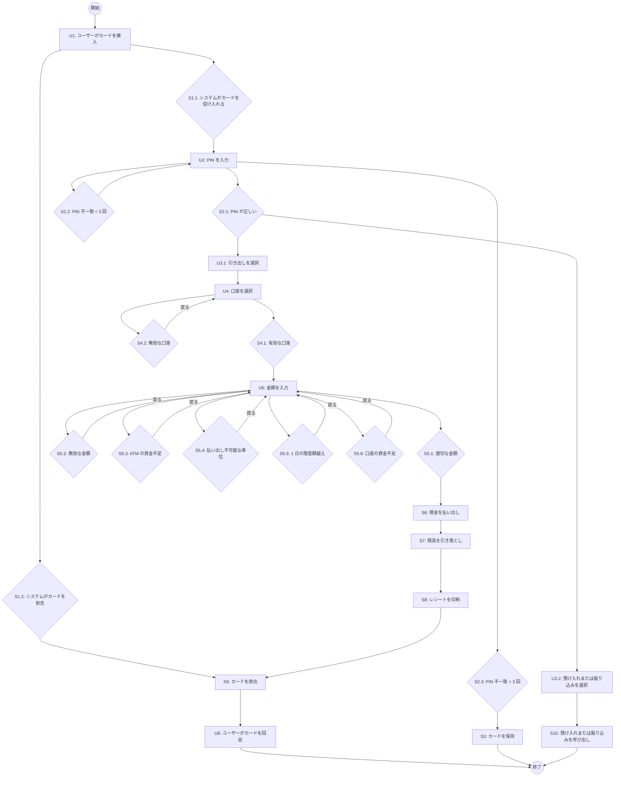

ユースケーステストでは、テスト条件は、テスト中に網羅されるメインパスおよび代替シナリオです（すなわち、1 つのシナリオを構成するイベントフロー図を通じたユーザーとシステムの相互作用のシーケンスです）。仕様では、1 つのメインシナリオと 10 の代替シナリオを含む 11 のシナリオが説明されていました。これらは、以下のように（FS1 を網羅する）テスト条件として記述できます。

- TCOND1: 資金の引き出しに成功（U1, S1.1, U2, S2.1, U3.1, U4, S4.1, U5, S5.1, S6, S7, S8, S9, U6 を網羅）
- TCOND2: ユーザーのカードが ATM で認識されない（U1, S1.2, S9, U6 を網羅）
- TCOND3: ユーザーが PIN を 3 回未満間違える（U1, S1.1, U2, S2.2 を網羅）
- TCOND4: ユーザーが PIN を 3 回間違える（U1, S1.1, U2, S2.2, U2, S2.2, U2, S2.3, S3 を網羅）
- TCOND5: ユーザーが預け入れまたは振り込みを選択（U1, S1.1, U2, S2.1, U3.2, S10 を網羅）
- TCOND6: ユーザーが誤った口座を選択（U1, S1.1, U2, S2.1, U3.1, U4, S4.2 を網羅）
- TCOND7: ユーザーが無効な引き出し額を入力（U1, S1.1, U2, S2.1, U3.1, U4, S4.1, U5, S5.2 を網羅）
- TCOND8: ATM の現金が不足している（U1, S1.1, U2, S2.1, U3.1, U4, S4.1, U5, S5.3 を網羅）
- TCOND9: ユーザーが払い出し不可能な金額を入力（U1, S1.1, U2, S2.1, U3.1, U4, S4.1, U5, S5.4 を網羅）
- TCOND10: ユーザーが 1 日の限度額を超える金額を入力（U1, S1.1, U2, S2.1, U3.1, U4, S4.1, U5, S5.5 を網羅）
- TCOND11: ユーザーの口座の資金が不足している（U1, S1.1, U2, S2.1, U3.1, U4, S4.1, U5, S5.6 を網羅）

###### B.2.9.2.4 ステップ 3: テスト網羅項目の導出 (TD3) {#Section_B.2.9.2.4}

ユースケーステストでは、テスト条件は典型的なシナリオおよび代替シナリオであり、これらはテスト網羅項目と同じです。

- TCOVER1 = TCOND1
- ...
- TCOVER11 = TCOND11

###### B.2.9.2.5 ステップ 4: テストケースの導出 (TD4) {#Section_B.2.9.2.5}

テストケースは、網羅するシナリオを選択し、テストケースによって網羅されるパスを実行するための入力を特定し、テストの期待される結果を決定し、すべてのシナリオが必要に応じて網羅されるまで繰り返すことによって導出されます。テストケースのステップは通常、自然言語形式で記述されます。特定された各テスト網羅項目を網羅するために 1 つのテストケースが必要であると仮定すると、以下のテストケースが導出されます。

**表 38 — ユースケーステストのテストケース 1** {#Table_38}

| テストケース # | 1 |
| :--- | :--- |
| テストケース名 | 資金の引き出しに成功 |
| 実行されるシナリオパス | U1, S1.1, U2, S2.1, U3.1, U4, S4.1, U5, S5.1, S6, S7, S8, S9, U6 |
| 入力 | 有効な顧客口座を持つ有効なカード – 293910982246 を有効と仮定<br>有効な PIN – 5652 を有効かつカードに一致すると仮定<br>ATM 残高 – $50,000<br>顧客口座残高 – $100<br>引き出し額 – $50 |
| 前提条件 | 引き出しは、開設された銀行口座を持ち、有効なカードと一致する PIN を持ち、動作している ATM を使用しているユーザーのみが行うことができる。 |
| 期待結果 | 顧客口座からの引き出しに成功した。<br>ATM 残高は $49,950 である。<br>顧客口座残高は $50 である。<br>ATM は稼働中であり、入力として顧客のカードを待機している。 |
| テスト網羅項目 | TCOVER1 |

##### B.2.10 構造・経験ベース技法への参照 {#Section_B.3}

#### B.3 構造ベーステスト設計技法の適用に関するガイドラインと事例 {#Annex_C}

構造ベース技法（ステートメントテスト、ブランチテスト、意思決定テストなど）の事例については、**附属書 C** を参照してください。

$網羅率_{(全 DU パステスト)} = \frac{16}{16} \times 100\% = 100\%$

---

## 附属書 D（参考）経験ベーステスト設計技法の適用に関する事例 {#Annex_D}

*(ビジュアル参照: ISO-IEC-IEEE-29119-4-FDIS_page-0129.jpg)*

### D.1 はじめに {#Section_D.1}

この附属書は、箇条 5.4 で定義されている経験ベーステスト設計技法の適用事例を提供します。

### D.2 経験ベーステスト設計技法の事例 {#Section_D.2}

#### D.2.1 エラー推測法 (Error Guessing) {#Section_D.2.1}

##### D.2.1.1 はじめに {#Section_D.2.1.1}

この事例では、箇条 5.4.2 で定義されているエラー推測法の *generate_grading* 関数への適用を実演します。

##### D.2.1.2 仕様 {#Section_D.2.1.2}

*generate_grading* は、学生の試験の点数とコースワーク (c/w) の点数に基づいて最終評価を計算する関数です。試験の点数は 100 点満点、c/w の点数も 100 点満点です。最終得点は 2 つの点数の合計です。合計が 40 点以上の場合は 'PM'（合格）、40 点未満の場合は 'FM'（不合格）となります。

##### D.2.1.3 ステップ 1: フィーチャセットの特定 (TD1) {#Section_D.2.1.3}

- FS1: *generate_grading* 関数

##### D.2.1.4 ステップ 2: テスト条件の導出 (TD2) {#Section_D.2.1.4}

*(ビジュアル参照: ISO-IEC-IEEE-29119-4-FDIS_page-0130.jpg)*

テスト条件は、テストアイテムに存在する可能性のあるエラーの種類のリストを導出することによって特定されます。*generate_grading* 関数の場合、以下のテスト条件が導出される可能性があります。

- TCOND1: NULL を入力 (FS1 用)
- TCOND2: 0 を入力 (FS1 用)
- TCOND3: 負の数を入力 (FS1 用)
- TCOND4: 入力を逆の順序で入力 (FS1 用)
- TCOND5: 非常に大きな数（例：10 桁）を入力 (FS1 用)
- TCOND6: 非常に長いアルファベット文字列（例：10 文字）を入力 (FS1 用)

##### D.2.1.5 ステップ 3: テスト網羅項目の導出 (TD3) {#Section_D.2.1.5}

以下のテスト網羅項目を定義できます。

- TCOVER1: NULL を入力 (TCOND1 用)
- TCOVER2: 0 を入力 (TCOND2 用)
- TCOVER3: 負の数を入力 (TCOND3 用)
- TCOVER4: 入力を逆の順序で入力 (TCOND4 用)
- TCOVER5: 非常に大きな数を入力 (TCOND5 用)
- TCOVER6: 非常に長いアルファベット文字列を入力 (TCOND6 用)

##### D.2.1.6 ステップ 4: テストケースの導出 (TD4) {#Section_D.2.1.6}

**表 49 — エラー推測法のテストケース** {#Table_49}

| テストケース | 1 | 2 | 3 | 4 |
| :--- | :--- | :--- | :--- | :--- |
| 入力 (exam) | NULL | 25 | NULL | 0 |
| 入力 (c/w) | 20 | NULL | NULL | 20 |
| 合計点 (計算値) | 20 | 25 | NULL | 20 |
| テスト網羅項目 | TCOVER1 (exam) | TCOVER1 (c/w) | TCOVER1 (両方) | TCOVER2 (exam) |
| 期待結果 | 'FM' | 'FM' | 'FM' | 'FM' |

*(注記: 他のテストケース表 50, 51, 52 も同様に、負の数、巨大数、不正文字列などを網羅します。)*

##### D.2.1.9 エラー推測法の網羅率 {#Section_D.2.1.9}

箇条 6.4.1 で述べられているように、エラー推測法に対するテスト網羅項目の網羅率を計算するための業界合意されたアプローチはありません。

---

## 附属書 E（参考）入れ替え可能なテスト設計技法の適用に関するガイドラインと事例 {#Annex_E}

*(ビジュアル参照: ISO-IEC-IEEE-29119-4-FDIS_page-0132.jpg)*

### E.1 入れ替え可能なテスト設計技法に関するガイドラインと事例 {#Section_E.1}

#### E.1.1 概要 {#Section_E.1.1}

この規格で提示されている技法は、構造ベース、仕様ベース、または経験ベースに分類されていますが、実際には一部の技法を入れ替えて使用することができます（箇条 5.1 参照）。これは以下の例で実演されており、通常は構造ベース技法と呼ばれるブランチテストを、仕様ベーステストとして適用する方法を示しています。

#### E.1.2 仕様ベース技法としてのブランチテスト {#Section_E.1.2}

##### E.1.2.1 仕様 {#Section_E.1.2.1}

ユーザー名とパスワードを入力として受け取り、ユーザーが有効かどうかを判断するログイン関数の仕様例を考えます。

> コンポーネントはユーザー名とパスワードを要求する。ユーザーは正しいユーザー名を入力し、それに続く対応するパスワードを入力して、システムにログインする必要がある。ユーザーにはユーザー名とパスワードの入力にそれぞれ 3 回の試行と、それぞれ 20 秒の時間が与えられる。ユーザーが 3 回以内、かつ 20 秒以内にユーザー名とパスワードの両方を入力しなかった場合、システムはロックされ、それ以上のログイン試行は許可されない。

このコンポーネントの制御フローグラフを以下に示します。

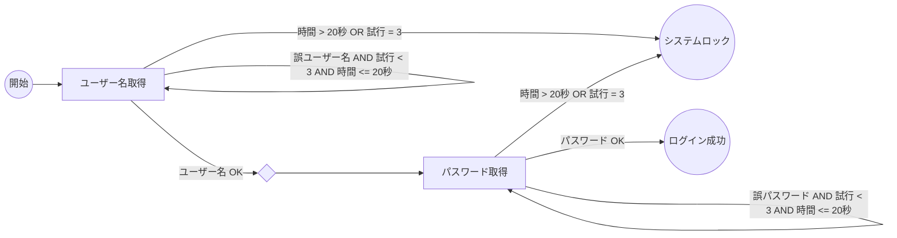

##### E.1.2.8 ブランチテストの網羅率 {#Section_E.1.2.8}

すべてのブランチ（矢印）を実行することで、100% のブランチ網羅率が達成されます。

---

## 附属書 F（参考）テスト設計技法の網羅の有効性 {#Annex_F}

### F.1 テスト設計技法の網羅の有効性 {#Section_F.1}

#### F.1.1 ガイダンス {#Section_F.1.1}

現時点で、この規格はテスト設計技法の選択やテスト完了基準に関するガイダンスを提供していません。テストケースの設計と測定技法の相対的な有効性に関する研究では、これまでのところ決定的な結果は得られていません。

理想的には、テスト完了基準として選択されるテスト網羅レベルは、可能な限り 100% であるべきです。

ある基準が別の基準を「包含（subsume）」するとは、すべてのテストアイテムとそのテストベースにおいて、最初の基準を満たすすべてのテストケーススイートが、2 番目の基準も満たす場合を指します。例えば、ブランチ網羅はステートメント網羅を包含します。

**図 21 — 構造的テスト網羅基準の半順序 (Reid 1996)** {#Figure_21}

```mermaid
graph TD
    All_Paths[全パス] --> ADU[ADU (全定義使用パス)]
    ADU --> AU[AU (全使用)]
    AU --> ACU[ACU (全 c-use)]
    ADU --> APU[APU (全 p-use)]
    BCC[BCC (全条件組合せ)] --> MCDC[MCDC]
    MCDC --> BD[BD (ブランチ/意思決定)]
    BD --> S[S (ステートメント)]
    APU --> BD
```

---

## 附属書 G（参考）ISO/IEC/IEEE 29119-4 と BSI 7925-2 のテスト設計技法の整合 {#Annex_G}

**表 53 — BSI 7925-2:1998 から ISO/IEC/IEEE 29119-4 へのテスト設計技法のマッピング** {#Table_53}

| BSI 7925-2:1998 | ISO/IEC/IEEE 29119-4 |
| :--- | :--- |
| 同値分割法 (3.1) | 同値分割法 (5.2.1) |
| 境界値分析 (3.2) | 境界値分析 (5.2.3) |
| 状態遷移テスト (3.3) | 状態遷移テスト (5.2.8) |
| ステートメントテスト (3.6) | ステートメントテスト (5.3.1) |
| ブランチ／意思決定テスト (3.7) | ブランチテスト (5.3.2) / 意思決定テスト (5.3.3) |
| データフローテスト (3.8) | データフローテスト (5.3.7) |

---

## 参考文献 {#Bibliography}

*(ビジュアル参照: ISO-IEC-IEEE-29119-4-FDIS_page-0138.jpg)*

BATH, G. and McKAY J., 2008. *The Software Test Engineer's Handbook*. O'Reilly Media, Inc.

BEIZER, B., 1995. *Black Box Testing. Techniques for Functional Testing of Software and Systems*, John Wiley & Sons Inc.

BRITISH STANDARDS INSTITUTE, 1998. BS 7925-2:1998, *Software testing — Software component testing*.

BURNSTEIN, I., 2003. *Practical Software Testing: A Process-Oriented Approach*. Springer-Verlag.

COPELAND, L., 2004. *A Practitioner's Guide to Software Test Design*. Artech House, Inc.

MANDL, R., 1985. Orthogonal Latin Squares: An Application of Experiment Design to Compiler Testing. In *Communications of the ACM*, 28(10), pp. 1054-1058.

MYERS, G., 1979. *The Art of Software Testing*. John Wiley & Sons Inc.

REID, S., 1996. Popular Misconceptions in Module Testing. In *Proceedings of the Software Testing Conference (STC)*, Washington DC.

---

## 附属書 C（参考）構造ベーステスト設計技法の適用に関するガイドラインと事例 {#Annex_C}

### C.1 構造ベーステストに関するガイドラインと事例 {#Section_C.1}

#### C.1.1 概要 {#Section_C.1.1}

この附属書は、箇条 5.3 および 6.3 で説明されている構造ベーステスト設計技法に関するガイダンスと事例を提供します。各事例は、ISO/IEC/IEEE 29119-2 で定義されているテスト設計・実装プロセスに従っています。これらの事例では、さまざまなアプリケーションとプログラミング言語が使用されています。各事例は構造ベーステストの文脈で適用されていますが、箇所 5.1 で述べられているように、実際には ISO/IEC/IEEE 29119-4 で定義されているほとんどの技法を入れ替えて使用することができます。

#### C.1.2 構造ベーステスト設計技法の事例 {#Section_C.1.2}

##### C.1.2.1 ステートメントテスト (Statement Testing) {#Section_C.1.2.1}

###### C.1.2.1.1 はじめに {#Section_C.1.2.1.1}

ステートメントテストの目的は、選択されたステートメント網羅レベルに従って、テストアイテムのステートメントを網羅するテストケースのセットを導出することです。この構造的なテスト設計技法は、テストアイテムを構成要素であるステートメントに分解することに基づいています。

考慮すべき 2 つの主要な質問は次のとおりです。
— ステートメントとは何か？
— どのステートメントが実行可能か？

一般に、ステートメントは原子的なアクションであるべきです。すなわち、ステートメントは完全に実行されるか、まったく実行されないかのいずれかである必要があります。例えば：

`IF a THEN b ENDIF`

は、条件 *a* に応じて *b* が実行される場合とされない場合があるため、複数のステートメントとして見なされます。ステートメントテストで使用される「ステートメント」の定義は、言語定義で使用されるものと同じである必要はありません。

マシンコードに関連付けられているステートメントは実行可能であると見なされます。例えば、以下のものはすべて実行可能であると見なされます。
— 代入
— ループおよび選択
— プロシージャおよび関数呼び出し
— 明示的な初期化を伴う変数宣言
— ヒープ上での変数ストレージの動的割り当て

### C.2 構造ベーステスト設計技法の事例 {#Section_C.2}

#### C.2.1 ソースコード {#Section_C.2.1}

C 言語で記述された以下のプログラム *binary_search*（ソートされた配列内の値を検索する）について考えます。

```c
/* binary_search: ソートされた配列内の値を検索する */
int binary_search(int x, int v[], int n) {
    int low, high, mid;
    low = 0;
    high = n - 1;
    while (low <= high) {
        mid = (low + high) / 2;
        if (x < v[mid])
            high = mid - 1;
        else if (x > v[mid])
            low = mid + 1;
        else /* 一致が見つかった */
            return mid;
    }
    return -1; /* 一致なし */
}
```

*binary_search* 関数の制御フローグラフを図 19 に示します。

**図 19 — binary_search の制御フローグラフ** {#Figure_19}

> [!NOTE]
> **AI 分析: 図 19 の論理構造**
> - **ノード**:
>   - ノード 1: `low = 0; high = n - 1;`
>   - ノード 2: `while (low <= high)` (述語)
>   - ノード 3: `mid = (low + high) / 2;`
>   - ノード 4: `if (x < v[mid])` (述語)
>   - ノード 5: `high = mid - 1;`
>   - ノード 6: `else if (x > v[mid])` (述語)
>   - ノード 7: `low = mid + 1;`
>   - ノード 8: `return mid;` (一致が見つかった)
>   - ノード 9: `return -1;` (一致なし)
> - **エッジ**:
>   - 1 -> 2
>   - 2 -> 3 (真 / True)
>   - 2 -> 9 (偽 / False)
>   - 3 -> 4
>   - 4 -> 5 (真 / True)
>   - 4 -> 6 (偽 / False)
>   - 5 -> [ノード 2 へループバック]
>   - 6 -> 7 (真 / True)
>   - 6 -> 8 (偽 / False / Else)
>   - 7 -> [ノード 2 へループバック]

#### C.2.2 ステートメントテスト (Statement Testing) {#Section_C.2.2}

##### C.2.2.1 ステップ 1: フィーチャセットの特定 (TD1) {#Section_C.2.2.1}

- FS1: *binary_search* 関数

##### C.2.2.2 ステップ 2: テスト条件の導出 (TD2) {#Section_C.2.2.2}

ステートメントテストのテスト条件は、テストアイテム内の実行可能なステートメントです。図 19 から、これらはノード 1, 3, 5, 7, 8 および 9 です。

- TCOND1: ステートメント 1
- TCOND2: ステートメント 3
- TCOND3: ステートメント 5
- TCOND4: ステートメント 7
- TCOND5: ステートメント 8
- TCOND6: ステートメント 9

##### C.2.2.3 ステップ 3: テスト網羅項目の導出 (TD3) {#Section_C.2.2.3}

ステートメントテストでは、テスト網羅項目はテスト条件と同等です。

- TCOVER1 = TCOND1
- ...
- TCOVER6 = TCOND6

##### C.2.2.4 ステップ 4: テストケースの導出 (TD4) {#Section_C.2.2.4}

すべてのステートメントを実行するために、3 つのテストケースが必要です。

**表 39 — binary_search のステートメントテストのテストケース** {#Table_39}

| テストケース | 1 | 2 | 3 |
| :--- | :--- | :--- | :--- |
| x (入力) | 3 | 1 | 4 |
| v[] (入力) | [1, 3, 5] | [1, 3, 5] | [1, 3, 5] |
| n (入力) | 3 | 3 | 3 |
| 期待結果 | 1 | 0 | -1 |
| 実行されるノード | 1, 2, 3, 4, 6, 8 | 1, 2, 3, 4, 5, 2, 3, 4, 6, 8 | 1, 2, 3, 4, 6, 7, 2, 3, 4, 5, 2, 9 |
| テスト網羅項目 | TCOVER1, 2, 5 | TCOVER1, 2, 3, 5 | TCOVER1, 2, 4, 3, 6 |

##### C.2.2.5 ステートメントテストの網羅率 {#Section_C.2.2.5}

箇条 6.2.2 で提供されている式を使用すると：

$網羅率_{(ステートメントテスト)} = \frac{6}{6} \times 100\% = 100\%$

#### C.2.3 ブランチテスト (Branch Testing) {#Section_C.2.3}

##### C.2.3.1 ステップ 1: フィーチャセットの特定 (TD1) {#Section_C.2.3.1}

- FS1: *binary_search* 関数

##### C.2.3.2 ステップ 2: テスト条件の導出 (TD2) {#Section_C.2.3.2}

ブランチテストのテスト条件は、テストアイテム内のブランチです。図 19 から、これらは述語（ノード 2, 4 および 6）からのエッジです。

**表 40 — binary_search のブランチテストの条件と網羅項目** {#Table_40}

| テスト条件 | ブランチ | 論理 | 網羅項目 |
| :--- | :--- | :--- | :--- |
| TCOND1 | 2 -> 3 | low <= high (真) | TCOVER1 |
| TCOND2 | 2 -> 9 | low <= high (偽) | TCOVER2 |
| TCOND3 | 4 -> 5 | x < v[mid] (真) | TCOVER3 |
| TCOND4 | 4 -> 6 | x < v[mid] (偽) | TCOVER4 |
| TCOND5 | 6 -> 7 | x > v[mid] (真) | TCOVER5 |
| TCOND6 | 6 -> 8 | x > v[mid] (偽) | TCOVER6 |

##### C.2.3.3 ステップ 3: テスト網羅項目の導出 (TD3) {#Section_C.2.3.3}

テスト網羅項目はテスト条件と同等です。

- TCOVER1: ブランチ 2 -> 3
- ...
- TCOVER6: ブランチ 6 -> 8

##### C.2.3.4 ステップ 4: テストケースの導出 (TD4) {#Section_C.2.3.4}

ステートメントテストで使用されたのと同じ 3 つのテストケースが、ブランチテストでも使用されます。

**表 41 — binary_search のブランチテストのテストケース** {#Table_41}

| テストケース | 1 | 2 | 3 |
| :--- | :--- | :--- | :--- |
| x (入力) | 3 | 1 | 4 |
| v[] (入力) | [1, 3, 5] | [1, 3, 5] | [1, 3, 5] |
| n (入力) | 3 | 3 | 3 |
| 期待結果 | 1 | 0 | -1 |
| 実行されるブランチ | 2->3, 4->6, 6->8 | 2->3, 4->5, 2->3, 4->6, 6->8 | 2->3, 4->6, 6->7, 2->3, 4->5, 2->9 |
| テスト網羅項目 | TCOVER1, 4, 6 | TCOVER1, 3, 1, 4, 6 | TCOVER1, 4, 5, 1, 3, 2 |

##### C.2.3.5 ブランチテストの網羅率 {#Section_C.2.3.5}

$網羅率_{(ブランチテスト)} = \frac{6}{6} \times 100\% = 100\%$

#### C.2.4 意思決定テスト (Decision Testing) {#Section_C.2.4}

##### C.2.4.1 ステップ 1: フィーチャセットの特定 (TD1) {#Section_C.2.4.1}

- FS1: *binary_search* 関数

##### C.2.4.2 ステップ 2: テスト条件の導出 (TD2) {#Section_C.2.4.2}

意思決定テストのテスト条件は、テストアイテム内の意思決定（デシジョン）です。これらは図 19 のノード 2, 4 および 6 にあります。

- TCOND1: ノード 2 での意思決定
- TCOND2: ノード 4 での意思決定
- TCOND3: ノード 6 での意思決定

##### C.2.4.3 ステップ 3: テスト網羅項目の導出 (TD3) {#Section_C.2.4.3}

意思決定テストでは、各意思決定に 2 つの結果（真と偽）があり、各結果がテスト網羅項目となります。

**表 42 — binary_search の意思決定網羅項目** {#Table_42}

| 意思決定 | 結果 | 網羅項目 |
| :--- | :--- | :--- |
| ノード 2 | 真 | TCOVER1 |
| ノード 2 | 偽 | TCOVER2 |
| ノード 4 | 真 | TCOVER3 |
| ノード 4 | 偽 | TCOVER4 |
| ノード 6 | 真 | TCOVER5 |
| ノード 6 | 偽 | TCOVER6 |

##### C.2.4.4 ステップ 4: テストケースの導出 (TD4) {#Section_C.2.4.4}

ステートメントおよびブランチテストで使用されたのと同じ 3 つのテストケースで、100% の意思決定網羅率も達成されます。

**表 43 — binary_search の意思決定テストのテストケース** {#Table_43}

| テストケース | 1 | 2 | 3 |
| :--- | :--- | :--- | :--- |
| x (入力) | 3 | 1 | 4 |
| v[] (入力) | [1, 3, 5] | [1, 3, 5] | [1, 3, 5] |
| n (入力) | 3 | 3 | 3 |
| 期待結果 | 1 | 0 | -1 |
| 実行される結果 | 2-真, 4-偽, 6-偽 | 2-真, 4-真, 2-真, 4-偽, 6-偽 | 2-真, 4-偽, 6-真, 2-真, 4-真, 2-偽 |
| テスト網羅項目 | TCOVER1, 4, 6 | TCOVER1, 3, 1, 4, 6 | TCOVER1, 4, 5, 1, 3, 2 |

##### C.2.4.5 意思決定テストの網羅率 {#Section_C.2.4.5}

$網羅率_{(意思決定テスト)} = \frac{6}{6} \times 100\% = 100\%$

#### C.2.4 データフローテスト (Data Flow Testing) {#Section_C.2.4_DF}

*(ビジュアル参照: ISO_IEC_IEEE_29119-4-FDIS_page-0120.jpg)*

##### C.2.4.1 はじめに {#Section_C.2.4.1_DF}

この事例では、箇条 5.3.7 で定義されているデータフローテスト技法の *Solve_Quadratic* 関数への適用を実演します。

##### C.2.4.2 仕様 {#Section_C.2.4.2_DF}

*Solve_Quadratic* は、二次方程式 $ax^2 + bx + c = 0$ の解を計算する関数です。

```c
void Solve_Quadratic (float A, float B, float C, bool *Is_Complex, float *R1, float *R2) {
    float Discrim;
    Discrim = B * B - 4 * A * C;
    if (Discrim < 0) {
        *Is_Complex = TRUE;
    } else {
        *Is_Complex = FALSE;
        *R1 = (-B + sqrt(Discrim)) / (2 * A);
        *R2 = (-B - sqrt(Discrim)) / (2 * A);
    }
}
```

*Solve_Quadratic* の制御フローグラフを以下に示します。

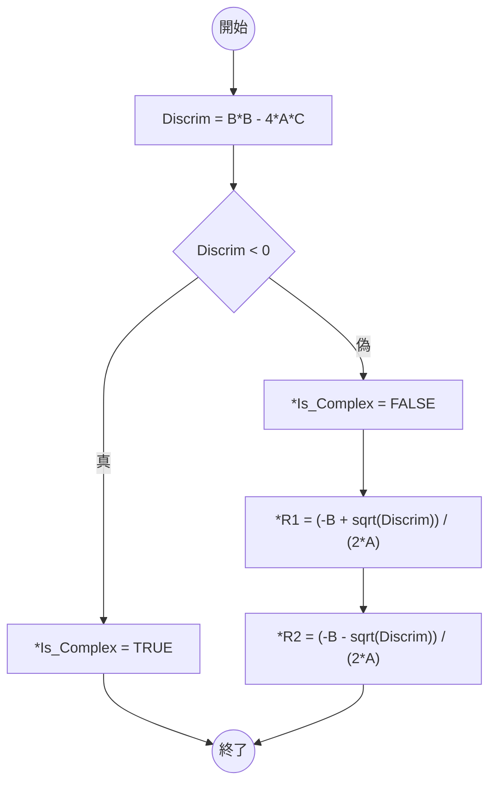

*(ビジュアル参照: ISO_IEC_IEEE_29119-4-FDIS_page-0121.jpg)*

##### C.2.4.3 ステップ 1: フィーチャセットの特定 (TD1) {#Section_C.2.4.3_DF}

- FS1: *Solve_Quadratic* 関数

##### C.2.4.4 ステップ 2: 変数の出現頻度の特定と分類 {#Section_C.2.4.4_DF}

*Solve_Quadratic* における変数の出現が特定され、定義、c-use（計算上の使用）、または p-use（述語上の使用）として分類されます。

**表 44 — Solve_Quadratic の変数の出現** {#Table_44}

| ノード | 出現 | 変数 | 分類 |
| :--- | :--- | :--- | :--- |
| 0 | 入力パラメータ A | A | 定義 |
| 0 | 入力パラメータ B | B | 定義 |
| 0 | 入力パラメータ C | C | 定義 |
| 1 | Discrim = B * B - 4 * A * C | Discrim | 定義 |
| 1 | Discrim = B * B - 4 * A * C | A, B, C | c-use |
| 4 | if (Discrim < 0) | Discrim | p-use |
| 5 | *Is_Complex = TRUE | Is_Complex | 定義 |
| 9 | *Is_Complex = FALSE | Is_Complex | 定義 |
| 10 | *R1 = (-B + sqrt(Discrim)) / (2 * A) | R1 | 定義 |
| 10 | *R1 = (-B + sqrt(Discrim)) / (2 * A) | A, B, Discrim | c-use |
| 11 | *R2 = (-B - sqrt(Discrim)) / (2 * A) | R2 | 定義 |
| 11 | *R2 = (-B - sqrt(Discrim)) / (2 * A) | A, B, Discrim | c-use |

*(ビジュアル参照: ISO_IEC_IEEE_29119-4-FDIS_page-0122.jpg)*

##### C.2.4.5 全定義テスト (All-Definitions Testing) {#Section_C.2.4.5_DF}

###### C.2.4.5.1 ステップ 3a: テスト網羅項目の導出 (TD3) — 全定義テスト {#Section_C.2.4.5.1_DF}

全定義テストでは、テスト網羅項目は、各変数の定義からその定義の少なくとも 1 つの使用（c-use または p-use）までの制御フローのサブパスです。

**表 45 — Solve_Quadratic の全定義テストの網羅項目** {#Table_45}

| 変数 | 定義ノード | 使用ノード | サブパス | 網羅項目 |
| :--- | :--- | :--- | :--- | :--- |
| A | 0 | 1 | 0-1 | TCOVER1 |
| B | 0 | 1 | 0-1 | TCOVER2 |
| C | 0 | 1 | 0-1 | TCOVER3 |
| Discrim | 1 | 4 | 1-4 | TCOVER4 |
| Is_Complex | 5 | 13 | 5-13 | TCOVER5 |
| Is_Complex | 9 | 10 | 9-10-11-13 | TCOVER6 |
| R1 | 10 | 13 | 10-11-13 | TCOVER7 |
| R2 | 11 | 13 | 11-13 | TCOVER8 |

*注記: サブパスの表記は簡略化されています。*

###### C.2.4.5.2 ステップ 4a: テストケースの導出 (TD4) — 全定義テスト {#Section_C.2.4.5.2_DF}

各テスト網羅項目を実行するためのテストケースが導出されます。

**表 46 — Solve_Quadratic の全定義テストのテストケース** {#Table_46}

| テストケース | 入力 (A, B, C) | 期待結果 (Is_Complex, R1, R2) | 網羅項目 |
| :--- | :--- | :--- | :--- |
| 1 | 1, 1, 1 | TRUE, 未割り当て, 未割り当て | TCOVER1, 2, 3, 4, 5 |
| 2 | 1, 2, 1 | FALSE, -1.0, -1.0 | TCOVER1, 2, 3, 4, 6, 7, 8 |

###### C.2.4.5.3 全定義テストの網羅率 {#Section_C.2.4.5.3_DF}

箇条 6.3.7.1 で提供されている式を使用すると：

$網羅率_{(全定義テスト)} = \frac{8}{8} \times 100\% = 100\%$

*(ビジュアル参照: ISO_IEC_IEEE_29119-4-FDIS_page-0123.jpg)*

##### C.2.4.6 全 c-use テスト (All-C-Uses Testing) {#Section_C.2.4.6_DF}

###### C.2.4.6.1 ステップ 3b: テスト網羅項目の導出 (TD3) — 全 c-use テスト {#Section_C.2.4.6.1_DF}

全 c-use テストでは、テスト網羅項目は、各変数の定義からその定義のすべての c-use までの制御フローのサブパスです。

**表 47 — Solve_Quadratic の全 c-use テストの網羅項目** {#Table_47}

| 変数 | 定義ノード | c-use ノード | サブパス | 網羅項目 |
| :--- | :--- | :--- | :--- | :--- |
| A | 0 | 1 | 0-1 | TCOVER1 |
| B | 0 | 1 | 0-1 | TCOVER2 |
| C | 0 | 1 | 0-1 | TCOVER3 |
| A | 0 | 10 | 0-1-4-9-10 | TCOVER4 |
| B | 0 | 10 | 0-1-4-9-10 | TCOVER5 |
| A | 0 | 11 | 0-1-4-9-10-11 | TCOVER6 |
| B | 0 | 11 | 0-1-4-9-10-11 | TCOVER7 |
| Discrim | 1 | 10 | 1-4-9-10 | TCOVER8 |
| Discrim | 1 | 11 | 1-4-9-10-11 | TCOVER9 |
| R1 | 10 | 13 | 10-11-13 | TCOVER10 |
| R2 | 11 | 13 | 11-13 | TCOVER11 |
| Is_Complex | 5 | 13 | 5-13 | TCOVER12 |
| Is_Complex | 9 | 10 | 9-10-11-13 | TCOVER13 |

###### C.2.4.6.2 ステップ 4b: テストケースの導出 (TD4) — 全 c-use テスト {#Section_C.2.4.6.2_DF}

**表 48 — 全 c-use テストのテストケース** {#Table_48}

| テストケース | A | B | C | Is_Complex | R1 | R2 | 網羅項目 |
| :--- | :--- | :--- | :--- | :--- | :--- | :--- | :--- |
| 1 | 1 | 2 | 1 | FALSE | -1 | -1 | TCOVER1-11, 13 |
| 2 | 1 | 1 | 1 | TRUE | - | - | TCOVER12 |

###### C.2.4.6.3 全 c-use テストの網羅率 {#Section_C.2.4.6.3_DF}

$網羅率_{(全 c-use テスト)} = \frac{13}{13} \times 100\% = 100\%$

*(ビジュアル参照: ISO_IEC_IEEE_29119-4-FDIS_page-0125.jpg)*

##### C.2.4.7 全 p-use テスト (All-P-Uses Testing) {#Section_C.2.4.7_DF}

###### C.2.4.7.1 ステップ 3c: テスト網羅項目の導出 (TD3) — 全 p-use テスト {#Section_C.2.4.7.1_DF}

全 p-use テストでは、テスト網羅項目は、変数の定義からその定義のすべての p-use までの制御フローのサブパスです。

*(詳細な表は省略しますが、述語部分（Discrim < 0 など）を網羅します。)*

$網羅率_{(全 p-use テスト)} = \frac{3}{3} \times 100\% = 100\%$

##### C.2.4.8 全使用テスト (All-Uses Testing) {#Section_C.2.4.8_DF}

全使用テストは、全 c-use と全 p-use の組み合わせを網羅します。

$網羅率_{(全使用テスト)} = \frac{16}{16} \times 100\% = 100\%$

##### C.2.4.9 全 DU パステスト (All-DU-Paths Testing) {#Section_C.2.4.9_DF}

全 DU パステストは、定義から使用までのすべての重複しないパスを網羅します。

$網羅率_{(全 DU パステスト)} = \frac{16}{16} \times 100\% = 100\%$
