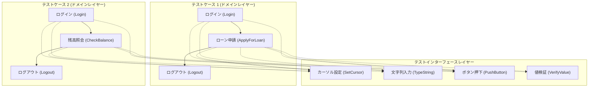
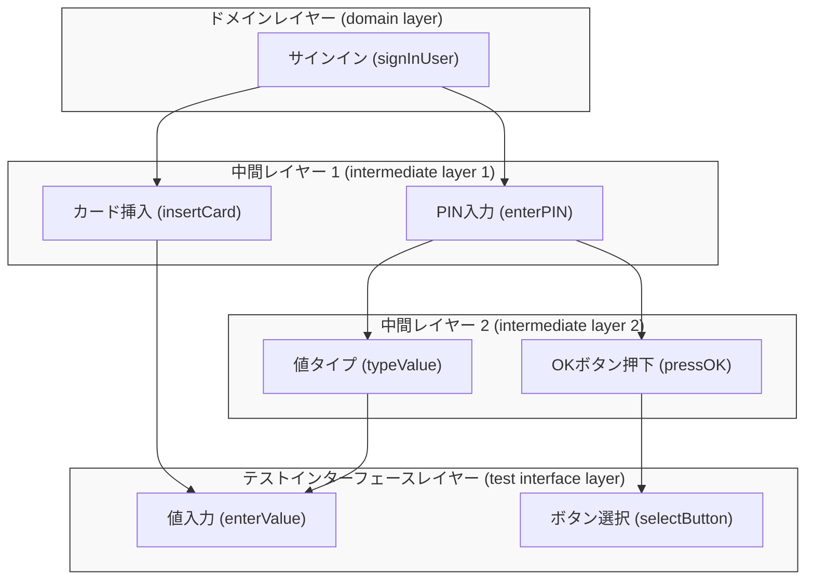
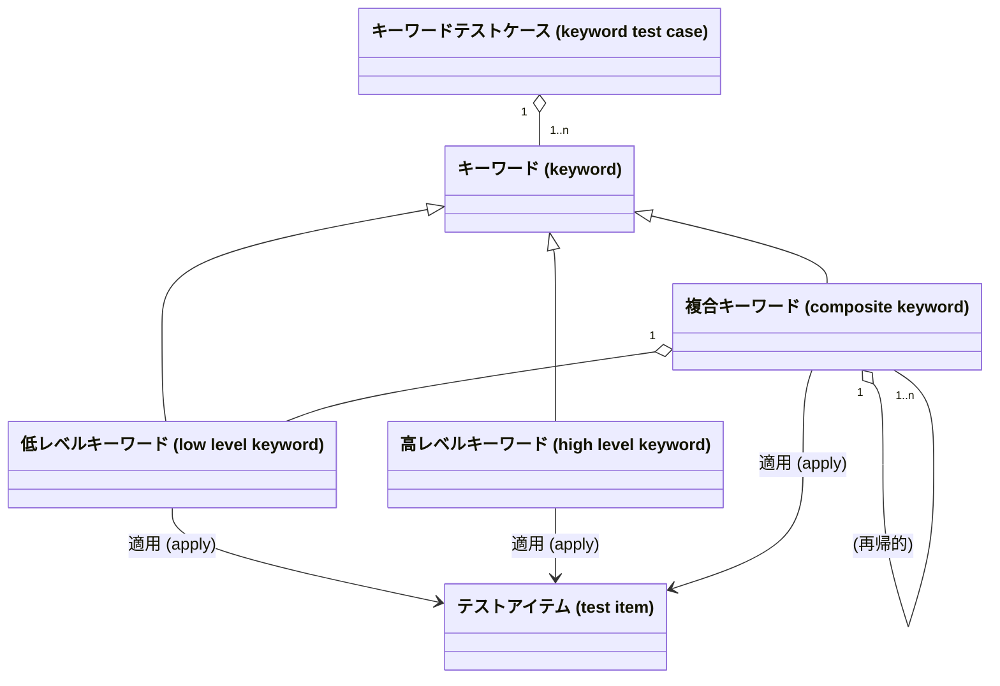
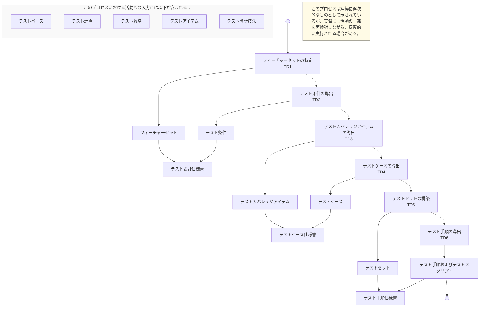
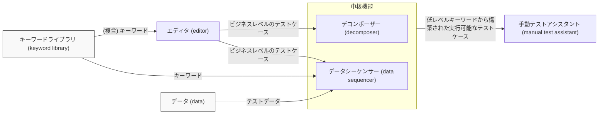
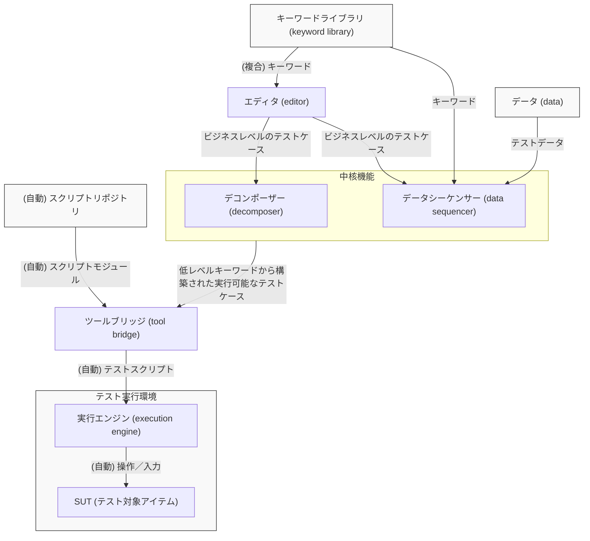

# ISO/IEC/IEEE DIS-2 29119-5: ソフトウェアテスト — 第 5 部：キーワード駆動テスト {#Cover}

*(ビジュアル参照: ISO-IEC-IEEE-29119-5-DIS2_page-0001.jpg)*

| 項目 | 値 |
| :--- | :--- |
| **文書種別** | DIS 投票用テキスト |
| **タイトル** | ISO 29119-5 DIS-2 |
| **ステータス** | 投票中 - 公式の ISO 投票通知メールに示された投票期日に従ってください。この投票は ISO 中央事務局 (CS) によって管理されています。 |
| **文書作成日** | 2015-03-09 |
| **作成元** | WG26 |
| **期待されるアクション** | 情報共有 |
| **事務局メールアドレス** | witold.suryn@etsmtl.ca |
| **委員会 URL** | [http://isotc.iso.org/livelink/livelink/open/jtc1sc7](http://isotc.iso.org/livelink/livelink/open/jtc1sc7) |

---

*(ビジュアル参照: ISO-IEC-IEEE-29119-5-DIS2_page-0002.jpg)*

**ISO/IEC JTC 1/SC 7**  
**日付: 2015年3月9日**  

**ISO/IEC/IEEE DIS-2 29119-5**  

**ISO/IEC JTC 1/SC 7/WG 26**  
**事務局: ANSI**  

**ソフトウェアおよびシステムエンジニアリング — ソフトウェアテスト — 第 5 部：キーワード駆動テスト**  

---

*(ビジュアル参照: ISO-IEC-IEEE-29119-5-DIS2_page-0005.jpg)*

## 目次 {#Table_of_Contents}

1.  **適用範囲 (Scope)** (1)
2.  **適合性 (Conformance)** (1)
    2.1 使用目的 (1)
    2.2 完全な適合 (2)
    2.3 調整された適合 (2)
3.  **引用規格 (Normative references)** (2)
4.  **用語および定義 (Terms and definitions)** (2)
5.  **キーワード駆動テストの導入 (Introduction to Keyword-Driven Testing)** (4)
    5.1 概要 (4)
    5.2 キーワード駆動テストのレイヤー (7)
    5.3 キーワードの種類 (10)
    5.4 キーワードとデータ (15)
6.  **キーワード駆動テストの適用 (Application of Keyword-Driven Testing)** (16)
    6.1 概要 (16)
    6.2 キーワードの特定 (16)
    6.3 テストケースの構成 (17)
    6.4 キーワードとデータ駆動テスト (18)
    6.5 モジュール化とリファクタリング (18)
    6.6 テスト設計プロセスにおけるキーワード駆動テスト (19)
    6.7 キーワード駆動ではないテストケースのキーワード駆動テストへの変換 (22)
7.  **キーワード駆動テストフレームワーク (Keyword-Driven Testing Frameworks)** (22)
    7.1 概要 (22)
    7.2 キーワード駆動テストフレームワークの構成要素 (23)
    7.3 キーワード駆動テストフレームワークの基本属性 (27)
    7.4 フレームワークの高度な属性 (30)
8.  **データ交換 (Data interchange)** (33)

**附属書 A（規定）規約 (Conventions)** (34)

**附属書 B（参考）キーワード駆動テストのメリットと課題 (Benefits and Issues of Keyword-Driven Testing)** (35)

**附属書 C（参考）キーワード駆動テストの導入ガイド (Getting started with Keyword-Driven Testing)** (37)

**附属書 D（参考）役割とタスク (Roles and Tasks)** (39)

**附属書 E（参考）基本キーワード (Basic keywords)** (41)

**附属書 F（参考）事例 (Examples)** (47)

**附属書 G 参考文献 (Bibliography)** (52)

---

*(ビジュアル参照: ISO-IEC-IEEE-29119-5-DIS2_page-0006.jpg)*

## 前書き {#Foreword}

ISO（国際標準化機構）および IEC（国際電気標準会議）は、世界規模の標準化のための専門システムを形成しています。ISO または IEC のメンバーである各国団体は、それぞれの組織が特定の技術活動分野を扱うために設立した技術委員会を通じて、国際規格の開発に参加します。ISO および IEC の技術委員会は、共通の関心分野で協力し合います。ISO および IEC と連絡を取り合っている他の国際組織（政府機関および非政府機関）も、この作業に参加します。情報技術の分野では、ISO と IEC は共同技術委員会 ISO/IEC JTC 1 を設立しています。

IEEE 規格文書は、IEEE 各学会および IEEE 標準協会（IEEE-SA）標準委員会の標準調整委員会内で開発されます。IEEE は、最終製品を達成するために多様な視点や関心を代表するボランティアを結びつける、米国国家規格協会によって承認されたコンセンサス開発プロセスを通じて規格を開発します。ボランティアは必ずしも学会のメンバーである必要はなく、無報酬で奉仕します。IEEE はプロセスを管理し、コンセンサス開発プロセスにおける公平性を促進するための規則を確立しますが、IEEE は独自にその規格に含まれる情報の正確性を評価、テスト、または検証することはありません。

国際規格の起草は、ISO/IEC 指針 第 2 部に規定された規則に従って行われます。

ISO/IEC JTC 1 の主な任務は、国際規格を作成することです。共同技術委員会によって採択された国際規格案は、投票のために各国団体に回付されます。国際規格としての発行には、投票を行った各国団体の少なくとも 75% による承認が必要です。

本規格の実装に際して特許権の対象となる事項の使用が必要になる可能性があることに注意してください。本規格の発行により、それに関連する特許権の存在または有効性についての立場は表明されません。ISO/IEEE は、ライセンスが必要となる可能性がある必須特許または特許請求の範囲の特定、特許または特許請求の範囲の法的有効性または範囲に関する調査の実施、または、保証書（Letter of Assurance）または特許声明・ライセンス宣言フォーム、あるいはライセンス契約において提供されたライセンス条項または条件が合理的または非差別的であるかどうかの判断には責任を負いません。本規格の利用者は、特許権の有効性の判断およびそのような権利の侵害のリスクが、全面的に利用者自身の責任であることを明示的に助言されます。詳細については、ISO または IEEE 標準協会から入手できます。

ISO/IEC/IEEE 29119-5 は、ISO と IEEE の間の提携規格開発組織協力協定に基づき、IEEE コンピュータ・ソサエティのソフトウェア・システムエンジニアリング規格委員会との協力により、共同技術委員会 ISO/IEC JTC 1（情報技術）の分科委員会 SC 7（ソフトウェア・システムエンジニアリング）によって作成されました。

ISO/IEC/IEEE 29119 は、一般タイトル「ソフトウェアおよびシステムエンジニアリング — ソフトウェアテスト」の下、以下の規格で構成されています。

*   第 1 部：概念と定義 (Concepts and Definitions)
*   第 2 部：テストプロセス (Test Processes)
*   第 3 部：テスト文書化 (Test Documentation)
*   第 4 部：テスト技法 (Test Techniques)
*   第 5 部：キーワード駆動テスト (Keyword-Driven Testing)

---

*(ビジュアル参照: ISO-IEC-IEEE-29119-5-DIS2_page-0007.jpg)*

## 導入 {#Introduction}

ISO/IEC/IEEE 29119 ソフトウェアテスト規格シリーズの目的は、ソフトウェアテストを管理または実行する際に、あらゆる組織が使用できる、国際的に合意されたソフトウェアテストの規格セットを定義することです。

本規格 ISO/IEC/IEEE 29119-5（キーワード駆動テスト）は、テストケースをモジュール形式で記述するための統一されたアプローチを定義します。これにより、キーワード駆動のテスト仕様書やテスト自動化フレームワークなどの作成が支援されます。「キーワード」という用語は、一度定義されると、積み木のようにテストケースを構成するために使用される要素を指します。ISO/IEC/IEEE 29119-5 では、キーワード駆動テストの主要な概念と適用方法について説明します。また、キーワード駆動テストをサポートするように設計されたフレームワークの属性も定義します。

ISO/IEC/IEEE 29119-1 で定義されているソフトウェアテストに関する概念と定義は、ISO/IEC/IEEE 29119-5 にも適用されます。

キーワード駆動テストフレームワークが基づいているテストプロセスモデルは、ISO/IEC/IEEE 29119-2（テストプロセス）で定義されています。これには、組織レベル、テスト管理レベル、およびダイナミック（動的）テストレベルでのソフトウェアテストプロセスを定義するテスト記述が含まれます。プロセスを説明する補足的な図表も ISO/IEC/IEEE 29119-2 で提供されています。しかし、ISO/IEC/IEEE 29119-5 は、ISO/IEC/IEEE 29119-2 のテスト設計および実装プロセス、特に TD4（テストケースの導出）、TD5（テストセットの構築）、および TD6（テスト手順の導出）の、キーワード駆動テストへの具体的な適用方法について記述しています。

ISO/IEC/IEEE 29119-3 で定義されているテスト文書のテンプレートと例も、ISO/IEC/IEEE 29119-5 に適用されます。

テスト設計中に使用できるソフトウェアテスト設計技法は、ISO/IEC/IEEE 29119-4（テスト技法）で定義されています。ISO/IEC/IEEE 29119-5 に従ってキーワードによって記述されるテストケースを設計する際には、ISO/IEC/IEEE 29119-4 の適用が前提とされています。

---

*(ビジュアル参照: ISO-IEC-IEEE-29119-5-DIS2_page-0008.jpg)*

## 1 適用範囲 {#Chapter_1}

この国際規格 ISO/IEC/IEEE 29119-5 は、以下のことを行うことにより、キーワード駆動テストのための効率的かつ一貫したソリューションを定義します。

— キーワード駆動テストの導入を提供する。

— キーワード駆動テストを実装するための参照アプローチを提供する。

— テスターがテストケース、テストデータ、キーワード、または完全なテスト仕様書などのワークアイテムを共有できるように、キーワード駆動テスト用フレームワークの要件を定義する。

— キーワード駆動テストをサポートするツールの要件を定義する。これらの要件は、キーワード駆動アプローチをサポートするあらゆるツール（例：テスト自動化ツール、テスト設計ツール、テスト管理ツールなど）に適用できます。

— 異なるベンダーのツールがデータ（例：テストケース、テストデータ、テスト結果など）を交換できるように、インターフェースと共通のデータ交換フォーマットを定義する。

— 階層型キーワードのレベルを定義し、階層型キーワードの使用を推奨する。これには、特定の種類のキーワード（例：ナビゲーション用または値のチェック用）の説明や、「フラット」な構造のキーワードをいつ使用するかについての説明が含まれます。

— 「inputData」や「checkValue」などの汎用的な技術的（低レベル）キーワードの初期リストを提供する。これらのキーワードは、技術的なレベルでテストケースを指定するために使用でき、必要に応じてビジネスレベルのキーワードを作成するために組み合わせることができます。

本規格は、キーワード駆動のテスト仕様書を作成したい、対応するフレームワークを構築したい、あるいはキーワードに基づくテスト自動化を構築したいすべての人に適用されます。

## 2 適合性 {#Chapter_2}

### 2.1 使用目的 {#Section_2.1}

ISO/IEC/IEEE 29119-5 の要件は、箇条 7 および附属書 A に含まれています。ISO/IEC/IEEE 29119-5 は、キーワード駆動テストの適用をサポートするフレームワークの要件を提供します。特定のプロジェクトや組織において、本規格で定義されているすべての構成要素を使用する必要がない場合があることが認識されています。したがって、ISO/IEC/IEEE 29119-5 の実装には、通常、組織やプロジェクトに適した構成要素または構成要素の一部のセットを選択することが含まれます。組織が本規格の規定に準拠していると表明する方法は 2 つあります。

組織または個人は、本規格に対する完全な適合（full conformance）または調整された適合（tailored conformance）のどちらを主張するかを明言しなければなりません。

---

*(ビジュアル参照: ISO-IEC-IEEE-29119-5-DIS2_page-0009.jpg)*

### 2.2 完全な適合 {#Section_2.2}

完全な適合は、ISO/IEC/IEEE 29119-5 で定義されているすべてのキーワード駆動テスト要件（すなわち、「〜しなければならない（shall）」記述）を満たしていることを実証することによって達成されます。

### 2.3 調整された適合 {#Section_2.3}

完全な適合の資格を満たさないフレームワークの構成要素を実装するために ISO/IEC/IEEE 29119-5 が使用される場合、調整された適合が主張される構成要素のサブセットを記録しなければなりません。調整された適合は、記録された構成要素のサブセットに対するすべての要件（すなわち、「〜しなければならない（shall）」記述）が満たされていることを実証することによって達成されます。

調整が行われる場合、ISO/IEC/IEEE 29119-5 の箇条 7 および附属書 A で定義された要件に従わないときは、常にその正当な理由を直接または参照によって提供しなければなりません。すべての調整の決定は、適用されるリスクの考慮事項を含め、その根拠とともに記録されなければなりません。調整の決定は、関連するステークホルダーによって合意されなければなりません。

例：ツールのベンダーは、自社のポートフォリオにおいてキーワード駆動テストフレームワークの一部のみを提供し、補完的なツールによってカバーされる要件を実装しないことを決定する場合があります（例：ベンダーが実行エンジンのみを提供し、キーワード駆動エディタを提供しない場合でも、その実行エンジンは規格に準拠することができます）。

## 3 引用規格 {#Chapter_3}

*(ビジュアル参照: ISO-IEC-IEEE-29119-5-DIS2_page-0010.jpg)*

## 4 用語および定義 {#Chapter_4}

本規格の目的のために、ISO/IEC/IEEE 24765 *Systems and software engineering — Vocabulary*、および以下の用語と定義が適用されます。

注記：ISO/IEC/IEEE 29119-5 の用語の使用は参照を容易にするためのものであり、ISO/IEC/IEEE 29119-5 への適合に必須ではありません。以下の用語と定義は、ISO/IEC/IEEE 29119-5 の理解と読みやすさを支援するために提供されています。ISO/IEC/IEEE 29119-5 の理解に不可欠な用語のみが含まれています。この箇条は、テスト用語の完全なリストを提供することを意図したものではありません。本規格で定義されていない用語については、*Systems and Software Engineering vocabulary* ISO/IEC/IEEE 24765 を参照できます。一般的なソフトウェアテストに関連する用語については、ISO/IEC/IEEE 29119-1 を参照できます。ISO/IEC/IEEE 29119-5 では、キーワード駆動テストに特有の用語のみを定義しています。

### 4.1 ドメインレイヤー (domain layer) {#Term_4.1}
テストアイテムに関する最高レベルの抽象化。

注記：このレベルのキーワードは、ドメインエキスパートになじみのある方法で選択されます。

### 4.2 高レベルキーワード (high-level keyword) {#Term_4.2}
他のキーワードから構成される可能性のある複雑なアクティビティをカバーするキーワードであり、ドメインエキスパートがキーワードテストケースを構築するために使用される。

### 4.3 キーワード (keyword) {#Term_4.3}
1 つ以上のテストケースの実行中に実行されることを意図した特定のアクションセットへの参照として使用される、1 つ以上の単語。

注記 1：アクションには、テスト中のユーザーインターフェースとの対話、検証、およびテストシナリオをセットアップするための特定のアクションが含まれます。

注記 2：キーワードは、少なくとも 1 つの動詞を使用して命名されます。

注記 3：複合キーワードは、他のキーワードに基づいて構築できます。

### 4.4 キーワード辞書 (keyword dictionary) {#Term_4.4}
テストケースを作成するために使用される言語と抽象化レベルを反映したキーワードセットを保持するリポジトリ。

### 4.5 キーワード駆動テスト (Keyword-Driven Testing) {#Term_4.5}
キーワードから構成されるテストケースを使用したテスト。

### 4.6 キーワード駆動テストフレームワーク (Keyword-Driven Testing framework) {#Term_4.6}
キーワード駆動エディタ、デコンポーザー（分解器）、データシーケンサー、手動テストアシスタント、ツールブリッジ、データおよびスクリプトリポジトリ、キーワードライブラリ、およびテスト実行環境の機能的能力をカバーするテストフレームワーク。

### 4.7 キーワード実行コード (keyword execution code) {#Term_4.7}
テスト実行エンジンによって実行されることを意図したキーワードの実装。

### 4.8 キーワードライブラリ (keyword library) {#Term_4.8}
**キーワード辞書 (4.4)** を参照。

### 4.9 キーワードテストケース (keyword test case) {#Term_4.9}
テストケースのアクションを記述するために構成された、キーワードのシーケンスと、それに関連付けられたパラメータに必要な値（該当する場合）。

### 4.10 低レベルキーワード (low-level keyword) {#Term_4.10}
1 つまたはごくわずかな単純なアクションのみをカバーし、他のキーワードから構成されていないキーワード。

### 4.11 手動テスト (manual testing) {#Term_4.11}
人間がテストアイテムに情報を入力し、結果を検証することによってテストを実行すること。

注記：自動テストでは、ツール、ロボット、およびその他のテスト実行エンジンを使用してテストを実行します。手動テストでは、これらを使用しません。

### 4.12 テスト実行エンジン (test execution engine) {#Term_4.12}
テストケースを実行するためにテストアイテムを操作できる、ソフトウェアおよび場合によってはハードウェアで実装されたツール。

---

*(ビジュアル参照: ISO-IEC-IEEE-29119-5-DIS2_page-0011.jpg)*

注記：典型的なテスト実行エンジンには、ユニットテストツールのフレームワーク、シミュレーション・コマンドシステム、キャプチャ・再生ツール、またはそれらを制御するためのソフトウェアを備えたハードウェアロボットが含まれます。

### 4.13 テストフレームワーク (test framework) {#Term_4.13}
テストを容易にする環境。

### 4.14 テストインターフェース (test interface) {#Term_4.14}
テストアイテムを刺激したり、応答（例：実際の結果）を取得したり、あるいはその両方を行うために使用される、テストアイテムへのインターフェース。

注記 1：GUI、API、または SOA インターフェースは典型的なテストインターフェースです。

注記 2：テストアイテムを刺激するには、コンピュータインターフェースまたは接続されたハードウェアを介してデータを渡すことが含まれます。

注記 3：応答の取得には、テスト対象のテストアイテムまたは関連するハードウェアから情報を取得することが含まれます。

### 4.15 テストインターフェースレイヤー (test interface layer) {#Term_4.15}
キーワードの最も低い抽象化レベル。テストアイテムと直接対話し、テストインターフェースにおける原子的（最低レベル）な対話をカプセル化する。

## 5 キーワード駆動テストの導入 (Introduction to Keyword-Driven Testing) {#Chapter_5}

### 5.1 概要 {#Section_5.1}

キーワード駆動テスト (KDT) は、プログラミングの専門知識を必要とせずに、「積み木」（キーワード）を使用してテストケースを作成するテストケース指定アプローチです。

---

*(ビジュアル参照: ISO-IEC-IEEE-29119-5-DIS2_page-0012.jpg)*

KDT は、さまざまな抽象化レベルで適用できます。あるレベル（「ドメインレイヤー」）では、ビジネスレベルまたはドメイン固有のアクションを表すキーワードを使用し、別のレベル（「テストインターフェースレイヤー」）では、テストアイテムとの低レベルな対話（例：ボタンのクリック）を表すキーワードを使用します。

キーワードは、1 つのアクションまたはアクションのグループの名前です。例えば、キーワード「enter\_text」は、「set\_focus」、「type\_text」、「hit\_enter」などのいくつかの低レベルアクションの名前になる可能性があります。

KDT を使用すると、テストケースをモジュール形式で記述できるため、読みやすさと保守性が向上します。このアプローチは、テストケースの数と複雑さが増大し、自動化が必要となる大規模なプロジェクトにおいて特に価値があります。

図 1 は、キーワード駆動テストの構成要素間の概念的な関係を説明しています。

---

*(ビジュアル参照: ISO-IEC-IEEE-29119-5-DIS2_page-0013.jpg)*

```mermaid
graph TD
    classDef independent fill:#f9f9f9,stroke:#333
    classDef dependent fill:#fff,stroke:#333

    subgraph Independent ["テストインターフェース/ツール非依存"]
        TP["テスト手順 (test procedure)"]
        TC["テストケース (test case)"]
        KTC["キーワードテストケース (keyword test case)"]
        MTC["手動テストケース (manual test case)"]
        KW["キーワード (keyword)"]
        ACT["アクション (action)"]
    end

    subgraph Dependent ["テストインターフェース/ツール依存"]
        KEC["キーワード実行コード (keyword execution code)"]
        FATS["フレームワーク生成自動テストスクリプト (framework generated ATS)"]
        MATS["手動生成自動テストスクリプト (manually generated ATS)"]
        ATS["自動テストスクリプト (automated test script)"]
    end

    TP -- "1..n" --> TC
    TC <|-- KTC
    TC <|-- MTC
    
    KTC -- "1" --- "1" MTC : 実装する
    KTC "1" o-- "1..n" KW
    MTC "1" o-- "1..n" ACT
    
    KW -- "1..n" --- "1..n" ACT : 記述する
    
    KW "1" -- "によって実装される" --> "1" KEC
    KTC "1" -- "によって実装される" --> "1" FATS
    
    KEC "1..n" -- "によって使用される" --> "1..n" FATS
    MTC "1..n" -- "によって実装される" --> "1" MATS

    FATS -- "1" --> ATS
    MATS -- "1" --> ATS

    style Independent fill:none,stroke:#333,stroke-dasharray: 5 5
    style Dependent fill:none,stroke:#333
```

**図 1 — キーワード駆動テストの構成要素間の関係** {#Figure_1}

キーワードを使用することで、テスト設計をテスト実装から分離することができます。この分離には、以下のような利点があります。
- テストアイテムが完全に実装される前に、テスト設計をより早い段階で開始できます。
- テスト自動化に詳しくないステークホルダーにとっても、テストケースが理解しやすくなります。
- テスト実装に変更があった場合（例：UI の変更）でも、テストケースではなくキーワードを更新するだけで済むため、テストケースの保守が容易になります。

---

*(ビジュアル参照: ISO-IEC-IEEE-29119-5-DIS2_page-0014.jpg)*

テストツールを使用して各キーワードの実行を自動化するために、キーワード実行コードを記述できます。

キーワードは通常、意味的に独立しています。これは、各キーワードが他のキーワードに依存していないことを意味します。

### 5.2 キーワード駆動テストのレイヤー {#Section_5.2}

#### 5.2.1 概要 {#Section_5.2.1}

キーワードはさまざまな抽象化レベルのアクションを表すため、キーワードを異なるレイヤーに整理できます。代表的な 2 つのレイヤーは、ドメインレイヤーとテストインターフェースレイヤーです。

図 2 は、これら 2 つのレイヤーのキーワードを使用した 2 つのテストケースを示しています。上のレイヤーはドメインレイヤーであり、テストケースは「createAccount」のような高レベルキーワードを使用して記述されます。下のレイヤーはテストインターフェースレイヤーであり、各高レベルキーワードは「clickButton」や「enterText」のような低レベルキーワードに分解されます。

---

*(ビジュアル参照: ISO-IEC-IEEE-29119-5-DIS2_page-0015.jpg)*



**図 2 — 2 つのレイヤーを使用したテストケースの例** {#Figure_2}

#### 5.2.2 ドメインレイヤー (Domain layer) {#Section_5.2.2}

ドメインレイヤーは最高レベルの抽象化です。このレイヤーのキーワードは、ドメインエキスパートやテストアイテムのエンドユーザーになじみのある用語を使用してアクションを記述します。これらは、アクションがどのように実行されるかという技術的な詳細を隠蔽します。

---

*(ビジュアル参照: ISO-IEC-IEEE-29119-5-DIS2_page-0016.jpg)*

例：銀行アプリケーションでは、ドメインレイヤーのキーワードに「口座開設 (openAccount)」、「送金 (transferMoney)」、「残高照会 (checkBalance)」などが含まれます。

ドメインレイヤーのキーワードで記述されたテストケースは、ソフトウェアテストや自動化の経験がない人にとっても読みやすく、理解しやすいものです。

#### 5.2.3 テストインターフェースレイヤー (Test interface layer) {#Section_5.2.3}

テストインターフェースレイヤーは最低レベルの抽象化です。このレイヤーのキーワードは、テストアイテムのテストインターフェースにおける原子的（アトミック）な対話を記述します。

例：GUI アプリケーションでは、テストインターフェースレイヤーのキーワードに「ボタンクリック (clickButton)」、「テキスト入力 (enterText)」、「リストから項目選択 (selectItemFromList)」、「ラベルテキスト検証 (verifyLabelText)」などが含まれます。

これらのキーワードは、テストアイテムのインターフェースの技術的実装と密接に関連しています。インターフェースに変更があった場合（例：ボタンの移動）、通常はテストインターフェースレイヤーのキーワードを更新するだけで済みます。

#### 5.2.4 複数のレイヤー {#Section_5.2.4}

2 つ以上のレイヤーを持つことが可能であり、多くの場合有用です。これにより、高レベルのドメインアクションから低レベルの技術的な対話へと、より段階的に移行できます。中間レイヤーには、関連するテストインターフェースアクションをグループ化するキーワードを含めることができます。

図 3 は、ATM テストケースにおける複数レイヤーアプローチを示しています。

---

*(ビジュアル参照: ISO-IEC-IEEE-29119-5-DIS2_page-0017.jpg)*



**図 3 — KDT における複数のレイヤー** {#Figure_3}

### 5.3 キーワードの種類 {#Section_5.3}

#### 5.3.1 単純キーワード (Simple keywords) {#Section_5.3.1}

単純キーワードは、他のキーワードから構成されないキーワードです。これらは、テストツールとドメインレイヤーの高レベルキーワードとの間の直接的な接続を提供するために、テストインターフェースレイヤーでよく使用されます。

キーワードの語彙を限定することは、テストケースの構成に有益です。なぜなら、覚えやすく、

---

*(ビジュアル参照: ISO-IEC-IEEE-29119-5-DIS2_page-0018.jpg)*

使用や保守が容易だからです。テスト自動化が必要な場合、キーワードの数が非常に少ないと、キーワード実行コードを実装するための労力が増大する可能性があります。これは、少数のキーワードで同じ複雑さをカバーしなければならない場合、個々のキーワードがより柔軟または強力である必要があるためです。

例：実装が「選択 (select)」などの必要なアクションによって構造化されている場合。キーワードの数を少なくするという目的のために、その特定のアクションが一度だけ実装されると、その単一のキーワード「select」は、GUI、リスト、テーブル、ラジオボタンなどの数種類のインターフェース要素に対応する必要があります。そのため、キーワード「select」は複雑な実装に関連付けられることになります。

#### 5.3.2 複合キーワード (Composite keywords) {#Section_5.3.2}

単純キーワードはテストケースを構成して実行するには十分ですが、機能的な特徴を反映するには不十分な場合がよくあります。

複合キーワードは、他のキーワードから構成されるキーワードです。これは、キーワードを異なるレイヤーに整理できることを意味します（5.2 を参照）。複合キーワードには、複合パラメータ（例：データ構造）が必要になる場合があります。

「ユーザーログイン」のようなビジネスレベルのキーワードを使用すると便利なことがよくあります。このキーワードは、「ユーザー名入力」、「パスワード入力」、「ログインボタン押下」などの下位レベルキーワードのシーケンスで構成される場合があります。契約書の作成のための大規模なフォームのような、より複雑なビジネスオブジェクトの場合、「契約書ページ 1 入力 (filloutContractformPage1)」のようなキーワードが役立ちます。

例 1：検証のために複合キーワードを使用することは一般的です（例：アプリケーションから値を取得し、それを期待される結果と比較し、比較結果をテスト実行ログに記録する）。

また、異なる意味論的意味を表現するために、高レベル（例：ドメインレベル）のキーワードを、低レベル（例：テストインターフェースレベル）の単一のキーワードで定義することも可能です。

例 2：ナビゲーションの目的で、高レベルキーワード「結果画面に移動 (GoToResultsScreen)」を、低レベルキーワード「結果ボタンをクリック (Click ResultsButton)」によって定義します。

また、いくつかの基本キーワードを組み合わせて、非常に多くの基本ステップを含む可能性のある「顧客アカウント作成 (CreateCustomerAccount)」のような、より高度な機能を持つ複雑な操作を作成することも可能です。

複合キーワードは、他のキーワードのシーケンスを含む「パッケージ」です。複合キーワードのパラメータセットは、その複合キーワードを構成するキーワードのパラメータセットの和集合になる場合があります。しかし、複合キーワードの実装者が、複合キーワード内でパラメータにリテラル値を割り当てることで、1 つ以上のパラメータを「隠す」ことを選択する場合もあります。これは図 4 の例で行われています。インターフェースレイヤーのキーワード「値入力 (Enter\_value)」には、参照されるオブジェクトの ID と挿入される値の 2 つのパラメータがあります。トップレイヤーのキーワード「ログイン」では値（例：ユーザー名）のみが表示されますが、ID はテスターからは隠されており、テスターは複合キーワードのみを使用します。これは、テストケースを設計し、ドメインレイヤーで作業する人にとって、詳細な技術情報が無関係である場合に特に役立ちます。

例 3：図 4 は、ログイン手順のキーワードを 3 つのレイヤーの複合キーワードとしてどのように設計できるかを示しています。ドメインレイヤーでは、このキーワードを（例：'ログイン ("John","secret")' のように）使用できます。このキーワードは、中間レイヤーの「ユーザー設定 (Set\_User)」、「パスワード設定 (Set\_Pwd)」、「ログイン終了 (Close\_Login)」の 3 つのキーワードで構成されています。「ユーザー設定」と「パスワード設定」は両方とも、上位レイヤーのキーワード「ログイン」のパラメータの 1 つを使用しますが、キーワード「ログイン終了」はパラメータやデータをまったく必要としません。3 番目のレイヤー（インターフェースレイヤー）では、基本キーワード「コンテキスト設定 (Set\_context)」、「値入力 (Enter\_value)」、「選択 (Select)」が使用されます。この 3 番目のレイヤーでは、ドメインレイヤーのキーワードでは提供されなかった「Login\_Window」のようなリテラル値が使用され、中間レイヤーのキーワードのいずれかが使用されるたびに同じように使用されます。

---

*(ビジュアル参照: ISO-IEC-IEEE-29119-5-DIS2_page-0019.jpg)*

```mermaid
graph TD
    subgraph DL ["ドメインレイヤー (domain layer)"]
        Login["ログイン (Login) (username, password)"]
    end

    subgraph IL ["中間レイヤー (intermediate layer)"]
        SetUser["ユーザー設定 (Set_User) (username)"]
        SetPwd["パスワード設定 (Set_Pwd) (password)"]
        CloseLogin["ログイン終了 (Close_Login)()"]
    end

    subgraph TIL ["テストインターフェースレイヤー (test interface layer)"]
        SC1["コンテキスト設定 (Set_context)(\"Login_Window\")"]
        EV1["値入力 (Enter_value)(\"Edit_User\", username)"]
        SC2["コンテキスト設定 (Set_context)(\"Login_Window\")"]
        EV2["値入力 (Enter_value)(\"Edit_Pwd\", password)"]
        SC3["コンテキスト設定 (Set_context)(\"Login_Window\")"]
        Select["選択 (Select)(\"Button_OK\")"]
    end

    Login --> SetUser
    Login --> SetPwd
    Login --> CloseLogin

    SetUser --> SC1
    SetUser --> EV1
    SetPwd --> SC2
    SetPwd --> EV2
    CloseLogin --> SC3
    CloseLogin --> Select

    style DL fill:#f9f9f9,stroke:#333
    style IL fill:#f9f9f9,stroke:#333
    style TIL fill:#f9f9f9,stroke:#333
```

**図 4 — データを含む複合キーワードの使用例** {#Figure_4}

次の図は、さまざまな種類のキーワード、キーワードテストケース、および最終的にテストアイテムに適用されるキーワードのレベルの関係を説明しています。キーワードは、低レベル、高レベル、または複合キーワードにすることができます（図 5）。

---

*(ビジュアル参照: ISO-IEC-IEEE-29119-5-DIS2_page-0020.jpg)*



**図 5 — さまざまなレベルのキーワードから構成されるキーワードテストケース** {#Figure_5}

複合キーワードを使用しない場合、キーワードテストケースは、テストインターフェースレイヤーなどの低レベルキーワードから構築できます。このアプローチを通じて、テストアイテムのテストは低レベルキーワードを使用して達成されます。

注記 1：図 5 において、複合キーワードは、低レベルキーワードまたは高レベルキーワードのいずれかにすることができます。

その結果、テストケースは人間のテスターにとって理解可能であり、機械が読み取れるテスト実行エンジンにとっても理解可能になります。一方で、そのようなテストケースを読む際、そのテストケースによって対処されるユースケースやビジネスケースを認識するのは難しい場合があります。

ビジネスキーワードやドメインキーワードなどの高レベルキーワードのみを使用することで、導出されたキーワードテストケースは、一般的に、対処されるユースケースやテストケースに関してより理解しやすくなります。テストアイテムのテストは、高レベルキーワードを使用して達成されます。したがって、人間のテスターは、特に業務ドメインに詳しくない場合、より抽象的なキーワードを実行するために必要な詳細なステップに関するより多くの情報を必要とします。実行エンジンを使用する場合、これらの実行エンジンも同様に、より抽象的なキーワードを実行するために必要な詳細なステップに関するより多くの情報を必要とします。

低レベルキーワードを組み合わせて上位の複合キーワードを形成した後（例：テストインターフェースレイヤーのキーワードをドメインレイヤーの複合キーワードと組み合わせる）、キーワードテストケースはこれらの高レベルキーワードから構成できます。そのようなテストケースは、関連するユースケースやビジネスケースに似ているため、非常に理解しやすくなります。

---

*(ビジュアル参照: ISO-IEC-IEEE-29119-5-DIS2_page-0021.jpg)*

注記 2：図 5 は、複合キーワードについて、高レベル複合キーワードと低レベルキーワードの 2 つেরレベルのキーワードを示しています。より低いレベルのキーワードから構成され、より高いレベルのキーワードを構成するために使用される中間複合キーワードなど、さらに多くのレベルを持つことも可能です。

テストを実行するために、高レベルキーワードを低レベルキーワードに分解することができます。これは通常、フレームワークを使用して行われます（7.2 を参照）。したがって、テストアイテムのテストは低レベルキーワードのみを使用して達成されます。低レベルキーワードにはテストを実行するために必要な単純なステップが含まれているため、人間のテスターやテスト実行エンジンにとって、実行すべき必要なアクションを特定することが容易になります。

注記 3：異なるレイヤーのキーワードを混ぜて 1 つのキーワードテストケースで使用することは可能ですが、保守上の問題の原因となる可能性があるため、推奨されません。

#### 5.3.3 ナビゲーション／対話（入力）と検証（出力） {#Section_5.3.3}

キーワードは、少なくとも 2 つのカテゴリに分類できます。すなわち、ナビゲーションステップ（テストアイテムへの入力）と検証ステップ（テストアイテムからの出力）です。

ほとんどのキーワードは最初のカテゴリ（ナビゲーションステップ）に属します。なぜなら、ほとんどのアクションは、テストアイテムを準備したり、結果につながる特定のアクションをテストアイテムに対して実行したりするために必要だからです。ナビゲーションステップは通常、テスト結果を検証して記録しないステップです。

結果は、その後、1 つ以上の他のアクション、すなわち検証ステップによってチェックされます。

検証ステップは、テストケースの結果に関連しています。例えば、検証ステップの条件が満たされない場合、テスト結果は「失敗 (failed)」に設定されます。

ナビゲーションステップを検証に使用できるようにすると便利な場合があります。

例 1：テストケースのデータを準備するために、ナビゲーションステップ「ユーザー追加 (AddUser)」が必要です。場合によっては、ユーザーの追加が成功することが想定される文脈で使用されることもあれば、追加が失敗することが期待される状況で使用されることもあります。したがって、このキーワードは、テストケースを「失敗」としてマークすることなく、ユーザーを正常に作成できたかどうかを検証できます。しかし、テスト設計者は、そのナビゲーションステップの実行に失敗したためにテストケースを「失敗」としてマークすることを選択することもできます（ただし、テストケースの実際の意図は、プロセスの後半に現れる結果を検証することです）。

テストが失敗する理由については、5.3.4「キーワードとテスト結果」を参照してください。

キーワードは通常、互いに意味的に独立しています。したがって、あるキーワードが期待される結果をトリガーすることを目的としている場合、この期待される結果の検証は同じキーワードの一部となり、別のキーワードには含まれません。

例 2：「ダイアログを開く」—「ダイアログが開いていることを確認する」のようなキーワードのペアは、2 番目のキーワードが最初のキーワードの直後にのみ使用される場合には、通常は避けられます。

#### 5.3.4 キーワードとテスト結果 {#Section_5.3.4}

キーワードは、テストステータスの判断やテスト結果の取得に使用できます。これには以下が含まれます。

— テスト出力

— 合格基準への適合

— テスト実行ログファイル

— ハードウェア出力

— システムステータス

— テスト失敗

---

*(ビジュアル参照: ISO-IEC-IEEE-29119-5-DIS2_page-0022.jpg)*

テスト実行が失敗する理由には、以下のようなものがあります。

— テストケースで実施されたチェックにより、実際の結果と期待される結果の不一致が判明した（ソフトウェアの故障を示唆する可能性がある）。

— テスト実行がブロックされているため、テストケースの一部のステップが実行できない。

注記：ブロックされたテストケースには、キーワード、キーワード実行コード、またはテスト環境の欠陥により実行できないテストケースが含まれます。

詳細な分析を行わずに、失敗した実行の原因を一目で認識できると便利です。したがって、フレームワークはそれに応じて異なるテスト結果（例：「失敗」や「ブロック」）を設定します。

個々のキーワードの実行結果は通常、テスト結果に影響を与えますが、その影響は文脈に依存します。

例：あるキーワードが、ユーザーインターフェースの複数のテキストフィールドに値を入力するように設計されているとします。アプリケーションのステータスによっては、値を入力できる場合（例：テキストフィールドがアクティブ）もあれば、入力できない場合（例：テキストフィールドが非アクティブ）もあります。どちらのオプションも有効である可能性があります。したがって、値が入力できなかったためにそのキーワードが失敗したとしても、テスト結果は「失敗」には設定されません。この場合、一時的な失敗は全体の結果に影響しません。

テストフレームワークは、テストアイテム上のブロックされたキーワードを処理するように設計できます。その場合、キーワードにはオプションで「ブロックされる可能性がある (may be blocked)」または「ブロックされてはならない (must not be blocked)」のいずれかのマークを付けることができます。前者の場合、キーワードのブロック（実行の失敗）はテスト結果に影響しません。後者の場合、テスト結果は影響を受けます。キーワードのマークは、グローバルに（テストケース内のすべてのアプリケーションに対してデフォルトのプロパティとして）設定することも、テストケースで使用される際に上書きすることもできます。

テストフレームワークはさらに、キーワードから返されるエラーを処理できるエラー認識メカニズムを提供できます。失敗を可能な限り明確にログに記録し、記述することで、自動化フレームワークのエラー修正を簡素化し、ソフトウェアの欠陥である可能性がある原因の調査を支援できます。

### 5.4 キーワードとデータ {#Section_5.4}

キーワードにデータが関連付けられていると、キーワード駆動テストが強化されます。データとの関連付けを可能にするために、多くの場合、キーワードには固定またはリスト駆動のパラメータが必要になります。

ほとんどのキーワードは、対象となるオブジェクトを指定するために少なくとも 1 つのパラメータを必要とします。また、入力内容（例：真偽値、入力する文字列、コンボボックスで選択するオプション）を指定するために別のパラメータが必要なものもあります。この入力は通常、コントロールのタイプとアクションのタイプに依存します。

注記：キーワードが検証ステップを表す場合、キーワードに必要な入力は、参照されるオブジェクトの期待される出力または状態になる可能性があります。

一部のキーワードは、多数のオプション入力を受け入れる場合があります。そのような場合、フレームワークは提供されないパラメータのためにデフォルト値を保持する必要があります（例：「Click UI_Element 456,123」は UI 要素内の特定の座標を指すが、座標が指定されない「Click UI_Element」はデフォルトでその要素の中心をクリックするように設定されるなど）。

広範な機能をカバーできる複合キーワードの場合、パラメータの数が増え、テストデータが複雑になる可能性があります。データとアクションを切り離すことは良い手法です。したがって、複数のパラメータを個別に保存し、データへの一意の参照をキーワードの入力として使用します。

例：複合キーワード「顧客作成 (createCustomer)」は、顧客の名、姓、住所などのデータを必要とします。テストデータをキーワードテストケースと一緒に記録するのではなく、データベースに保存します。これにより、データベース内の複雑なデータへの単一の参照が可能になり、同じアクションのシーケンスに関連付けられた複数のデータセットを提供することで、テストケースを拡張できます。

データ駆動テストは、テストデータをアクションのシーケンスから切り離して保存する方法であり、キーワード駆動テストとは独立したものですが、キーワード駆動テストと組み合わせて頻繁に使用されます。データ駆動テストでは、定義されたアクションシーケンスを持つ 1 つのテストケースに対して、複数のデータセットを提供できます。その後、アクションシーケンスが各データセットに対して実行されます。実装に応じて、データはテーブル、表計算ソフト、またはデータベースに保存されます。データ駆動テストは、パラメータをテストから切り離すためのオプションであり、キーワード駆動テストの概念と非常によく一致します。

箇条 6.4「キーワードとデータ駆動テスト」を参照してください。

---

*(ビジュアル参照: ISO-IEC-IEEE-29119-5-DIS2_page-0023.jpg)*

## 6 キーワード駆動テストの適用 (Application of Keyword-Driven Testing) {#Chapter_6}

### 6.1 概要 {#Section_6.1}

本箇条では、キーワード駆動テストの正常な実装に寄与するいくつかの概念について説明します。これらの概念のすべてが各キーワードテストケースに必須というわけではありませんが、テスト設計はそれらから恩恵を受けます。

本箇条では 6 つの概念を扱います。

a) 6.2 の「キーワードの特定」

b) 6.3 の「テストケースの構成」

c) 6.4 の「キーワードとデータ駆動テスト」

d) 6.5 の「モジュール化とリファクタリング」

e) 6.6 の「テスト設計プロセスにおけるキーワード駆動テスト」

f) 6.7 の「キーワード駆動ではないテストケースのキーワード駆動テストへの変換」

### 6.2 キーワードの特定 {#Section_6.2}

キーワードの特定は、キーワードの中身、粒度、構造がキーワードテストケースの定義方法に影響を与えるため、キーワード駆動テストにおける極めて重要なタスクです。キーワードを、それを取り扱う人々にとって自然に見えるように命名することが重要です。

キーワードを特定する際には、以下のステップが実行されます。

a) 指定された文脈で必要なレイヤーを決定し、そのレイヤーにどのようなキーワード（例：機能、粒度）を割り当てるべきかを定義する。

b) 各レイヤーの定義または適用範囲に基づいて、レイヤー内のキーワードを特定する。

一般に、キーワードはまず、テストの中で頻繁に発生すると予想されるアクションのセットを特定することによって定義されます。アクションまたはアクションのグループに名前（例：キーワード）が付けられます。キーワードは幅広い状況で適用可能です。この時点で、どのアクションが情報依存（例：時間、データ、状況など）であるかを判断し、どのキーワードにパラメータを関連付ける必要があるかを特定することが有用です。

キーワードは以下の情報によって記述されます。

— キーワードの名前。このキーワードが何を行うことが期待されているかを読者に伝えます。

— キーワードのパラメータ（空の場合もあります）。

— キーワードに関する文書。これには、そのキーワードが使用されることが期待されるレイヤー、キーワードの種類（例：ナビゲーションまたは検証）、使用される文脈、キーワードに含まれるアクション（記述として、または下位レイヤーのキーワードへの参照として（次の項目を参照））、およびキーワードの目的が含まれます。

---

*(ビジュアル参照: ISO-IEC-IEEE-29119-5-DIS2_page-0024.jpg)*

— キーワードが他のキーワードから構成されている場合は、使用される順序での含まれるキーワードのリスト。

基本キーワードは、キーボード、マウス、タッチスクリーン、マイク、API との対話など、テスト入力インターフェースで利用可能なさまざまな対話を観察することによって特定できます。

複合キーワードは、ユーザーが UI レベルで実行する一般的なアクションを観察することによって特定できます。

例：「ClickButton」の代わりに「GoTo」を使用したり、「ClickRowInTable」の代わりに「Select」を使用したりします。

典型的なビジネス動作は、複合キーワード（例：「CreateNewUser」）にカプセル化できます。データベースとの対話のような他の複雑な操作も、フレームワークにおけるキーワードの候補となります。

以下の項目を考慮する必要があります。

— 一意性：各キーワードは、その使用文脈において一意である必要があります。

— 再利用性：キーワードは、将来の再利用性を最大限にサポートする方法で定義される必要があります。

— 網羅性：キーワードは、テストインターフェースの既知のすべての要素および可能な対話（例：GUI とそのダイアログ内のすべての既知のオブジェクト）を考慮して定義される必要があります。

— 明確性：すべてのキーワードは、明確で一貫した構造で定義される必要があります。

注記 1：1 つのレイヤー内のすべてのキーワードは、同様の抽象化レベルを持つ必要があります。

— 具体性：キーワードは冗長であってはならず、相互に排他的である（すなわち、キーワードは別々の操作を表す）必要があります。これにより、テスト設計が容易になり、保守の労力が軽減されます。

注記 2：一部の環境では、キーワードを特定して記述するためにオブジェクト指向のアプローチを使用することが有用な場合があります。そのアプローチでは、ドメイン内の利用可能なオブジェクトとそのオブジェクト上のメソッドを分析することによってキーワードを特定できます。キーワードは、「OBJ.Action Parameter」のようなスタイルで記述できます。ここで、「OBJ」は対象となるオブジェクト（例：ユーザー対話ボックス内のボタン）を指し、「Action」はアクティビティ（例：ボタンの「press」）を指し、「parameter」は追加で必要なパラメータのリストを指します。このアプローチは、その環境内でキーワード駆動テストを実行するすべてのステークホルダーがオブジェクト指向に精通している場合に有用です。

### 6.3 テストケースの構成 {#Section_6.3}

キーワードテストケースは、以前に定義されたキーワードから構成できます。テストケースを作成する過程で、不足しているキーワードが発見され、その時点で定義されることもあります。

注記：キーワードテストケースは、複合キーワードから構成され、エンドツーエンドテストの構築に使用できます。

テストケース仕様書（ISO/IEC/IEEE 29119-3 を参照）内では、表やデータベースを含む適切な表記法を使用してテストケースを記録できます。形式は利用可能なインフラストラクチャ（例：テスト管理ツールの有無、自動実行の計画）に依存します。

キーワードテストケースには、通常、単一のレイヤーのキーワードが含まれます。レイヤー間は明確に区別されます。この区別により、異なるレイヤーの設計を異なるテスターに割り当てるという選択肢が開かれます（箇条 7 を参照）。

例 1：テストインターフェースレイヤーの基本キーワードのみを使用した ATM のテスト：

enterValue("Card", 123000789)

enterValue("PIN", 1234)

selectObject("Button", "OK")

selectObject("Button", "Payment")

---

*(ビジュアル参照: ISO-IEC-IEEE-29119-5-DIS2_page-0025.jpg)*

enterValue("Amount", "200")

selectObject("Button", "executePayment")

verifyObject("Payment", "200")

例 2：ドメインレイヤーのキーワードを使用した ATM のテスト：

signInUser(123000789, 1234)

executePayment("200")

verifyPayment("200")

その他の例は附属書 F にあります。

### 6.4 キーワードとデータ駆動テスト {#Section_6.4}

キーワードをパラメータや、それらのパラメータ用の個別のデータセット（例：データ駆動）と組み合わせることで、より高度なテストが可能になります。データ駆動テストは、同じキーワードアクションのシーケンスを異なるデータセットで使用する場合に適用できます。この統合されたアプローチでは、データをキーワードテストケースから切り離して保存できます。データは、表、データベース、またはリアルタイムジェネレータなどの構造に保存され、キーワードテストケースに読み込まれます。異なるデータを使用して繰り返されるキーワードシーケンスは、実質的に新しいテストを作成します。

例：データ駆動テストは、多言語テストや国際化テストに有用です。これらのテストでは、同じテストケースを異なる言語のユーザーインターフェースで実行する必要があります。ただし、すべての国際化の問題がデータ駆動テストで簡単に解決できるわけではないことに注意が必要です。例えば、辞書順のソートの場合、要求された項目はラベルが異なるだけでなく、位置も異なる可能性があります。

キーワードを使用したデータ駆動テストでは、以下のガイドラインが考慮されます。

— キーワードは「ループを意識する」必要はありません。言い換えれば、キーワードは、線形なシーケンスの一部であるか、ループ内（データ駆動テストなど）に含まれているかにかかわらず、理想的には同じように動作する必要があります。これにより、データファイルの管理やその内容の取得という負担は、キーワードではなくフレームワーク側に課せられます。これは、キーワードにデータを入出力する唯一の方法がパラメータを介することであることを意味します。

— テストケース内にネストされていない複数のループを実装することは可能ですが、推奨されません。優れたデータ駆動テストの設計では、データ駆動のテストケースには単一のループを使用することが推奨されます。

— ネストされたデータ駆動ループは推奨されません。通常、データ駆動ループを 3 重以上にネストすることは避けられます。

— データファイルの形式とその内容は実装によって定義されます。本規格は、ファイルの形式（例：実装で Excel ファイル、テキストファイル、またはその他のファイルタイプをサポートできる）を規定しません。また、ファイル内のデータ項目の形式（例：XML、ASCII または Unicode テキスト、バイナリエンコーディング、またはその他の形式が許可される）も規定しません。

注記：キーワード駆動テストとデータ駆動テストは、理論的には独立して使用できる概念ですが、実際にはキーワード駆動テストにはデータ駆動テストが含まれています。

### 6.5 モジュール化とリファクタリング {#Section_6.5}

キーワード駆動テストにおけるモジュール化は、テストケースの寿命を延ばすために使用されます。しかし、時間の経過とともに、テストアイテムの変更、新しいテストケース、またはチームの新しいメンバーなどはすべて、保守上の問題を引き起こす可能性があります。

考えられる問題は以下の通りです。

---

*(ビジュアル参照: ISO-IEC-IEEE-29119-5-DIS2_page-0026.jpg)*

— 冗長なキーワード：同じ目的の 2 つ以上のキーワードが存在する場合。

— 未使用のキーワード。

— 競合：多数のテストケースの問題を修正するキーワードの変更（例：構造や意味論）が、他のテストケースで新しい問題を引き起こす場合。これには関連するコスト要因があります。

— 調整されていないキーワードの変更：キーワードの名前、意味論、パラメータなどの無秩序な変更により、手戻りが発生したり、他のテスターのテストケースが無効になったりする場合。

これらの問題を避けるために、以下の保守アクションを考慮する必要があります。

— キーワード駆動テスト用のフレームワークは、使用されているキーワードのクロスリファレンスを作成する方法を提供し、どのキーワードがどの場所でどの程度の頻度で使用されているかを特定できるようにする必要があります。これにより、キーワードの変更が既存のテストケースにどの程度、どのように影響するかが示されます。

— 一部の組織では、すべてのキーワード、追加、および既存のキーワードへの変更、あるいはそれらの使用方法について責任を負う権限者が必要となります。その権限者は、開発段階とテスト段階の両方を含むプロジェクト全体を通じて一貫性を保証します。

— 定期的（例：月に 1 回）に、キーワードレビュー会議を開催できます。この会議では、テスターはキーワードの導入や変更について決定し、キーワードの構造について話し合うことができます。キーワードを担当する権限者がいる場合は、その人物も出席する必要があります。

— キーワードを文書化するための明確な構造を作成する必要があります。キーワードは、レイヤー、テストアイテム、およびテストアイテム内の領域（例：ダイアログ、目的など）ごとにグループ化できます。すべてのテスターが使用することを想定したキーワードは、通常、限られた人数にのみ有用なキーワードとは別に保存されます。

— キーワードは、構成管理の実践（例：上記の権限者による管理）の対象とすることができます。キーワードを変更する権限は、通常、変更が必要な人または権限者に限定されます。すべての変更は十分に文書化される必要があります。以前のバージョンへのアクセス（例：ロールバックのオプション）も提供される必要があります。

### 6.6 テスト設計プロセスにおけるキーワード駆動テスト {#Section_6.6}

#### 6.6.1 概要 {#Section_6.6.1}

ISO/IEC/IEEE 29119-2 で定義されているテスト設計および実装プロセス（図 6 を参照）は、本規格に適用可能です。本箇条では、このプロセスの活動とキーワード駆動テストとの関係について説明します。

---

*(ビジュアル参照: ISO-IEC-IEEE-29119-5-DIS2_page-0027.jpg)*



**図 6 — ISO/IEC/IEEE 29119-2 テスト設計および実装プロセス** {#Figure_6}

ISO/IEC/IEEE 29119-2 の箇条 8.2.1 にあるテスト設計および実装プロセス（図 6）では、「フィーチャーセットの特定」(TD1) から「テスト手順の導出」(TD6) までの 6 つのステップが記述されています。

ISO/IEC/IEEE 29119-2 の TD4 から TD6 の要件は、キーワード駆動テストで使用されるテスト設計および実装プロセスに最も当てはまります。

TD1 から TD3 については、ISO/IEC/IEEE 29119-5 では扱っていません。キーワード駆動テストは、TD4「テストケースの導出」、TD5「テストセットの構築」、および TD6「テスト手順の導出」の活動を実行する際に関連します。これらについては、以下の小箇条で説明します。

#### 6.6.2 TD1 フィーチャーセットの特定 {#Section_6.6.2}

TD1 は、ISO/IEC/IEEE 29119-2 で定義されている通り、キーワード駆動テストに適用できますが、ここでは扱っていません。

#### 6.6.3 TD2 テスト条件の導出 {#Section_6.6.3}

TD2 は、ISO/IEC/IEEE 29119-2 で定義されている通り、キーワード駆動テストに適用できますが、ここでは扱っていません。

#### 6.6.4 TD3 テストカバレッジアイテムの導出 {#Section_6.6.4}

TD3 は、ISO/IEC/IEEE 29119-2 で定義されている通り、キーワード駆動テストに適用できますが、ここでは扱っていません。

---

*(ビジュアル参照: ISO-IEC-IEEE-29119-5-DIS2_page-0028.jpg)*

#### 6.6.5 TD4 テストケースの導出 {#Section_6.6.5}

##### 6.6.5.1 概要 {#Section_6.6.5.1}

TD4 において、キーワード駆動テストは、単純キーワードまたは複合キーワードからキーワードテストケースを構成することに重点を置いています。

キーワードテストケースはキーワードを使用して実装されます。必要なテストケースをサポートするキーワードは、TD4 の前に定義されている必要があります。TD4 のタスクの実行中に、新しいキーワードが特定される可能性があり、その場合には TD4 の反復が必要になる可能性があります。

ISO/IEC/IEEE 29119-2 によれば、テストケースは以下のステップによって導出されます（TD4 タスク a）：

— 前提条件の決定

— 入力値の選択

— アクションの選択（テストカバレッジアイテムをテストするため）

— 期待される結果の決定

これらの設計活動により、システムのテスト準備、テストの実行、およびテスト結果の検証を行うために実行する必要があるさまざまなアクションが特定されます。キーワードは、これらのアクションの 1 つ以上を満たすことができます。

キーワード駆動テストケースの例は附属書 F にあります。

##### 6.6.5.2 前提条件の決定 {#Section_6.6.5.2}

テスターは、必要なテスト前提条件を決定して確立し、キーワードまたはその他のアクションを使用して達成できるものを特定します。複数のアクションが必要な状況では、複合高レベルキーワード（5.3.2 を参照）が適切な場合があります。さらに、一部のテストでは、特定のテストケース前提条件を確立する前に、キーワードを使用してシステム条件を準備できます（例：データベースへのデータのインポートや、一連のテストケースにわたって使用できるアプリケーション開始用のパラメータの設定など）。

##### 6.6.5.3 入力値の選択 {#Section_6.6.5.3}

テスターは、テスト設計上の考慮事項に基づいて入力値を選択し、これらをキーワードに実装します。テストケースが同じアクションに従って実行され、異なるテスト結果を提供するために異なるデータセットを使用する必要がある状況では、通常、データ駆動テスト（5.6 を参照）をサポートするようにキーワードが開発されます。

##### 6.6.5.4 アクションの選択 {#Section_6.6.5.4}

テスターは、テストカバレッジアイテムをテストするために必要なアクションを特定します。既存のキーワードの中に必要なアクションがない場合は、必要に応じて、必要な機能を提供するために、新しいキーワードが必要になるか、既存のキーワードを組み合わせて複合キーワードを作成することができます。このような変更には、この作業の反復が必要になる場合があります。

注記：キーワードはすでに定義されている場合があるため、テスト設計および実装プロセスの反復的な性質は、キーワードがリファクタリングの対象になり得ることを示唆しています。

##### 6.6.5.5 期待される結果の決定 {#Section_6.6.5.5}

テスターは期待される結果を決定し、キーワードを使用して結果のチェックまたはフィードバックを実装します。キーワードは、テストアイテムが返す結果をチェックし、それに応じてログに記録するために使用できます（5.3.3 および 5.3.4 を参照）。

---

*(ビジュアル参照: ISO-IEC-IEEE-29119-5-DIS2_page-0029.jpg)*

#### 6.6.6 TD5 テストセットの構築 {#Section_6.6.6}

テストセットはキーワードテストケースから形成できます（TD5 タスク a および b）。

キーワード駆動テスト用のフレームワークは、異なる基準（例：同じテスト環境のセットアップ、またはデータ駆動テストを伴うキーワード）を適用して、さまざまなテストケースからテストセットを構築するためのメカニズムを提供できます（29119-2 を参照）。

#### 6.6.7 TD6 テスト手順の導出 {#Section_6.6.7}

キーワードは読みやすく理解しやすいため、開発されたキーワードテストケースとテストセットは、テスト手順を導出するための主要な入力となります（TD6 タスク a および d）。

さらに、キーワードフレームワークは、テストセット内およびテストセット間での実行順序を決定するメカニズムを提供し、テスト手順の基本構造を自動化できます。フレームワークは、テスト実行前に必要な前提条件がセットアップされていることを確認するように設計することもできます。これには、追加の汎用的なキーワードが必要になる場合があります。

### 6.7 キーワード駆動ではないテストケースのキーワード駆動テストへの変換 {#Section_6.7}

既存のプロジェクトにキーワード駆動テストを導入する場合、既存のテストケースをキーワードテストケースに変換できます。

キーワード駆動テストの利点に加えて、既存のテストケースをキーワード駆動テストケースに変換することを決定する理由には、以下が含まれます。

a) 統一性：すべてのテストケースが同様の構造とスタイルを持つようにすることで、読みやすさと保守性が向上し、コストが削減されます。将来の保守は、1 つのスタイルのテストケースのみを保守すればよいため、より安価になる可能性があります。

b) 効率性：既存のテストケースから特定されたキーワードは、将来のテストケースで再利用できる可能性があります。

c) 自動化：新旧のテストケースに同じ自動化フレームワークを使用できます。

d) 理解しやすさ：テストケースが、技術的ではないテスター（多くの場合、業務知識を持つテスター）によって使用および保守される可能性があります。

既存のテストケースを維持し、キーワード駆動テストケースに変換しない理由には、以下が含まれます。

a) 既存のテストケースの数が、新しく必要な追加テストケースの数に比べて非常に多い。

b) 既存のテストケースに対して実績があり保守可能な自動化が存在する。

c) テストケースの変換コストが、得られるメリットを上回ると予想される。

既存のプロジェクトでキーワード駆動テストへの移行を決定する際には、慎重に検討する必要があります。

## 7 キーワード駆動テストフレームワーク (Keyword-Driven Testing Frameworks) {#Chapter_7}

### 7.1 概要 {#Section_7.1}

本小箇条では、キーワード駆動テストのためのフレームワークを実装または使用する際に考慮すべきいくつかの点について説明します。

以下の小箇条では、キーワード駆動テストフレームワークの属性について説明します。
— キーワード駆動テストを実装するために必要な基本属性（7.3 を参照）。
— 付加価値を提供し、望ましいが、すべてのフレームワークで利用可能であるとは限らない高度な属性（7.4 を参照）。

属性は、全般、テスト設計ツール、およびテスト実行エンジンの局面に分けられます。
— 全般的な局面は、ほとんどツールに依存しません。
— テスト設計ツールの局面は、キーワードの管理、キーワードからのテストケースの構成、およびデータの割り当てに使用される、フレームワークのソフトウェアツールコンポーネントに関連しています。
— テスト実行エンジンの局面は、テストケースを自動テストとして実行するために使用される、フレームワークのソフトウェアツールコンポーネントに関連しています。

フレームワークは、必要な機能の一部をそれぞれ提供する一連のツールで構成される可能性が高いです。フレームワーク全体として、指定された要件を満たす必要があります。

### 7.2 キーワード駆動テストフレームワークの構成要素 {#Section_7.2}

#### 7.2.1 概要 {#Section_7.2.1}

キーワード駆動テストは通常、フレームワークによってサポートされます。フレームワークは、商用ツール、カスタムツール、スクリプトリブラリ形式のソリューション、またはその他のサポート要素など、さまざまな方法で実現できます。

キーワード駆動テストフレームワークは、図 7 に示す機能ユニット（または機能領域）で構成されます。本規格では、これらの機能ユニットをどのように実装するかについては記述していません。実際には、商用またはカスタムのソフトウェアツールが、これらの機能ユニットを部分的または完全にカバーすることができます。1 つ以上のソフトウェアツールが、カスタム実装、ライブラリ、および組織的なプロセスとともに、キーワード駆動テストフレームワークを形成できます。ツールの全体的な構成が異なる場合もあります。フレームワークが本国際規格に準拠するためには、小箇条 7.3 に記載されている要件を網羅する必要があります（箇条 2 を参照）。

---

*(ビジュアル参照: ISO-IEC-IEEE-29119-5-DIS2_page-0031.jpg)*



**図 7 — 手動テスト実行のためのキーワード駆動テストフレームワークの構成要素** {#Figure_7}

図 7 では、手動テストのサポートに限定されたキーワード駆動テストフレームワークが示されています。テスト自動化が必要な場合、フレームワークは図 8 に示すような追加の要素で構成されます。手動テストアシスタントは必要ありません。代わりに、テスト対象アイテム (SUT) に対してテストケースを実行するために実行エンジンが使用されます。キーワードと自動テスト実行環境におけるそれらの表現との間のリンクとして、ツールブリッジが使用されます。ツールブリッジの主なタスクは、必要な情報を実行エンジンに適した形式に変換することです。

---

*(ビジュアル参照: ISO-IEC-IEEE-29119-5-DIS2_page-0032.jpg)*



**図 8 — 自動テスト実行のためのキーワード駆動テストフレームワークの構成要素** {#Figure_8}

キーワード駆動テストフレームワークを構成する機能コンポーネントについて、以下の小箇条で説明します。

注記：これらのコンポーネントの説明は、コンポーネントの特定の実装を前提としていません。実際には、1 つの特定のツールがこれらのコンポーネントのいくつかをカバーすることができます（例：キーワード駆動エディタ、デコンポーザー、データシーケンサー、および手動テストアシスタントが 1 つのテスト管理ツールにシームレスに含まれている場合があります）。別の実装では、1 つのツールでコンポーネントの一部のみが提供される場合もあります。

#### 7.2.2 キーワード駆動エディタ (Keyword-driven Editor) {#Section_7.2.2}

キーワード駆動エディタは、キーワードからキーワードテストケースを構成するために必要です。キーワードはキーワードライブラリ (7.2.8) から取得できます。

実際には、キーワード駆動エディタはさまざまな方法で実装できます。

例：キーワード駆動エディタの可能な実装には、表計算アプリケーション、専用のスタンドアロンアプリケーション、またはテスト管理ツールの一部が含まれますが、これらに限定されません。

#### 7.2.3 デコンポーザー (Decomposer) {#Section_7.2.3}

複合キーワードが使用される場合には、デコンポーザーが必要です。デコンポーザーの主なタスクは、高レベルキーワードのシーケンスで構成されるキーワードテストケースを、適切な低レベルキーワードのシーケンスに変換することです。

#### 7.2.4 データシーケンサー (Data sequencer) {#Section_7.2.4}

1 つのキーワードテストケースに複数のデータセットを関連付けてキーワード駆動テストを適用する場合には、データシーケンサーが必要です。データシーケンサーの主なタスクは、まだデータが関連付けられていないキーワードのシーケンス（例：低レベルまたは高レベル）を、特定のデータを持つキーワードのリストに変換することです。

これにより、キーワード駆動エディタで一度だけ記述された元の操作リストが、任意の目的のデータセットに対して繰り返されます。すべてのパラメータやプレースホルダーは、それぞれのテストケースで必要な最終的な値に置き換えられます。

データシーケンサーは、高レベルキーワードと低レベルキーワードの両方に対して機能します。

注記：実装に応じて、デコンポーザーとデータシーケンサーのタスクは任意の順序で実行できます。両方のタスクを同じソフトウェア実装で実行することも可能です。

#### 7.2.5 手動テストアシスタント (Manual test assistant) {#Section_7.2.5}

手動テストアシスタントは、手動テスト実行の場合にのみ必要です。そのタスクは、デコンポーザーやデータシーケンサーによって準備されたテストケースを、実行可能な方法で人間のテスターに提示することです。その後、テスターは個々のアクションを実行し、テストの実行と結果を記録します。

実際には、手動テストアシスタントは頻繁にテスト管理ツールの一部となっています。

#### 7.2.6 ツールブリッジ (Tool bridge) {#Section_7.2.6}

ツールブリッジは、自動テスト実行の場合にのみ必要であり、手動テスト実行をサポートするために使用される手動テストアシスタントと同様の機能を持ちます。

ツールブリッジのタスクは、キーワードテストケースまたはキーワードライブラリに表示されるキーワードと、テスト実行環境における関連する実装との間の接続を提供することです。

データシーケンサーまたはデコンポーザーから渡された各キーワードに対して、ツールブリッジは、実装に応じて、テスト実行エンジンに対して、適切なスクリプト（例：キーワード実行コード）や呼び出し関数を要求し、該当する場合は適切なデータを使用して正しいアクションを実行します。

実際には、ツールブリッジは、個別のソフトウェアツールとして、テスト自動化ツールの実行環境におけるスクリプトとして、またはテスト管理ツールの一部として実装できます。一部のブリッジ実装は、例えば自動化ツールによる実行のためにスクリプトまたはスクリプトの一部が生成される場合、「ジェネレータ」と呼ばれることがあります。さらに、キーワードのシーケンスを解釈（インタープリト）し、対応するサブ関数を呼び出すためのスクリプトが実行される場合などには、ブリッジが「インタープリター」や「エンジン」と呼ばれることもあります。

#### 7.2.7 テスト実行環境および実行エンジン (Test execution environment and execution engine) {#Section_7.2.7}

自動化されたキーワード駆動テストをサポートするために、テスト環境にはテスト対象アイテムへのリンクを備えた実行エンジンが含まれます。実行エンジンは、ソフトウェア、ハードウェア、またはその両方で実装されたツールです。そのタスクは、キーワードに関連付けられたアクションを実行することによってテストケースを実行することです。

実際には、テスト実行エンジンの実装はテストオブジェクトや環境によって異なります。実行エンジンは、商用のテスト実行ツール（例：キャプチャ・再生ツール）にすることも、ソフトウェアによって制御されるハードウェア機器（例：ロボット）にすることもできます。

#### 7.2.8 キーワードライブラリ (Keyword library) {#Section_7.2.8}

キーワードライブラリは、1 つ以上のプロジェクトまたはそれらのプロジェクトの一部のためのキーワード定義を保存します。これは、名前、説明、パラメータ、および複合キーワードの場合はそのキーワードが構成または派生したキーワードのリストなど、キーワードに関する主要な情報を保存するために使用されます。テスト自動化のために、ツールブリッジがキーワードをキーワード実行コードに関連付けるために必要な情報も含まれています。キーワードライブラリは、テスターがキーワードを見つけるのを助けることができます。

実際には、キーワードライブラリはテスト管理ツールによってサポートされます。

#### 7.2.9 データ (Data) {#Section_7.2.9}

キーワード駆動テストフレームワークにおけるデータ要素は、キーワードテストケースに使用されるテストデータを指します。

キーワードテストケースは、テストデータがテストケースに含まれるように設計できます。この場合、外部のテストデータは必要ありません。別の実装では、キーワードテストケースに実際のデータは含まれず、テストケースを実行する前にデータに置き換える必要があるプレースホルダーが含まれます。この場合、テストデータを保存する必要があります。実際には、そのデータをファイル、表計算アプリケーション、専用のデータベース、またはテスト管理ツールに保存するのが一般的です。

#### 7.2.10 スクリプトリポジトリ (Script repository) {#Section_7.2.10}

スクリプトリポジトリには、キーワード実行コードが保存されます。これは、テストケースを自動的に実行することを目的としてキーワード駆動テストが行われる場合にのみ必要です。

キーワード駆動テストを自動化するためには、各キーワードを、そのキーワードに関連付けられたアクションを実装する少なくとも 1 つのコマンド、テストスクリプト、または関数に関連付ける必要があります。スクリプトリポジトリには、キーワードの技術的な実装が保存されます。

実際には、スクリプトリポジトリは、テスト自動化ツールによって実装されるか、ファイルシステム内の定義された場所に保存されることが一般的です。

### 7.3 キーワード駆動テストフレームワークの基本属性 {#Section_7.3}

---

*(ビジュアル参照: ISO-IEC-IEEE-29119-5-DIS2_page-0033.jpg)*

#### 7.3.1 基本属性に関する全般情報 {#Section_7.3.1}

---

*(ビジュアル参照: ISO-IEC-IEEE-29119-5-DIS2_page-0034.jpg)*

本箇条では、キーワード駆動テストの適用に一般的に必要なフレームワークの属性を定義します。キーワード駆動テストフレームワークにおいて要求され、本国際規格への適合に必須となる属性について説明します。

以下の小箇条では、これらの属性と要件を、小箇条 7.2 に基づくキーワード駆動テストフレームワークの構成要素ごとに分類しています。

注記：データ交換フォーマットに関する要件は以下の小箇条では扱わず、箇条 8 を参照してください。

#### 7.3.2 全般的な属性 {#Section_7.3.2}

キーワード駆動テストフレームワークに適用される全般的な属性は以下の通りです。

a) 各キーワードを記述した文書を記録しなければなりません。

注記 1：これは、定義されたキーワードを適切に理解し、テストケースを構築するために使用する人々にとって必要です。説明に例を含めることで、理解が向上します。

b) 各キーワードのパラメータについての文書を記録しなければなりません。

注記 2：キーワードおよびパラメータの文書化には、キーワードの命名方法、記述方法、パラメータの最大長、許容される文字、必要に応じて予約済みの名前や文字、および文書化の規則が含まれます。

c) キーワードテストケースの定義においてパラメータの値が省略された場合に備えて、すべてのパラメータに対してデフォルト値を文書化しなければなりません。

d) 使用可能なキーワードの階層構造を記述した高レベルの文書を記録しなければなりません。

e) データ駆動テストのためにデータがどのように保存され、参照されるかを記述した高レベルの文書を記録しなければなりません。

例：データはデータベースまたは表計算ソフトに保存され、列または行で整理される場合があります。

上記の文書は、テスト計画、テストポリシー、組織的テスト戦略（ISO/IEC/IEEE 29119-3 を参照）の一部とすることも、他のテスト文書との相互参照を持つ独立した文書とすることもできます。

この情報を記録する方法には、ワードプロセッサやテスト管理ツールなど、いくつかの選択肢があります。

#### 7.3.3 専用のキーワード駆動エディタ（ツール） {#Section_7.3.3}

キーワードテストケースを作成する際には、テストケースの構築をサポートするツールを使用することが推奨されます。

専用のキーワード駆動エディタに適用される要件は以下の通りです。

a) キーワード駆動エディタ内では、非複合キーワードは関連付けられたアクションとともに表示されなければなりません。

例 1：キーワード「login」は、アクション「ボタン >>login<< を押す」、「ユーザー名を入力する」、「パスワードを入力する」、および「ボタン >>submit<< を押す」と関連付けられる場合があります。

注記 1：「login」のようなキーワードは、複合または非複合として設計できます。この例では、テスターが「login」を非複合キーワードとして定義することを選択したと仮定しています。

b) 下位レイヤーのキーワードを使用して定義されたキーワードについては、ユーザーがキーワード駆動エディタ内でその定義にアクセスできなければなりません。

c) キーワード駆動エディタは、データ駆動テストをサポートするためにパラメータを持つキーワードの使用を許可しなければなりません。

d) キーワード駆動エディタは、コメントを入力する機能を提供しなければなりません。

e) キーワード駆動エディタは、パラメータに値を割り当てるために使用されるデータソースに接続する機能を提供しなければなりません。

注記 2：この機能により、テストケースはキーワード駆動かつデータ駆動になります。データ駆動テストを伴わずにキーワード駆動テストを使用することも可能ですが、実際には、効率的なキーワード駆動テストにとってデータ駆動テストは非常に重要であるため、キーワード駆動テスト用フレームワークは、データ駆動テストのオプションを提供することが期待されています。

例 2：データソースには、データベースや表計算ソフトなどがあります。

f) キーワード駆動エディタ内では、キーワードの複数回の使用は参照によって実装されなければなりません。

注記 3：参照を使用することで、キーワードの実装をコピーすることを回避できます。

g) キーワード駆動エディタは、テストケースが実行される順序を定義する機能を提供しなければなりません。

注記 4：テスト実行順序は、テスト手順の導出の一部です。

#### 7.3.4 デコンポーザーおよびデータシーケンサー {#Section_7.3.4}

デコンポーザーおよびデータシーケンサーに適用される要件は以下の通りです。

a) デコンポーザーおよびデータシーケンサーは、高レベルキーワードに関連付けられたパラメータが確実に分解され、低レベルキーワードに関連付けられるようにすることを含め、パラメータを処理できなければなりません。

#### 7.3.5 手動テストアシスタント（ツール） {#Section_7.3.5}

手動テストアシスタントに適用される要件は以下の通りです。

a) 手動テストアシスタントは、定義されたテストケースに基づいて手動テストの実行をサポートしなければなりません。

b) 手動テストアシスタントは、テストの失敗に関連する欠陥を追跡する機能を備えたテストログの記録をサポートしなければなりません。

#### 7.3.6 ツールブリッジ {#Section_7.3.6}

ツールブリッジに適用される要件は以下の通りです。

a) ツールブリッジは、テストケースを実行するために適切な実行コードをテスト実行エンジンに提供しなければなりません。

#### 7.3.7 テスト実行エンジン {#Section_7.3.7}

テスト実行エンジンは、1 つ以上のテストインターフェース（例：API、GUI、またはハードウェアインターフェース）を介してテストケースを実行するように設計されています。テスト実行エンジンは、ソフトウェア、ハードウェア、またはその両方で実装できます。このクラスのツールの一般的な例は「JUnit」です。

テスト実行エンジンに適用される要件は以下の通りです。

a) テストケース内で条件やループを表現しないキーワードは、最初のキーワードから順次実行されなければなりません。

注記 1：これは一般的なルールですが、例外処理において、中断を処理するために非順次的な実行が必要になる場合があります。

b) 実行エンジンは、未実装のキーワードを特定できなければなりません。

注記 2：キーワードに対する実行コードが存在しない場合、そのキーワードは未実装となります。

c) 実行エンジンは、パラメータにおいてリテラル値または変数のいずれかをサポートしなければなりません。

注記 3：変数の定義は、構成ファイルまたはその他の手段によって実装できます。

d) 実行エンジンは、各キーワード実装の実行ごとにキーワードレベルで実行結果を提供しなければなりません。

注記 4：これにより、ユーザーはテスト結果から、キーワードが正常に実行されたか、あるいはキーワードの実行に失敗した場合はその理由（例：テキストフィールドが書き込み不可、フィールドが存在しないなど）を知ることができます。

e) 実行エンジンは、その実行のタイムスタンプを実行時間とともに保存できなければなりません。

f) 実行エンジンは、小箇条 5.3.4 で記述されているエラー認識メカニズムを提供しなければなりません。

注記 5：結果として、実行エンジンはループの回数を制限するか、無限ループが不可能であることを確実にするための別の手段（例：定義された時間の経過後に各ループを終了させる）を提供します。

g) 実行エンジンは、1 つのループ内に成功した実行と失敗した実行がある場合には常に、テストケースに対する PASS（合格）/FAIL（不合格）の明確な定義を提供しなければなりません。

注記 6：ループに検証が含まれている場合、一部のループサイクルでは検証に失敗し、他のサイクルでは失敗しないことが起こり得ます。PASS/FAIL の定義は、この状況がテストケースにとって「PASS」になるのか「FAIL」になるのかを示します。

h) 実行エンジンは、実行ログに実行の一意の識別子を含めなければなりません。

i) 実行エンジンは、実行ログにテスト環境の一意の識別子を含めなければなりません。

j) 実行エンジンは、実行ログにテストアイテムの一意の識別子を含めなければなりません。

k) 実行エンジンは、キーワードの複数の実装から選択するメカニズムを提供することにより、マルチアプリケーションキーワードをサポートしなければなりません。

注記 7：これにより、各アプリケーション用に作成されたキーワードを使用して、1 つのテストケースで複数のアプリケーションを操作できます。例えば、オフィスアプリケーションスイートの相互運用性を検証するテストケースでは、単一のテストケース内で 2 つのアプリケーションそれぞれに対して記述されたキーワードを使用できる必要があります。

l) テスト結果は、ユーザーまたは他のコンポーネントから利用可能でなければなりません。

注記 8：他のコンポーネントには、テスト設計やテスト管理コンポーネントが含まれます。

#### 7.3.8 キーワードライブラリ {#Section_7.3.8}

キーワードライブラリに適用される要件は以下の通りです。

a) キーワードライブラリは、名前、説明、パラメータを含む基本属性を持つキーワードの定義をサポートしなければなりません。

#### 7.3.9 スクリプトリポジトリ {#Section_7.3.9}

スクリプトリポジトリに適用される要件は以下の通りです。

a) スクリプトリポジトリは、キーワード実行コードの保存をサポートしなければなりません。

b) スクリプトリポジトリは、キーワード実行コードをキーワードライブラリ内の対応するキーワードに関連付けるための参照を含めることをサポートしなければなりません。

## 7.4 フレームワークの高度な属性 {#Section_7.4}

---

*(ビジュアル参照: ISO-IEC-IEEE-29119-5-DIS2_page-0037.jpg)*

#### 7.4.1 高度な属性に関する全般情報 {#Section_7.4.1}

本小箇条では、キーワード駆動テストの利点を最大限に引き出すために推奨される追加の属性を定義します。これらの属性がなくても、基本的なキーワード駆動テストは可能です。本小箇条では、本国際規格への適合に必要な要件は特定していません。

以下の小箇条では、これらの属性を、小箇条 7.2 に基づくキーワード駆動テストフレームワークの構成要素に即して整理しています。

#### 7.4.2 全般的な属性 {#Section_7.4.2}

キーワード駆動テストフレームワークは、以下の情報を含む文書化をサポートする必要があります。

a) キーワードをテストケースに構成する方法に関するルールを記述した高レベルの文書を記録する必要があります。

b) パラメータの記述方法に関するルールを記述した高レベルの文書を記録する必要があります。

c) パラメータの受け渡し方法に関するルールを記述した高レベルの文書を記録する必要があります。

d) キーワードの定義方法に関するルールを記述した高レベルの文書を記録する必要があります。

#### 7.4.3 専用のキーワード駆動エディタ（ツール） {#Section_7.4.3}

専用のキーワード駆動エディタに適用される推奨事項は以下の通りです。

a) キーワード駆動エディタは、キーワードで構成されたテストケースの構文をチェックする機能を提供する必要があります。

b) キーワード駆動エディタは、キーワードの使用状況を追跡し、各キーワードがどのテストケースや複合キーワードで使用されているかを示すクロスリファレンスを提供する機能を備える必要があります。

c) 構文チェック中、キーワード駆動エディタは、定義されたキーワードのみがテストケースで使用されていることを確認する必要があります。

注記 1：パラメータを持つキーワードについては、キーワード駆動エディタは各パラメータの数と型が正しいことをチェックする必要があります。

注記 2：パラメータの数とは、キーワードを使用する際に提供されるパラメータの個数です。パラメータの型の例には、数値、文字列、あるいは住所のように複雑なものなどが含まれます（これらに限定されません）。

d) 未定義のキーワードは拒否されるか、または少なくともキーワード駆動エディタによって未定義としてマークされる必要があります。

e) キーワード駆動エディタ内で、例外処理（例：テスト実行中に例外が発生した場合に、どのクリーンアップステップを実行するかを定義できるなど）を定義できる機能がある必要があります。

f) キーワード駆動エディタは、許可されたキーワードとそのパラメータのオートコンプリートまたはドラッグアンドドロップを許可する必要があります。

g) キーワード駆動エディタは、キーワードテストケースのバージョン管理をサポートする必要があります。

#### 7.4.4 デコンポーザーおよびデータシーケンサー {#Section_7.4.4}

デコンポーザーおよびデータシーケンサーに適用される推奨事項は以下の通りです。

a) デコンポーザーおよびデータシーケンサーは、ユーザーが既存のキーワードを使用して新しいキーワード（階層的キーワード）を実装できるようにする必要があります。

b) デコンポーザーおよびデータシーケンサーは、ユーザーが値や他の構造化データから階層構造のデータを作成できるようにする必要があります。

#### 7.4.5 手動テストアシスタント {#Section_7.4.5}

手動テストアシスタントに適用される推奨事項は以下の通りです。

a) 手動テストアシスタントは、テストアイテムのスクリーンショットやその他の出力をテストログに添付する機能を提供する必要があります。

#### 7.4.6 ツールブリッジ {#Section_7.4.6}

ツールブリッジに関する高度な属性は定義されていません。

#### 7.4.7 テスト実行環境および実行エンジン {#Section_7.4.7}

テスト実行環境および実行エンジンに適用される推奨事項は以下の通りです。

a) キーワード実行コードは、テストアイテムからのデータの読み取り、保存、および処理ができる必要があります。

b) 変数名前空間のサポートが提供される必要があります。

注記 1：個別のアプリケーションの構成ファイルで定義された変数が、同じテストケース、すなわちマルチアプリケーションテストケースでキーワードが使用された場合に競合する可能性があります。

c) テストケース内でアプリケーション間を移動する際のコンテキスト切り替えがサポートされる必要があります。

d) 実装は名前空間の切り替えを管理する必要があります（例：アプリケーション参照を変更する場合など）。

e) アプリケーションの複数のユーザーが同じ共有データに並行してアクセスできることを検証するテストがサポートされる必要があります。

f) 実行エンジンは、テストアイテム上のブロックされたキーワードを処理し、次の適切なキーワードでテスト実行を継続する必要があります（5.3.4 を参照）。

注記 2：次の適切なキーワードは、テスト設計者によって定義されているか、そのような定義がない場合は、テストケース内の次のキーワードになります。

g) 実行エンジンは、「ブロックされる可能性がある」や「ブロックされてはならない」などの属性を持つキーワードを処理できる必要があります（5.3.4 を参照）。

h) 実行エンジンはデータ駆動テストをサポートする必要があります。

注記 3：これには、少なくとも、外部データファイルから読み込まれたデータ値を使用して、1 つ以上のキーワードのセットを反復処理できるループ構造が含まれます。詳細については 6.4 を参照してください。

i) 条件付きのアクションを定義できる機能がある必要があります。

j) アプリケーションレベルの構成ファイルのサポートが実装される必要があります。

注記 4：構成ファイルには、0 個以上の変数と値のペアが含まれます。変数のスコープは、指定されたテストアイテムに対して実行されるテストセット内のすべてのテストに及びます。

k) 実装は少なくとも 1 つの構成インスタンスをサポートする必要がありますが、複数の構成ファイルが使用されるスキームを自由にサポートすることもできます。

l) 例外が処理された際に、アクションをスキップし、定義されたクリーンアップステップが確実に実行されるようにする機能がある必要があります。

注記 5：これには、キーワード実行コードがテストケースの中断を要求する機能（すなわち、それ以降のキーワードを実行しないこと）が含まれます。これは通常、要求元のキーワードで回復不能な状況が検出された結果として行われます。

m) キーワードの各実行コードは、入力パラメータやアクションの対象など、必要なアクションを実行するために必要な情報を割り当てることができる必要があります。各ステップには、アクションを実行するためのすべての情報が含まれています。

n) 実行エンジンは、テーブルやテスト管理ツールなどから受信したキーワードが、パラメータの数と型を比較することによって、それらのキーワード実行コードと一致するかどうかを検証できる必要があります。

o) 実行エンジンは、キーワードテストケース内のすべてのループが制限され、無限ループが防止されることを確実にする必要があります。

p) 実行エンジンは、指定された通過回数によって制限されるループをサポートする必要があります。

q) 実行エンジンは、固定された期間によって制限されるループをサポートする必要があります。

例：イベントが発生するか、または発生しなくなると予想されるまで、ループを最大 2 秒間待機するように制限します。

#### 7.4.8 キーワードライブラリ {#Section_7.4.8}

キーワードライブラリに適用される推奨事項は以下の通りです。

a) キーワードライブラリは、キーワードから複合キーワードを構築することをサポートする必要があります。

b) キーワードライブラリは、キーワードのバージョン管理をサポートする必要があります。

c) キーワードライブラリは、テストケースの作成を容易にするために、エイリアシング、同義語、および国際化の実装をサポートする必要があります。

#### 7.4.9 テストデータのサポート {#Section_7.4.9}

キーワード駆動テストフレームワークによって提供されるテストデータのサポートに適用される推奨事項は以下の通りです。

a) フレームワークはテストデータのバージョン管理をサポートする必要があります。

b) フレームワークは階層的なデータ型の定義を許可する必要があります。

#### 7.4.10 スクリプトリポジトリ {#Section_7.4.10}

スクリプトリポジトリに適用される推奨事項は以下の通りです。

a) フレームワークはキーワード実行コードのバージョン管理をサポートする必要があります。

# 8 データ交換 (Data interchange) {#Chapter_8}

---

*(ビジュアル参照: ISO-IEC-IEEE-29119-5-DIS2_page-0040.jpg)*

キーワード駆動テストは、キーワード駆動テストフレームワークのコンポーネントであるソフトウェアツールによってサポートされます。ツールの適用には、ツールが必要なデータを受信（入力）し、提供（出力）できる能力が必要です。本節では、テストデータ交換に関する要件について説明します。

キーワード駆動テストデータはツール間で交換できます。人間とソフトウェアツールの間でのデータ交換は、主にユーザーインターフェースで行われますが、ここでは扱いません。

注記：「ツール」という用語は、商用ツールと、フレームワークのカスタム構築された（商用ではない）部分の両方を指す場合があります。

キーワード駆動テストにおけるデータ交換は、国際的に認知された標準化団体（例：ISO、IEEE、OMG）によって発行された標準を使用して行われるべきです。

# 附属書 A（規定） 規則 (Conventions) {#Annex_A}

---

*(ビジュアル参照: ISO-IEC-IEEE-29119-5-DIS2_page-0041.jpg)*

キーワードに関する規則は以下の通りです。

a) キーワードには動詞を含めるべきである。

b) キーワードには命令形を使用すべきである。

c) キーワードには、関連付けられたアクションのセットの説明を提供しなければならない。

d) キーワードの説明は一意でなければならない。

e) キーワードは、テストケースを設計する際にそれらを使用するステークホルダー間で合意された、理解可能な方法で定義されるべきである。

注記 1：これは、ステークホルダーとともにキーワードをレビューすることによって検証できます。

f) すべてのキーワードは、フレームワーク内においてその意味が一意でなければならない。

以下の例は、項目 a) ～ f) を説明するためのものです。

例：キーワード「pressButton」には、命令形 (b) の動詞 (a) が含まれています。説明は「このキーワードは、グラフィカルユーザーインターフェース内のクラス <button> の要素をトリガーするために使用される」(c) とすることができます。ボタンを特定するパラメータ（例：「pressButton <cancel>」）が関連付けられている場合、それは一義的 (d) です。このキーワードは、英語を話すステークホルダーにとって理解可能 (e) であると想定されます。なぜなら、キーワード名の中の「press」と「button」という言葉は、テスターの通常の語彙から取られているからです。同じ活動を参照する他のキーワードが導入されない限り、意味の一意性 (f) は保たれます。

注記 2：自然言語は曖昧であったり、同義語や同音異義語を含んでいたりすることがあり、不明確で曖昧なテストケースを招く可能性があります。

注記 3：プログラミング言語からキーワードを導出することは推奨されません。プログラミング言語は抽象的すぎたり、理解が難しかったりすることがあります。テストケースを規定するドメインエキスパートがプログラミング言語の知識を持っているとは限りません。

---

*(ビジュアル参照: ISO-IEC-IEEE-29119-5-DIS2_page-0041.jpg)*

# 附属書 B（参考） キーワード駆動テストの利点と課題 (Benefits and Issues of Keyword-Driven Testing) {#Annex_B}

## B.1 キーワード駆動テストの全般的な利点 {#Section_B.1}

固定され定義されたキーワードのセットからすべてのテストケースを構成することで、以下のような利点が得られます。

— キーワードを自然言語で定義できるため、プロジェクトのニーズに応じて、テストケースを多かれ少なかれ詳細に記述することができます。

— テストケースが明確で理解しやすくなります。これにより、効率的な手動テストの実行がサポートされます。

— 一義的で正確に定義されたキーワードを使用することで、テストケースの実行を手動で行うか自動で行うかを選択できるようになります。自動化の場合、キーワードはキーワードスクリプトとして実装されることが期待されます。

— ビジネスレベルで作業するテスターは、テストケースの作成や編集を行うために、テスト自動化フレームワークに関する技術的な理解を必要としません。

— 技術的なレベルで作業するテスターは、ビジネスドメインに関する理解が限られているか全くなくても、キーワード駆動テストケースを実装または実行できます。

— 技術的なレベルのテスターは、ドメインエキスパートにとって理解可能であり、ビジネス上の正当性についてレビューを受けることができる言語を使用してテストケースを実装できます。これが行われれば、キーワード駆動テストは、しばしば認識されるビジネスレベルと技術レベルとの間のギャップを埋めるのに役立ちます。

— 技術的なレベルでのキーワードスクリプトの保守が、テストケースに影響を与える可能性は低いです。したがって、一般的に、キーワードの技術的な実装が調整されたとしても、キーワードテストケースを再規定したり再構成したりする必要はありません。

— 変更に対する敏感さ（保守の労力を生じさせる可能性がある）が軽減されます。

— テストスイートのポータビリティ（移植性）が達成しやすくなります（例：ほぼ同じビジネスケースを持つ同様のシステムをテストする必要がある場合、多くのキーワードを再利用できます）。

— キーワードで構成されたテストケースは、自然言語で書かれたものよりも迅速に作成できます。

— テストケースのリファクタリングコストが安くなります。

## B.2 テスト自動化におけるキーワード駆動テストの利点 {#Section_B.2}

テスト自動化の場合におけるキーワード駆動テストの利点には、以下が含まれます。

— 自動化された機能テストは、実際のテストアイテムが存在する前に、既存のキーワードライブラリとそれに対応する自動化スクリプトを使用するか、新しいキーワードを定義してテストインターフェースが定義された後に自動化スクリプトを後で追加することによって実装できます。

— 限定されたキーワードのセットは、テスト自動化の実装に必要な労力が限られていることを意味します（例：通常、各キーワードに対して 1 つの自動化キーワードスクリプトがあれば十分です）。

— 確立されたキーワードセットからテストケースが構築されている限り、一度これらのキーワードが実装されれば、新しいテストケースの自動化に追加のの実装労力は必要ありません。

— ビジネス上の理由によるテストケースの保守は、キーワードのセットとキーワードの意味論が変更されない限り、キーワードスクリプトの実装には影響しません。

## B.3 手動テストにおけるキーワード駆動テストの利点 {#Section_B.3}

手動テストでキーワード駆動テストを使用する場合の利点には、以下が含まれます。

— テスターが再利用されたキーワードの機能を覚えているため、再利用されたキーワードの解釈に労力を必要とせず、より迅速なテスト実行が達成できます。

— テスターは、テスト間の再現性と一貫性を達成するために、より正確に導かれます。

注記：キーワード駆動テストは、これらの利点を得るための 1 つのアプローチです。同様の利点を達成するための他のアプローチが存在する可能性があります。

## B.4 キーワード駆動テストで起こりうる課題 {#Section_B.4}

キーワード駆動テストを使用すると、追加のコストが発生したり、テストケースの構築が遅れたりする可能性があり、それがプロジェクトコストの上昇につながる場合があります。プロジェクトの後半段階では、これらの初期投資は、追加のテストケースの迅速な実装やテストケースの編集時間の節約など、この附属書の前の方で挙げた利点によって報われる可能性があります。これらの利点を実現することは、非常に限られた数のテストサイクルしか必要としない短期的なプロジェクトでは、より困難になる可能性があります。

自然言語による従来のテスト規定の代わりにキーワード駆動テストを使用することは、プロジェクトコストに影響を与えます。この附属書の前の小箇条で述べた利点によってプロジェクトコストが削減されることが期待されますが、以下の起こりうる課題によってプロジェクトの労力が増加する可能性があります。

— キーワード駆動テストを開始する初期段階では、キーワードを特定し、テスト自動化が必要な場合は実装してテストする必要があります。これはかなりの追加の労力であり、計画において考慮する必要があります。

— テストケース規定にキーワードを使用するために、要員をトレーニングする必要があります。

— キーワードライブラリの継続的な保守とサポートには、サポートスタッフ、予算、および時間の割り当てが必要になります。これらは、キーワードライブラリを設計する際に考慮する必要があります。追加の労力により、テストケースの構築が遅れる可能性があります。

注記：キーワードとその実装を再利用すればするほど、追加の労力は報われます。

---

*(ビジュアル参照: ISO-IEC-IEEE-29119-5-DIS2_page-0043.jpg)*

# 附属書 C（参考） キーワード駆動テストの開始 (Getting started with Keyword-Driven Testing) {#Annex_C}

---

*(ビジュアル参照: ISO-IEC-IEEE-29119-5-DIS2_page-0044.jpg)*

## C.1 全般 {#Section_C.1}

本附属書は、キーワード駆動テストを適用するための支援を提供します。キーワード駆動テストの経験はないが、どのように開始すればよいかを学びたい人々を助けるために提供されています。

多くの場合、キーワード駆動テストは、以下の小箇条で説明する 2 つの主要な活動を実行することによって行われます。

— キーワードの特定
— テストケースの構成

これらの活動は逐次的に行うことができますが、多くの場合、反復的または並行的に適用されます。これは、キーワード駆動テストがすでに確立されており、新しいテストケースを定義している最中に、テスト設計者がさらなるキーワードの必要性を認識する場合に特に当てはまります。

しかし、原則として両方の活動が必要であり、キーワード駆動テストを開始する際には、これらの活動に焦点を当てることが推奨されます。

## C.2 キーワードの特定 {#Section_C.2}

キーワード駆動テストには、キーワードの特定と定義が必要です。

キーワードを特定するために使用できる情報源には、以下が含まれます。

a) 探索的テスト
探索的テスト中、テスターはどのようなステップが実行されるかを観察します。いくつかのステップは関連しており、一緒に実行されます。このステップの集まりに意味のある名前を割り当てることで、新しいキーワードが定義されます。

ステップのシーケンスを異なるデータで使用できる場合、そのキーワードはそのデータに応じたパラメータを取ります。

そのキーワードを文書化するために、名前、ステップ、説明、および該当する場合はパラメータが記録されます。これらの活動が完了すると、新しいテストケースを定義する際に、ステップを使用する代わりにキーワードの名前が使用されるようになります。

b) 業務エキスパート (Business experts)
キーワードは、業務エキスパートへのインタビューによっても定義できます。テストアナリストが業務エキスパートに質問をします。これらの質問は、「アプリケーションは何をすべきか？」「適切な動作をどのように検証できるか？」「何をテストする必要があるか？」などです。業務エキスパートによって提供される回答は、自然に業務やドメインに関連した言語で構成されます。テストアナリストは、頻繁に発生する可能性が高い中核用語を見つけることで、キーワードを特定できます。

同じ活動のセットを指す異なる用語（業務エキスパートによって使用される）が存在する可能性があるため、テストアナリストはそれを認識し、重複を特定するように努める必要があります。

業務エキスパートと合意したキーワードの名前から始めて、テストアナリストはそのキーワードにどのようなステップが含まれるかを割り出す必要があります。文書化は上記の a) と同様に行われます。

c) テストインターフェース
キーワードは、テストインターフェースから開始して定義することもできます。インターフェース要素の数は限られており、通常は少ないため、これらのインターフェース要素に対処する限られた数のキーワードを定義できます。ドメインレイヤー上の高レベルキーワードを定義する上記の a) や b) とは対照的に、このアプローチではテストインターフェースレイヤー上の低レベルキーワードを定義します。

このアプローチは、テスト自動化に焦点を当てている場合に報われる可能性があります。なぜなら、最終的な限られたキーワードセットをキーワード実行コードと一致させることができるからです。適切なキーワード駆動テストフレームワークが利用可能であれば、規定されたテストケースをほぼ即座に自動テストとして利用できるようになります。文書化は上記の a) と同様に行われます。

d) 文書化されたテスト手順およびテストケース
利用可能なテスト手順およびテストケースも、キーワードの貴重な情報源となります。テストケース内のアクションが調査されます。最初のステップとして、各アクションを新しいキーワードとして扱うことができます。これらのキーワードのうち 2 つ以上が同じ活動を指していることが判明した場合は、それらをその活動を最もよく表す 1 つのキーワードに置き換えます。

一部のキーワードが他のキーワードと特定の順序でしか発生しない場合は、それらを 1 つの上位キーワードまたは階層的キーワードに置き換えることができます。文書化は上記の a) と同様に行われます。

これらの情報源のうち 1 つだけを使用すれば十分な場合もありますが、通常は複数の情報源からの情報が使用されます。

いずれの場合も、キーワードとして認識されなかった活動が存在する可能性があるため、作成されたキーワードのプールがテストケースを記述するのに十分ではないことが起こり得ます。これらの「ギャップ」は、テスト作業が進むにつれて不足しているキーワードを定義することによって埋められます。

## C.3 テストケースの構成 {#Section_C.3}

基本的なキーワードセットが定義されたら、これらのキーワードを使用してテストケースを記述できます。

テストケースはまず、ISO/IEC/IEEE 29119-4 で定義されているテスト技法を使用して特定され、ISO/IEC/IEEE 29119-2 で定義されているプロセスステップ（例：ISO/IEC/IEEE 29119-3 に従って文書化される TD4 の活動）に沿って特定される必要があります。

テストケースのアクションを書き留める際、必要な活動を自然言語で記述する代わりに、定義済みのキーワードが使用されます。

複数のテストケースが同じアクションまたはキーワードのシーケンスを共有しているが、テストデータが異なる場合、それらを異なるテストデータのセットとともに 1 つのキーワードテストケースに統合できます。

# 附属書 D（参考） 役割とタスク (Roles and Tasks) {#Annex_D}

---

*(ビジュアル参照: ISO-IEC-IEEE-29119-5-DIS2_page-0046.jpg)*

## D.1 概要 — 役割とタスク {#Section_D.1}

キーワード駆動テストのための健全なフレームワークでは、異なるタスクを異なる人々が実行することができ、それには異なるスキルが必要になる場合があります。例えば、テストインターフェースレイヤーにはテスト自動化のスキル、ドメインレイヤーには業務知識やテストのスキルが必要です。本箇条では、キーワード駆動テストにおけるさまざまな役割について説明します。

注記 1：キーワード駆動テストやテストプロセス全般には、さらに多くの役割が関与する可能性があります。本箇条では、キーワード駆動テストによってサポートされる分業に特有の役割のみを扱います。

一人の人がこれらの役割のうち 1 つ、いくつか、あるいはすべてに割り当てられることもありますが、効率を最大化し、チームメンバーの異なる能力を反映させるためには、役割を異なる人々に割り当てることが推奨される場合があります。これは、必要なすべてのスキルを備えた一人の人物が利用できない場合に特に役立ちます。

注記 2：以下の役割は、実際には異なる名前で呼ばれることがあり、役割の活動も異なる場合があります。

## D.2 ドメインエキスパート {#Section_D.2}

ドメインエキスパートは、多くの場合、テストアイテムの実際または将来のユーザーです。ドメインエキスパートは、テストアイテムがどのように動作すべきかについての深い知識を持っています。この知識はビジネスケースに焦点を当てたものかもしれませんが、技術的な側面を反映している場合もあります。この役割を担う人物は、理想的にはテスト技法とプロセスに関する基礎知識を持っている必要があります。

ドメインエキスパートのタスクには、以下が含まれます。

— 考慮すべきユースケース、ビジネスケース、またはアプリケーション内のパスを定義することによって、テストベースの一部を提供すること。
— テストケースを設計し、テスト設計仕様書に貢献すること。
— ビジネスキーワードを特定すること。

ドメインエキスパートは、これらのタスクを実行するためにテスト設計者と密接に協力します。

## D.3 テスト設計者 {#Section_D.3}

テスト設計者は、複雑なユースケース、要件文書、および仕様書を分析します。これらから、テスト設計者はテストケースを導出し、続いて有用なビジネスレベルのキーワードを導き出します。したがって、関連性のある情報とそうでない情報を区別できることが極めて重要です。

テスト設計者は、有用なビジネスレベルのキーワードを導き出すために、要件やその他の製品情報（例：運用概念、ユーザーガイドなど）を分析することに加えて、主題専門家（SME）と密接に対話する必要があります。

テスト設計者のタスクには、以下が含まれます。

— キーワードとそのインターフェースを定義すること。
— テストケースにおけるキーワードの構成と適用を規定すること。
— テストベースに基づいてテストケースを作成すること。
— ドメインエキスパートからの大まかなテストケースを練り直し、テストケースおよびテスト手順仕様書を作成すること。

テスト設計者は、キーワードがドメインの言語を反映し、テストケースが適切であることを確実にするために、ドメインエキスパートと密接に協力します。

テスト設計者は、キーワードのインターフェースに一貫性があり、キーワード実行コードがキーワードを正しく反映していることを確実にするために、テスト自動化エキスパートと密接に協力します。

## D.4 テスト自動化エキスパート {#Section_D.4}

この役割は、テスト実行を自動化する場合にのみ必要です。

テスト自動化エキスパートは、プログラミングの経験とテストツールに関する知識を持っている必要があります。テスト自動化エキスパートは、自動テスト実行をサポートするフレームワークで使用されるスクリプト言語を理解する必要があります。さらに、テスターとしての経験があることは有益であり、他のテスターとのコミュニケーションを簡素化します。

テスト自動化エキスパートのタスクには、以下が含まれます。

— 低レベルキーワードを実行可能形式として実装し、テスト自動化のための機能を確保すること。
— ライブラリを採用または実装することで、技術的なレベルで適切なツールを選択・結合し、フレームワークを構築すること。
— テスト設計者とともに、低レベルキーワードをより高いレベルのキーワードとどのように組み合わせるかを決定し、自動化の側面からこれをサポートする技術的手段を提供すること。
— テスト実装スクリプト、またはスクリプトの関連部分を保守し、テスト自動化の可用性と信頼性を確保すること。

テスト自動化エキスパートは、テスト設計者と密接に協力します。

---

*(ビジュアル参照: ISO-IEC-IEEE-29119-5-DIS2_page-0047.jpg)*

# 附属書 E（参考） 基本キーワード (Basic keywords) {#Annex_E}

---

*(ビジュアル参照: ISO-IEC-IEEE-29119-5-DIS2_page-0048.jpg)*

## E.1 概要 {#Section_E.1}

本附属書では、例としてキーワードの基本的なリストを提供します。これらのキーワードは、テストインターフェースとしての GUI に適用できます。このキーワードセットは汎用的であり、このテストインターフェース上のほとんどのアプリケーションで使用できることが想定されています。実際には、テストアイテムはここで提供されているものよりも多くの、あるいは異なるキーワードを必要とする場合があります。したがって、このキーワードセットは拡張可能です。

このキーワードセットは、他のテストインターフェースの例としても役立ち、キーワード駆動テストを迅速に開始するためのものとして提供されています。

## E.2 GUI 用の基本キーワード {#Section_E.2}

以下に、GUI をテストするための基本キーワードをリストします。GUI には通常、一意のタイトルによって区別されるダイアログがあります。ダイアログ内にはさまざまな GUI オブジェクトがあります。ダイアログとその GUI オブジェクトは、識別子 (id) によって特定されます。

| キーワード | 説明 |
| :--- | :--- |
| `clearContext (id)` | コンポーネントからコンテキストを削除します。<br>**パラメータ:**<br>id (入力): コンポーネントの id |
| `click (id)` | 指定されたコンポーネント上でマウスの左ボタンによる単純なクリックを行います。<br>**パラメータ:**<br>id (入力): 対象コンポーネントの id |
| `clickWithOptions (id, MOUSE_BUTTON, times, MODIFIER, x, y)` | 指定されたコンポーネント上で、追加オプションを伴う拡張クリックを行います。<br>**パラメータ:**<br>id (入力): 対象コンポーネントの id<br>MOUSE_BUTTON (入力): パラメータ MOUSE_BUTTON で定義されている値の一つ<br>times (入力) オプション: クリックする回数<br>MODIFIER (入力) オプション: パラメータ MODIFIER で定義されている値の一つ<br>x (入力) オプション: コンポーネント内の相対的な x 座標<br>y (入力) オプション: コンポーネント内の相対的な y 座標 |
| `doubleClick (id)` | 指定されたコンポーネント上でマウスの左ボタンによるダブルクリックを行います。<br>**パラメータ:**<br>id (入力): 対象コンポーネントの id |
| `drag (id, item, MOUSE_BUTTON, KEY)` | ドラッグを行います。<br>パラメータ item は、ツリーまたはリストからドラッグソースを選択するために提供されます。<br>他のコンポーネントは通常ドラッグ不可能です。<br>**パラメータ:**<br>id (入力): 対象コンポーネントの id<br>item (入力) オプション: ツリーまたはリストの場合、treeNode または listItem の id<br>MOUSE_BUTTON (入力): パラメータ MOUSE_BUTTON で定義されている値の一つ<br>KEY (入力): パラメータ KEY で定義されている値の一つ |
| `drop (id, item)` | ドロップを行います。<br>**パラメータ:**<br>id (入力): 対象コンポーネントの id<br>item (入力) オプション: ツリーまたはリストの場合、treeNode または listItem の id |
| `getCaption (id, varCaptionValue)` | 対象コンポーネント (id) のキャプションを varCaptionValue に書き込みます。<br>**パラメータ:**<br>id (入力): 対象コンポーネントの id<br>varCaptionValue (入力): コンポーネントのキャプションを保持する変数 |
| `getProperty (id, PROPERTY_NAME, varPropertyValue)` | 対象コンポーネント (id) の指定されたプロパティ (PROPERTY_NAME) の値を varPropertyValue に書き込みます。<br>**ヒント:** ヒットしなかった場合はインタラクションが失敗し、パラメータには UNDEFINED という値が設定されます。<br>**パラメータ:**<br>id (入力): 対象コンポーネントの id<br>PROPERTY_NAME (入力): パラメータ PROPERTY_NAME で定義されているプロパティの一つ<br>varPropertyValue (入力): プロパティの値を保持する変数 |
| `getText (id, varText)` | 対象コンポーネント (id) のテキストを varText に書き込みます。<br>**パラメータ:**<br>id (入力): 対象コンポーネントの id<br>varText (入力): コンポーネントのテキストを保持する変数 |
| `moveMouse (target_id, target_item)` | マウスを id が target_id のコンポーネントに移動します。<br>**パラメータ:**<br>target_id (入力): 対象コンポーネントの id<br>target_item (入力) オプション: ツリーまたはリストの場合、オプションの treeNode または listItem の id |
| `openContextMenu (id)` | 指定されたコンポーネントのコンテキストメニューを開きます。<br>**パラメータ:**<br>id (入力): コンポーネントの id |
| `pressKey (id, MODIFIER, KEY)` | キーまたはキーの組み合わせ（修飾キー付き）を押します。<br>**注意:** このインタラクションは、キーボードコマンドやショートカットのテストを目的としています。テキストエリアやテキストフィールドにテキストを入力する場合は、代わりに「setText」インタラクションを使用してください。<br>**パラメータ:**<br>id (入力): 対象コンポーネントの id。または、現在フォーカスされているコンポーネントでキー入力を行う場合は「UNUSED」という値。<br>MODIFIER (入力) オプション: 1 つ以上の修飾キー（「shift」や「alt」など）の組み合わせ<br>KEY (入力): 押されるキー |
| `setContext (id)` | 指定されたコンポーネントに対して、コンテキストを「受動的」に設定します（プログラム上の構成要素）。<br>**重要:** これは、ウィンドウ / ダイアログを「能動的」に最前面に持ってくる setWindowActive とは対照的です。 |

---

*(ビジュアル参照: ISO-IEC-IEEE-29119-5-DIS2_page-0048.jpg)*
*(ビジュアル参照: ISO-IEC-IEEE-29119-5-DIS2_page-0049.jpg)*

| キーワード | 説明 |
| :--- | :--- |
| `setFocus (id)` | 指定されたコンポーネントにフォーカスを設定します。<br>**重要:** セル、ツリーアイテム、リストアイテム、およびメニューアイテムについては、フォーカスを設定することは不可能です。フォーカスは、それぞれテーブル、ツリー、リスト、およびメニューに対してのみ設定できます。<br>**パラメータ:**<br>id (入力): コンポーネントの id |
| `setText (id, text)` | 指定されたコンポーネントにテキストを設定、またはクリアします。<br>**パラメータ:**<br>id (入力): コンポーネントの id<br>text (入力): テキスト |
| `verifyCaption (id, OPTION_PATTERN_MATCHING, expectedCaptionValue)` | 指定された検索アルゴリズム (OPTION_PATTERN_MATCHING) に基づいて、対象コンポーネント (id) の期待されるキャプション (expectedCaptionValue) を検証します。<br>**パラメータ:**<br>id (入力): 対象コンポーネントの id<br>OPTION_PATTERN_MATCHING (入力): 検索アルゴリズムの形式を指定します<br>expectedCaptionValue (入力): 期待されるキャプション |
| `verifyProperty (id, PROPERTY_NAME, OPTION_PATTERN_MATCHING, expectedPropertyValue)` | 指定された検索アルゴリズム (OPTION_PATTERN_MATCHING) に基づいて、対象コンポーネント (id) の期待されるプロパティ値 (expectedPropertyValue) を検証します。<br>**パラメータ:**<br>id (入力): 対象コンポーネントの id<br>PROPERTY_NAME (入力): パラメータ PROPERTY_NAME で定義されているプロパティの一つ<br>OPTION_PATTERN_MATCHING (入力): 検索アルゴリズムの形式を指定します<br>expectedPropertyValue (入力): プロパティの値を保持する変数 |
| `verifyText (id, OPTION_PATTERN_MATCHING, expectedCaptionText)` | 指定された検索アルゴリズム (OPTION_PATTERN_MATCHING) に基づいて、対象コンポーネント (id) の期待されるテキスト (expectedText) を検証します。<br>**パラメータ:**<br>id (入力): 対象コンポーネントの id<br>OPTION_PATTERN_MATCHING (入力): 検索アルゴリズムの形式を指定します<br>expectedCaptionText (入力): 期待されるキャプション |
| `waitForExist (id, maxTimeToWait)` | コンポーネントが存在するまで待機します。<br>**パラメータ:**<br>id (入力): 対象コンポーネントの id<br>maxTimeToWait (入力): ミリ秒単位の待機期間 |
| `waitForNotExist (id, maxTimeToWait)` | コンポーネントが存在しなくなるまで待機します。<br>**パラメータ:**<br>id (入力): 対象コンポーネントの id<br>maxTimeToWait (入力): ミリ秒単位の待機期間 |

**表 E.1 — 汎用的な基本キーワードの例**

特定の、あるいは専門化された、もしくは拡張可能なキーワードを必要とする GUI オブジェクトもさらに存在します。例を以下の表に示します。

| キーワード | 説明 |
| :--- | :--- |
| `selectMenuItem (id, OPTION_NUMBER_OR_NAME, menuItem)` | メニューアイテムを選択します (OPTION_NUMBER_OR_NAME の値に依存します)。<br>**パラメータ:**<br>id (入力): 対象メニューの id<br>OPTION_NUMBER_OR_NAME (入力): 後続のパラメータが名前と番号のどちらで定義されるかを定義します<br>menuItem (入力): OPTION_NUMBER_OR_NAME の値に応じたメニューアイテムの名前または番号 |
| `selectListItem (id, MODIFIER, OPTION_NUMBER_OR_NAME, listItem)` | 1 つのリストアイテムを選択します。MODIFIER を使用すると、このインタラクションを繰り返すことでマルチセレクトインタラクションを定義できます。リストアイテムは名前または番号で指定できます (OPTION_NUMBER_OR_NAME の値に依存します)。<br>リストには、リストビュー、コンボボックス、ドロップダウンリスト、ラジオボタン、またはタブカードが含まれます。<br>**パラメータ:**<br>id (入力): 対象リストの id<br>MODIFIER (入力) オプション: パラメータ MODIFIER で定義されている値の一つ<br>OPTION_NUMBER_OR_NAME (入力): 後続のパラメータが名前と番号のどちらで定義されるかを定義します<br>listItem (入力): OPTION_NUMBER_OR_NAME の値に応じたリストアイテムの名前または番号 |
| `startApplication (currentClientID, propertyFile)` | アプリケーション設定用のプロパティファイルを使用して、アプリケーションを開始します。プロパティファイルは properties ディレクトリ内にあることが想定されます。<br>**パラメータ:**<br>currentClientID (入力): アプリケーションの id<br>propertyFile (入力): プロパティファイルのファイル名 |

**表 E.2 — 専門化された基本キーワードの例**

## E.3 基本キーワードの適用例 {#Section_E.3}

以下の例は、3 つのレイヤーで構成されたキーワードテストケースを示しています。テストインターフェースレイヤーでは低レベルキーワードが使用され、中間レイヤーでは低レベルキーワードをアプリケーション関連の語彙に統合し、ビジネスキーワードはドメインレイヤーで中間レイヤーのこれらのキーワードを使用します。

各キーワードは関数のような形式で記述されます。つまり、1 つの一意の名前の後に、括弧内に配置された 0 個、1 つ、または複数のパラメータで構成されます。ドメインレイヤーで使用されるパラメータは、中間レイヤーを介してテストインターフェースレイヤーに渡されます。

車の構成プログラムのこのテストは、いくつかのアクセサリーを付けて車を構成するユースケースを対象としています。最後のアクションとして、算出された価格が検証されます。

実際には、この例ではテストケースはドメインレイヤーのキーワードのみを使用して記述されます。他のレイヤーは理解を深めるために提供されています。

| ドメインレイヤー | 中間レイヤー | テストインターフェースレイヤー |
| :--- | :--- | :--- |
| **startCarConfigurator** | | |
| ("login", "password", "english") | `startCarConfiguratorCmdLine()` | |
| | | `startApplication("carConfigurator", "E:\CarConfigurator.ini")` |
| | `login("login", "password")` | `setText("userField", "login")` |
| | | `setText("pwdField", "password")` |
| | | `click("loginBtn")` |
| | `setLanguage("english")` | |
| | | `selectMenuItem("mainMenu", NAME, "Language")` |
| | | `selectMenuItem("menuLanguage", NAME, "english")` |
| | | |
| **selectVehicle** | | |
| ("Rolo", "red") | `selectTabcard("Cars")` | |
| | | `setContext("carConfig")` |
| | | `selectListItem("tabbedPane", UNUSED, NAME, "Vehicles")` |
| | `selectVehicleByNameAndColour("Rolo", "red")` | |
| | | `selectListItem("vehicleList", UNUSED, NAME, "Rolo")` |
| | | `selectListItem("colourList", UNUSED, NAME, "red")` |
| | | |
| **selectAccessories** | | |
| ("[Steering wheel, brown, leather]", | `selectTabcard("Accessories")` | |
| "[Mats, black, textile]") | | `setContext("carConfig")` |
| | | `selectListItem("tabbedPane", UNUSED, NAME, "Accessories")` |
| | `selectAccessoriesByNameColourMaterial ("Steering wheel", "brown", "leather")` | `selectListItem("accessoryNameList", UNUSED, NAME, "Steering wheel")` |
| | | `selectListItem("accessoryColourList", UNUSED, NAME, "brown")` |
| | | `selectListItem("accessoryMaterialList", UNUSED, NAME, "leather")` |
| | | `click("addAccessoryBtn")` |
| | `selectAccessoriesByNameColourMaterial ("Mats", "black", "textile")` | `selectListItem("accessoryNameList", UNUSED, NAME, "Mats")` |
| | | `selectListItem("accessoryColourList", UNUSED, NAME, "black")` |
| | | `selectListItem("accessoryMaterialList", UNUSED, NAME, "textile")` |
| | | `click("addAccessoryBtn")` |
| | | |
| **verifyVehiclePrice** | | |
| ("20.000", "$") | `verifyCalculatedPrice("20.000", "$")` | |
| | | `verifyProperties("calculatedPrice", "InnerText", "=", "20.000")` |
| | | `verifyProperties("priceCurrency", "InnerText", "=", "$")` |
| | | |
| **closeCarConfigurator()** | | |
| | `closeApplication("CarConfigurator")` | |
| | | `selectMenuItem("mainMenu", NAME, "File")` |
| | | `selectMenuItem("fileMenu", NAME, "Exit")` |

**表 E.3 — 複合キーワードの一部として基本キーワードを使用したテストケースの例**

---

*(ビジュアル参照: ISO-IEC-IEEE-29119-5-DIS2_page-0050.jpg)*
*(ビジュアル参照: ISO-IEC-IEEE-29119-5-DIS2_page-0051.jpg)*
*(ビジュアル参照: ISO-IEC-IEEE-29119-5-DIS2_page-0052.jpg)*
*(ビジュアル参照: ISO-IEC-IEEE-29119-5-DIS2_page-0053.jpg)*

# 附属書 F（参考） 例 (Examples) {#Annex_F}

## F.1 概要 {#Section_F.1}

本附属書では、キーワードの適用に関する補足的な例を提供します。これらの例は、キーワード駆動テストのさまざまな実装の可能性を理解してもらうために、異なるスタイルと粒度で提供されています。

## F.2 例：ISO/IEC/IEEE 29119-3 のテスト手順 {#Section_F.2}

この例では、ISO/IEC/IEEE 29119-3 の附属書 K.2 にあるテスト手順の例を、どのようにキーワードベースに変更できるかを示しています。

使用されるキーワード：

| キーワード | パラメータ | 説明 |
| :--- | :--- | :--- |
| `StartUp` | | 装置をサンプリング分析が可能な状態に設定する。 |
| `PlaceNcsSample` | `<value>` | carousel 内に、パラメータ `<value>` の値を持つ NCS サンプルを配置する。 |
| `StartAnalysis` | | 分析手順を開始する。 |
| `WaitForAnalysis` | `<time>` | 分析が完了するまで待機する。最大待機時間：`<time>` 秒。 |
| `CheckResult` | `<value>`, `<testcase>` | 分析結果がパラメータ `<value>` と等しいことを確認する。パラメータ `<testcase>` で提供されたテストケースの番号としてログを記録する。 |
| `Shutdown` | | 装置の電源を切り、サンプルを取り出し、こぼれたものがあれば清掃する。 |

**表 F.1 — ISO/IEC/IEEE 29119-3 附属書 K.2 に適用されたキーワード**

注記：附属書 F.2 の残りの部分では、ISO/IEC/IEEE 29119-3 附属書 K.2 で使用されていた見出しと番号付けを使用しています。

---

*(ビジュアル参照: ISO-IEC-IEEE-29119-5-DIS2_page-0054.jpg)*

### テスト手順仕様書

#### 2. テストセット

このセクションでは、最初の実行サイクルで実行されるテストセットを記述します。セットは機能セットごとに並べられています。

#### 2.1 (FS1) システムのセットアップ
.
.
.

#### 2.3 (FS2) 化合物の同定

| ID | 目的 | 優先度 | 内容 |
| :--- | :--- | :--- | :--- |
| I-3 | 測定範囲 | 中 | テストケース 17-1 ～ 17-5 を含む。 |
| | ... | | |

---

*(ビジュアル参照: ISO-IEC-IEEE-29119-5-DIS2_page-0055.jpg)*

#### 3.3 テスト手順

| テスト手順 ID | 目的と優先度 | 見積もり所要時間： |
| :--- | :--- | :--- |
| I-3 | このテスト手順の目的は、システムが NCS に対して定義された測定範囲を処理する方法をテストすることである。優先度：中 | |

**他の手順との関係:** なし

**テストログ**

| 日付： | イニシャル： | テストアイテム： | OK / Not OK |
| :--- | :--- | :--- | :--- |
| | | | |

**コメント：**

**手順**

| ステップ番号 | キーワード | パラメータ 1 | パラメータ 2 | 備考 |
| :--- | :--- | :--- | :--- | :--- |
| 1 | `StartUp` | | | |
| 2 | `PlaceNcsSample` | 1 | | |
| 3 | `PlaceNcsSample` | 2 | | |
| 4 | `PlaceNcsSample` | 56 | | |
| 5 | `PlaceNcsSample` | 315 | | |
| 6 | `PlaceNcsSample` | 316 | | |
| 7 | `StartAnalysis` | | | |
| 8 | `WaitForAnalysis` | 1 | | |
| 9 | `CheckResult` | "Invalid sample" | 17-1 | |
| 10 | `WaitForAnalysis` | 1 | | |
| 11 | `CheckResult` | "OK" | 17-2 | |
| 12 | `WaitForAnalysis` | 1 | | |
| 13 | `CheckResult` | "OK" | 17-3 | |
| 14 | `WaitForAnalysis` | 1 | | |
| 15 | `CheckResult` | "OK" | 17-4 | |
| 16 | `WaitForAnalysis` | 1 | | |
| 17 | `CheckResult` | "Invalid sample" | 17-5 | |
| 18 | `Shutdown` | | | |

## F.3 例：低レベルキーワードによるショッピング手順のテスト {#Section_F.3}

以下の例は、テストインターフェースレイヤー上の低レベルキーワードから構成されたキーワードテストケースを示しています。

これは関数のような形式で記述されています。キーワードはユーザーインターフェースから導出され、括弧内に配置されたパラメータを取ります。

ショッピングカートのこのテストは、「製品を選んでショッピングカートに入れる」のようなユースケースを対象としています。選択された製品は「PRODUCT」という名前で参照され、その値は「ISO/IEC/IEEE 29119-5 Keyword-Driven Testing」であると想定されます。このテストケースがデータ駆動になる場合：

`enterValue("SearchField", "Keyword-Driven Testing")`

`selectObject("Button", "Search")`

`selectObject("ResultList", PRODUCT)`

`selectObject("Button", "AddToShoppingCart")`

`selectObject("Button", "ShowShoppingCart")`

`verifyObject("ShoppingCart#CONTAINS", "PRODUCT")`

`placeItemInShoppingCart("PRODUCT")`

`verifyItemInShoppingCart("PRODUCT")`

## F.4 例：低レベルキーワードによる計算機のテスト {#Section_F.4}

この例は、テストインターフェースレイヤー上の低レベルキーワードから構成された計算機のキーワードテストケースを示しています。F.3 の例とは異なり、このキーワードテストケースは、キーワード用の列と、さらにパラメータ用の列を持つ表形式でレイアウトされています。パラメータのうち最初のもの（例：オブジェクト識別子）は、操作の対象を定義するため区別されています。

| キーワード | オブジェクト識別子 | パラメータ |
| :--- | :--- | :--- |
| `ClickButton` | C | |
| `ClickButton` | 5 | |
| `ClickButton` | Multiplication | |
| `ClickButton` | 9 | |
| `ClickButton` | Equal | |
| `Verify` | ResultBox | 45 |

**表 F.2 — 低レベルキーワードの例**

## F.5 例：ドメインレベルキーワードによる計算機のテスト {#Section_F.5}

この例は、同じテストアイテムを扱い、同じレイアウトを使用しているという点で F.4 の例と似ています。

しかし、ドメインレベルのキーワードを使用しています。これらのキーワードは、低レベルキーワード（例：テストインターフェースレイヤー）から構成されているか、より複雑なアクションのセットを参照している場合があります。

| キーワード | オブジェクト識別子 | パラメータ 1 | パラメータ 2 |
| :--- | :--- | :--- | :--- |
| `Multiply` | | 5 | 9 |
| `Verify` | ResultBox | 45 | |
| `Multiply` | | 0 | 0 |
| `Verify` | ResultBox | 0 | |
| `Multiply` | | 5 | -9 |
| `Verify` | ResultBox | -45 | |
| `Multiply` | | -5 | 9 |
| `Verify` | ResultBox | -45 | |
| `Multiply` | | -5 | -9 |
| `Verify` | ResultBox | 45 | |

**表 F.3 — ドメインレベルキーワードの例**

---

*(ビジュアル参照: ISO-IEC-IEEE-29119-5-DIS2_page-0057.jpg)*
*(ビジュアル参照: ISO-IEC-IEEE-29119-5-DIS2_page-0058.jpg)*

# 附属書 G（参考） 参考文献 (Bibliography) {#Annex_G}

Baker, P. et al., 2008. Model-Driven Testing. Springer, Berlin, Heidelberg, New York.

Buwalda, H., 2003. Action Figures. In: Software Testing and Quality Engineering Magazine, March/April 2003, pp. 42 - 47.

Graham, D., and Fewster, M., 2012. Experiences of Test Automation. Addison Wesley.

---
*(ビジュアル参照: ISO-IEC-IEEE-29119-5-DIS2_page-0059.jpg)*

**[ISO/IEC/IEEE 29119-5 DIS2 デジタルツイン実装 終了]**
