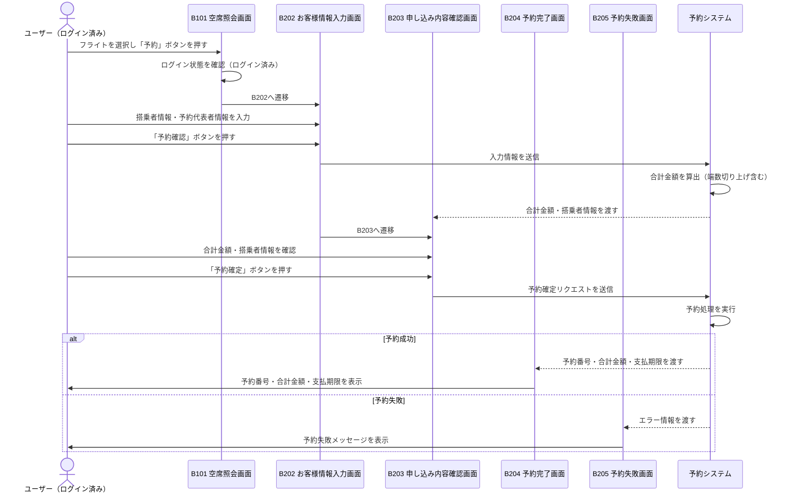

# 課題9 テスト設計

対象機能：ATRS（航空チケット予約システム）チケット予約機能

---

## Step 1-1：シーケンス図（テストモデル）

ログイン済みユーザーが片道フライトを予約するフロー（B101→B202→B203→B204/B205）

---

## Step 1-2：テスト条件一覧（合計金額算出ルール）

算出式：
- 大人料金（12歳以上）：運賃 × 搭乗者数（12歳以上）
- 子供料金（12歳未満）：（基本運賃 × 60% − 運賃種別ごとの割引額）× 搭乗者数（12歳未満）
- 端数処理：合計金額の100円未満は切り上げ

### 正常系（有効パーティション）

| # | 同値クラス | テスト条件 | 期待結果 |
|---|-----------|-----------|---------|
| 1 | 年齢：12歳以上のみ | 搭乗者が大人1名（例：30歳） | 運賃 × 1 |
| 2 | 年齢：12歳以上のみ | 搭乗者が大人複数名（例：30歳×3名） | 運賃 × 3 |
| 3 | 年齢：12歳未満のみ | 搭乗者が子供1名（例：8歳） | （基本運賃×60%－割引額）× 1 |
| 4 | 年齢：12歳未満のみ | 搭乗者が子供複数名（例：5歳×2名） | （基本運賃×60%－割引額）× 2 |
| 5 | 年齢：混在 | 大人1名＋子供1名 | 大人料金 ＋ 子供料金 |
| 6 | 端数処理：切り上げ不要 | 合計金額の100円未満が0円 | そのままの金額 |
| 7 | 端数処理：切り上げ必要 | 合計金額の100円未満が1〜99円 | 100円未満を切り上げた金額 |

### 異常系（無効パーティション）

| # | 同値クラス | テスト条件 | 期待結果 |
|---|-----------|-----------|---------|
| 8 | 搭乗者数：0人 | 大人0名・子供0名で予約操作 | エラー（予約不可） |
| 9 | 年齢：負の値 | 搭乗者の年齢に −1 を入力 | 入力エラー |
| 10 | 搭乗者数：負の値 | 搭乗者数に −1 を入力 | 入力エラー |
| 11 | 子供料金：マイナス | 割引額 > 基本運賃×60% となる運賃種別 | エラーまたは子供料金=0円（仕様要確認） |

---

## Step 2：テストケース一覧（最終版）

セルフレビュー（ISO/IEC/IEEE 29119-4 / JSTQB観点）により、同値分割法で網羅した初期案に対して、境界値分析（TC-BVA-01〜03）を追加した。

| TC-ID | 搭乗者の年齢構成 | 期待する合計金額の考え方 | 適用技法 |
|-------|----------------|----------------------|---------|
| TC-EP-01 | 大人1名（30歳） | 運賃F × 1（大人料金のみ） | 同値分割（有効A） |
| TC-EP-02 | 大人3名（25・35・45歳） | 運賃F × 3（大人料金の複数人） | 同値分割（有効A・複数） |
| TC-EP-03 | 子供1名（8歳） | （基本運賃B×60%−割引額D）× 1（子供料金のみ） | 同値分割（有効B） |
| TC-EP-04 | 子供2名（5・8歳） | （基本運賃B×60%−割引額D）× 2（子供料金の複数人） | 同値分割（有効B・複数） |
| TC-EP-05 | 大人1名（30歳）＋子供1名（8歳） | 運賃F×1 ＋（基本運賃B×60%−割引額D）×1 | 同値分割（混在） |
| TC-EP-06 | 大人1名（30歳）・端数なし | 100円未満=0円 → 切り上げなし | 同値分割（端数） |
| TC-EP-07 | 大人1名（30歳）・端数あり | 100円未満=1〜99円 → 100円に切り上げ | 同値分割（端数） |
| TC-EP-08 | 搭乗者0名 | 入力エラー（合計金額を算出しない） | 同値分割（無効） |
| TC-EP-09 | 年齢 −1歳を入力 | 入力エラー（負の値は無効） | 同値分割（無効） |
| TC-EP-10 | 割引額D > 基本運賃B×60% の子供1名 | エラーまたは子供料金=0円（仕様確認要） | 同値分割（無効） |
| TC-BVA-01 | 子供1名（**11歳**） | 12歳未満クラスの上限（off-point）→ 子供料金（基本運賃B×60%−割引額D）×1 が適用される | 境界値分析 |
| TC-BVA-02 | 大人1名（**12歳**） | 12歳以上クラスの下限（on-point）→ 大人料金（運賃F×1）が適用される | 境界値分析 |
| TC-BVA-03 | 大人1名（**13歳**） | 12歳以上クラスの近傍値（in-point）→ 大人料金（運賃F×1）が適用される | 境界値分析 |

### セルフレビュー結果サマリ

| チェック項目 | 結果 | 対応TC |
|------------|------|-------|
| 同値分割：有効クラスA（12歳以上） | ✅ カバー済み | TC-EP-01, TC-EP-02 |
| 同値分割：有効クラスB（12歳未満） | ✅ カバー済み | TC-EP-03, TC-EP-04 |
| 同値分割：混在 | ✅ カバー済み | TC-EP-05 |
| 同値分割：無効クラス | ✅ カバー済み | TC-EP-08, TC-EP-09, TC-EP-10 |
| 境界値分析：11歳（off-point） | ✅ 追加済み | TC-BVA-01 |
| 境界値分析：12歳（on-point） | ✅ 追加済み | TC-BVA-02 |
| 境界値分析：13歳（in-point） | ✅ 追加済み | TC-BVA-03 |
