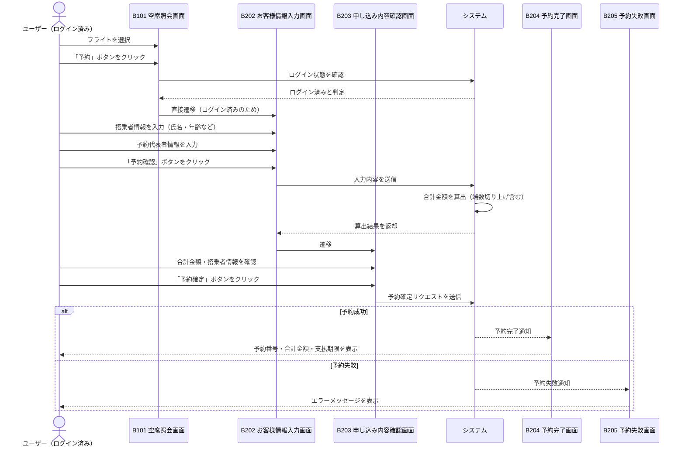

# 課題9 テスト設計

## Step 1：シーケンス図（テストモデル）

---

## Step 1：テスト条件一覧（同値分割法）

### 有効同値パーティション（正常系）

| ID | 観点 | 同値クラス | 期待結果 |
|----|------|-----------|----------|
| V1 | 年齢区分 | 全員が12歳以上 | 運賃 × 人数 のみ適用 |
| V2 | 年齢区分 | 全員が12歳未満 | （基本運賃×60%−割引額）× 人数 のみ適用 |
| V3 | 年齢区分 | 12歳以上と12歳未満の混在 | 大人料金＋小児料金の合算 |
| V4 | 搭乗者数（大人） | 1名 | 単人計算が正しく適用される |
| V5 | 搭乗者数（大人） | 2名以上 | 人数倍率の計算が正しく適用される |
| V6 | 搭乗者数（小児） | 1名 | 単人計算が正しく適用される |
| V7 | 搭乗者数（小児） | 2名以上 | 人数倍率の計算が正しく適用される |
| V8 | 端数処理 | 合計金額が100円の倍数（端数なし） | 切り上げなし、そのままの金額 |
| V9 | 端数処理 | 合計金額に1〜99円の端数あり | 100円単位に切り上げ |

### 無効同値パーティション（異常系）

| ID | 観点 | 同値クラス | 期待結果 |
|----|------|-----------|----------|
| I1 | 搭乗者数 | 合計搭乗者数が0名 | エラー（予約不可） |
| I2 | 搭乗者数 | 12歳以上が負の値 | 入力エラー |
| I3 | 搭乗者数 | 12歳未満が負の値 | 入力エラー |
| I4 | 年齢 | 年齢が負の値 | 入力エラー（不正な年齢） |
| I5 | 運賃 | 運賃が0以下 | 計算エラー（不正な運賃値） |

---

## Step 2：テストケース表（全13件）

### 作成方針

- **同値分割法（EP）**：各同値クラスから代表値を1つ選んでテストケースを作成
- **境界値分析（BVA）**：年齢境界（12歳）に対し3値BVA（11歳・12歳・13歳）を適用
- ISO/IEC/IEEE 29119-4 および JSTQB の観点でセルフレビューを実施し、不足分を追加

### テストケース一覧

| TC-ID | 搭乗者の年齢構成 | 期待する合計金額の考え方 | 適用技法 |
|-------|----------------|----------------------|---------|
| TC-EP-01 | 大人1名のみ（30歳） | 運賃 × 1 | EP（有効・大人のみ） |
| TC-EP-02 | 小児1名のみ（6歳） | （基本運賃×60%−割引額）× 1 | EP（有効・小児のみ） |
| TC-EP-03 | 大人1名＋小児1名 | 大人料金＋小児料金の合算 | EP（有効・混在） |
| TC-EP-04 | 搭乗者0名 | エラー（予約不可） | EP（無効） |
| TC-BVA-01 | 11歳1名 | 小児料金：（基本運賃×60%−割引額）× 1 | BVA（境界下側） |
| TC-BVA-02 | 12歳1名 | 大人料金：運賃 × 1 | BVA（境界値） |
| TC-BVA-03 | 13歳1名 | 大人料金：運賃 × 1 | BVA（境界上側） |
| TC-RD-01 | 大人1名（端数なし運賃） | 100の倍数がそのまま合計金額 | EP（端数なし） |
| TC-RD-02 | 大人1名（端数あり運賃） | 100円単位に切り上げ | EP（端数あり） |
| TC-ADD-01 | 大人2名（30歳×2） | 運賃 × 2 | EP（複数名） |
| TC-ADD-02 | 小児2名（6歳×2） | （基本運賃×60%−割引額）× 2 | EP（複数名） |
| TC-ADD-03 | 大人1名（端数1円になる運賃） | 切り上げにより＋99円が加算される | BVA（端数下端） |
| TC-ADD-04 | 大人1名（端数99円になる運賃） | 切り上げにより＋1円が加算される | BVA（端数上端） |

### セルフレビュー結果サマリー

| 観点 | 初期状態 | レビュー後 |
|------|---------|-----------|
| EP（年齢区分・構成） | ✅ 3クラス網羅 | ✅ |
| EP（搭乗者数） | ❌ 複数名未カバー | ✅ TC-ADD-01・02で補完 |
| EP（無効系） | ✅ 0名カバー | ✅ |
| BVA（年齢境界） | ✅ 3値BVA完全 | ✅ |
| BVA（端数境界） | ❌ 未着手 | ✅ TC-ADD-03・04で補完 |
